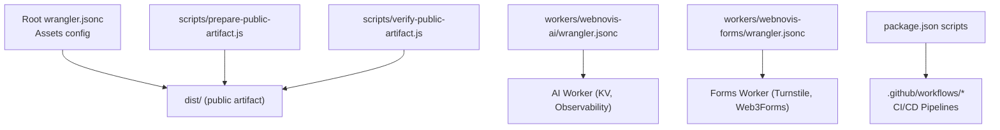
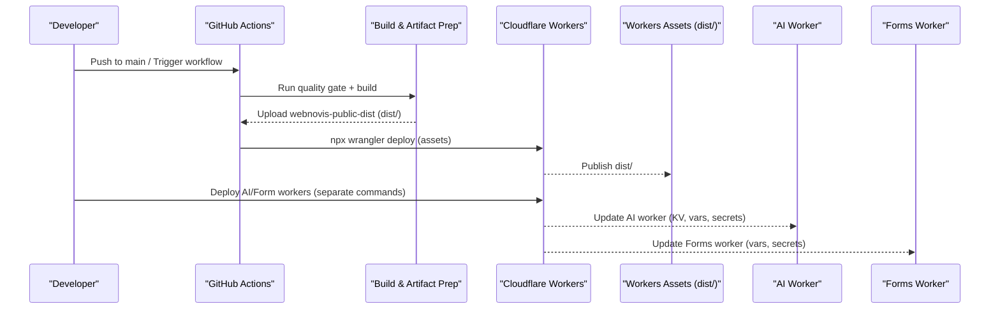
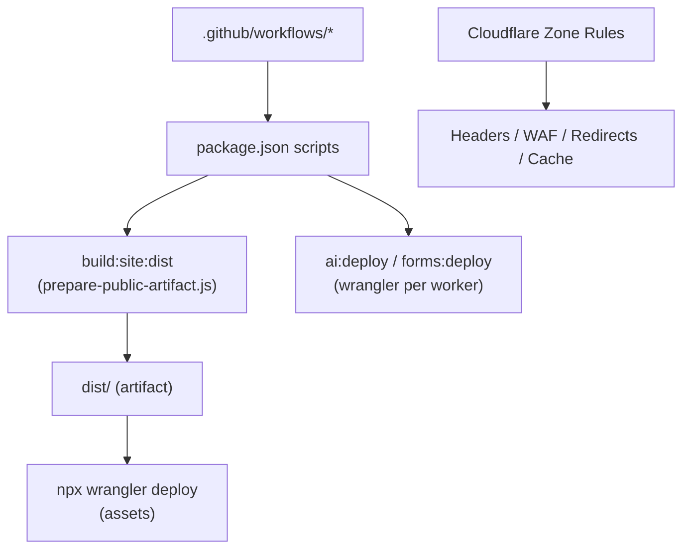

# Deployment Configuration

<cite>
**Referenced Files in This Document**
- [wrangler.jsonc](file://wrangler.jsonc)
- [workers/webnovis-ai/wrangler.jsonc](file://workers/webnovis-ai/wrangler.jsonc)
- [workers/webnovis-forms/wrangler.jsonc](file://workers/webnovis-forms/wrangler.jsonc)
- [.github/workflows/quality-gate.yml](file://.github/workflows/quality-gate.yml)
- [.github/workflows/lighthouse-ci.yml](file://.github/workflows/lighthouse-ci.yml)
- [.github/workflows/daily-blog.yml](file://.github/workflows/daily-blog.yml)
- [.github/workflows/weekly-pseo.yml](file://.github/workflows/weekly-pseo.yml)
- [package.json](file://package.json)
- [scripts/prepare-public-artifact.js](file://scripts/prepare-public-artifact.js)
- [scripts/verify-public-artifact.js](file://scripts/verify-public-artifact.js)
- [scripts/setup-cloudflare-ai.sh](file://scripts/setup-cloudflare-ai.sh)
- [docs/deploy/CLOUDFLARE-CONFIGURAZIONE-PASSO-PASSO.md](file://docs/deploy/CLOUDFLARE-CONFIGURAZIONE-PASSO-PASSO.md)
</cite>

## Table of Contents
1. [Introduction](#introduction)
2. [Project Structure](#project-structure)
3. [Core Components](#core-components)
4. [Architecture Overview](#architecture-overview)
5. [Detailed Component Analysis](#detailed-component-analysis)
6. [Dependency Analysis](#dependency-analysis)
7. [Performance Considerations](#performance-considerations)
8. [Troubleshooting Guide](#troubleshooting-guide)
9. [Conclusion](#conclusion)
10. [Appendices](#appendices)

## Introduction
This document explains the WebNovis deployment configuration system for Cloudflare Workers and GitHub Actions CI/CD. It covers:
- Cloudflare Workers configuration via wrangler.jsonc files (assets site, AI worker, forms worker)
- Build pipeline and artifact preparation
- GitHub Actions workflows for quality gates, performance checks, content generation, and SEO automation
- Environment-specific deployment guidance, validation, error handling, rollback strategies, security considerations, and troubleshooting

## Project Structure
The deployment surface is composed of:
- Root-level wrangler.jsonc for static assets deployment to Cloudflare Workers Assets
- Worker-specific wrangler.jsonc under workers/ for serverless endpoints
- package.json scripts orchestrating build, validation, and deploy steps
- .github/workflows/*.yml defining CI/CD pipelines
- Scripts that prepare a sanitized public artifact and validate it before deployment
- Documentation guiding Cloudflare zone configuration (headers, WAF, redirects, caching)

**Diagram sources**
- [wrangler.jsonc:1-30](file://wrangler.jsonc#L1-L30)
- [workers/webnovis-ai/wrangler.jsonc:1-26](file://workers/webnovis-ai/wrangler.jsonc#L1-L26)
- [workers/webnovis-forms/wrangler.jsonc:1-20](file://workers/webnovis-forms/wrangler.jsonc#L1-L20)
- [package.json:1-92](file://package.json#L1-L92)
- [scripts/prepare-public-artifact.js:1-280](file://scripts/prepare-public-artifact.js#L1-L280)
- [scripts/verify-public-artifact.js:164-193](file://scripts/verify-public-artifact.js#L164-L193)

**Section sources**
- [wrangler.jsonc:1-30](file://wrangler.jsonc#L1-L30)
- [workers/webnovis-ai/wrangler.jsonc:1-26](file://workers/webnovis-ai/wrangler.jsonc#L1-L26)
- [workers/webnovis-forms/wrangler.jsonc:1-20](file://workers/webnovis-forms/wrangler.jsonc#L1-L20)
- [package.json:1-92](file://package.json#L1-L92)
- [scripts/prepare-public-artifact.js:1-280](file://scripts/prepare-public-artifact.js#L1-L280)
- [scripts/verify-public-artifact.js:164-193](file://scripts/verify-public-artifact.js#L164-L193)

## Core Components
- Root assets deployment configuration (Cloudflare Workers Assets)
- AI worker configuration (KV, observability, Node compatibility)
- Forms worker configuration (environment variables, secrets)
- Build and artifact preparation script
- Public artifact verification and secret scanning
- CI/CD workflows (Quality Gate, Lighthouse, Weekly pSEO, Daily Blog)

Key responsibilities:
- Ensure deterministic builds with source date epoch and timezone
- Produce a minimal, validated dist/ artifact
- Enforce security headers and block sensitive paths at the edge
- Automate content generation and SEO tasks on schedule or manual trigger

**Section sources**
- [wrangler.jsonc:1-30](file://wrangler.jsonc#L1-L30)
- [workers/webnovis-ai/wrangler.jsonc:1-26](file://workers/webnovis-ai/wrangler.jsonc#L1-L26)
- [workers/webnovis-forms/wrangler.jsonc:1-20](file://workers/webnovis-forms/wrangler.jsonc#L1-L20)
- [scripts/prepare-public-artifact.js:1-280](file://scripts/prepare-public-artifact.js#L1-L280)
- [scripts/verify-public-artifact.js:164-193](file://scripts/verify-public-artifact.js#L164-L193)
- [.github/workflows/quality-gate.yml:1-47](file://.github/workflows/quality-gate.yml#L1-L47)
- [.github/workflows/lighthouse-ci.yml:1-27](file://.github/workflows/lighthouse-ci.yml#L1-L27)
- [.github/workflows/weekly-pseo.yml:1-120](file://.github/workflows/weekly-pseo.yml#L1-L120)
- [.github/workflows/daily-blog.yml:1-56](file://.github/workflows/daily-blog.yml#L1-L56)

## Architecture Overview
The deployment architecture combines static asset hosting on Cloudflare Workers Assets with two Cloudflare Workers for dynamic features. CI/CD ensures quality, performance, and automated content generation.

**Diagram sources**
- [.github/workflows/quality-gate.yml:1-47](file://.github/workflows/quality-gate.yml#L1-L47)
- [package.json:46-58](file://package.json#L46-L58)
- [wrangler.jsonc:1-30](file://wrangler.jsonc#L1-L30)
- [workers/webnovis-ai/wrangler.jsonc:1-26](file://workers/webnovis-ai/wrangler.jsonc#L1-L26)
- [workers/webnovis-forms/wrangler.jsonc:1-20](file://workers/webnovis-forms/wrangler.jsonc#L1-L20)

## Detailed Component Analysis

### Root Assets Deployment (wrangler.jsonc)
- Defines name, compatibility date, and assets directory pointing to dist/
- Disables automatic HTML trailing slash handling to preserve existing .html URLs
- Configures not_found_handling to serve a custom 404 page from dist/

Operational notes:
- The default behavior would redirect all .html URLs; disabled to avoid breaking SEO and canonical links
- Directory indexes are handled by rewrite rules in dist/_redirects

**Section sources**
- [wrangler.jsonc:1-30](file://wrangler.jsonc#L1-L30)

### AI Worker (workers/webnovis-ai/wrangler.jsonc)
- Main entry point and compatibility flags for Node.js environment
- Enables workers_dev and preview_urls for local development
- Observability enabled with full head sampling
- Variables include service name and environment
- KV namespace binding for sessions (auto-provisioned if id omitted)

Deployment tips:
- Use npm ai:deploy to prepare data and deploy
- Secrets managed via wrangler secret put (e.g., API keys)

**Section sources**
- [workers/webnovis-ai/wrangler.jsonc:1-26](file://workers/webnovis-ai/wrangler.jsonc#L1-L26)
- [package.json:54-58](file://package.json#L54-L58)
- [scripts/setup-cloudflare-ai.sh:1-42](file://scripts/setup-cloudflare-ai.sh#L1-L42)

### Forms Worker (workers/webnovis-forms/wrangler.jsonc)
- Main entry point and compatibility flags
- Development and preview URLs enabled
- Environment variables for allowed hostnames and Web3Forms endpoint
- Secrets management for Turnstile and optional access key override

Security note:
- TURNSTILE_HOSTNAMES must list production domains only (no localhost)
- Secrets should be set via wrangler secret put and never committed

**Section sources**
- [workers/webnovis-forms/wrangler.jsonc:1-20](file://workers/webnovis-forms/wrangler.jsonc#L1-L20)

### Build and Artifact Preparation (scripts/prepare-public-artifact.js)
Responsibilities:
- Materialize static sources into an isolated staging directory
- Generate geo pages, build assets, normalize HTML, update footer, rebuild search index and sitemap, generate LLMs indices, sync security headers
- Prune unreferenced media/fonts to minimize artifact size
- Validate pages and assert artifact integrity
- Promote staged artifact to publish root atomically with backup/rollback support
- Enforce SOURCE_DATE_EPOCH and TZ for deterministic builds

Error handling:
- Throws on symlink inputs, worktree mutations, and failed subprocesses
- Restores previous artifact on promotion failure

**Section sources**
- [scripts/prepare-public-artifact.js:1-280](file://scripts/prepare-public-artifact.js#L1-L280)

### Public Artifact Verification (scripts/verify-public-artifact.js)
Responsibilities:
- Assert artifact completeness and references
- Scan text-based files for secret-like patterns (private keys, tokens, JWTs)
- Fail fast if secrets are detected in the published artifact

**Section sources**
- [scripts/verify-public-artifact.js:164-193](file://scripts/verify-public-artifact.js#L164-L193)

### CI/CD Workflows

#### Quality Gate (.github/workflows/quality-gate.yml)
Triggers: push to main, pull requests, manual dispatch
Steps:
- Install dependencies and run ci:quality:dist
- Verify no tracked source mutation during build
- Upload sanitized public artifact (dist/)
- On non-PR pushes, verify production headers

**Section sources**
- [.github/workflows/quality-gate.yml:1-47](file://.github/workflows/quality-gate.yml#L1-L47)
- [package.json:46-50](file://package.json#L46-L50)

#### Lighthouse CI (.github/workflows/lighthouse-ci.yml)
Triggers: push to main, manual dispatch, weekly schedule
Steps:
- Run Lighthouse CI using lighthouserc.js
- Upload reports as artifacts

**Section sources**
- [.github/workflows/lighthouse-ci.yml:1-27](file://.github/workflows/lighthouse-ci.yml#L1-L27)

#### Weekly pSEO Generator (.github/workflows/weekly-pseo.yml)
Triggers: weekly cron, manual dispatch with force/skip options
Steps:
- Generate AI content blocks (optional force mode)
- Generate geo pages and normalize public HTML
- Build assets, rebuild search index and sitemap
- Validate page quality (blocking step)
- Run SEO monitoring report
- Submit URLs to IndexNow
- Commit and push generated changes

**Section sources**
- [.github/workflows/weekly-pseo.yml:1-120](file://.github/workflows/weekly-pseo.yml#L1-L120)

#### Daily Blog Writer (.github/workflows/daily-blog.yml)
Status: Automated scheduling suspended due to policy risks; available via manual dispatch with reduced defaults
Steps:
- Checkout, setup Node, install deps
- Run auto-writer with configurable count
- Commit and push new articles (must pass Quality Gate)

**Section sources**
- [.github/workflows/daily-blog.yml:1-56](file://.github/workflows/daily-blog.yml#L1-L56)

### Cloudflare Zone Configuration (Headers, WAF, Redirects, Cache)
- Transform Rules to enforce security headers (CSP Report-Only first, then strict CSP)
- WAF Custom Rule to block sensitive source paths and file types
- Single Redirect rule to canonicalize /index.html to /
- Optional Cache Rule for versioned assets with long TTL

Validation:
- npm run verify:prod-headers enforces correct headers and blocked paths

**Section sources**
- [docs/deploy/CLOUDFLARE-CONFIGURAZIONE-PASSO-PASSO.md:1-241](file://docs/deploy/CLOUDFLARE-CONFIGURAZIONE-PASSO-PASSO.md#L1-L241)

## Dependency Analysis
The deployment pipeline depends on:
- Node.js tooling and scripts for building and validating the artifact
- Wrangler CLI for deploying assets and workers
- GitHub Actions runners for CI/CD execution
- Cloudflare platform for hosting, headers, WAF, redirects, and caching

**Diagram sources**
- [package.json:46-58](file://package.json#L46-L58)
- [scripts/prepare-public-artifact.js:1-280](file://scripts/prepare-public-artifact.js#L1-L280)
- [wrangler.jsonc:1-30](file://wrangler.jsonc#L1-L30)
- [workers/webnovis-ai/wrangler.jsonc:1-26](file://workers/webnovis-ai/wrangler.jsonc#L1-L26)
- [workers/webnovis-forms/wrangler.jsonc:1-20](file://workers/webnovis-forms/wrangler.jsonc#L1-L20)
- [docs/deploy/CLOUDFLARE-CONFIGURAZIONE-PASSO-PASSO.md:1-241](file://docs/deploy/CLOUDFLARE-CONFIGURAZIONE-PASSO-PASSO.md#L1-L241)

**Section sources**
- [package.json:46-58](file://package.json#L46-L58)
- [scripts/prepare-public-artifact.js:1-280](file://scripts/prepare-public-artifact.js#L1-L280)
- [wrangler.jsonc:1-30](file://wrangler.jsonc#L1-L30)
- [workers/webnovis-ai/wrangler.jsonc:1-26](file://workers/webnovis-ai/wrangler.jsonc#L1-L26)
- [workers/webnovis-forms/wrangler.jsonc:1-20](file://workers/webnovis-forms/wrangler.jsonc#L1-L20)
- [docs/deploy/CLOUDFLARE-CONFIGURAZIONE-PASSO-PASSO.md:1-241](file://docs/deploy/CLOUDFLARE-CONFIGURAZIONE-PASSO-PASSO.md#L1-L241)

## Performance Considerations
- Deterministic builds via SOURCE_DATE_EPOCH and UTC timezone ensure reproducible artifacts
- Asset pruning removes unreferenced media/fonts to reduce bundle size
- Versioned assets with immutable cache rules improve browser caching when version bumping is applied
- Lighthouse CI monitors performance regressions on schedule and on push

[No sources needed since this section provides general guidance]

## Troubleshooting Guide
Common issues and resolutions:
- Missing production headers: Follow the step-by-step Cloudflare guide to add Transform Rules and verify with npm run verify:prod-headers
- Sensitive paths exposed: Configure WAF Custom Rule to block source directories and sensitive files
- URL redirects: Add Single Redirect for /index.html and legacy URLs
- Cache behavior: Enable Cache Rule for versioned CSS/JS with long TTL after implementing version bumping
- Secret leaks: Ensure verify-public-artifact.js passes; remove any secrets from tracked sources and use wrangler secrets for workers

**Section sources**
- [docs/deploy/CLOUDFLARE-CONFIGURAZIONE-PASSO-PASSO.md:1-241](file://docs/deploy/CLOUDFLARE-CONFIGURAZIONE-PASSO-PASSO.md#L1-L241)
- [scripts/verify-public-artifact.js:164-193](file://scripts/verify-public-artifact.js#L164-L193)

## Conclusion
WebNovis uses a robust, secure, and automated deployment strategy:
- Static assets built into a validated dist/ artifact and deployed via Cloudflare Workers Assets
- Two specialized Workers for AI and form handling with KV and secrets
- CI/CD pipelines enforcing quality, performance, and automated content generation
- Edge configuration ensuring security headers, blocking sensitive paths, and optimizing caching

Adhering to these practices ensures reliable multi-environment deployments, strong security posture, and maintainable operations.

[No sources needed since this section summarizes without analyzing specific files]

## Appendices

### Multi-Environment Deployment Guidance
- Development:
  - Use workers_dev and preview_urls for local testing
  - Set environment variables in wrangler.jsonc vars or via wrangler secret put
- Staging:
  - Duplicate wrangler configs with staging-specific vars and KV bindings
  - Use separate Cloudflare accounts or environments via wrangler profiles
- Production:
  - Pin compatibility_date and flags
  - Enforce strict CSP and WAF rules at the zone level
  - Use verified artifact and header checks in CI

[No sources needed since this section provides general guidance]

### Configuration Inheritance and Overrides
- Root wrangler.jsonc applies to assets deployment
- Worker-specific wrangler.jsonc overrides settings per worker
- Environment variables can be set in vars or injected via secrets
- CI/CD sets SOURCE_DATE_EPOCH and TZ for deterministic builds

**Section sources**
- [wrangler.jsonc:1-30](file://wrangler.jsonc#L1-L30)
- [workers/webnovis-ai/wrangler.jsonc:1-26](file://workers/webnovis-ai/wrangler.jsonc#L1-L26)
- [workers/webnovis-forms/wrangler.jsonc:1-20](file://workers/webnovis-forms/wrangler.jsonc#L1-L20)
- [scripts/prepare-public-artifact.js:183-197](file://scripts/prepare-public-artifact.js#L183-L197)

### Rollback Strategies
- Atomic promotion of staged artifact with backup and restore on failure
- Cloudflare Workers supports quick re-deployment of previous versions
- Maintain separate environments (dev/staging/prod) to isolate risk

**Section sources**
- [scripts/prepare-public-artifact.js:158-181](file://scripts/prepare-public-artifact.js#L158-L181)

### Security Considerations
- Never commit secrets; use wrangler secret put for Workers
- Block sensitive paths via Cloudflare WAF
- Enforce CSP via Transform Rules; start with Report-Only
- Verify artifact does not contain secret-like patterns
- Limit TURNSTILE_HOSTNAMES to production domains only

**Section sources**
- [scripts/setup-cloudflare-ai.sh:27-42](file://scripts/setup-cloudflare-ai.sh#L27-L42)
- [docs/deploy/CLOUDFLARE-CONFIGURAZIONE-PASSO-PASSO.md:28-100](file://docs/deploy/CLOUDFLARE-CONFIGURAZIONE-PASSO-PASSO.md#L28-L100)
- [scripts/verify-public-artifact.js:173-193](file://scripts/verify-public-artifact.js#L173-L193)
- [workers/webnovis-forms/wrangler.jsonc:11-14](file://workers/webnovis-forms/wrangler.jsonc#L11-L14)