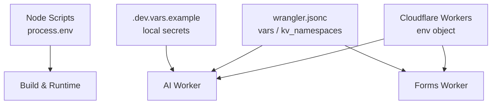
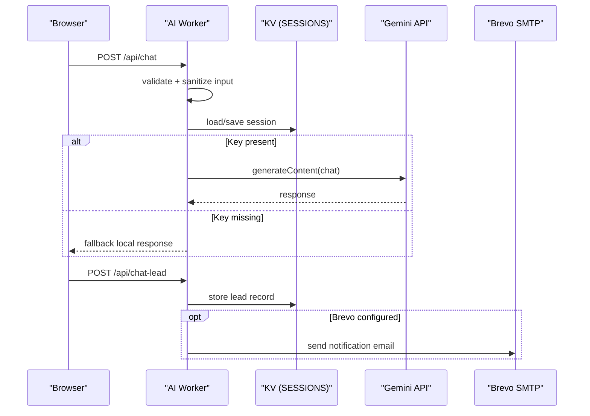
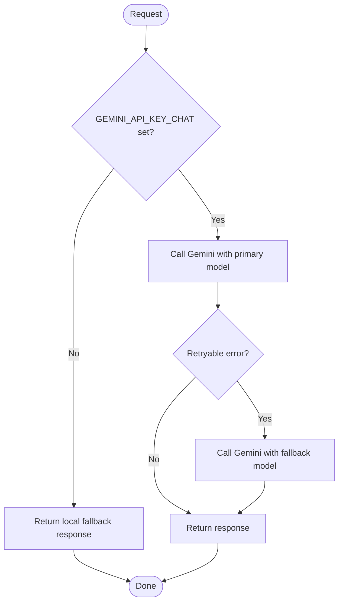
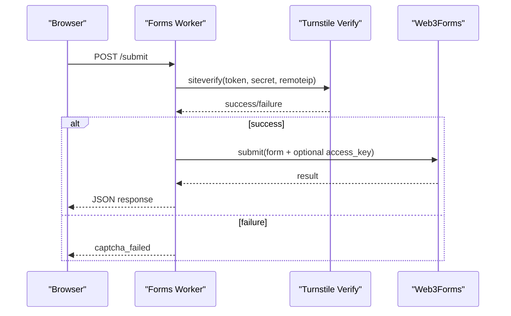
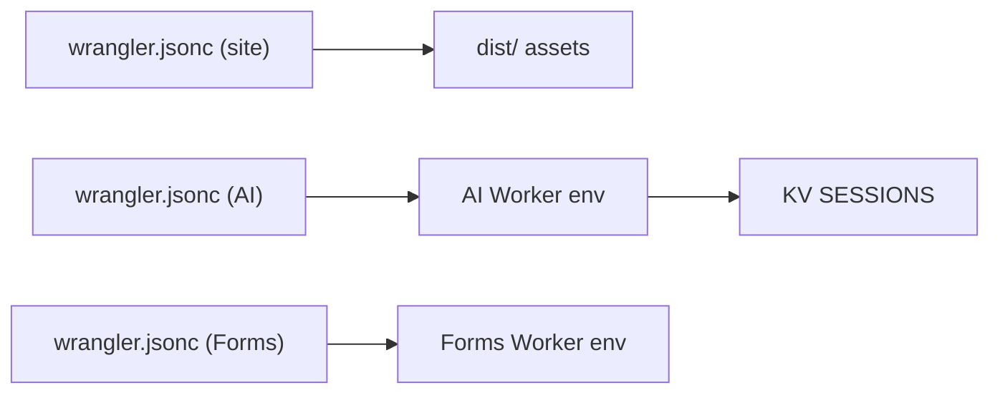
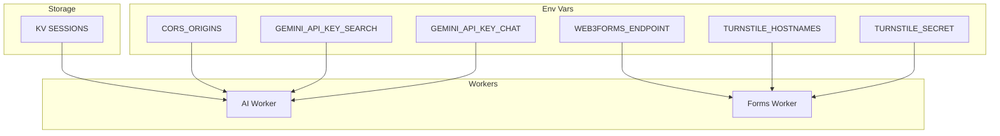

# Environment Variables

<cite>
**Referenced Files in This Document**
- [ai-config.js](file://ai-config.js)
- [auto-writer.js](file://blog/auto-writer.js)
- [index.js (AI Worker)](file://workers/webnovis-ai/src/index.js)
- [wrangler.jsonc (site assets)](file://wrangler.jsonc)
- [wrangler.jsonc (webnovis-ai worker)](file://workers/webnovis-ai/wrangler.jsonc)
- [wrangler.jsonc (webnovis-forms worker)](file://workers/webnovis-forms/wrangler.jsonc)
- [.dev.vars.example](file://workers/webnovis-ai/.dev.vars.example)
- [index.js (Forms Worker)](file://workers/webnovis-forms/src/index.js)
- [newsletter-engine.js](file://newsletter-engine.js)
- [generate-sitemap.js](file://generate-sitemap.js)
- [verify-public-artifact.js](file://scripts/verify-public-artifact.js)
- [security-and-legal-regressions.test.js](file://tests/security-and-legal-regressions.test.js)
</cite>

## Table of Contents
1. Introduction
2. Project Structure
3. Core Components
4. Architecture Overview
5. Detailed Component Analysis
6. Dependency Analysis
7. Performance Considerations
8. Troubleshooting Guide
9. Conclusion
10. Appendices

## Introduction
This document explains how WebNovis manages environment variables and secrets across the Node build/runtime, Cloudflare Workers, and CI/build scripts. It focuses on required API keys for Gemini services (chat, search, writer), form submission security via Turnstile, email delivery via Brevo, and other operational variables. It also covers environment-specific configuration patterns, secret handling best practices, validation and defaults, Cloudflare Workers integration through wrangler.jsonc, migration and rotation strategies, and troubleshooting guidance.

## Project Structure
Environment configuration is split between:
- Node runtime and build scripts that read process.env at startup or during execution.
- Cloudflare Workers that receive secrets and vars from the platform and access them via the env object.
- Local development helpers such as .dev.vars for Wrangler dev.

**Diagram sources**
- [wrangler.jsonc (site assets):1-30](file://wrangler.jsonc#L1-L30)
- [wrangler.jsonc (webnovis-ai worker):1-26](file://workers/webnovis-ai/wrangler.jsonc#L1-L26)
- [wrangler.jsonc (webnovis-forms worker):1-20](file://workers/webnovis-forms/wrangler.jsonc#L1-L20)
- [.dev.vars.example:1-9](file://workers/webnovis-ai/.dev.vars.example#L1-L9)

**Section sources**
- [wrangler.jsonc:1-30](file://wrangler.jsonc#L1-L30)
- [wrangler.jsonc (webnovis-ai worker):1-26](file://workers/webnovis-ai/wrangler.jsonc#L1-L26)
- [wrangler.jsonc (webnovis-forms worker):1-20](file://workers/webnovis-forms/wrangler.jsonc#L1-L20)
- [.dev.vars.example:1-9](file://workers/webnovis-ai/.dev.vars.example#L1-L9)

## Core Components
- AI configuration and model selection are centralized to avoid scattered constants and to keep environment-driven behavior consistent.
- The AI Worker exposes chat, search, and lead endpoints and reads per-feature API keys from the environment.
- The Forms Worker validates Turnstile tokens server-side and forwards submissions to an upstream service with optional access key injection.
- Build and automation scripts consume additional environment variables for scheduling, publishing, and external integrations.

Key responsibilities:
- Separate Gemini API keys by purpose to isolate usage and simplify rotation.
- Provide fallback behaviors when secrets are missing or APIs fail.
- Enforce rate limiting, CORS, and input sanitization in workers.
- Keep secrets out of source control; use platform secrets and local-only files.

**Section sources**
- [ai-config.js:1-38](file://ai-config.js#L1-L38)
- [index.js (AI Worker):1-544](file://workers/webnovis-ai/src/index.js#L1-L544)
- [index.js (Forms Worker):1-172](file://workers/webnovis-forms/src/index.js#L1-L172)
- [auto-writer.js:1-800](file://blog/auto-writer.js#L1-L800)

## Architecture Overview
The system uses a clear separation between public configuration and secrets:
- Public config (e.g., models, prompts, allowed origins) can be code or data files.
- Secrets (API keys, tokens, admin secrets) are injected at runtime by the platform or local tooling.

**Diagram sources**
- [index.js (AI Worker):198-247](file://workers/webnovis-ai/src/index.js#L198-L247)
- [index.js (AI Worker):266-368](file://workers/webnovis-ai/src/index.js#L266-L368)
- [index.js (AI Worker):442-506](file://workers/webnovis-ai/src/index.js#L442-L506)

## Detailed Component Analysis

### Gemini API Keys and Usage
- Chatbot uses GEMINI_API_KEY_CHAT. If absent, the worker returns a deterministic local response and marks it as fallback.
- Search AI uses GEMINI_API_KEY_SEARCH, falling back to GEMINI_API_KEY_CHAT if needed.
- Writer script uses GEMINI_API_KEY_WRITER, with a fallback to GEMINI_API_KEY for legacy compatibility.
- Model choices and parameters are centralized in ai-config.js and mirrored in worker logic.

Validation and defaults:
- Missing keys trigger safe fallbacks rather than hard failures.
- Rate limits protect against abuse and cost spikes.
- Input sanitization and prompt injection filters reduce risk.

**Diagram sources**
- [index.js (AI Worker):311-368](file://workers/webnovis-ai/src/index.js#L311-L368)
- [index.js (AI Worker):198-247](file://workers/webnovis-ai/src/index.js#L198-L247)
- [ai-config.js:1-38](file://ai-config.js#L1-L38)

**Section sources**
- [index.js (AI Worker):311-368](file://workers/webnovis-ai/src/index.js#L311-L368)
- [index.js (AI Worker):198-247](file://workers/webnovis-ai/src/index.js#L198-L247)
- [ai-config.js:1-38](file://ai-config.js#L1-L38)
- [auto-writer.js:44-49](file://blog/auto-writer.js#L44-L49)

### Forms Worker: Turnstile and Upstream Delivery
- Requires TURNSTILE_SECRET (secret).
- Accepts TURNSTILE_HOSTNAMES (var) to restrict which hostnames are allowed by siteverify.
- Forwards validated forms to WEB3FORMS_ENDPOINT and optionally injects WEB3FORMS_ACCESS_KEY if provided.
- Validates token presence, length, hostname match, and action values.

**Diagram sources**
- [index.js (Forms Worker):36-85](file://workers/webnovis-forms/src/index.js#L36-L85)
- [index.js (Forms Worker):130-169](file://workers/webnovis-forms/src/index.js#L130-L169)
- [wrangler.jsonc (webnovis-forms worker):8-19](file://workers/webnovis-forms/wrangler.jsonc#L8-L19)

**Section sources**
- [index.js (Forms Worker):36-85](file://workers/webnovis-forms/src/index.js#L36-L85)
- [index.js (Forms Worker):130-169](file://workers/webnovis-forms/src/index.js#L130-L169)
- [wrangler.jsonc (webnovis-forms worker):8-19](file://workers/webnovis-forms/wrangler.jsonc#L8-L19)

### Cloudflare Workers Configuration and Integration
- Site assets worker (static hosting) does not define vars/secrets here; it serves built artifacts from dist/.
- AI worker defines vars (SERVICE_NAME, ENVIRONMENT) and KV binding for sessions/rate-limit/cache.
- Forms worker defines vars for hostnames and endpoint, plus comments indicating secrets managed via wrangler secret commands.

**Diagram sources**
- [wrangler.jsonc (site assets):22-28](file://wrangler.jsonc#L22-L28)
- [wrangler.jsonc (webnovis-ai worker):15-25](file://workers/webnovis-ai/wrangler.jsonc#L15-L25)
- [wrangler.jsonc (webnovis-forms worker):8-19](file://workers/webnovis-forms/wrangler.jsonc#L8-L19)

**Section sources**
- [wrangler.jsonc:22-28](file://wrangler.jsonc#L22-L28)
- [wrangler.jsonc (webnovis-ai worker):15-25](file://workers/webnovis-ai/wrangler.jsonc#L15-L25)
- [wrangler.jsonc (webnovis-forms worker):8-19](file://workers/webnovis-forms/wrangler.jsonc#L8-L19)

### Build and Automation Environment Variables
- Sitemap generation supports SOURCE_DATE_EPOCH and BUILD_DATE for deterministic timestamps.
- IndexNow integration uses INDEXNOW_KEY.
- Newsletter engine uses NEWSLETTER_ADMIN_SECRET and Brevo credentials.
- Auto-writer uses GEMINI_API_KEY_WRITER and GROQ_API_KEY for content generation.

**Section sources**
- [generate-sitemap.js:164-168](file://generate-sitemap.js#L164-L168)
- [indexnow-submit.js:39-39](file://indexnow-submit.js#L39-L39)
- [newsletter-engine.js:49-53](file://newsletter-engine.js#L49-L53)
- [auto-writer.js:44-49](file://blog/auto-writer.js#L44-L49)

## Dependency Analysis
- AI Worker depends on:
  - GEMINI_API_KEY_CHAT and GEMINI_API_KEY_SEARCH for LLM calls.
  - KV namespace SESSIONS for sessions, rate limiting, and search cache.
  - Optional BREVO_* variables for lead notifications.
  - CORS_ORIGINS for cross-origin policy.
- Forms Worker depends on:
  - TURNSTILE_SECRET (secret) and TURNSTILE_HOSTNAMES (var).
  - WEB3FORMS_ENDPOINT and optional WEB3FORMS_ACCESS_KEY.
- Build scripts depend on:
  - SOURCE_DATE_EPOCH, BUILD_DATE, INDEXNOW_KEY, NEWSLETTER_ADMIN_SECRET, and various provider keys.

**Diagram sources**
- [index.js (AI Worker):80-105](file://workers/webnovis-ai/src/index.js#L80-L105)
- [index.js (AI Worker):141-151](file://workers/webnovis-ai/src/index.js#L141-L151)
- [index.js (AI Worker):311-395](file://workers/webnovis-ai/src/index.js#L311-L395)
- [index.js (Forms Worker):36-85](file://workers/webnovis-forms/src/index.js#L36-L85)
- [wrangler.jsonc (webnovis-ai worker):15-25](file://workers/webnovis-ai/wrangler.jsonc#L15-L25)
- [wrangler.jsonc (webnovis-forms worker):8-19](file://workers/webnovis-forms/wrangler.jsonc#L8-L19)

**Section sources**
- [index.js (AI Worker):80-105](file://workers/webnovis-ai/src/index.js#L80-L105)
- [index.js (AI Worker):141-151](file://workers/webnovis-ai/src/index.js#L141-L151)
- [index.js (AI Worker):311-395](file://workers/webnovis-ai/src/index.js#L311-L395)
- [index.js (Forms Worker):36-85](file://workers/webnovis-forms/src/index.js#L36-L85)
- [wrangler.jsonc (webnovis-ai worker):15-25](file://workers/webnovis-ai/wrangler.jsonc#L15-L25)
- [wrangler.jsonc (webnovis-forms worker):8-19](file://workers/webnovis-forms/wrangler.jsonc#L8-L19)

## Performance Considerations
- Use separate Gemini keys per feature to distribute quota and simplify rotation without affecting other features.
- Prefer lite models for search where appropriate to reduce latency and cost.
- Leverage KV for caching search results and rate limiting to minimize redundant API calls.
- Apply strict input validation and sanitization to reduce payload size and processing overhead.
- Configure CORS origins precisely to avoid unnecessary preflight traffic.

[No sources needed since this section provides general guidance]

## Troubleshooting Guide
Common issues and resolutions:
- Missing Gemini keys:
  - Symptoms: chat/search returns fallback responses or errors.
  - Resolution: ensure GEMINI_API_KEY_CHAT and GEMINI_API_KEY_SEARCH are set in the worker environment; verify via health endpoints and logs.
- Turnstile verification failures:
  - Symptoms: captcha_failed with codes like turnstile_secret_missing, hostname_mismatch, action_mismatch.
  - Resolution: set TURNSTILE_SECRET and correct TURNSTILE_HOSTNAMES; ensure client sends matching action and token.
- CORS errors:
  - Symptoms: browser blocks requests due to origin mismatch.
  - Resolution: configure CORS_ORIGINS to include your frontend domains; verify via health and network tab.
- Build-time secrets leakage:
  - Ensure no secrets are committed; use .gitignore and CI scanning.
  - The artifact verifier scans for known secret patterns to prevent leaks.

Operational checks:
- Health endpoints:
  - AI Worker: GET /health returns status, service name, corpus size.
  - Forms Worker: GET /health indicates service name and whether Turnstile is configured.

Secret hygiene:
- Never commit .env or .dev.vars.
- Use platform secrets for production; use .dev.vars only locally.
- Rotate keys by updating platform secrets and redeploying; update local .dev.vars as needed.

**Section sources**
- [index.js (AI Worker):519-541](file://workers/webnovis-ai/src/index.js#L519-L541)
- [index.js (Forms Worker):95-101](file://workers/webnovis-forms/src/index.js#L95-L101)
- [verify-public-artifact.js:173-193](file://scripts/verify-public-artifact.js#L173-L193)
- [.dev.vars.example:1-9](file://workers/webnovis-ai/.dev.vars.example#L1-L9)

## Conclusion
WebNovis centralizes environment configuration and enforces strong separation between public settings and secrets. Gemini API keys are scoped per feature, workers implement robust fallbacks and rate limiting, and Cloudflare Workers integrate cleanly via wrangler.jsonc vars and KV. Build scripts consume additional variables deterministically. Following the recommended practices—platform secrets, minimal permissions, precise CORS, and automated scanning—ensures secure, reliable operation across environments.

[No sources needed since this section summarizes without analyzing specific files]

## Appendices

### Required Environment Variables Summary
- AI Worker:
  - GEMINI_API_KEY_CHAT: required for chat endpoint; fallback used if missing.
  - GEMINI_API_KEY_SEARCH: required for search endpoint; falls back to chat key if present.
  - BREVO_API_KEY, BREVO_SENDER_EMAIL, BREVO_SENDER_NAME, BREVO_NOTIFICATION_EMAIL: optional for lead notifications.
  - CORS_ORIGINS: comma-separated list of allowed origins.
  - SESSIONS (KV binding): required for sessions, rate limiting, and search cache.
- Forms Worker:
  - TURNSTILE_SECRET: secret required for Turnstile verification.
  - TURNSTILE_HOSTNAMES: var specifying allowed hostnames.
  - WEB3FORMS_ENDPOINT: upstream endpoint for form submission.
  - WEB3FORMS_ACCESS_KEY: optional override to inject server-side.
- Node scripts:
  - GEMINI_API_KEY_WRITER, GROQ_API_KEY: auto-writer content generation.
  - SOURCE_DATE_EPOCH, BUILD_DATE: deterministic sitemap dates.
  - INDEXNOW_KEY: search engine indexing.
  - NEWSLETTER_ADMIN_SECRET: newsletter admin protection.

**Section sources**
- [index.js (AI Worker):311-395](file://workers/webnovis-ai/src/index.js#L311-L395)
- [index.js (AI Worker):470-503](file://workers/webnovis-ai/src/index.js#L470-L503)
- [index.js (Forms Worker):36-85](file://workers/webnovis-forms/src/index.js#L36-L85)
- [wrangler.jsonc (webnovis-forms worker):8-19](file://workers/webnovis-forms/wrangler.jsonc#L8-L19)
- [auto-writer.js:44-49](file://blog/auto-writer.js#L44-L49)
- [generate-sitemap.js:164-168](file://generate-sitemap.js#L164-L168)
- [indexnow-submit.js:39-39](file://indexnow-submit.js#L39-L39)
- [newsletter-engine.js:49-53](file://newsletter-engine.js#L49-L53)

### Environment-Specific Configuration Patterns
- Development:
  - Use .dev.vars for local secrets when running wrangler dev.
  - Allow localhost origins in CORS for local testing.
- Staging:
  - Set staging-specific TURNSTILE_HOSTNAMES and CORS_ORIGINS.
  - Use dedicated KV namespaces and API keys for isolation.
- Production:
  - Pin exact hostnames and origins.
  - Enable observability and head sampling in worker config.
  - Ensure all secrets are set via platform secret management.

**Section sources**
- [.dev.vars.example:1-9](file://workers/webnovis-ai/.dev.vars.example#L1-L9)
- [index.js (AI Worker):26-33](file://workers/webnovis-ai/src/index.js#L26-L33)
- [wrangler.jsonc (webnovis-ai worker):11-18](file://workers/webnovis-ai/wrangler.jsonc#L11-L18)

### Secret Handling and Security Best Practices
- Store secrets in platform secret stores (Wrangler secrets) and never commit them.
- Validate inputs and sanitize outputs to mitigate injection risks.
- Use least-privilege keys per service (chat vs search vs writer).
- Run artifact scanning to detect accidental secret inclusion.
- Restrict CORS to known origins and enforce hostname checks for CAPTCHA flows.

**Section sources**
- [verify-public-artifact.js:173-193](file://scripts/verify-public-artifact.js#L173-L193)
- [index.js (AI Worker):35-65](file://workers/webnovis-ai/src/index.js#L35-L65)
- [index.js (Forms Worker):36-85](file://workers/webnovis-forms/src/index.js#L36-L85)
- [security-and-legal-regressions.test.js:13-39](file://tests/security-and-legal-regressions.test.js#L13-L39)

### Migration and Rotation Strategies
- Migration:
  - Add new variables gradually; provide fallbacks where possible.
  - Update wrangler.jsonc vars and KV bindings before deploying code changes.
- Rotation:
  - Rotate Gemini keys per feature independently to limit blast radius.
  - Update platform secrets and redeploy; update local .dev.vars for developers.
  - Validate post-deploy using health endpoints and sample requests.

**Section sources**
- [ai-config.js:33-37](file://ai-config.js#L33-L37)
- [index.js (AI Worker):311-395](file://workers/webnovis-ai/src/index.js#L311-L395)
- [wrangler.jsonc (webnovis-ai worker):15-25](file://workers/webnovis-ai/wrangler.jsonc#L15-L25)