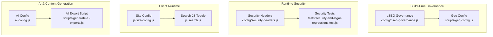
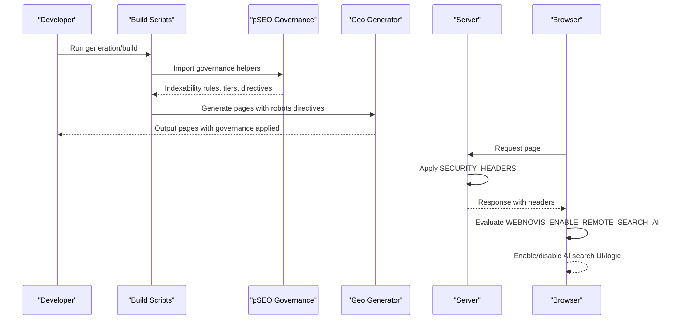
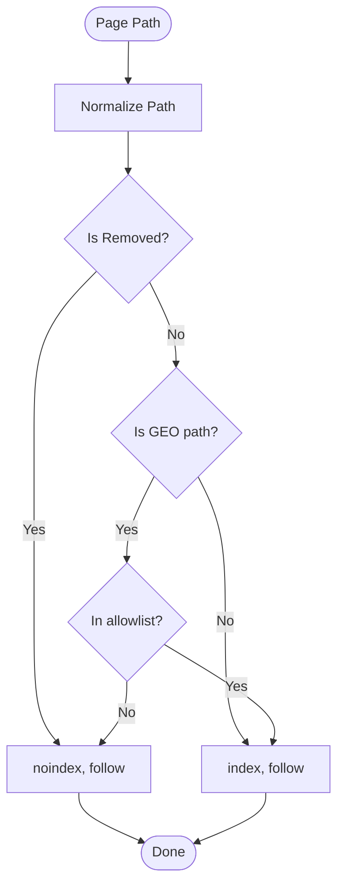
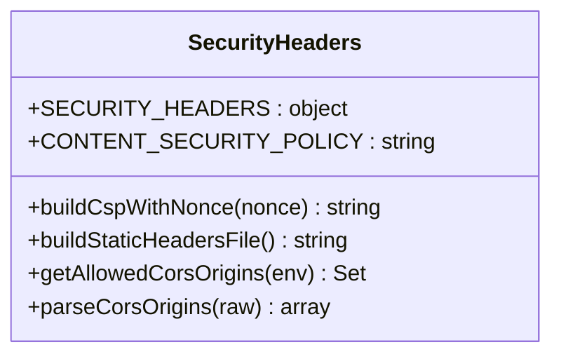
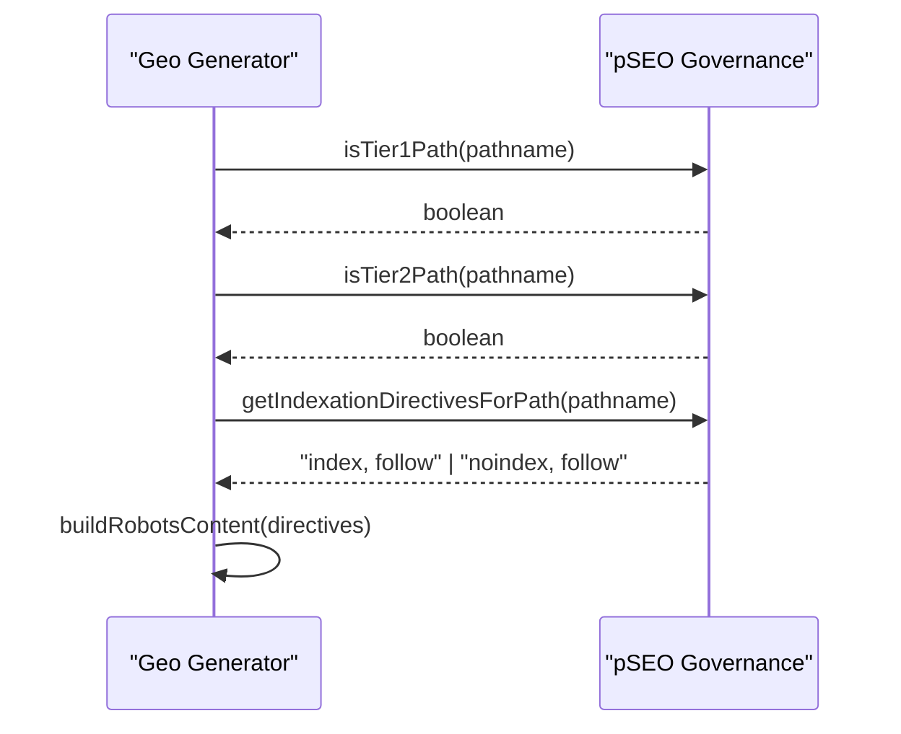
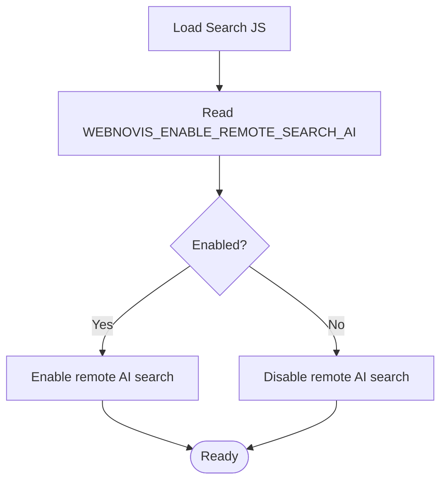
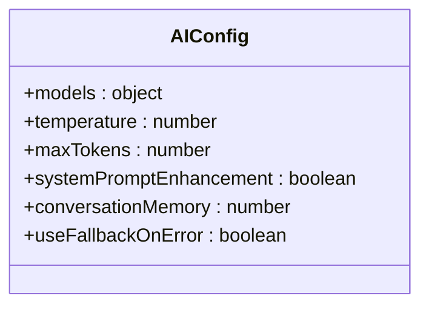
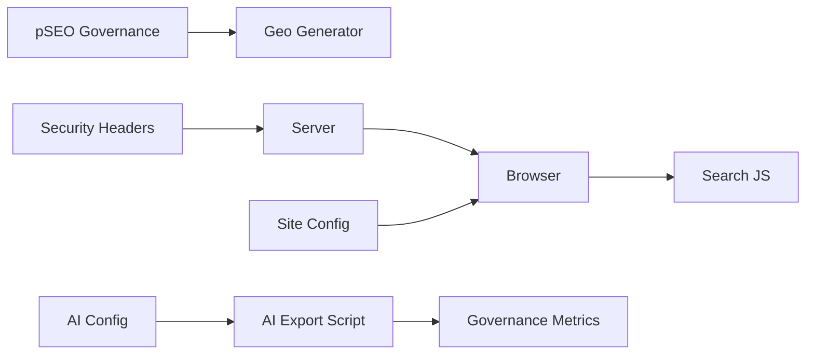

# Feature Flags & A/B Testing

<cite>
**Referenced Files in This Document**
- [config/pseo-governance.js](file://config/pseo-governance.js)
- [config/security-headers.js](file://config/security-headers.js)
- [scripts/geo/config.js](file://scripts/geo/config.js)
- [js/site-config.js](file://js/site-config.js)
- [js/search.js](file://js/search.js)
- [ai-config.js](file://ai-config.js)
- [scripts/generate-ai-exports.js](file://scripts/generate-ai-exports.js)
- [tests/security-and-legal-regressions.test.js](file://tests/security-and-legal-regressions.test.js)
</cite>

## Table of Contents
1. Introduction
2. Project Structure
3. Core Components
4. Architecture Overview
5. Detailed Component Analysis
6. Dependency Analysis
7. Performance Considerations
8. Troubleshooting Guide
9. Conclusion
10. Appendices

## Introduction
This document explains how WebNovis implements governance-based feature flags and related configuration that control SEO features, content generation behavior, and experimental functionality. It focuses on:
- Governance-driven indexation and page-tiering via pSEO governance
- Security headers configuration and its relationship to feature availability
- Runtime toggles for client-side features (e.g., AI search)
- Rollout strategies and gradual deployment patterns
- A/B testing guidance and result tracking approaches
- Best practices for creating, managing, and debugging feature flags

The goal is to provide a clear, code-backed reference for safely enabling or disabling features at build time, runtime, and edge layers while maintaining security and performance.

## Project Structure
Feature-related configuration spans several layers:
- Build-time governance: controls which generated pages are indexable and how they are treated by search engines
- Server/runtime security: centralizes security headers and CORS policy
- Client runtime toggles: public site config and feature switches in browser scripts
- AI/content generation flags: model selection and experimental flags used by build and export scripts

**Diagram sources**
- [config/pseo-governance.js:1-311](file://config/pseo-governance.js#L1-L311)
- [scripts/geo/config.js:1-114](file://scripts/geo/config.js#L1-L114)
- [config/security-headers.js:1-113](file://config/security-headers.js#L1-L113)
- [tests/security-and-legal-regressions.test.js:1-39](file://tests/security-and-legal-regressions.test.js#L1-L39)
- [js/site-config.js:1-19](file://js/site-config.js#L1-L19)
- [js/search.js:20-50](file://js/search.js#L20-L50)
- [ai-config.js:1-38](file://ai-config.js#L1-L38)
- [scripts/generate-ai-exports.js:80-125](file://scripts/generate-ai-exports.js#L80-L125)

**Section sources**
- [config/pseo-governance.js:1-311](file://config/pseo-governance.js#L1-L311)
- [config/security-headers.js:1-113](file://config/security-headers.js#L1-L113)
- [scripts/geo/config.js:1-114](file://scripts/geo/config.js#L1-L114)
- [js/site-config.js:1-19](file://js/site-config.js#L1-L19)
- [js/search.js:20-50](file://js/search.js#L20-L50)
- [ai-config.js:1-38](file://ai-config.js#L1-L38)
- [scripts/generate-ai-exports.js:80-125](file://scripts/generate-ai-exports.js#L80-L125)
- [tests/security-and-legal-regressions.test.js:1-39](file://tests/security-and-legal-regressions.test.js#L1-L39)

## Core Components
- pSEO governance module: defines allowlists and de-amplification rules for generated GEO pages; provides helpers to compute indexation directives and sitemap inclusion
- Security headers module: centralizes CSP, HSTS, X-Frame-Options, Permissions-Policy, and dynamic nonce-based CSP builder; also generates static header files for hosting platforms
- Geo generator config: consumes governance helpers to set robots directives and determine page tier during generation
- Site runtime config: exposes safe, public settings to the browser (e.g., form submission mode, Turnstile keys)
- Client feature toggle: enables/disables remote AI search based on a global flag
- AI configuration: selects models and parameters for chat, search, and writer; includes experimental flags and fallback behavior
- AI export script: marks exports as experimental and counts governed indexable URLs

**Section sources**
- [config/pseo-governance.js:18-311](file://config/pseo-governance.js#L18-L311)
- [config/security-headers.js:1-113](file://config/security-headers.js#L1-L113)
- [scripts/geo/config.js:6-14](file://scripts/geo/config.js#L6-L14)
- [js/site-config.js:1-19](file://js/site-config.js#L1-L19)
- [js/search.js:20-50](file://js/search.js#L20-L50)
- [ai-config.js:1-38](file://ai-config.js#L1-L38)
- [scripts/generate-ai-exports.js:80-125](file://scripts/generate-ai-exports.js#L80-L125)

## Architecture Overview
The system combines build-time governance with runtime toggles and server-side security policies:
- Build-time: pSEO governance determines which GEO pages are indexable and what robots directives to apply; geo generator uses these helpers to produce consistent output
- Runtime: client-side flags enable/disable features like remote AI search; server applies shared security headers and CORS policies
- AI/content: AI config drives model selection and behavior; export scripts mark outputs as experimental and reflect governance state

**Diagram sources**
- [config/pseo-governance.js:205-287](file://config/pseo-governance.js#L205-L287)
- [scripts/geo/config.js:62-78](file://scripts/geo/config.js#L62-L78)
- [config/security-headers.js:40-48](file://config/security-headers.js#L40-L48)
- [js/search.js:20-50](file://js/search.js#L20-L50)

## Detailed Component Analysis

### pSEO Governance Feature Flags
Governance acts as a feature flag system for SEO features:
- Tiered indexability: TIER 1, TIER 2, and data-validated paths define which GEO pages are fully indexable
- De-amplification: Non-allowlisted GEO paths receive noindex/follow treatment and are excluded from sitemaps
- Removed paths: Paths marked for removal remain noindex/follow until physically removed
- Helpers: Functions normalize paths, detect GEO patterns, compute directives, and check membership in allowlists

**Diagram sources**
- [config/pseo-governance.js:230-287](file://config/pseo-governance.js#L230-L287)

**Section sources**
- [config/pseo-governance.js:21-153](file://config/pseo-governance.js#L21-L153)
- [config/pseo-governance.js:171-229](file://config/pseo-governance.js#L171-L229)
- [config/pseo-governance.js:230-311](file://config/pseo-governance.js#L230-L311)

### Security Headers and Feature Availability
Security headers enforce secure defaults and restrict risky capabilities:
- HSTS, nosniff, X-Frame-Options, CSP, Referrer-Policy, Permissions-Policy
- Dynamic CSP with per-request nonce support for safer inline script execution
- Static header file generation for platform-specific deployments
- CORS origins can be extended via environment variables

**Diagram sources**
- [config/security-headers.js:1-113](file://config/security-headers.js#L1-L113)

**Section sources**
- [config/security-headers.js:1-113](file://config/security-headers.js#L1-L113)
- [tests/security-and-legal-regressions.test.js:13-31](file://tests/security-and-legal-regressions.test.js#L13-L31)

### Geo Generator Integration with Governance
The geo generator imports governance helpers to:
- Determine page tier (Tier 1, Tier 2, or none)
- Compute robots directives per page
- Re-export governance utilities for broader use

**Diagram sources**
- [scripts/geo/config.js:6-14](file://scripts/geo/config.js#L6-L14)
- [scripts/geo/config.js:62-78](file://scripts/geo/config.js#L62-L78)
- [config/pseo-governance.js:263-287](file://config/pseo-governance.js#L263-L287)

**Section sources**
- [scripts/geo/config.js:1-114](file://scripts/geo/config.js#L1-L114)
- [config/pseo-governance.js:263-287](file://config/pseo-governance.js#L263-L287)

### Client-Side Feature Toggles
- Remote AI search toggle: controlled by a global flag in the browser; when disabled, remote search logic is bypassed
- Site config: exposes safe, public settings such as form submission mode and Turnstile configuration

**Diagram sources**
- [js/search.js:20-50](file://js/search.js#L20-L50)

**Section sources**
- [js/search.js:20-50](file://js/search.js#L20-L50)
- [js/site-config.js:1-19](file://js/site-config.js#L1-L19)

### AI Configuration and Experimental Features
- Model selection: distinct models for chat, search, and writer with fallbacks
- Parameters: temperature and token limits for generation
- Behavior flags: system prompt enhancement, conversation memory, fallback usage
- Experimental markers: AI exports include an experimental flag to indicate non-guaranteed outcomes

**Diagram sources**
- [ai-config.js:1-38](file://ai-config.js#L1-L38)

**Section sources**
- [ai-config.js:1-38](file://ai-config.js#L1-L38)
- [scripts/generate-ai-exports.js:80-125](file://scripts/generate-ai-exports.js#L80-L125)

## Dependency Analysis
Key dependencies and relationships:
- Geo generator depends on pSEO governance for indexation decisions
- Server applies shared security headers; tests assert correct integration
- Client search logic depends on a runtime flag to enable/disable remote AI features
- AI export script references governance metrics to report indexable URL counts

**Diagram sources**
- [scripts/geo/config.js:6-14](file://scripts/geo/config.js#L6-L14)
- [tests/security-and-legal-regressions.test.js:13-31](file://tests/security-and-legal-regressions.test.js#L13-L31)
- [js/search.js:20-50](file://js/search.js#L20-L50)
- [scripts/generate-ai-exports.js:80-125](file://scripts/generate-ai-exports.js#L80-L125)

**Section sources**
- [scripts/geo/config.js:6-14](file://scripts/geo/config.js#L6-L14)
- [tests/security-and-legal-regressions.test.js:13-31](file://tests/security-and-legal-regressions.test.js#L13-L31)
- [js/search.js:20-50](file://js/search.js#L20-L50)
- [scripts/generate-ai-exports.js:80-125](file://scripts/generate-ai-exports.js#L80-L125)

## Performance Considerations
- Governance checks operate on Sets and RegExp patterns for fast lookups; avoid adding large unindexed lists
- Security headers should be centralized to prevent duplication and ensure consistent caching policies
- Client-side toggles should minimize conditional branches in hot paths to reduce overhead
- AI generation parameters (temperature, maxTokens) affect latency and cost; tune conservatively for production

[No sources needed since this section provides general guidance]

## Troubleshooting Guide
Common issues and diagnostics:
- Pages unexpectedly noindexed: verify path normalization and membership in allowlists; check de-amplified sets and removed paths
- Robots directives mismatch: confirm geo generator uses governance helpers to build robots content
- Security header inconsistencies: ensure server imports shared security config and applies it; validate against tests
- Remote AI search not working: check the runtime flag and network permissions; ensure CSP allows required domains
- AI export anomalies: confirm experimental flag and governance metrics are updated after changes

**Section sources**
- [config/pseo-governance.js:230-287](file://config/pseo-governance.js#L230-L287)
- [scripts/geo/config.js:62-78](file://scripts/geo/config.js#L62-L78)
- [tests/security-and-legal-regressions.test.js:13-31](file://tests/security-and-legal-regressions.test.js#L13-L31)
- [config/security-headers.js:31-48](file://config/security-headers.js#L31-L48)
- [js/search.js:20-50](file://js/search.js#L20-L50)
- [scripts/generate-ai-exports.js:80-125](file://scripts/generate-ai-exports.js#L80-L125)

## Conclusion
WebNovis employs a layered approach to feature control:
- Build-time governance ensures only approved GEO pages are indexable and properly directed
- Security headers enforce strict defaults and protect feature availability
- Client-side toggles enable safe experimentation without compromising core functionality
- AI configuration supports controlled rollout with fallbacks and experimental markers

Adopting these patterns helps maintain security, performance, and predictable rollouts while enabling iterative improvements.

[No sources needed since this section summarizes without analyzing specific files]

## Appendices

### Creating New Feature Flags
- For build-time features: add entries to governance allowlists or de-amplification sets; expose helper functions if needed
- For runtime features: define a public flag in site config or a global variable consumed by relevant modules
- For AI features: update AI config with new models or parameters; mark exports as experimental where appropriate

**Section sources**
- [config/pseo-governance.js:42-153](file://config/pseo-governance.js#L42-L153)
- [js/site-config.js:10-18](file://js/site-config.js#L10-L18)
- [ai-config.js:11-37](file://ai-config.js#L11-L37)

### Managing Feature Lifecycle
- Draft: implement behind a toggle or in a restricted allowlist
- Test: validate with local builds and tests; ensure security headers and robots directives are correct
- Gradual rollout: expand allowlists incrementally; monitor analytics and search console signals
- Mature: remove temporary toggles; consolidate into stable configuration

**Section sources**
- [config/pseo-governance.js:148-153](file://config/pseo-governance.js#L148-L153)
- [scripts/geo/config.js:62-78](file://scripts/geo/config.js#L62-L78)
- [tests/security-and-legal-regressions.test.js:13-31](file://tests/security-and-legal-regressions.test.js#L13-L31)

### Debugging Feature-Related Issues
- Verify path normalization and pattern matching for GEO pages
- Inspect computed robots directives and sitemap inclusion
- Confirm server applies shared security headers and CORS policies
- Check client flags and CSP allowances for third-party services

**Section sources**
- [config/pseo-governance.js:230-287](file://config/pseo-governance.js#L230-L287)
- [config/security-headers.js:40-62](file://config/security-headers.js#L40-L62)
- [js/search.js:20-50](file://js/search.js#L20-L50)

### Security Implications and Best Practices
- Keep sensitive configuration out of public artifacts; rely on shared server-side configs
- Use CSP with nonces to restrict inline scripts; whitelist only necessary domains
- Deny unnecessary permissions via Permissions-Policy
- Validate server integration with automated tests to prevent drift

**Section sources**
- [config/security-headers.js:31-48](file://config/security-headers.js#L31-L48)
- [tests/security-and-legal-regressions.test.js:13-31](file://tests/security-and-legal-regressions.test.js#L13-L31)