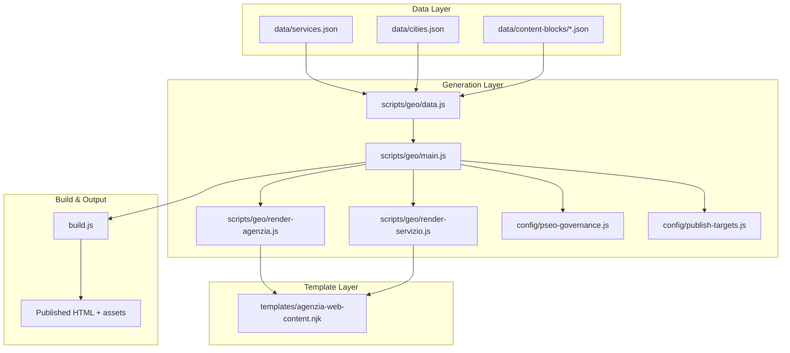
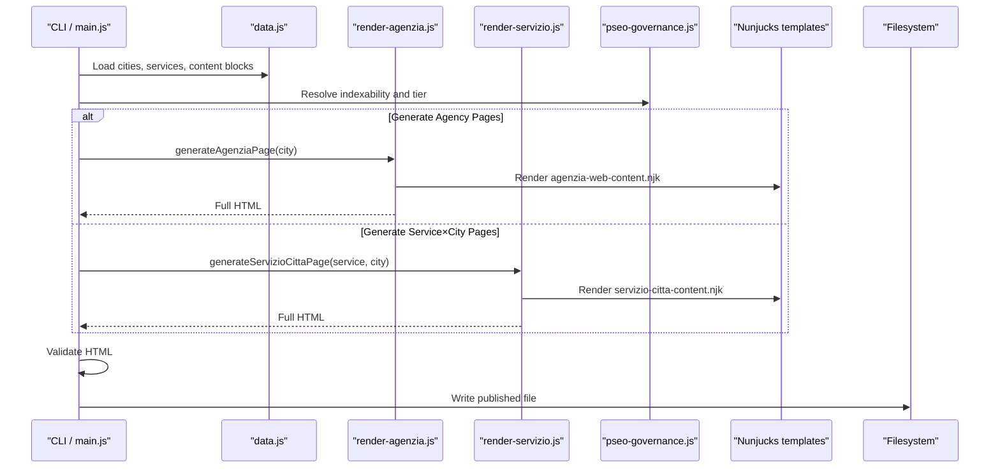
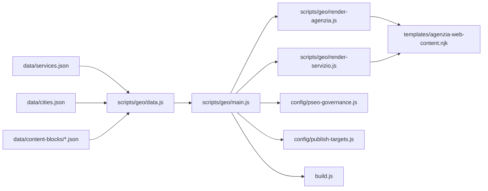
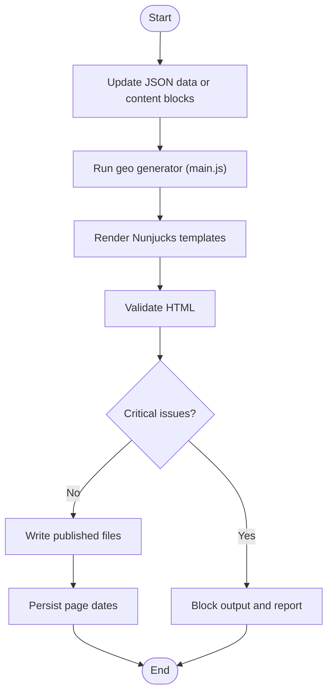

# Content Management System

<cite>
**Referenced Files in This Document**
- [services.json](file://data/services.json)
- [cities.json](file://data/cities.json)
- [milano.json](file://data/content-blocks/milano.json)
- [tier1-arese-seo-locale.json](file://data/content-blocks/tier1-arese-seo-locale.json)
- [main.js](file://scripts/geo/main.js)
- [data.js](file://scripts/geo/data.js)
- [render-agenzia.js](file://scripts/geo/render-agenzia.js)
- [render-servizio.js](file://scripts/geo/render-servizio.js)
- [pseo-governance.js](file://config/pseo-governance.js)
- [publish-targets.js](file://config/publish-targets.js)
- [build.js](file://build.js)
- [agenzia-web-content.njk](file://templates/agenzia-web-content.njk)
</cite>

## Table of Contents
1. Introduction
2. Project Structure
3. Core Components
4. Architecture Overview
5. Detailed Component Analysis
6. Dependency Analysis
7. Performance Considerations
8. Troubleshooting Guide
9. Conclusion
10. Appendices

## Introduction
This document explains the WebNovis content management system that generates location-specific pages at scale using JSON data and Nunjucks templates. It covers:
- JSON-based data structures for services, cities, and content blocks
- The Nunjucks template system for dynamic content generation
- Geo-targeted page generation across service×city combinations
- Validation, SEO governance, and error handling
- Multi-language support, localization, and SEO optimization features
- Best practices for content organization, naming conventions, and maintainability

## Project Structure
The system is organized around three pillars:
- Data layer: JSON catalogs for services, cities, and per-city content blocks
- Generation layer: Node scripts orchestrating page creation, validation, and output
- Template layer: Nunjucks templates rendering structured sections with data binding

**Diagram sources**
- [services.json](file://data/services.json)
- [cities.json](file://data/cities.json)
- [milano.json](file://data/content-blocks/milano.json)
- [tier1-arese-seo-locale.json](file://data/content-blocks/tier1-arese-seo-locale.json)
- [main.js](file://scripts/geo/main.js)
- [data.js](file://scripts/geo/data.js)
- [render-agenzia.js](file://scripts/geo/render-agenzia.js)
- [render-servizio.js](file://scripts/geo/render-servizio.js)
- [pseo-governance.js](file://config/pseo-governance.js)
- [publish-targets.js](file://config/publish-targets.js)
- [build.js](file://build.js)
- [agenzia-web-content.njk](file://templates/agenzia-web-content.njk)

**Section sources**
- [services.json](file://data/services.json)
- [cities.json](file://data/cities.json)
- [milano.json](file://data/content-blocks/milano.json)
- [tier1-arese-seo-locale.json](file://data/content-blocks/tier1-arese-seo-locale.json)
- [main.js](file://scripts/geo/main.js)
- [data.js](file://scripts/geo/data.js)
- [render-agenzia.js](file://scripts/geo/render-agenzia.js)
- [render-servizio.js](file://scripts/geo/render-servizio.js)
- [pseo-governance.js](file://config/pseo-governance.js)
- [publish-targets.js](file://config/publish-targets.js)
- [build.js](file://build.js)
- [agenzia-web-content.njk](file://templates/agenzia-web-content.njk)

## Core Components
- Services catalog (JSON): Defines each service’s slug, pricing, target keywords, tiers, and whether it has a static page or should be generated per city.
- Cities catalog (JSON): Centralized geographic data including coordinates, population, province, nearby cities, local context, images, and FAQs.
- Content blocks (JSON): Per-city AI-generated or hand-crafted editorial blocks used to enrich pages and avoid duplication.
- Geo generator (Node): Orchestrates generation of agency pages, realization pages, and service×city pages; validates outputs and writes files.
- Nunjucks templates: Render structured sections with data binding, supporting tiered content and partials.
- SEO governance: Allowlist-based indexation control to keep only strategic pages indexable while de-amplifying others.
- Build pipeline: Minifies JS/CSS and optionally minifies source HTML; integrates with publish targets.

**Section sources**
- [services.json](file://data/services.json)
- [cities.json](file://data/cities.json)
- [milano.json](file://data/content-blocks/milano.json)
- [tier1-arese-seo-locale.json](file://data/content-blocks/tier1-arese-seo-locale.json)
- [main.js](file://scripts/geo/main.js)
- [data.js](file://scripts/geo/data.js)
- [render-agenzia.js](file://scripts/geo/render-agenzia.js)
- [render-servizio.js](file://scripts/geo/render-servizio.js)
- [pseo-governance.js](file://config/pseo-governance.js)
- [build.js](file://build.js)

## Architecture Overview
The geo-generation pipeline composes data from JSON catalogs, applies SEO governance rules, renders Nunjucks templates, validates outputs, and writes final HTML to the publish directory.

**Diagram sources**
- [main.js](file://scripts/geo/main.js)
- [data.js](file://scripts/geo/data.js)
- [render-agenzia.js](file://scripts/geo/render-agenzia.js)
- [render-servizio.js](file://scripts/geo/render-servizio.js)
- [pseo-governance.js](file://config/pseo-governance.js)
- [agenzia-web-content.njk](file://templates/agenzia-web-content.njk)

## Detailed Component Analysis

### JSON Data Models

#### Services Catalog (data/services.json)
Key fields:
- slug, name, shortName, schemaType, url, hasPage, tier, priceFrom, priceCurrency, timeEstimate, description, shortDesc, targetKeyword, idealFor
- Flags: generateGeoPages, skipGeoGeneration, canonicalServiceSlug, deprecationNote

Usage:
- Drives service listing on pages
- Controls which services participate in geo generation
- Supplies pricing and metadata for Schema.org offers

Complexity:
- O(n) iteration over services for table rendering and filtering
- Map lookup by slug for price formatting and offer building

Error handling:
- Throws when canonical price source is missing for a slug

**Section sources**
- [services.json](file://data/services.json)
- [data.js](file://scripts/geo/data.js)

#### Cities Catalog (data/cities.json)
Key fields:
- slug, name, cap, lat, lng, population, province, wikipedia
- distanzaSede, distanzaSedeKm, isSede
- generate.agenzia, generate.realizzazione
- nearCities, localContext.highlights/tessutoEconomico/settoriChiave/opportunitaDigitale
- images, faqs.agenzia[], faqs.realizzazione[]

Usage:
- Builds localized copy, FAQs, and internal linking
- Determines distance and proximity links
- Feeds section titles and intro text

Complexity:
- Map of slugs to city objects for fast lookups
- Filtering by generate flags and target filters

**Section sources**
- [cities.json](file://data/cities.json)

#### Content Blocks (data/content-blocks/*.json)
Examples:
- Per-city AI-generated blocks (e.g., milano.json) with localMarketAnalysis, competitiveContext, uniqueDataPoints, and FAQ pools
- Tier 1 hand-crafted overrides (e.g., tier1-arese-seo-locale.json) with headline, body, bullets, callout, and editorial todos

Usage:
- Injects unique content into sections to reduce duplication
- Enables tiered editorial enhancement for high-value pages

Validation:
- Approved content blocks are loaded via governance utilities; drafts are suppressed unless approved

**Section sources**
- [milano.json](file://data/content-blocks/milano.json)
- [tier1-arese-seo-locale.json](file://data/content-blocks/tier1-arese-seo-locale.json)
- [data.js](file://scripts/geo/data.js)

### Nunjucks Template System

#### Template Inheritance and Composition
- Base page fragments (head, nav, footer, tail) are extracted from a Rho base template during generation
- Nunjucks renders content sections into <main>, then injects head/nav/footer back into the base structure

#### Partials and Sections
- Sectional blocks: hero, local context, services grid, area served, economic context, comparison table, process steps, sectors, FAQs, blog links, CTA
- Conditional rendering based on tier and availability of tier1 content

#### Data Binding
- Variables include city, services, nearCitiesData, relatedPages, blogLinks, today, site
- Filters like localeNumber for formatted numbers
- Safe injection of HTML where needed

Best practices:
- Keep template logic minimal; prefer data preparation in renderers
- Use tier flags to gate heavy sections
- Avoid hardcoding city names inside templates; bind via data

**Section sources**
- [agenzia-web-content.njk](file://templates/agenzia-web-content.njk)
- [render-agenzia.js](file://scripts/geo/render-agenzia.js)
- [render-servizio.js](file://scripts/geo/render-servizio.js)
- [data.js](file://scripts/geo/data.js)

### Geo-Targeted Page Generation

#### Orchestration (scripts/geo/main.js)
- Iterates cities and services based on GEN_TYPE and filters
- Generates agency pages, realization pages, and service×city pages
- Validates each page, blocks output on critical issues, and writes files
- Produces link graph and persists page dates

#### Renderers
- render-agenzia.js: Builds context, resolves FAQs, merges AI content, computes nearest cities, and renders the agency template
- render-servizio.js: Composes service×city pages with cluster-aware FAQs, related pages, and schemas

#### SEO Governance (config/pseo-governance.js)
- Allowlists define Tier 1, Tier 2, and data-validated indexable paths
- Non-indexable GEO pages receive noindex,follow and are excluded from sitemap
- Removed paths are always de-amplified until physically removed

**Section sources**
- [main.js](file://scripts/geo/main.js)
- [render-agenzia.js](file://scripts/geo/render-agenzia.js)
- [render-servizio.js](file://scripts/geo/render-servizio.js)
- [pseo-governance.js](file://config/pseo-governance.js)

### Build Pipeline (build.js)
- Discovers JS/CSS inputs from HTML references and explicit lists
- Minifies JS with Terser and CSS with LightningCSS (fallback to CleanCSS)
- Optionally minifies source HTML under src/html
- Integrates with publish-targets for root resolution

**Section sources**
- [build.js](file://build.js)
- [publish-targets.js](file://config/publish-targets.js)

## Dependency Analysis

**Diagram sources**
- [services.json](file://data/services.json)
- [cities.json](file://data/cities.json)
- [milano.json](file://data/content-blocks/milano.json)
- [tier1-arese-seo-locale.json](file://data/content-blocks/tier1-arese-seo-locale.json)
- [data.js](file://scripts/geo/data.js)
- [main.js](file://scripts/geo/main.js)
- [render-agenzia.js](file://scripts/geo/render-agenzia.js)
- [render-servizio.js](file://scripts/geo/render-servizio.js)
- [agenzia-web-content.njk](file://templates/agenzia-web-content.njk)
- [pseo-governance.js](file://config/pseo-governance.js)
- [publish-targets.js](file://config/publish-targets.js)
- [build.js](file://build.js)

**Section sources**
- [data.js](file://scripts/geo/data.js)
- [main.js](file://scripts/geo/main.js)

## Performance Considerations
- Data loading:
  - Precompute maps (serviceBySlug, cityMap) to avoid repeated scans
  - Filter services and cities once before loops
- Rendering:
  - Limit number of related links rendered per section
  - Defer heavy sections behind tier checks
- I/O:
  - Batch file writes; avoid redundant reads
  - Use dry-run mode for validation without disk writes
- Build:
  - Cache minification results in CI
  - Prefer LightningCSS; fall back to CleanCSS only when necessary

[No sources needed since this section provides general guidance]

## Troubleshooting Guide
Common issues and resolutions:
- Missing base page:
  - Ensure the Rho base template exists and is readable by renderers
- Validation failures:
  - Critical issues block output; inspect warnings and fix content or structure
- Indexation not applied:
  - Verify path is in allowlists; non-allowlisted GEO pages get noindex,follow
- Price errors:
  - Canonical price must exist in services catalog; ensure slug mapping is correct
- Content duplication:
  - Use tier1 overrides and AI content blocks selectively; vary content by cluster

Operational tips:
- Run with DRY_RUN and VALIDATE_ONLY to preview changes
- Check link-graph.json for internal linking health
- Inspect generated HTML head meta and robots directives

**Section sources**
- [main.js](file://scripts/geo/main.js)
- [pseo-governance.js](file://config/pseo-governance.js)
- [data.js](file://scripts/geo/data.js)

## Conclusion
WebNovis’ CMS combines robust JSON data models, a flexible Nunjucks templating system, and a strict SEO governance layer to generate high-quality, location-specific pages at scale. By centralizing data, enforcing validation, and controlling indexation, the system ensures maintainability, performance, and strong SEO outcomes.

[No sources needed since this section summarizes without analyzing specific files]

## Appendices

### Adding New Content Types
Steps:
- Extend data/services.json or create new JSON catalogs for entities
- Add generators in scripts/geo/* following existing patterns
- Create Nunjucks templates under templates/
- Update pseo-governance.js allowlists if indexable
- Wire into main.js orchestration loop

**Section sources**
- [services.json](file://data/services.json)
- [main.js](file://scripts/geo/main.js)
- [pseo-governance.js](file://config/pseo-governance.js)

### Creating Custom Templates
Guidelines:
- Bind all dynamic values via template variables
- Use tier flags to conditionally render premium sections
- Keep HTML semantic and accessible; add Schema.org via renderers

**Section sources**
- [agenzia-web-content.njk](file://templates/agenzia-web-content.njk)
- [render-agenzia.js](file://scripts/geo/render-agenzia.js)
- [render-servizio.js](file://scripts/geo/render-servizio.js)

### Managing Content Relationships
- Internal linking:
  - Use nearCities and relatedServicePages to build contextual links
- Cross-linking:
  - Blog links are selected by relevance keywords from search index
- Hubs:
  - Hub pages aggregate clusters and improve navigation

**Section sources**
- [data.js](file://scripts/geo/data.js)
- [render-servizio.js](file://scripts/geo/render-servizio.js)

### Multi-Language Support and Localization
- Current implementation focuses on Italian content; extend by:
  - Adding language variants in JSON catalogs
  - Parameterizing Nunjucks templates for i18n keys
  - Generating language-specific URLs and sitemaps

[No sources needed since this section provides general guidance]

### SEO Optimization Features
- Schema.org:
  - LocalBusiness, Service, Offer, FAQPage injected by renderers
- Meta tags:
  - Title, description, canonical, robots, Open Graph set dynamically
- Governance:
  - Strict allowlists prevent doorway footprint; only strategic pages indexable

**Section sources**
- [render-servizio.js](file://scripts/geo/render-servizio.js)
- [render-agenzia.js](file://scripts/geo/render-agenzia.js)
- [pseo-governance.js](file://config/pseo-governance.js)

### Content Workflow: From Updates to Published Pages

**Diagram sources**
- [main.js](file://scripts/geo/main.js)

**Section sources**
- [main.js](file://scripts/geo/main.js)

### Naming Conventions and Maintainability
- Slugs: kebab-case, consistent across services and cities
- File names: reflect entity type and target (e.g., agenzia-web-<city>.html)
- Content blocks: versioned JSON with _meta and lastUpdated
- Governance: centralized allowlists; avoid ad-hoc changes

**Section sources**
- [services.json](file://data/services.json)
- [cities.json](file://data/cities.json)
- [tier1-arese-seo-locale.json](file://data/content-blocks/tier1-arese-seo-locale.json)
- [pseo-governance.js](file://config/pseo-governance.js)