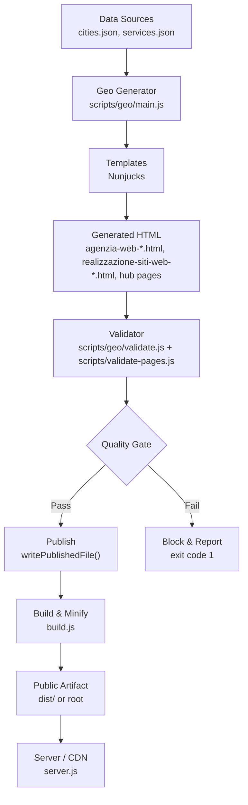
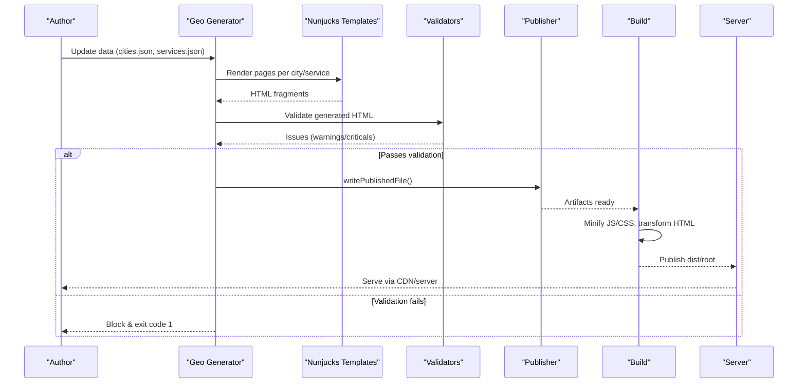
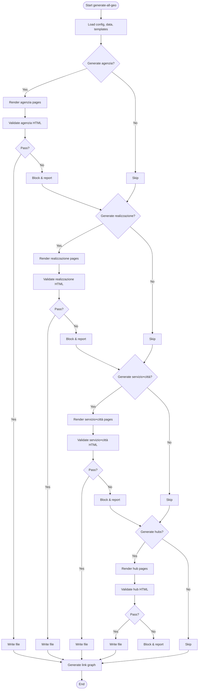
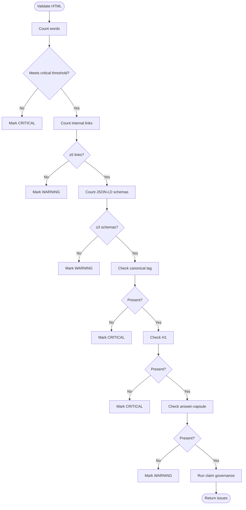
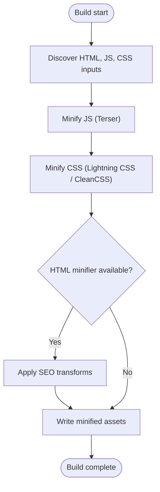
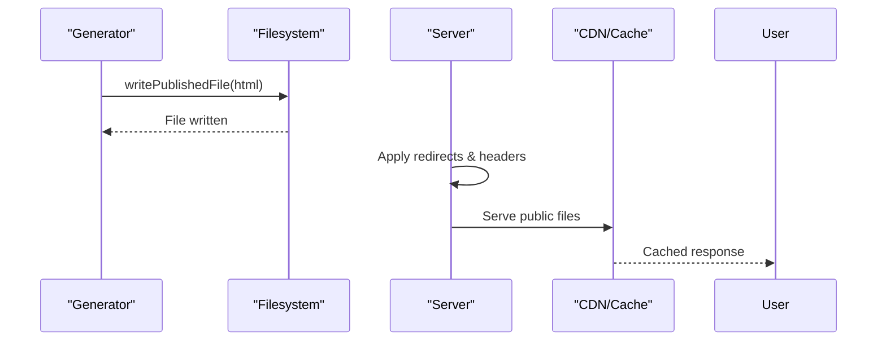
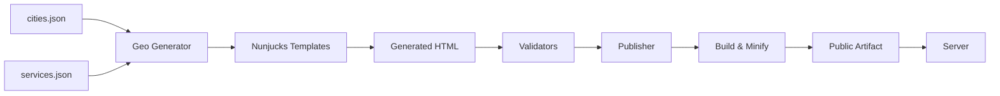

# Content Creation Pipeline

<cite>
**Referenced Files in This Document**
- [README.md](file://README.md)
- [package.json](file://package.json)
- [build.js](file://build.js)
- [server.js](file://server.js)
- [scripts/generate-all-geo.js](file://scripts/generate-all-geo.js)
- [scripts/geo/main.js](file://scripts/geo/main.js)
- [scripts/geo/validate.js](file://scripts/geo/validate.js)
- [scripts/validate-pages.js](file://scripts/validate-pages.js)
- [data/cities.json](file://data/cities.json)
- [data/services.json](file://data/services.json)
- [templates/agenzia-web-content.njk](file://templates/agenzia-web-content.njk)
- [config/content-claim-governance.js](file://config/content-claim-governance.js)
</cite>

## Table of Contents
1. Introduction
2. Project Structure
3. Core Components
4. Architecture Overview
5. Detailed Component Analysis
6. Dependency Analysis
7. Performance Considerations
8. Troubleshooting Guide
9. Conclusion
10. Appendices

## Introduction
This document explains the end-to-end content creation pipeline in WebNovis, from initial data entry through validation to final publication. It covers how content flows through the system, including data schemas, transformation processes, quality checks, integration points between stages, error handling, and rollback strategies. It also provides guidance on extending the pipeline with new content types or validation rules, and outlines versioning, backup, and recovery considerations.

The pipeline supports:
- Geo page generation for services and cities (pSEO)
- Template-driven HTML composition
- Automated asset build and minification
- Quality gates and anti-thin content checks
- Safe publishing to a public artifact directory
- Optional backend serving and search AI features

## Project Structure
At a high level, the repository separates source content, templates, configuration, generators, validators, and published artifacts:
- Data sources: city and service catalogs drive dynamic content
- Templates: Nunjucks templates compose structured pages
- Generators: orchestrate rendering and linking across pages
- Validators: enforce quality thresholds before publishing
- Build: minifies assets and transforms HTML for production
- Server: serves static files and optional APIs

**Diagram sources**
- [scripts/geo/main.js:38-289](file://scripts/geo/main.js#L38-L289)
- [scripts/geo/validate.js:7-49](file://scripts/geo/validate.js#L7-L49)
- [scripts/validate-pages.js:34-43](file://scripts/validate-pages.js#L34-L43)
- [build.js:373-495](file://build.js#L373-L495)
- [server.js:441-526](file://server.js#L441-L526)

**Section sources**
- [README.md:192-216](file://README.md#L192-L216)
- [package.json:6-60](file://package.json#L6-L60)

## Core Components
- Data layer: Centralized JSON catalogs define cities, services, and editorial context used by generators.
- Template engine: Nunjucks templates render structured sections, answer capsules, local context, and comparison tables.
- Generator: Orchestrates creation of three page families (agenzia, realizzazione, servizio×città), plus hub pages, internal linking, and schema injection.
- Validator: Enforces word count, internal links, schema presence, canonical tags, H1, answer capsule, and claim governance.
- Build: Minifies JS/CSS, optionally minifies selected HTML, applies SEO transforms, and outputs a publishable artifact.
- Server: Serves public files with cache headers, redirects, security headers, and optional API endpoints.

Key responsibilities:
- Data integrity and completeness
- Template consistency and differentiation
- Fail-closed validation preventing low-quality pages from publishing
- Deterministic builds with reproducible outputs
- Safe serving with security and caching policies

**Section sources**
- [data/cities.json:1-115](file://data/cities.json#L1-L115)
- [data/services.json:1-200](file://data/services.json#L1-L200)
- [templates/agenzia-web-content.njk:1-200](file://templates/agenzia-web-content.njk#L1-L200)
- [scripts/geo/main.js:38-289](file://scripts/geo/main.js#L38-L289)
- [scripts/geo/validate.js:7-49](file://scripts/geo/validate.js#L7-L49)
- [scripts/validate-pages.js:34-43](file://scripts/validate-pages.js#L34-L43)
- [build.js:373-495](file://build.js#L373-L495)
- [server.js:289-526](file://server.js#L289-L526)

## Architecture Overview
The content pipeline is a staged flow with strict gates:

**Diagram sources**
- [scripts/geo/main.js:38-289](file://scripts/geo/main.js#L38-L289)
- [scripts/geo/validate.js:7-49](file://scripts/geo/validate.js#L7-L49)
- [build.js:373-495](file://build.js#L373-L495)
- [server.js:441-526](file://server.js#L441-L526)

## Detailed Component Analysis

### Geo Page Generation
The generator creates three primary page types:
- Agenzia pages per city
- Realizzazione pages per city
- Servizio×Città pages (combinatorial matrix)
- Hub pages for internal linking

It reads city and service catalogs, renders Nunjucks templates, injects JSON-LD schemas, computes internal links, and persists dates and link graphs.

**Diagram sources**
- [scripts/geo/main.js:38-289](file://scripts/geo/main.js#L38-L289)

**Section sources**
- [scripts/generate-all-geo.js:1-58](file://scripts/generate-all-geo.js#L1-L58)
- [scripts/geo/main.js:38-289](file://scripts/geo/main.js#L38-L289)

### Data Schemas and Templates
- City catalog defines slugs, names, coordinates, local context, images, FAQs, and generation flags.
- Service catalog defines slugs, pricing, time estimates, target keywords, and whether a dedicated page exists.
- Nunjucks template composes hero answer capsule, local context, services grid, area served, economic context, comparison table, and process sections.

Examples of schema fields:
- City: slug, name, cap, lat/lng, population, province, generate flags, nearCities, localContext, images, faqs
- Service: slug, shortName, priceFrom, priceCurrency, timeEstimate, description, targetKeyword, idealFor

Template highlights:
- Answer capsule in hero section for GEO optimization
- Tiered editorial blocks for high-value pages
- Comparison table sourced from service catalog
- Internal linking to nearby cities and related pages

**Section sources**
- [data/cities.json:1-115](file://data/cities.json#L1-L115)
- [data/services.json:1-200](file://data/services.json#L1-L200)
- [templates/agenzia-web-content.njk:1-200](file://templates/agenzia-web-content.njk#L1-L200)

### Validation Rules and Quality Gates
Validation enforces minimum content quality and structural correctness:
- Word count thresholds (critical vs warning)
- Minimum internal links
- Minimum JSON-LD schemas
- Presence of canonical tag and H1
- Answer capsule class for GEO optimization
- Claim governance checks against unsupported published claims

Thresholds are configurable per page type and path.

**Diagram sources**
- [scripts/geo/validate.js:7-49](file://scripts/geo/validate.js#L7-L49)
- [scripts/validate-pages.js:34-43](file://scripts/validate-pages.js#L34-L43)
- [config/content-claim-governance.js:62-125](file://config/content-claim-governance.js#L62-L125)

**Section sources**
- [scripts/geo/validate.js:7-49](file://scripts/geo/validate.js#L7-L49)
- [scripts/validate-pages.js:34-43](file://scripts/validate-pages.js#L34-L43)
- [config/content-claim-governance.js:62-125](file://config/content-claim-governance.js#L62-L125)

### Build and Asset Transformation
The build step:
- Discovers JS and CSS inputs from explicit lists and HTML references
- Minifies JS using Terser with safe defaults
- Minifies CSS using Lightning CSS with CleanCSS fallback
- Optionally minifies selected HTML and applies SEO transforms
- Outputs a clean artifact suitable for deployment

**Diagram sources**
- [build.js:242-279](file://build.js#L242-L279)
- [build.js:290-371](file://build.js#L290-L371)
- [build.js:428-495](file://build.js#L428-L495)

**Section sources**
- [build.js:242-279](file://build.js#L242-L279)
- [build.js:290-371](file://build.js#L290-L371)
- [build.js:428-495](file://build.js#L428-L495)

### Publishing and Serving
After successful generation and validation:
- Generated HTML is written to the publish directory
- The server exposes curated public files with appropriate cache headers
- Redirects normalize legacy paths, trailing slashes, and tracking parameters
- Security headers and robots directives protect API endpoints and sensitive paths

**Diagram sources**
- [scripts/geo/main.js:104-106](file://scripts/geo/main.js#L104-L106)
- [scripts/geo/main.js:141-143](file://scripts/geo/main.js#L141-L143)
- [scripts/geo/main.js:181-183](file://scripts/geo/main.js#L181-L183)
- [server.js:289-526](file://server.js#L289-L526)

**Section sources**
- [scripts/geo/main.js:104-106](file://scripts/geo/main.js#L104-L106)
- [scripts/geo/main.js:141-143](file://scripts/geo/main.js#L141-L143)
- [scripts/geo/main.js:181-183](file://scripts/geo/main.js#L181-L183)
- [server.js:289-526](file://server.js#L289-L526)

## Dependency Analysis
The pipeline has clear separation of concerns:
- Data dependencies: cities.json and services.json feed the generator
- Template dependency: Nunjucks templates consume rendered variables
- Validation dependency: validators depend on generated HTML and governance rules
- Build dependency: build script depends on published HTML and assets
- Server dependency: server serves published artifacts and applies runtime policies

**Diagram sources**
- [data/cities.json:1-115](file://data/cities.json#L1-L115)
- [data/services.json:1-200](file://data/services.json#L1-L200)
- [scripts/geo/main.js:38-289](file://scripts/geo/main.js#L38-L289)
- [build.js:373-495](file://build.js#L373-L495)
- [server.js:441-526](file://server.js#L441-L526)

**Section sources**
- [scripts/generate-all-geo.js:1-58](file://scripts/generate-all-geo.js#L1-L58)
- [scripts/geo/main.js:38-289](file://scripts/geo/main.js#L38-L289)
- [build.js:373-495](file://build.js#L373-L495)
- [server.js:441-526](file://server.js#L441-L526)

## Performance Considerations
- Use dry-run and validate-only modes during development to avoid unnecessary writes
- Prefer targeted generation filters (city/service) to reduce iteration time
- Leverage build caching and incremental minification where possible
- Monitor output sizes and similarity metrics to prevent bloated or duplicate content
- Keep templates modular to minimize re-render costs

[No sources needed since this section provides general guidance]

## Troubleshooting Guide
Common issues and resolutions:
- Validation failures: Review warnings and criticals; fix missing H1, canonical, schemas, or insufficient word counts
- Blocked generation: Investigate blocked/failed outputs reported by the generator; ensure data completeness and template variables
- Build errors: Check JS/CSS minification logs; adjust overrides if necessary
- Serving issues: Verify public file exposure and redirect rules; confirm cache headers and security headers

Operational tips:
- Use --dry-run and --validate-only flags to test changes safely
- Inspect link-graph.json for internal linking health
- Confirm date editorial updates after successful generation

**Section sources**
- [scripts/geo/main.js:240-289](file://scripts/geo/main.js#L240-L289)
- [scripts/validate-pages.js:341-433](file://scripts/validate-pages.js#L341-L433)
- [build.js:373-495](file://build.js#L373-L495)

## Conclusion
WebNovis implements a robust, fail-closed content creation pipeline that transforms structured data into high-quality, validated HTML pages. The combination of centralized data, templating, automated validation, and deterministic builds ensures consistent, publish-ready artifacts. Extending the pipeline involves adding new data entries, updating templates, and integrating additional validation rules while maintaining the strict quality gates.

[No sources needed since this section summarizes without analyzing specific files]

## Appendices

### Versioning, Backup, and Recovery
- Version control: All source data, templates, and scripts are tracked in Git; use branches for feature work and PRs for review
- Backups: Maintain offsite backups of the repository and any external data stores referenced by the site
- Recovery: Rebuild from source using the documented commands; regenerate geo pages and rebuild artifacts to restore the public site
- Rollback procedures: If a publish introduces regressions, revert to the last known good commit and rebuild

[No sources needed since this section provides general guidance]

### Extending the Pipeline
To add a new content type:
- Define data schema entries in cities.json or services.json as appropriate
- Create or update Nunjucks templates to render the new content structure
- Extend the generator to produce the new pages and integrate internal linking
- Add validation rules to ensure quality thresholds and governance compliance
- Update build steps if new assets or transformations are required
- Test with dry-run and validate-only modes before publishing

To add new validation rules:
- Implement checks in the validator modules
- Integrate claim governance checks where applicable
- Update thresholds and overrides for specific page types
- Add tests to prevent regressions

**Section sources**
- [scripts/geo/main.js:38-289](file://scripts/geo/main.js#L38-L289)
- [scripts/geo/validate.js:7-49](file://scripts/geo/validate.js#L7-L49)
- [config/content-claim-governance.js:62-125](file://config/content-claim-governance.js#L62-L125)
- [build.js:373-495](file://build.js#L373-L495)