# Content Transformation & Processing

<cite>
**Referenced Files in This Document**
- [build.js](file://build.js)
- [scripts/geo/main.js](file://scripts/geo/main.js)
- [scripts/geo/render-agenzia.js](file://scripts/geo/render-agenzia.js)
- [scripts/geo/render-servizio.js](file://scripts/geo/render-servizio.js)
- [scripts/geo/data.js](file://scripts/geo/data.js)
- [templates/agenzia-web-content.njk](file://templates/agenzia-web-content.njk)
- [config/seo-html-transforms.js](file://config/seo-html-transforms.js)
- [config/entity-facts.js](file://config/entity-facts.js)
- [blog/build-articles.js](file://blog/build-articles.js)
- [scripts/generate-ai-exports.js](file://scripts/generate-ai-exports.js)
- [scripts/standardize-all.js](file://scripts/standardize-all.js)
</cite>

## Table of Contents
1. [Introduction](#introduction)
2. [Project Structure](#project-structure)
3. [Core Components](#core-components)
4. [Architecture Overview](#architecture-overview)
5. [Detailed Component Analysis](#detailed-component-analysis)
6. [Dependency Analysis](#dependency-analysis)
7. [Performance Considerations](#performance-considerations)
8. [Troubleshooting Guide](#troubleshooting-guide)
9. [Conclusion](#conclusion)

## Introduction
This document explains WebNovis’s content transformation and processing engine: how raw data is standardized, enriched, and rendered into structured HTML for multiple output channels (local geo pages, service×city pages, blog articles, and exports). It covers the standardization pipeline, Nunjucks template rendering, metadata extraction, SEO optimization steps, and multi-format export capabilities. Concrete examples of input structures, transformation rules, and outputs are provided through code references and diagrams.

## Project Structure
The transformation pipeline spans several directories and scripts:
- Geo page generation orchestrator and renderers
- Data loading and Nunjucks environment setup
- Template files for content sections
- Build-time asset minification and HTML post-processing
- Blog article generator
- AI editorial exports and standardization utilities

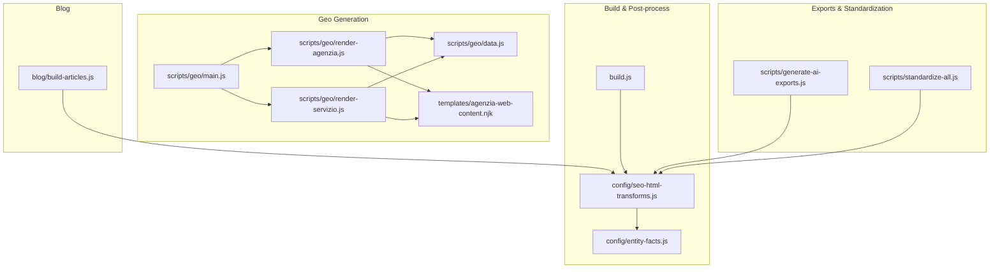

**Diagram sources**
- [scripts/geo/main.js:1-292](file://scripts/geo/main.js#L1-L292)
- [scripts/geo/render-agenzia.js:1-194](file://scripts/geo/render-agenzia.js#L1-L194)
- [scripts/geo/render-servizio.js:1-289](file://scripts/geo/render-servizio.js#L1-L289)
- [scripts/geo/data.js:1-197](file://scripts/geo/data.js#L1-L197)
- [templates/agenzia-web-content.njk:1-278](file://templates/agenzia-web-content.njk#L1-L278)
- [build.js:1-502](file://build.js#L1-L502)
- [config/seo-html-transforms.js:1-800](file://config/seo-html-transforms.js#L1-L800)
- [config/entity-facts.js:74-160](file://config/entity-facts.js#L74-L160)
- [blog/build-articles.js:1-800](file://blog/build-articles.js#L1-L800)
- [scripts/generate-ai-exports.js:1-125](file://scripts/generate-ai-exports.js#L1-L125)
- [scripts/standardize-all.js:1-138](file://scripts/standardize-all.js#L1-L138)

**Section sources**
- [scripts/geo/main.js:1-292](file://scripts/geo/main.js#L1-L292)
- [build.js:1-502](file://build.js#L1-L502)

## Core Components
- Geo page generators: orchestrate city/service matrices, assemble context, render templates, inject schemas, and write published files.
- Data loader: loads cities/services JSON, prepares Nunjucks environment, and exposes helpers for prices, links, and avatar paths.
- Templates: Nunjucks templates define section structure, conditional blocks, and variable substitution.
- Build pipeline: discovers assets, minifies JS/CSS, optionally minifies HTML, and applies SEO transforms to static src/html pages.
- SEO transforms: post-processes HTML with canonicalization, robots directives, strategic link injection, and entity normalization.
- Blog generator: builds article HTML with consistent footers, authorship, and internal linking strategies.
- AI exports: generates editorial exports aligned with entity facts and governance.
- Standardization: idempotent fixes across HTML files (footers, FAQ answers, price updates).

**Section sources**
- [scripts/geo/data.js:1-197](file://scripts/geo/data.js#L1-L197)
- [templates/agenzia-web-content.njk:1-278](file://templates/agenzia-web-content.njk#L1-L278)
- [build.js:1-502](file://build.js#L1-L502)
- [config/seo-html-transforms.js:1-800](file://config/seo-html-transforms.js#L1-L800)
- [blog/build-articles.js:1-800](file://blog/build-articles.js#L1-L800)
- [scripts/generate-ai-exports.js:1-125](file://scripts/generate-ai-exports.js#L1-L125)
- [scripts/standardize-all.js:1-138](file://scripts/standardize-all.js#L1-L138)

## Architecture Overview
The system follows a clear separation between data preparation, templating, and build-time optimizations. Geo pages are generated programmatically from JSON datasets and Nunjucks templates; static HTML pages are processed by the build script with SEO transforms applied afterward.

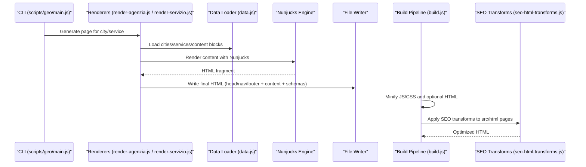

**Diagram sources**
- [scripts/geo/main.js:1-292](file://scripts/geo/main.js#L1-L292)
- [scripts/geo/render-agenzia.js:1-194](file://scripts/geo/render-agenzia.js#L1-L194)
- [scripts/geo/render-servizio.js:1-289](file://scripts/geo/render-servizio.js#L1-L289)
- [scripts/geo/data.js:1-197](file://scripts/geo/data.js#L1-L197)
- [build.js:1-502](file://build.js#L1-L502)
- [config/seo-html-transforms.js:1-800](file://config/seo-html-transforms.js#L1-L800)

## Detailed Component Analysis

### Geo Page Generator Orchestration
- Orchestrates generation for three categories: agenzia-web per city, realizzazione-siti-web per city, and servizio×città matrix.
- Applies validation, writes files unless dry-run or validate-only, and persists dates and link graph.

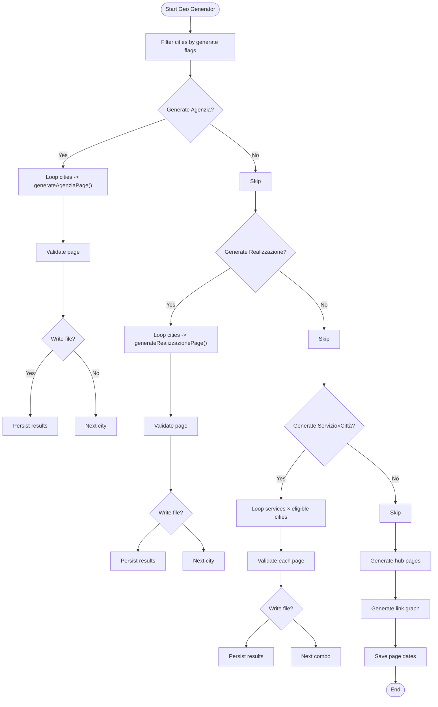

**Diagram sources**
- [scripts/geo/main.js:1-292](file://scripts/geo/main.js#L1-L292)

**Section sources**
- [scripts/geo/main.js:1-292](file://scripts/geo/main.js#L1-L292)

### Agenzia Page Rendering
- Builds template data from city context, editorial overrides, and AI content blocks.
- Renders Nunjucks template, extracts head/nav/footer from base page, injects derived meta and schemas.

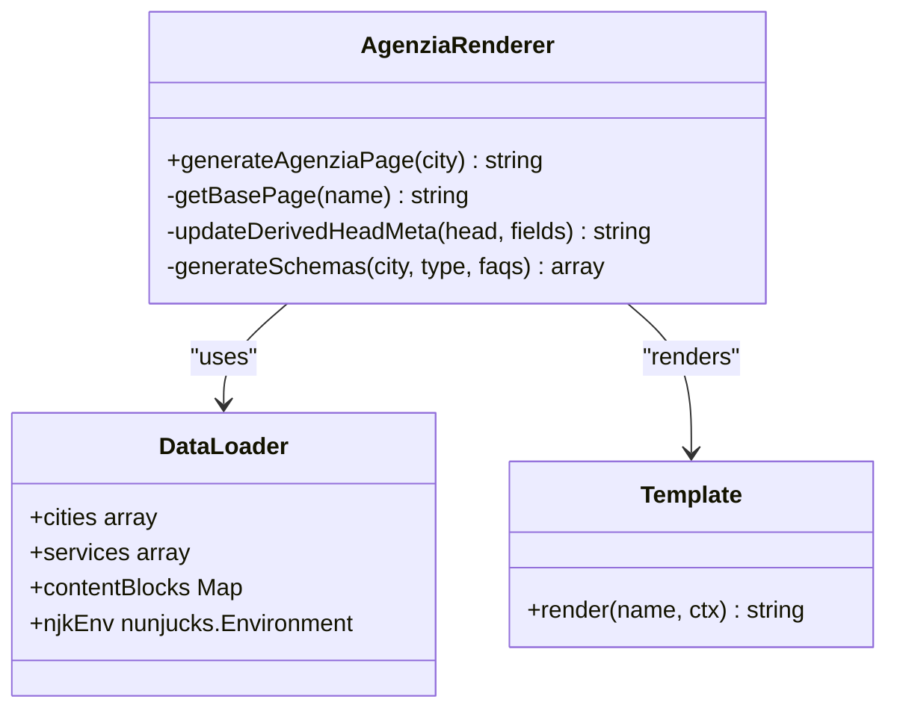

**Diagram sources**
- [scripts/geo/render-agenzia.js:1-194](file://scripts/geo/render-agenzia.js#L1-L194)
- [scripts/geo/data.js:1-197](file://scripts/geo/data.js#L1-L197)
- [templates/agenzia-web-content.njk:1-278](file://templates/agenzia-web-content.njk#L1-L278)

**Section sources**
- [scripts/geo/render-agenzia.js:1-194](file://scripts/geo/render-agenzia.js#L1-L194)
- [scripts/geo/data.js:1-197](file://scripts/geo/data.js#L1-L197)
- [templates/agenzia-web-content.njk:1-278](file://templates/agenzia-web-content.njk#L1-L278)

### Servizio×Città Page Rendering
- Selects FAQ pools based on service cluster to avoid duplication.
- Composes related city/service links, tier classification, and schema markup including Service and FAQPage.

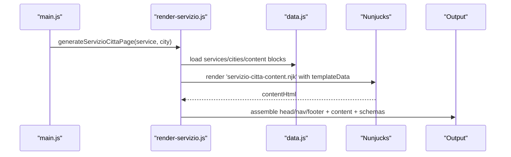

**Diagram sources**
- [scripts/geo/render-servizio.js:1-289](file://scripts/geo/render-servizio.js#L1-L289)
- [scripts/geo/data.js:1-197](file://scripts/geo/data.js#L1-L197)

**Section sources**
- [scripts/geo/render-servizio.js:1-289](file://scripts/geo/render-servizio.js#L1-L289)

### Nunjucks Template Rendering
- Variables include city, services, nearCitiesData, relatedPages, blogLinks, today, site, tier, isIndexable, tier1Content, editorial.
- Conditional logic renders Tier 1 editorial block, local context sections, services grid, area served, comparison table, process steps, sectors, FAQs, and CTA.

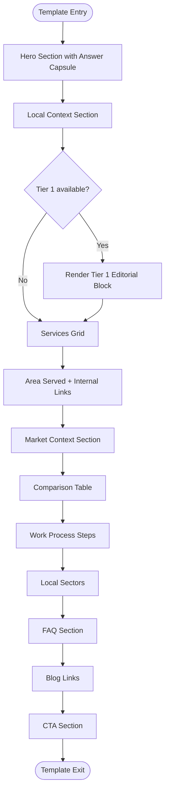

**Diagram sources**
- [templates/agenzia-web-content.njk:1-278](file://templates/agenzia-web-content.njk#L1-L278)

**Section sources**
- [templates/agenzia-web-content.njk:1-278](file://templates/agenzia-web-content.njk#L1-L278)

### Data Loading and Standardization
- Loads cities.json and services.json, filters core and geo-eligible services, formats prices consistently, and configures Nunjucks with autoescape disabled and helpful filters.
- Provides helper functions for pricing, URLs, and avatar paths.

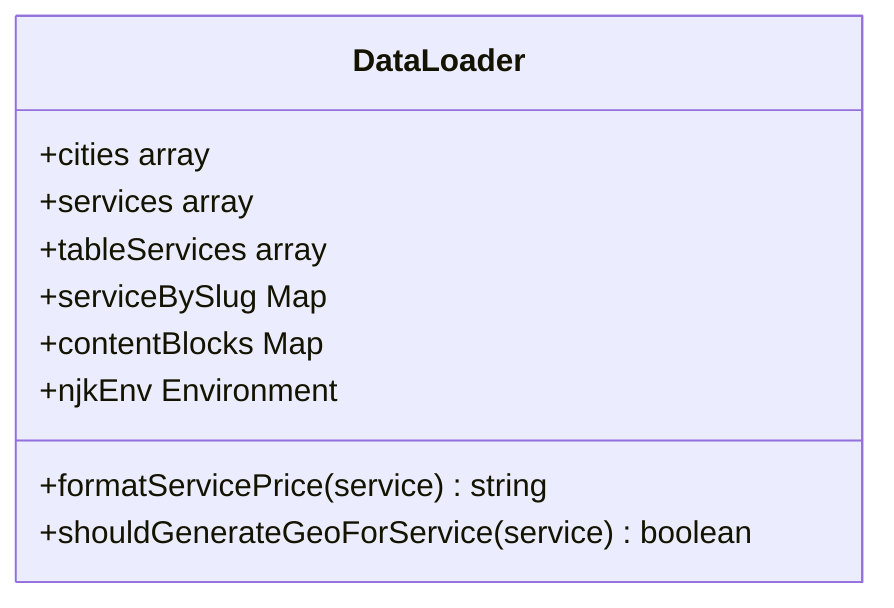

**Diagram sources**
- [scripts/geo/data.js:1-197](file://scripts/geo/data.js#L1-L197)

**Section sources**
- [scripts/geo/data.js:1-197](file://scripts/geo/data.js#L1-L197)

### Build Pipeline and Asset Optimization
- Discovers HTML files, collects referenced JS/CSS inputs, minifies JS with Terser, minifies CSS with LightningCSS (fallback CleanCSS), and optionally minifies HTML from src/html.
- Applies SEO transforms during HTML minification step for src/html pages.

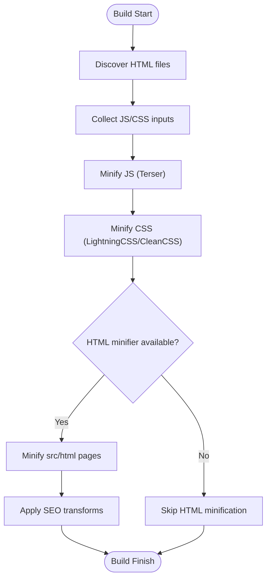

**Diagram sources**
- [build.js:1-502](file://build.js#L1-L502)
- [config/seo-html-transforms.js:1-800](file://config/seo-html-transforms.js#L1-L800)

**Section sources**
- [build.js:1-502](file://build.js#L1-L502)

### SEO Transformations and Metadata Normalization
- Injects canonical URLs, robots directives, strategic internal links, and localized content upgrades.
- Normalizes JSON-LD entities to ensure consistent organization identifiers and safe sameAs handling.

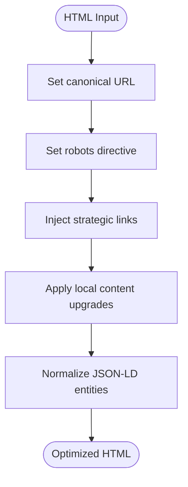

**Diagram sources**
- [config/seo-html-transforms.js:1-800](file://config/seo-html-transforms.js#L1-L800)
- [config/entity-facts.js:74-160](file://config/entity-facts.js#L74-L160)

**Section sources**
- [config/seo-html-transforms.js:1-800](file://config/seo-html-transforms.js#L1-L800)
- [config/entity-facts.js:74-160](file://config/entity-facts.js#L74-L160)

### Blog Article Generation
- Generates article HTML with consistent footer, authorship, and internal linking strategies.
- Enforces date consistency for published vs updated dates and integrates service-specific CTAs and checklists.

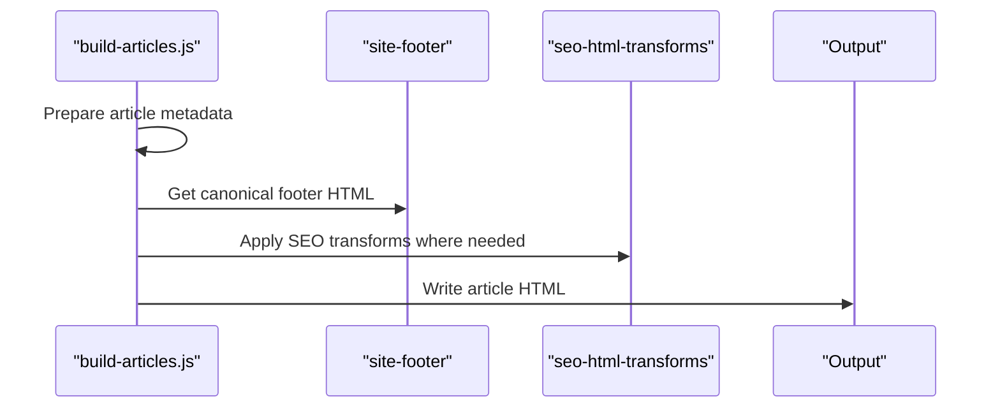

**Diagram sources**
- [blog/build-articles.js:1-800](file://blog/build-articles.js#L1-L800)
- [config/site-footer.js](file://config/site-footer.js)
- [config/seo-html-transforms.js:1-800](file://config/seo-html-transforms.js#L1-L800)

**Section sources**
- [blog/build-articles.js:1-800](file://blog/build-articles.js#L1-L800)

### AI Editorial Exports
- Produces ai.txt and webnovis-ai-data.json aligned with entity facts and governance constraints.
- Ensures no unverified GBP metrics and includes canonical source references.

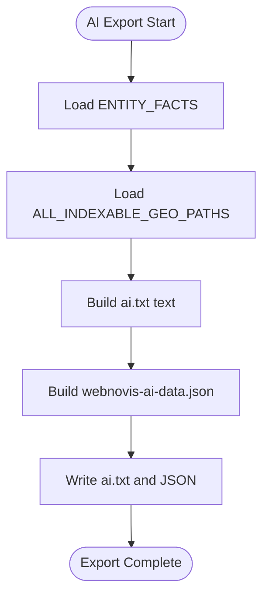

**Diagram sources**
- [scripts/generate-ai-exports.js:1-125](file://scripts/generate-ai-exports.js#L1-L125)
- [config/entity-facts.js:74-160](file://config/entity-facts.js#L74-L160)

**Section sources**
- [scripts/generate-ai-exports.js:1-125](file://scripts/generate-ai-exports.js#L1-L125)

### Standardization Utilities
- Idempotently updates footers, FAQ answers, and price mentions across HTML files.
- Adds specific scripts to new priority pages.

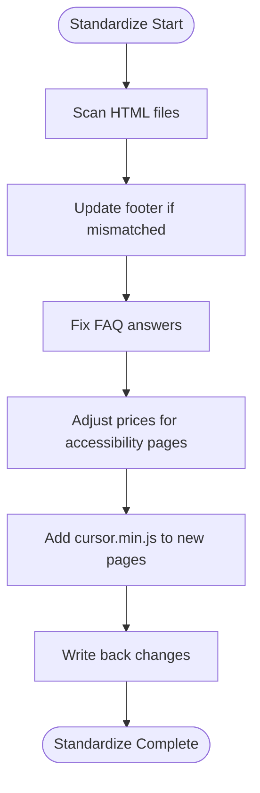

**Diagram sources**
- [scripts/standardize-all.js:1-138](file://scripts/standardize-all.js#L1-L138)

**Section sources**
- [scripts/standardize-all.js:1-138](file://scripts/standardize-all.js#L1-L138)

## Dependency Analysis
Key dependencies and relationships:
- Geo generators depend on data loader and Nunjucks environment.
- Build pipeline depends on SEO transforms and entity facts for HTML post-processing.
- Blog generator depends on site footer and SEO transforms.
- AI exports depend on entity facts and governance sets.
- Standardization depends on site footer and targeted fix maps.

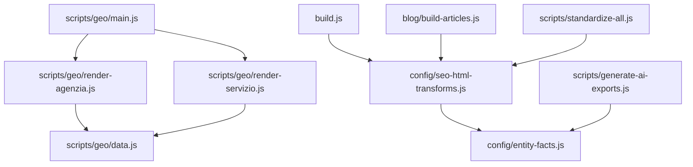

**Diagram sources**
- [scripts/geo/main.js:1-292](file://scripts/geo/main.js#L1-L292)
- [scripts/geo/render-agenzia.js:1-194](file://scripts/geo/render-agenzia.js#L1-L194)
- [scripts/geo/render-servizio.js:1-289](file://scripts/geo/render-servizio.js#L1-L289)
- [scripts/geo/data.js:1-197](file://scripts/geo/data.js#L1-L197)
- [build.js:1-502](file://build.js#L1-L502)
- [config/seo-html-transforms.js:1-800](file://config/seo-html-transforms.js#L1-L800)
- [config/entity-facts.js:74-160](file://config/entity-facts.js#L74-L160)
- [blog/build-articles.js:1-800](file://blog/build-articles.js#L1-L800)
- [scripts/generate-ai-exports.js:1-125](file://scripts/generate-ai-exports.js#L1-L125)
- [scripts/standardize-all.js:1-138](file://scripts/standardize-all.js#L1-L138)

**Section sources**
- [scripts/geo/main.js:1-292](file://scripts/geo/main.js#L1-L292)
- [build.js:1-502](file://build.js#L1-L502)

## Performance Considerations
- Prefer LightningCSS for CSS minification with fallback to CleanCSS to maintain cascade safety.
- Use explicit inputs for JS/CSS to reduce discovery overhead.
- Avoid unnecessary HTML minification for geo-generated pages; only src/html pages are minified.
- Normalize text and strip HTML efficiently when building search indexes or duplicate reports.

[No sources needed since this section provides general guidance]

## Troubleshooting Guide
Common issues and resolutions:
- Missing base page for Rho: Ensure agenzia-web-source.html exists before generating agenzia pages.
- Validation failures: Check blocked/failed counts and validation issues printed by the geo generator.
- SEO transform errors: Verify canonical paths and robots directives; ensure non-public artifacts are excluded.
- Date inconsistencies: Confirm dateModified never precedes datePublished in blog articles.

**Section sources**
- [scripts/geo/render-agenzia.js:1-194](file://scripts/geo/render-agenzia.js#L1-L194)
- [scripts/geo/main.js:1-292](file://scripts/geo/main.js#L1-L292)
- [config/seo-html-transforms.js:1-800](file://config/seo-html-transforms.js#L1-L800)
- [blog/build-articles.js:1-800](file://blog/build-articles.js#L1-L800)

## Conclusion
WebNovis’s content transformation engine combines robust data loaders, flexible Nunjucks templates, and a resilient build pipeline to produce optimized, SEO-friendly HTML across multiple channels. The modular design allows for easy extension, consistent standardization, and reliable multi-format exports while maintaining performance and quality.

[No sources needed since this section summarizes without analyzing specific files]