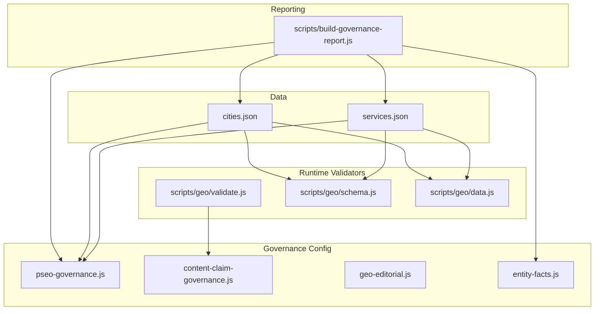
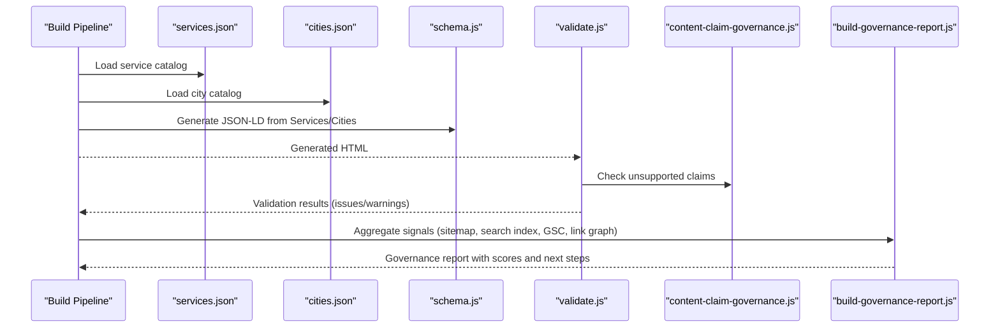
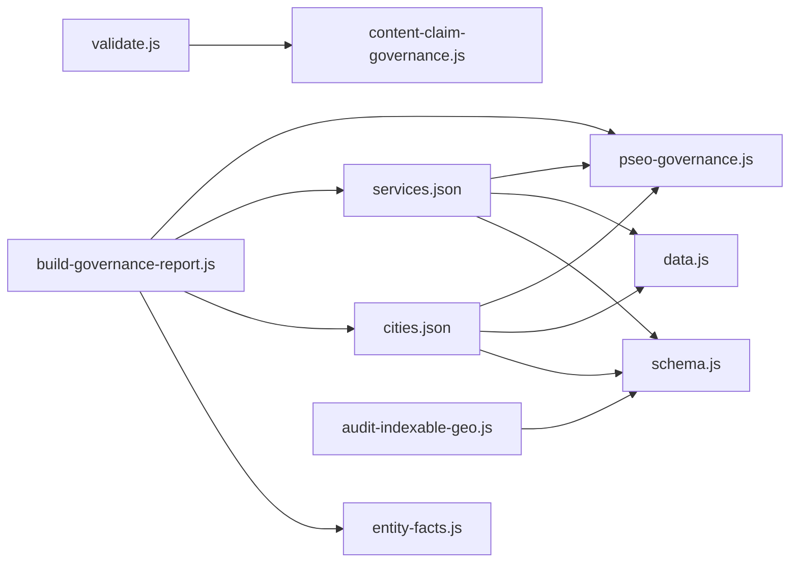

# Data Validation & Quality Assurance

<cite>
**Referenced Files in This Document**
- [services.json](file://data/services.json)
- [cities.json](file://data/cities.json)
- [validate.js](file://scripts/geo/validate.js)
- [build-governance-report.js](file://scripts/build-governance-report.js)
- [content-claim-governance.js](file://config/content-claim-governance.js)
- [pseo-governance.js](file://config/pseo-governance.js)
- [data.js](file://scripts/geo/data.js)
- [schema.js](file://scripts/geo/schema.js)
- [entity-facts.js](file://config/entity-facts.js)
- [geo-editorial.js](file://config/geo-editorial.js)
- [audit-indexable-geo.js](file://scripts/audit-indexable-geo.js)
</cite>

## Table of Contents
1. [Introduction](#introduction)
2. [Project Structure](#project-structure)
3. [Core Components](#core-components)
4. [Architecture Overview](#architecture-overview)
5. [Detailed Component Analysis](#detailed-component-analysis)
6. [Dependency Analysis](#dependency-analysis)
7. [Performance Considerations](#performance-considerations)
8. [Troubleshooting Guide](#troubleshooting-guide)
9. [Conclusion](#conclusion)
10. [Appendices](#appendices)

## Introduction
This document explains the data validation and quality assurance system that governs content data before it enters WebNovis’s content pipeline. It focuses on:
- Schema enforcement and field requirements for services.json and cities.json
- Business rule validation applied to service and city records
- HTML-level page validation for generated GEO pages
- Governance report generation that analyzes content quality metrics, identifies issues, and provides remediation recommendations
- Data normalization processes, duplicate detection, and consistency checks across sources

The goal is to ensure only high-quality, consistent, and indexable content proceeds through the build pipeline while surfacing actionable insights for remediation.

## Project Structure
At a high level, the validation and QA system spans:
- Centralized data files (services.json, cities.json)
- Configuration modules enforcing governance rules (pseo-governance.js, content-claim-governance.js, geo-editorial.js)
- Runtime validators for generated HTML (scripts/geo/validate.js)
- A comprehensive governance report builder (scripts/build-governance-report.js)
- JSON-LD schema generation utilities (scripts/geo/schema.js)
- Entity normalization utilities (config/entity-facts.js)

**Diagram sources**
- [services.json:1-307](file://data/services.json#L1-L307)
- [cities.json:1-800](file://data/cities.json#L1-L800)
- [pseo-governance.js:1-311](file://config/pseo-governance.js#L1-L311)
- [content-claim-governance.js:1-240](file://config/content-claim-governance.js#L1-L240)
- [geo-editorial.js:204-382](file://config/geo-editorial.js#L204-L382)
- [entity-facts.js:1-161](file://config/entity-facts.js#L1-L161)
- [validate.js:1-55](file://scripts/geo/validate.js#L1-L55)
- [schema.js:1-177](file://scripts/geo/schema.js#L1-L177)
- [data.js:1-197](file://scripts/geo/data.js#L1-L197)
- [build-governance-report.js:1-800](file://scripts/build-governance-report.js#L1-L800)

**Section sources**
- [services.json:1-307](file://data/services.json#L1-L307)
- [cities.json:1-800](file://data/cities.json#L1-L800)
- [pseo-governance.js:1-311](file://config/pseo-governance.js#L1-L311)
- [content-claim-governance.js:1-240](file://config/content-claim-governance.js#L1-L240)
- [geo-editorial.js:204-382](file://config/geo-editorial.js#L204-L382)
- [entity-facts.js:1-161](file://config/entity-facts.js#L1-L161)
- [validate.js:1-55](file://scripts/geo/validate.js#L1-L55)
- [schema.js:1-177](file://scripts/geo/schema.js#L1-L177)
- [data.js:1-197](file://scripts/geo/data.js#L1-L197)
- [build-governance-report.js:1-800](file://scripts/build-governance-report.js#L1-L800)

## Core Components
- services.json: Canonical catalog of services with fields such as slug, name, shortName, schemaType, url, hasPage, tier, priceFrom, priceCurrency, timeEstimate, description, shortDesc, targetKeyword, idealFor, and flags like generateGeoPages/skipGeoGeneration.
- cities.json: Centralized city dataset including slug, name, cap, lat/lng, population, province, wikipedia, distance metadata, generate flags, nearCities, localContext, images, and faqs.
- pseo-governance.js: Allowlist-based indexation control defining Tier 1/2 and data-validated indexable paths; computes de-amplified sets and sitemap inclusion rules.
- content-claim-governance.js: Enforces claim policies by detecting unsupported claims in generated or published text and preserving approved custom blocks.
- scripts/geo/validate.js: Fail-closed HTML validator for generated GEO pages checking word count, internal links, JSON-LD schemas, canonical tags, H1 presence, answer-capsule class, and unsupported claims.
- scripts/build-governance-report.js: Aggregates multiple signals (sitemap, search index, historical priorities, link graph, GSC CSVs, hierarchy keywords) to score pages, assign buckets, and produce remediation guidance.
- scripts/geo/schema.js: Generates structured data (JSON-LD) for Service, Offer, AreaServed, and related entities using normalized city/service data.
- config/entity-facts.js: Normalizes entity references and sameAs URLs to prevent forbidden or conflicting identifiers.
- config/geo-editorial.js: Validates editorial manifests and cross-checks path descriptors against expected governance paths, ensuring city/service alignment and pricing consistency.

**Section sources**
- [services.json:1-307](file://data/services.json#L1-L307)
- [cities.json:1-800](file://data/cities.json#L1-L800)
- [pseo-governance.js:1-311](file://config/pseo-governance.js#L1-L311)
- [content-claim-governance.js:1-240](file://config/content-claim-governance.js#L1-L240)
- [validate.js:1-55](file://scripts/geo/validate.js#L1-L55)
- [build-governance-report.js:1-800](file://scripts/build-governance-report.js#L1-L800)
- [schema.js:1-177](file://scripts/geo/schema.js#L1-L177)
- [entity-facts.js:1-161](file://config/entity-facts.js#L1-L161)
- [geo-editorial.js:204-382](file://config/geo-editorial.js#L204-L382)

## Architecture Overview
The validation and QA architecture enforces schema and business rules at multiple layers:
- Data layer: services.json and cities.json are consumed by generators and validators.
- Governance layer: pseo-governance.js controls which GEO paths are indexable; content-claim-governance.js prevents risky claims; geo-editorial.js validates editorial manifests and path descriptors.
- Generation layer: scripts/geo/schema.js produces JSON-LD; scripts/geo/data.js prepares normalized datasets and templates.
- Post-generation validation: scripts/geo/validate.js inspects produced HTML for structural and SEO quality.
- Reporting layer: scripts/build-governance-report.js aggregates multi-source signals to score pages and recommend actions.

**Diagram sources**
- [services.json:1-307](file://data/services.json#L1-L307)
- [cities.json:1-800](file://data/cities.json#L1-L800)
- [schema.js:1-177](file://scripts/geo/schema.js#L1-L177)
- [validate.js:1-55](file://scripts/geo/validate.js#L1-L55)
- [content-claim-governance.js:1-240](file://config/content-claim-governance.js#L1-L240)
- [build-governance-report.js:1-800](file://scripts/build-governance-report.js#L1-L800)

## Detailed Component Analysis

### services.json: Schema and Business Rules
- Required fields per service entry include slug, name, shortName, schemaType, url, hasPage, tier, priceFrom, priceCurrency, timeEstimate, description, shortDesc, targetKeyword, idealFor.
- Optional flags influence generation:
  - generateGeoPages: legacy opt-out
  - skipGeoGeneration: new explicit opt-out (e.g., deprecated clusters)
  - canonicalServiceSlug: used for consolidation/deprecation handling
- Price normalization and display rely on priceFrom and priceCurrency; priceUnit may be appended (e.g., “/mese”).
- Business rules enforced by runtime code:
  - shouldGenerateGeoForService ensures only eligible services participate in geo generation.
  - formatServicePrice and buildCatalogOffer enforce numeric priceFrom and currency presence.

Validation outcomes:
- Missing or invalid priceFrom triggers errors during offer building.
- Deprecated services flagged via skipGeoGeneration or canonicalServiceSlug reduce duplication and cannibalization.

**Section sources**
- [services.json:1-307](file://data/services.json#L1-L307)
- [data.js:1-197](file://scripts/geo/data.js#L1-L197)
- [schema.js:1-177](file://scripts/geo/schema.js#L1-L177)

### cities.json: Schema and Business Rules
- Required fields include slug, name, cap, lat, lng, population, province, wikipedia, distance metadata, generate flags, nearCities, localContext, images, faqs.
- Headquarter identification: _meta.sede defines the single headquarters city; geo-editorial.js asserts Rho as the sole headquarters.
- Business rules enforced:
  - generate flags control whether agenzia/realizzazione pages are generated for each city.
  - nearCities lists drive cross-linking and contextual relevance.
  - localContext fields provide narrative context for content generation.
- Duplicate detection and consistency:
  - City slugs must be unique and match path descriptors validated by geo-editorial.js.
  - Mismatched city/service in manifest records causes failures.

**Section sources**
- [cities.json:1-800](file://data/cities.json#L1-L800)
- [geo-editorial.js:204-382](file://config/geo-editorial.js#L204-L382)

### pseo-governance.js: Indexation Control and De-amplification
- Defines Tier 1 and Tier 2 allowlists plus a data-validated set based on observed search signals.
- Computes PHASE1_DEAMPLIFIED_PATHS combining explicit de-amplified paths, auto-deamplified GEO paths not in allowlists, and removed paths.
- Provides helpers:
  - normalizePathname for URL normalization
  - isDeAmplifiedPath and getIndexationDirectivesForPath for noindex/follow decisions
  - shouldIncludeInSitemapPath to exclude de-amplified/removal paths from sitemaps

Impact:
- Only strategic GEO pages are indexable; others receive defensive noindex directives and are excluded from sitemaps.
- Ensures authority concentration and reduces doorway footprint.

**Section sources**
- [pseo-governance.js:1-311](file://config/pseo-governance.js#L1-L311)

### content-claim-governance.js: Claim Policy Enforcement
- Detects unsupported generated claims using regex patterns (e.g., guarantees, ROI timelines, fixed delivery estimates).
- Scans published text for prohibited claims (e.g., universal Lighthouse scores, fixed response SLAs).
- Preserves approved custom blocks while stripping unapproved Tier1 editorial blocks.
- Supports loading approved content blocks with provenance checks (publicationStatus, source URLs, verifiedAt, approvedBy).

Outcome:
- Prevents risky or non-compliant claims from entering production.
- Maintains editorial integrity by allowing only pre-approved content blocks.

**Section sources**
- [content-claim-governance.js:1-240](file://config/content-claim-governance.js#L1-L240)

### scripts/geo/validate.js: HTML Page Validation
- Checks minimum word count thresholds (critical vs warning levels).
- Validates internal linking density (target ≥5).
- Ensures sufficient JSON-LD schemas (target ≥3).
- Requires canonical tag and H1 presence.
- Verifies presence of answer-capsule class for GEO optimization.
- Integrates claim scanning via findUnsupportedPublishedClaims to flag violations.

Failure scenarios:
- Low word count triggers critical or warning issues.
- Missing canonical/H1 leads to critical failures.
- Unsupported claims cause immediate rejection.

**Section sources**
- [validate.js:1-55](file://scripts/geo/validate.js#L1-L55)
- [content-claim-governance.js:1-240](file://config/content-claim-governance.js#L1-L240)

### scripts/build-governance-report.js: Governance Report Generation
- Loads multiple data sources:
  - Search index entries
  - Sitemap XML (loc, lastmod)
  - Historical priority CSV (URL-classificati.csv)
  - Link graph (inbound/outbound counts)
  - GSC CSVs (clicks, impressions, CTR, position)
  - Hierarchy keywords (seo_webnovis_hierarchy.json)
- Normalizes headers and values robustly (CSV parsing, delimiter detection, metric header aliases).
- Scores pages across dimensions:
  - Business value (page type, tier, cluster pillar status)
  - Support strength (file existence, search entry richness, sitemap freshness, inbound links)
  - SEO signals (GSC metrics fallback to sitemap/historical/clusters)
  - Risk adjustment (legal paths, low inbound, outdated lastmod, extended tiers)
- Assigns buckets (e.g., keep, review, merge, deamplify) and generates reason codes.
- Outputs JSON and Markdown reports with next-step recommendations.

Quality metrics analyzed:
- Impressions, clicks, CTR, position
- Inbound/outbound link counts
- Freshness (days since lastmod)
- Cluster membership and ROI stars
- Geo city priority scoring (population, distance)

Remediation examples:
- Pages with zero inbound links get risk penalties and suggestions to strengthen internal linking.
- Extended-tier geo services receive lower business value unless supported by strong signals.
- Legal pages are deprioritized automatically.

**Section sources**
- [build-governance-report.js:1-800](file://scripts/build-governance-report.js#L1-L800)

### scripts/geo/schema.js: JSON-LD Schema Generation
- Builds area served entities for cities, distinguishing synthetic areas (Milano Nord/Ovest) and adding CAP-based PostalAddress where applicable.
- Generates Service and Offer structures tied to canonical service catalog entries.
- Produces core service listings with offers and descriptions localized per city.

Consistency checks:
- Uses offerCatalogServices derived from services.json to ensure offers align with catalog prices.
- Avoids unsupported LocalBusiness usage outside headquarters city.

**Section sources**
- [schema.js:1-177](file://scripts/geo/schema.js#L1-L177)
- [data.js:1-197](file://scripts/geo/data.js#L1-L197)

### config/entity-facts.js: Entity Normalization
- Normalizes sameAs arrays to remove forbidden URLs and duplicates.
- Ensures WebNovis entities use canonical IDs (organizationId, localBusinessId).
- Converts editorial team Person references to Organization types when needed.
- Strips opening hours from normalized entities to avoid stale data.

Duplicate detection:
- Filters out forbidden entity URLs and self-references to organization/local business IDs.

**Section sources**
- [entity-facts.js:1-161](file://config/entity-facts.js#L1-L161)

### config/geo-editorial.js: Editorial Manifest Validation
- Asserts exact keys and versions for manifests.
- Validates totalRecords and recordIndex length.
- Cross-checks path descriptors against expected governance paths and ensures city/service alignment.
- Scans visible text for unsupported claims and uncatalogued prices.

Failure scenarios:
- Extra or non-indexable paths cause failures.
- Mismatches between record.city/service and descriptor trigger errors.
- Unsupported ratings or numeric performance claims fail validation.

**Section sources**
- [geo-editorial.js:204-382](file://config/geo-editorial.js#L204-L382)

### scripts/audit-indexable-geo.js: Structural and SEO Checks
- Audits presence of key elements: Service schema, LocalBusiness usage, answer-capsule, Speakable, NAP, price signals, CTAs, social proof, internal linking to hubs.
- Warns about inappropriate LocalBusiness usage outside headquarters and aggregate rating misuse.

**Section sources**
- [audit-indexable-geo.js:243-280](file://scripts/audit-indexable-geo.js#L243-L280)

## Dependency Analysis
Key dependencies and relationships:
- services.json and cities.json feed into pseo-governance.js, data.js, schema.js, and build-governance-report.js.
- content-claim-governance.js is used by validate.js and geo-editorial.js to enforce claim policies.
- entity-facts.js normalizes JSON-LD entities across schema generation and audits.
- build-governance-report.js depends on external artifacts (sitemap.xml, search-index.json, link-graph.json, GSC CSVs, historical CSVs) and configuration modules.

**Diagram sources**
- [services.json:1-307](file://data/services.json#L1-L307)
- [cities.json:1-800](file://data/cities.json#L1-L800)
- [pseo-governance.js:1-311](file://config/pseo-governance.js#L1-L311)
- [data.js:1-197](file://scripts/geo/data.js#L1-L197)
- [schema.js:1-177](file://scripts/geo/schema.js#L1-L177)
- [validate.js:1-55](file://scripts/geo/validate.js#L1-L55)
- [content-claim-governance.js:1-240](file://config/content-claim-governance.js#L1-L240)
- [build-governance-report.js:1-800](file://scripts/build-governance-report.js#L1-L800)
- [entity-facts.js:1-161](file://config/entity-facts.js#L1-L161)
- [audit-indexable-geo.js:243-280](file://scripts/audit-indexable-geo.js#L243-L280)

**Section sources**
- [pseo-governance.js:1-311](file://config/pseo-governance.js#L1-L311)
- [build-governance-report.js:1-800](file://scripts/build-governance-report.js#L1-L800)

## Performance Considerations
- CSV parsing and header normalization in the governance report are optimized for robustness but can be heavy with large GSC exports; consider batching or streaming for very large datasets.
- JSON-LD generation iterates over services and cities; caching maps (serviceMap, cityMap) avoids repeated lookups.
- Claim scanning uses regex patterns; keep patterns minimal and targeted to reduce false positives and CPU overhead.
- De-amplification logic builds large sets once; reuse computed sets across runs to minimize recomputation.

[No sources needed since this section provides general guidance]

## Troubleshooting Guide
Common validation failures and remedies:
- Missing canonical tag or H1: Ensure every generated page includes rel="canonical" and an <h1> element.
- Insufficient word count: Expand content to meet minimum thresholds; aim for ≥500 unique words.
- Low internal links: Add at least five relevant internal links per page; link to hub pages and related service-city pages.
- Missing JSON-LD schemas: Include at least three relevant schemas (Service, Offer, LocalBusiness/AreaServed).
- Unsupported claims: Remove or qualify risky statements; use approved custom blocks with proper provenance.
- Price inconsistencies: Use canonical priceFrom from services.json; avoid quoting uncatalogued prices in content.
- Incorrect LocalBusiness usage: Reserve LocalBusiness for headquarters city; use Service+areaServed for other cities.
- De-amplified pages: If a GEO page is unintentionally de-amplified, add it to appropriate Tier allowlist or validate data signals.

Error handling patterns:
- Fail-closed validation halts builds on critical issues (missing canonical/H1, unsupported claims).
- Warnings surface opportunities (low word count, weak internal linking, missing answer-capsule).
- Governance report assigns buckets and reasons to guide prioritized fixes.

**Section sources**
- [validate.js:1-55](file://scripts/geo/validate.js#L1-L55)
- [content-claim-governance.js:1-240](file://config/content-claim-governance.js#L1-L240)
- [build-governance-report.js:1-800](file://scripts/build-governance-report.js#L1-L800)
- [audit-indexable-geo.js:243-280](file://scripts/audit-indexable-geo.js#L243-L280)

## Conclusion
WebNovis’s data validation and quality assurance system combines strict schema enforcement, business rule checks, claim policy compliance, and multi-signal governance reporting. By centralizing services and cities data, controlling indexation through tiered allowlists, and validating both data and generated HTML, the pipeline ensures high-quality, consistent, and strategically focused content. The governance report provides actionable insights to prioritize improvements, maintain compliance, and optimize SEO performance.

[No sources needed since this section summarizes without analyzing specific files]

## Appendices

### Example Valid and Invalid Data Structures
- Valid service entry: Contains required fields (slug, name, shortName, schemaType, url, hasPage, tier, priceFrom, priceCurrency, timeEstimate, description, shortDesc, targetKeyword, idealFor). Optional flags like skipGeoGeneration or canonicalServiceSlug are correctly set for deprecation handling.
- Invalid service entry: Missing priceFrom or priceCurrency will cause offer building to fail; incorrect tier or missing hasPage may lead to inconsistent page generation.
- Valid city entry: Includes slug, name, cap, lat, lng, population, province, generate flags, nearCities, localContext, images, faqs. Headquarters city (_meta.sede) is uniquely defined.
- Invalid city entry: Duplicate slugs or mismatched path descriptors in editorial manifests cause validation failures; missing generate flags may result in incomplete page sets.

[No sources needed since this section provides conceptual examples]

### Data Normalization Processes
- Path normalization: normalizePathname strips fragments, query strings, trailing slashes, and resolves full URLs to clean pathnames.
- CSV parsing: Robust delimiter detection and quoted field handling ensure reliable ingestion of GSC and historical priority data.
- Entity normalization: sameAs arrays filtered to remove forbidden URLs; WebNovis entities consolidated to canonical IDs; editorial team Person references converted to Organization types.

**Section sources**
- [pseo-governance.js:230-248](file://config/pseo-governance.js#L230-L248)
- [build-governance-report.js:174-226](file://scripts/build-governance-report.js#L174-L226)
- [entity-facts.js:74-106](file://config/entity-facts.js#L74-L106)

### Duplicate Detection and Consistency Checks
- Unique slugs enforced for services and cities; geo-editorial.js validates path descriptors against expected governance paths.
- Claim scanning prevents duplicated or conflicting claims across content blocks.
- Link graph analysis detects zero-inbound pages and suggests internal linking improvements.

**Section sources**
- [geo-editorial.js:360-382](file://config/geo-editorial.js#L360-L382)
- [build-governance-report.js:328-367](file://scripts/build-governance-report.js#L328-L367)