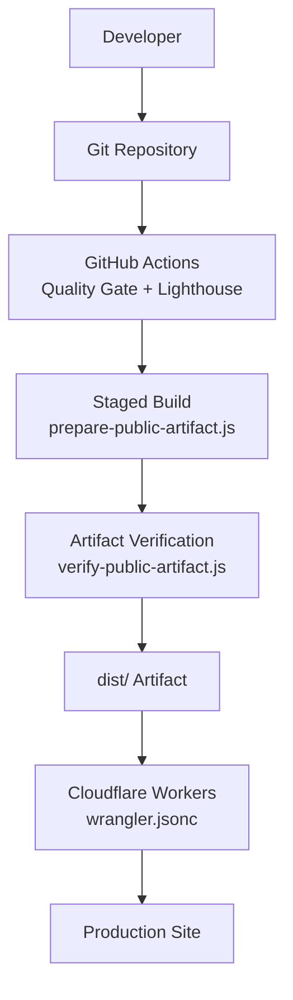
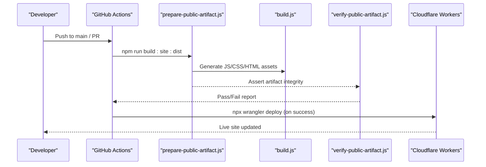
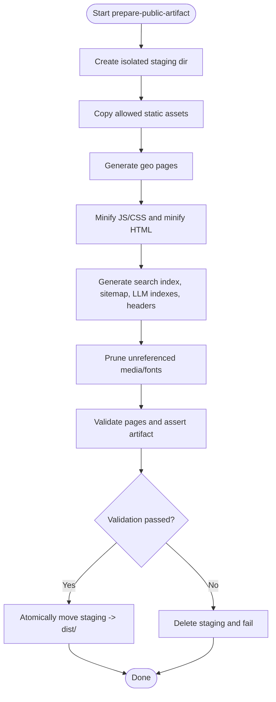
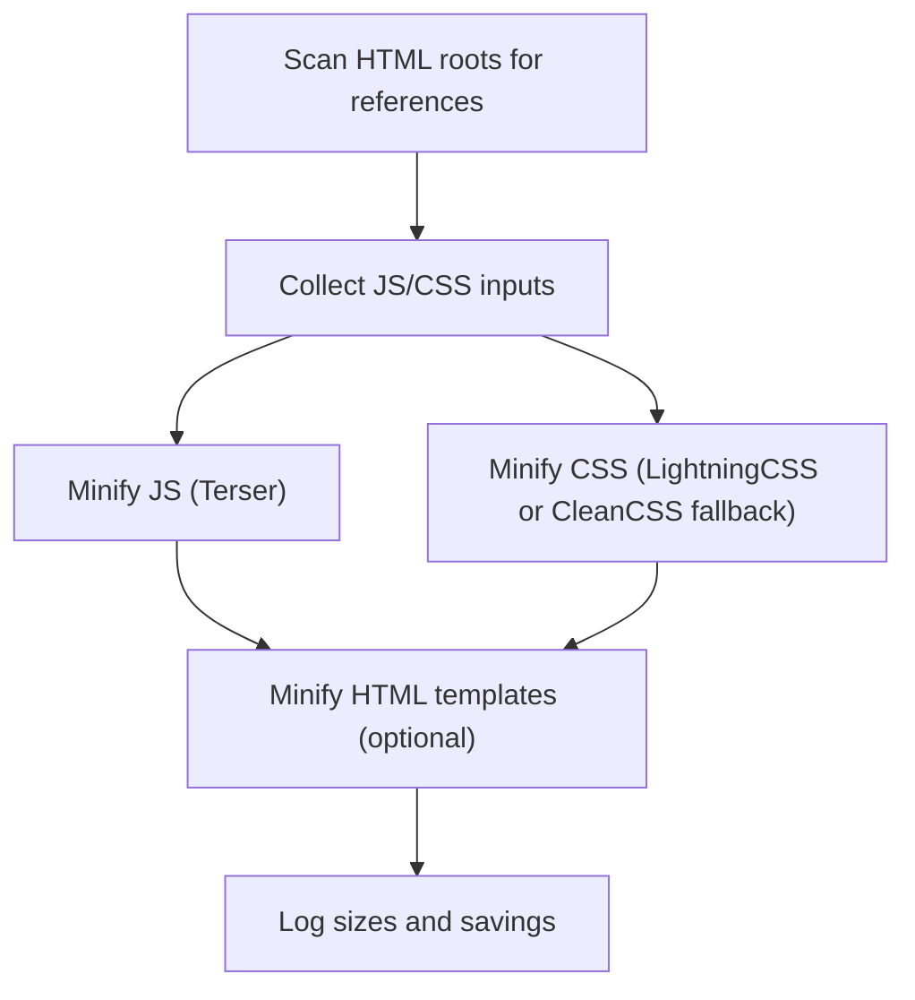
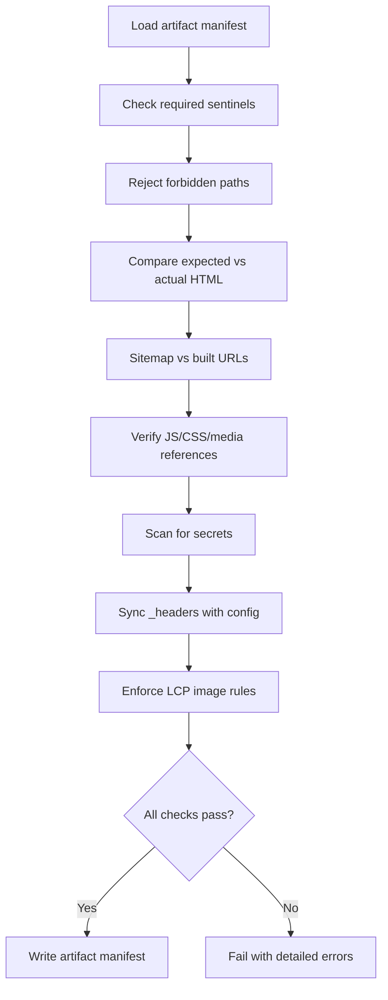
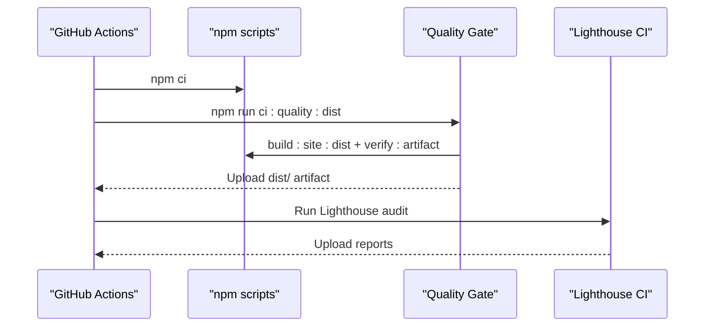
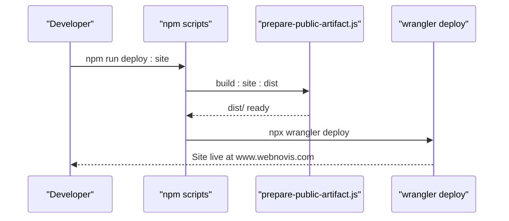
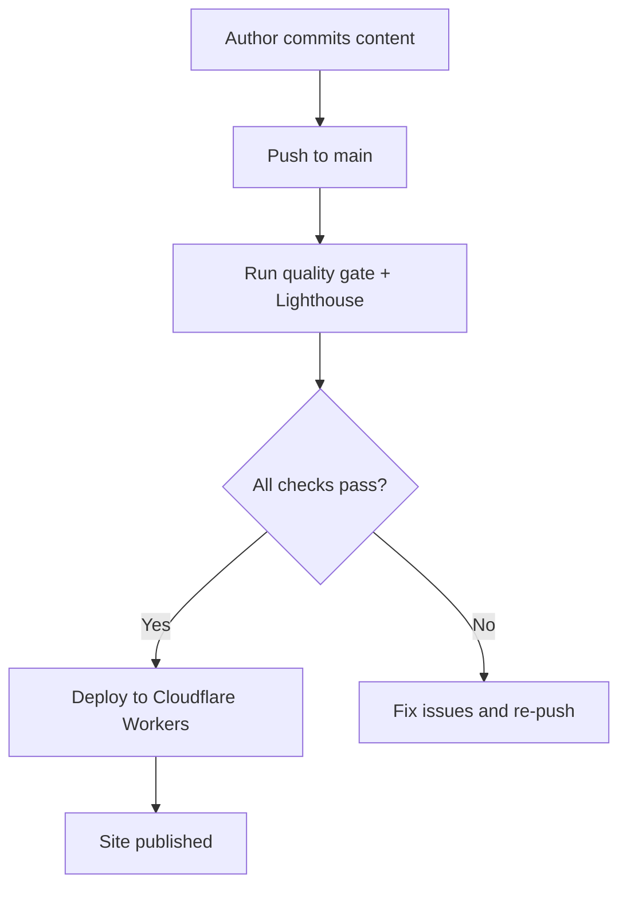
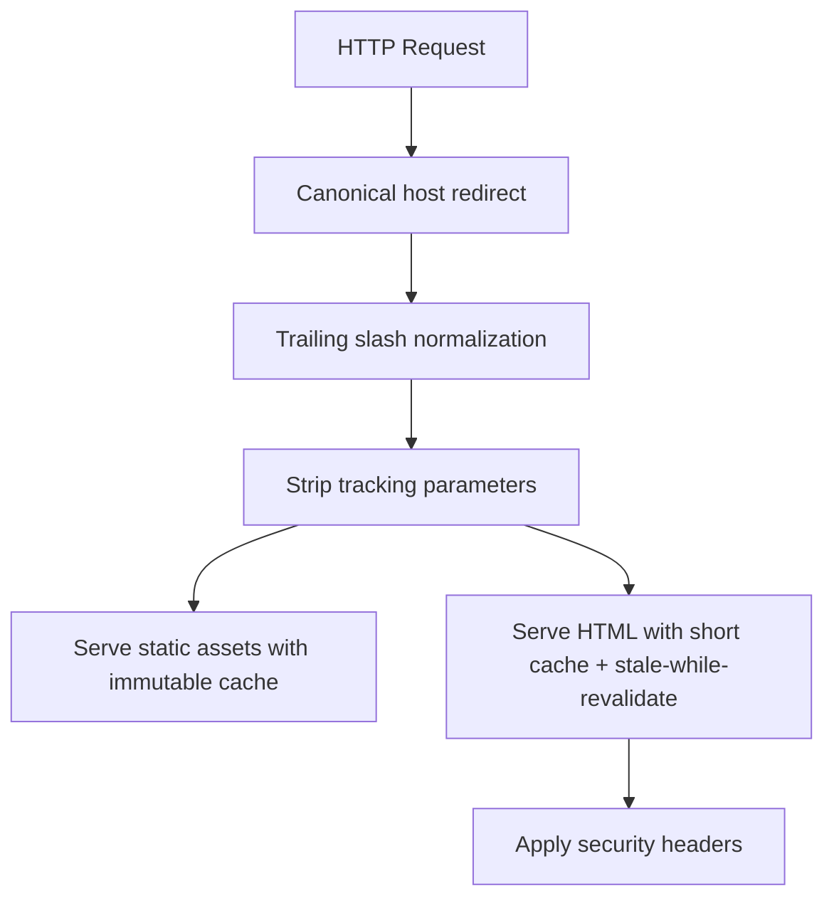
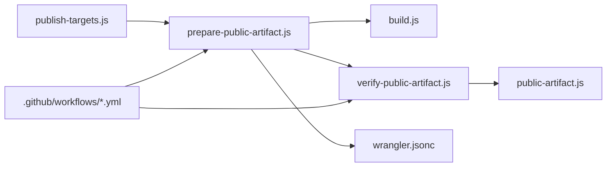

# Publishing Workflow & Deployment

<cite>
**Referenced Files in This Document**
- [package.json](file://package.json)
- [build.js](file://build.js)
- [server.js](file://server.js)
- [prepare-public-artifact.js](file://scripts/prepare-public-artifact.js)
- [public-artifact.js](file://scripts/public-artifact.js)
- [verify-public-artifact.js](file://scripts/verify-public-artifact.js)
- [publish-targets.js](file://config/publish-targets.js)
- [quality-gate.yml](file://.github/workflows/quality-gate.yml)
- [lighthouse-ci.yml](file://.github/workflows/lighthouse-ci.yml)
- [wrangler.jsonc](file://wrangler.jsonc)
- [setup-cloudflare-ai.sh](file://scripts/setup-cloudflare-ai.sh)
- [deploy-github.bat](file://deploy-github.bat)
</cite>

## Table of Contents
1. Introduction
2. Project Structure
3. Core Components
4. Architecture Overview
5. Detailed Component Analysis
6. Dependency Analysis
7. Performance Considerations
8. Troubleshooting Guide
9. Conclusion

## Introduction
This document explains WebNovis’ end-to-end publishing workflow and deployment pipeline. It covers how content moves from approval to production, including staging builds, version control integration, CI/CD gates, artifact preparation (asset bundling, cache busting, environment-specific configuration), and deployment to Cloudflare Workers. It also documents rollback behavior, monitoring hooks, automated testing gates, and verification steps that ensure a safe and reliable release.

## Project Structure
The project uses a dist-first, staged build model:
- Source code lives in the repository root.
- A dedicated staging directory is created per build to avoid mutating tracked sources.
- The final public artifact is produced into a safe publish target (dist/) after validation.
- GitHub Actions run quality checks and Lighthouse audits on pushes to main and on demand.
- Cloudflare Workers serves the static site from the dist/ artifact with explicit asset handling rules.

**Diagram sources**
- [quality-gate.yml:10-47](file://.github/workflows/quality-gate.yml#L10-L47)
- [prepare-public-artifact.js:183-259](file://scripts/prepare-public-artifact.js#L183-L259)
- [verify-public-artifact.js:235-393](file://scripts/verify-public-artifact.js#L235-L393)
- [wrangler.jsonc:22-28](file://wrangler.jsonc#L22-L28)

**Section sources**
- [package.json:6-60](file://package.json#L6-L60)
- [quality-gate.yml:1-47](file://.github/workflows/quality-gate.yml#L1-L47)
- [wrangler.jsonc:1-30](file://wrangler.jsonc#L1-L30)

## Core Components
- Build orchestration and asset minification: build.js
- Staging artifact preparation and promotion: scripts/prepare-public-artifact.js
- Public artifact policy and assertions: scripts/public-artifact.js
- Artifact verification and closure checks: scripts/verify-public-artifact.js
- Publish targets and environment resolution: config/publish-targets.js
- CI/CD quality gate and Lighthouse: .github/workflows/quality-gate.yml, lighthouse-ci.yml
- Production runtime and caching headers: server.js
- Deployment to Cloudflare Workers: wrangler.jsonc, package.json scripts
- AI worker setup and secrets management: scripts/setup-cloudflare-ai.sh
- Local GitHub Pages helper script: deploy-github.bat

**Section sources**
- [build.js:1-502](file://build.js#L1-L502)
- [prepare-public-artifact.js:1-280](file://scripts/prepare-public-artifact.js#L1-L280)
- [public-artifact.js:1-311](file://scripts/public-artifact.js#L1-L311)
- [verify-public-artifact.js:1-426](file://scripts/verify-public-artifact.js#L1-L426)
- [publish-targets.js:1-37](file://config/publish-targets.js#L1-L37)
- [quality-gate.yml:1-47](file://.github/workflows/quality-gate.yml#L1-L47)
- [lighthouse-ci.yml:1-27](file://.github/workflows/lighthouse-ci.yml#L1-L27)
- [server.js:224-530](file://server.js#L224-L530)
- [wrangler.jsonc:1-30](file://wrangler.jsonc#L1-L30)
- [setup-cloudflare-ai.sh:1-74](file://scripts/setup-cloudflare-ai.sh#L1-L74)
- [deploy-github.bat:1-140](file://deploy-github.bat#L1-L140)

## Architecture Overview
The pipeline enforces a strict separation between source and output, builds in an isolated staging area, validates the artifact thoroughly, and then promotes it atomically to dist/. CI runs quality gates and performance checks before artifacts are uploaded. Production is served by Cloudflare Workers configured to serve the dist/ directory without altering HTML URLs.

**Diagram sources**
- [package.json:32-58](file://package.json#L32-L58)
- [prepare-public-artifact.js:205-249](file://scripts/prepare-public-artifact.js#L205-L249)
- [build.js:373-496](file://build.js#L373-L496)
- [verify-public-artifact.js:235-393](file://scripts/verify-public-artifact.js#L235-L393)
- [wrangler.jsonc:22-28](file://wrangler.jsonc#L22-L28)

## Detailed Component Analysis

### Staging Artifact Preparation
- Creates an isolated staging directory per process to avoid polluting the source tree.
- Copies only allowed static assets (blog/portfolio pages, images, fonts, technical files).
- Runs generation steps for geo pages, search index, sitemap, LLM indexes, and security headers.
- Prunes unreferenced media/fonts to minimize artifact size.
- Validates pages and asserts artifact completeness before promoting to dist/.
- Uses SOURCE_DATE_EPOCH for reproducible builds and UTC timezone.

**Diagram sources**
- [prepare-public-artifact.js:60-125](file://scripts/prepare-public-artifact.js#L60-L125)
- [prepare-public-artifact.js:127-181](file://scripts/prepare-public-artifact.js#L127-L181)
- [prepare-public-artifact.js:183-259](file://scripts/prepare-public-artifact.js#L183-L259)

**Section sources**
- [prepare-public-artifact.js:1-280](file://scripts/prepare-public-artifact.js#L1-L280)
- [public-artifact.js:82-134](file://scripts/public-artifact.js#L82-L134)

### Asset Minification and Optimization
- Discovers JS and CSS inputs explicitly and via HTML references.
- Minifies JS with Terser; minifies CSS with Lightning CSS and falls back to CleanCSS when needed.
- Optionally minifies HTML templates from src/html/ while applying SEO transforms.
- Reports original vs. minified sizes and savings.

**Diagram sources**
- [build.js:242-279](file://build.js#L242-L279)
- [build.js:290-371](file://build.js#L290-L371)
- [build.js:428-496](file://build.js#L290-L496)

**Section sources**
- [build.js:1-502](file://build.js#L1-L502)

### Artifact Validation and Closure Checks
- Ensures required sentinel files exist and no forbidden paths leak into dist/.
- Validates expected HTML coverage against declared sources.
- Cross-checks sitemap.xml and search-index.json consistency.
- Verifies runtime closure: all referenced JS/CSS/media must be present.
- Scans for secret-like content and ensures _headers synchronization.
- Enforces LCP image priority constraints on homepage.

**Diagram sources**
- [verify-public-artifact.js:235-393](file://scripts/verify-public-artifact.js#L235-L393)
- [public-artifact.js:136-311](file://scripts/public-artifact.js#L136-L311)

**Section sources**
- [verify-public-artifact.js:1-426](file://scripts/verify-public-artifact.js#L1-L426)
- [public-artifact.js:1-311](file://scripts/public-artifact.js#L1-L311)

### CI/CD Integration and Automated Gates
- Quality Gate: installs dependencies, runs full dist build, verifies artifact, uploads dist/, and checks production headers on non-PR events.
- Lighthouse CI: runs performance audits on main pushes, manual triggers, and weekly schedule; uploads reports.
- Tests: regression suite includes build pipeline, public artifact, SEO, security, and more.

**Diagram sources**
- [quality-gate.yml:10-47](file://.github/workflows/quality-gate.yml#L10-L47)
- [lighthouse-ci.yml:8-27](file://.github/workflows/lighthouse-ci.yml#L8-L27)
- [package.json:42-58](file://package.json#L42-L58)

**Section sources**
- [quality-gate.yml:1-47](file://.github/workflows/quality-gate.yml#L1-L47)
- [lighthouse-ci.yml:1-27](file://.github/workflows/lighthouse-ci.yml#L1-L27)
- [package.json:6-60](file://package.json#L6-L60)

### Production Deployment and Rollback
- Deployment target: Cloudflare Workers serving the dist/ directory with html_handling set to none to preserve .html URLs.
- Dry-run support: npm run deploy:workers:check performs build and validation without uploading.
- Atomic promotion: prepare-public-artifact.js backs up previous dist/ and atomically swaps staging to dist/, enabling quick rollback by restoring the backup if needed.
- AI Worker deployment: setup script prepares data, authenticates, deploys, sets secrets, and performs a health check.

**Diagram sources**
- [package.json:51-58](file://package.json#L51-L58)
- [prepare-public-artifact.js:158-181](file://scripts/prepare-public-artifact.js#L158-L181)
- [wrangler.jsonc:22-28](file://wrangler.jsonc#L22-L28)
- [setup-cloudflare-ai.sh:14-67](file://scripts/setup-cloudflare-ai.sh#L14-L67)

**Section sources**
- [wrangler.jsonc:1-30](file://wrangler.jsonc#L1-L30)
- [prepare-public-artifact.js:158-181](file://scripts/prepare-public-artifact.js#L158-L181)
- [setup-cloudflare-ai.sh:1-74](file://scripts/setup-cloudflare-ai.sh#L1-L74)

### Content Approval Through Publication
- Content authors commit changes to the repository.
- On push to main (or via workflow dispatch), GitHub Actions trigger the quality gate and Lighthouse audits.
- If all checks pass, the artifact is promoted to dist/ and deployed to Cloudflare Workers.
- For local development or GitHub Pages, use the provided helper script to initialize and push to a GitHub repository configured for Pages.

**Diagram sources**
- [quality-gate.yml:10-47](file://.github/workflows/quality-gate.yml#L10-L47)
- [lighthouse-ci.yml:8-27](file://.github/workflows/lighthouse-ci.yml#L8-L27)
- [wrangler.jsonc:22-28](file://wrangler.jsonc#L22-L28)

**Section sources**
- [deploy-github.bat:1-140](file://deploy-github.bat#L1-L140)

### Cache Busting and Environment-Specific Configuration
- Static assets (CSS/JS/images) are served with long-lived immutable caching in production via headers.
- HTML pages use shorter cache with stale-while-revalidate to balance freshness and performance.
- Canonical host redirect (non-www to www) and trailing slash normalization are enforced in production.
- UTM/tracking parameter stripping prevents duplicate content.
- Security headers are synchronized into _headers during artifact preparation.

**Diagram sources**
- [server.js:291-384](file://server.js#L291-L384)
- [server.js:458-530](file://server.js#L458-L530)
- [verify-public-artifact.js:346-359](file://scripts/verify-public-artifact.js#L346-L359)

**Section sources**
- [server.js:224-530](file://server.js#L224-L530)
- [verify-public-artifact.js:346-359](file://scripts/verify-public-artifact.js#L346-L359)

## Dependency Analysis
- Build scripts depend on publish-targets for consistent root and output directories.
- prepare-public-artifact orchestrates multiple generators and validators.
- verify-public-artifact depends on public-artifact policies and security header generation.
- CI workflows invoke npm scripts that tie together build, validation, and deployment.
- Wrangler configuration defines the production asset directory and HTML handling mode.

**Diagram sources**
- [publish-targets.js:1-37](file://config/publish-targets.js#L1-L37)
- [prepare-public-artifact.js:1-280](file://scripts/prepare-public-artifact.js#L1-L280)
- [build.js:1-502](file://build.js#L1-L502)
- [verify-public-artifact.js:1-426](file://scripts/verify-public-artifact.js#L1-L426)
- [public-artifact.js:1-311](file://scripts/public-artifact.js#L1-L311)
- [wrangler.jsonc:1-30](file://wrangler.jsonc#L1-L30)
- [quality-gate.yml:1-47](file://.github/workflows/quality-gate.yml#L1-L47)

**Section sources**
- [package.json:6-60](file://package.json#L6-L60)
- [prepare-public-artifact.js:1-280](file://scripts/prepare-public-artifact.js#L1-L280)
- [verify-public-artifact.js:1-426](file://scripts/verify-public-artifact.js#L1-L426)

## Performance Considerations
- Asset minification reduces payload sizes; logs show savings for JS/CSS/HTML.
- Immutable caching for stable assets improves CDN performance.
- Short cache with stale-while-revalidate for HTML balances freshness and speed.
- Compression middleware reduces transfer sizes for text assets.
- Lighthouse CI monitors performance regressions on a schedule and on main pushes.

[No sources needed since this section provides general guidance]

## Troubleshooting Guide
- Build fails due to missing inputs: ensure JS and CSS inputs are discovered or explicitly listed.
- Artifact validation errors: check sentinel files, forbidden paths, missing HTML, sitemap mismatches, and runtime closure failures.
- Secrets detected in artifact: remove sensitive strings from sources; rely on environment variables and worker secrets.
- Header mismatch: regenerate _headers using the sync script to match security configuration.
- Deployment dry-run: use npm run deploy:workers:check to validate without uploading.
- AI worker issues: run setup script to authenticate, deploy, set secrets, and perform health check.

**Section sources**
- [build.js:373-496](file://build.js#L373-L496)
- [verify-public-artifact.js:235-393](file://scripts/verify-public-artifact.js#L235-L393)
- [setup-cloudflare-ai.sh:14-67](file://scripts/setup-cloudflare-ai.sh#L14-L67)

## Conclusion
WebNovis employs a robust, staged, and verified publishing workflow that separates source from output, enforces strict artifact policies, and automates quality and performance checks through CI/CD. The atomic promotion to dist/ and Cloudflare Workers deployment provide fast, safe releases with clear rollback options. Monitoring hooks and comprehensive validations ensure production stability and performance.

[No sources needed since this section summarizes without analyzing specific files]