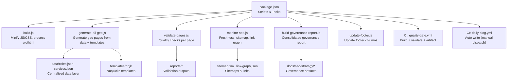
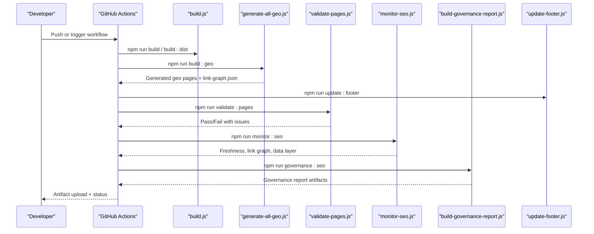
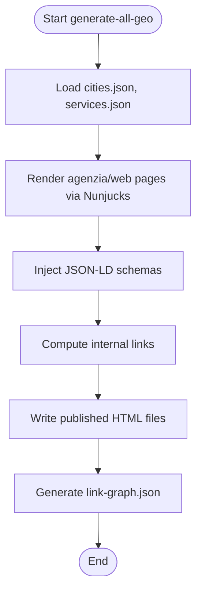
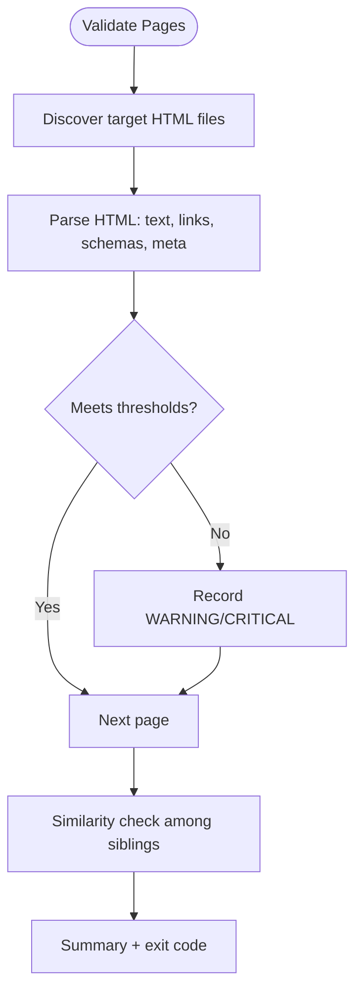
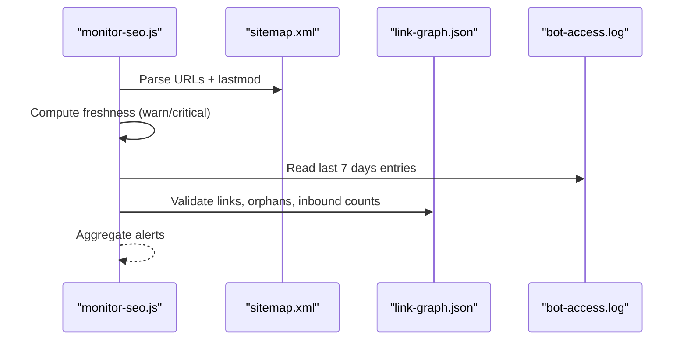
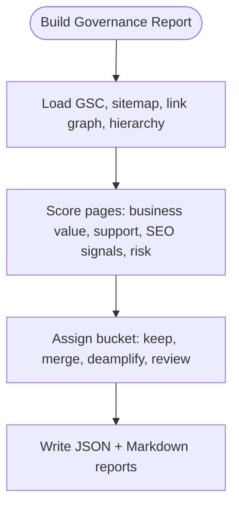
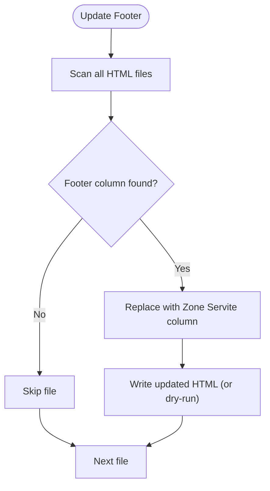
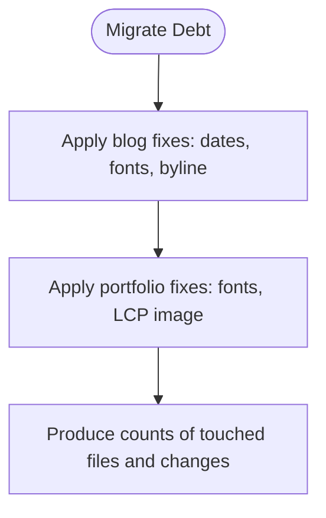
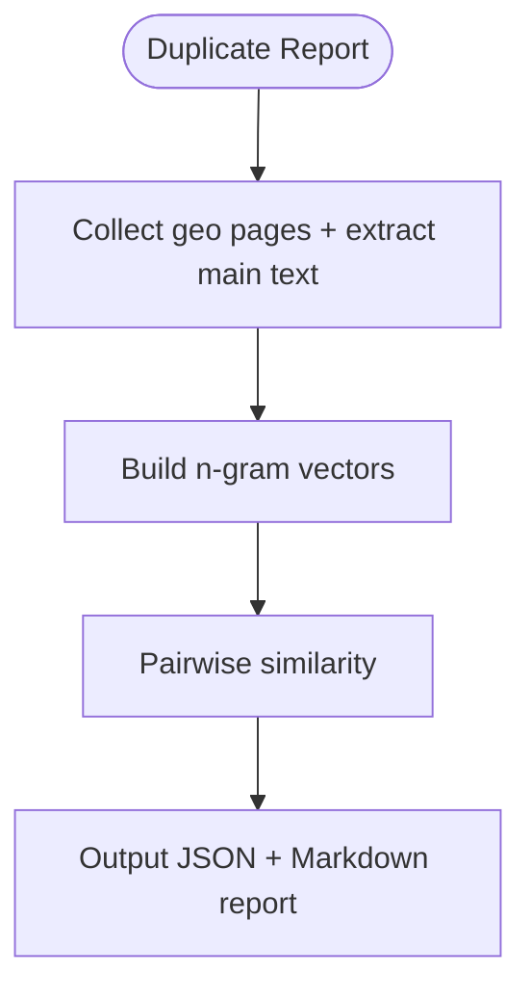
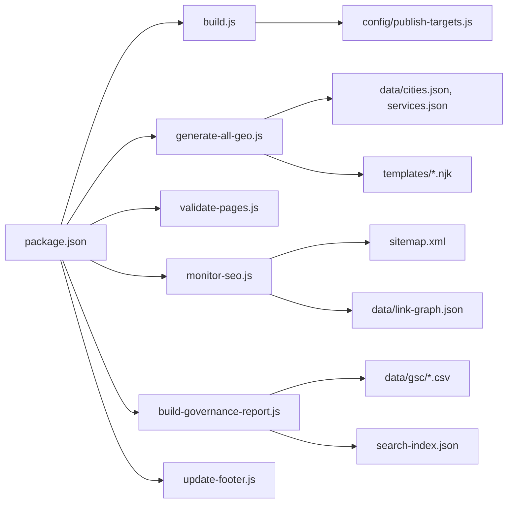

# Content Maintenance & Updates

<cite>
**Referenced Files in This Document**
- [package.json](file://package.json)
- [build.js](file://build.js)
- [publish-targets.js](file://config/publish-targets.js)
- [content-lastmod.json](file://data/content-lastmod.json)
- [monitor-seo.js](file://scripts/monitor-seo.js)
- [build-governance-report.js](file://scripts/build-governance-report.js)
- [generate-all-geo.js](file://scripts/generate-all-geo.js)
- [validate-pages.js](file://scripts/validate-pages.js)
- [update-footer.js](file://scripts/update-footer.js)
- [migrate-blog-article-debt.js](file://scripts/migrate-blog-article-debt.js)
- [migrate-portfolio-page-debt.js](file://scripts/migrate-portfolio-page-debt.js)
- [daily-blog.yml](file://.github/workflows/daily-blog.yml)
- [quality-gate.yml](file://.github/workflows/quality-gate.yml)
- [geo-duplicate-report.js](file://scripts/geo-duplicate-report.js)
</cite>

## Table of Contents
1. Introduction
2. Project Structure
3. Core Components
4. Architecture Overview
5. Detailed Component Analysis
6. Dependency Analysis
7. Performance Considerations
8. Troubleshooting Guide
9. Conclusion
10. Appendices

## Introduction
This document explains how WebNovis maintains and updates large-scale content across generated geo pages, blog articles, portfolio pages, and site-wide assets. It covers the end-to-end workflows for content generation, quality validation, auditing, deprecation handling, backward compatibility, performance monitoring, and automated maintenance. It also provides guidance on planning migrations, managing breaking changes, and scheduling recurring tasks.

## Project Structure
WebNovis uses a Node-based build and maintenance system with:
- A central build script that minifies JS/CSS and processes HTML templates
- A unified geo page generator producing city and service pages from centralized data and Nunjucks templates
- Quality validators to enforce content thresholds and schema presence
- SEO monitoring and governance reporting scripts
- CI/CD workflows for automated builds, validations, and deployments
- One-off migration scripts to fix legacy debt in blog and portfolio content

**Diagram sources**
- [package.json:6-60](file://package.json#L6-L60)
- [build.js:1-502](file://build.js#L1-L502)
- [generate-all-geo.js:1-58](file://scripts/generate-all-geo.js#L1-L58)
- [validate-pages.js:1-433](file://scripts/validate-pages.js#L1-L433)
- [monitor-seo.js:1-415](file://scripts/monitor-seo.js#L1-L415)
- [build-governance-report.js:1-800](file://scripts/build-governance-report.js#L1-L800)
- [update-footer.js:1-140](file://scripts/update-footer.js#L1-L140)
- [quality-gate.yml:1-47](file://.github/workflows/quality-gate.yml#L1-L47)
- [daily-blog.yml:1-56](file://.github/workflows/daily-blog.yml#L1-L56)

**Section sources**
- [package.json:6-60](file://package.json#L6-L60)
- [build.js:1-502](file://build.js#L1-L502)
- [generate-all-geo.js:1-58](file://scripts/generate-all-geo.js#L1-L58)
- [validate-pages.js:1-433](file://scripts/validate-pages.js#L1-L433)
- [monitor-seo.js:1-415](file://scripts/monitor-seo.js#L1-L415)
- [build-governance-report.js:1-800](file://scripts/build-governance-report.js#L1-L800)
- [update-footer.js:1-140](file://scripts/update-footer.js#L1-L140)
- [quality-gate.yml:1-47](file://.github/workflows/quality-gate.yml#L1-L47)
- [daily-blog.yml:1-56](file://.github/workflows/daily-blog.yml#L1-L56)

## Core Components
- Build pipeline: Minification of JS/CSS, optional HTML minification, asset discovery, and output publishing.
- Geo generator: Produces agenzia-web, realizzazione-siti-web, and servizio×città pages from centralized JSON and Nunjucks templates; generates link graphs and schemas.
- Page validator: Enforces word count, internal links, schema presence, canonical tags, meta description length, and similarity checks between sibling pages.
- SEO monitor: Analyzes sitemap freshness, bot crawl logs, link graph integrity, and data layer health; emits alerts.
- Governance reporter: Aggregates signals (GSC metrics, hierarchy keywords, link graph, search index) into prioritization buckets and reports.
- Footer updater: Idempotently replaces outdated footer columns with hub links after geo generation.
- Migration scripts: One-shot fixes for legacy blog/portfolio pages (dates, fonts, byline, LCP images).
- CI/CD: Quality gate ensures builds pass, artifacts are produced, and production headers verified; daily blog writer is manual-dispatch only.

**Section sources**
- [build.js:1-502](file://build.js#L1-L502)
- [generate-all-geo.js:1-58](file://scripts/generate-all-geo.js#L1-L58)
- [validate-pages.js:1-433](file://scripts/validate-pages.js#L1-L433)
- [monitor-seo.js:1-415](file://scripts/monitor-seo.js#L1-L415)
- [build-governance-report.js:1-800](file://scripts/build-governance-report.js#L1-L800)
- [update-footer.js:1-140](file://scripts/update-footer.js#L1-L140)
- [migrate-blog-article-debt.js:1-227](file://scripts/migrate-blog-article-debt.js#L1-L227)
- [migrate-portfolio-page-debt.js:1-124](file://scripts/migrate-portfolio-page-debt.js#L1-L124)
- [quality-gate.yml:1-47](file://.github/workflows/quality-gate.yml#L1-L47)
- [daily-blog.yml:1-56](file://.github/workflows/daily-blog.yml#L1-L56)

## Architecture Overview
The maintenance architecture orchestrates data-driven generation, quality enforcement, and continuous monitoring.

**Diagram sources**
- [package.json:6-60](file://package.json#L6-L60)
- [build.js:1-502](file://build.js#L1-L502)
- [generate-all-geo.js:1-58](file://scripts/generate-all-geo.js#L1-L58)
- [validate-pages.js:1-433](file://scripts/validate-pages.js#L1-L433)
- [monitor-seo.js:1-415](file://scripts/monitor-seo.js#L1-L415)
- [build-governance-report.js:1-800](file://scripts/build-governance-report.js#L1-L800)
- [update-footer.js:1-140](file://scripts/update-footer.js#L1-L140)
- [quality-gate.yml:1-47](file://.github/workflows/quality-gate.yml#L1-L47)

## Detailed Component Analysis

### Geo Content Generation and Lifecycle
- Data sources: cities.json and services.json define available cities and services.
- Templates: Nunjucks templates render structured content with JSON-LD schemas and internal linking.
- Outputs: City-specific pages, hub pages, and link-graph.json for cross-referencing.
- Validation: Word counts, schema presence, canonical tags, and similarity checks ensure quality.
- Freshness: Sitemap lastmod and content-lastmod.json track modification dates for freshness monitoring.

**Diagram sources**
- [generate-all-geo.js:1-58](file://scripts/generate-all-geo.js#L1-L58)
- [validate-pages.js:1-433](file://scripts/validate-pages.js#L1-L433)
- [content-lastmod.json:1-800](file://data/content-lastmod.json#L1-L800)

**Section sources**
- [generate-all-geo.js:1-58](file://scripts/generate-all-geo.js#L1-L58)
- [validate-pages.js:1-433](file://scripts/validate-pages.js#L1-L433)
- [content-lastmod.json:1-800](file://data/content-lastmod.json#L1-L800)

### Page Quality Validation
- Thresholds: Minimum unique words, internal links, JSON-LD schemas, canonical tag, H1/title presence, meta description length.
- Similarity detection: Trigram-based similarity identifies overly similar sibling pages.
- Scope: Can validate all HTML or filter by type (agenzia, realizzazione, servizio).
- Exit codes: Fails on critical issues; strict mode fails on warnings too.

**Diagram sources**
- [validate-pages.js:1-433](file://scripts/validate-pages.js#L1-L433)

**Section sources**
- [validate-pages.js:1-433](file://scripts/validate-pages.js#L1-L433)

### SEO Monitoring and Freshness
- Sitemap analysis: Counts URLs, categorizes by type, extracts lastmod dates.
- Freshness thresholds: Warns at 90+ days, critical at 180+ days without updates.
- Bot log analysis: Summarizes recent bot activity and unique pages crawled.
- Link graph integrity: Detects broken links, orphan files, zero-inbound pages, and mismatches between stored graph and rendered links.
- Data layer health: Reports cities/services coverage and potential page counts.

**Diagram sources**
- [monitor-seo.js:1-415](file://scripts/monitor-seo.js#L1-L415)

**Section sources**
- [monitor-seo.js:1-415](file://scripts/monitor-seo.js#L1-L415)

### Governance Reporting and Prioritization
- Inputs: GSC CSV exports, search index, sitemap, link graph, hierarchy keywords, historical priorities.
- Scoring: Business value, support strength, SEO signals, risk adjustments produce prioritization buckets.
- Output: JSON and Markdown reports guiding consolidation, deamplification, and content improvements.

**Diagram sources**
- [build-governance-report.js:1-800](file://scripts/build-governance-report.js#L1-L800)

**Section sources**
- [build-governance-report.js:1-800](file://scripts/build-governance-report.js#L1-L800)

### Footer Maintenance and Hub Integration
- Idempotent replacement: Replaces outdated “Località” column with “Zone Servite” hub links.
- Safety: Skips non-matching files; dry-run supported; runs after geo generation to ensure hubs exist.

**Diagram sources**
- [update-footer.js:1-140](file://scripts/update-footer.js#L1-L140)

**Section sources**
- [update-footer.js:1-140](file://scripts/update-footer.js#L1-L140)

### Legacy Debt Migration (Blog and Portfolio)
- Blog migration: Fixes article dates, adds skip-link and main id, defers Google Fonts, aligns CSS versions, standardizes byline.
- Portfolio migration: Defers Google Fonts, promotes first content image to eager with high fetch priority for LCP.

**Diagram sources**
- [migrate-blog-article-debt.js:1-227](file://scripts/migrate-blog-article-debt.js#L1-L227)
- [migrate-portfolio-page-debt.js:1-124](file://scripts/migrate-portfolio-page-debt.js#L1-L124)

**Section sources**
- [migrate-blog-article-debt.js:1-227](file://scripts/migrate-blog-article-debt.js#L1-L227)
- [migrate-portfolio-page-debt.js:1-124](file://scripts/migrate-portfolio-page-debt.js#L1-L124)

### Duplicate Content Detection
- Family grouping: Identifies page families by filename patterns.
- Similarity: Computes cosine similarity using n-gram vectors; highlights top same-city and same-family pairs.
- Repeated sentences: Finds sentences repeated across many pages to flag templating overuse.

**Diagram sources**
- [geo-duplicate-report.js:1-265](file://scripts/geo-duplicate-report.js#L1-L265)

**Section sources**
- [geo-duplicate-report.js:1-265](file://scripts/geo-duplicate-report.js#L1-L265)

## Dependency Analysis
- Scripts orchestrate dependencies through npm scripts and explicit module requires.
- Build depends on publish targets configuration for source and output roots.
- Geo generation depends on centralized data and templates; produces link-graph.json consumed by monitors and validators.
- CI workflows depend on scripts to assemble and verify artifacts.

**Diagram sources**
- [package.json:6-60](file://package.json#L6-L60)
- [publish-targets.js:1-37](file://config/publish-targets.js#L1-L37)
- [generate-all-geo.js:1-58](file://scripts/generate-all-geo.js#L1-L58)
- [monitor-seo.js:1-415](file://scripts/monitor-seo.js#L1-L415)
- [build-governance-report.js:1-800](file://scripts/build-governance-report.js#L1-L800)

**Section sources**
- [package.json:6-60](file://package.json#L6-L60)
- [publish-targets.js:1-37](file://config/publish-targets.js#L1-L37)
- [generate-all-geo.js:1-58](file://scripts/generate-all-geo.js#L1-L58)
- [monitor-seo.js:1-415](file://scripts/monitor-seo.js#L1-L415)
- [build-governance-report.js:1-800](file://scripts/build-governance-report.js#L1-L800)

## Performance Considerations
- Asset minification: JS minified with aggressive dead-code elimination; CSS minified with LightningCSS and CleanCSS fallback to preserve cascade safely.
- HTML processing: Optional minification applied to src/html outputs; geo-generated pages bypass this step to avoid unintended mutations.
- LCP optimization: Migration scripts promote first content images to eager with high fetch priority where appropriate.
- Font loading: Google Fonts deferred via media=print/onload plus noscript fallback to avoid render-blocking.
- Content similarity: Validators detect near-duplicate content to prevent thin or redundant pages that can hurt performance and SEO.

[No sources needed since this section provides general guidance]

## Troubleshooting Guide
Common issues and resolutions:
- Build errors: Check JS/CSS minification logs; use overrides in build config for problematic files.
- Missing footer updates: Ensure geo generation ran before footer update; verify hub pages exist.
- Validation failures: Address critical issues (missing canonical/H1/title, low word count); reduce similarity between sibling pages.
- Freshness alerts: Update lastmod in sitemap and content-lastmod.json; regenerate affected pages.
- Link graph mismatches: Rebuild link graph; ensure rendered links match stored graph; remove de-amplified targets if necessary.
- Duplicate content: Use duplicate report to identify and differentiate templated sections; adjust copy strategy.

**Section sources**
- [build.js:1-502](file://build.js#L1-L502)
- [update-footer.js:1-140](file://scripts/update-footer.js#L1-L140)
- [validate-pages.js:1-433](file://scripts/validate-pages.js#L1-L433)
- [monitor-seo.js:1-415](file://scripts/monitor-seo.js#L1-L415)
- [geo-duplicate-report.js:1-265](file://scripts/geo-duplicate-report.js#L1-L265)

## Conclusion
WebNovis employs a robust, data-driven content maintenance system combining generation, validation, monitoring, and governance reporting. The modular scripts enable scalable operations across thousands of geo pages while preserving quality, freshness, and performance. Automated CI gates and one-off migrations ensure long-term maintainability and safe evolution of the content ecosystem.

[No sources needed since this section summarizes without analyzing specific files]

## Appendices

### Example Update Scripts and Commands
- Generate geo pages: npm run build:geo
- Validate pages: npm run validate:pages
- Monitor SEO: npm run monitor:seo
- Build governance report: npm run governance:seo
- Update footers: npm run update:footer
- Normalize public HTML: npm run normalize:public-html
- Prepare dist artifact: npm run build:site:dist

**Section sources**
- [package.json:6-60](file://package.json#L6-L60)

### Audit Reports and Artifacts
- Governance report: docs/seo-strategy/governance-report.json and .md
- Duplicate report: reports/seo/geo-duplicate-report.json and .md
- Freshness tracking: data/content-lastmod.json and sitemap.xml lastmod entries

**Section sources**
- [build-governance-report.js:1-800](file://scripts/build-governance-report.js#L1-L800)
- [geo-duplicate-report.js:1-265](file://scripts/geo-duplicate-report.js#L1-L265)
- [content-lastmod.json:1-800](file://data/content-lastmod.json#L1-L800)

### Maintenance Schedules
- Daily blog writer: Manual dispatch via GitHub Actions; cron disabled to mitigate scaled content risks.
- Quality gate: Runs on push/PR; builds, validates, uploads artifact, verifies production headers.

**Section sources**
- [daily-blog.yml:1-56](file://.github/workflows/daily-blog.yml#L1-L56)
- [quality-gate.yml:1-47](file://.github/workflows/quality-gate.yml#L1-L47)

### Content Lifecycle Management and Archival Strategies
- Lifecycle stages: Draft (data/templates), Generated (HTML), Validated (checks passed), Published (dist artifact), Monitored (freshness and link integrity).
- Archival: Maintain historical priorities and audit artifacts under docs/archive; use governance reports to decide deamplification or consolidation.
- Cleanup: Remove orphan files detected by link graph checks; prune unused assets via build discovery and ignore lists.

[No sources needed since this section provides general guidance]

### Planning Content Migrations and Managing Breaking Changes
- Plan migrations with dry-run modes to preview changes before applying.
- Use governance reports to prioritize pages for migration or consolidation.
- Validate post-migration with page validators and duplicate reports to ensure no regressions.
- Coordinate CI gates to block merges that fail validation or alter tracked sources unexpectedly.

**Section sources**
- [migrate-blog-article-debt.js:1-227](file://scripts/migrate-blog-article-debt.js#L1-L227)
- [migrate-portfolio-page-debt.js:1-124](file://scripts/migrate-portfolio-page-debt.js#L1-L124)
- [validate-pages.js:1-433](file://scripts/validate-pages.js#L1-L433)
- [quality-gate.yml:1-47](file://.github/workflows/quality-gate.yml#L1-L47)