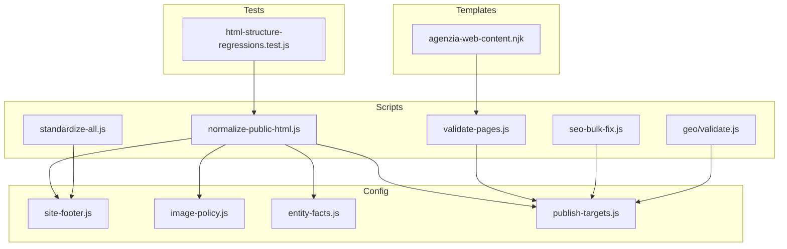
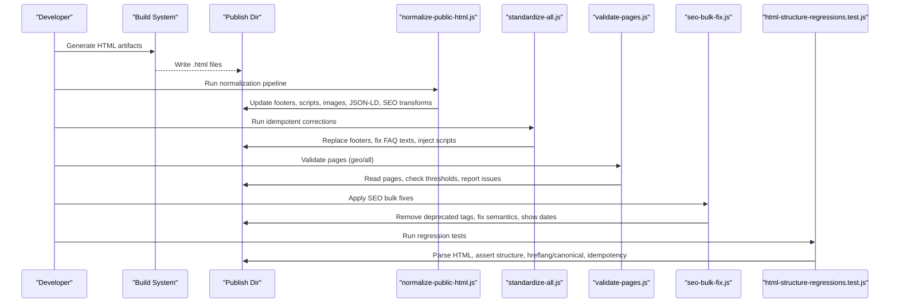
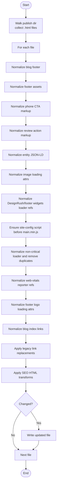
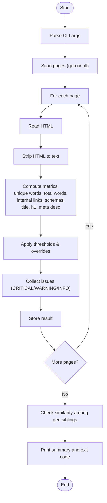
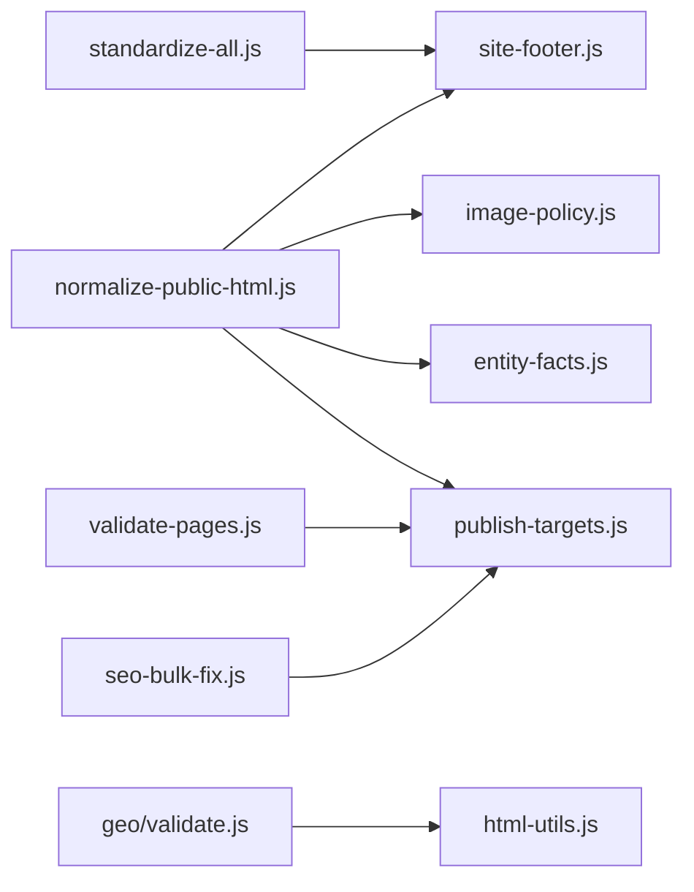

# Content Standardization Tools

<cite>
**Referenced Files in This Document**
- [standardize-all.js](file://scripts/standardize-all.js)
- [normalize-public-html.js](file://scripts/normalize-public-html.js)
- [validate-pages.js](file://scripts/validate-pages.js)
- [seo-bulk-fix.js](file://scripts/seo-bulk-fix.js)
- [site-footer.js](file://config/site-footer.js)
- [image-policy.js](file://config/image-policy.js)
- [entity-facts.js](file://config/entity-facts.js)
- [publish-targets.js](file://config/publish-targets.js)
- [html-utils.js](file://scripts/geo/html-utils.js)
- [agenzia-web-content.njk](file://templates/agenzia-web-content.njk)
- [validate.js](file://scripts/geo/validate.js)
- [html-structure-regressions.test.js](file://tests/html-structure-regressions.test.js)
</cite>

## Table of Contents
1. [Introduction](#introduction)
2. [Project Structure](#project-structure)
3. [Core Components](#core-components)
4. [Architecture Overview](#architecture-overview)
5. [Detailed Component Analysis](#detailed-component-analysis)
6. [Dependency Analysis](#dependency-analysis)
7. [Performance Considerations](#performance-considerations)
8. [Troubleshooting Guide](#troubleshooting-guide)
9. [Conclusion](#conclusion)
10. [Appendices](#appendices)

## Introduction
This document explains the content standardization system used by WebNovis to maintain formatting consistency, naming conventions, and structural integrity across all generated pages. It covers validation rules for HTML structure, metadata standards, and content formatting requirements. It also documents standardization scripts, validation patterns, error correction procedures, integration with template systems and content generators, and guidance for adding new rules while preserving backward compatibility.

## Project Structure
The standardization system is implemented as a set of Node.js scripts and configuration modules that operate on the published HTML artifact tree:
- Scripts:
  - Normalize public HTML assets and enforce consistent markup
  - Apply idempotent legacy corrections and footer standardization
  - Validate page quality thresholds and similarity constraints
  - Bulk fix SEO-related issues across the site
- Configuration:
  - Centralized footer generation and normalization utilities
  - Image loading policy enforcement
  - Entity facts normalization for JSON-LD
  - Publish directory resolution for tooling
- Templates:
  - Nunjucks templates define the canonical structure for geo pages (e.g., answer capsule, sections, FAQs)
- Tests:
  - Regression tests ensure structural correctness, hreflang/canonical alignment, and transform idempotency

**Diagram sources**
- [normalize-public-html.js](file://scripts/normalize-public-html.js)
- [standardize-all.js](file://scripts/standardize-all.js)
- [validate-pages.js](file://scripts/validate-pages.js)
- [seo-bulk-fix.js](file://scripts/seo-bulk-fix.js)
- [site-footer.js](file://config/site-footer.js)
- [image-policy.js](file://config/image-policy.js)
- [entity-facts.js](file://config/entity-facts.js)
- [publish-targets.js](file://config/publish-targets.js)
- [agenzia-web-content.njk](file://templates/agenzia-web-content.njk)
- [html-structure-regressions.test.js](file://tests/html-structure-regressions.test.js)

**Section sources**
- [normalize-public-html.js](file://scripts/normalize-public-html.js)
- [standardize-all.js](file://scripts/standardize-all.js)
- [validate-pages.js](file://scripts/validate-pages.js)
- [seo-bulk-fix.js](file://scripts/seo-bulk-fix.js)
- [site-footer.js](file://config/site-footer.js)
- [image-policy.js](file://config/image-policy.js)
- [entity-facts.js](file://config/entity-facts.js)
- [publish-targets.js](file://config/publish-targets.js)
- [agenzia-web-content.njk](file://templates/agenzia-web-content.njk)
- [html-structure-regressions.test.js](file://tests/html-structure-regressions.test.js)

## Core Components
- normalize-public-html.js: Orchestrates a pipeline of transformations applied to every HTML file in the publish directory. Ensures consistent footers, script loaders, image attributes, entity JSON-LD normalization, SEO transforms, and legacy link fixes.
- standardize-all.js: Applies idempotent corrections such as canonical footer replacement, FAQ text updates, price normalization for specific pages, and injecting required scripts into designated pages.
- validate-pages.js: Validates all or selected pages against quality thresholds (word count, internal links, schema presence, canonical/H1/title/meta description), and checks content similarity between sibling pages.
- seo-bulk-fix.js: Performs targeted SEO improvements across the site (removing deprecated schemas/tags, fixing semantic tags, exposing update dates).
- config modules: Provide shared building blocks for footer markup, image loading policies, entity normalization, and publish path resolution.
- Template system: Nunjucks templates define the canonical page structure and content slots for geo pages, ensuring consistent headings, answer capsules, and section ordering.

**Section sources**
- [normalize-public-html.js](file://scripts/normalize-public-html.js)
- [standardize-all.js](file://scripts/standardize-all.js)
- [validate-pages.js](file://scripts/validate-pages.js)
- [seo-bulk-fix.js](file://scripts/seo-bulk-fix.js)
- [site-footer.js](file://config/site-footer.js)
- [image-policy.js](file://config/image-policy.js)
- [entity-facts.js](file://config/entity-facts.js)
- [publish-targets.js](file://config/publish-targets.js)
- [agenzia-web-content.njk](file://templates/agenzia-web-content.njk)

## Architecture Overview
The standardization pipeline operates post-build on the published HTML artifact tree. Each script targets a specific concern but composes via shared configuration modules. Validation runs either on geo pages or all pages, depending on flags. The test suite enforces structural invariants and transform idempotency.

**Diagram sources**
- [normalize-public-html.js](file://scripts/normalize-public-html.js)
- [standardize-all.js](file://scripts/standardize-all.js)
- [validate-pages.js](file://scripts/validate-pages.js)
- [seo-bulk-fix.js](file://scripts/seo-bulk-fix.js)
- [html-structure-regressions.test.js](file://tests/html-structure-regressions.test.js)

## Detailed Component Analysis

### normalize-public-html.js
Purpose:
- Ensure consistent footer markup per directory depth
- Normalize third-party widget loaders and non-critical scripts
- Inject site-config before main.min.js once per page
- Enforce lazy loading for images unless whitelisted
- Normalize entity JSON-LD to canonical forms
- Apply SEO HTML transforms (robots, canonical, strategic links, local content upgrades)
- Fix legacy links and blog index references

Key behaviors:
- Walks the publish directory, skipping excluded folders
- Applies ordered transformations; writes only when changed
- Supports dry-run and selective processing via CLI flags

Validation and safety:
- Protects code/script/style blocks during replacements
- Preserves cache-busting query strings for versioned loaders
- Ensures single injection of critical loaders and scripts

**Diagram sources**
- [normalize-public-html.js](file://scripts/normalize-public-html.js)

**Section sources**
- [normalize-public-html.js](file://scripts/normalize-public-html.js)
- [site-footer.js](file://config/site-footer.js)
- [image-policy.js](file://config/image-policy.js)
- [entity-facts.js](file://config/entity-facts.js)
- [publish-targets.js](file://config/publish-targets.js)

### standardize-all.js
Purpose:
- Replace footers with canonical versions per directory prefix
- Apply curated FAQ answer updates
- Normalize pricing mentions for accessibility-related pages
- Inject cursor.min.js into newly added priority pages

Behavior:
- Scans multiple directories with appropriate relative prefixes
- Idempotent operations ensure safe re-runs
- Tracks counts for footers updated, FAQ fixes, and script injections

**Section sources**
- [standardize-all.js](file://scripts/standardize-all.js)
- [site-footer.js](file://config/site-footer.js)

### validate-pages.js
Purpose:
- Enforce pSEO anti-thin content thresholds
- Check canonical, H1, title, meta description length
- Count internal links and JSON-LD schemas
- Detect excessive similarity between sibling geo pages

Thresholds and overrides:
- Default thresholds for words, links, schemas, meta description lengths
- Path-based overrides for hubs, blog, portfolio, contacts, services
- Hub-specific overrides for minimum unique words

Similarity detection:
- Uses trigram Jaccard similarity on body text
- Flags pairs above configured thresholds with severity levels

Output:
- Per-page status with warnings/criticals
- Summary statistics and exit codes for CI gating

**Diagram sources**
- [validate-pages.js](file://scripts/validate-pages.js)

**Section sources**
- [validate-pages.js](file://scripts/validate-pages.js)

### seo-bulk-fix.js
Purpose:
- Remove FAQPage schema from commercial pages while keeping visible FAQ HTML
- Remove meta keywords and hreflang tags where unnecessary
- Fix semantic tags in footer (H3 to strong with roles)
- Show last modified date in blog articles based on JSON-LD dateModified

Behavior:
- Traverses all HTML files excluding non-content directories
- Applies targeted regex-based fixes
- Dry-run support and detailed logging

**Section sources**
- [seo-bulk-fix.js](file://scripts/seo-bulk-fix.js)

### geo/validate.js
Purpose:
- Fail-closed validation for generated GEO HTML
- Checks word count, internal links, schema count, canonical, H1, answer capsule
- Integrates claim governance to detect unsupported claims

Usage:
- Called by GEO generators to fail fast on invalid output

**Section sources**
- [validate.js](file://scripts/geo/validate.js)
- [html-utils.js](file://scripts/geo/html-utils.js)

### Template Integration (Nunjucks)
The agenzia-web-content.njk template defines the canonical structure for geo pages:
- Breadcrumb navigation
- Hero section with answer capsule class
- Local context sections
- Services grid with pricing
- Area served with internal links
- Market context and proof sections
- Comparison table sourced from data/services.json
- Work process steps
- Local sectors
- FAQ with FAQPage schema
- Blog links for internal linking
- Final CTA section

This ensures consistent heading hierarchy, content slots, and SEO-friendly structures across generated pages.

**Section sources**
- [agenzia-web-content.njk](file://templates/agenzia-web-content.njk)

### Structural Regression Tests
html-structure-regressions.test.js enforces:
- Exactly one doctype, html, head, body per page
- Required head elements: title, viewport, description, robots, canonical
- Indexable pages must have exactly one hreflang equal to it-IT matching canonical
- Skip links must target existing IDs
- Global SEO transforms must be idempotent

These tests run against the complete public HTML inventory to catch regressions early.

**Section sources**
- [html-structure-regressions.test.js](file://tests/html-structure-regressions.test.js)

## Dependency Analysis
The scripts compose through shared configuration modules and rely on the publish directory layout. Dependencies are explicit and localized:
- normalize-public-html.js depends on site-footer, image-policy, entity-facts, and publish-targets
- standardize-all.js depends on site-footer for canonical footer generation
- validate-pages.js uses publish-targets to locate the publish directory
- seo-bulk-fix.js operates directly on the root directory tree
- geo/validate.js uses html-utils for word counting and helpers

**Diagram sources**
- [normalize-public-html.js](file://scripts/normalize-public-html.js)
- [standardize-all.js](file://scripts/standardize-all.js)
- [validate-pages.js](file://scripts/validate-pages.js)
- [seo-bulk-fix.js](file://scripts/seo-bulk-fix.js)
- [site-footer.js](file://config/site-footer.js)
- [image-policy.js](file://config/image-policy.js)
- [entity-facts.js](file://config/entity-facts.js)
- [publish-targets.js](file://config/publish-targets.js)
- [html-utils.js](file://scripts/geo/html-utils.js)

**Section sources**
- [normalize-public-html.js](file://scripts/normalize-public-html.js)
- [standardize-all.js](file://scripts/standardize-all.js)
- [validate-pages.js](file://scripts/validate-pages.js)
- [seo-bulk-fix.js](file://scripts/seo-bulk-fix.js)
- [site-footer.js](file://config/site-footer.js)
- [image-policy.js](file://config/image-policy.js)
- [entity-facts.js](file://config/entity-facts.js)
- [publish-targets.js](file://config/publish-targets.js)
- [html-utils.js](file://scripts/geo/html-utils.js)

## Performance Considerations
- File I/O: Scripts read/write entire HTML files; consider batching or streaming for very large sites.
- Regex-heavy transformations: Patterns are optimized but can be costly; prefer targeted matches and guard clauses.
- Similarity checks: Trigram computation scales quadratically with sibling pages; limit scope to relevant groups.
- Idempotency: All transformations are designed to be safe to re-run, avoiding redundant work.
- Selective processing: Use --only= paths to limit normalization to affected files during development.

[No sources needed since this section provides general guidance]

## Troubleshooting Guide
Common issues and resolutions:
- Missing canonical or H1: validate-pages.js reports CRITICAL; ensure templates and SEO transforms include these elements.
- Excessive similarity between geo pages: adjust content differentiation in templates or data; reduce duplicate phrasing.
- Broken footer or missing loaders: normalize-public-html.js should correct references; verify directory prefixes and asset paths.
- Non-idempotent transforms: confirm applySeoHtmlTransforms returns stable output; debug patterns causing double application.
- Noindex pages with hreflang: tests will fail; ensure noindex pages omit hreflang links.

Operational tips:
- Use --dry-run in normalization and bulk fix scripts to preview changes.
- Run validate-pages.js with --verbose to inspect per-page issues.
- Use --strict mode to fail CI on warnings.

**Section sources**
- [validate-pages.js](file://scripts/validate-pages.js)
- [normalize-public-html.js](file://scripts/normalize-public-html.js)
- [seo-bulk-fix.js](file://scripts/seo-bulk-fix.js)
- [html-structure-regressions.test.js](file://tests/html-structure-regressions.test.js)

## Conclusion
WebNovis’ content standardization system combines robust normalization, validation, and corrective scripts with centralized configuration and templating. This ensures consistent formatting, naming conventions, and structural integrity across all generated pages. The modular design allows easy extension of rules while maintaining backward compatibility through idempotent operations and strict regression tests.

[No sources needed since this section summarizes without analyzing specific files]

## Appendices

### Adding New Standardization Rules
Guidelines:
- Prefer small, focused transformations in dedicated functions within existing scripts or new modules.
- Ensure idempotency: repeated runs must not alter already normalized content.
- Add or update thresholds in validate-pages.js if new quality checks are introduced.
- Extend LEGACY_LINK_REPLACEMENTS or similar maps for link migrations.
- Update templates to enforce new structural requirements consistently.
- Add regression tests to prevent future drift.

Backward compatibility:
- Avoid breaking changes to existing selectors or attributes.
- Use feature flags or conditional logic for optional enhancements.
- Maintain fallback behavior for older pages lacking new markers.

**Section sources**
- [normalize-public-html.js](file://scripts/normalize-public-html.js)
- [validate-pages.js](file://scripts/validate-pages.js)
- [html-structure-regressions.test.js](file://tests/html-structure-regressions.test.js)