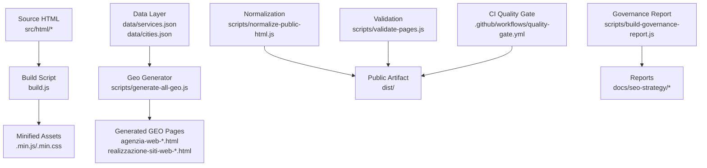
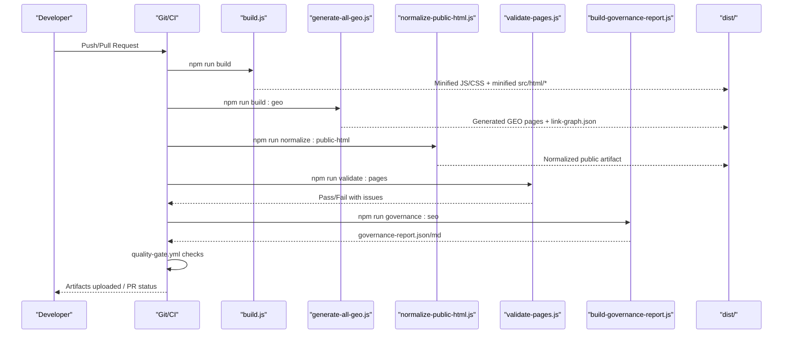
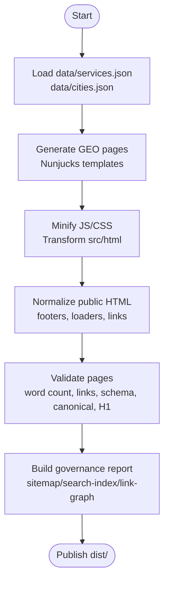
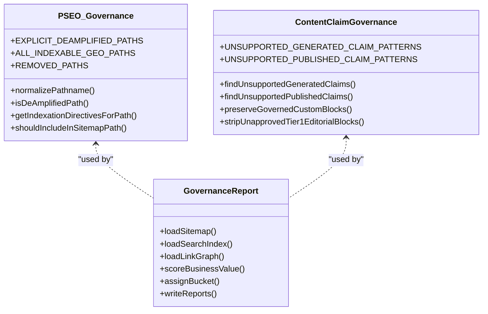
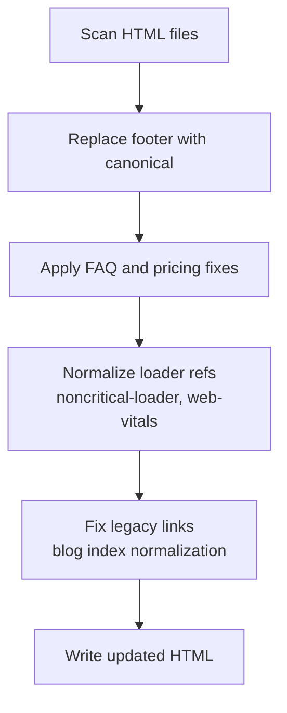
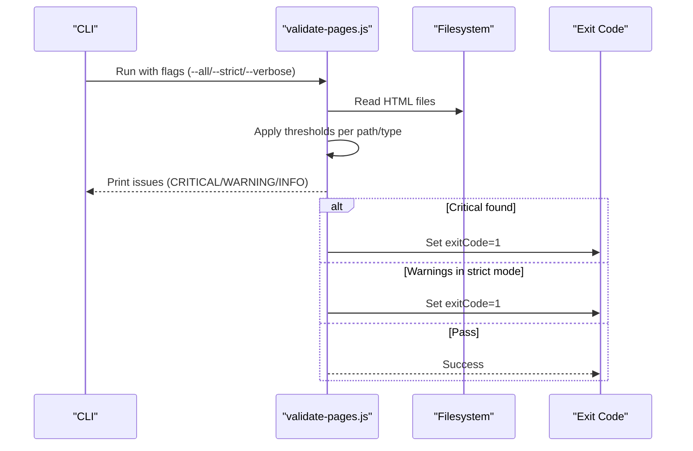
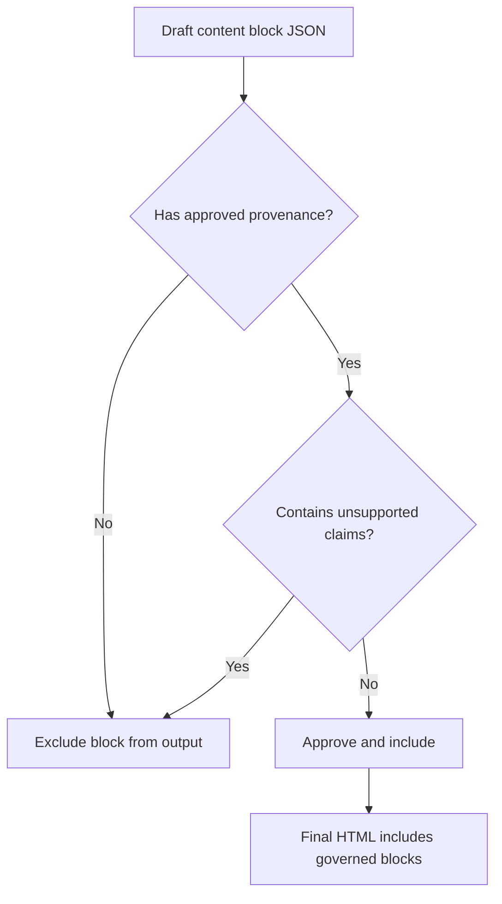
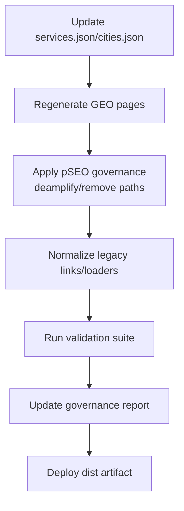
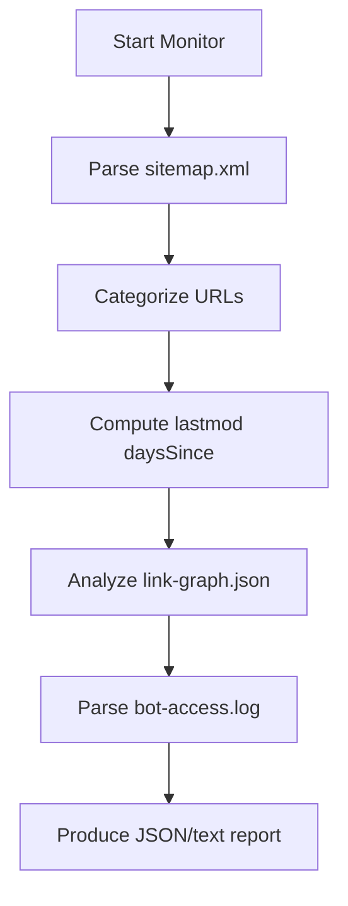
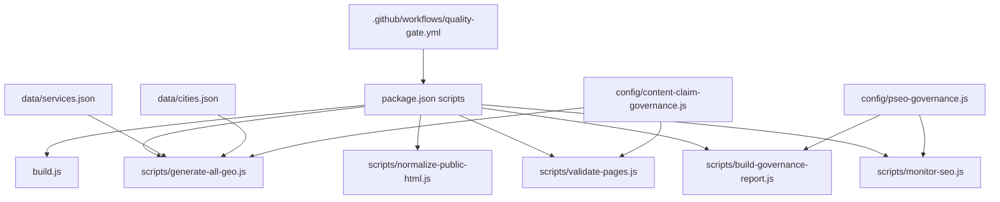

# Content Workflows & Management

<cite>
**Referenced Files in This Document**
- [README.md](file://README.md)
- [package.json](file://package.json)
- [build.js](file://build.js)
- [config/pseo-governance.js](file://config/pseo-governance.js)
- [config/content-claim-governance.js](file://config/content-claim-governance.js)
- [scripts/build-governance-report.js](file://scripts/build-governance-report.js)
- [scripts/validate-pages.js](file://scripts/validate-pages.js)
- [scripts/standardize-all.js](file://scripts/standardize-all.js)
- [scripts/generate-all-geo.js](file://scripts/generate-all-geo.js)
- [data/services.json](file://data/services.json)
- [data/cities.json](file://data/cities.json)
- [.github/workflows/quality-gate.yml](file://.github/workflows/quality-gate.yml)
- [scripts/monitor-seo.js](file://scripts/monitor-seo.js)
- [scripts/normalize-public-html.js](file://scripts/normalize-public-html.js)
</cite>

## Table of Contents
1. Introduction
2. Project Structure
3. Core Components
4. Architecture Overview
5. Detailed Component Analysis
6. Dependency Analysis
7. Performance Considerations
8. Troubleshooting Guide
9. Conclusion

## Introduction
This document explains WebNovis content management workflows from initial data entry through validation to final publication. It covers the governance reporting system for SEO compliance and brand consistency, standardization tools that enforce formatting and naming conventions, automation pipelines, review and approval strategies, versioning and deprecation handling, auditing, performance monitoring, and maintenance procedures for large-scale operations.

## Project Structure
WebNovis uses a Node-based build pipeline with centralized data (JSON), Nunjucks templates, and multiple scripts for generation, validation, normalization, and reporting. The CI quality gate enforces consistent builds and artifact verification.

**Diagram sources**
- [build.js:1-502](file://build.js#L1-L502)
- [scripts/generate-all-geo.js:1-58](file://scripts/generate-all-geo.js#L1-L58)
- [scripts/normalize-public-html.js:1-200](file://scripts/normalize-public-html.js#L1-L200)
- [scripts/validate-pages.js:1-433](file://scripts/validate-pages.js#L1-L433)
- [scripts/build-governance-report.js:1-200](file://scripts/build-governance-report.js#L1-L200)
- [.github/workflows/quality-gate.yml:1-47](file://.github/workflows/quality-gate.yml#L1-L47)

**Section sources**
- [README.md:1-120](file://README.md#L1-L120)
- [package.json:1-92](file://package.json#L1-L92)

## Core Components
- Build pipeline: asset minification, HTML minification, and SEO transforms.
- Geo page generator: creates service×city pages from centralized JSON and templates.
- Validation suite: checks word count, internal links, schema presence, canonical tags, H1, meta description, and similarity between sibling pages.
- Governance and pSEO control: indexability allowlists, claim scanning, and report generation.
- Standardization: footer normalization, legacy fixes, and idempotent updates across HTML.
- Monitoring: sitemap analysis, freshness checks, link graph integrity, and bot crawl insights.
- CI quality gate: deterministic dist-first builds, artifact verification, and production header checks.

**Section sources**
- [build.js:1-502](file://build.js#L1-L502)
- [scripts/generate-all-geo.js:1-58](file://scripts/generate-all-geo.js#L1-L58)
- [scripts/validate-pages.js:1-433](file://scripts/validate-pages.js#L1-L433)
- [config/pseo-governance.js:1-311](file://config/pseo-governance.js#L1-L311)
- [config/content-claim-governance.js:1-240](file://config/content-claim-governance.js#L1-L240)
- [scripts/standardize-all.js:1-138](file://scripts/standardize-all.js#L1-L138)
- [scripts/monitor-seo.js:1-200](file://scripts/monitor-seo.js#L1-L200)
- [.github/workflows/quality-gate.yml:1-47](file://.github/workflows/quality-gate.yml#L1-L47)

## Architecture Overview
The content pipeline is staged: source assets and data feed into generation and build steps; outputs are normalized and validated; reports and artifacts are produced; CI gates ensure correctness and safety.

**Diagram sources**
- [build.js:1-502](file://build.js#L1-L502)
- [scripts/generate-all-geo.js:1-58](file://scripts/generate-all-geo.js#L1-L58)
- [scripts/normalize-public-html.js:1-200](file://scripts/normalize-public-html.js#L1-L200)
- [scripts/validate-pages.js:1-433](file://scripts/validate-pages.js#L1-L433)
- [scripts/build-governance-report.js:1-200](file://scripts/build-governance-report.js#L1-L200)
- [.github/workflows/quality-gate.yml:1-47](file://.github/workflows/quality-gate.yml#L1-L47)

## Detailed Component Analysis

### Content Creation Pipeline: Data Entry to Publication
- Centralized data: services and cities drive page generation.
- Template engine: Nunjucks templates render structured content blocks.
- Generation: script produces both agency and realization city pages with internal linking and JSON-LD schemas.
- Build: assets are minified; src/html is transformed and minified.
- Normalization: footers, loaders, and non-critical scripts are standardized; legacy links are corrected.
- Validation: quality thresholds enforced per page type; similarity checks prevent thin or duplicate content.
- Reporting: governance report aggregates signals from sitemap, search index, historical priorities, and link graph.

**Diagram sources**
- [data/services.json:1-307](file://data/services.json#L1-L307)
- [data/cities.json:1-200](file://data/cities.json#L1-L200)
- [scripts/generate-all-geo.js:1-58](file://scripts/generate-all-geo.js#L1-L58)
- [build.js:1-502](file://build.js#L1-L502)
- [scripts/normalize-public-html.js:1-200](file://scripts/normalize-public-html.js#L1-L200)
- [scripts/validate-pages.js:1-433](file://scripts/validate-pages.js#L1-L433)
- [scripts/build-governance-report.js:1-200](file://scripts/build-governance-report.js#L1-L200)

**Section sources**
- [scripts/generate-all-geo.js:1-58](file://scripts/generate-all-geo.js#L1-L58)
- [build.js:1-502](file://build.js#L1-L502)
- [scripts/normalize-public-html.js:1-200](file://scripts/normalize-public-html.js#L1-L200)
- [scripts/validate-pages.js:1-433](file://scripts/validate-pages.js#L1-L433)

### Governance Reporting System: SEO Compliance and Brand Consistency
- pSEO governance: allowlist-based indexation control for GEO paths; de-amplifies non-strategic pages and excludes removed paths from sitemaps.
- Claim governance: scans generated and published text for unsupported claims; preserves governed custom blocks only when approved.
- Governance report: aggregates metrics from sitemap, search index, historical priorities, link graph, and hierarchy keywords to score and bucket pages.

**Diagram sources**
- [config/pseo-governance.js:1-311](file://config/pseo-governance.js#L1-L311)
- [config/content-claim-governance.js:1-240](file://config/content-claim-governance.js#L1-L240)
- [scripts/build-governance-report.js:1-200](file://scripts/build-governance-report.js#L1-L200)

**Section sources**
- [config/pseo-governance.js:1-311](file://config/pseo-governance.js#L1-L311)
- [config/content-claim-governance.js:1-240](file://config/content-claim-governance.js#L1-L240)
- [scripts/build-governance-report.js:1-200](file://scripts/build-governance-report.js#L1-L200)

### Content Standardization Tools: Formatting, Naming, Structural Integrity
- Footer standardization: ensures canonical footer markup across all HTML files.
- Legacy corrections: idempotent FAQ answer replacements and price adjustments for priority pages.
- Loader normalization: ensures single, correct references for non-critical loaders and web-vitals reporter.
- Link normalization: maps legacy hrefs to current URLs and normalizes blog index links.

**Diagram sources**
- [scripts/standardize-all.js:1-138](file://scripts/standardize-all.js#L1-L138)
- [scripts/normalize-public-html.js:1-200](file://scripts/normalize-public-html.js#L1-L200)

**Section sources**
- [scripts/standardize-all.js:1-138](file://scripts/standardize-all.js#L1-L138)
- [scripts/normalize-public-html.js:1-200](file://scripts/normalize-public-html.js#L1-L200)

### Workflow Automation, Validation Rules, and Error Handling
- Automation: package scripts orchestrate geo generation, normalization, validation, reporting, and CI checks.
- Validation rules: minimum unique words, internal links, JSON-LD schemas, canonical tag, H1, meta description length, and similarity thresholds.
- Error handling: critical vs warning levels; strict mode fails on warnings; exit codes set for CI integration.

**Diagram sources**
- [scripts/validate-pages.js:1-433](file://scripts/validate-pages.js#L1-L433)
- [package.json:1-92](file://package.json#L1-L92)

**Section sources**
- [scripts/validate-pages.js:1-433](file://scripts/validate-pages.js#L1-L433)
- [package.json:1-92](file://package.json#L1-L92)

### Content Review Process, Approval Workflows, and Version Control
- Approval model: content blocks require metadata indicating publication status, verified date, and approver; unapproved blocks are excluded from output.
- Custom block governance: claim-bearing blocks preserved only if approved; tier1 editorial blocks stripped unless explicitly allowed.
- Version control: CI runs dist-first builds and verifies no tracked sources mutated; artifacts uploaded for review.

**Diagram sources**
- [config/content-claim-governance.js:1-240](file://config/content-claim-governance.js#L1-L240)
- [.github/workflows/quality-gate.yml:1-47](file://.github/workflows/quality-gate.yml#L1-L47)

**Section sources**
- [config/content-claim-governance.js:1-240](file://config/content-claim-governance.js#L1-L240)
- [.github/workflows/quality-gate.yml:1-47](file://.github/workflows/quality-gate.yml#L1-L47)

### Managing Updates, Deprecations, and Backward Compatibility
- Deprecation strategy: explicit deamplified and removed path sets; canonical redirects planned via 301/404 while residual files remain de-amplified.
- Service catalog deprecations: deprecated clusters flagged with canonical slugs and notes guiding migration.
- Backward compatibility: legacy link mappings and footer/loader normalization ensure stable user experience during transitions.

**Diagram sources**
- [config/pseo-governance.js:1-311](file://config/pseo-governance.js#L1-L311)
- [data/services.json:1-307](file://data/services.json#L1-L307)
- [scripts/normalize-public-html.js:1-200](file://scripts/normalize-public-html.js#L1-L200)
- [scripts/validate-pages.js:1-433](file://scripts/validate-pages.js#L1-L433)
- [scripts/build-governance-report.js:1-200](file://scripts/build-governance-report.js#L1-L200)

**Section sources**
- [config/pseo-governance.js:1-311](file://config/pseo-governance.js#L1-L311)
- [data/services.json:1-307](file://data/services.json#L1-L307)
- [scripts/normalize-public-html.js:1-200](file://scripts/normalize-public-html.js#L1-L200)

### Auditing Tools, Performance Monitoring, and Maintenance Procedures
- Sitemap analysis: counts total indexed pages, categorizes by type, and computes core vs category splits.
- Freshness checks: identifies stale and critical pages based on lastmod timestamps.
- Link graph integrity: detects orphan pages, broken internal links, and mismatches between stored and rendered links.
- Bot crawl insights: summarizes recent bot activity and unique pages crawled.
- Monitoring script: supports JSON output for CI/alerting and focused modes like freshness-only checks.

**Diagram sources**
- [scripts/monitor-seo.js:1-200](file://scripts/monitor-seo.js#L1-L200)

**Section sources**
- [scripts/monitor-seo.js:1-200](file://scripts/monitor-seo.js#L1-L200)

## Dependency Analysis
Key dependencies and relationships among components:

**Diagram sources**
- [package.json:1-92](file://package.json#L1-L92)
- [build.js:1-502](file://build.js#L1-L502)
- [scripts/generate-all-geo.js:1-58](file://scripts/generate-all-geo.js#L1-L58)
- [scripts/normalize-public-html.js:1-200](file://scripts/normalize-public-html.js#L1-L200)
- [scripts/validate-pages.js:1-433](file://scripts/validate-pages.js#L1-L433)
- [scripts/build-governance-report.js:1-200](file://scripts/build-governance-report.js#L1-L200)
- [scripts/monitor-seo.js:1-200](file://scripts/monitor-seo.js#L1-L200)
- [config/pseo-governance.js:1-311](file://config/pseo-governance.js#L1-L311)
- [config/content-claim-governance.js:1-240](file://config/content-claim-governance.js#L1-L240)
- [data/services.json:1-307](file://data/services.json#L1-L307)
- [data/cities.json:1-200](file://data/cities.json#L1-L200)
- [.github/workflows/quality-gate.yml:1-47](file://.github/workflows/quality-gate.yml#L1-L47)

**Section sources**
- [package.json:1-92](file://package.json#L1-L92)
- [config/pseo-governance.js:1-311](file://config/pseo-governance.js#L1-L311)
- [config/content-claim-governance.js:1-240](file://config/content-claim-governance.js#L1-L240)

## Performance Considerations
- Asset minification: JS via Terser, CSS via LightningCSS with CleanCSS fallback; HTML minification applied to src/html outputs.
- Non-critical loading: deferred loaders reduce blocking resources; web-vitals reporter isolated.
- Sitemap parsing and link graph analysis are file-based and efficient; avoid excessive regex passes on large files.
- CI dist-first builds ensure deterministic outputs and faster feedback loops.

[No sources needed since this section provides general guidance]

## Troubleshooting Guide
- Missing canonical/H1/title: validator flags critical issues; regenerate or fix templates/data.
- Thin content or low internal links: increase unique words and add meaningful internal links; adjust thresholds per page type if necessary.
- Similarity warnings: differentiate sibling pages by enriching local context and FAQs; avoid template duplication.
- Unsupported claims: edit content blocks to remove prohibited patterns; ensure approved provenance metadata.
- De-amplified pages: verify pSEO allowlist; update tier membership or remove deprecated paths.
- Header verification failures: ensure production headers match policy; use CI job to detect missing CSP/Permissions-Policy.

**Section sources**
- [scripts/validate-pages.js:1-433](file://scripts/validate-pages.js#L1-L433)
- [config/content-claim-governance.js:1-240](file://config/content-claim-governance.js#L1-L240)
- [config/pseo-governance.js:1-311](file://config/pseo-governance.js#L1-L311)
- [.github/workflows/quality-gate.yml:1-47](file://.github/workflows/quality-gate.yml#L1-L47)

## Conclusion
WebNovis implements a robust, data-driven content workflow with strong governance, validation, and standardization. The pipeline ensures SEO compliance, brand consistency, and high-quality outputs at scale. CI-enforced dist-first builds and comprehensive reporting provide confidence for large-scale content operations and continuous improvement.

[No sources needed since this section summarizes without analyzing specific files]