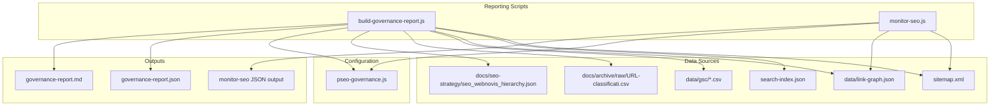
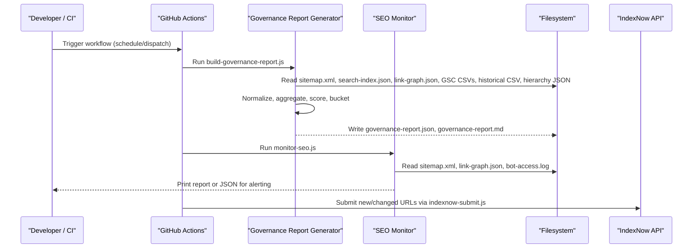
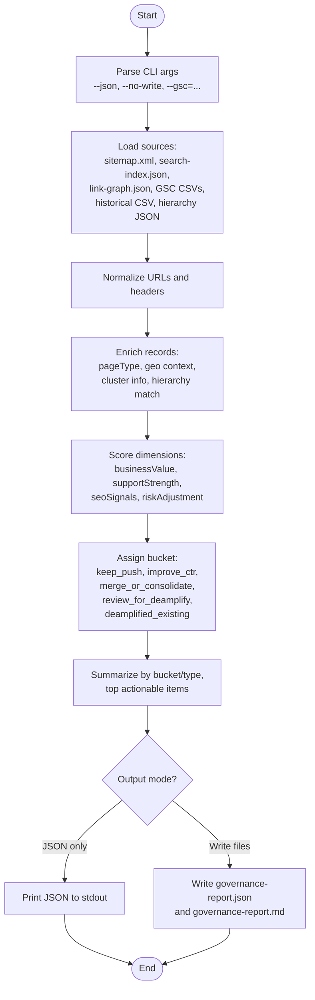
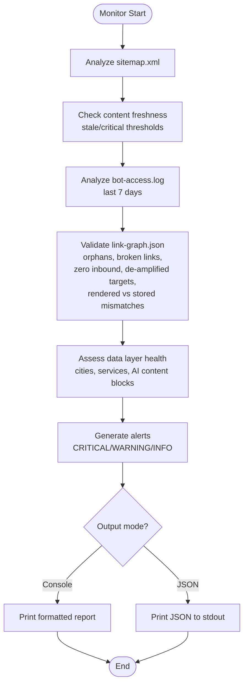
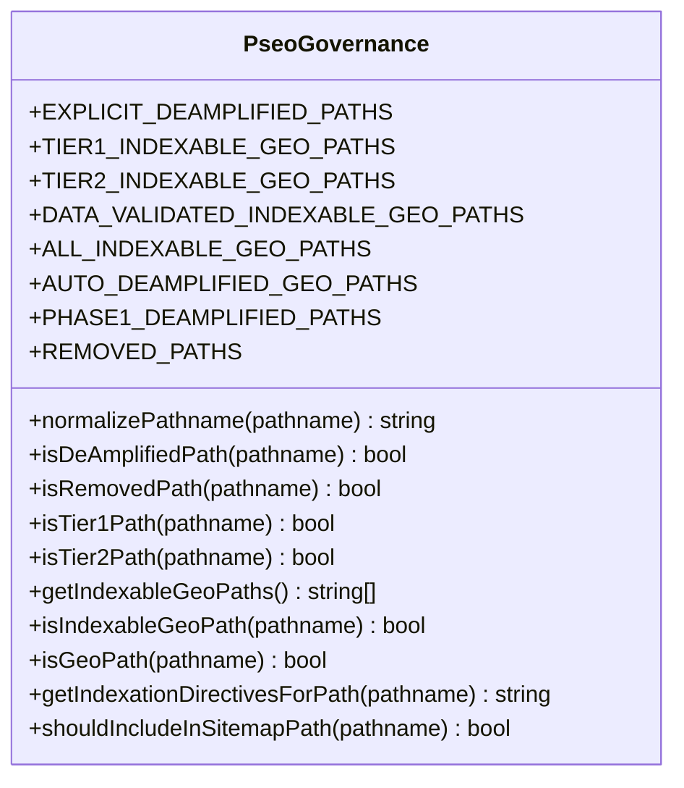
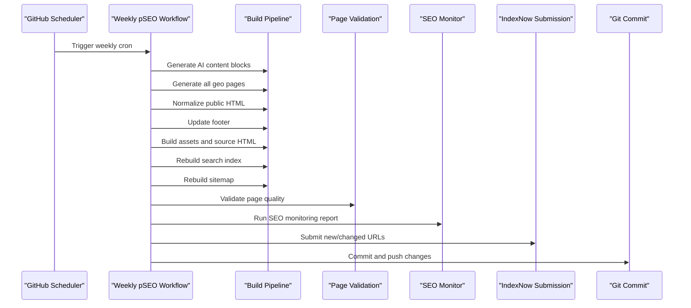
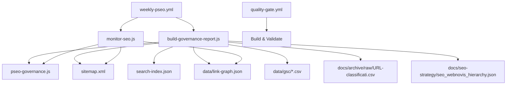

# Automated Reporting & Monitoring

<cite>
**Referenced Files in This Document**
- [scripts/build-governance-report.js](file://scripts/build-governance-report.js)
- [scripts/monitor-seo.js](file://scripts/monitor-seo.js)
- [config/pseo-governance.js](file://config/pseo-governance.js)
- [.github/workflows/weekly-pseo.yml](file://.github/workflows/weekly-pseo.yml)
- [.github/workflows/daily-blog.yml](file://.github/workflows/daily-blog.yml)
- [.github/workflows/quality-gate.yml](file://.github/workflows/quality-gate.yml)
- [package.json](file://package.json)
- [data/gsc/README.md](file://data/gsc/README.md)
- [reports/seo/geo-indexable-audit.json](file://reports/seo/geo-indexable-audit.json)
- [tests/seo-governance-report.test.js](file://tests/seo-governance-report.test.js)
</cite>

## Table of Contents
1. [Introduction](#introduction)
2. [Project Structure](#project-structure)
3. [Core Components](#core-components)
4. [Architecture Overview](#architecture-overview)
5. [Detailed Component Analysis](#detailed-component-analysis)
6. [Dependency Analysis](#dependency-analysis)
7. [Performance Considerations](#performance-considerations)
8. [Troubleshooting Guide](#troubleshooting-guide)
9. [Conclusion](#conclusion)
10. [Appendices](#appendices)

## Introduction
This document explains the automated reporting and monitoring system that powers SEO governance, continuous monitoring, and CI/CD integration for the project. It covers how the governance report generator aggregates data from multiple sources (Google Search Console exports, sitemap analysis, link graphs, search indexes, and historical priorities), how reports are generated and visualized (JSON and Markdown), and how to integrate these tools into CI/CD pipelines for continuous monitoring and alerting. It also provides guidance on configuring schedules, customizing sections, and integrating with external monitoring tools.

## Project Structure
The reporting and monitoring system is implemented as Node.js scripts orchestrated by GitHub Actions workflows and npm scripts:
- Governance report generator: builds a comprehensive SEO governance report aggregating multiple data sources and outputs JSON and Markdown.
- SEO monitoring script: performs post-deploy checks on sitemap freshness, bot crawl logs, link graph integrity, and data layer health.
- Governance policy configuration: defines indexation allowlists and de-amplification rules for GEO pages.
- CI/CD workflows: schedule and run generation, validation, monitoring, and IndexNow submissions.
- Package scripts: expose convenient commands for local development and CI usage.

**Diagram sources**
- [scripts/build-governance-report.js:1-1223](file://scripts/build-governance-report.js#L1-L1223)
- [scripts/monitor-seo.js:1-415](file://scripts/monitor-seo.js#L1-L415)
- [config/pseo-governance.js:1-311](file://config/pseo-governance.js#L1-L311)

**Section sources**
- [scripts/build-governance-report.js:1-1223](file://scripts/build-governance-report.js#L1-L1223)
- [scripts/monitor-seo.js:1-415](file://scripts/monitor-seo.js#L1-L415)
- [config/pseo-governance.js:1-311](file://config/pseo-governance.js#L1-L311)

## Core Components
- Governance Report Generator: Aggregates URLs from sitemap, search index, historical priorities, de-amplified paths, and link graph; enriches each URL with page type detection, geo context, cluster membership, hierarchy matching, and optional GSC metrics; scores business value, support strength, SEO signals, and risk adjustments; assigns actionable buckets; outputs JSON and Markdown summaries.
- SEO Monitoring Script: Analyzes sitemap content freshness, bot crawl logs, link graph integrity (orphan files, broken links, zero inbound, de-amplified targets, mismatches), and data layer health; produces console or JSON output suitable for CI alerts.
- Governance Policy Configuration: Defines tiered allowlists for indexable GEO paths, explicit de-amplified paths, removed paths, and utilities to determine indexation directives and sitemap inclusion.

Key capabilities:
- Multi-source aggregation and normalization (URLs, CSV columns, XML parsing).
- Scoring and bucketing for prioritization and actionability.
- Flexible CLI flags for JSON-only output and custom GSC file inputs.
- CI-friendly outputs for automation and alerting.

**Section sources**
- [scripts/build-governance-report.js:1-1223](file://scripts/build-governance-report.js#L1-L1223)
- [scripts/monitor-seo.js:1-415](file://scripts/monitor-seo.js#L1-L415)
- [config/pseo-governance.js:1-311](file://config/pseo-governance.js#L1-L311)

## Architecture Overview
The system follows a pipeline architecture:
- Data ingestion: Reads structured data (CSV, JSON, XML) and applies normalization and enrichment.
- Processing: Computes scores, reasons, and next steps per URL based on governance policies and observed signals.
- Output: Produces machine-readable JSON and human-readable Markdown for review and automation.
- Orchestration: GitHub Actions workflows schedule and execute generation, validation, monitoring, and submission tasks.

**Diagram sources**
- [scripts/build-governance-report.js:1-1223](file://scripts/build-governance-report.js#L1-L1223)
- [scripts/monitor-seo.js:1-415](file://scripts/monitor-seo.js#L1-L415)
- [.github/workflows/weekly-pseo.yml:1-120](file://.github/workflows/weekly-pseo.yml#L1-L120)

## Detailed Component Analysis

### Governance Report Generator
The governance report generator orchestrates multi-source data collection, normalization, scoring, and output generation.

Key responsibilities:
- Argument parsing for JSON-only mode, no-write mode, and custom GSC file paths.
- CSV parsing with delimiter detection and header aliasing for GSC exports.
- Sitemap parsing to extract URLs and lastmod timestamps.
- Link graph loading to compute inbound/outbound counts and detect orphan pages.
- Search index loading to enrich titles and tags.
- Historical priority loading to incorporate past classifications.
- Page type detection and geo context resolution using service/city slugs.
- Cluster mapping for blog articles and pillar relationships.
- Scoring functions for business value, support strength, SEO signals, and risk adjustment.
- Bucket assignment logic to categorize actions (keep/push, improve CTR, merge/consolidate, review for de-amplify, deamplified existing).
- Confidence computation based on data availability.
- Summarization and top actionable items selection.
- Markdown rendering for human-readable reports.

**Diagram sources**
- [scripts/build-governance-report.js:1-1223](file://scripts/build-governance-report.js#L1-L1223)

**Section sources**
- [scripts/build-governance-report.js:1-1223](file://scripts/build-governance-report.js#L1-L1223)

### SEO Monitoring Script
The SEO monitoring script performs post-deploy checks to ensure site health and content freshness.

Key responsibilities:
- Sitemap analysis: Count total URLs, categorize by type (geo hubs, services, blog, portfolio, core).
- Content freshness: Identify stale and critical pages based on lastmod thresholds.
- Bot log analysis: Aggregate recent bot requests and unique pages crawled.
- Link graph integrity: Detect orphan files, broken internal links, zero inbound links, de-amplified rendered targets, and mismatches between stored and rendered graphs.
- Data layer health: Assess cities/services coverage and AI content block generation.
- Alert generation: Produce warnings and critical alerts based on thresholds.
- Output modes: Human-readable console report or JSON for CI/alerting.

**Diagram sources**
- [scripts/monitor-seo.js:1-415](file://scripts/monitor-seo.js#L1-L415)

**Section sources**
- [scripts/monitor-seo.js:1-415](file://scripts/monitor-seo.js#L1-L415)

### Governance Policy Configuration
The governance policy module defines indexation control for GEO pages and utilities for path normalization and classification.

Key responsibilities:
- Tiered allowlists for indexable GEO paths (Tier 1, Tier 2, Data Validated).
- Explicit de-amplified paths and removed paths sets.
- Utilities to detect GEO paths, normalize URLs, and determine indexation directives.
- Functions to check if a path should be included in sitemap.

**Diagram sources**
- [config/pseo-governance.js:1-311](file://config/pseo-governance.js#L1-L311)

**Section sources**
- [config/pseo-governance.js:1-311](file://config/pseo-governance.js#L1-L311)

### CI/CD Integration
The system integrates with GitHub Actions to automate weekly pSEO generation, daily blog writing (manual dispatch), and quality gates.

Key workflows:
- Weekly pSEO generator: Generates AI content blocks, geo pages, normalizes HTML, rebuilds search index and sitemap, validates pages, runs SEO monitoring, submits to IndexNow, and commits changes.
- Daily blog writer: Manual dispatch to generate articles with reduced defaults due to scaled content abuse risks.
- Quality gate: Runs build, verifies artifacts, uploads sanitized dist, and verifies production headers on push to main.

**Diagram sources**
- [.github/workflows/weekly-pseo.yml:1-120](file://.github/workflows/weekly-pseo.yml#L1-L120)
- [.github/workflows/daily-blog.yml:1-56](file://.github/workflows/daily-blog.yml#L1-L56)
- [.github/workflows/quality-gate.yml:1-47](file://.github/workflows/quality-gate.yml#L1-L47)

**Section sources**
- [.github/workflows/weekly-pseo.yml:1-120](file://.github/workflows/weekly-pseo.yml#L1-L120)
- [.github/workflows/daily-blog.yml:1-56](file://.github/workflows/daily-blog.yml#L1-L56)
- [.github/workflows/quality-gate.yml:1-47](file://.github/workflows/quality-gate.yml#L1-L47)

## Dependency Analysis
The components have clear dependencies:
- Governance report generator depends on configuration modules for path normalization and governance rules, and on data files for sitemap, search index, link graph, GSC CSVs, historical priorities, and hierarchy keywords.
- SEO monitoring script depends on sitemap, link graph, bot access logs, and governance utilities for GEO path checks.
- Workflows orchestrate scripts and manage environment variables and secrets.

**Diagram sources**
- [scripts/build-governance-report.js:1-1223](file://scripts/build-governance-report.js#L1-L1223)
- [scripts/monitor-seo.js:1-415](file://scripts/monitor-seo.js#L1-L415)
- [config/pseo-governance.js:1-311](file://config/pseo-governance.js#L1-L311)
- [.github/workflows/weekly-pseo.yml:1-120](file://.github/workflows/weekly-pseo.yml#L1-L120)
- [.github/workflows/quality-gate.yml:1-47](file://.github/workflows/quality-gate.yml#L1-L47)

**Section sources**
- [scripts/build-governance-report.js:1-1223](file://scripts/build-governance-report.js#L1-L1223)
- [scripts/monitor-seo.js:1-415](file://scripts/monitor-seo.js#L1-L415)
- [config/pseo-governance.js:1-311](file://config/pseo-governance.js#L1-L311)
- [.github/workflows/weekly-pseo.yml:1-120](file://.github/workflows/weekly-pseo.yml#L1-L120)
- [.github/workflows/quality-gate.yml:1-47](file://.github/workflows/quality-gate.yml#L1-L47)

## Performance Considerations
- CSV parsing uses efficient line-by-line processing with delimiter detection and quoted field handling to avoid heavy library dependencies.
- URL normalization and set-based lookups reduce complexity during aggregation and deduplication.
- Link graph processing computes inbound/outbound counts in two passes to minimize repeated scans.
- Scoring functions use simple arithmetic and threshold checks to keep runtime low.
- JSON-only mode avoids filesystem writes when only stdout is needed, improving CI performance.
- Monitoring script filters bot logs to the last 7 days to limit processing volume.

[No sources needed since this section provides general guidance]

## Troubleshooting Guide
Common issues and resolutions:
- Missing GSC CSVs: Ensure CSV exports are placed in data/gsc/ or passed via --gsc argument. The parser supports multiple column aliases for flexibility.
- No sitemap.xml: The monitoring script will report an error if sitemap.xml is missing; regenerate it using the build pipeline.
- Link graph mismatches: Compare stored link-graph.json with rendered HTML to identify discrepancies; update link generation logic if necessary.
- Stale content alerts: Review lastmod dates and update content or adjust thresholds as needed.
- CI failures: Check workflow logs for errors in generation, validation, or monitoring steps; ensure required secrets and environment variables are configured.

**Section sources**
- [data/gsc/README.md:1-17](file://data/gsc/README.md#L1-L17)
- [scripts/monitor-seo.js:1-415](file://scripts/monitor-seo.js#L1-L415)
- [scripts/build-governance-report.js:1-1223](file://scripts/build-governance-report.js#L1-L1223)

## Conclusion
The automated reporting and monitoring system provides a robust foundation for SEO governance, continuous monitoring, and CI/CD integration. By aggregating data from multiple sources, applying governance policies, and generating actionable insights in both JSON and Markdown formats, it enables teams to maintain high-quality, indexable content while optimizing for search performance. The modular design and CI/CD integration ensure scalability and reliability for ongoing SEO operations.

[No sources needed since this section summarizes without analyzing specific files]

## Appendices

### Example Report Outputs
- Governance report JSON structure includes summary, data availability, buckets, top actionable items, and detailed records with scores and reasons.
- Governance report Markdown provides human-readable tables for each bucket with URLs, types, scores, reasons, and next steps.
- SEO monitoring JSON output contains timestamp, sitemap analysis, freshness status, bot log summary, link graph integrity, data layer health, and alerts.

Example references:
- Governance report JSON output path: docs/seo-strategy/governance-report.json
- Governance report Markdown output path: docs/seo-strategy/governance-report.md
- SEO monitoring JSON output: printed to stdout when running with --json flag

**Section sources**
- [scripts/build-governance-report.js:1184-1223](file://scripts/build-governance-report.js#L1184-L1223)
- [scripts/monitor-seo.js:338-415](file://scripts/monitor-seo.js#L338-L415)
- [reports/seo/geo-indexable-audit.json:1-200](file://reports/seo/geo-indexable-audit.json#L1-L200)

### Metric Definitions
- Business Value Score: Reflects page importance based on type, tier, historical priority, and cluster membership.
- Support Strength Score: Measures content and structural support including file existence, search index presence, headings, sitemap lastmod, inbound links, and historical priority.
- SEO Signals Score: Derived from GSC metrics (position, impressions, CTR, clicks) or fallback indicators like sitemap presence and cluster membership.
- Risk Adjustment Score: Penalizes low-value pages, legal paths, weak geo signals, outdated content, and consolidation candidates.
- Governance Score: Composite of the above scores used for bucket assignment and prioritization.

**Section sources**
- [scripts/build-governance-report.js:595-712](file://scripts/build-governance-report.js#L595-L712)

### Trend Analysis Capabilities
- Historical priorities provide baseline comparisons for URL importance over time.
- GSC metrics enable trend analysis of impressions, clicks, CTR, and position across periods.
- Sitemap lastmod tracking helps identify content staleness trends.
- Link graph evolution can be monitored through periodic snapshots to assess internal linking improvements.

**Section sources**
- [scripts/build-governance-report.js:271-304](file://scripts/build-governance-report.js#L271-L304)
- [scripts/monitor-seo.js:96-114](file://scripts/monitor-seo.js#L96-L114)

### CI/CD Configuration Guidance
- Schedule weekly pSEO generation via GitHub Actions cron expression.
- Configure manual dispatch for daily blog generation with controlled article counts.
- Integrate monitoring script outputs into CI alerts for immediate feedback.
- Use JSON-only modes for programmatic consumption in dashboards or alerting systems.

**Section sources**
- [.github/workflows/weekly-pseo.yml:1-120](file://.github/workflows/weekly-pseo.yml#L1-L120)
- [.github/workflows/daily-blog.yml:1-56](file://.github/workflows/daily-blog.yml#L1-L56)
- [package.json:36-39](file://package.json#L36-L39)

### External Monitoring Integration
- Consume governance report JSON for dashboard visualization and alerting.
- Parse SEO monitoring JSON to trigger notifications for critical issues.
- Integrate with external tools via webhook endpoints or scheduled pulls of report artifacts.
- Use IndexNow submission logs to track indexing progress and correlate with performance metrics.

**Section sources**
- [scripts/build-governance-report.js:1184-1223](file://scripts/build-governance-report.js#L1184-L1223)
- [scripts/monitor-seo.js:338-415](file://scripts/monitor-seo.js#L338-L415)
- [.github/workflows/weekly-pseo.yml:87-92](file://.github/workflows/weekly-pseo.yml#L87-L92)