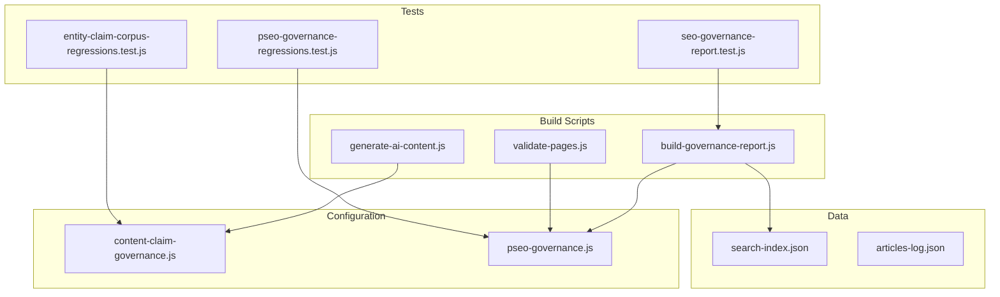
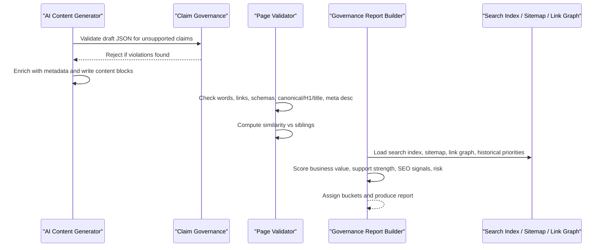
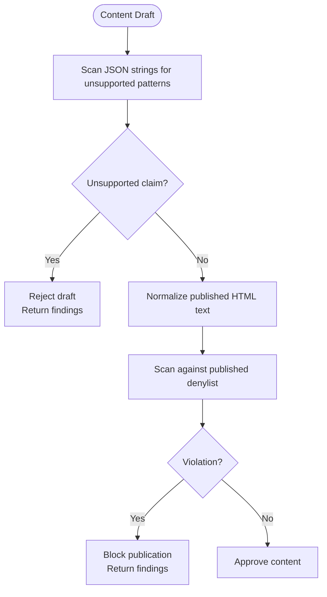
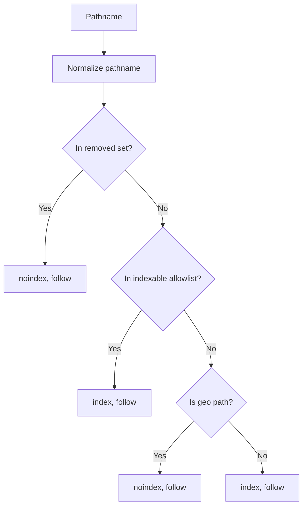
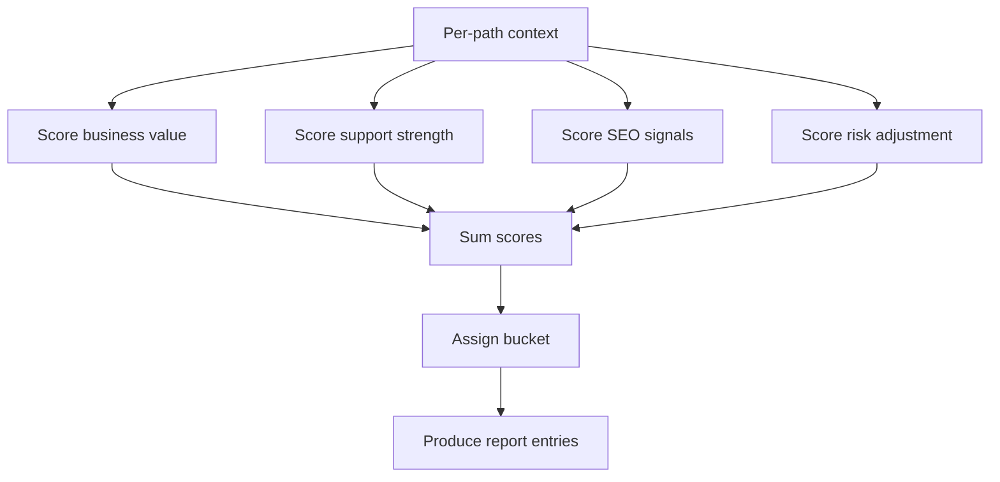
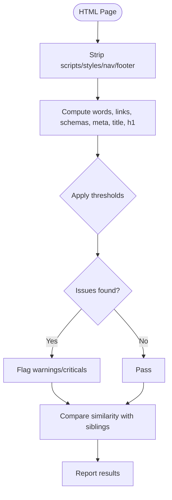
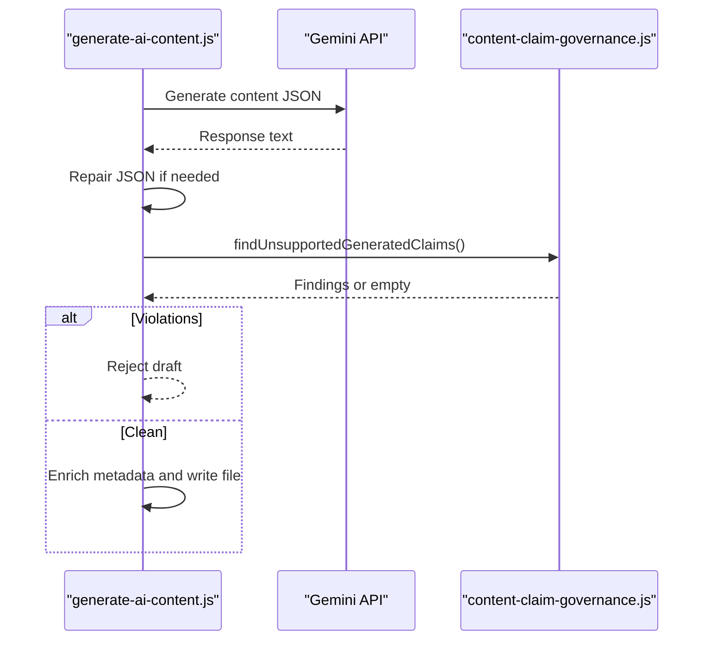
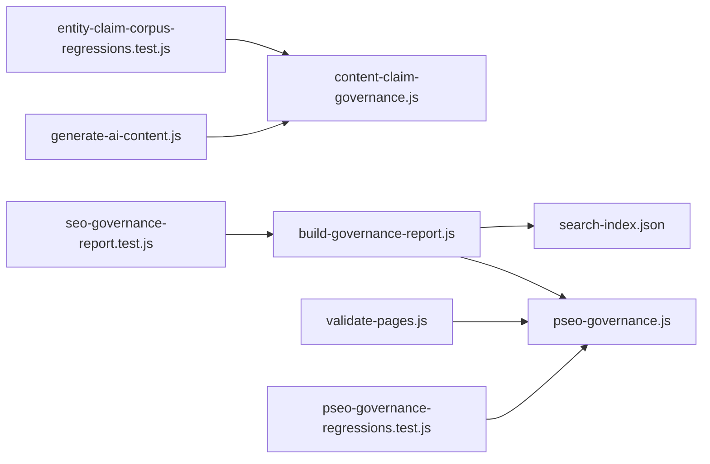

# Brand Consistency & Quality Metrics

<cite>
**Referenced Files in This Document**
- [content-claim-governance.js](file://config/content-claim-governance.js)
- [pseo-governance.js](file://config/pseo-governance.js)
- [build-governance-report.js](file://scripts/build-governance-report.js)
- [validate-pages.js](file://scripts/validate-pages.js)
- [generate-ai-content.js](file://scripts/generate-ai-content.js)
- [articles-log.json](file://blog/articles-log.json)
- [search-index.json](file://search-index.json)
- [pseo-governance-regressions.test.js](file://tests/pseo-governance-regressions.test.js)
- [entity-claim-corpus-regressions.test.js](file://tests/entity-claim-corpus-regressions.test.js)
- [seo-governance-report.test.js](file://tests/seo-governance-report.test.js)
</cite>

## Table of Contents
1. Introduction
2. Project Structure
3. Core Components
4. Architecture Overview
5. Detailed Component Analysis
6. Dependency Analysis
7. Performance Considerations
8. Troubleshooting Guide
9. Conclusion
10. Appendices

## Introduction
This document explains the brand consistency and quality metrics system that validates brand voice, tone consistency, and content quality across all generated pages. It covers:
- Governance rules that prevent unsupported claims and enforce editorial standards
- Quality scoring algorithms for business value, support strength, SEO signals, and risk adjustments
- Automated checks for word count, internal links, schema presence, canonical tags, meta descriptions, and similarity thresholds
- Integration points with AI content generation and page build pipelines
- Guidance to customize brand guidelines, adjust thresholds, and add new consistency checks

## Project Structure
The system is composed of configuration modules, build-time scripts, data sources, and regression tests:
- Configuration modules define governance policies and allowlists
- Build-time scripts compute scores, validate pages, and generate reports
- Data sources provide city/service context, search index, sitemap, link graph, and historical priorities
- Tests assert correct behavior of governance and reporting

**Diagram sources**
- [content-claim-governance.js:1-240](file://config/content-claim-governance.js#L1-L240)
- [pseo-governance.js:1-311](file://config/pseo-governance.js#L1-L311)
- [build-governance-report.js:1-800](file://scripts/build-governance-report.js#L1-L800)
- [validate-pages.js:1-433](file://scripts/validate-pages.js#L1-L433)
- [generate-ai-content.js:1-364](file://scripts/generate-ai-content.js#L1-L364)
- [search-index.json:5857-5878](file://search-index.json#L5857-L5878)
- [articles-log.json:3346-3550](file://blog/articles-log.json#L3346-L3550)
- [pseo-governance-regressions.test.js:1-363](file://tests/pseo-governance-regressions.test.js#L1-L363)
- [entity-claim-corpus-regressions.test.js:83-115](file://tests/entity-claim-corpus-regressions.test.js#L83-L115)
- [seo-governance-report.test.js:1-52](file://tests/seo-governance-report.test.js#L1-L52)

**Section sources**
- [content-claim-governance.js:1-240](file://config/content-claim-governance.js#L1-L240)
- [pseo-governance.js:1-311](file://config/pseo-governance.js#L1-L311)
- [build-governance-report.js:1-800](file://scripts/build-governance-report.js#L1-L800)
- [validate-pages.js:1-433](file://scripts/validate-pages.js#L1-L433)
- [generate-ai-content.js:1-364](file://scripts/generate-ai-content.js#L1-L364)
- [search-index.json:5857-5878](file://search-index.json#L5857-L5878)
- [articles-log.json:3346-3550](file://blog/articles-log.json#L3346-L3550)
- [pseo-governance-regressions.test.js:1-363](file://tests/pseo-governance-regressions.test.js#L1-L363)
- [entity-claim-corpus-regressions.test.js:83-115](file://tests/entity-claim-corpus-regressions.test.js#L83-L115)
- [seo-governance-report.test.js:1-52](file://tests/seo-governance-report.test.js#L1-L52)

## Core Components
- Claim governance: Detects and blocks unsupported commercial or performance claims in both generated drafts and published HTML; preserves approved custom blocks and strips unapproved Tier 1 editorial blocks.
- pSEO governance: Controls which geo pages are indexable, de-amplified, or removed; defines tiered allowlists and indexation directives.
- Governance report builder: Aggregates multiple signals (business value, support strength, SEO signals, risk adjustment) into a per-page score and bucket assignment.
- Page validator: Enforces minimum quality thresholds (word count, internal links, schemas, canonical/H1/title, meta description), and detects excessive similarity between sibling pages.
- AI content generator: Produces localized content blocks and enforces claim governance before writing files.

**Section sources**
- [content-claim-governance.js:1-240](file://config/content-claim-governance.js#L1-L240)
- [pseo-governance.js:1-311](file://config/pseo-governance.js#L1-L311)
- [build-governance-report.js:1-800](file://scripts/build-governance-report.js#L1-L800)
- [validate-pages.js:1-433](file://scripts/validate-pages.js#L1-L433)
- [generate-ai-content.js:1-364](file://scripts/generate-ai-content.js#L1-L364)

## Architecture Overview
The system integrates content generation, governance, validation, and reporting into a cohesive pipeline:

**Diagram sources**
- [generate-ai-content.js:247-306](file://scripts/generate-ai-content.js#L247-L306)
- [content-claim-governance.js:127-186](file://config/content-claim-governance.js#L127-L186)
- [validate-pages.js:210-337](file://scripts/validate-pages.js#L210-L337)
- [build-governance-report.js:595-750](file://scripts/build-governance-report.js#L595-L750)
- [build-governance-report.js:904-950](file://scripts/build-governance-report.js#L904-L950)

## Detailed Component Analysis

### Claim Governance
Purpose:
- Prevent unsupported guarantees, fixed timelines, universal performance claims, and other risky statements in generated drafts and published HTML.
- Preserve only approved custom blocks and strip unapproved Tier 1 editorial blocks.

Key behaviors:
- Scans JSON content blocks for unsupported patterns and rejects drafts containing them.
- Normalizes published HTML text and scans against denylist patterns.
- Preserves governed custom blocks only when explicitly approved.

Quality integration:
- Used by the AI content generator to block non-compliant drafts at source.
- Supports editorial review workflows via provenance metadata and approval gates.

**Diagram sources**
- [content-claim-governance.js:127-186](file://config/content-claim-governance.js#L127-L186)
- [generate-ai-content.js:270-278](file://scripts/generate-ai-content.js#L270-L278)

**Section sources**
- [content-claim-governance.js:1-240](file://config/content-claim-governance.js#L1-L240)
- [generate-ai-content.js:247-306](file://scripts/generate-ai-content.js#L247-L306)
- [entity-claim-corpus-regressions.test.js:83-115](file://tests/entity-claim-corpus-regressions.test.js#L83-L115)

### pSEO Governance
Purpose:
- Control indexation of geo pages through tiered allowlists and explicit de-amplification/removal lists.
- Provide utilities to determine indexation directives and sitemap inclusion.

Key behaviors:
- Defines Tier 1, Tier 2, and data-validated indexable sets.
- Computes auto-deamplified paths for non-allowlisted geo pages.
- Exposes helpers for indexation directives and sitemap inclusion.

Quality integration:
- Ensures only strategic and validated pages receive indexability, reducing thin/doorway footprint.
- Regression tests assert correct directives and sitemap contents.

**Diagram sources**
- [pseo-governance.js:230-287](file://config/pseo-governance.js#L230-L287)

**Section sources**
- [pseo-governance.js:1-311](file://config/pseo-governance.js#L1-L311)
- [pseo-governance-regressions.test.js:85-215](file://tests/pseo-governance-regressions.test.js#L85-L215)

### Governance Report Builder
Purpose:
- Aggregate multi-signal scoring to assess page value and risk, then assign actionable buckets.

Scoring components:
- Business value: page type, service tier, city priority, cluster membership, hierarchy match, historical priority.
- Support strength: file existence, search entry presence, headings richness, sitemap recency, inbound links, historical priority.
- SEO signals: position bands, impressions, CTR, clicks; fallback using sitemap/historical/clusters/hierarchy.
- Risk adjustment: penalties for low-value legal pages, non-core geo services, zero inbound links, stale sitemaps, low city priority, consolidation targets, weak hierarchy matches.

Bucketing:
- Deamplified existing, review for deamplify, merge or consolidate, keep/push, etc., based on combined score and context.

Integration:
- Uses search index, sitemap, link graph, historical priorities, and pSEO governance to enrich context.

**Diagram sources**
- [build-governance-report.js:595-750](file://scripts/build-governance-report.js#L595-L750)
- [build-governance-report.js:904-950](file://scripts/build-governance-report.js#L904-L950)

**Section sources**
- [build-governance-report.js:1-800](file://scripts/build-governance-report.js#L1-L800)
- [seo-governance-report.test.js:1-52](file://tests/seo-governance-report.test.js#L1-L52)

### Page Validator
Purpose:
- Enforce baseline quality thresholds across generated pages to maintain brand consistency and technical SEO hygiene.

Checks:
- Word count thresholds with overrides for hubs, blog, portfolio, contact, and service pages.
- Internal links minimums.
- JSON-LD schema presence.
- Canonical tag, H1, title presence.
- Meta description length bounds.
- Answer capsule and SpeakableSpecification presence for GEO optimization.
- Similarity detection between sibling geo pages using trigram-based Jaccard similarity.

Thresholds and overrides:
- Global defaults and per-path overrides ensure appropriate expectations per page type.

**Diagram sources**
- [validate-pages.js:34-77](file://scripts/validate-pages.js#L34-L77)
- [validate-pages.js:210-337](file://scripts/validate-pages.js#L210-L337)

**Section sources**
- [validate-pages.js:1-433](file://scripts/validate-pages.js#L1-L433)

### AI Content Generation Integration
Purpose:
- Generate localized content blocks while enforcing claim governance at the source.

Workflow:
- Builds prompts with local context and service references.
- Calls model API with retry and key rotation logic.
- Validates response structure and runs claim governance checks.
- Writes enriched content blocks with metadata indicating draft status and publication constraints.

Quality integration:
- Blocks drafts containing unsupported claims, ensuring downstream pages cannot publish non-compliant content.

**Diagram sources**
- [generate-ai-content.js:190-245](file://scripts/generate-ai-content.js#L190-L245)
- [generate-ai-content.js:247-306](file://scripts/generate-ai-content.js#L247-L306)
- [content-claim-governance.js:127-186](file://config/content-claim-governance.js#L127-L186)

**Section sources**
- [generate-ai-content.js:1-364](file://scripts/generate-ai-content.js#L1-L364)
- [content-claim-governance.js:1-240](file://config/content-claim-governance.js#L1-L240)

## Dependency Analysis
- The AI content generator depends on claim governance to reject non-compliant drafts.
- The governance report builder depends on pSEO governance for de-amplification decisions and on external datasets (search index, sitemap, link graph, historical priorities).
- The page validator depends on pSEO governance indirectly through consistent page types and outputs.
- Tests assert correctness of governance rules and report outputs.

**Diagram sources**
- [generate-ai-content.js:270-278](file://scripts/generate-ai-content.js#L270-L278)
- [build-governance-report.js:16-25](file://scripts/build-governance-report.js#L16-L25)
- [validate-pages.js:22-32](file://scripts/validate-pages.js#L22-L32)
- [pseo-governance-regressions.test.js:85-215](file://tests/pseo-governance-regressions.test.js#L85-L215)
- [entity-claim-corpus-regressions.test.js:83-115](file://tests/entity-claim-corpus-regressions.test.js#L83-L115)
- [seo-governance-report.test.js:7-18](file://tests/seo-governance-report.test.js#L7-L18)

**Section sources**
- [generate-ai-content.js:1-364](file://scripts/generate-ai-content.js#L1-L364)
- [build-governance-report.js:1-800](file://scripts/build-governance-report.js#L1-L800)
- [validate-pages.js:1-433](file://scripts/validate-pages.js#L1-L433)
- [pseo-governance-regressions.test.js:1-363](file://tests/pseo-governance-regressions.test.js#L1-L363)
- [entity-claim-corpus-regressions.test.js:83-115](file://tests/entity-claim-corpus-regressions.test.js#L83-L115)
- [seo-governance-report.test.js:1-52](file://tests/seo-governance-report.test.js#L1-L52)

## Performance Considerations
- Claim scanning uses regex over normalized text; keep patterns concise and targeted to minimize false positives and CPU usage.
- Similarity checks operate on trigrams; consider limiting comparisons to sibling groups to reduce O(n^2) costs.
- Governance report building loads multiple datasets; cache maps and reuse computations where possible.
- AI generation includes retries and key rotation; rate limiting and backoff protect API quotas and improve stability.

[No sources needed since this section provides general guidance]

## Troubleshooting Guide
Common issues and resolutions:
- Unsupported claims in drafts: Review findings returned by claim governance and revise content to remove guarantees, fixed timelines, or universal performance promises.
- Pages flagged as de-amplified: Verify whether the page belongs to an indexable tier or data-validated set; otherwise expect noindex, follow and exclusion from sitemap.
- Low quality scores: Increase unique words, internal links, and schema presence; ensure canonical, H1, title, and meta description meet thresholds.
- High similarity between pages: Differentiate content more strongly; adjust thresholds only if justified by page type.
- Missing GSC data in reports: Provide CSV exports or configure the script to locate files; without data, SEO signal scores fall back to conservative estimates.

**Section sources**
- [content-claim-governance.js:127-186](file://config/content-claim-governance.js#L127-L186)
- [pseo-governance.js:250-287](file://config/pseo-governance.js#L250-L287)
- [validate-pages.js:34-77](file://scripts/validate-pages.js#L34-L77)
- [build-governance-report.js:407-491](file://scripts/build-governance-report.js#L407-L491)

## Conclusion
The brand consistency and quality metrics system combines strict claim governance, tiered indexation control, robust page-level validation, and multi-signal scoring to ensure high-quality, brand-aligned output. By integrating these checks into content generation and build pipelines, the system prevents non-compliant content from reaching production and continuously evaluates page effectiveness and risk. Teams can customize thresholds, extend governance rules, and add new checks to evolve with brand needs.

[No sources needed since this section summarizes without analyzing specific files]

## Appendices

### Examples of Brand Consistency Rules
- No guarantees or result promises in generated or published content.
- No fixed delivery timelines unless qualified and confirmed in proposals.
- No universal performance claims (e.g., Lighthouse scores or zero vulnerabilities).
- Preserve only approved custom blocks; strip unapproved Tier 1 editorial blocks.

**Section sources**
- [content-claim-governance.js:17-60](file://config/content-claim-governance.js#L17-L60)
- [content-claim-governance.js:196-226](file://config/content-claim-governance.js#L196-L226)

### Quality Thresholds and Automated Checks
- Minimum unique words with per-path overrides for hubs, blogs, portfolios, contacts, and services.
- Minimum internal links and JSON-LD schemas per page.
- Presence of canonical tag, H1, title, and well-formed meta description.
- Similarity threshold to avoid duplicate or near-duplicate content among sibling pages.

**Section sources**
- [validate-pages.js:34-77](file://scripts/validate-pages.js#L34-L77)
- [validate-pages.js:210-337](file://scripts/validate-pages.js#L210-L337)

### Customizing Brand Guidelines and Adjusting Thresholds
- Add or update unsupported claim patterns in the claim governance module to reflect new brand rules.
- Extend tier allowlists or de-amplification lists in pSEO governance to manage indexation strategy.
- Adjust thresholds and overrides in the page validator to align with evolving content standards.
- Expand governance report scoring factors to incorporate new signals or refine existing weights.

**Section sources**
- [content-claim-governance.js:17-60](file://config/content-claim-governance.js#L17-L60)
- [pseo-governance.js:42-146](file://config/pseo-governance.js#L42-L146)
- [validate-pages.js:34-77](file://scripts/validate-pages.js#L34-L77)
- [build-governance-report.js:595-750](file://scripts/build-governance-report.js#L595-L750)

### Implementing New Brand Consistency Checks
- Define new rule patterns in claim governance and add corresponding tests to ensure coverage.
- Integrate checks into the AI content generation flow to fail fast on non-compliant drafts.
- Add validators in the page validator for structural or semantic requirements.
- Update governance report scoring to reflect the impact of new checks on page quality and risk.

**Section sources**
- [content-claim-governance.js:127-186](file://config/content-claim-governance.js#L127-L186)
- [generate-ai-content.js:270-278](file://scripts/generate-ai-content.js#L270-L278)
- [validate-pages.js:210-337](file://scripts/validate-pages.js#L210-L337)
- [build-governance-report.js:595-750](file://scripts/build-governance-report.js#L595-L750)