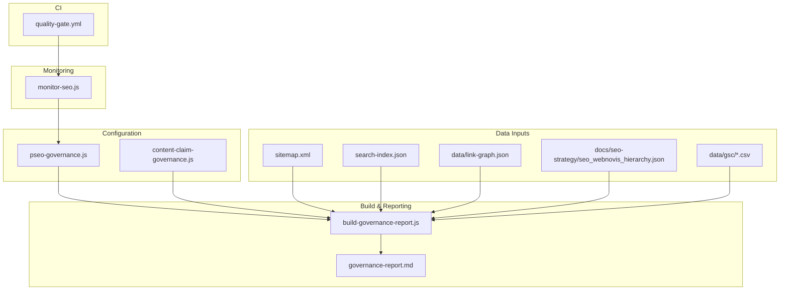
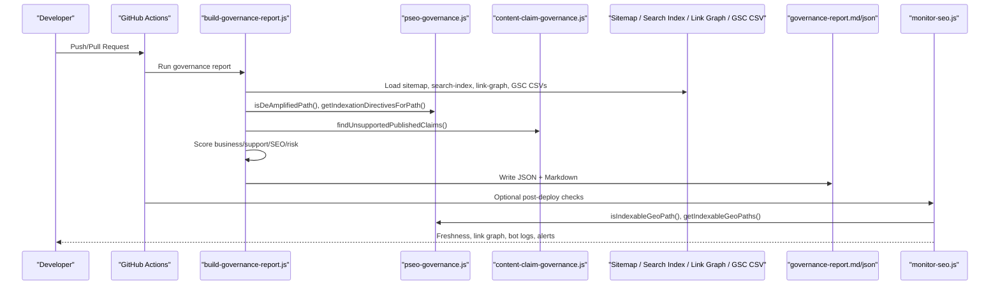
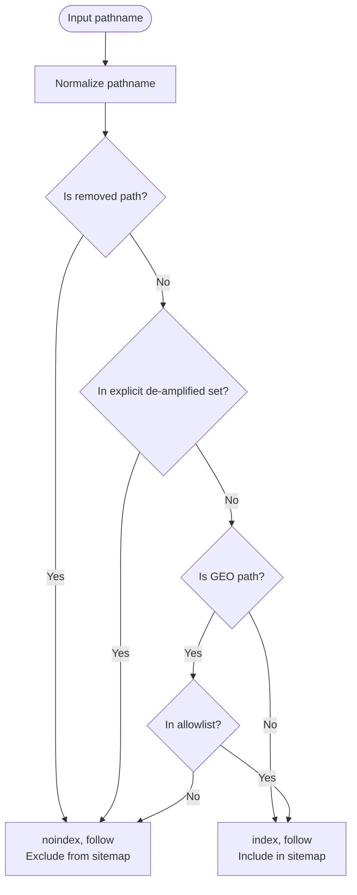
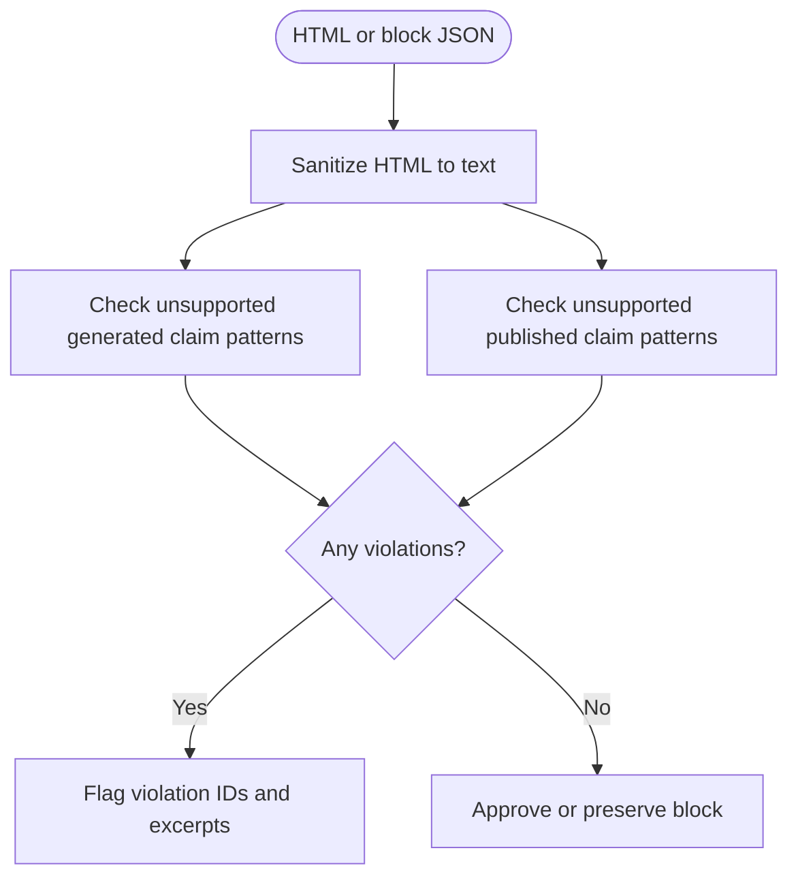
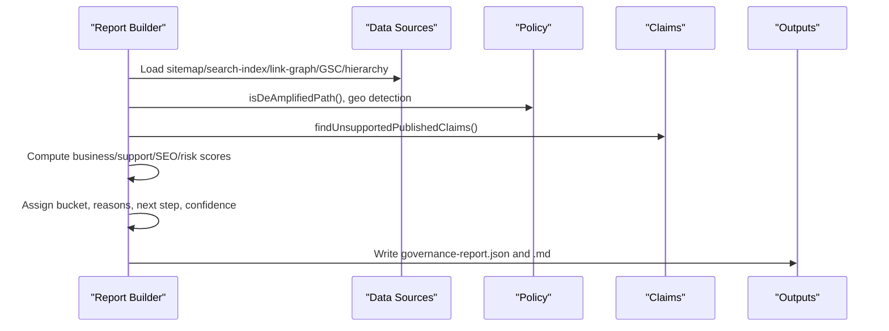
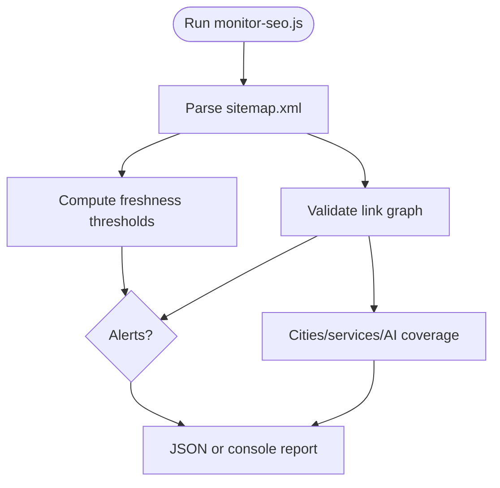
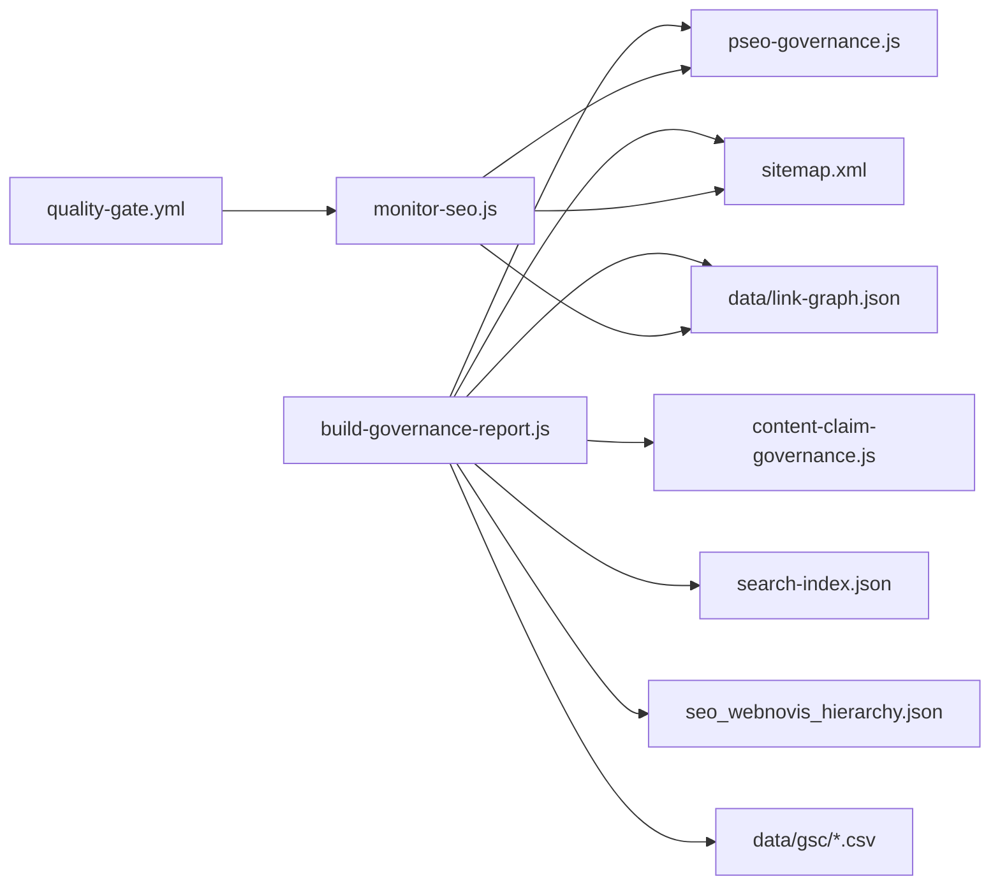

# Governance & Quality Control

<cite>
**Referenced Files in This Document**
- [pseo-governance.js](file://config/pseo-governance.js)
- [content-claim-governance.js](file://config/content-claim-governance.js)
- [build-governance-report.js](file://scripts/build-governance-report.js)
- [monitor-seo.js](file://scripts/monitor-seo.js)
- [quality-gate.yml](file://.github/workflows/quality-gate.yml)
- [governance-report.md](file://docs/seo-strategy/governance-report.md)
- [pSEO.MD](file://docs/pSEO.MD)
- [seo-governance-report.test.js](file://tests/seo-governance-report.test.js)
- [pseo-governance-regressions.test.js](file://tests/pseo-governance-regressions.test.js)
- [README.md](file://data/gsc/README.md)
</cite>

## Table of Contents
1. Introduction
2. Project Structure
3. Core Components
4. Architecture Overview
5. Detailed Component Analysis
6. Dependency Analysis
7. Performance Considerations
8. Troubleshooting Guide
9. Conclusion
10. Appendices

## Introduction
This document explains WebNovis’s governance and quality control system for programmatic SEO (pSEO). It covers how the governance report is generated, how indexation policy controls which pages are allowed to rank, how brand and content claims are validated, and how scoring algorithms evaluate page effectiveness. It also documents the rule engine for automated checks, reporting mechanisms that identify issues, integration points with SEO strategy and performance monitoring, and guidance for customizing rules and creating new metrics.

## Project Structure
The governance system spans configuration, build-time analysis, post-deploy monitoring, CI gates, and tests:
- Configuration defines indexation allowlists, de-amplification rules, and claim validation patterns.
- The governance report script aggregates signals from sitemap, search index, historical priorities, link graph, GSC CSVs, and hierarchy keywords to score and bucket pages.
- A monitoring script checks freshness, bot crawl activity, link graph integrity, and data layer health.
- CI runs a quality gate that builds artifacts and verifies production headers.
- Tests assert expected behavior for indexation directives, sitemap inclusion, schema correctness, and governance buckets.
- Strategy docs define quality thresholds and alerting targets used by the system.

**Diagram sources**
- [pseo-governance.js:1-311](file://config/pseo-governance.js#L1-L311)
- [content-claim-governance.js:1-240](file://config/content-claim-governance.js#L1-L240)
- [build-governance-report.js:1-1223](file://scripts/build-governance-report.js#L1-L1223)
- [monitor-seo.js:1-415](file://scripts/monitor-seo.js#L1-L415)
- [quality-gate.yml:1-47](file://.github/workflows/quality-gate.yml#L1-L47)
- [governance-report.md:1-109](file://docs/seo-strategy/governance-report.md#L1-L109)

**Section sources**
- [pseo-governance.js:1-311](file://config/pseo-governance.js#L1-L311)
- [content-claim-governance.js:1-240](file://config/content-claim-governance.js#L1-L240)
- [build-governance-report.js:1-1223](file://scripts/build-governance-report.js#L1-L1223)
- [monitor-seo.js:1-415](file://scripts/monitor-seo.js#L1-L415)
- [quality-gate.yml:1-47](file://.github/workflows/quality-gate.yml#L1-L47)
- [governance-report.md:1-109](file://docs/seo-strategy/governance-report.md#L1-L109)

## Core Components
- Indexation policy and pSEO governance: tiered allowlist for GEO pages, explicit de-amplified paths, removed paths, and helpers to compute directives and sitemap inclusion.
- Content claim governance: detection of unsupported generated and published claims, approved provenance checks, preservation or stripping of governed blocks.
- Governance report builder: multi-signal scoring (business value, support strength, SEO signals, risk adjustment), bucket assignment, reason codes, next steps, confidence, and output to JSON and Markdown.
- Post-deploy monitor: sitemap analysis, freshness checks, bot log analysis, link graph integrity, data layer health, and alerts.
- CI quality gate: dependency install, build, artifact upload, and production header verification.
- Regression tests: assertions on indexation directives, sitemap inclusion, schema correctness, and governance buckets.

**Section sources**
- [pseo-governance.js:18-311](file://config/pseo-governance.js#L18-L311)
- [content-claim-governance.js:9-240](file://config/content-claim-governance.js#L9-L240)
- [build-governance-report.js:27-1223](file://scripts/build-governance-report.js#L27-L1223)
- [monitor-seo.js:24-415](file://scripts/monitor-seo.js#L24-L415)
- [quality-gate.yml:1-47](file://.github/workflows/quality-gate.yml#L1-L47)
- [seo-governance-report.test.js:1-52](file://tests/seo-governance-report.test.js#L1-L52)
- [pseo-governance-regressions.test.js:85-363](file://tests/pseo-governance-regressions.test.js#L85-L363)

## Architecture Overview
The system enforces a controlled indexation surface while continuously evaluating content quality and SEO effectiveness.

**Diagram sources**
- [build-governance-report.js:27-1223](file://scripts/build-governance-report.js#L27-L1223)
- [pseo-governance.js:18-311](file://config/pseo-governance.js#L18-L311)
- [content-claim-governance.js:9-240](file://config/content-claim-governance.js#L9-L240)
- [monitor-seo.js:24-415](file://scripts/monitor-seo.js#L24-L415)
- [quality-gate.yml:1-47](file://.github/workflows/quality-gate.yml#L1-L47)

## Detailed Component Analysis

### Indexation Policy and Rule Engine (pSEO Governance)
- Tiered allowlist: TIER1, TIER2, and DATA_VALIDATED sets define which GEO paths are indexable.
- De-amplification: explicit de-amplified paths, auto-generated non-allowlisted GEO paths, and removed paths receive noindex, follow and are excluded from sitemap.
- Helpers: path normalization, geo path detection via service slugs and cluster slugs, directive computation, and sitemap inclusion decisions.

**Diagram sources**
- [pseo-governance.js:205-287](file://config/pseo-governance.js#L205-L287)

**Section sources**
- [pseo-governance.js:21-311](file://config/pseo-governance.js#L21-L311)

### Content Claim Governance
- Approved provenance: requires publication status, HTTP sources, verified date, and approver.
- Unsupported generated claims: regex-based detection for guarantees, ROI timelines, percentage outcomes, fixed delivery promises, and universal performance claims.
- Unsupported published claims: detection in rendered HTML text after sanitization; includes Lighthouse thresholds, response SLAs, founder involvement, vulnerability absolutes, and fixed free support periods.
- Block preservation/stripping: preserves governed custom blocks only if approved; strips unapproved Tier 1 editorial blocks.

**Diagram sources**
- [content-claim-governance.js:17-60](file://config/content-claim-governance.js#L17-L60)
- [content-claim-governance.js:127-186](file://config/content-claim-governance.js#L127-L186)
- [content-claim-governance.js:188-226](file://config/content-claim-governance.js#L188-L226)

**Section sources**
- [content-claim-governance.js:9-240](file://config/content-claim-governance.js#L9-L240)

### Governance Report Generation
- Inputs: sitemap, search index, historical priorities CSV, link graph, GSC CSV exports, and hierarchy keywords.
- Scoring dimensions:
  - Business value: core paths, lead/homepage/service tiers, geo city priority, blog pillar status, hierarchy match, historical priority.
  - Support strength: file existence, search entry presence/title/headings, sitemap lastmod recency, inbound links, historical priority.
  - SEO signals: position bands, impressions, CTR, clicks; fallback using sitemap/hierarchy/cluster.
  - Risk adjustment: legal pages, non-core geo services, zero inbound links, stale lastmod, low city priority, missing hierarchy matches, consolidation candidates.
- Bucket assignment: keep_push, improve_ctr, merge_or_consolidate, review_for_deamplify, deamplified_existing.
- Outputs: JSON and Markdown reports with summaries, buckets, and actionable next steps.

**Diagram sources**
- [build-governance-report.js:27-1223](file://scripts/build-governance-report.js#L27-L1223)
- [pseo-governance.js:18-311](file://config/pseo-governance.js#L18-L311)
- [content-claim-governance.js:9-240](file://config/content-claim-governance.js#L9-L240)

**Section sources**
- [build-governance-report.js:27-1223](file://scripts/build-governance-report.js#L27-L1223)
- [governance-report.md:1-109](file://docs/seo-strategy/governance-report.md#L1-L109)

### Post-Deploy Monitoring
- Sitemap analysis: counts URLs by category (geo agenzia, geo realizzazione, geo servizio, hubs, blog, servizi, portfolio, core).
- Freshness: flags stale (>90 days) and critical (>180 days) pages based on lastmod.
- Bot log analysis: summarizes recent requests per bot and unique pages crawled.
- Link graph integrity: detects broken links, orphan files, zero-inbound pages, de-amplified target links, and mismatches between stored and rendered graphs.
- Data layer health: cities/services counts, AI content coverage, potential page count.

**Diagram sources**
- [monitor-seo.js:44-415](file://scripts/monitor-seo.js#L44-L415)

**Section sources**
- [monitor-seo.js:24-415](file://scripts/monitor-seo.js#L24-L415)

### CI Quality Gate
- Installs dependencies, runs quality scripts, ensures no source mutation, uploads sanitized dist artifact, and verifies production headers on main pushes.

**Section sources**
- [quality-gate.yml:1-47](file://.github/workflows/quality-gate.yml#L1-L47)

### Testing and Validation
- Governance report test: asserts minimum URL count, absence of GSC until CSVs provided, and expected bucket memberships for specific paths.
- pSEO governance regressions: asserts correct indexation directives for multiple paths, sitemap inclusion/exclusion rules, hreflang presence, hub script paths, and schema correctness for Service and LocalBusiness references.

**Section sources**
- [seo-governance-report.test.js:1-52](file://tests/seo-governance-report.test.js#L1-L52)
- [pseo-governance-regressions.test.js:85-363](file://tests/pseo-governance-regressions.test.js#L85-L363)

## Dependency Analysis
- The governance report depends on:
  - pseo-governance for indexation policy and helper functions.
  - content-claim-governance for claim detection and block handling.
  - Data inputs: sitemap.xml, search-index.json, data/link-graph.json, docs/seo-strategy/seo_webnovis_hierarchy.json, and optional GSC CSVs.
- The monitor depends on pseo-governance for indexability checks and on local files for sitemap, link graph, and bot logs.
- CI orchestrates execution and artifact management.

**Diagram sources**
- [build-governance-report.js:1-1223](file://scripts/build-governance-report.js#L1-L1223)
- [monitor-seo.js:1-415](file://scripts/monitor-seo.js#L1-L415)
- [pseo-governance.js:1-311](file://config/pseo-governance.js#L1-L311)
- [content-claim-governance.js:1-240](file://config/content-claim-governance.js#L1-L240)

**Section sources**
- [build-governance-report.js:1-1223](file://scripts/build-governance-report.js#L1-L1223)
- [monitor-seo.js:1-415](file://scripts/monitor-seo.js#L1-L415)
- [pseo-governance.js:1-311](file://config/pseo-governance.js#L1-L311)
- [content-claim-governance.js:1-240](file://config/content-claim-governance.js#L1-L240)

## Performance Considerations
- Indexation ratio is a primary health metric; maintain above 60% indexed/submitted to avoid crawl budget waste and domain-wide quality penalties.
- Avoid generating thin or near-duplicate pages; enforce uniqueness thresholds and differentiate sibling pages significantly.
- Use tiered indexation to concentrate authority on strategic pages and exclude low-value GEO combinations.
- Keep sitemaps clean and exclude de-amplified or removed paths to reduce crawl noise.
- Monitor freshness and link graph integrity to prevent orphaned or stale pages from diluting site quality.

[No sources needed since this section provides general guidance]

## Troubleshooting Guide
- Missing GSC data: place page-level CSV exports into data/gsc and re-run the governance report to unlock CTR and position-based buckets.
- Unexpected noindex: verify whether the path is explicitly de-amplified, auto-de-amplified due to not being in the allowlist, or marked as removed.
- Sitemap inconsistencies: ensure de-amplified and removed paths are excluded and that indexable GEO paths are included.
- Schema errors: confirm Service schemas reference the canonical provider and avoid declaring page-specific LocalBusiness where inappropriate.
- Stale content: address freshness alerts by updating lastmod and content; consider merging or consolidating low-value pages flagged by the report.

**Section sources**
- [README.md:1-17](file://data/gsc/README.md#L1-L17)
- [pseo-governance.js:205-287](file://config/pseo-governance.js#L205-L287)
- [pseo-governance-regressions.test.js:217-363](file://tests/pseo-governance-regressions.test.js#L217-L363)
- [governance-report.md:103-109](file://docs/seo-strategy/governance-report.md#L103-L109)

## Conclusion
WebNovis’s governance system combines strict indexation policy, robust claim validation, and multi-dimensional scoring to protect domain quality while focusing effort on high-value pages. The governance report translates signals into actionable buckets, and the monitoring pipeline ensures ongoing health. By following the documented thresholds, integrating GSC data, and customizing rules thoughtfully, teams can sustainably scale programmatic SEO without risking penalties.

[No sources needed since this section summarizes without analyzing specific files]

## Appendices

### Examples of Governance Rules and Thresholds
- Indexation policy examples:
  - Explicitly de-amplified paths receive noindex, follow and are excluded from sitemap.
  - Non-allowlisted GEO paths are automatically de-amplified to reduce doorway footprint.
  - Removed paths are always de-amplified during transition to physical removal.
- Claim validation examples:
  - Disallow absolute performance guarantees such as “zero vulnerabilities” or “Lighthouse 95+”.
  - Disallow fixed response or delivery promises unless qualified estimates are present.
  - Require approved provenance for claim-bearing blocks before preservation.
- Quality thresholds (from strategy):
  - Minimum unique words per page and differentiation ratios between siblings.
  - Indexation ratio targets and alert thresholds for drops or manual actions.

**Section sources**
- [pseo-governance.js:21-229](file://config/pseo-governance.js#L21-L229)
- [content-claim-governance.js:17-60](file://config/content-claim-governance.js#L17-L60)
- [pSEO.MD:613-685](file://docs/pSEO.MD#L613-L685)

### Customizing Governance Rules and Creating New Metrics
- Adjust indexation policy:
  - Add or remove paths from tier allowlists or explicit de-amplified sets.
  - Update service slug patterns if new clusters emerge.
- Extend claim validation:
  - Add new regex patterns for unsupported generated or published claims.
  - Define additional approved block names for preservation.
- Enhance scoring:
  - Modify weights in business value, support strength, SEO signals, and risk adjustment functions.
  - Introduce new reason codes and bucket transitions based on updated thresholds.
- Expand monitoring:
  - Add freshness thresholds or new alert conditions in the monitor script.
  - Incorporate additional data sources (e.g., GA4 segments) into the report pipeline.

**Section sources**
- [pseo-governance.js:18-311](file://config/pseo-governance.js#L18-L311)
- [content-claim-governance.js:9-240](file://config/content-claim-governance.js#L9-L240)
- [build-governance-report.js:578-850](file://scripts/build-governance-report.js#L578-L850)
- [monitor-seo.js:38-415](file://scripts/monitor-seo.js#L38-L415)