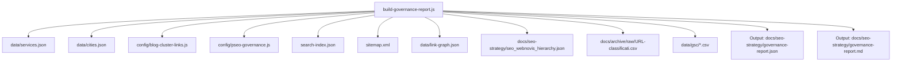
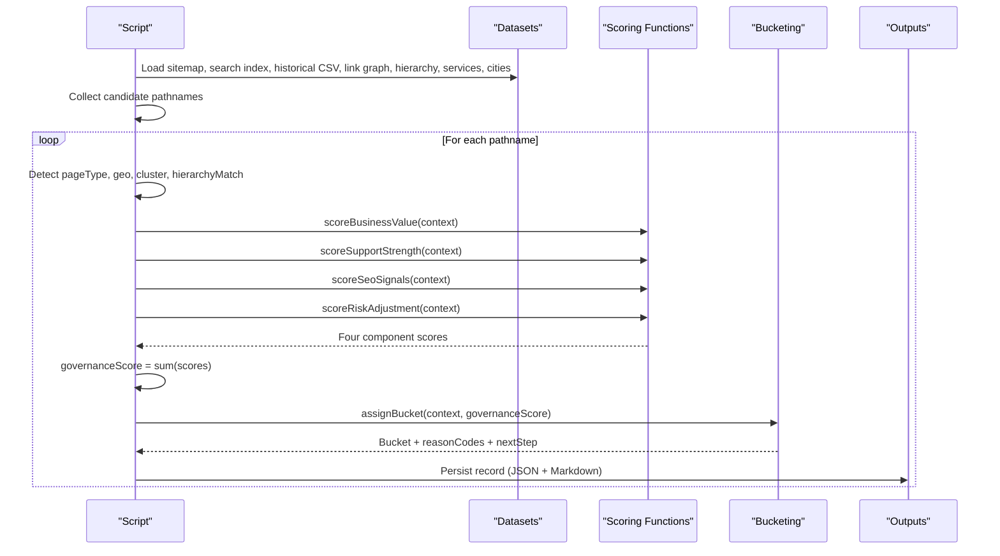
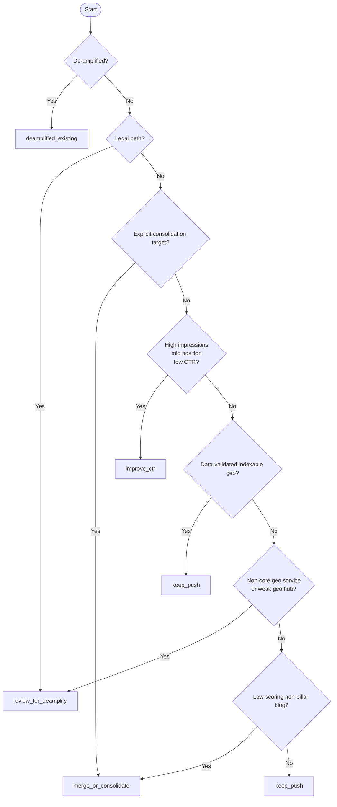
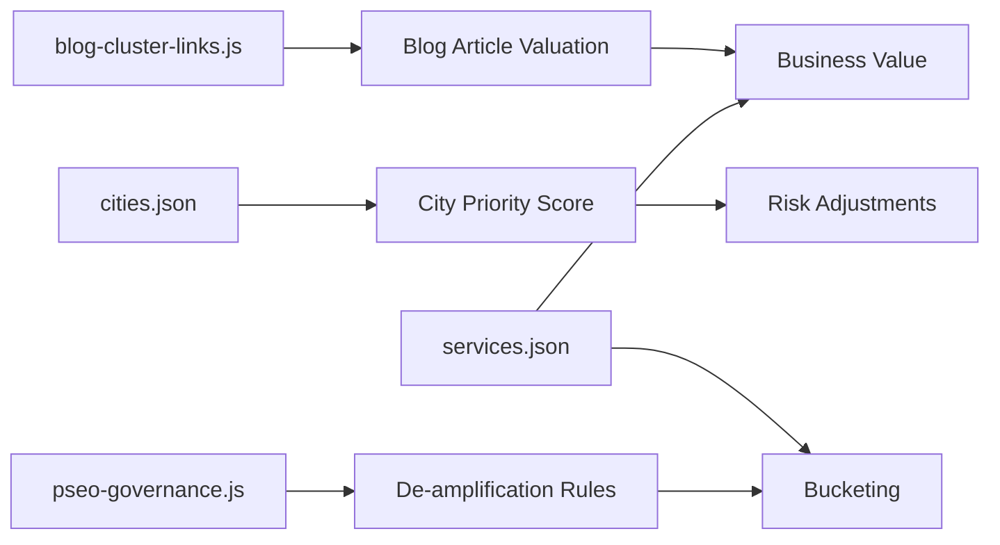

# Governance Scoring & Prioritization

<cite>
**Referenced Files in This Document**
- [build-governance-report.js](file://scripts/build-governance-report.js)
- [pseo-governance.js](file://config/pseo-governance.js)
- [content-claim-governance.js](file://config/content-claim-governance.js)
- [services.json](file://data/services.json)
- [cities.json](file://data/cities.json)
- [blog-cluster-links.js](file://config/blog-cluster-links.js)
</cite>

## Table of Contents
1. Introduction
2. Project Structure
3. Core Components
4. Architecture Overview
5. Detailed Component Analysis
6. Dependency Analysis
7. Performance Considerations
8. Troubleshooting Guide
9. Conclusion
10. Appendices

## Introduction
This document explains the governance scoring and prioritization system used to decide which pages to keep, improve, consolidate, or de-amplify. It covers the multi-factor scoring model that evaluates business value, support strength, SEO signals, and risk adjustments. It also documents how historical performance data, link graph analysis, search demand metrics, and content hierarchy influence automated recommendations and priority bucketing. Guidance is provided for tuning parameters and understanding the rationale behind each recommendation.

## Project Structure
The governance pipeline is implemented as a Node script that loads multiple data sources and produces a structured report with per-page scores and buckets. The main orchestration and scoring logic live in one script, while configuration and datasets provide domain rules and reference data.

**Diagram sources**
- [build-governance-report.js:1-30](file://scripts/build-governance-report.js#L1-L30)
- [build-governance-report.js:889-1001](file://scripts/build-governance-report.js#L889-L1001)

**Section sources**
- [build-governance-report.js:1-30](file://scripts/build-governance-report.js#L1-L30)
- [build-governance-report.js:889-1001](file://scripts/build-governance-report.js#L889-L1001)

## Core Components
- Multi-factor scoring engine:
  - Business value scoring
  - Support strength evaluation
  - SEO signals assessment
  - Risk adjustment calculations
- Priority bucketing:
  - Keep / Push
  - Improve CTR
  - Merge / Consolidate
  - Review for De-amplify
  - De-amplified Existing
- Confidence estimation based on available data sources
- Reason codes to explain decisions

These components are implemented in the main script and rely on configuration modules and datasets.

**Section sources**
- [build-governance-report.js:595-712](file://scripts/build-governance-report.js#L595-L712)
- [build-governance-report.js:776-850](file://scripts/build-governance-report.js#L776-L850)
- [build-governance-report.js:879-887](file://scripts/build-governance-report.js#L879-L887)

## Architecture Overview
The pipeline collects candidate URLs from sitemap, search index, historical priorities, de-amplified paths, and link graph. For each URL it detects page type, geo context, cluster membership, and hierarchy match. It then computes four component scores and combines them into a single governance score. Finally, it assigns an action bucket and generates next-step guidance.

**Diagram sources**
- [build-governance-report.js:566-576](file://scripts/build-governance-report.js#L566-L576)
- [build-governance-report.js:595-712](file://scripts/build-governance-report.js#L595-L712)
- [build-governance-report.js:776-850](file://scripts/build-governance-report.js#L776-L850)
- [build-governance-report.js:889-1001](file://scripts/build-governance-report.js#L889-L1001)

## Detailed Component Analysis

### Business Value Scoring
Purpose: Estimate commercial and strategic importance of a page.

Inputs:
- Pathname and page type
- Historical priority
- Cluster membership (pillar vs support)
- Hierarchy match quality
- Geo context (city and service tier)
- De-amplification status

Logic highlights:
- Core always-keep paths receive maximum value.
- Legal paths receive minimal value.
- Service pages use service tier to differentiate core vs extended.
- Lead and homepage pages receive maximum value.
- Geo pages use city priority score derived from population, distance, and headquarters proximity.
- Blog articles gain value if they are pillar pages, have strong hierarchy matches, historical priority, or tags.

Weights and thresholds:
- City priority score uses population tiers, distance bands, and headquarters flag.
- Base values differ by page type; additional bonuses apply for strong signals.

Example calculation outline:
- A core service page gets a high base value; if it targets a high-priority city, the city score adds up to a capped maximum.
- A blog article that is a pillar and has a strong hierarchy match receives a higher base plus bonus points.

**Section sources**
- [build-governance-report.js:578-627](file://scripts/build-governance-report.js#L578-L627)

### Support Strength Evaluation
Purpose: Measure how well a page is supported by infrastructure and content assets.

Inputs:
- File existence
- Search index presence and title/headings
- Sitemap lastmod freshness
- Inbound internal links
- Historical priority

Logic highlights:
- Points are added for file existence, indexed metadata, headings count, recent updates, inbound links, and high historical priority.
- Scores are capped at a maximum to prevent dominance over other factors.

Example calculation outline:
- A page with a file, good metadata, recent update, and several inbound links will score highly in support strength.

**Section sources**
- [build-governance-report.js:629-648](file://scripts/build-governance-report.js#L629-L648)

### SEO Signals Assessment
Purpose: Incorporate observed search performance and structural SEO indicators.

Inputs:
- Google Search Console metrics (position, impressions, CTR, clicks)
- Sitemap presence
- Historical priority
- Cluster membership
- Hierarchy match ROI stars

Logic highlights:
- When GSC metrics exist, position, impressions, CTR, and clicks contribute additive points with diminishing returns at higher thresholds.
- Without GSC, fallback scoring considers sitemap presence, historical priority, pillar status, and high-ROI theme matches.

Example calculation outline:
- A page ranking within top positions with meaningful impressions and CTR earns a high SEO signal score.
- If GSC is missing, a pillar page with strong hierarchy ROI still receives a moderate fallback score.

**Section sources**
- [build-governance-report.js:650-683](file://scripts/build-governance-report.js#L650-L683)

### Risk Adjustment Calculations
Purpose: Penalize pages that carry low expected return or elevated risk relative to their role.

Inputs:
- Page type and geo context
- Inbound internal links
- Sitemap lastmod age
- Historical priority
- Cluster membership and explicit consolidation targets
- Hierarchy match absence for blog articles

Logic highlights:
- Starts from a neutral baseline and subtracts points for legal pages, non-core geo services, zero inbound links, stale sitemaps, small or distant cities, low historical priority, and weak thematic alignment.
- Ensures the adjusted score remains non-negative.

Example calculation outline:
- A geo service page targeting a small, distant city without historical priority and no inbound links will be penalized significantly.

**Section sources**
- [build-governance-report.js:685-712](file://scripts/build-governance-report.js#L685-L712)

### Priority Bucketing Logic
Purpose: Translate composite scores and contextual signals into actionable categories.

Buckets:
- Keep / Push: Pages to maintain and promote.
- Improve CTR: Pages with visibility but low click-through rates.
- Merge / Consolidate: Pages to combine with stronger nodes.
- Review for De-amplify: Pages to evaluate for noindex or pruning after validation.
- De-amplified Existing: Pages already marked for de-amplification.

Decision flow:
- Explicit de-amplified paths go to de-amplified existing.
- Legal paths route to review for de-amplify.
- Explicit consolidation targets route to merge or consolidate.
- High-impression, mid-position, low-CTR pages route to improve CTR.
- Data-validated indexable geo paths are kept and pushed.
- Non-core geo services or underperforming geo hubs may be reviewed for de-amplification.
- Low-scoring blog articles outside pillars may be merged.
- Otherwise, default to keep and push.

**Diagram sources**
- [build-governance-report.js:776-850](file://scripts/build-governance-report.js#L776-L850)

**Section sources**
- [build-governance-report.js:776-850](file://scripts/build-governance-report.js#L776-L850)

### Influence of Historical Performance, Link Graph, and Search Demand
- Historical performance:
  - Historical priorities from CSV influence both business value and SEO fallback scoring.
  - High historical priority boosts support strength and reduces risk penalties.
- Link graph analysis:
  - Inbound link counts increase support strength and reduce risk penalties.
  - Zero inbound links trigger risk deductions and can lead to review for de-amplification.
- Search demand metrics:
  - GSC metrics drive SEO signals scoring and CTR improvement bucket assignment.
  - Data-validated indexable geo paths are explicitly kept due to observed demand.

**Section sources**
- [build-governance-report.js:271-289](file://scripts/build-governance-report.js#L271-L289)
- [build-governance-report.js:328-367](file://scripts/build-governance-report.js#L328-L367)
- [build-governance-report.js:407-491](file://scripts/build-governance-report.js#L407-L491)
- [build-governance-report.js:650-683](file://scripts/build-governance-report.js#L650-L683)
- [build-governance-report.js:776-850](file://scripts/build-governance-report.js#L776-L850)

### Confidence Estimation
Confidence reflects how much evidence supports the recommendation.

Contributors:
- Base confidence
- Historical priority presence
- Search index presence
- Sitemap presence
- Link graph presence
- GSC availability and metrics

Result:
- Confidence is capped to avoid overstating certainty when data is sparse.

**Section sources**
- [build-governance-report.js:879-887](file://scripts/build-governance-report.js#L879-L887)

### Content Claim Governance Integration
Content claim governance ensures that generated or published claims meet compliance standards. While not part of the numeric scoring, it influences whether certain content blocks are preserved or stripped during builds, indirectly affecting support strength and SEO signals.

Key behaviors:
- Approved provenance checks for custom blocks.
- Detection of unsupported generated and published claims.
- Preservation or stripping of editorial blocks based on approval lists.

**Section sources**
- [content-claim-governance.js:74-107](file://config/content-claim-governance.js#L74-L107)
- [content-claim-governance.js:127-186](file://config/content-claim-governance.js#L127-L186)
- [content-claim-governance.js:188-226](file://config/content-claim-governance.js#L188-L226)

## Dependency Analysis
The scoring system depends on several datasets and configuration modules:

- Services catalog defines service tiers used in business value scoring.
- Cities dataset provides population and distance metrics used in city priority scoring and risk adjustments.
- Blog clusters define pillar/support relationships influencing blog article valuation.
- pSEO governance module controls de-amplification and indexability rules for geo pages.

**Diagram sources**
- [build-governance-report.js:595-627](file://scripts/build-governance-report.js#L595-L627)
- [build-governance-report.js:578-593](file://scripts/build-governance-report.js#L578-L593)
- [build-governance-report.js:776-850](file://scripts/build-governance-report.js#L776-L850)
- [pseo-governance.js:250-287](file://config/pseo-governance.js#L250-L287)

**Section sources**
- [services.json:1-200](file://data/services.json#L1-L200)
- [cities.json:1-200](file://data/cities.json#L1-L200)
- [blog-cluster-links.js:1-200](file://config/blog-cluster-links.js#L1-L200)
- [pseo-governance.js:250-287](file://config/pseo-governance.js#L250-L287)

## Performance Considerations
- Data loading:
  - CSV parsing and metric aggregation are optimized to handle multiple GSC files.
  - Link graph processing aggregates inbound counts efficiently.
- Scoring functions:
  - Each component score is capped to prevent any single factor from dominating.
  - Early exits for de-amplified or legal paths reduce unnecessary computation.
- Output generation:
  - Summarization sorts buckets to highlight top actionable items quickly.

[No sources needed since this section provides general guidance]

## Troubleshooting Guide
Common issues and resolutions:
- Missing GSC data:
  - SEO signals fall back to weaker signals; add GSC CSVs to unlock detailed scoring and CTR bucketing.
- No link graph:
  - Support strength and risk adjustments lose internal linking signals; regenerate link graph data.
- Outdated sitemap:
  - Freshness-based bonuses decrease; update sitemap lastmod timestamps.
- Incorrect page type detection:
  - Ensure pathnames match expected patterns; verify geo slug mappings in services and cities data.
- Unexpected de-amplification:
  - Check pSEO allowlists and explicit de-amplified paths; adjust tier assignments if necessary.

**Section sources**
- [build-governance-report.js:260-269](file://scripts/build-governance-report.js#L260-L269)
- [build-governance-report.js:328-367](file://scripts/build-governance-report.js#L328-L367)
- [build-governance-report.js:407-491](file://scripts/build-governance-report.js#L407-L491)
- [pseo-governance.js:250-287](file://config/pseo-governance.js#L250-L287)

## Conclusion
The governance scoring system combines business value, support strength, SEO signals, and risk adjustments to produce actionable recommendations. It leverages historical performance, link graph analysis, and search demand metrics to make informed decisions about keeping, improving, consolidating, or de-amplifying pages. By tuning weights and thresholds in the scoring functions and adjusting configuration allowlists, teams can align automated recommendations with evolving business goals and market conditions.

[No sources needed since this section summarizes without analyzing specific files]

## Appendices

### Example Score Calculation Walkthrough
- Inputs:
  - Page type: geo_service
  - Service tier: core
  - City: medium population, close to headquarters
  - Historical priority: present and high
  - GSC metrics: available with good position and impressions
  - Inbound links: moderate
- Steps:
  - Business value: base value for core service plus city priority bonus
  - Support strength: points for file existence, metadata, recent update, inbound links
  - SEO signals: points for position, impressions, CTR, clicks
  - Risk adjustment: minor penalties for non-core aspects if any; otherwise neutral
  - Governance score: sum of components
  - Bucket: likely keep/push unless CTR opportunity triggers improve CTR

[No sources needed since this section provides conceptual examples]

### Tuning Guidance
- Adjust city priority thresholds to reflect current market focus.
- Modify service tier definitions to emphasize new offerings.
- Tune GSC thresholds for CTR improvement bucket to balance sensitivity.
- Update explicit consolidation targets to reflect content strategy changes.
- Refresh hierarchy keywords to align with evolving topic clusters.

[No sources needed since this section provides general guidance]