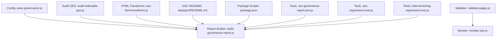
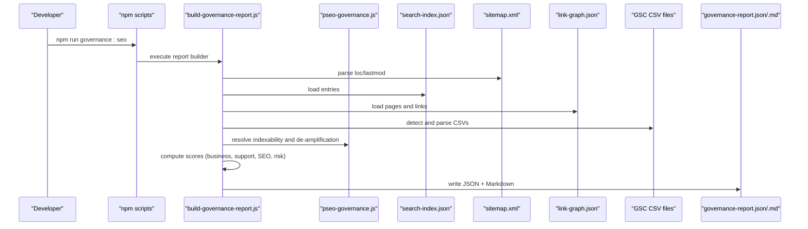
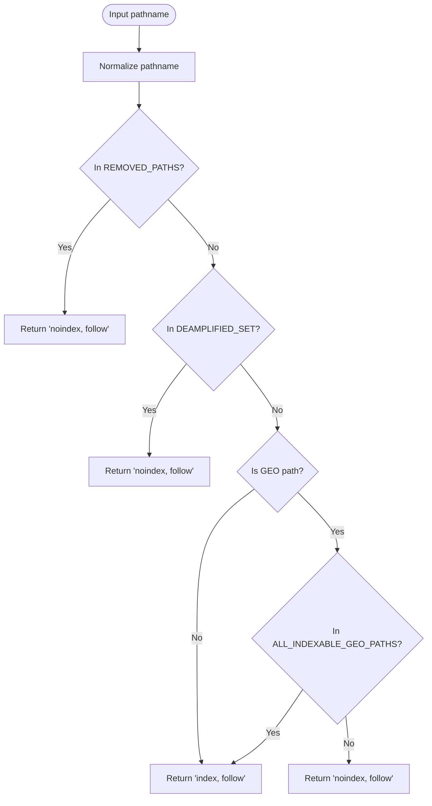
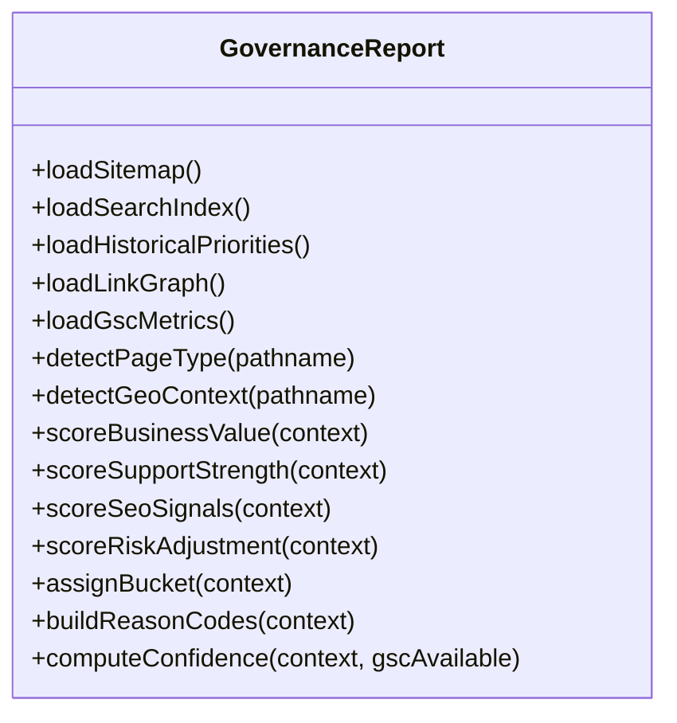
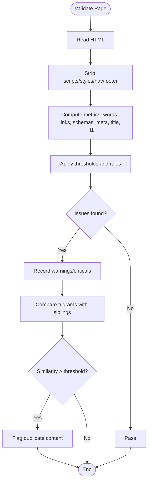
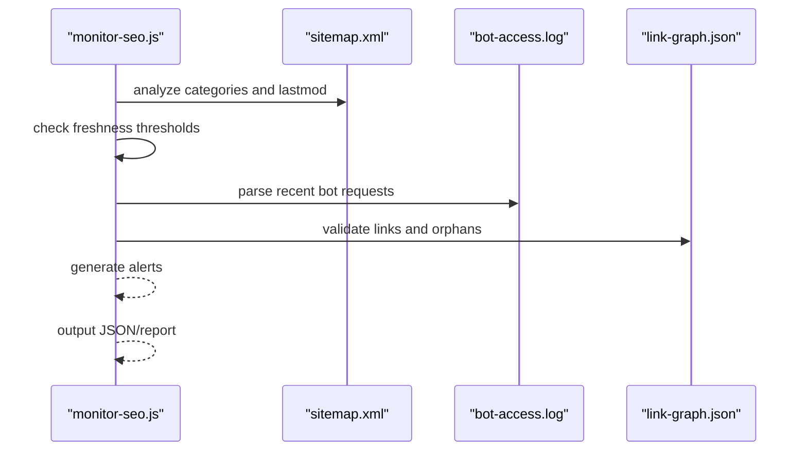
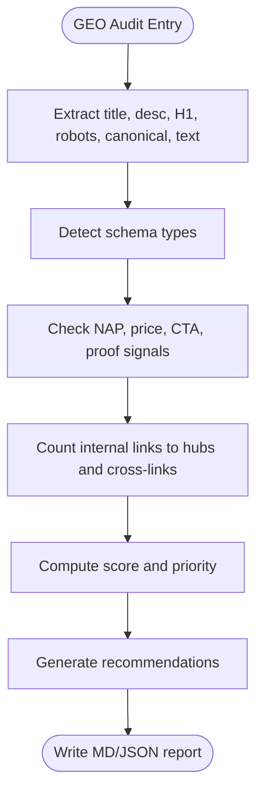
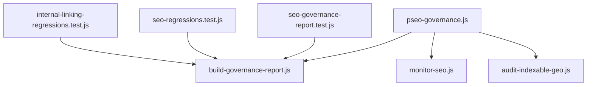

# SEO Compliance & Validation

<cite>
**Referenced Files in This Document**
- [pseo-governance.js](file://config/pseo-governance.js)
- [build-governance-report.js](file://scripts/build-governance-report.js)
- [validate-pages.js](file://scripts/validate-pages.js)
- [monitor-seo.js](file://scripts/monitor-seo.js)
- [audit-indexable-geo.js](file://scripts/audit-indexable-geo.js)
- [seo-html-transforms.js](file://config/seo-html-transforms.js)
- [README.md](file://data/gsc/README.md)
- [package.json](file://package.json)
- [seo-governance-report.test.js](file://tests/seo-governance-report.test.js)
- [seo-regressions.test.js](file://tests/seo-regressions.test.js)
- [internal-linking-regressions.test.js](file://tests/internal-linking-regressions.test.js)
</cite>

## Table of Contents
1. [Introduction](#introduction)
2. [Project Structure](#project-structure)
3. [Core Components](#core-components)
4. [Architecture Overview](#architecture-overview)
5. [Detailed Component Analysis](#detailed-component-analysis)
6. [Dependency Analysis](#dependency-analysis)
7. [Performance Considerations](#performance-considerations)
8. [Troubleshooting Guide](#troubleshooting-guide)
9. [Conclusion](#conclusion)
10. [Appendices](#appendices)

## Introduction
This document explains the SEO compliance and validation system used by WebNovis to automatically audit, score, and govern indexation across all pages. It covers:
- Governance report generation that evaluates meta tags, schema markup, internal linking, content quality, and search signals
- Scoring algorithms for business value, support strength, SEO signals, and risk adjustments
- Rule engine for automated compliance checks (allowlist-based indexation control, de-amplification, and consolidation targets)
- Detection of common SEO issues (duplicate content, missing metadata, poor keyword optimization)
- Integration with Google Search Console CSV exports, sitemap validation, and search index analysis
- Guidance on customizing rules and creating new validation checks

## Project Structure
The SEO compliance system is implemented as a set of Node.js scripts and configuration modules:
- Governance rule engine and allowlists live under config
- Report builders and validators live under scripts
- Tests validate behavior and guardrails
- Data inputs include GSC CSV exports, sitemap.xml, search-index.json, link-graph.json, and hierarchy keywords

**Diagram sources**
- [pseo-governance.js](file://config/pseo-governance.js)
- [build-governance-report.js](file://scripts/build-governance-report.js)
- [validate-pages.js](file://scripts/validate-pages.js)
- [monitor-seo.js](file://scripts/monitor-seo.js)
- [audit-indexable-geo.js](file://scripts/audit-indexable-geo.js)
- [seo-html-transforms.js](file://config/seo-html-transforms.js)
- [README.md](file://data/gsc/README.md)
- [package.json](file://package.json)
- [seo-governance-report.test.js](file://tests/seo-governance-report.test.js)
- [seo-regressions.test.js](file://tests/seo-regressions.test.js)
- [internal-linking-regressions.test.js](file://tests/internal-linking-regressions.test.js)

**Section sources**
- [package.json](file://package.json)

## Core Components
- Governance rule engine (allowlist-based indexation control): defines Tier 1/2/Data-validated indexable paths, de-amplified sets, removed paths, and helpers for robots directives and sitemap inclusion.
- Governance report builder: aggregates sitemap, search index, historical priorities, link graph, and GSC CSV metrics; computes multi-factor scores and assigns buckets (keep, merge, review, deamplify).
- Page validator: enforces quality thresholds (word count, internal links, JSON-LD schemas, canonical, H1, answer capsule, Speakable, meta description length), and detects duplicate content via trigram similarity.
- SEO monitor: post-deploy health checks for sitemap freshness, bot crawl logs, link graph integrity, orphan pages, and zero-inbound pages.
- GEO audit: per-page evaluation of title, description, H1, schema presence, NAP, price signals, CTAs, proof, internal linking, and city mentions; produces prioritized recommendations.
- HTML transforms: applies canonical head directives, strategic internal links, and localized content upgrades to ensure consistent SEO signals.

**Section sources**
- [pseo-governance.js](file://config/pseo-governance.js)
- [build-governance-report.js](file://scripts/build-governance-report.js)
- [validate-pages.js](file://scripts/validate-pages.js)
- [monitor-seo.js](file://scripts/monitor-seo.js)
- [audit-indexable-geo.js](file://scripts/audit-indexable-geo.js)
- [seo-html-transforms.js](file://config/seo-html-transforms.js)

## Architecture Overview
The governance pipeline ingests multiple data sources, normalizes URLs, and computes composite scores to decide indexation strategy and remediation actions.

**Diagram sources**
- [build-governance-report.js](file://scripts/build-governance-report.js)
- [pseo-governance.js](file://config/pseo-governance.js)
- [README.md](file://data/gsc/README.md)

## Detailed Component Analysis

### Governance Rule Engine (Allowlist-Based Indexation Control)
- Defines explicit de-amplified paths, Tier 1/2 indexable GEO paths, and data-validated paths
- Computes auto de-amplified GEO paths not in allowlist
- Provides helpers to determine robots directives and sitemap inclusion
- Normalizes pathnames and identifies GEO patterns

**Diagram sources**
- [pseo-governance.js](file://config/pseo-governance.js)

**Section sources**
- [pseo-governance.js](file://config/pseo-governance.js)

### Governance Report Builder (Scoring Algorithms and Buckets)
- Loads sitemap, search index, historical priorities, link graph, and GSC CSV metrics
- Detects page types and geo context
- Computes four scoring dimensions:
  - Business value: core paths, service tiers, lead/homepage, geo hubs, blog clusters, historical priority
  - Support strength: file existence, search entry, headings, sitemap lastmod recency, inbound links, historical priority
  - SEO signals: position, impressions, CTR, clicks from GSC; fallback based on sitemap/hierarchy/clusters
  - Risk adjustment: legal pages, non-core geo services, zero inbound links, stale lastmod, low population/distance, consolidation candidates
- Assigns buckets: keep/push, merge/consolidate, review for deamplify, deamplified existing
- Produces reason codes and next steps

**Diagram sources**
- [build-governance-report.js](file://scripts/build-governance-report.js)

**Section sources**
- [build-governance-report.js](file://scripts/build-governance-report.js)

### Page Validator (Quality Thresholds and Duplicate Content Detection)
- Enforces minimum unique words, critical thresholds, internal links, JSON-LD schemas, canonical tag, H1, meta description length
- Checks answer-capsule and SpeakableSpecification presence for GEO optimization
- Detects duplicate content using Jaccard similarity on word trigrams between sibling pages
- Supports threshold overrides for hub pages and specific paths

**Diagram sources**
- [validate-pages.js](file://scripts/validate-pages.js)

**Section sources**
- [validate-pages.js](file://scripts/validate-pages.js)

### SEO Monitor (Post-Deploy Health Checks)
- Analyzes sitemap categories and lastmod dates
- Checks content freshness thresholds (warning and critical)
- Parses bot-access.log for recent crawler activity
- Validates link graph integrity: broken links, orphan files, zero-inbound pages, de-amplified rendered targets, stored vs rendered mismatches
- Aggregates alerts and outputs JSON or console report

**Diagram sources**
- [monitor-seo.js](file://scripts/monitor-seo.js)

**Section sources**
- [monitor-seo.js](file://scripts/monitor-seo.js)

### GEO Audit (Per-Page Evaluation and Recommendations)
- Evaluates title length, meta description, H1, robots directive, canonical self-reference
- Checks schema presence (FAQPage, Service, LocalBusiness, AggregateRating, City)
- Assesses local proof signals (NAP, prices, CTAs, case studies, nearby cities)
- Counts internal links to hubs and cross-links within same service/city
- Scores each page and assigns priority levels (P0–P3)
- Generates actionable recommendations and consolidated matrices

**Diagram sources**
- [audit-indexable-geo.js](file://scripts/audit-indexable-geo.js)

**Section sources**
- [audit-indexable-geo.js](file://scripts/audit-indexable-geo.js)

### HTML Transforms (Canonical Directives and Strategic Links)
- Applies correct robots directives based on governance decisions
- Injects strategic internal links and localized content blocks
- Ensures canonicalization and prevents publishing of non-public artifacts
- Updates contact info cards and portfolio sections consistently

**Section sources**
- [seo-html-transforms.js](file://config/seo-html-transforms.js)

## Dependency Analysis
The system has clear dependencies among configuration, data sources, and reporting tools:
- build-governance-report.js depends on pseo-governance.js for indexation rules
- monitor-seo.js uses pseo-governance.js for GEO path classification
- audit-indexable-geo.js relies on tier definitions from pseo-governance.js
- Tests assert expected behaviors for governance, regressions, and internal linking

**Diagram sources**
- [pseo-governance.js](file://config/pseo-governance.js)
- [build-governance-report.js](file://scripts/build-governance-report.js)
- [monitor-seo.js](file://scripts/monitor-seo.js)
- [audit-indexable-geo.js](file://scripts/audit-indexable-geo.js)
- [seo-governance-report.test.js](file://tests/seo-governance-report.test.js)
- [seo-regressions.test.js](file://tests/seo-regressions.test.js)
- [internal-linking-regressions.test.js](file://tests/internal-linking-regressions.test.js)

**Section sources**
- [pseo-governance.js](file://config/pseo-governance.js)
- [build-governance-report.js](file://scripts/build-governance-report.js)
- [monitor-seo.js](file://scripts/monitor-seo.js)
- [audit-indexable-geo.js](file://scripts/audit-indexable-geo.js)
- [seo-governance-report.test.js](file://tests/seo-governance-report.test.js)
- [seo-regressions.test.js](file://tests/seo-regressions.test.js)
- [internal-linking-regressions.test.js](file://tests/internal-linking-regressions.test.js)

## Performance Considerations
- Sitemap parsing and CSV imports are linear in number of URLs and rows; avoid excessively large GSC exports in CI
- Trigram similarity computation scales quadratically with sibling pages; limit scope to relevant groups
- Link graph validation reads full HTML for target pages; cache results where possible
- Governance scoring functions are lightweight but aggregate multiple data sources; consider parallelization for large corpora

[No sources needed since this section provides general guidance]

## Troubleshooting Guide
Common issues and resolutions:
- Missing GSC CSVs: place exports in data/gsc or pass --gsc=path/file.csv; parser supports multiple column aliases
- Sitemap inconsistencies: ensure noindex pages are excluded from sitemap; tests enforce this
- Canonical mismatches: verify canonical points to self; governance report flags mismatches
- Duplicate content: use validate-pages.js similarity detection to identify and consolidate overlapping pages
- Zero-inbound pages: investigate internal linking structure and hub coverage; monitor-seo.js reports orphans and zero-inbound lists
- De-amplified links: monitor-seo.js detects rendered links to de-amplified GEO targets; adjust allowlist or consolidate content

**Section sources**
- [README.md](file://data/gsc/README.md)
- [seo-regressions.test.js](file://tests/seo-regressions.test.js)
- [monitor-seo.js](file://scripts/monitor-seo.js)
- [validate-pages.js](file://scripts/validate-pages.js)

## Conclusion
WebNovis’s SEO compliance and validation system combines a robust rule engine, multi-dimensional scoring, and automated audits to maintain high-quality indexation and content standards. By integrating GSC data, sitemap validation, and search index analysis, it enables proactive governance, targeted remediation, and continuous monitoring. Customization is straightforward through configuration files and script parameters, ensuring adaptability to evolving SEO strategies.

[No sources needed since this section summarizes without analyzing specific files]

## Appendices

### Examples of Compliance Rules and Thresholds
- Meta description length: min 50, max 160 characters
- Unique words: min 500 (critical < 300); hub pages have lower thresholds
- Internal links: min 5 per page
- JSON-LD schemas: min 2 per page
- Canonical: required
- H1: required
- Answer capsule and Speakable: recommended for GEO pages
- Duplicate content: similarity threshold > 0.85 triggers warnings/criticals

**Section sources**
- [validate-pages.js](file://scripts/validate-pages.js)

### Example Rule Engine Patterns
- Explicit de-amplified paths: legacy or soft-redirect URLs marked noindex
- Auto de-amplified GEO paths: any generated GEO path not in allowlist
- Removed paths: deprecated clusters excluded from sitemap and always noindex
- Allowlist tiers: Tier 1 (strategic), Tier 2 (support), Data-validated (demand-backed)

**Section sources**
- [pseo-governance.js](file://config/pseo-governance.js)

### Violation Detection Patterns
- Robots noindex on indexable allowlist pages
- Canonical mismatch or missing canonical
- Title too long/short, meta description out of range
- Missing H1, FAQPage, Service schema
- Weak NAP, price, CTA, proof signals
- Low city mention density
- Zero inbound links or broken internal links

**Section sources**
- [audit-indexable-geo.js](file://scripts/audit-indexable-geo.js)
- [validate-pages.js](file://scripts/validate-pages.js)

### Integration with Google Search Console
- Place CSV exports in data/gsc or pass --gsc=path/file.csv
- Parser recognizes multiple column names (Page/Pagine/URL, Clicks/Clic, Impressions/Impressioni, CTR, Position/Posizione)
- Metrics aggregated per URL with weighted averages for CTR and position

**Section sources**
- [README.md](file://data/gsc/README.md)
- [build-governance-report.js](file://scripts/build-governance-report.js)

### Sitemap Validation and Search Index Analysis
- Sitemap parsed for loc and lastmod; categories computed for geo, hub, blog, servizi, portfolio, core
- Search index loaded and normalized; used for support strength scoring and content freshness
- Link graph validated against rendered HTML; mismatches flagged

**Section sources**
- [build-governance-report.js](file://scripts/build-governance-report.js)
- [monitor-seo.js](file://scripts/monitor-seo.js)

### Customizing Compliance Rules and Creating New Checks
- Adjust thresholds in validate-pages.js for word counts, links, schemas, and similarity
- Extend allowlists in pseo-governance.js to add or remove indexable paths
- Add new rule checks in audit-indexable-geo.js for additional signals or heuristics
- Update HTML transforms in seo-html-transforms.js for canonical directives and strategic links
- Use npm scripts to run validations and monitors in CI pipelines

**Section sources**
- [validate-pages.js](file://scripts/validate-pages.js)
- [pseo-governance.js](file://config/pseo-governance.js)
- [audit-indexable-geo.js](file://scripts/audit-indexable-geo.js)
- [seo-html-transforms.js](file://config/seo-html-transforms.js)
- [package.json](file://package.json)