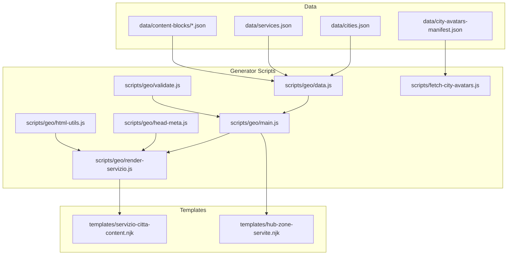
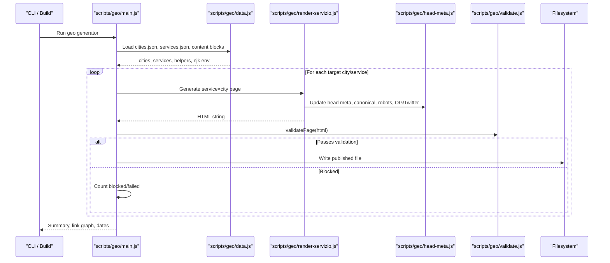
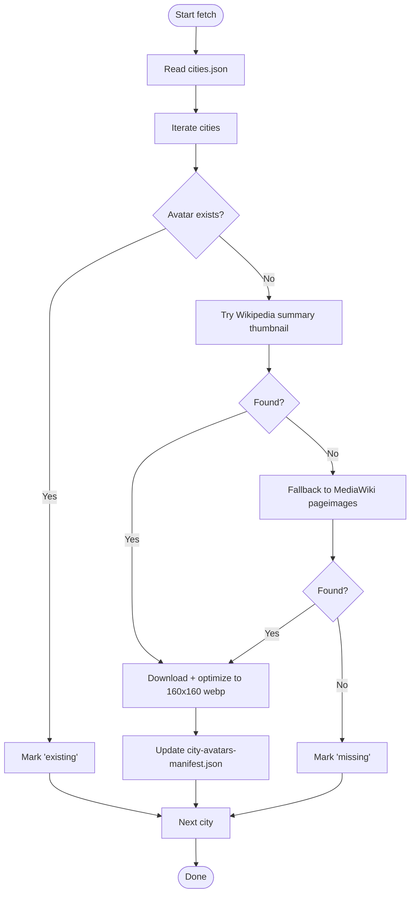
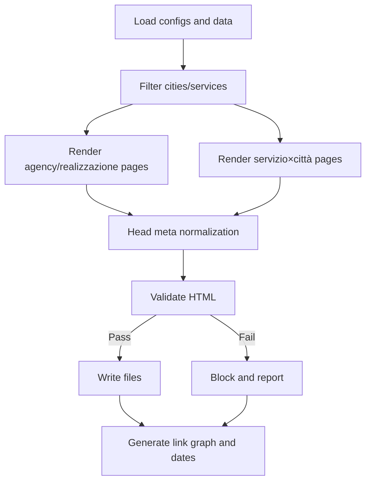
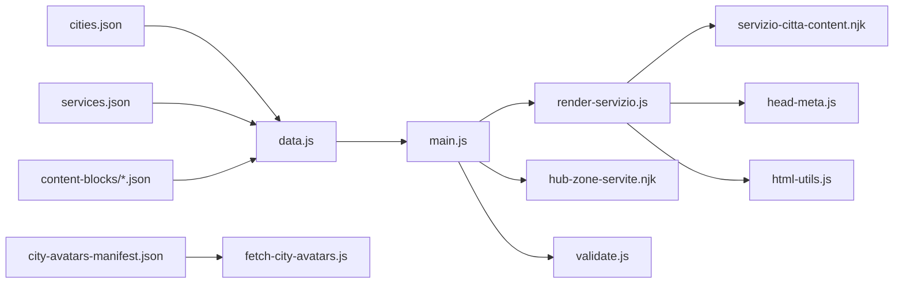

# Cities & Geographic Data Model

<cite>
**Referenced Files in This Document**
- [cities.json](file://data/cities.json)
- [city-avatars-manifest.json](file://data/city-avatars-manifest.json)
- [services.json](file://data/services.json)
- [data.js](file://scripts/geo/data.js)
- [main.js](file://scripts/geo/main.js)
- [render-servizio.js](file://scripts/geo/render-servizio.js)
- [config.js](file://scripts/geo/config.js)
- [head-meta.js](file://scripts/geo/head-meta.js)
- [validate.js](file://scripts/geo/validate.js)
- [html-utils.js](file://scripts/geo/html-utils.js)
- [fetch-city-avatars.js](file://scripts/fetch-city-avatars.js)
- [servizio-citta-content.njk](file://templates/servizio-citta-content.njk)
- [hub-zone-servite.njk](file://templates/hub-zone-servite.njk)
- [milano.json](file://data/content-blocks/milano.json)
</cite>

## Table of Contents
1. [Introduction](#introduction)
2. [Project Structure](#project-structure)
3. [Core Components](#core-components)
4. [Architecture Overview](#architecture-overview)
5. [Detailed Component Analysis](#detailed-component-analysis)
6. [Dependency Analysis](#dependency-analysis)
7. [Performance Considerations](#performance-considerations)
8. [Troubleshooting Guide](#troubleshooting-guide)
9. [Conclusion](#conclusion)
10. [Appendices](#appendices)

## Introduction
This document explains the cities and geographic data model powering WebNovis’s geo-targeted content system. It covers:
- The city data structure, including geographic identifiers, local SEO fields, and relationships to services
- The city avatar system for visual representation
- The city manifest that tracks assets and metadata
- Hierarchical organization of cities and their relationships with service pages
- Validation requirements and integration with the geo-page generation pipeline
- How geographic data drives localized content generation and SEO optimization strategies

The system generates three main page types per city:
- Agency pages (per city)
- Realization pages (per city)
- Service×City pages (combinatorial matrix across eligible services and cities)

## Project Structure
At a high level, the geo system is driven by JSON datasets and Node scripts that render HTML via Nunjucks templates. Key locations:
- City and service catalogs: data/cities.json, data/services.json
- Avatar manifest: data/city-avatars-manifest.json
- Geo generator orchestration and utilities: scripts/geo/*
- Template rendering: templates/*.njk
- Content blocks for AI-enriched copy: data/content-blocks/*.json

**Diagram sources**
- [cities.json](file://data/cities.json)
- [services.json](file://data/services.json)
- [city-avatars-manifest.json](file://data/city-avatars-manifest.json)
- [data.js](file://scripts/geo/data.js)
- [main.js](file://scripts/geo/main.js)
- [render-servizio.js](file://scripts/geo/render-servizio.js)
- [head-meta.js](file://scripts/geo/head-meta.js)
- [validate.js](file://scripts/geo/validate.js)
- [html-utils.js](file://scripts/geo/html-utils.js)
- [fetch-city-avatars.js](file://scripts/fetch-city-avatars.js)
- [servizio-citta-content.njk](file://templates/servizio-citta-content.njk)
- [hub-zone-servite.njk](file://templates/hub-zone-servite.njk)

**Section sources**
- [cities.json](file://data/cities.json)
- [services.json](file://data/services.json)
- [city-avatars-manifest.json](file://data/city-avatars-manifest.json)
- [data.js](file://scripts/geo/data.js)
- [main.js](file://scripts/geo/main.js)
- [render-servizio.js](file://scripts/geo/render-servizio.js)
- [config.js](file://scripts/geo/config.js)
- [head-meta.js](file://scripts/geo/head-meta.js)
- [validate.js](file://scripts/geo/validate.js)
- [html-utils.js](file://scripts/geo/html-utils.js)
- [fetch-city-avatars.js](file://scripts/fetch-city-avatars.js)
- [servizio-citta-content.njk](file://templates/servizio-citta-content.njk)
- [hub-zone-servite.njk](file://templates/hub-zone-servite.njk)

## Core Components
- City catalog (cities.json): Central source of truth for all cities, including identifiers, coordinates, population, province, distance to headquarters, generate flags, nearCities, localContext, images, and FAQs.
- Services catalog (services.json): Defines service clusters, pricing, tiers, and whether they participate in geo generation.
- Avatar manifest (city-avatars-manifest.json): Tracks downloaded or existing city avatars, sources, and status.
- Geo data loader (scripts/geo/data.js): Loads and indexes cities/services, builds lookup maps, computes UI metadata (e.g., avatar paths), and exposes helpers for rendering.
- Generator orchestrator (scripts/geo/main.js): Drives generation of agency, realization, service×city, and hub pages; applies validation and writes outputs.
- Service×City renderer (scripts/geo/render-servizio.js): Builds per-service-per-city pages with SEO copy, FAQs, related links, and tiered content.
- Head meta updater (scripts/geo/head-meta.js): Normalizes head tags, canonical, robots, Open Graph, Twitter cards, and FAQ schemas.
- Validation (scripts/geo/validate.js): Enforces minimum word count, internal links, schema presence, canonical/H1 checks, and claim governance.
- HTML utils (scripts/geo/html-utils.js): Distance calculations, nearest city selection, text helpers.
- Avatar fetcher (scripts/fetch-city-avatars.js): Downloads and optimizes city avatars from Wikipedia sources, updates manifest.
- Templates (Nunjucks): Render final HTML with structured sections, answer capsules, and localized content.

**Section sources**
- [cities.json](file://data/cities.json)
- [services.json](file://data/services.json)
- [city-avatars-manifest.json](file://data/city-avatars-manifest.json)
- [data.js](file://scripts/geo/data.js)
- [main.js](file://scripts/geo/main.js)
- [render-servizio.js](file://scripts/geo/render-servizio.js)
- [head-meta.js](file://scripts/geo/head-meta.js)
- [validate.js](file://scripts/geo/validate.js)
- [html-utils.js](file://scripts/geo/html-utils.js)
- [fetch-city-avatars.js](file://scripts/fetch-city-avatars.js)
- [servizio-citta-content.njk](file://templates/servizio-citta-content.njk)
- [hub-zone-servite.njk](file://templates/hub-zone-servite.njk)

## Architecture Overview
The geo pipeline loads city and service catalogs, filters eligible entities based on configuration and governance, renders pages through Nunjucks, validates output, and persists results. Avatars are managed separately and referenced by generated pages.

**Diagram sources**
- [main.js](file://scripts/geo/main.js)
- [data.js](file://scripts/geo/data.js)
- [render-servizio.js](file://scripts/geo/render-servizio.js)
- [head-meta.js](file://scripts/geo/head-meta.js)
- [validate.js](file://scripts/geo/validate.js)

**Section sources**
- [main.js](file://scripts/geo/main.js)
- [data.js](file://scripts/geo/data.js)
- [render-servizio.js](file://scripts/geo/render-servizio.js)
- [head-meta.js](file://scripts/geo/head-meta.js)
- [validate.js](file://scripts/geo/validate.js)

## Detailed Component Analysis

### City Data Model
The city object includes:
- Identifiers: slug, name, cap (postal code), province
- Geography: lat, lng, distanzaSede (distance/time to HQ), distanzaSedeKm, isSede
- Generation flags: generate.agenzia, generate.realizzazione
- Relationships: nearCities (array of slugs)
- Local context: highlights, tessutoEconomico, settoriChiave, opportunitaDigitale
- Images: img1/img2 references with alt text
- FAQs: per service cluster (agenzia, realizzazione)

Validation and usage:
- Coordinates enable nearest-city computation and proximity-based linking
- generate flags gate which pages are produced per city
- nearCities supports internal linking strategy
- localContext feeds localized copy and sector targeting
- FAQs drive FAQPage schema and visible Q&A sections

**Section sources**
- [cities.json](file://data/cities.json)
- [html-utils.js](file://scripts/geo/html-utils.js)
- [render-servizio.js](file://scripts/geo/render-servizio.js)

### Services Catalog and Relationship Mapping
Services define:
- slug, name, shortName, schemaType
- url and hasPage (whether a dedicated service page exists)
- tier (core vs extended)
- priceFrom, priceCurrency, priceUnit, timeEstimate
- description, shortDesc, targetKeyword, idealFor
- Flags controlling geo generation: generateGeoPages, skipGeoGeneration, canonicalServiceSlug

Relationship mapping:
- Each city can generate pages for specific services based on generate flags and shouldGenerateGeoForService() logic
- Service×City pages are created for eligible combinations, with internal links to other services in the same city and nearby cities’ service pages

**Section sources**
- [services.json](file://data/services.json)
- [data.js](file://scripts/geo/data.js)
- [render-servizio.js](file://scripts/geo/render-servizio.js)

### City Avatar System
Avatars provide visual representation per city:
- Source: Wikipedia summary thumbnails or MediaWiki pageimages fallback
- Output: Img/cities/{slug}.webp optimized to 160x160 cover
- Manifest: data/city-avatars-manifest.json records file path, source URL, provider, and status (existing/downloaded/planned/missing)
- Usage: data.js resolves public paths for templates; templates display avatars with lazy loading and fallback initials

**Diagram sources**
- [fetch-city-avatars.js](file://scripts/fetch-city-avatars.js)
- [city-avatars-manifest.json](file://data/city-avatars-manifest.json)
- [data.js](file://scripts/geo/data.js)

**Section sources**
- [fetch-city-avatars.js](file://scripts/fetch-city-avatars.js)
- [city-avatars-manifest.json](file://data/city-avatars-manifest.json)
- [data.js](file://scripts/geo/data.js)
- [hub-zone-servite.njk](file://templates/hub-zone-servite.njk)

### City Manifest System
The manifest tracks:
- generatedAt timestamp
- provider information
- items array with slug, file path, source URL, provider, and status

It enables:
- Auditing asset provenance
- Re-running downloads selectively
- Detecting missing assets and planning regeneration

**Section sources**
- [city-avatars-manifest.json](file://data/city-avatars-manifest.json)
- [fetch-city-avatars.js](file://scripts/fetch-city-avatars.js)

### Geo Page Generation Pipeline
The pipeline produces:
- Agenzia pages per city (with special handling for Rho)
- Realizzazione pages per city
- Service×City pages (combinatorial matrix)
- Hub pages aggregating services and cities

Key steps:
- Filter cities and services using generate flags and governance rules
- Render HTML via Nunjucks templates
- Normalize head meta (title, description, canonical, robots, OG/Twitter, hreflang)
- Validate output (word count, internal links, schema, canonical/H1, claims)
- Persist files and update date index

**Diagram sources**
- [main.js](file://scripts/geo/main.js)
- [data.js](file://scripts/geo/data.js)
- [head-meta.js](file://scripts/geo/head-meta.js)
- [validate.js](file://scripts/geo/validate.js)

**Section sources**
- [main.js](file://scripts/geo/main.js)
- [data.js](file://scripts/geo/data.js)
- [head-meta.js](file://scripts/geo/head-meta.js)
- [validate.js](file://scripts/geo/validate.js)

### Service×City Page Rendering and SEO
Per service×city page:
- Determines tier (indexable vs de-amplified)
- Builds SEO copy and overrides from editorial records
- Selects relevant nearby cities and other services in the same city
- Injects AI-enriched content when available (local market analysis, competitive context, unique data points)
- Generates FAQ pools tailored to service clusters
- Renders structured sections (hero answer capsule, why WebNovis, process, local context, tier1 editorial block if present)

SEO elements:
- Canonical, robots directives, hreflang
- FAQPage schema
- Internal linking to related service×city pages and agency city pages
- Answer capsule for concise first-response snippets

**Section sources**
- [render-servizio.js](file://scripts/geo/render-servizio.js)
- [servizio-citta-content.njk](file://templates/servizio-citta-content.njk)
- [head-meta.js](file://scripts/geo/head-meta.js)
- [data.js](file://scripts/geo/data.js)

### Content Blocks and AI Enrichment
AI content blocks (per city) include:
- localMarketAnalysis
- competitiveContext
- faqsAgenzia/faqsRealizzazione
- uniqueDataPoints (e.g., estimatedLocalBusinesses, topSearchQueries, competitionLevel)

These enrich service×city pages to avoid duplication and improve locality relevance.

**Section sources**
- [milano.json](file://data/content-blocks/milano.json)
- [render-servizio.js](file://scripts/geo/render-servizio.js)

## Dependency Analysis

**Diagram sources**
- [cities.json](file://data/cities.json)
- [services.json](file://data/services.json)
- [city-avatars-manifest.json](file://data/city-avatars-manifest.json)
- [data.js](file://scripts/geo/data.js)
- [main.js](file://scripts/geo/main.js)
- [render-servizio.js](file://scripts/geo/render-servizio.js)
- [servizio-citta-content.njk](file://templates/servizio-citta-content.njk)
- [hub-zone-servite.njk](file://templates/hub-zone-servite.njk)
- [head-meta.js](file://scripts/geo/head-meta.js)
- [validate.js](file://scripts/geo/validate.js)
- [html-utils.js](file://scripts/geo/html-utils.js)
- [fetch-city-avatars.js](file://scripts/fetch-city-avatars.js)

**Section sources**
- [data.js](file://scripts/geo/data.js)
- [main.js](file://scripts/geo/main.js)
- [render-servizio.js](file://scripts/geo/render-servizio.js)
- [head-meta.js](file://scripts/geo/head-meta.js)
- [validate.js](file://scripts/geo/validate.js)
- [html-utils.js](file://scripts/geo/html-utils.js)
- [fetch-city-avatars.js](file://scripts/fetch-city-avatars.js)

## Performance Considerations
- Avatar optimization: Sharp resizes and crops to 160x160 webp with quality tuning to minimize payload while preserving clarity.
- Lazy loading: Avatars use loading="lazy" and decoding="async" in templates to defer non-critical image loading.
- Indexation control: Tier classification and governance rules prevent over-indexation and reduce doorway footprint.
- Minimal DOM: De-amplified pages omit heavy sections to keep structure slim where appropriate.
- Efficient lookups: Maps and sets used in data.js for O(1) service and city resolution.

[No sources needed since this section provides general guidance]

## Troubleshooting Guide
Common issues and resolutions:
- Missing canonical tag or H1: Validation will block generation; ensure templates include required structural elements.
- Low word count: Increase unique content; leverage AI blocks and editorial overrides.
- Insufficient internal links: Expand related service×city and nearby city links.
- Schema count below threshold: Ensure FAQPage and LocalBusiness/Service schemas are injected.
- Unsupported claims: Governance checks will flag unapproved content; align with approved blocks.
- Avatar missing: Re-run fetch script; check Wikipedia availability and network rate limits.

**Section sources**
- [validate.js](file://scripts/geo/validate.js)
- [fetch-city-avatars.js](file://scripts/fetch-city-avatars.js)

## Conclusion
WebNovis’s geo system combines a robust city data model, a flexible services catalog, and an automated generation pipeline to produce highly localized, SEO-optimized pages. The avatar system ensures consistent visual identity, while governance and validation maintain quality and compliance. By leveraging AI-enriched content blocks and structured internal linking, the system delivers scalable, data-driven local SEO at scale.

[No sources needed since this section summarizes without analyzing specific files]

## Appendices

### City Data Schema Reference
- slug: string identifier
- name: full city name
- cap: postal code
- lat/lng: coordinates
- population: integer
- province: two-letter code
- wikipedia: URL to Wikipedia page
- distanzaSede/distanzaSedeKm: distance/time to HQ
- isSede: boolean indicating headquarters
- generate.agenzia/generate.realizzazione: booleans gating page generation
- nearCities: array of city slugs
- localContext.highlights/tessutoEconomico/settoriChiave/opportunitaDigitale: localized copy fields
- images.img1/img2: image references with alt text
- faqs.agenzia/faqs.realizzazione: arrays of Q&A objects

**Section sources**
- [cities.json](file://data/cities.json)

### Service×City Page Fields
- cityCap: derived from city.cap except for area slugs
- service: service object
- seo: title, description, hero fields, primary page info
- nearCitiesData: up to 5 nearby cities with names
- relatedCityPages: up to 3 nearest indexable service×city pages
- relatedServicePages: up to 6 other services in the same city
- allCoreServices: core services with geo URLs when indexable
- faqs: curated pool based on service cluster
- aiContent/competitiveInsight/dataPoints: optional AI enrichment
- tier/isIndexable: governs structure and robots directives
- tier1Content: optional hand-crafted override for Tier 1 pages

**Section sources**
- [render-servizio.js](file://scripts/geo/render-servizio.js)
- [servizio-citta-content.njk](file://templates/servizio-citta-content.njk)