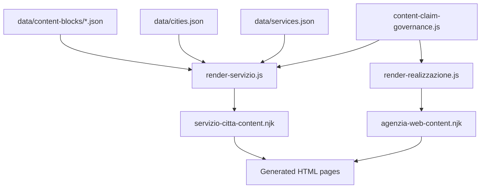
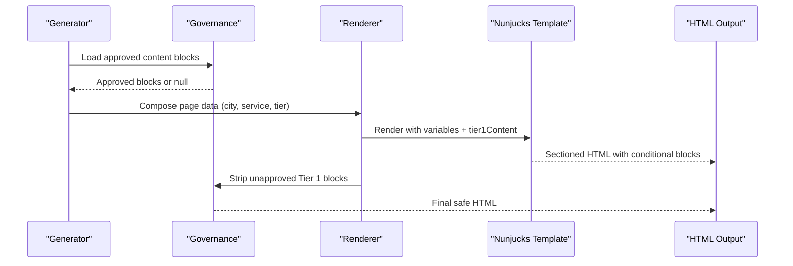
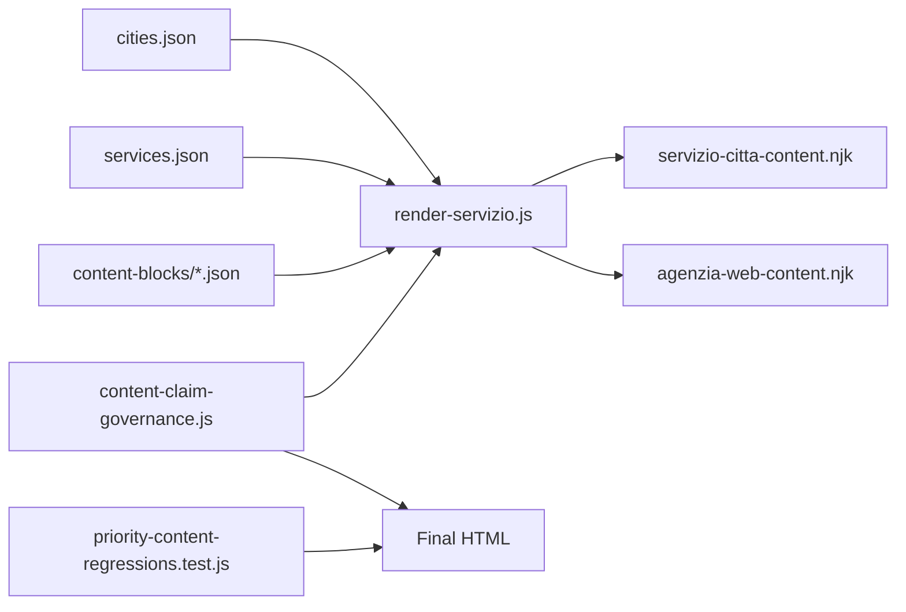

# Content Blocks & Modular Components

<cite>
**Referenced Files in This Document**
- [data/content-blocks/milano.json](file://data/content-blocks/milano.json)
- [data/content-blocks/arese.json](file://data/content-blocks/arese.json)
- [data/content-blocks/tier1-arese-agenzia-web.json](file://data/content-blocks/tier1-arese-agenzia-web.json)
- [data/cities.json](file://data/cities.json)
- [data/services.json](file://data/services.json)
- [templates/agenzia-web-content.njk](file://templates/agenzia-web-content.njk)
- [templates/servizio-citta-content.njk](file://templates/servizio-citta-content.njk)
- [scripts/geo/render-servizio.js](file://scripts/geo/render-servizio.js)
- [scripts/geo/render-realizzazione.js](file://scripts/geo/render-realizzazione.js)
- [config/content-claim-governance.js](file://config/content-claim-governance.js)
- [tests/priority-content-regressions.test.js](file://tests/priority-content-regressions.test.js)
</cite>

## Table of Contents
1. [Introduction](#introduction)
2. [Project Structure](#project-structure)
3. [Core Components](#core-components)
4. [Architecture Overview](#architecture-overview)
5. [Detailed Component Analysis](#detailed-component-analysis)
6. [Dependency Analysis](#dependency-analysis)
7. [Performance Considerations](#performance-considerations)
8. [Troubleshooting Guide](#troubleshooting-guide)
9. [Conclusion](#conclusion)
10. [Appendices](#appendices)

## Introduction
This document explains the content blocks system that powers modular, city- and service-specific page generation. It covers:
- The JSON schema for content blocks (city context, FAQs, data points, and Tier 1 editorial overrides).
- How content blocks are organized by city and service combinations under data/content-blocks.
- The block composition model, inheritance patterns, and override mechanisms used to customize pages per city/service.
- Common block types, properties, and usage patterns within Nunjucks templates.
- Guidance for creating new blocks, naming conventions, and maintaining consistency across the content management pipeline.

The system combines reusable city/service data with hand-crafted Tier 1 editorial blocks to produce localized, high-quality pages while enforcing governance over published claims.

## Project Structure
Content blocks live under data/content-blocks and are consumed by build-time scripts and Nunjucks templates to generate geo-targeted pages.

**Diagram sources**
- [scripts/geo/render-servizio.js:143-192](file://scripts/geo/render-servizio.js#L143-L192)
- [scripts/geo/render-realizzazione.js:202-240](file://scripts/geo/render-realizzazione.js#L202-L240)
- [templates/servizio-citta-content.njk:1-20](file://templates/servizio-citta-content.njk#L1-L20)
- [templates/agenzia-web-content.njk:1-14](file://templates/agenzia-web-content.njk#L1-L14)
- [config/content-claim-governance.js:85-107](file://config/content-claim-governance.js#L85-L107)

**Section sources**
- [data/content-blocks/milano.json:1-64](file://data/content-blocks/milano.json#L1-L64)
- [data/content-blocks/arese.json:1-66](file://data/content-blocks/arese.json#L1-L66)
- [data/content-blocks/tier1-arese-agenzia-web.json:1-34](file://data/content-blocks/tier1-arese-agenzia-web.json#L1-L34)
- [data/cities.json:1-800](file://data/cities.json#L1-L800)
- [data/services.json:1-307](file://data/services.json#L1-L307)
- [scripts/geo/render-servizio.js:143-192](file://scripts/geo/render-servizio.js#L143-L192)
- [scripts/geo/render-realizzazione.js:202-240](file://scripts/geo/render-realizzazione.js#L202-L240)
- [templates/servizio-citta-content.njk:1-20](file://templates/servizio-citta-content.njk#L1-L20)
- [templates/agenzia-web-content.njk:1-14](file://templates/agenzia-web-content.njk#L1-L14)
- [config/content-claim-governance.js:85-107](file://config/content-claim-governance.js#L85-L107)

## Core Components
- City context blocks: Provide local market analysis, competitive context, FAQs, and unique data points per city.
- Service catalog: Defines services, pricing, time estimates, and metadata used across pages.
- Tier 1 editorial overrides: Hand-crafted, approved blocks that inject unique, verified content into top-tier pages.
- Templates: Nunjucks files that compose sections using city/service data and optional Tier 1 blocks.
- Build-time renderers: Scripts that load data, apply tier logic, and merge approved content before rendering.

Key responsibilities:
- data/content-blocks/*: Store reusable, city-scoped content and editorial overrides.
- data/services.json: Central source of truth for services and pricing.
- data/cities.json: Central source of truth for cities, geography, and local context.
- templates/*: Define layout and section composition; consume variables from renderers.
- scripts/geo/*: Orchestrate data loading, tier classification, and template rendering.
- config/content-claim-governance.js: Validates provenance and strips unapproved content from outputs.

**Section sources**
- [data/services.json:1-307](file://data/services.json#L1-L307)
- [data/cities.json:1-800](file://data/cities.json#L1-L800)
- [data/content-blocks/milano.json:1-64](file://data/content-blocks/milano.json#L1-L64)
- [data/content-blocks/arese.json:1-66](file://data/content-blocks/arese.json#L1-L66)
- [data/content-blocks/tier1-arese-agenzia-web.json:1-34](file://data/content-blocks/tier1-arese-agenzia-web.json#L1-L34)
- [templates/servizio-citta-content.njk:1-20](file://templates/servizio-citta-content.njk#L1-L20)
- [templates/agenzia-web-content.njk:1-14](file://templates/agenzia-web-content.njk#L1-L14)
- [scripts/geo/render-servizio.js:143-192](file://scripts/geo/render-servizio.js#L143-L192)
- [config/content-claim-governance.js:85-107](file://config/content-claim-governance.js#L85-L107)

## Architecture Overview
The content blocks system follows a layered architecture:
- Data layer: City and service catalogs plus per-city content blocks.
- Governance layer: Provenance checks and claim filtering ensure only approved content is published.
- Rendering layer: Scripts assemble page data, select tiers, and pass variables to Nunjucks templates.
- Template layer: Sections are composed conditionally based on tier and available blocks.

**Diagram sources**
- [scripts/geo/render-servizio.js:143-192](file://scripts/geo/render-servizio.js#L143-L192)
- [config/content-claim-governance.js:85-107](file://config/content-claim-governance.js#L85-L107)
- [templates/servizio-citta-content.njk:153-184](file://templates/servizio-citta-content.njk#L153-L184)
- [templates/agenzia-web-content.njk:74-106](file://templates/agenzia-web-content.njk#L74-L106)

## Detailed Component Analysis

### City Context Blocks Schema
City context blocks provide localized insights and FAQs for each city. They are used to enrich service×city pages and agency pages.

Schema fields:
- _meta: Metadata including city identifier, generation timestamp, model, and version.
- localMarketAnalysis: Narrative describing the local market opportunity.
- competitiveContext: Narrative describing the digital competitive landscape and positioning.
- faqsAgenzia: Array of FAQ objects tailored for agency-related queries.
- faqsRealizzazione: Array of FAQ objects tailored for website realization queries.
- uniqueDataPoints: Object containing estimatedLocalBusinesses, digitalMaturityScore, topSearchQueries, competitionLevel.

Usage patterns:
- Injected into service×city pages via dataPoints and aiContent when available.
- Used to populate comparison and insight sections that highlight local opportunities.
- QA-tested to ensure generated output does not retain unapproved legacy blocks.

Example references:
- Milano city block includes FAQs and unique data points for Milan.
- Arese city block includes FAQs and unique data points for Arese.

**Section sources**
- [data/content-blocks/milano.json:1-64](file://data/content-blocks/milano.json#L1-L64)
- [data/content-blocks/arese.json:1-66](file://data/content-blocks/arese.json#L1-L66)
- [scripts/geo/render-servizio.js:157-192](file://scripts/geo/render-servizio.js#L157-L192)
- [tests/priority-content-regressions.test.js:87-107](file://tests/priority-content-regressions.test.js#L87-L107)

### Tier 1 Editorial Override Blocks
Tier 1 blocks are hand-crafted, approved content overrides for top-tier indexable pages. They appear only when tier equals 1 and an approved file exists.

Schema fields:
- _meta: Includes city, service, tier, version, lastUpdated, notes, and source.
- headline: Optional heading for the editorial section.
- body: Array of paragraphs (HTML-safe strings).
- bullets: Optional list of bullet items (HTML-safe strings).
- callout: Optional callout object with title and text.
- editorialTodos: Optional array of TODO markers for human review.

Override mechanism:
- Renderer loads tier1-<city>-<service>.json when tier === 1.
- If present and approved, the template renders the section between local context and services grid.
- Governance ensures only approved provenance passes through; otherwise, the block is ignored.

Examples:
- Tier 1 override for Arese Agency Web provides structured editorial content with bullets and callout.

**Section sources**
- [data/content-blocks/tier1-arese-agenzia-web.json:1-34](file://data/content-blocks/tier1-arese-agenzia-web.json#L1-L34)
- [scripts/geo/render-servizio.js:143-155](file://scripts/geo/render-servizio.js#L143-L155)
- [templates/servizio-citta-content.njk:153-184](file://templates/servizio-citta-content.njk#L153-L184)
- [templates/agenzia-web-content.njk:74-106](file://templates/agenzia-web-content.njk#L74-L106)
- [config/content-claim-governance.js:85-107](file://config/content-claim-governance.js#L85-L107)

### Service Catalog and Pricing Integration
Services define the building blocks for comparison tables and page sections. Each service includes:
- slug, name, shortName, schemaType, url, hasPage, tier, priceFrom, priceCurrency, priceUnit, timeEstimate, description, shortDesc, targetKeyword, idealFor.

Integration points:
- Comparison tables in templates iterate over services to display price and time estimates.
- Geo pages link to service pages where applicable and include service-specific schemas.
- Tier classification influences whether full feature sets or slim structures are rendered.

**Section sources**
- [data/services.json:1-307](file://data/services.json#L1-L307)
- [templates/agenzia-web-content.njk:108-182](file://templates/agenzia-web-content.njk#L108-L182)
- [templates/servizio-citta-content.njk:280-311](file://templates/servizio-citta-content.njk#L280-L311)
- [scripts/geo/render-servizio.js:170-192](file://scripts/geo/render-servizio.js#L170-L192)

### City Catalog and Local Context
Cities define geographic and contextual data used across pages:
- slug, name, cap, lat, lng, population, province, wikipedia, distanzaSede, distanzaSedeKm, isSede, generate flags, nearCities, localContext (highlights, tessutoEconomico, settoriChiave, opportunitaDigitale), images, faqs.

Usage:
- Hero sections use city labels and capsules.
- Local context sections render highlights and sectors.
- Nearby cities drive internal linking and related page suggestions.

**Section sources**
- [data/cities.json:1-800](file://data/cities.json#L1-L800)
- [templates/servizio-citta-content.njk:30-55](file://templates/servizio-citta-content.njk#L30-L55)
- [templates/agenzia-web-content.njk:24-40](file://templates/agenzia-web-content.njk#L24-L40)
- [scripts/geo/render-servizio.js:164-175](file://scripts/geo/render-servizio.js#L164-L175)

### Template Composition and Sectioning
Templates define consistent sections and conditional rendering:
- Hero with answer capsule and location info.
- Local context and sector cards.
- Tier 1 editorial block slot (only when tier === 1 and approved).
- Services grid and comparison table.
- Related pages and FAQs.
- CTA sections.

Composition rules:
- Tier 1 adds unique editorial content before comparison tables.
- De-amplified pages (tier 0) omit certain link-heavy sections to reduce doorway footprint.
- All content is validated and sanitized via governance before final output.

**Section sources**
- [templates/servizio-citta-content.njk:21-374](file://templates/servizio-citta-content.njk#L21-L374)
- [templates/agenzia-web-content.njk:15-278](file://templates/agenzia-web-content.njk#L15-L278)
- [scripts/geo/render-realizzazione.js:202-240](file://scripts/geo/render-realizzazione.js#L202-L240)

### Build-Time Rendering and Tier Logic
Renderers orchestrate data loading and template rendering:
- Determine tier classification (1, 2, 0).
- Load Tier 1 editorial overrides when present and approved.
- Assemble template data including city, service, SEO, FAQs, AI content, and data points.
- Render Nunjucks templates and attach schemas.
- Apply governance to strip unapproved Tier 1 blocks from final HTML.

**Section sources**
- [scripts/geo/render-servizio.js:143-289](file://scripts/geo/render-servizio.js#L143-L289)
- [config/content-claim-governance.js:85-107](file://config/content-claim-governance.js#L85-L107)
- [config/content-claim-governance.js:217-226](file://config/content-claim-governance.js#L217-L226)

## Dependency Analysis
Dependencies between components:
- Renderers depend on data/content-blocks, data/cities.json, data/services.json.
- Templates depend on renderer-provided variables and optional Tier 1 blocks.
- Governance depends on content blocks and HTML output to enforce provenance and strip unapproved content.
- Tests validate that generated pages do not retain unapproved legacy blocks and that prices come from services catalog.

**Diagram sources**
- [scripts/geo/render-servizio.js:143-289](file://scripts/geo/render-servizio.js#L143-L289)
- [config/content-claim-governance.js:85-107](file://config/content-claim-governance.js#L85-L107)
- [tests/priority-content-regressions.test.js:1-107](file://tests/priority-content-regressions.test.js#L1-L107)

**Section sources**
- [scripts/geo/render-servizio.js:143-289](file://scripts/geo/render-servizio.js#L143-L289)
- [config/content-claim-governance.js:85-107](file://config/content-claim-governance.js#L85-L107)
- [tests/priority-content-regressions.test.js:1-107](file://tests/priority-content-regressions.test.js#L1-L107)

## Performance Considerations
- Conditional rendering: Tier 1 blocks are loaded only when needed, reducing unnecessary processing.
- Minimal DOM overhead: Templates avoid heavy link-farm sections on de-amplified pages.
- Single source of truth: Prices and times come from services.json, avoiding duplication and ensuring consistency.
- Governance stripping: Unapproved blocks are removed post-render to keep output lean and compliant.

[No sources needed since this section provides general guidance]

## Troubleshooting Guide
Common issues and resolutions:
- Missing Tier 1 block: If tier1-<city>-<service>.json is absent, the template will not render the editorial section. Ensure the file exists and meets provenance requirements.
- Unapproved content: Legacy or unverified blocks are stripped from output. Add proper _meta provenance and approval fields.
- Price mismatch: Prices must be sourced from services.json. If discrepancies occur, update services.json rather than hardcoding values in templates or blocks.
- FAQ rendering: Ensure FAQs arrays are properly formatted and contain at least two entries where required by validation.

Validation and tests:
- Use priority-content-regressions.test.js to verify that generated pages do not include unapproved legacy blocks and that prices match services catalog.

**Section sources**
- [config/content-claim-governance.js:85-107](file://config/content-claim-governance.js#L85-L107)
- [tests/priority-content-regressions.test.js:1-107](file://tests/priority-content-regressions.test.js#L1-L107)

## Conclusion
The content blocks system enables scalable, modular page generation by combining city/service data with hand-crafted, approved Tier 1 editorial blocks. It enforces governance over published claims, maintains consistency through centralized catalogs, and supports flexible composition via Nunjucks templates. Following the naming conventions and schema guidelines ensures reliable rendering and compliance across all generated pages.

[No sources needed since this section summarizes without analyzing specific files]

## Appendices

### Naming Conventions and File Organization
- City context blocks: data/content-blocks/<city>.json
- Tier 1 editorial overrides: data/content-blocks/tier1-<city>-<service>.json
- Service catalog: data/services.json
- City catalog: data/cities.json
- Templates: templates/<page-type>-content.njk
- Renderers: scripts/geo/render-*.js

Guidelines:
- Keep city slugs consistent with data/cities.json.
- Use service slugs from data/services.json for Tier 1 filenames.
- Include complete _meta provenance in Tier 1 blocks to pass governance checks.
- Avoid inventing data; use editorialTodos to mark areas requiring human input.

**Section sources**
- [data/content-blocks/tier1-arese-agenzia-web.json:1-34](file://data/content-blocks/tier1-arese-agenzia-web.json#L1-L34)
- [scripts/geo/render-servizio.js:143-155](file://scripts/geo/render-servizio.js#L143-L155)
- [config/content-claim-governance.js:85-107](file://config/content-claim-governance.js#L85-L107)

### Creating New Content Blocks
Steps:
1. Identify the city and service combination needing customization.
2. Create or update data/content-blocks/<city>.json with local insights and FAQs if needed.
3. For Tier 1 override, create data/content-blocks/tier1-<city>-<service>.json with headline, body, bullets, callout, and _meta provenance.
4. Ensure governance approval by including publicationStatus, source, verifiedAt, and approvedBy in _meta.
5. Validate via tests and build pipeline; confirm no unapproved legacy blocks remain in output.

**Section sources**
- [data/content-blocks/tier1-arese-agenzia-web.json:1-34](file://data/content-blocks/tier1-arese-agenzia-web.json#L1-L34)
- [config/content-claim-governance.js:85-107](file://config/content-claim-governance.js#L85-L107)
- [tests/priority-content-regressions.test.js:1-107](file://tests/priority-content-regressions.test.js#L1-L107)

### Inheritance and Override Patterns
- Base content comes from data/cities.json and data/services.json.
- City context blocks add localized narratives and FAQs.
- Tier 1 blocks override specific sections on top-tier pages when present and approved.
- Templates conditionally render sections based on tier and available data.

**Section sources**
- [templates/servizio-citta-content.njk:153-184](file://templates/servizio-citta-content.njk#L153-L184)
- [templates/agenzia-web-content.njk:74-106](file://templates/agenzia-web-content.njk#L74-L106)
- [scripts/geo/render-servizio.js:143-155](file://scripts/geo/render-servizio.js#L143-L155)