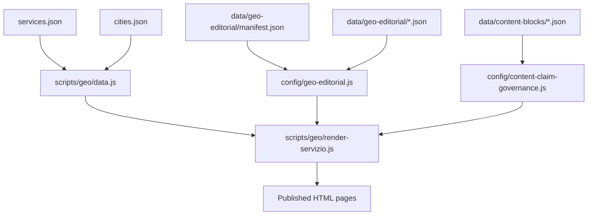
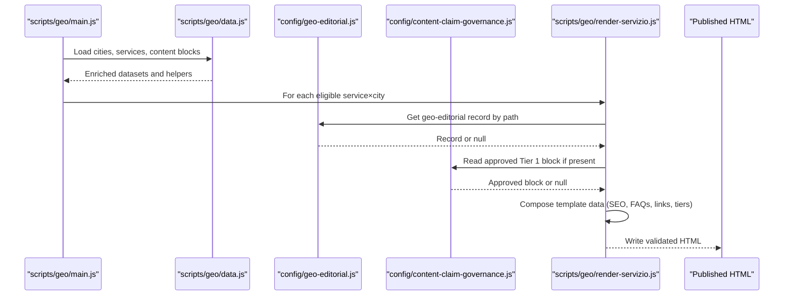
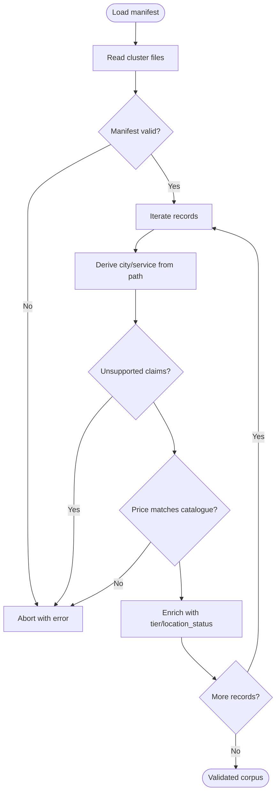
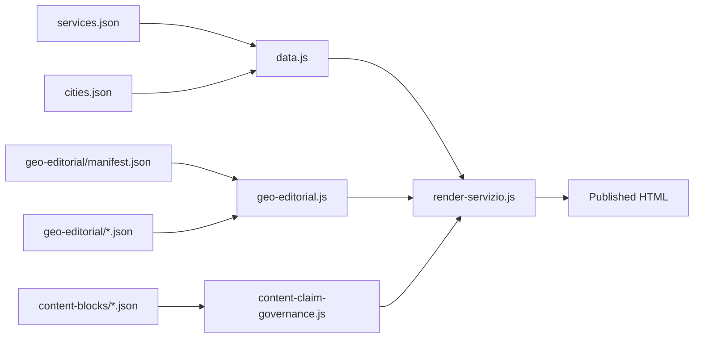

# Data Structures & Content Models

<cite>
**Referenced Files in This Document**
- [services.json](file://data/services.json)
- [cities.json](file://data/cities.json)
- [geo-editorial.js](file://config/geo-editorial.js)
- [manifest.json](file://data/geo-editorial/manifest.json)
- [agency.json](file://data/geo-editorial/agency.json)
- [arese.json](file://data/content-blocks/arese.json)
- [tier1-arese-agenzia-web.json](file://data/content-blocks/tier1-arese-agenzia-web.json)
- [content-claim-governance.js](file://config/content-claim-governance.js)
- [main.js](file://scripts/geo/main.js)
- [data.js](file://scripts/geo/data.js)
- [render-servizio.js](file://scripts/geo/render-servizio.js)
- [editorial.js](file://scripts/geo/editorial.js)
</cite>

## Table of Contents
1. [Introduction](#introduction)
2. [Project Structure](#project-structure)
3. [Core Components](#core-components)
4. [Architecture Overview](#architecture-overview)
5. [Detailed Component Analysis](#detailed-component-analysis)
6. [Dependency Analysis](#dependency-analysis)
7. [Performance Considerations](#performance-considerations)
8. [Troubleshooting Guide](#troubleshooting-guide)
9. [Conclusion](#conclusion)
10. [Appendices](#appendices)

## Introduction
This document describes the WebNovis content data structures and models that power geo-targeted pages, service catalogs, and modular content blocks. It explains:
- The services catalog schema used for pricing, SEO keywords, and tier classification.
- The cities data model with geographic information, local SEO context, and relationships to services.
- The content blocks system for reusable, localized page components and dynamic content injection.
- The geo-editorial content model for location-specific content generation, including validation rules, editorial guidelines, and localization support.
- Guidance on extending data models, adding new content types, and maintaining consistency across the system.

## Project Structure
The data-driven site uses a small set of authoritative JSON sources consumed by build scripts and templates:
- Services catalog: data/services.json
- Cities master list: data/cities.json
- Geo-editorial corpus: data/geo-editorial/*.json plus manifest.json
- Content blocks: data/content-blocks/*.json (city-level AI blocks and Tier 1 overrides)
- Build orchestration: scripts/geo/*
- Governance and validation: config/geo-editorial.js, config/content-claim-governance.js

**Diagram sources**
- [services.json:1-307](file://data/services.json#L1-L307)
- [cities.json:1-800](file://data/cities.json#L1-L800)
- [manifest.json:1-451](file://data/geo-editorial/manifest.json#L1-L451)
- [content-claim-governance.js:1-240](file://config/content-claim-governance.js#L1-L240)
- [data.js:1-197](file://scripts/geo/data.js#L1-L197)
- [render-servizio.js:1-200](file://scripts/geo/render-servizio.js#L1-L200)

**Section sources**
- [services.json:1-307](file://data/services.json#L1-L307)
- [cities.json:1-800](file://data/cities.json#L1-L800)
- [manifest.json:1-451](file://data/geo-editorial/manifest.json#L1-L451)
- [content-claim-governance.js:1-240](file://config/content-claim-governance.js#L1-L240)
- [data.js:1-197](file://scripts/geo/data.js#L1-L197)
- [render-servizio.js:1-200](file://scripts/geo/render-servizio.js#L1-L200)

## Core Components
- Services catalog: defines each service’s metadata, pricing, SEO keyword, target audience, and whether it participates in geo generation.
- Cities dataset: centralizes geographic and local context data, including coordinates, population, province, nearby cities, and FAQs per service type.
- Geo-editorial corpus: curated, validated records mapping service×city paths to title, description, H1, intro, sections, FAQs, and CTA, governed by a manifest and strict validators.
- Content blocks: city-scoped AI-generated insights and hand-crafted Tier 1 overrides that inject unique content into generated pages.

**Section sources**
- [services.json:1-307](file://data/services.json#L1-L307)
- [cities.json:1-800](file://data/cities.json#L1-L800)
- [geo-editorial.js:1-527](file://config/geo-editorial.js#L1-L527)
- [manifest.json:1-451](file://data/geo-editorial/manifest.json#L1-L451)
- [arese.json:1-66](file://data/content-blocks/arese.json#L1-L66)
- [tier1-arese-agenzia-web.json:1-34](file://data/content-blocks/tier1-arese-agenzia-web.json#L1-L34)

## Architecture Overview
The geo page generator composes pages from multiple data sources and applies governance rules before publishing.

**Diagram sources**
- [main.js:1-292](file://scripts/geo/main.js#L1-L292)
- [data.js:1-197](file://scripts/geo/data.js#L1-L197)
- [geo-editorial.js:1-527](file://config/geo-editorial.js#L1-L527)
- [content-claim-governance.js:1-240](file://config/content-claim-governance.js#L1-L240)
- [render-servizio.js:1-200](file://scripts/geo/render-servizio.js#L1-L200)

## Detailed Component Analysis

### Services Catalog Schema
The services catalog is the single source of truth for pricing, SEO targeting, and geo participation.

Key fields:
- slug: identifier used in URLs and internal linking
- name, shortName: human-readable labels
- schemaType: semantic type for structured data
- url: canonical service page URL when hasPage is true
- hasPage: indicates whether a dedicated service page exists
- tier: core vs extended; controls visibility in geo contexts
- priceFrom, priceCurrency, priceUnit: canonical pricing
- timeEstimate: indicative delivery window
- description, shortDesc: marketing copy
- targetKeyword: primary SEO keyword
- idealFor: intended audience
- generateGeoPages, skipGeoGeneration: control geo page generation
- canonicalServiceSlug, deprecationNote: migration guidance

Validation and usage:
- Price normalization and display are centralized in the data loader.
- Geo eligibility is enforced via explicit flags.
- Offer objects and prices are derived from this catalog to ensure consistency.

Example references:
- Service entry structure and fields: [services.json:9-305](file://data/services.json#L9-L305)
- Price formatting and offer building: [data.js:23-45](file://scripts/geo/data.js#L23-L45)
- Geo eligibility predicate: [data.js:47-56](file://scripts/geo/data.js#L47-L56)

**Section sources**
- [services.json:1-307](file://data/services.json#L1-L307)
- [data.js:1-197](file://scripts/geo/data.js#L1-L197)

### Cities Data Model
Cities provide geographic anchors and local context for geo pages.

Key fields:
- slug, name, cap, lat, lng, province, population: geographic identifiers
- distanzaSede, distanzaSedeKm, isSede: distance to headquarters and HQ flag
- generate.agenzia, generate.realizzazione: which page types to generate
- nearCities: related municipalities for cross-linking
- localContext.highlights, tessutoEconomico, settoriChiave, opportunitaDigitale: local SEO content
- images: image assets with alt text
- faqs.agenzia, faqs.realizzazione: localized FAQ pools

Relationships:
- Used to derive nearest cities and link graphs.
- Drives page eligibility and content variation.
- Supplies local context injected into service×city pages.

Example references:
- City object shape and local context: [cities.json:15-115](file://data/cities.json#L15-L115)
- Nearby city resolution and linking: [render-servizio.js:47-59](file://scripts/geo/render-servizio.js#L47-L59)

**Section sources**
- [cities.json:1-800](file://data/cities.json#L1-L800)
- [render-servizio.js:1-200](file://scripts/geo/render-servizio.js#L1-L200)

### Geo-Editorial Content Model
The geo-editorial corpus provides hand-written, validated content for indexable service×city pages.

Record fields:
- path: canonical URL path
- city, service: resolved labels matched against governance
- title, description, h1: SEO metadata
- answer_capsule: hero capsule text
- intro: opening paragraph
- sections: array of { heading, body }
- faqs: array of { question, answer }
- cta: closing call-to-action

Governance and validation:
- Manifest declares clusters, files, record counts, and SHA-256 checksums.
- Path derivation ensures correct city and service mapping.
- Claims policy forbids unsupported performance/rating claims and enforces price alignment with the services catalog.
- Location status distinguishes headquarters vs area served.

Example references:
- Manifest structure and record index: [manifest.json:1-451](file://data/geo-editorial/manifest.json#L1-L451)
- Validation rules and price checks: [geo-editorial.js:183-399](file://config/geo-editorial.js#L183-L399)
- Sample agency record: [agency.json:1-44](file://data/geo-editorial/agency.json#L1-L44)

**Diagram sources**
- [geo-editorial.js:215-459](file://config/geo-editorial.js#L215-L459)
- [manifest.json:1-451](file://data/geo-editorial/manifest.json#L1-L451)

**Section sources**
- [geo-editorial.js:1-527](file://config/geo-editorial.js#L1-L527)
- [manifest.json:1-451](file://data/geo-editorial/manifest.json#L1-L451)
- [agency.json:1-200](file://data/geo-editorial/agency.json#L1-L200)

### Content Blocks System
Content blocks enable modular, reusable, and localized page components.

Types:
- City-level AI blocks: market analysis, competitive context, FAQs, and unique data points per city.
- Tier 1 overrides: hand-crafted editorial blocks for high-priority pages, approved via governance.

Structure examples:
- City block includes _meta, localMarketAnalysis, competitiveContext, faqsAgenzia/faqsRealizzazione, uniqueDataPoints.
- Tier 1 block includes _meta, headline, body, bullets, callout, editorialTodos.

Usage:
- Loaded through claim governance to ensure only approved blocks are published.
- Injected into service×city pages based on service cluster to avoid duplication.

Example references:
- City block example: [arese.json:1-66](file://data/content-blocks/arese.json#L1-L66)
- Tier 1 override example: [tier1-arese-agenzia-web.json:1-34](file://data/content-blocks/tier1-arese-agenzia-web.json#L1-L34)
- Approval and loading logic: [content-claim-governance.js:74-107](file://config/content-claim-governance.js#L74-L107)
- Injection into service×city pages: [render-servizio.js:68-94](file://scripts/geo/render-servizio.js#L68-L94)

**Section sources**
- [arese.json:1-66](file://data/content-blocks/arese.json#L1-L66)
- [tier1-arese-agenzia-web.json:1-34](file://data/content-blocks/tier1-arese-agenzia-web.json#L1-L34)
- [content-claim-governance.js:1-240](file://config/content-claim-governance.js#L1-L240)
- [render-servizio.js:1-200](file://scripts/geo/render-servizio.js#L1-L200)

### Editorial Integration and Localization
Editorial records can override SEO metadata and replace shared content blocks with city-specific copy.

Behavior:
- Title, description, H1, and capsule can be overridden by geo-editorial records.
- Body section replacement ensures uniqueness per city.
- Location status enforcement prevents misleading “local office” claims outside headquarters.

Example references:
- SEO overrides and body replacement: [editorial.js:13-56](file://scripts/geo/editorial.js#L13-L56)
- Location status and claims enforcement: [geo-editorial.js:384-396](file://config/geo-editorial.js#L384-L396)

**Section sources**
- [editorial.js:1-63](file://scripts/geo/editorial.js#L1-L63)
- [geo-editorial.js:384-396](file://config/geo-editorial.js#L384-L396)

## Dependency Analysis
The build pipeline orchestrates data loading, validation, rendering, and publishing.

**Diagram sources**
- [data.js:1-197](file://scripts/geo/data.js#L1-L197)
- [geo-editorial.js:1-527](file://config/geo-editorial.js#L1-L527)
- [content-claim-governance.js:1-240](file://config/content-claim-governance.js#L1-L240)
- [render-servizio.js:1-200](file://scripts/geo/render-servizio.js#L1-L200)

**Section sources**
- [main.js:1-292](file://scripts/geo/main.js#L1-L292)
- [data.js:1-197](file://scripts/geo/data.js#L1-L197)
- [geo-editorial.js:1-527](file://config/geo-editorial.js#L1-L527)
- [content-claim-governance.js:1-240](file://config/content-claim-governance.js#L1-L240)
- [render-servizio.js:1-200](file://scripts/geo/render-servizio.js#L1-L200)

## Performance Considerations
- Centralized data loading reduces repeated file reads and parsing overhead.
- Manifest-based integrity checks prevent unnecessary processing of corrupted or mismatched content.
- Tiered content strategy limits heavy editorial overrides to high-value pages.
- Avoiding unsupported claims and ensuring canonical prices reduces rework and compliance risk.

[No sources needed since this section provides general guidance]

## Troubleshooting Guide
Common issues and how to resolve them:
- Manifest mismatch: Ensure file counts, SHA-256 hashes, and record indices match exactly. Errors will abort the build.
- Unsupported claims: Remove prohibited phrases such as guaranteed scores or fixed response times.
- Price mismatches: Any quoted price must exist in the services catalog; otherwise validation fails.
- Duplicate paths or IDs: Each record path and ID must be unique and aligned with governance tiers.
- Missing editorial records: If a page expects an editorial override, ensure the path exists in the manifest and corpus.

Relevant validations:
- Manifest and record validation: [geo-editorial.js:215-312](file://config/geo-editorial.js#L215-L312)
- Record-level checks and claims: [geo-editorial.js:339-399](file://config/geo-editorial.js#L339-L399)
- Claim detection patterns: [content-claim-governance.js:17-60](file://config/content-claim-governance.js#L17-L60)

**Section sources**
- [geo-editorial.js:215-399](file://config/geo-editorial.js#L215-L399)
- [content-claim-governance.js:17-60](file://config/content-claim-governance.js#L17-L60)

## Conclusion
WebNovis’ data architecture centers on authoritative JSON models and strict governance:
- Services catalog standardizes pricing and SEO targeting.
- Cities dataset grounds geo pages in real local context and relationships.
- Geo-editorial corpus ensures unique, compliant, and indexable content for priority pages.
- Content blocks enable scalable personalization while preserving quality through approval workflows.
Adhering to these schemas and validation rules maintains consistency, supports localization, and enables safe extension of content types.

[No sources needed since this section summarizes without analyzing specific files]

## Appendices

### Extending Data Models
- Adding a new service:
  - Add a service entry to services.json with required fields (slug, name, priceFrom, etc.).
  - Decide tier and geo participation flags.
  - Update any relevant FAQ pools or cluster categorizations in render logic if needed.
- Adding a new city:
  - Add a city object to cities.json with geographic and local context fields.
  - Configure generate flags and nearCities relationships.
  - Optionally add city-level content blocks and Tier 1 overrides if needed.
- Updating geo-editorial corpus:
  - Add or modify records in the appropriate cluster file.
  - Update manifest.json with new file entries, record counts, and checksums.
  - Ensure all paths align with governance tiers and do not introduce unsupported claims.

[No sources needed since this section provides general guidance]