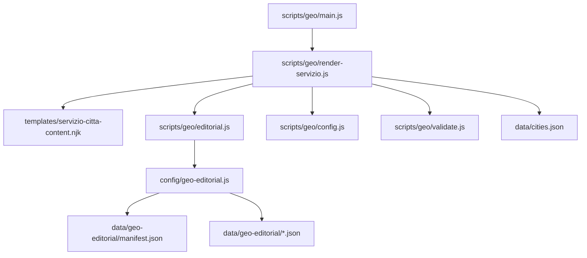
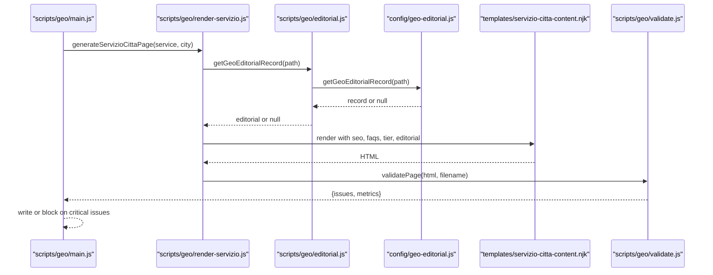
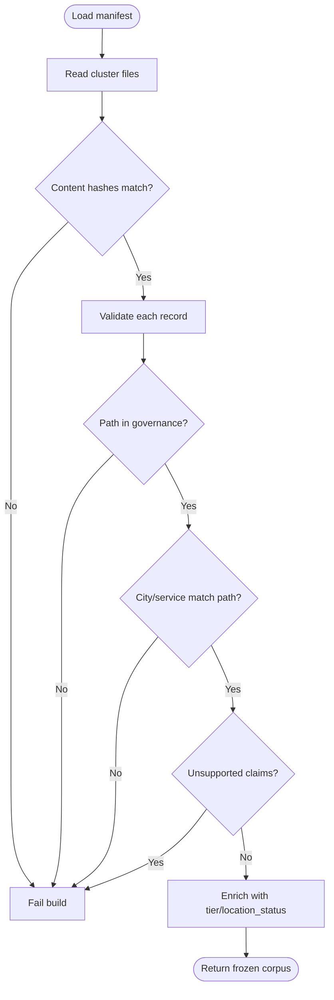
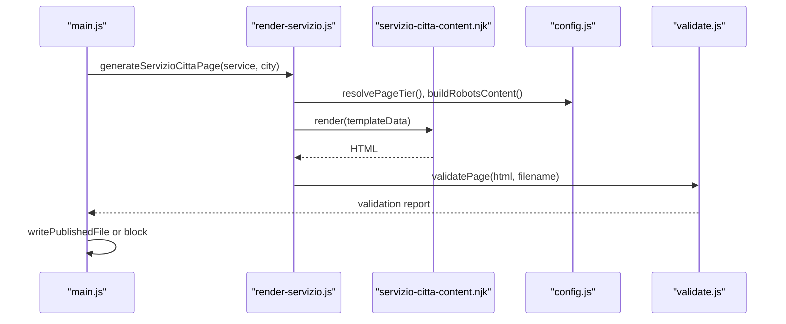
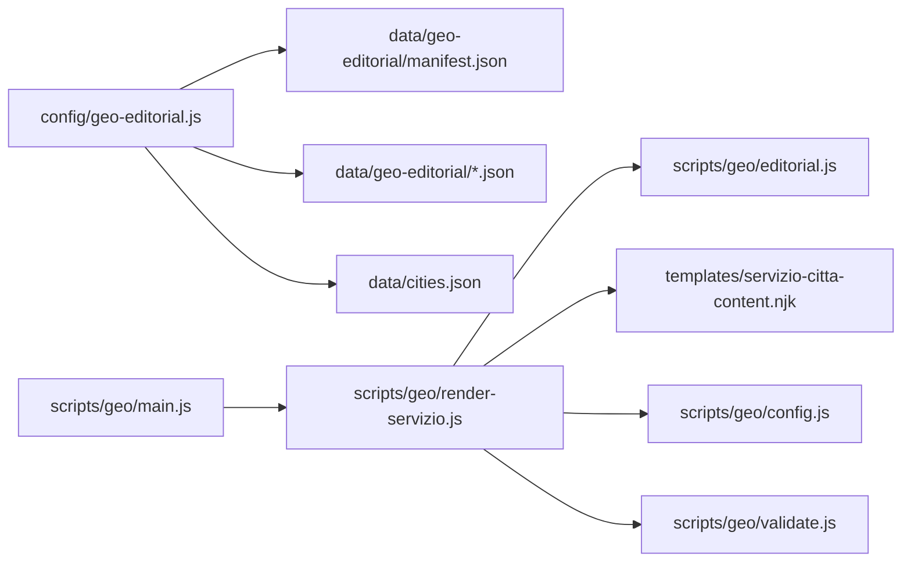

# Geo-Editorial Content Model

<cite>
**Referenced Files in This Document**
- [config/geo-editorial.js](file://config/geo-editorial.js)
- [data/geo-editorial/manifest.json](file://data/geo-editorial/manifest.json)
- [data/geo-editorial/agency.json](file://data/geo-editorial/agency.json)
- [data/geo-editorial/ecommerce.json](file://data/geo-editorial/ecommerce.json)
- [data/geo-editorial/seo-locale.json](file://data/geo-editorial/seo-locale.json)
- [scripts/geo/editorial.js](file://scripts/geo/editorial.js)
- [scripts/geo/render-servizio.js](file://scripts/geo/render-servizio.js)
- [templates/servizio-citta-content.njk](file://templates/servizio-citta-content.njk)
- [scripts/geo/main.js](file://scripts/geo/main.js)
- [scripts/geo/config.js](file://scripts/geo/config.js)
- [scripts/geo/validate.js](file://scripts/geo/validate.js)
- [data/cities.json](file://data/cities.json)
</cite>

## Table of Contents
1. Introduction
2. Project Structure
3. Core Components
4. Architecture Overview
5. Detailed Component Analysis
6. Dependency Analysis
7. Performance Considerations
8. Troubleshooting Guide
9. Conclusion
10. Appendices

## Introduction
This document explains the geo-editorial content model that powers location-specific content generation for WebNovis. It covers editorial guidelines, content templates for service types (agency, ecommerce, other-services, realizzazione, seo-locale), localization support, integration with the page generation pipeline, and configuration options for rules, language handling, and validation. It also provides guidance on extending the system with new content types while maintaining quality standards across localized pages.

## Project Structure
The geo-editorial system is centered around a curated corpus of hand-written, per-city records grouped by service cluster, a manifest that governs indexable paths and tiers, and a generator pipeline that merges editorial content into templated pages.

**Diagram sources**
- [config/geo-editorial.js:15-18](file://config/geo-editorial.js#L15-L18)
- [data/geo-editorial/manifest.json:1-47](file://data/geo-editorial/manifest.json#L1-L47)
- [scripts/geo/main.js:38-66](file://scripts/geo/main.js#L38-L66)
- [scripts/geo/render-servizio.js:36-46](file://scripts/geo/render-servizio.js#L36-L46)
- [scripts/geo/editorial.js:1-25](file://scripts/geo/editorial.js#L1-L25)
- [scripts/geo/config.js:62-78](file://scripts/geo/config.js#L62-L78)
- [scripts/geo/validate.js:7-49](file://scripts/geo/validate.js#L7-L49)
- [data/cities.json:1-13](file://data/cities.json#L1-L13)

**Section sources**
- [config/geo-editorial.js:15-18](file://config/geo-editorial.js#L15-L18)
- [data/geo-editorial/manifest.json:1-47](file://data/geo-editorial/manifest.json#L1-L47)
- [scripts/geo/main.js:38-66](file://scripts/geo/main.js#L38-L66)

## Core Components
- Editorial corpus loader and validator: loads and validates the geo-editorial records against a strict schema, governance tiers, and claim rules.
- Manifest and tiering: defines which paths are indexable, their tiers, and integrity hashes to prevent drift.
- Service×city page generator: composes SEO metadata, editorial sections, FAQs, schemas, and links using Nunjucks templates.
- Template rendering: renders structured sections, answer capsules, and editorial blocks based on tier and availability.
- Validation gate: enforces minimum word count, internal links, schema presence, canonical tags, and claim compliance.

Key responsibilities:
- Enforce editorial consistency across all generated pages.
- Ensure only approved, governed paths are published.
- Maintain localization through city data and Italian-language copy.
- Provide fail-closed behavior when governance or content rules are violated.

**Section sources**
- [config/geo-editorial.js:124-166](file://config/geo-editorial.js#L124-L166)
- [config/geo-editorial.js:215-312](file://config/geo-editorial.js#L215-L312)
- [config/geo-editorial.js:339-459](file://config/geo-editorial.js#L339-L459)
- [scripts/geo/render-servizio.js:36-192](file://scripts/geo/render-servizio.js#L36-L192)
- [templates/servizio-citta-content.njk:21-70](file://templates/servizio-citta-content.njk#L21-L70)
- [scripts/geo/validate.js:7-49](file://scripts/geo/validate.js#L7-L49)

## Architecture Overview
The system orchestrates three main flows:
- Corpus loading and validation: reads manifest and cluster files, verifies integrity, and enriches records with tier and location status.
- Page composition: selects base template, merges editorial overrides, injects AI-enriched context where available, and builds JSON-LD schemas.
- Publication gating: validates output HTML and writes only if checks pass; otherwise fails closed.

**Diagram sources**
- [scripts/geo/main.js:152-195](file://scripts/geo/main.js#L152-L195)
- [scripts/geo/render-servizio.js:36-46](file://scripts/geo/render-servizio.js#L36-L46)
- [scripts/geo/editorial.js:13-25](file://scripts/geo/editorial.js#L13-L25)
- [config/geo-editorial.js:497-505](file://config/geo-editorial.js#L497-L505)
- [templates/servizio-citta-content.njk:21-70](file://templates/servizio-citta-content.njk#L21-L70)
- [scripts/geo/validate.js:7-49](file://scripts/geo/validate.js#L7-L49)

## Detailed Component Analysis

### Editorial Guidelines and Schema
- Record fields: path, city, service, title, description, h1, answer_capsule, intro, sections, faqs, cta.
- Sections: heading and body with length constraints and plain-text-only enforcement.
- FAQs: question and answer with length constraints.
- Governance:
  - Only paths declared in the manifest are allowed.
  - Each path has a tier (Tier 1, Tier 2, Data-validated).
  - City must match path-derived city; service must match path-derived service label.
  - Non-Rho locations must visibly qualify as “area served” or identify Rho as headquarters; Rho pages must explicitly state headquarters.
  - Claims governance forbids unsupported performance ratings and unverified numeric claims; prices must exist in the service catalogue.
- Integrity:
  - Manifest includes file-level SHA-256 hashes for source artifacts and content.
  - Record IDs are sequential GEO-001..GEO-080.
  - Duplicate values for key fields across records are rejected.

**Diagram sources**
- [config/geo-editorial.js:215-312](file://config/geo-editorial.js#L215-L312)
- [config/geo-editorial.js:339-459](file://config/geo-editorial.js#L339-L459)
- [config/geo-editorial.js:461-490](file://config/geo-editorial.js#L461-L490)

**Section sources**
- [config/geo-editorial.js:18-31](file://config/geo-editorial.js#L18-L31)
- [config/geo-editorial.js:56-84](file://config/geo-editorial.js#L56-L84)
- [config/geo-editorial.js:124-166](file://config/geo-editorial.js#L124-L166)
- [config/geo-editorial.js:215-312](file://config/geo-editorial.js#L215-L312)
- [config/geo-editorial.js:339-459](file://config/geo-editorial.js#L339-L459)
- [data/geo-editorial/manifest.json:1-47](file://data/geo-editorial/manifest.json#L1-L47)

### Content Templates for Service Types
- agency: Hand-written per-city records provide local context, strategy emphasis, and ownership clarity. Example record structure is present in the agency cluster.
- ecommerce: Records emphasize custom code, checkout optimization, catalog preparation, and local pickup/delivery considerations.
- seo-locale: Records focus on Google Business Profile hygiene, local search intent, reviews, and measurement of calls and map actions.
- realizzazione: Pages use a dedicated generator that applies editorial overrides and FAQ resolution.
- other-services: Includes landing-page, social-media, email-marketing, google-ads, graphic-design, etc., following the same record schema and template rendering.

Template behavior:
- Hero section renders answer capsule and highlights.
- If an editorial record exists, it replaces the first shared section with a localized “contesto locale” block including intro, three sections, and optional CTA.
- Tier 1 pages can include an additional hand-crafted editorial block from approved content blocks.
- Related services and nearby cities are linked conditionally based on indexability.

**Section sources**
- [data/geo-editorial/agency.json:1-44](file://data/geo-editorial/agency.json#L1-L44)
- [data/geo-editorial/ecommerce.json:1-44](file://data/geo-editorial/ecommerce.json#L1-L44)
- [data/geo-editorial/seo-locale.json:1-44](file://data/geo-editorial/seo-locale.json#L1-L44)
- [scripts/geo/render-realizzazione.js:33-39](file://scripts/geo/render-realizzazione.js#L33-L39)
- [templates/servizio-citta-content.njk:30-70](file://templates/servizio-citta-content.njk#L30-L70)
- [templates/servizio-citta-content.njk:153-184](file://templates/servizio-citta-content.njk#L153-L184)

### Localization Support Mechanisms
- City data: Centralized city definitions include slug, name, province, coordinates, distance to headquarters, nearCities, and localContext (economic fabric, key sectors, digital opportunities).
- Language: Copy is authored in Italian; normalization uses Italian locale for uniqueness checks.
- Location status: Pages derive whether a city is headquarters or area served; non-headquarters pages must clearly state area served or reference Rho headquarters.
- Proximity cues: Distance strings and kilometers are used to tailor messaging about in-person meetings.

**Section sources**
- [data/cities.json:1-13](file://data/cities.json#L1-L13)
- [data/cities.json:15-54](file://data/cities.json#L15-L54)
- [config/geo-editorial.js:75-80](file://config/geo-editorial.js#L75-L80)
- [config/geo-editorial.js:183-213](file://config/geo-editorial.js#L183-L213)
- [config/geo-editorial.js:384-396](file://config/geo-editorial.js#L384-L396)

### Integration With the Broader Generation Pipeline
- Orchestration: The main script iterates over cities and services, generates pages, finalizes HTML, validates, and writes outputs.
- Composition: For servizio×città pages, the generator loads the base page, resolves editorial SEO overrides, injects AI-enriched content blocks when available, and renders the Nunjucks template.
- Schemas: JSON-LD for BreadcrumbList, WebPage, Service, Offer, and FAQPage are appended to the page.
- Governance: Robots directives and indexation are derived from governance helpers; de-amplified pages omit heavy link-hubs to reduce doorway footprint.

**Diagram sources**
- [scripts/geo/main.js:152-195](file://scripts/geo/main.js#L152-L195)
- [scripts/geo/render-servizio.js:36-46](file://scripts/geo/render-servizio.js#L36-L46)
- [scripts/geo/config.js:62-78](file://scripts/geo/config.js#L62-L78)
- [scripts/geo/validate.js:7-49](file://scripts/geo/validate.js#L7-L49)
- [templates/servizio-citta-content.njk:21-70](file://templates/servizio-citta-content.njk#L21-L70)

**Section sources**
- [scripts/geo/main.js:38-66](file://scripts/geo/main.js#L38-L66)
- [scripts/geo/render-servizio.js:36-192](file://scripts/geo/render-servizio.js#L36-L192)
- [scripts/geo/config.js:62-78](file://scripts/geo/config.js#L62-L78)
- [scripts/geo/validate.js:7-49](file://scripts/geo/validate.js#L7-L49)

### Configuration Options for Rules, Language Handling, and Validation
- Rules:
  - Manifest-driven allowlist of indexable paths and tiers.
  - Strict field sets for records, sections, and FAQs.
  - Claim governance integration to reject unsupported statements.
  - Price validation against the service catalogue.
- Language:
  - Italian locale normalization for uniqueness checks.
  - All visible text validated for markup and control characters.
- Validation:
  - Minimum word count thresholds with warnings and critical failures.
  - Internal link targets enforced.
  - Required JSON-LD schemas checked.
  - Canonical tag and H1 presence required.
  - Answer capsule class expected for GEO optimization.

**Section sources**
- [config/geo-editorial.js:124-166](file://config/geo-editorial.js#L124-L166)
- [config/geo-editorial.js:215-312](file://config/geo-editorial.js#L215-L312)
- [config/geo-editorial.js:339-459](file://config/geo-editorial.js#L339-L459)
- [scripts/geo/validate.js:7-49](file://scripts/geo/validate.js#L7-L49)

### Examples of Editorial Guidelines, Template Structures, and Customization Patterns
- Editorial examples:
  - Agency record shows local strategy, ownership clarity, and in-person proximity.
  - E-commerce record emphasizes checkout optimization, catalog prep, and custom code benefits.
  - SEO locale record focuses on Google Business Profile, reviews, and call-based conversions.
- Template structure:
  - Hero with answer capsule and highlights.
  - Optional editorial “contesto locale” block replacing the first shared section.
  - Tier 1 editorial override block for hand-crafted unique content.
  - Comparison table and related services/neighborhood links shown conditionally by tier.
- Customization patterns:
  - Add a new service cluster by adding a new JSON file to data/geo-editorial and updating EXPECTED_FILES in the loader.
  - Extend RECORD_INDEX entries in the manifest for new paths.
  - Use tier1 content blocks for high-value city×service combinations.

**Section sources**
- [data/geo-editorial/agency.json:1-44](file://data/geo-editorial/agency.json#L1-L44)
- [data/geo-editorial/ecommerce.json:1-44](file://data/geo-editorial/ecommerce.json#L1-L44)
- [data/geo-editorial/seo-locale.json:1-44](file://data/geo-editorial/seo-locale.json#L1-L44)
- [templates/servizio-citta-content.njk:30-70](file://templates/servizio-citta-content.njk#L30-L70)
- [templates/servizio-citta-content.njk:153-184](file://templates/servizio-citta-content.njk#L153-L184)
- [config/geo-editorial.js:56-62](file://config/geo-editorial.js#L56-L62)

## Dependency Analysis
- config/geo-editorial.js depends on:
  - data/geo-editorial/manifest.json and cluster files.
  - data/cities.json for city labels and headquarters detection.
  - config/pseo-governance for indexable path sets and tier classification.
  - config/content-claim-governance for claim validation.
- scripts/geo/render-servizio.js depends on:
  - scripts/geo/editorial.js for editorial lookup and overrides.
  - templates/servizio-citta-content.njk for rendering.
  - scripts/geo/config.js for tier and robots directives.
  - scripts/geo/validate.js for post-render checks.
- scripts/geo/main.js orchestrates generators and validation outcomes.

**Diagram sources**
- [config/geo-editorial.js:5-13](file://config/geo-editorial.js#L5-L13)
- [scripts/geo/render-servizio.js:4-34](file://scripts/geo/render-servizio.js#L4-L34)
- [scripts/geo/main.js:38-66](file://scripts/geo/main.js#L38-L66)

**Section sources**
- [config/geo-editorial.js:5-13](file://config/geo-editorial.js#L5-L13)
- [scripts/geo/render-servizio.js:4-34](file://scripts/geo/render-servizio.js#L4-L34)
- [scripts/geo/main.js:38-66](file://scripts/geo/main.js#L38-L66)

## Performance Considerations
- Caching: The corpus loader caches the validated corpus, record map, and manifest to avoid repeated disk reads during generation.
- Minimal DOM overhead: De-amplified pages (tier 0) omit heavy comparison tables and extensive link lists to reduce doorway footprint.
- Efficient rendering: Template sections are conditional on tier and availability of editorial/AI content, minimizing unnecessary markup.
- Validation early exit: Critical validation failures block publication immediately, preventing wasted downstream work.

[No sources needed since this section provides general guidance]

## Troubleshooting Guide
Common failures and how to address them:
- Manifest mismatch:
  - Ensure totalRecords matches sum of file recordCounts.
  - Verify all expected clusters are present and no duplicates exist.
  - Confirm record_id sequence GEO-001..GEO-080 without gaps.
- Path not indexable:
  - Only paths listed in the manifest’s recordIndex are allowed.
  - Paths must match governance tiers exactly.
- Record validation errors:
  - Fields must be plain text without markup or control characters.
  - Length constraints must be satisfied for title, description, h1, answer_capsule, intro, sections, and FAQs.
  - City and service must match path-derived values.
- Claim violations:
  - Remove unsupported performance ratings or unverified numeric claims.
  - Prices must exist in the service catalogue.
- Page validation failures:
  - Ensure minimum word count, internal links, JSON-LD schemas, canonical tag, and H1 presence.
  - Include answer-capsule class for GEO optimization.

**Section sources**
- [config/geo-editorial.js:215-312](file://config/geo-editorial.js#L215-L312)
- [config/geo-editorial.js:339-459](file://config/geo-editorial.js#L339-L459)
- [scripts/geo/validate.js:7-49](file://scripts/geo/validate.js#L7-L49)

## Conclusion
The geo-editorial content model provides a robust, governed foundation for generating consistent, localized service pages at scale. By combining a strict manifest-driven corpus, hand-written editorial records, tiered indexation, and fail-closed validation, the system ensures editorial quality, legal safety, and SEO coherence across all generated pages. Extending the system requires careful updates to the manifest, cluster files, and governance settings, followed by validation before publication.

[No sources needed since this section summarizes without analyzing specific files]

## Appendices

### How to Extend With New Content Types
- Add a new cluster file under data/geo-editorial with records conforming to the schema.
- Update EXPECTED_FILES in the loader to include the new cluster and expected recordCount.
- Add new paths to the manifest’s recordIndex with correct tiers.
- Ensure city and service labels align with existing mappings or extend SERVICE_LABELS accordingly.
- Run the generator in dry-run and validate-only modes to catch issues early.

**Section sources**
- [config/geo-editorial.js:56-62](file://config/geo-editorial.js#L56-L62)
- [data/geo-editorial/manifest.json:48-449](file://data/geo-editorial/manifest.json#L48-L449)
- [scripts/geo/main.js:38-66](file://scripts/geo/main.js#L38-L66)

### Maintaining Quality Standards Across Localized Content
- Keep editorial records concise, factual, and locally relevant.
- Avoid generic duplication; leverage tier1 content blocks for high-value pages.
- Regularly audit claim compliance and price alignment with the catalogue.
- Monitor validation reports and fix critical issues before publishing.

**Section sources**
- [config/geo-editorial.js:339-459](file://config/geo-editorial.js#L339-L459)
- [scripts/geo/validate.js:7-49](file://scripts/geo/validate.js#L7-L49)
- [templates/servizio-citta-content.njk:153-184](file://templates/servizio-citta-content.njk#L153-L184)