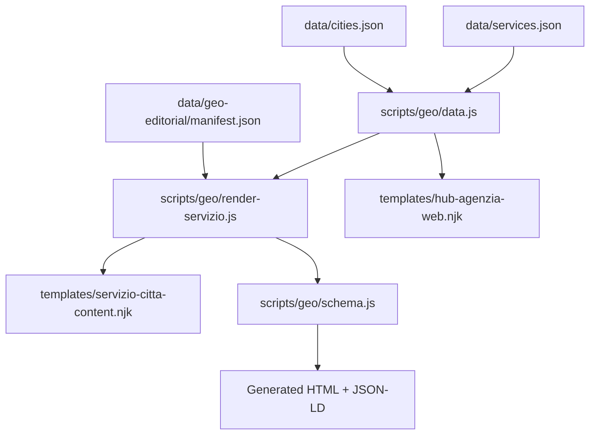
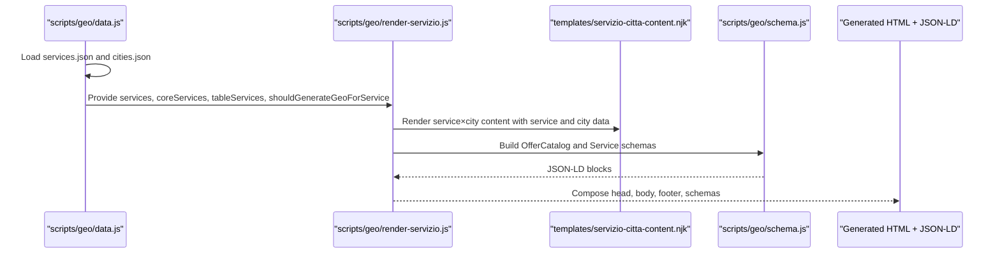
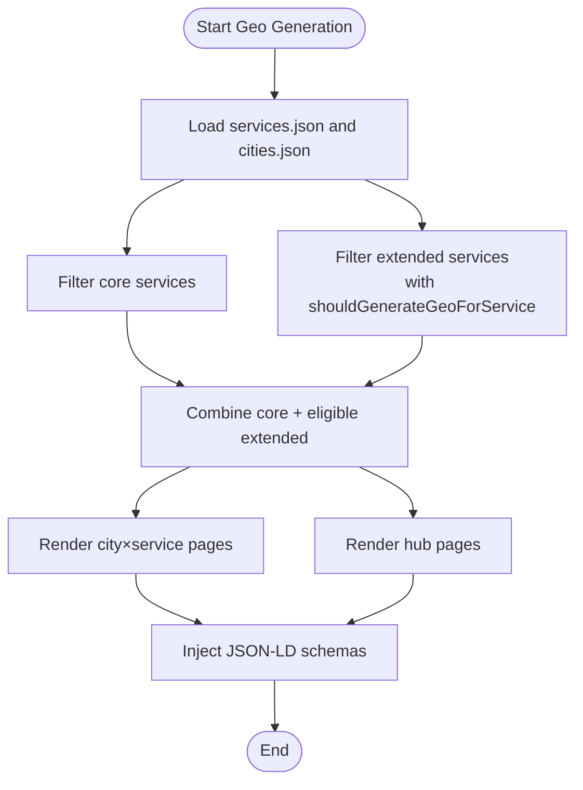
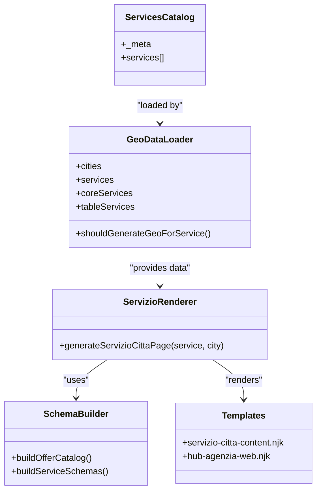

# Services Catalog Data Model

<cite>
**Referenced Files in This Document**
- [services.json](file://data/services.json)
- [data.js](file://scripts/geo/data.js)
- [render-servizio.js](file://scripts/geo/render-servizio.js)
- [schema.js](file://scripts/geo/schema.js)
- [validate.js](file://scripts/geo/validate.js)
- [config.js](file://scripts/geo/config.js)
- [manifest.json](file://data/geo-editorial/manifest.json)
- [cities.json](file://data/cities.json)
- [servizio-citta-content.njk](file://templates/servizio-citta-content.njk)
- [hub-agenzia-web.njk](file://templates/hub-agenzia-web.njk)
- [pseo-governance-regressions.test.js](file://tests/pseo-governance-regressions.test.js)
- [entity-claim-corpus-regressions.test.js](file://tests/entity-claim-corpus-regressions.test.js)
</cite>

## Table of Contents
1. [Introduction](#introduction)
2. [Project Structure](#project-structure)
3. [Core Components](#core-components)
4. [Architecture Overview](#architecture-overview)
5. [Detailed Component Analysis](#detailed-component-analysis)
6. [Dependency Analysis](#dependency-analysis)
7. [Performance Considerations](#performance-considerations)
8. [Troubleshooting Guide](#troubleshooting-guide)
9. [Conclusion](#conclusion)
10. [Appendices](#appendices)

## Introduction
This document explains the WebNovis services catalog data model used to generate geo-targeted pages and service hubs. It details the JSON schema for each service, including metadata, pricing, SEO fields, tier classification, page generation behavior, time estimates, and description contexts. It also documents how services are filtered by tier for different page types, their relationship with the geo-page generation system, validation rules, and guidance for adding new services consistently.

## Project Structure
The services catalog is defined as a JSON dataset and consumed by the geo generator pipeline that produces city×service pages and hub pages. Key files:
- data/services.json defines the canonical catalog of services.
- scripts/geo/data.js loads and filters services (core vs extended), builds price formatting, and exposes helpers for rendering.
- scripts/geo/render-servizio.js generates per-city service pages using Nunjucks templates.
- scripts/geo/schema.js emits Schema.org markup referencing services and offers.
- templates/servizio-citta-content.njk renders the service×city content and tables.
- templates/hub-agenzia-web.njk renders hub pages listing core services.
- tests enforce governance and consistency of prices and schemas.

**Diagram sources**
- [services.json:1-307](file://data/services.json#L1-L307)
- [data.js:15-60](file://scripts/geo/data.js#L15-L60)
- [render-servizio.js:1-60](file://scripts/geo/render-servizio.js#L1-L60)
- [schema.js:142-177](file://scripts/geo/schema.js#L142-L177)
- [servizio-citta-content.njk:299-311](file://templates/servizio-citta-content.njk#L299-L311)
- [hub-agenzia-web.njk:107-132](file://templates/hub-agenzia-web.njk#L107-L132)
- [cities.json:1-50](file://data/cities.json#L1-L50)
- [manifest.json:1-451](file://data/geo-editorial/manifest.json#L1-L451)

**Section sources**
- [services.json:1-307](file://data/services.json#L1-L307)
- [data.js:15-60](file://scripts/geo/data.js#L15-L60)
- [render-servizio.js:1-60](file://scripts/geo/render-servizio.js#L1-L60)
- [schema.js:142-177](file://scripts/geo/schema.js#L142-L177)
- [servizio-citta-content.njk:299-311](file://templates/servizio-citta-content.njk#L299-L311)
- [hub-agenzia-web.njk:107-132](file://templates/hub-agenzia-web.njk#L107-L132)
- [cities.json:1-50](file://data/cities.json#L1-L50)
- [manifest.json:1-451](file://data/geo-editorial/manifest.json#L1-L451)

## Core Components
- Service catalog definition: data/services.json contains a top-level _meta and an array of service objects. Each service object includes:
  - slug: unique identifier used in URLs and internal references.
  - name: full service name.
  - shortName: display label used across UI and links.
  - schemaType: value mapped to Schema.org types (e.g., WebSite, WebApplication, Service, MobileApplication).
  - url: canonical URL path to the service’s static or hub page.
  - hasPage: boolean indicating whether a dedicated static page exists at /servizi/{slug}.html; false means pSEO-only (generated per city).
  - tier: “core” or “extended”. Core services appear in all relevant pages; extended services appear only where allowed by geo generation rules.
  - priceFrom: numeric starting price.
  - priceCurrency: currency code (EUR).
  - priceUnit: optional unit suffix (e.g., “/mese”) for recurring pricing.
  - timeEstimate: human-readable estimate string for project timelines.
  - description: long-form description for general context.
  - shortDesc: concise summary used in listings and cards.
  - targetKeyword: primary SEO keyword for the service.
  - idealFor: intended audience or use-case.
  - Optional flags:
    - generateGeoPages: legacy flag to opt out of geo generation when false.
    - skipGeoGeneration: explicit opt-out for deprecated clusters.
    - canonicalServiceSlug: used to map deprecated slugs to canonical ones.
    - deprecationNote: notes for deprecated entries.

- Geo filtering and usage:
  - Core services are always included in hub and city×service lists.
  - Extended services are included only if shouldGenerateGeoForService returns true (i.e., not skipped and not explicitly disabled).
  - hasPage determines whether the service has a static page or relies on generated geo pages.

**Section sources**
- [services.json:1-307](file://data/services.json#L1-L307)
- [data.js:15-60](file://scripts/geo/data.js#L15-L60)
- [render-servizio.js:60-90](file://scripts/geo/render-servizio.js#L60-L90)

## Architecture Overview
The geo-generation pipeline reads services.json and cities.json, filters services by tier and geo eligibility, and renders per-city pages via Nunjucks templates. Schema.org markup is injected into generated pages. Hub pages list core services. Tests ensure schema integrity and price consistency.

**Diagram sources**
- [data.js:15-60](file://scripts/geo/data.js#L15-L60)
- [render-servizio.js:1-60](file://scripts/geo/render-servizio.js#L1-L60)
- [schema.js:142-177](file://scripts/geo/schema.js#L142-L177)
- [servizio-citta-content.njk:299-311](file://templates/servizio-citta-content.njk#L299-L311)

## Detailed Component Analysis

### Service Data Model (JSON Schema)
- Top-level structure:
  - _meta: metadata about the catalog (description, version, lastUpdated, notes).
  - services: array of service objects.

- Required fields per service:
  - slug, name, shortName, schemaType, url, hasPage, tier, priceFrom, priceCurrency, timeEstimate, description, shortDesc, targetKeyword, idealFor.

- Optional fields:
  - priceUnit (string like “/mese”).
  - generateGeoPages (boolean; legacy).
  - skipGeoGeneration (boolean; explicit opt-out).
  - canonicalServiceSlug (string; mapping for deprecated slugs).
  - deprecationNote (string; documentation note).

- Validation rules enforced by the pipeline:
  - priceFrom must be a finite number; otherwise, formatting throws an error.
  - hasPage controls whether a static page exists or geo pages are generated.
  - tier determines inclusion in hub pages and geo lists.
  - skipGeoGeneration or generateGeoPages=false excludes a service from geo generation.

- Examples of service definitions:
  - Core services with hasPage=true include “sito-vetrina”, “ecommerce”, “landing-page”, “graphic-design”, “social-media”, “accessibilita”, “consulenze”.
  - Extended services with hasPage=false include “seo-locale”, “restyling-sito-web”, “web-app”, “fotografia-aziendale”, “copywriting”, “email-marketing”, “google-ads”, “consulenza-digitale”, “manutenzione-sito”, “sviluppo-app-mobile”, “automazione-business”.

- Pricing examples:
  - One-time projects: priceFrom set without priceUnit (e.g., €1200 for “sito-vetrina”).
  - Recurring services: priceUnit set to “/mese” (e.g., “social-media”, “seo-locale”, “email-marketing”, “google-ads”, “manutenzione-sito”).

- Time estimates:
  - Ranges expressed as strings (e.g., “2-3 settimane”, “Continuativo”, “3-6 mesi per risultati”).

- SEO fields:
  - targetKeyword: primary keyword for search intent.
  - idealFor: intended audience/use-case.

- Page generation behavior:
  - hasPage=true: static page at /servizi/{slug}.html exists; geo pages may still be generated for city targeting.
  - hasPage=false: no static page; geo pages are the primary source for city-specific content.

**Section sources**
- [services.json:1-307](file://data/services.json#L1-L307)
- [data.js:34-45](file://scripts/geo/data.js#L34-L45)
- [render-servizio.js:60-90](file://scripts/geo/render-servizio.js#L60-L90)

### Tier Classification System (Core vs Extended)
- Core services:
  - Always included in hub pages and city×service listings.
  - Used to populate tableServices and offer catalogs.

- Extended services:
  - Included only if shouldGenerateGeoForService returns true.
  - Commonly used for specialized or ongoing services (SEO, ads, maintenance).

- Filtering logic:
  - coreServices = services.filter(s => s.tier === 'core').
  - tableServices includes core services plus eligible extended services.
  - shouldGenerateGeoForService checks skipGeoGeneration and generateGeoPages flags.

**Section sources**
- [data.js:19-21](file://scripts/geo/data.js#L19-L21)
- [data.js:47-60](file://scripts/geo/data.js#L47-L60)
- [render-servizio.js:60-90](file://scripts/geo/render-servizio.js#L60-L90)

### hasPage Property and Static vs Dynamic Pages
- hasPage=true indicates a static page exists at /servizi/{slug}.html.
- hasPage=false indicates pSEO-only service; geo pages are generated per city.
- The renderer uses this to determine primary URL and labels for navigation and linking.

**Section sources**
- [services.json:1-307](file://data/services.json#L1-L307)
- [data.js:140-148](file://scripts/geo/data.js#L140-L148)
- [render-servizio.js:1-60](file://scripts/geo/render-servizio.js#L1-L60)

### TimeEstimate Field for Project Timelines
- Human-readable string describing expected duration.
- Used in templates to inform users about timelines.
- Examples: “2-3 settimane”, “Continuativo”, “3-6 mesi per risultati”.

**Section sources**
- [services.json:1-307](file://data/services.json#L1-L307)
- [servizio-citta-content.njk:84-92](file://templates/servizio-citta-content.njk#L84-L92)

### Description Fields for Different Content Contexts
- description: long-form description for general context.
- shortDesc: concise summary used in listings and cards.
- idealFor: intended audience or use-case.
- targetKeyword: primary SEO keyword.

**Section sources**
- [services.json:1-307](file://data/services.json#L1-L307)
- [servizio-citta-content.njk:84-92](file://templates/servizio-citta-content.njk#L84-L92)

### Relationships with Geo-Page Generation System
- City×service pages are generated for eligible services and cities.
- Eligibility determined by shouldGenerateGeoForService.
- Generated pages include Schema.org Service and Offer markup referencing the canonical service URL and price.
- Hub pages list core services with prices and time estimates.

**Diagram sources**
- [data.js:15-60](file://scripts/geo/data.js#L15-L60)
- [render-servizio.js:1-60](file://scripts/geo/render-servizio.js#L1-L60)
- [schema.js:142-177](file://scripts/geo/schema.js#L142-L177)

**Section sources**
- [data.js:15-60](file://scripts/geo/data.js#L15-L60)
- [render-servizio.js:1-60](file://scripts/geo/render-servizio.js#L1-L60)
- [schema.js:142-177](file://scripts/geo/schema.js#L142-L177)

### Concrete Examples of Service Definitions
- Example core service: “sito-vetrina”
  - hasPage=true, tier=core, priceFrom=1200, priceCurrency=EUR, timeEstimate="2-3 settimane".
- Example extended service: “seo-locale”
  - hasPage=false, tier=extended, priceFrom=400, priceUnit="/mese", timeEstimate="3-6 mesi per risultati".
- Example recurring service: “social-media”
  - hasPage=true, tier=core, priceFrom=300, priceUnit="/mese", timeEstimate="Continuativo".

**Section sources**
- [services.json:1-307](file://data/services.json#L1-L307)

### Validation Rules for Required Fields
- priceFrom must be a finite number; otherwise, formatting throws an error.
- hasPage must be a boolean.
- tier must be one of “core” or “extended”.
- skipGeoGeneration or generateGeoPages=false excludes a service from geo generation.
- Canonical service URL must exist for services with hasPage=true.

**Section sources**
- [data.js:34-45](file://scripts/geo/data.js#L34-L45)
- [render-servizio.js:1-60](file://scripts/geo/render-servizio.js#L1-L60)

### How Services Are Filtered by Tier for Different Page Types
- Hub pages (templates/hub-agenzia-web.njk) list core services only.
- City×service pages (templates/servizio-citta-content.njk) list core services and eligible extended services based on shouldGenerateGeoForService.
- tableServices combines core and eligible extended services for consistent rendering.

**Section sources**
- [data.js:19-21](file://scripts/geo/data.js#L19-L21)
- [data.js:58-60](file://scripts/geo/data.js#L58-L60)
- [hub-agenzia-web.njk:107-132](file://templates/hub-agenzia-web.njk#L107-L132)
- [servizio-citta-content.njk:299-311](file://templates/servizio-citta-content.njk#L299-L311)

### Guidance on Adding New Services to the Catalog
- Add a new service object to data/services.json with all required fields.
- Choose appropriate tier (“core” or “extended”).
- Set hasPage=true if a static page exists at /servizi/{slug}.html; otherwise, false for pSEO-only.
- Include priceFrom and priceCurrency; add priceUnit for recurring pricing.
- Provide timeEstimate, description, shortDesc, targetKeyword, idealFor.
- If the service should not participate in geo generation, set skipGeoGeneration=true or generateGeoPages=false.
- Ensure schemaType matches the intended Schema.org type.
- Validate that the service URL is correct and accessible.
- Run geo generation and tests to confirm integration and schema correctness.

**Section sources**
- [services.json:1-307](file://data/services.json#L1-L307)
- [data.js:15-60](file://scripts/geo/data.js#L15-L60)
- [render-servizio.js:1-60](file://scripts/geo/render-servizio.js#L1-L60)
- [schema.js:142-177](file://scripts/geo/schema.js#L142-L177)

## Dependency Analysis
- data/services.json is the single source of truth for service metadata and pricing.
- scripts/geo/data.js consumes services.json and provides filtered lists and helpers.
- scripts/geo/render-servizio.js uses data.js to render city×service pages and inject schemas.
- scripts/geo/schema.js constructs JSON-LD structures referencing services and offers.
- templates/servizio-citta-content.njk and templates/hub-agenzia-web.njk consume data.js exports to render UI.
- tests enforce schema integrity and price consistency.

**Diagram sources**
- [services.json:1-307](file://data/services.json#L1-L307)
- [data.js:15-60](file://scripts/geo/data.js#L15-L60)
- [render-servizio.js:1-60](file://scripts/geo/render-servizio.js#L1-L60)
- [schema.js:142-177](file://scripts/geo/schema.js#L142-L177)
- [servizio-citta-content.njk:299-311](file://templates/servizio-citta-content.njk#L299-L311)
- [hub-agenzia-web.njk:107-132](file://templates/hub-agenzia-web.njk#L107-L132)

**Section sources**
- [data.js:15-60](file://scripts/geo/data.js#L15-L60)
- [render-servizio.js:1-60](file://scripts/geo/render-servizio.js#L1-L60)
- [schema.js:142-177](file://scripts/geo/schema.js#L142-L177)
- [servizio-citta-content.njk:299-311](file://templates/servizio-citta-content.njk#L299-L311)
- [hub-agenzia-web.njk:107-132](file://templates/hub-agenzia-web.njk#L107-L132)

## Performance Considerations
- Loading services.json and cities.json is lightweight; filtering operations are O(n) over the services array.
- Reusing Map lookups for serviceBySlug improves lookup performance.
- Avoid unnecessary recomputation of filtered lists; cache coreServices and tableServices during build.
- Schema injection adds minimal overhead but ensures SEO benefits.

[No sources needed since this section provides general guidance]

## Troubleshooting Guide
Common issues and resolutions:
- Missing priceFrom or non-finite value: formatServicePrice throws an error; ensure priceFrom is a valid number.
- Incorrect hasPage value: leads to broken links or missing static pages; verify URL paths.
- Tier misclassification: core vs extended affects visibility; review tier assignment.
- Geo generation opt-out: skipGeoGeneration or generateGeoPages=false prevents city×service pages; remove flags if desired.
- Schema validation failures: ensure service URLs exist and provider IDs match canonical values; run regression tests.

**Section sources**
- [data.js:34-45](file://scripts/geo/data.js#L34-L45)
- [render-servizio.js:1-60](file://scripts/geo/render-servizio.js#L1-L60)
- [pseo-governance-regressions.test.js:340-362](file://tests/pseo-governance-regressions.test.js#L340-L362)
- [entity-claim-corpus-regressions.test.js:144-153](file://tests/entity-claim-corpus-regressions.test.js#L144-L153)

## Conclusion
The WebNovis services catalog data model provides a robust foundation for generating geo-targeted pages and service hubs. By defining clear metadata, pricing, SEO fields, and tier classifications, the system ensures consistent rendering, accurate Schema.org markup, and flexible filtering for different page types. Following the validation rules and guidance for adding new services maintains catalog integrity and supports scalable growth.

[No sources needed since this section summarizes without analyzing specific files]

## Appendices

### Appendix A: Service Fields Reference
- slug: unique identifier.
- name: full service name.
- shortName: display label.
- schemaType: Schema.org type.
- url: canonical URL path.
- hasPage: boolean for static page existence.
- tier: “core” or “extended”.
- priceFrom: numeric starting price.
- priceCurrency: currency code.
- priceUnit: optional unit suffix.
- timeEstimate: human-readable timeline.
- description: long-form description.
- shortDesc: concise summary.
- targetKeyword: primary SEO keyword.
- idealFor: intended audience/use-case.
- Optional: generateGeoPages, skipGeoGeneration, canonicalServiceSlug, deprecationNote.

**Section sources**
- [services.json:1-307](file://data/services.json#L1-L307)

### Appendix B: Geo-Editorial Manifest
- The manifest tracks editorial records and tiers for geo pages, ensuring governance and indexation policies.

**Section sources**
- [manifest.json:1-451](file://data/geo-editorial/manifest.json#L1-L451)