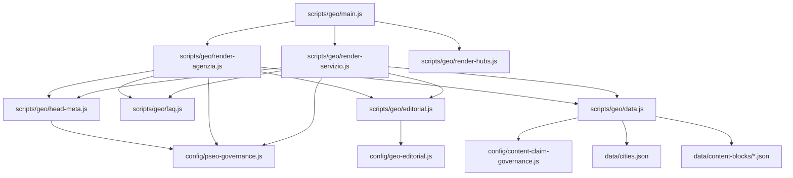
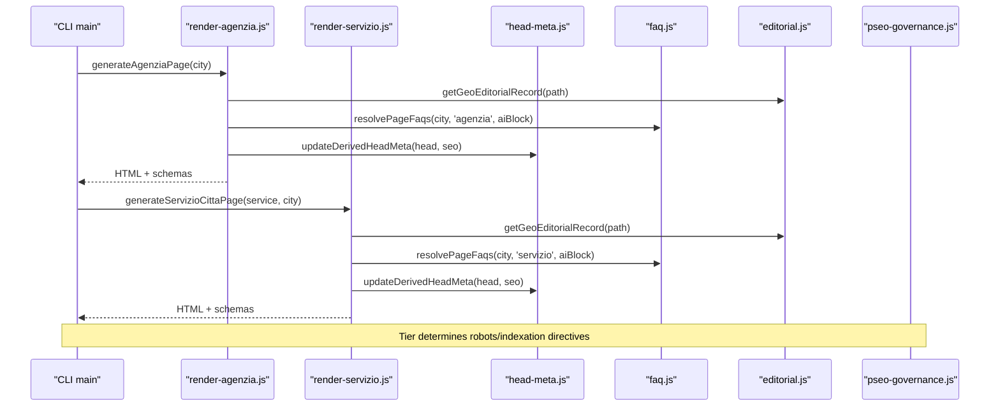
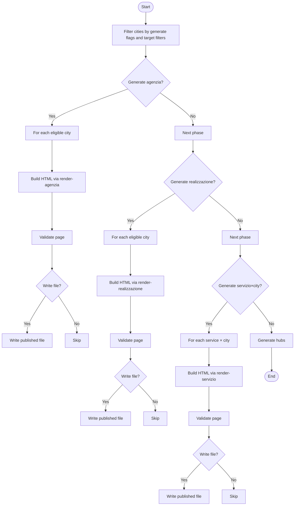
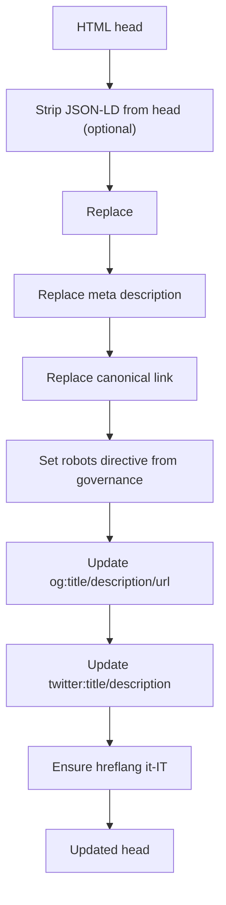
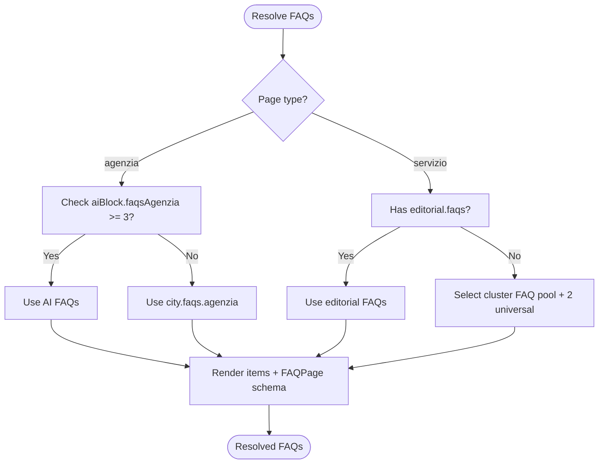
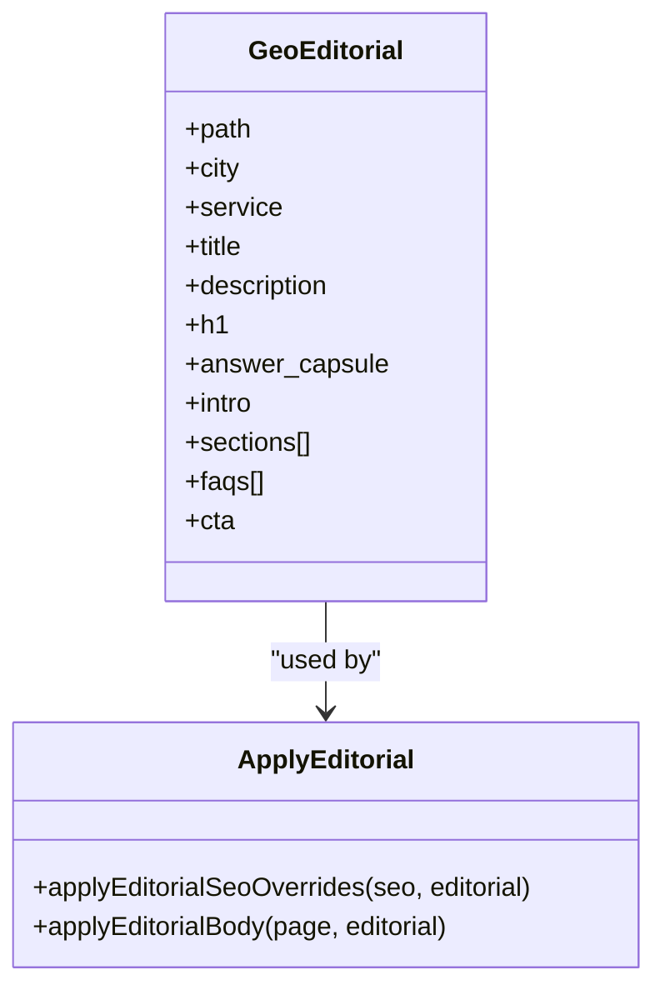
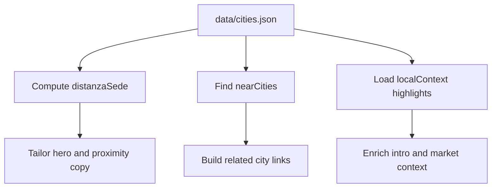
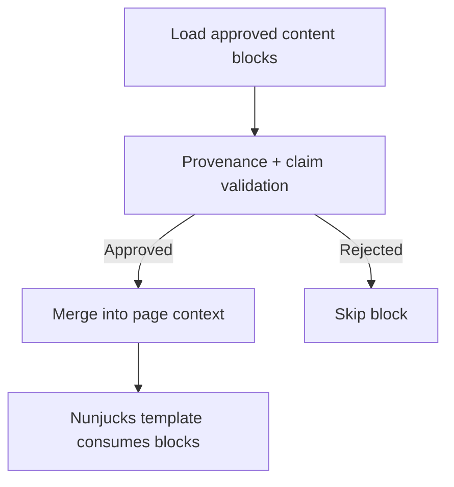
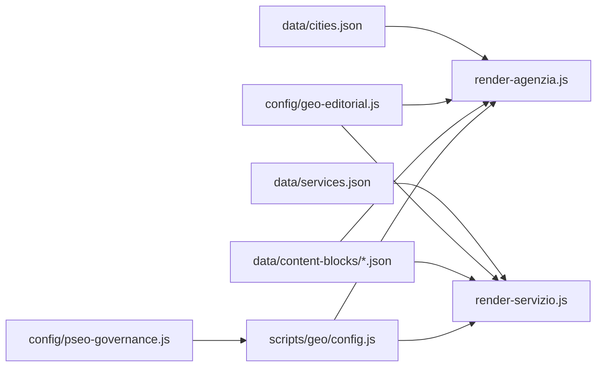

# Content Personalization & Localization

<cite>
**Referenced Files in This Document**
- [scripts/geo/main.js](file://scripts/geo/main.js)
- [scripts/geo/config.js](file://scripts/geo/config.js)
- [scripts/geo/data.js](file://scripts/geo/data.js)
- [scripts/geo/head-meta.js](file://scripts/geo/head-meta.js)
- [scripts/geo/faq.js](file://scripts/geo/faq.js)
- [scripts/geo/editorial.js](file://scripts/geo/editorial.js)
- [scripts/geo/render-agenzia.js](file://scripts/geo/render-agenzia.js)
- [scripts/geo/render-servizio.js](file://scripts/geo/render-servizio.js)
- [config/pseo-governance.js](file://config/pseo-governance.js)
- [config/content-claim-governance.js](file://config/content-claim-governance.js)
- [data/cities.json](file://data/cities.json)
- [data/content-blocks/milano.json](file://data/content-blocks/milano.json)
- [templates/agenzia-web-content.njk](file://templates/agenzia-web-content.njk)
- [templates/servizio-citta-content.njk](file://templates/servizio-citta-content.njk)
</cite>

## Table of Contents
1. [Introduction](#introduction)
2. [Project Structure](#project-structure)
3. [Core Components](#core-components)
4. [Architecture Overview](#architecture-overview)
5. [Detailed Component Analysis](#detailed-component-analysis)
6. [Dependency Analysis](#dependency-analysis)
7. [Performance Considerations](#performance-considerations)
8. [Troubleshooting Guide](#troubleshooting-guide)
9. [Conclusion](#conclusion)
10. [Appendices](#appendices)

## Introduction
This document explains the content personalization and localization system that generates geo-targeted pages for a web agency. It covers how location-specific requirements are applied, how meta tags are generated, how FAQs are resolved and rendered, and how editorial content is managed. It also documents local business information handling, regional preferences, cultural adaptations, and the modular content block system used to vary content per geographic area. Finally, it provides guidance on adding new content blocks, configuring regional variations, and maintaining consistency across generated pages.

## Project Structure
The system is orchestrated by a Node-based generator that composes city and service data with templates, editorial records, approved AI content blocks, and governance rules to produce localized HTML pages. Key directories:
- scripts/geo: orchestration, rendering, metadata, FAQ resolution, editorial overrides, and validation utilities
- config: pSEO governance (indexability tiers), claim governance (approved content blocks), build-time constants
- data: cities, services, editorial corpus, and approved content blocks
- templates: Nunjucks templates for page bodies and hubs

**Diagram sources**
- [scripts/geo/main.js:38-225](file://scripts/geo/main.js#L38-L225)
- [scripts/geo/render-agenzia.js:34-188](file://scripts/geo/render-agenzia.js#L34-L188)
- [scripts/geo/render-servizio.js:36-283](file://scripts/geo/render-servizio.js#L36-L283)
- [scripts/geo/head-meta.js:123-145](file://scripts/geo/head-meta.js#L123-L145)
- [scripts/geo/faq.js:6-75](file://scripts/geo/faq.js#L6-L75)
- [scripts/geo/editorial.js:14-56](file://scripts/geo/editorial.js#L14-L56)
- [scripts/geo/data.js:15-98](file://scripts/geo/data.js#L15-L98)
- [config/pseo-governance.js:42-153](file://config/pseo-governance.js#L42-L153)
- [config/content-claim-governance.js:85-107](file://config/content-claim-governance.js#L85-L107)

**Section sources**
- [scripts/geo/main.js:38-225](file://scripts/geo/main.js#L38-L225)
- [scripts/geo/config.js:16-78](file://scripts/geo/config.js#L16-L78)
- [scripts/geo/data.js:15-98](file://scripts/geo/data.js#L15-L98)

## Core Components
- Geo generator orchestrator: drives generation of agenzia, realizzazione, servizio×città, and hub pages; applies validation and writes outputs.
- Meta tag system: rewrites title, description, canonical, robots, Open Graph, Twitter cards, and hreflang based on page context.
- FAQ resolution: selects handcrafted or AI-generated FAQs per page type, renders visible items, and emits FAQPage schema.
- Editorial management: loads curated per-city/service copy, validates claims, and injects localized sections into pages.
- Content blocks: approved, per-city JSON modules providing market analysis, competitive context, and FAQs to personalize content.
- Governance: tiered indexability controls ensure only strategic pages are indexed while others remain noindex/follow.

**Section sources**
- [scripts/geo/main.js:38-225](file://scripts/geo/main.js#L38-L225)
- [scripts/geo/head-meta.js:123-145](file://scripts/geo/head-meta.js#L123-L145)
- [scripts/geo/faq.js:6-75](file://scripts/geo/faq.js#L6-L75)
- [scripts/geo/editorial.js:14-56](file://scripts/geo/editorial.js#L14-L56)
- [scripts/geo/data.js:91-98](file://scripts/geo/data.js#L91-L98)
- [config/pseo-governance.js:42-153](file://config/pseo-governance.js#L42-L153)

## Architecture Overview
The generator composes pages from a base template, enriches them with city/service data, applies editorial overrides, resolves FAQs, updates head metadata, and attaches structured data. Indexability is enforced via governance tiers.

**Diagram sources**
- [scripts/geo/main.js:70-225](file://scripts/geo/main.js#L70-L225)
- [scripts/geo/render-agenzia.js:34-188](file://scripts/geo/render-agenzia.js#L34-L188)
- [scripts/geo/render-servizio.js:36-283](file://scripts/geo/render-servizio.js#L36-L283)
- [scripts/geo/head-meta.js:123-145](file://scripts/geo/head-meta.js#L123-L145)
- [scripts/geo/faq.js:6-75](file://scripts/geo/faq.js#L6-L75)
- [scripts/geo/editorial.js:14-56](file://scripts/geo/editorial.js#L14-L56)
- [scripts/geo/config.js:62-78](file://scripts/geo/config.js#L62-L78)
- [config/pseo-governance.js:279-287](file://config/pseo-governance.js#L279-L287)

## Detailed Component Analysis

### Geo Page Orchestration
- Generates three primary page types plus hubs:
  - Agenzia per city
  - Realizzazione per city
  - Servizio×city combinatorial matrix
- Applies validation before writing files; tracks expected vs actual counts; persists date indexes and link graphs.

**Diagram sources**
- [scripts/geo/main.js:70-225](file://scripts/geo/main.js#L70-L225)

**Section sources**
- [scripts/geo/main.js:38-225](file://scripts/geo/main.js#L38-L225)

### Meta Tag Generation System
- Rewrites title, description, canonical, robots, Open Graph, Twitter cards, and ensures self-referencing hreflang.
- Strips JSON-LD from head when needed and rebuilds derived head metadata using page context.
- For hand-crafted Rho agenzia page, normalizes embedded content and replaces FAQPage schema with resolved FAQs.

**Diagram sources**
- [scripts/geo/head-meta.js:18-145](file://scripts/geo/head-meta.js#L18-L145)
- [scripts/geo/config.js:76-78](file://scripts/geo/config.js#L76-L78)

**Section sources**
- [scripts/geo/head-meta.js:18-145](file://scripts/geo/head-meta.js#L18-L145)
- [scripts/geo/config.js:76-78](file://scripts/geo/config.js#L76-L78)

### FAQ Resolution Logic
- Resolves FAQs per page type:
  - Agenzia: prefers AI-generated faqsAgenzia if sufficient; otherwise falls back to city-level FAQs.
  - Servizio×city: uses editorial FAQs when present; otherwise builds cluster-specific pools with two universal FAQs.
- Renders visible FAQ items and rebuilds FAQPage schema for structured data.

**Diagram sources**
- [scripts/geo/faq.js:6-75](file://scripts/geo/faq.js#L6-L75)
- [scripts/geo/render-servizio.js:96-132](file://scripts/geo/render-servizio.js#L96-L132)

**Section sources**
- [scripts/geo/faq.js:6-75](file://scripts/geo/faq.js#L6-L75)
- [scripts/geo/render-servizio.js:96-132](file://scripts/geo/render-servizio.js#L96-L132)

### Editorial Content Management
- Loads curated per-path editorial records (title, description, h1, answer capsule, intro, sections, FAQs, CTA).
- Validates records against strict schema and governance constraints (no unsupported claims, prices must match catalogue, headquarters qualification).
- Injects localized body section replacing the first shared section to ensure unique, place-specific content.

**Diagram sources**
- [config/geo-editorial.js:18-30](file://config/geo-editorial.js#L18-L30)
- [scripts/geo/editorial.js:14-56](file://scripts/geo/editorial.js#L14-L56)

**Section sources**
- [config/geo-editorial.js:18-30](file://config/geo-editorial.js#L18-L30)
- [scripts/geo/editorial.js:14-56](file://scripts/geo/editorial.js#L14-L56)
- [config/content-claim-governance.js:85-107](file://config/content-claim-governance.js#L85-L107)

### Local Business Information and Regional Preferences
- City data includes coordinates, province, distance to headquarters, nearby cities, and local context highlights.
- Pages compute nearest cities, display distances, and tailor messaging based on whether the city is the headquarters or an area served.
- Province and region modifiers adjust search phrasing and cultural references.

**Diagram sources**
- [data/cities.json:1-115](file://data/cities.json#L1-L115)
- [scripts/geo/render-agenzia.js:46-63](file://scripts/geo/render-agenzia.js#L46-L63)
- [scripts/geo/data.js:70-89](file://scripts/geo/data.js#L70-L89)

**Section sources**
- [data/cities.json:1-115](file://data/cities.json#L1-L115)
- [scripts/geo/render-agenzia.js:46-63](file://scripts/geo/render-agenzia.js#L46-L63)
- [scripts/geo/data.js:70-89](file://scripts/geo/data.js#L70-L89)

### Cultural Adaptations and Language
- All generated pages set Italian language metadata and include hreflang it-IT.
- Copy and pricing use Italian locale formatting and currency conventions.
- Editorial records enforce Italian phrasing and avoid unsupported performance/rating claims.

**Section sources**
- [scripts/geo/head-meta.js:112-121](file://scripts/geo/head-meta.js#L112-L121)
- [scripts/geo/data.js:119-119](file://scripts/geo/data.js#L119-L119)
- [config/geo-editorial.js:89-95](file://config/geo-editorial.js#L89-L95)

### Content Block System
- Approved content blocks live under data/content-blocks and provide:
  - Local market analysis
  - Competitive context
  - City-specific FAQs
  - Unique data points
- Blocks are loaded only when they pass provenance and claim checks; Tier 1 overrides can be applied selectively for high-value pages.

**Diagram sources**
- [scripts/geo/data.js:91-98](file://scripts/geo/data.js#L91-L98)
- [config/content-claim-governance.js:85-107](file://config/content-claim-governance.js#L85-L107)
- [scripts/geo/render-agenzia.js:69-77](file://scripts/geo/render-agenzia.js#L69-L77)
- [scripts/geo/render-servizio.js:149-155](file://scripts/geo/render-servizio.js#L149-L155)

**Section sources**
- [scripts/geo/data.js:91-98](file://scripts/geo/data.js#L91-L98)
- [config/content-claim-governance.js:85-107](file://config/content-claim-governance.js#L85-L107)
- [data/content-blocks/milano.json:1-64](file://data/content-blocks/milano.json#L1-L64)

### Templates and Rendering
- Nunjucks templates define reusable page bodies for agenzia and servizio×city pages.
- Data passed to templates includes city, service, SEO copy, FAQs, related pages, and optional Tier 1 content.

**Section sources**
- [scripts/geo/render-agenzia.js:146-148](file://scripts/geo/render-agenzia.js#L146-L148)
- [scripts/geo/render-servizio.js:192-192](file://scripts/geo/render-servizio.js#L192-L192)
- [templates/agenzia-web-content.njk](file://templates/agenzia-web-content.njk)
- [templates/servizio-citta-content.njk](file://templates/servizio-citta-content.njk)

## Dependency Analysis
- The generator depends on:
  - City and service catalogs for data-driven personalization
  - Editorial corpus for curated copy and FAQs
  - Approved content blocks for AI-enriched segments
  - Governance for indexability and robots directives
  - Templates for consistent structure

**Diagram sources**
- [scripts/geo/render-agenzia.js:15-32](file://scripts/geo/render-agenzia.js#L15-L32)
- [scripts/geo/render-servizio.js:17-34](file://scripts/geo/render-servizio.js#L17-L34)
- [scripts/geo/config.js:6-14](file://scripts/geo/config.js#L6-L14)
- [config/pseo-governance.js:42-153](file://config/pseo-governance.js#L42-L153)

**Section sources**
- [scripts/geo/render-agenzia.js:15-32](file://scripts/geo/render-agenzia.js#L15-L32)
- [scripts/geo/render-servizio.js:17-34](file://scripts/geo/render-servizio.js#L17-L34)
- [scripts/geo/config.js:6-14](file://scripts/geo/config.js#L6-L14)

## Performance Considerations
- Avoid heavy DOM manipulation in templates; rely on server-side composition.
- Limit FAQ pools to necessary items per cluster to keep HTML size manageable.
- Use approved content blocks sparingly; large blocks increase payload.
- Ensure images and assets are optimized; leverage noncritical loaders where applicable.
- Keep robots directives minimal and accurate to reduce crawl waste.

[No sources needed since this section provides general guidance]

## Troubleshooting Guide
Common issues and resolutions:
- Missing base page: ensure the Rho base template exists; generators depend on it to extract head/nav/footer.
- No FAQs rendered: verify editorial FAQs exist or AI block has sufficient entries; check fallback logic.
- Duplicate or missing meta tags: confirm head rewriting functions find existing tags; validate attribute names.
- Validation failures: review blocked/failed outputs; fix issues flagged by validation (e.g., unsupported claims).
- Indexability problems: check governance tiers; ensure paths are allowed or intentionally de-amplified.

**Section sources**
- [scripts/geo/render-agenzia.js:34-39](file://scripts/geo/render-agenzia.js#L34-L39)
- [scripts/geo/faq.js:6-17](file://scripts/geo/faq.js#L6-L17)
- [scripts/geo/head-meta.js:77-145](file://scripts/geo/head-meta.js#L77-L145)
- [scripts/geo/main.js:94-101](file://scripts/geo/main.js#L94-L101)
- [config/pseo-governance.js:279-287](file://config/pseo-governance.js#L279-L287)

## Conclusion
The system delivers robust, localized pages through a layered architecture combining data-driven personalization, curated editorial content, and strict governance. Meta tags, FAQs, and structured data are consistently generated per city and service, while approved content blocks enable scalable customization. The tiered indexability strategy focuses authority on strategic pages, reducing doorway footprint and improving overall SEO health.

[No sources needed since this section summarizes without analyzing specific files]

## Appendices

### Adding New Content Blocks
Steps:
- Create a JSON file under data/content-blocks with required fields: _meta (including publicationStatus, source, verifiedAt, approvedBy), localMarketAnalysis, competitiveContext, faqs, and uniqueDataPoints.
- Ensure all claims pass governance checks; avoid unsupported guarantees or numeric outcomes.
- Reference the block in the generator flow if needed (Tier 1 overrides are read automatically when present).

**Section sources**
- [config/content-claim-governance.js:85-107](file://config/content-claim-governance.js#L85-L107)
- [data/content-blocks/milano.json:1-64](file://data/content-blocks/milano.json#L1-L64)

### Configuring Regional Variations
- Update data/cities.json to add or modify city attributes (province, nearCities, localContext).
- Adjust editorial records in config/geo-editorial.js to reflect new city/service combinations and ensure manifest integrity.
- Use governance tiers to control which pages are indexable and receive enhanced content.

**Section sources**
- [data/cities.json:1-115](file://data/cities.json#L1-L115)
- [config/geo-editorial.js:18-30](file://config/geo-editorial.js#L18-L30)
- [config/pseo-governance.js:42-153](file://config/pseo-governance.js#L42-L153)

### Maintaining Content Consistency
- Use editorial overrides to standardize titles, descriptions, and hero copy across pages.
- Enforce claim governance to prevent unsupported statements.
- Validate generated pages during build; address warnings and blocks immediately.

**Section sources**
- [scripts/geo/editorial.js:14-25](file://scripts/geo/editorial.js#L14-L25)
- [config/content-claim-governance.js:158-186](file://config/content-claim-governance.js#L158-L186)
- [scripts/geo/main.js:94-101](file://scripts/geo/main.js#L94-L101)