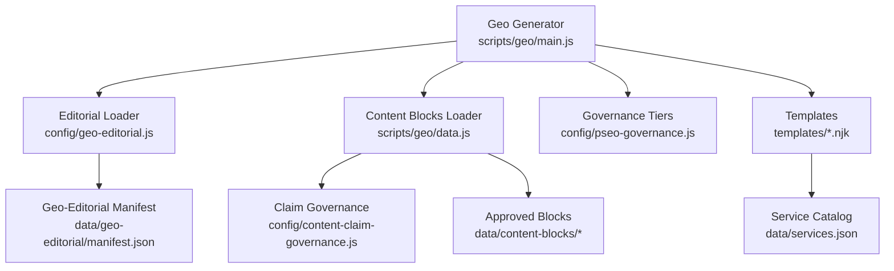
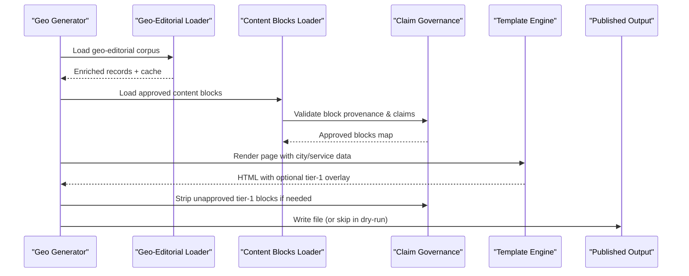
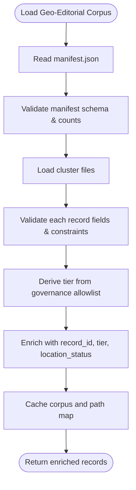
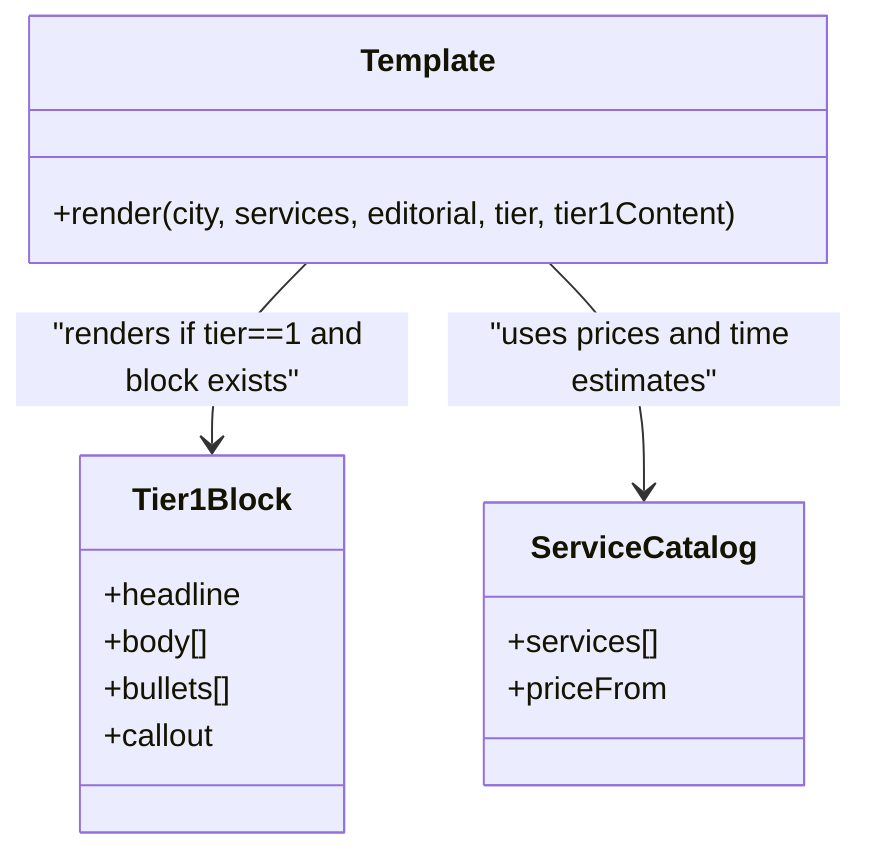
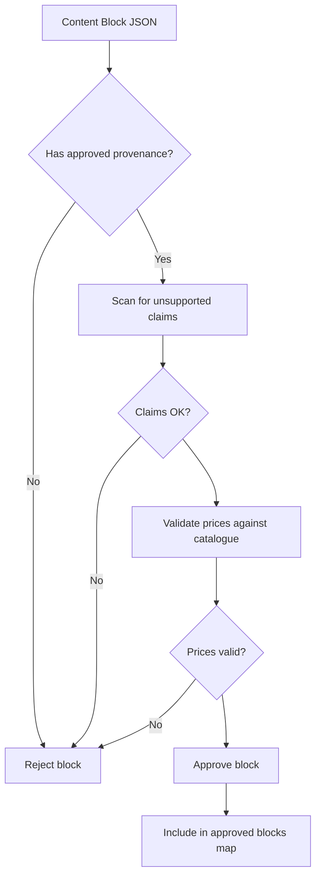
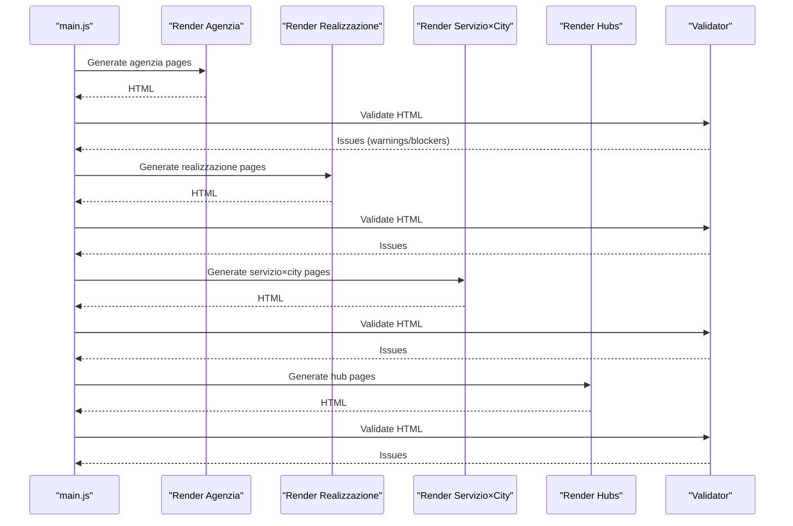
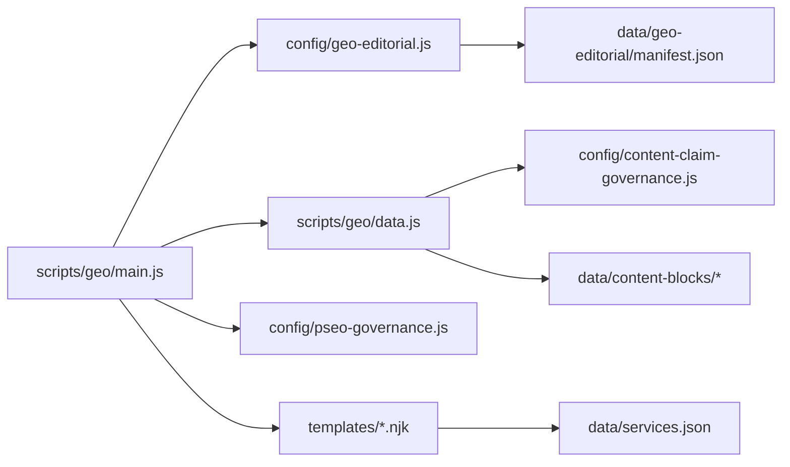

# Editorial Content Management

<cite>
**Referenced Files in This Document**
- [scripts/geo/main.js](file://scripts/geo/main.js)
- [config/geo-editorial.js](file://config/geo-editorial.js)
- [scripts/geo/editorial.js](file://scripts/geo/editorial.js)
- [data/geo-editorial/manifest.json](file://data/geo-editorial/manifest.json)
- [config/pseo-governance.js](file://config/pseo-governance.js)
- [templates/agenzia-web-content.njk](file://templates/agenzia-web-content.njk)
- [scripts/geo/data.js](file://scripts/geo/data.js)
- [config/content-claim-governance.js](file://config/content-claim-governance.js)
- [data/content-blocks/tier1-arese-agenzia-web.json](file://data/content-blocks/tier1-arese-agenzia-web.json)
- [data/services.json](file://data/services.json)
- [tests/priority-content-regressions.test.js](file://tests/priority-content-regressions.test.js)
</cite>

## Table of Contents
1. Introduction
2. Project Structure
3. Core Components
4. Architecture Overview
5. Detailed Component Analysis
6. Dependency Analysis
7. Performance Considerations
8. Troubleshooting Guide
9. Conclusion
10. Appendices

## Introduction
This document explains the editorial content management system that powers location-specific business pages, regional preferences, and cultural adaptations. It covers how modular content blocks are organized, loaded, validated, and rendered; how governance policies ensure consistency and compliance; and how tier-1 overrides provide hand-crafted editorial enhancements for priority pages. It also provides practical guidance for adding new content blocks, configuring regional variations, and maintaining quality standards through automated checks and approval workflows.

## Project Structure
The system is built around a data-driven pipeline:
- Data sources define cities, services, geo-editorial records, and approved content blocks.
- A generator orchestrates page creation across three main types: agenzia (agency), realizzazione (web development), and servizio×città (service×city).
- Governance modules enforce indexability tiers, claim rules, and publication approvals.
- Templates render structured sections with optional editorial overlays for high-priority pages.

**Diagram sources**
- [scripts/geo/main.js:38-292](file://scripts/geo/main.js#L38-L292)
- [config/geo-editorial.js:461-514](file://config/geo-editorial.js#L461-L514)
- [scripts/geo/data.js:91-98](file://scripts/geo/data.js#L91-L98)
- [config/content-claim-governance.js:85-107](file://config/content-claim-governance.js#L85-L107)
- [config/pseo-governance.js:42-146](file://config/pseo-governance.js#L42-L146)
- [templates/agenzia-web-content.njk:74-106](file://templates/agenzia-web-content.njk#L74-L106)
- [data/geo-editorial/manifest.json:1-47](file://data/geo-editorial/manifest.json#L1-L47)
- [data/services.json:1-200](file://data/services.json#L1-L200)

**Section sources**
- [scripts/geo/main.js:38-292](file://scripts/geo/main.js#L38-L292)
- [config/geo-editorial.js:461-514](file://config/geo-editorial.js#L461-L514)
- [scripts/geo/data.js:91-98](file://scripts/geo/data.js#L91-L98)
- [config/content-claim-governance.js:85-107](file://config/content-claim-governance.js#L85-L107)
- [config/pseo-governance.js:42-146](file://config/pseo-governance.js#L42-L146)
- [templates/agenzia-web-content.njk:74-106](file://templates/agenzia-web-content.njk#L74-L106)
- [data/geo-editorial/manifest.json:1-47](file://data/geo-editorial/manifest.json#L1-L47)
- [data/services.json:1-200](file://data/services.json#L1-L200)

## Core Components
- Geo generator: Orchestrates generation of agency, realization, service×city, and hub pages; validates output; writes files or runs dry-run/validation-only modes.
- Geo-editorial loader: Loads and validates a manifest-backed corpus of per-path editorial records; caches results; enriches records with tier and location status.
- Content blocks loader: Loads approved content blocks from data/content-blocks, enforcing provenance and claim rules; optionally excludes tier-1 blocks during general loading.
- Claim governance: Validates content against unsupported claims, enforces price catalog alignment, and strips unapproved tier-1 editorial blocks from published HTML.
- Governance tiers: Defines which generated GEO paths are indexable (Tier 1, Tier 2, Data-validated) and applies noindex/follow to others.
- Templates: Render structured sections with optional tier-1 editorial overlays and service catalog pricing.

**Section sources**
- [scripts/geo/main.js:38-292](file://scripts/geo/main.js#L38-L292)
- [config/geo-editorial.js:18-80](file://config/geo-editorial.js#L18-L80)
- [config/geo-editorial.js:407-514](file://config/geo-editorial.js#L407-L514)
- [scripts/geo/data.js:91-98](file://scripts/geo/data.js#L91-L98)
- [config/content-claim-governance.js:74-107](file://config/content-claim-governance.js#L74-L107)
- [config/pseo-governance.js:42-146](file://config/pseo-governance.js#L42-L146)
- [templates/agenzia-web-content.njk:74-106](file://templates/agenzia-web-content.njk#L74-L106)

## Architecture Overview
The editorial system follows a strict validation-first pipeline:
- The generator selects target cities and services based on configuration and filters.
- For each page type, it renders HTML using templates and injects editorial content where available.
- Before publishing, pages are validated; any blocking issues prevent output.
- Approved tier-1 editorial blocks are injected only when present and verified.
- Governance tiers determine indexation directives and sitemap inclusion.

**Diagram sources**
- [scripts/geo/main.js:70-225](file://scripts/geo/main.js#L70-L225)
- [config/geo-editorial.js:461-514](file://config/geo-editorial.js#L461-L514)
- [scripts/geo/data.js:91-98](file://scripts/geo/data.js#L91-L98)
- [config/content-claim-governance.js:85-107](file://config/content-claim-governance.js#L85-L107)
- [templates/agenzia-web-content.njk:74-106](file://templates/agenzia-web-content.njk#L74-L106)

## Detailed Component Analysis

### Geo Editor and Body Injection
- The geo-editorial module loads a manifest-backed corpus of editorial records, validates structure, and enriches each record with tier and location status.
- It exposes helpers to apply editorial SEO overrides and replace the first shared “why you need a website” section with hand-written local context.
- Records must match governance allowlists and include required fields; violations fail the build.

**Diagram sources**
- [config/geo-editorial.js:215-312](file://config/geo-editorial.js#L215-L312)
- [config/geo-editorial.js:339-459](file://config/geo-editorial.js#L339-L459)
- [config/geo-editorial.js:461-514](file://config/geo-editorial.js#L461-L514)

**Section sources**
- [config/geo-editorial.js:18-80](file://config/geo-editorial.js#L18-L80)
- [config/geo-editorial.js:215-312](file://config/geo-editorial.js#L215-L312)
- [config/geo-editorial.js:339-459](file://config/geo-editorial.js#L339-L459)
- [config/geo-editorial.js:461-514](file://config/geo-editorial.js#L461-L514)
- [scripts/geo/editorial.js:13-56](file://scripts/geo/editorial.js#L13-L56)

### Tier-1 Overrides and Template Rendering
- Tier-1 pages receive an additional editorial section between local context and services grid.
- The template conditionally renders tier-1 content when both the page tier is 1 and a verified override exists.
- Prices and service listings come from the canonical service catalog to maintain consistency.

**Diagram sources**
- [templates/agenzia-web-content.njk:74-106](file://templates/agenzia-web-content.njk#L74-L106)
- [templates/agenzia-web-content.njk:108-182](file://templates/agenzia-web-content.njk#L108-L182)
- [data/services.json:1-200](file://data/services.json#L1-L200)
- [data/content-blocks/tier1-arese-agenzia-web.json:1-34](file://data/content-blocks/tier1-arese-agenzia-web.json#L1-L34)

**Section sources**
- [templates/agenzia-web-content.njk:74-106](file://templates/agenzia-web-content.njk#L74-L106)
- [templates/agenzia-web-content.njk:108-182](file://templates/agenzia-web-content.njk#L108-L182)
- [data/content-blocks/tier1-arese-agenzia-web.json:1-34](file://data/content-blocks/tier1-arese-agenzia-web.json#L1-L34)
- [data/services.json:1-200](file://data/services.json#L1-L200)

### Approval Workflow and Claim Governance
- Content blocks require explicit provenance: publicationStatus must be approved, source must be valid HTTP URLs, verifiedAt must be a date, and approvedBy must be set.
- Generated and published claims are scanned against disallowed patterns (e.g., guarantees, rankings, fixed delivery promises).
- Prices quoted in copy must exist in the service catalogue; otherwise validation fails.
- Unapproved legacy tier-1 editorial blocks are stripped from published HTML unless explicitly whitelisted.

**Diagram sources**
- [config/content-claim-governance.js:74-107](file://config/content-claim-governance.js#L74-L107)
- [config/content-claim-governance.js:127-186](file://config/content-claim-governance.js#L127-L186)
- [config/geo-editorial.js:97-118](file://config/geo-editorial.js#L97-L118)
- [tests/priority-content-regressions.test.js:18-107](file://tests/priority-content-regressions.test.js#L18-L107)

**Section sources**
- [config/content-claim-governance.js:74-107](file://config/content-claim-governance.js#L74-L107)
- [config/content-claim-governance.js:127-186](file://config/content-claim-governance.js#L127-L186)
- [config/geo-editorial.js:97-118](file://config/geo-editorial.js#L97-L118)
- [tests/priority-content-regressions.test.js:18-107](file://tests/priority-content-regressions.test.js#L18-L107)

### Indexability and Page Types
- The generator produces three primary page types plus hubs:
  - Agenzia (agency) pages per city
  - Realizzazione (web development) pages per city
  - Servizio×Città (service×city) combinatorial matrix
  - Hub pages for internal linking bridges
- Each generated page is validated; blocking issues prevent writing.
- Governance tiers control whether pages are indexable or de-amplified.

**Diagram sources**
- [scripts/geo/main.js:70-225](file://scripts/geo/main.js#L70-L225)

**Section sources**
- [scripts/geo/main.js:70-225](file://scripts/geo/main.js#L70-L225)

## Dependency Analysis
- The generator depends on:
  - Geo-editorial loader for per-path editorial records and metadata
  - Content blocks loader for approved city/service blocks
  - Claim governance for validation and sanitization
  - Governance tiers for indexability decisions
  - Templates for rendering structured content
  - Service catalog for consistent pricing and timing

**Diagram sources**
- [scripts/geo/main.js:38-292](file://scripts/geo/main.js#L38-L292)
- [config/geo-editorial.js:461-514](file://config/geo-editorial.js#L461-L514)
- [scripts/geo/data.js:91-98](file://scripts/geo/data.js#L91-L98)
- [config/content-claim-governance.js:85-107](file://config/content-claim-governance.js#L85-L107)
- [config/pseo-governance.js:42-146](file://config/pseo-governance.js#L42-L146)
- [templates/agenzia-web-content.njk:74-106](file://templates/agenzia-web-content.njk#L74-L106)
- [data/geo-editorial/manifest.json:1-47](file://data/geo-editorial/manifest.json#L1-L47)
- [data/services.json:1-200](file://data/services.json#L1-L200)

**Section sources**
- [scripts/geo/main.js:38-292](file://scripts/geo/main.js#L38-L292)
- [config/geo-editorial.js:461-514](file://config/geo-editorial.js#L461-L514)
- [scripts/geo/data.js:91-98](file://scripts/geo/data.js#L91-L98)
- [config/content-claim-governance.js:85-107](file://config/content-claim-governance.js#L85-L107)
- [config/pseo-governance.js:42-146](file://config/pseo-governance.js#L42-L146)
- [templates/agenzia-web-content.njk:74-106](file://templates/agenzia-web-content.njk#L74-L106)
- [data/geo-editorial/manifest.json:1-47](file://data/geo-editorial/manifest.json#L1-L47)
- [data/services.json:1-200](file://data/services.json#L1-L200)

## Performance Considerations
- Caching: The geo-editorial loader caches the corpus and path map to avoid repeated reads and validations.
- Selective loading: Content blocks can exclude tier-1 files during general loading to reduce overhead.
- Validation gating: Early validation prevents unnecessary rendering and file writes for invalid outputs.
- Tier-based rendering: Tier-1 overlays are only applied when present, minimizing template complexity for lower-tier pages.

[No sources needed since this section provides general guidance]

## Troubleshooting Guide
Common issues and resolutions:
- Missing or invalid manifest entries: Ensure manifest.schemaVersion, editorialVersion, totalRecords, and file counts match expectations.
- Duplicate or missing paths: The record index must exactly match governance allowlists; duplicates or mismatches cause failures.
- Unsupported claims: Remove or rephrase guarantees, rankings, percentages, and fixed delivery promises; qualify estimates appropriately.
- Uncatalogued prices: Align all quoted prices with data/services.json; remove or update non-catalogue values.
- Unapproved tier-1 blocks: Add proper _meta provenance (publicationStatus, source, verifiedAt, approvedBy) or strip legacy blocks before publishing.
- Blocking validation errors: Review warnings prefixed with blockers; fix issues before attempting to write files.

**Section sources**
- [config/geo-editorial.js:215-312](file://config/geo-editorial.js#L215-L312)
- [config/geo-editorial.js:339-459](file://config/geo-editorial.js#L339-L459)
- [config/content-claim-governance.js:127-186](file://config/content-claim-governance.js#L127-L186)
- [tests/priority-content-regressions.test.js:18-107](file://tests/priority-content-regressions.test.js#L18-L107)

## Conclusion
The editorial content management system combines a robust data model, strict governance, and templated rendering to produce consistent, compliant, and locally relevant pages at scale. Tier-1 overrides enable hand-crafted editorial enhancements for strategic pages while maintaining rigorous approval and claim validation. By following the outlined workflows and guidelines, teams can confidently add new content blocks, configure regional variations, and uphold quality standards across the site.

[No sources needed since this section summarizes without analyzing specific files]

## Appendices

### Adding a New Content Block
Steps:
- Create a JSON file under data/content-blocks with a clear name (e.g., city-service.json).
- Include a _meta object with:
  - publicationStatus: "approved"
  - source: array of valid HTTPS URLs
  - verifiedAt: ISO date string
  - approvedBy: editor/team name
- Ensure content avoids unsupported claims and uses prices only from data/services.json.
- If creating a tier-1 override, name it tier1-<city>-<service>.json and ensure the page tier is 1.
- Run the generator in dry-run or validate-only mode to confirm no blocking issues.

**Section sources**
- [config/content-claim-governance.js:74-107](file://config/content-claim-governance.js#L74-L107)
- [config/content-claim-governance.js:127-186](file://config/content-claim-governance.js#L127-L186)
- [data/content-blocks/tier1-arese-agenzia-web.json:1-34](file://data/content-blocks/tier1-arese-agenzia-web.json#L1-L34)
- [scripts/geo/main.js:70-225](file://scripts/geo/main.js#L70-L225)

### Configuring Regional Variations
- Use geo-editorial records to tailor titles, descriptions, hero headings, FAQs, and body sections per city/service.
- Ensure records match governance allowlists and derive correct tier and location status.
- Apply editorial overrides via helpers to inject localized sections into templates.

**Section sources**
- [config/geo-editorial.js:18-80](file://config/geo-editorial.js#L18-L80)
- [config/geo-editorial.js:339-459](file://config/geo-editorial.js#L339-L459)
- [scripts/geo/editorial.js:13-56](file://scripts/geo/editorial.js#L13-L56)

### Maintaining Content Quality Standards
- Keep prices and time estimates aligned with data/services.json.
- Avoid unsupported claims; qualify estimates where necessary.
- Use templates to enforce consistent structure and link patterns.
- Leverage validation reports and regression tests to catch regressions early.

**Section sources**
- [data/services.json:1-200](file://data/services.json#L1-L200)
- [config/content-claim-governance.js:127-186](file://config/content-claim-governance.js#L127-L186)
- [templates/agenzia-web-content.njk:108-182](file://templates/agenzia-web-content.njk#L108-L182)
- [tests/priority-content-regressions.test.js:18-107](file://tests/priority-content-regressions.test.js#L18-L107)