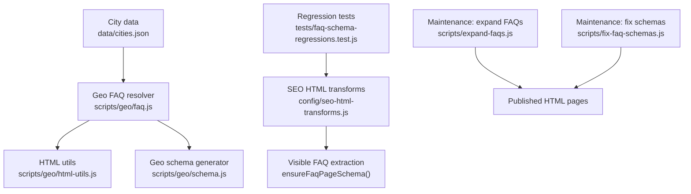
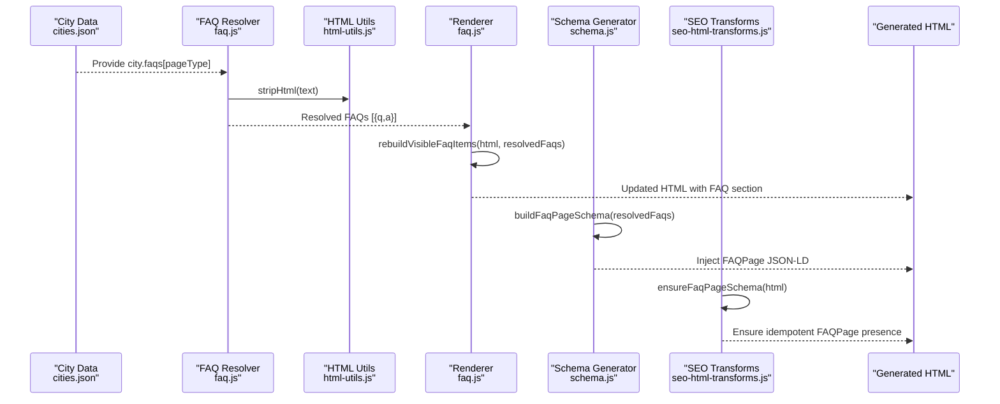
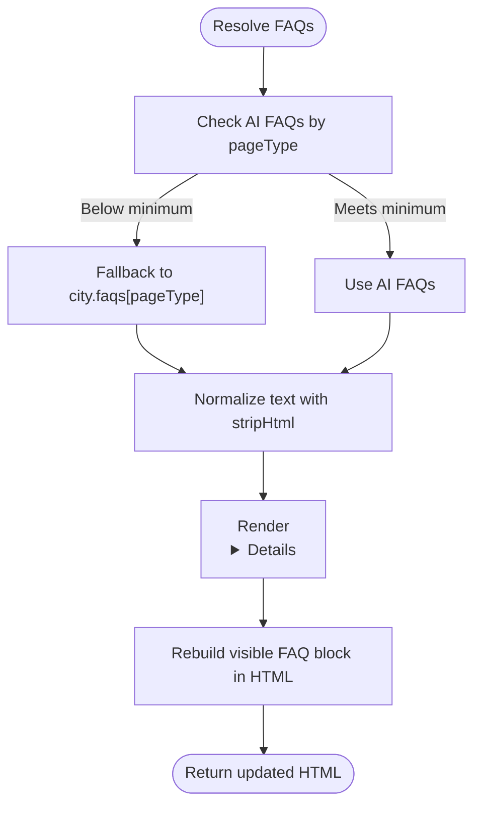
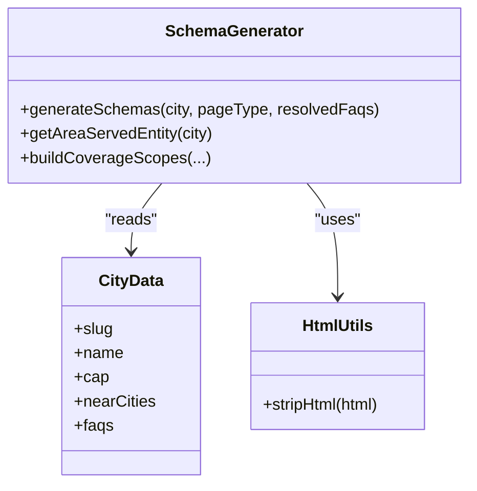
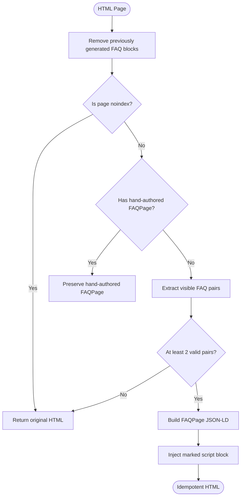
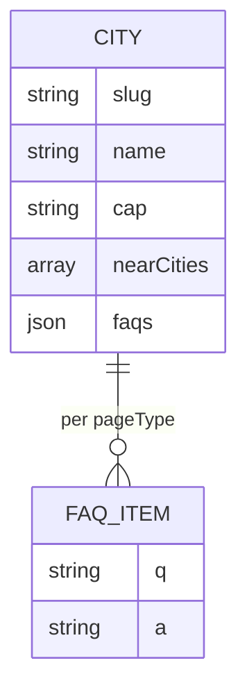
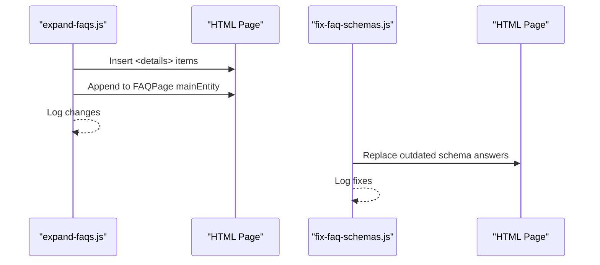
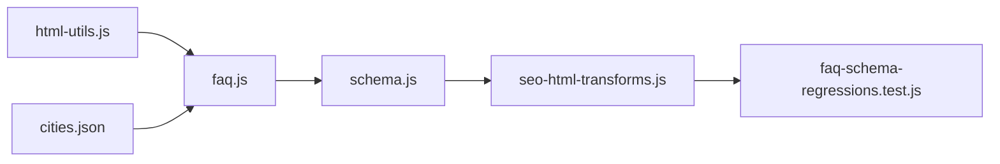

# FAQ Resolution & Schema Generation

<cite>
**Referenced Files in This Document**
- [faq.js](file://scripts/geo/faq.js)
- [schema.js](file://scripts/geo/schema.js)
- [html-utils.js](file://scripts/geo/html-utils.js)
- [seo-html-transforms.js](file://config/seo-html-transforms.js)
- [cities.json](file://data/cities.json)
- [expand-faqs.js](file://scripts/expand-faqs.js)
- [fix-faq-schemas.js](file://scripts/fix-faq-schemas.js)
- [faq-schema-regressions.test.js](file://tests/faq-schema-regressions.test.js)
</cite>

## Table of Contents
1. [Introduction](#introduction)
2. [Project Structure](#project-structure)
3. [Core Components](#core-components)
4. [Architecture Overview](#architecture-overview)
5. [Detailed Component Analysis](#detailed-component-analysis)
6. [Dependency Analysis](#dependency-analysis)
7. [Performance Considerations](#performance-considerations)
8. [Troubleshooting Guide](#troubleshooting-guide)
9. [Conclusion](#conclusion)
10. [Appendices](#appendices)

## Introduction
This document explains the FAQ resolution and schema generation system used for geo-targeted pages. It covers how location-specific FAQs are resolved from content blocks, how visible FAQ items are extracted and rebuilt into page structure, and how JSON-LD FAQPage schemas are generated and validated. It also documents governance rules that ensure FAQ content meets SEO best practices and remains truthful to what is visible on the page.

## Project Structure
The FAQ system spans several modules:
- Geo-specific FAQ resolution and rendering helpers
- JSON-LD schema generation for geo pages (including FAQPage)
- HTML utilities for text normalization
- SEO transforms that enforce idempotent FAQPage injection based on visible content
- Data sources for city-level FAQs
- Maintenance scripts to expand or fix FAQ content and schemas
- Regression tests ensuring correctness and stability

**Diagram sources**
- [faq.js](file://scripts/geo/faq.js)
- [schema.js](file://scripts/geo/schema.js)
- [html-utils.js](file://scripts/geo/html-utils.js)
- [seo-html-transforms.js](file://config/seo-html-transforms.js)
- [cities.json](file://data/cities.json)
- [expand-faqs.js](file://scripts/expand-faqs.js)
- [fix-faq-schemas.js](file://scripts/fix-faq-schemas.js)
- [faq-schema-regressions.test.js](file://tests/faq-schema-regressions.test.js)

**Section sources**
- [faq.js](file://scripts/geo/faq.js)
- [schema.js](file://scripts/geo/schema.js)
- [html-utils.js](file://scripts/geo/html-utils.js)
- [seo-html-transforms.js](file://config/seo-html-transforms.js)
- [cities.json](file://data/cities.json)
- [expand-faqs.js](file://scripts/expand-faqs.js)
- [fix-faq-schemas.js](file://scripts/fix-faq-schemas.js)
- [faq-schema-regressions.test.js](file://tests/faq-schema-regressions.test.js)

## Core Components
- Geo FAQ resolver: selects AI-provided FAQs when available and above a minimum threshold; otherwise falls back to city-defined FAQs.
- Visible FAQ extractor: parses rendered HTML to find question-answer pairs from both 
/
 and heading-based patterns.
- Rebuilder: replaces existing FAQ items in HTML with resolved ones to keep markup consistent with resolved data.
- Schema builder: generates FAQPage JSON-LD from resolved Q/A pairs, stripping HTML to plain text.
- SEO transform pipeline: ensures idempotent injection of FAQPage only when visible FAQs exist and the page is indexable; preserves hand-authored schemas.

**Section sources**
- [faq.js](file://scripts/geo/faq.js)
- [seo-html-transforms.js](file://config/seo-html-transforms.js)

## Architecture Overview
The system operates in two complementary flows:
- Build-time flow for geo pages: resolve FAQs from data, render them into HTML, and generate corresponding FAQPage schema.
- Transform-time flow for all public pages: extract visible FAQs from HTML and inject an idempotent FAQPage block if needed.

**Diagram sources**
- [faq.js](file://scripts/geo/faq.js)
- [schema.js](file://scripts/geo/schema.js)
- [seo-html-transforms.js](file://config/seo-html-transforms.js)
- [cities.json](file://data/cities.json)

## Detailed Component Analysis

### Geo FAQ Resolution and Rendering
- Resolution logic chooses between AI-provided FAQs and city-defined FAQs based on page type and minimum thresholds.
- Visible FAQ extraction supports multiple HTML shapes and normalizes text safely for schema use.
- Rebuilding replaces existing FAQ items in-place to maintain structural consistency.
- Rendering produces semantic 
 blocks suitable for users and crawlers.

**Diagram sources**
- [faq.js](file://scripts/geo/faq.js)
- [html-utils.js](file://scripts/geo/html-utils.js)

**Section sources**
- [faq.js](file://scripts/geo/faq.js)
- [html-utils.js](file://scripts/geo/html-utils.js)

### JSON-LD Schema Generation for Geo Pages
- Generates BreadcrumbList, WebPage, Service, OfferCatalog, and core service schemas tailored per city and page type.
- Appends FAQPage schema when resolved FAQs exist, mapping each Q/A pair to Question/Answer nodes.
- Uses normalized text to avoid HTML leakage into schema fields.

**Diagram sources**
- [schema.js](file://scripts/geo/schema.js)
- [html-utils.js](file://scripts/geo/html-utils.js)
- [cities.json](file://data/cities.json)

**Section sources**
- [schema.js](file://scripts/geo/schema.js)

### SEO Transform Pipeline for FAQPage Injection
- Extracts visible Q/A pairs from published HTML using robust patterns.
- Skips noindex pages and preserves hand-authored FAQPage blocks.
- Ensures idempotency by marking generated blocks and replacing rather than stacking.
- Validates coverage and truthfulness via regression tests.

**Diagram sources**
- [seo-html-transforms.js](file://config/seo-html-transforms.js)

**Section sources**
- [seo-html-transforms.js](file://config/seo-html-transforms.js)
- [faq-schema-regressions.test.js](file://tests/faq-schema-regressions.test.js)

### Data Model: City FAQs
- Each city entry includes a faqs object keyed by pageType (e.g., agenzia, realizzazione).
- Each FAQ item contains q (question) and a (answer), which may include HTML formatting.
- The resolver uses these structures to populate page content and schema.

**Diagram sources**
- [cities.json](file://data/cities.json)

**Section sources**
- [cities.json](file://data/cities.json)

### Maintenance Scripts
- Expand FAQs: Adds new FAQ items to specific pages and updates their FAQPage schema in place.
- Fix schemas: Synchronizes schema answers with corrected HTML answers and standardizes pricing references.

**Diagram sources**
- [expand-faqs.js](file://scripts/expand-faqs.js)
- [fix-faq-schemas.js](file://scripts/fix-faq-schemas.js)

**Section sources**
- [expand-faqs.js](file://scripts/expand-faqs.js)
- [fix-faq-schemas.js](file://scripts/fix-faq-schemas.js)

## Dependency Analysis
- Geo FAQ module depends on html-utils for text normalization.
- Geo schema module depends on config constants and data services, plus html-utils for safe text handling.
- SEO transforms depend on pSEO governance for indexation directives and on internal helpers for URL normalization.
- Tests depend on seo-html-transforms to validate behavior across many pages.

**Diagram sources**
- [html-utils.js](file://scripts/geo/html-utils.js)
- [faq.js](file://scripts/geo/faq.js)
- [schema.js](file://scripts/geo/schema.js)
- [seo-html-transforms.js](file://config/seo-html-transforms.js)
- [faq-schema-regressions.test.js](file://tests/faq-schema-regressions.test.js)
- [cities.json](file://data/cities.json)

**Section sources**
- [faq.js](file://scripts/geo/faq.js)
- [schema.js](file://scripts/geo/schema.js)
- [seo-html-transforms.js](file://config/seo-html-transforms.js)
- [faq-schema-regressions.test.js](file://tests/faq-schema-regressions.test.js)
- [cities.json](file://data/cities.json)

## Performance Considerations
- Regex-based extraction is efficient but should be scoped to relevant sections to minimize overhead.
- Idempotent injection prevents repeated parsing and re-injection during builds.
- Text normalization avoids heavy DOM operations by using regex replacements.
- Limiting FAQPage generation to indexable pages reduces unnecessary processing.

## Troubleshooting Guide
Common issues and resolutions:
- Missing FAQPage despite visible FAQs: Ensure the page is not noindex and does not already contain a hand-authored FAQPage. The transform pipeline will skip such cases.
- Duplicate FAQPage blocks: The pipeline marks generated blocks and replaces them instead of appending. Verify the marker attribute is present.
- Mismatched schema vs visible content: The test suite enforces that every schema question must appear visibly on the page. Update either the visible content or the schema accordingly.
- Outdated schema answers: Use the maintenance script to synchronize schema answers with corrected HTML answers.

**Section sources**
- [seo-html-transforms.js](file://config/seo-html-transforms.js)
- [faq-schema-regressions.test.js](file://tests/faq-schema-regressions.test.js)
- [fix-faq-schemas.js](file://scripts/fix-faq-schemas.js)

## Conclusion
The FAQ resolution and schema generation system ensures that geo-targeted pages publish accurate, verifiable, and SEO-friendly structured data. By deriving FAQPage content directly from visible HTML or validated city data, and by enforcing idempotency and governance rules, the system maintains high quality and reliability across large-scale page generation.

## Appendices

### Example FAQ Data Structures
- City FAQ entry:
  - Key: faqs.pageType
  - Items: array of objects with q and a fields
- Resolved FAQ shape:
  - Array of objects with q and a fields used for rendering and schema generation

**Section sources**
- [cities.json](file://data/cities.json)
- [faq.js](file://scripts/geo/faq.js)

### Generated Schema Outputs
- FAQPage JSON-LD:
  - @context: https://schema.org
  - @type: FAQPage
  - mainEntity: array of Question objects with name and acceptedAnswer.text

- Geo page additional schemas:
  - BreadcrumbList, WebPage, Service, OfferCatalog, core services, and areaServed entities

**Section sources**
- [schema.js](file://scripts/geo/schema.js)
- [seo-html-transforms.js](file://config/seo-html-transforms.js)