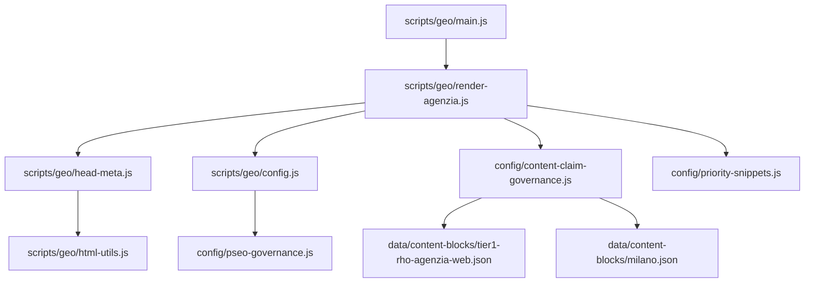
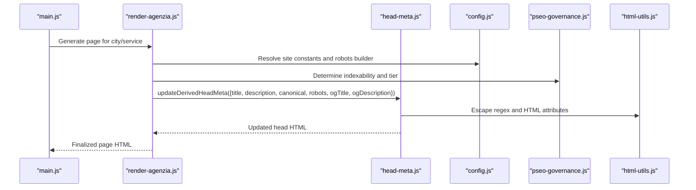
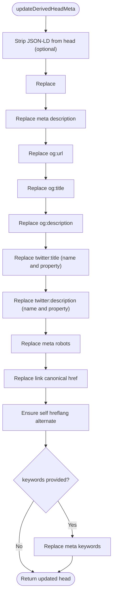
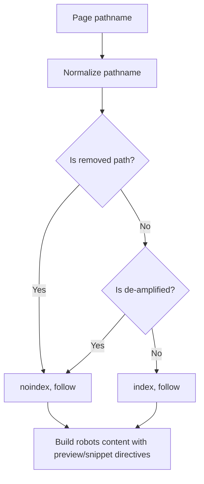
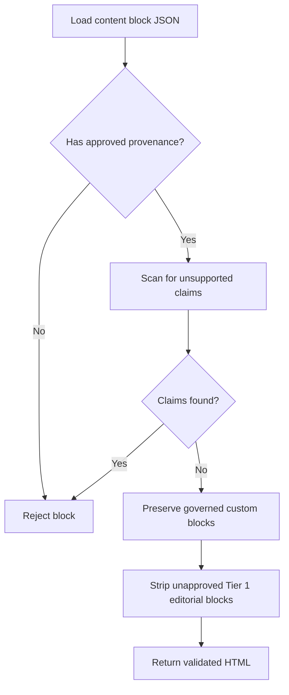
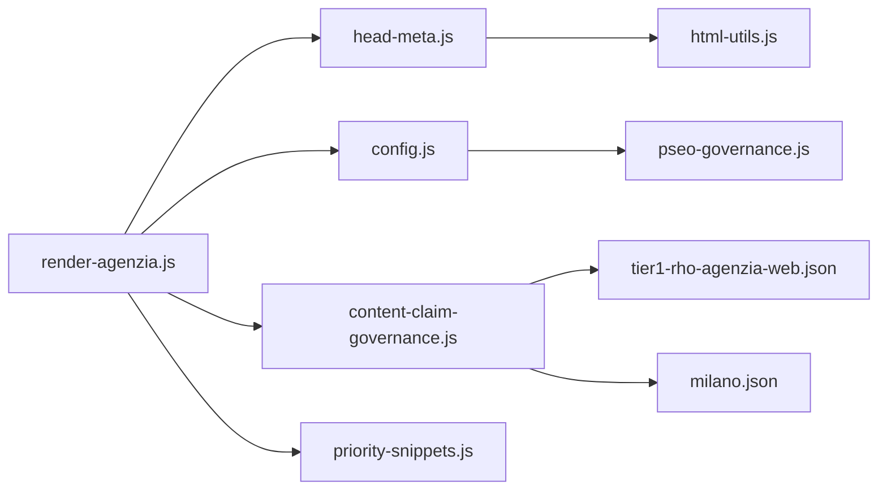

# Meta Tag Generation System

<cite>
**Referenced Files in This Document**
- [head-meta.js](file://scripts/geo/head-meta.js)
- [config.js](file://scripts/geo/config.js)
- [html-utils.js](file://scripts/geo/html-utils.js)
- [render-agenzia.js](file://scripts/geo/render-agenzia.js)
- [main.js](file://scripts/geo/main.js)
- [pseo-governance.js](file://config/pseo-governance.js)
- [content-claim-governance.js](file://config/content-claim-governance.js)
- [priority-snippets.js](file://config/priority-snippets.js)
- [tier1-rho-agenzia-web.json](file://data/content-blocks/tier1-rho-agenzia-web.json)
- [milano.json](file://data/content-blocks/milano.json)
</cite>

## Table of Contents
1. [Introduction](#introduction)
2. [Project Structure](#project-structure)
3. [Core Components](#core-components)
4. [Architecture Overview](#architecture-overview)
5. [Detailed Component Analysis](#detailed-component-analysis)
6. [Dependency Analysis](#dependency-analysis)
7. [Performance Considerations](#performance-considerations)
8. [Troubleshooting Guide](#troubleshooting-guide)
9. [Conclusion](#conclusion)
10. [Appendices](#appendices)

## Introduction
This document explains the meta tag generation system used to produce SEO-optimized, geo-targeted pages. It covers how titles, descriptions, Open Graph tags, Twitter cards, canonical URLs, and robots directives are generated and replaced into page HTML. It also documents the regex-based replacement logic, integration with content governance rules for approved content blocks, validation of approved content, fallback mechanisms when specific content is missing, and examples of configurations across geographic areas.

## Project Structure
The meta tag system lives primarily in the geo generator pipeline:
- The orchestrator drives generation and calls renderers.
- Renderers assemble per-page content and call the head meta updater.
- The head meta module performs all meta tag replacements and canonical/hreflang handling.
- Governance modules enforce indexation policy and content approval.
- Utility helpers escape values safely for HTML attributes and regex patterns.

**Diagram sources**
- [main.js:1-292](file://scripts/geo/main.js#L1-L292)
- [render-agenzia.js:1-194](file://scripts/geo/render-agenzia.js#L1-L194)
- [head-meta.js:1-156](file://scripts/geo/head-meta.js#L1-L156)
- [html-utils.js:1-75](file://scripts/geo/html-utils.js#L1-L75)
- [config.js:1-114](file://scripts/geo/config.js#L1-L114)
- [pseo-governance.js:1-311](file://config/pseo-governance.js#L1-L311)
- [content-claim-governance.js:1-240](file://config/content-claim-governance.js#L1-L240)
- [priority-snippets.js:1-363](file://config/priority-snippets.js#L1-L363)
- [tier1-rho-agenzia-web.json:1-33](file://data/content-blocks/tier1-rho-agenzia-web.json#L1-L33)
- [milano.json:1-64](file://data/content-blocks/milano.json#L1-L64)

**Section sources**
- [main.js:1-292](file://scripts/geo/main.js#L1-L292)
- [render-agenzia.js:1-194](file://scripts/geo/render-agenzia.js#L1-L194)
- [head-meta.js:1-156](file://scripts/geo/head-meta.js#L1-L156)
- [config.js:1-114](file://scripts/geo/config.js#L1-L114)
- [pseo-governance.js:1-311](file://config/pseo-governance.js#L1-L311)
- [content-claim-governance.js:1-240](file://config/content-claim-governance.js#L1-L240)
- [priority-snippets.js:1-363](file://config/priority-snippets.js#L1-L363)

## Core Components
- Head meta updater: Replaces title, description, Open Graph, Twitter, canonical, robots, keywords, and ensures self hreflang.
- Robots builder: Derives robots directive from pSEO governance based on path tier and allowlist.
- Content claim governance: Validates and preserves only approved content blocks; strips unapproved Tier 1 editorial blocks.
- Utilities: Escapes regex and HTML attribute values to prevent injection and breakage during replacement.
- Renderer integration: Assembles page parts and injects updated head meta into final HTML.

Key responsibilities:
- Title and description: Always set from resolved SEO copy or priority snippets.
- Social tags: Open Graph and Twitter use explicit overrides when present; otherwise fall back to title/description.
- Canonical: Set to the absolute URL for the page.
- Robots: Computed via governance; non-indexable GEO paths receive noindex, follow.
- Hreflang: Ensures a self-referencing alternate tag for the canonical URL.

**Section sources**
- [head-meta.js:77-145](file://scripts/geo/head-meta.js#L77-L145)
- [config.js:76-78](file://scripts/geo/config.js#L76-L78)
- [pseo-governance.js:279-281](file://config/pseo-governance.js#L279-L281)
- [content-claim-governance.js:85-95](file://config/content-claim-governance.js#L85-L95)
- [html-utils.js:38-48](file://scripts/geo/html-utils.js#L38-L48)

## Architecture Overview
The flow starts at the geo generator main script, which selects page types and cities/services. For each page, the renderer builds content and calls the head meta updater with computed metadata. The updater applies regex-based replacements to ensure consistent meta tags across all generated pages. Governance modules influence both indexation (robots) and content inclusion (approved blocks).

**Diagram sources**
- [main.js:70-112](file://scripts/geo/main.js#L70-L112)
- [render-agenzia.js:146-188](file://scripts/geo/render-agenzia.js#L146-L188)
- [head-meta.js:123-145](file://scripts/geo/head-meta.js#L123-L145)
- [config.js:76-78](file://scripts/geo/config.js#L76-L78)
- [pseo-governance.js:279-281](file://config/pseo-governance.js#L279-L281)
- [html-utils.js:38-48](file://scripts/geo/html-utils.js#L38-L48)

## Detailed Component Analysis

### Head Meta Updater
The head meta updater performs deterministic replacements:
- Title: Replaces existing title tag.
- Description: Updates meta name="description".
- Open Graph: Updates property="og:url", property="og:title", property="og:description".
- Twitter: Updates name="twitter:title", property="twitter:title", name="twitter:description", property="twitter:description".
- Robots: Updates meta name="robots" using either provided value or built value from path.
- Canonical: Updates link rel="canonical" href.
- Hreflang: Ensures self hreflang alternate tag exists near canonical or before closing head.
- Keywords: Optional update if provided.

Replacement strategy:
- Uses regex to find meta/link tags by attribute name/value pairs.
- Supports two orderings of attributes within the same tag.
- Escapes user-provided content to avoid breaking HTML or regex.

**Diagram sources**
- [head-meta.js:18-22](file://scripts/geo/head-meta.js#L18-L22)
- [head-meta.js:77-145](file://scripts/geo/head-meta.js#L77-L145)

**Section sources**
- [head-meta.js:77-145](file://scripts/geo/head-meta.js#L77-L145)
- [html-utils.js:38-48](file://scripts/geo/html-utils.js#L38-L48)

### Robots Directive and Indexation Policy
Robots directives are derived from pSEO governance:
- Paths in allowlists (Tier 1, Tier 2, data-validated) receive index, follow.
- Non-allowlisted GEO paths receive noindex, follow.
- Removed paths are excluded from sitemap and marked noindex, follow defensively.

The robots builder composes the full robots content string including preview/snippet directives.

**Diagram sources**
- [pseo-governance.js:230-281](file://config/pseo-governance.js#L230-L281)
- [config.js:76-78](file://scripts/geo/config.js#L76-L78)

**Section sources**
- [pseo-governance.js:230-281](file://config/pseo-governance.js#L230-L281)
- [config.js:76-78](file://scripts/geo/config.js#L76-L78)

### Content Governance and Approved Blocks
Content governance ensures that only approved content blocks are preserved or injected:
- Approval requires publication status, valid source URLs, verified date, and approver identity.
- Claims scanning rejects unsupported generated or published claims.
- Custom blocks can be preserved if they are not claim-bearing or are explicitly approved.
- Tier 1 editorial blocks are stripped unless their key is approved.

Approved block usage:
- For hand-crafted Rho agenzia page, the system checks an approved Tier 1 block file and carries forward its content only if it passes provenance and claim checks.
- Other pages may load AI-generated content blocks but still apply governance filters.

**Diagram sources**
- [content-claim-governance.js:74-95](file://config/content-claim-governance.js#L74-L95)
- [content-claim-governance.js:188-226](file://config/content-claim-governance.js#L188-L226)
- [head-meta.js:31-75](file://scripts/geo/head-meta.js#L31-L75)

**Section sources**
- [content-claim-governance.js:74-95](file://config/content-claim-governance.js#L74-L95)
- [content-claim-governance.js:188-226](file://config/content-claim-governance.js#L188-L226)
- [head-meta.js:31-75](file://scripts/geo/head-meta.js#L31-L75)

### Renderer Integration and Fallbacks
The renderer integrates meta updates into the final page:
- Computes canonical URL and resolves SEO copy from editorial overrides or priority snippets.
- Calls head meta updater with title, description, canonical, robots, and optional social overrides.
- Generates JSON-LD schemas and appends them after footer.
- Assembles head, nav, content, footer, schemas, and tail into final HTML.

Fallback mechanisms:
- If Open Graph or Twitter-specific fields are absent, the system falls back to title/description.
- If keywords are not provided, keyword meta is skipped.
- If robots directive is not explicitly set, it is derived from governance.
- If self hreflang is missing, it is inserted near canonical or before closing head.

Examples of geographic configurations:
- Rho agenzia page uses a hand-crafted Tier 1 block for local proof and context; meta tags reflect approved content and governance decisions.
- Milano page leverages AI-generated content blocks for market analysis and FAQs; governance ensures compliance and safety.

**Section sources**
- [render-agenzia.js:41-188](file://scripts/geo/render-agenzia.js#L41-L188)
- [head-meta.js:123-145](file://scripts/geo/head-meta.js#L123-L145)
- [priority-snippets.js:137-149](file://config/priority-snippets.js#L137-L149)
- [tier1-rho-agenzia-web.json:1-33](file://data/content-blocks/tier1-rho-agenzia-web.json#L1-L33)
- [milano.json:1-64](file://data/content-blocks/milano.json#L1-L64)

## Dependency Analysis
The meta tag system depends on several modules:
- Head meta updater depends on html utilities for safe escaping.
- Renderer depends on config for site constants and robots builder.
- Config depends on pSEO governance for indexation policy.
- Content claim governance validates and filters content blocks used by renderers and hand-crafted pages.

**Diagram sources**
- [head-meta.js:1-156](file://scripts/geo/head-meta.js#L1-L156)
- [html-utils.js:1-75](file://scripts/geo/html-utils.js#L1-L75)
- [render-agenzia.js:1-194](file://scripts/geo/render-agenzia.js#L1-L194)
- [config.js:1-114](file://scripts/geo/config.js#L1-L114)
- [pseo-governance.js:1-311](file://config/pseo-governance.js#L1-L311)
- [content-claim-governance.js:1-240](file://config/content-claim-governance.js#L1-L240)
- [priority-snippets.js:1-363](file://config/priority-snippets.js#L1-L363)
- [tier1-rho-agenzia-web.json:1-33](file://data/content-blocks/tier1-rho-agenzia-web.json#L1-L33)
- [milano.json:1-64](file://data/content-blocks/milano.json#L1-L64)

**Section sources**
- [head-meta.js:1-156](file://scripts/geo/head-meta.js#L1-L156)
- [render-agenzia.js:1-194](file://scripts/geo/render-agenzia.js#L1-L194)
- [config.js:1-114](file://scripts/geo/config.js#L1-L114)
- [pseo-governance.js:1-311](file://config/pseo-governance.js#L1-L311)
- [content-claim-governance.js:1-240](file://config/content-claim-governance.js#L1-L240)
- [priority-snippets.js:1-363](file://config/priority-snippets.js#L1-L363)

## Performance Considerations
- Regex replacements are applied sequentially; keep patterns minimal and targeted to reduce overhead.
- Escaping functions run per replacement; batch operations where possible.
- JSON-LD stripping avoids unnecessary schema duplication and keeps head clean.
- Governance checks occur once per content block; caching approved blocks could further reduce I/O.

[No sources needed since this section provides general guidance]

## Troubleshooting Guide
Common issues and resolutions:
- Missing meta tags: Ensure the head contains existing tags with expected attribute names/values; the updater replaces content but does not create new tags.
- Incorrect robots directive: Verify path classification via pSEO governance; non-allowlisted GEO paths will be noindex, follow.
- Unapproved content blocks: Check provenance metadata and claim scans; remove unsupported claims or mark blocks as approved.
- Duplicate or conflicting tags: The updater handles multiple attribute orders; ensure unique attribute names per tag to avoid ambiguity.
- Hreflang missing: Confirm canonical URL is set; the updater inserts self hreflang if not present.

**Section sources**
- [head-meta.js:77-145](file://scripts/geo/head-meta.js#L77-L145)
- [pseo-governance.js:279-281](file://config/pseo-governance.js#L279-L281)
- [content-claim-governance.js:74-95](file://config/content-claim-governance.js#L74-L95)

## Conclusion
The meta tag generation system provides robust, governance-aware SEO optimization for geo-targeted pages. It standardizes meta tags through precise regex replacements, enforces indexation policies, validates content approvals, and ensures consistent social and canonical signals. Fallbacks guarantee sensible defaults when specific content is unavailable, while governance prevents risky or unsupported claims from being published.

[No sources needed since this section summarizes without analyzing specific files]

## Appendices

### Meta Tag Replacement Patterns Summary
- Title: Replace existing title tag content.
- Description: Update meta name="description".
- Open Graph: Update property="og:url", property="og:title", property="og:description".
- Twitter: Update name="twitter:title", property="twitter:title", name="twitter:description", property="twitter:description".
- Robots: Update meta name="robots" using governance-derived value.
- Canonical: Update link rel="canonical" href.
- Hreflang: Insert self hreflang alternate near canonical or before closing head.
- Keywords: Optional update if provided.

**Section sources**
- [head-meta.js:123-145](file://scripts/geo/head-meta.js#L123-L145)

### Geographic Configuration Examples
- Rho agenzia page: Uses approved Tier 1 block for local proof; meta reflects approved content and governance decisions.
- Milano page: Leverages AI-generated content blocks for market analysis and FAQs; governance ensures compliance and safety.

**Section sources**
- [tier1-rho-agenzia-web.json:1-33](file://data/content-blocks/tier1-rho-agenzia-web.json#L1-L33)
- [milano.json:1-64](file://data/content-blocks/milano.json#L1-L64)