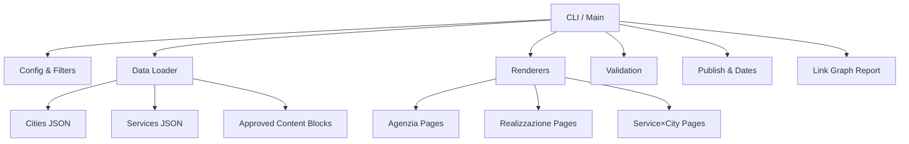
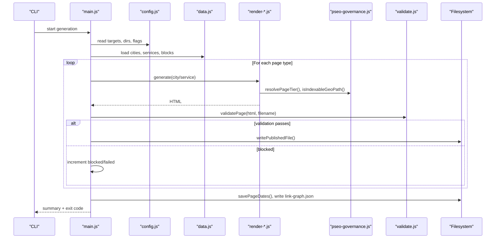
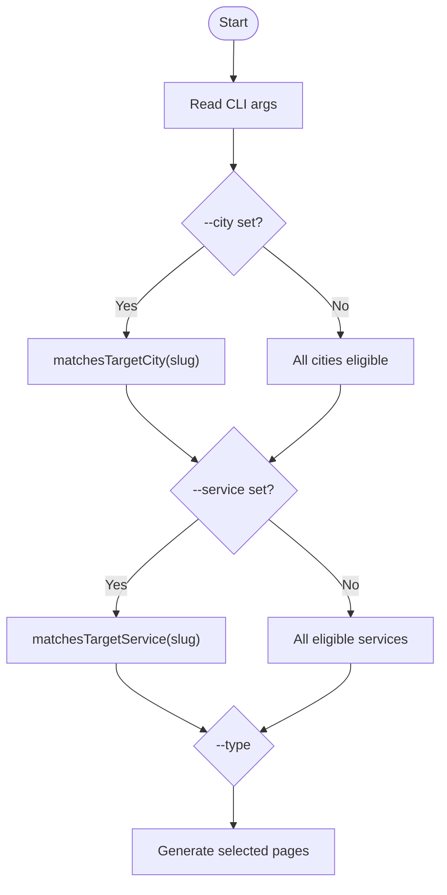
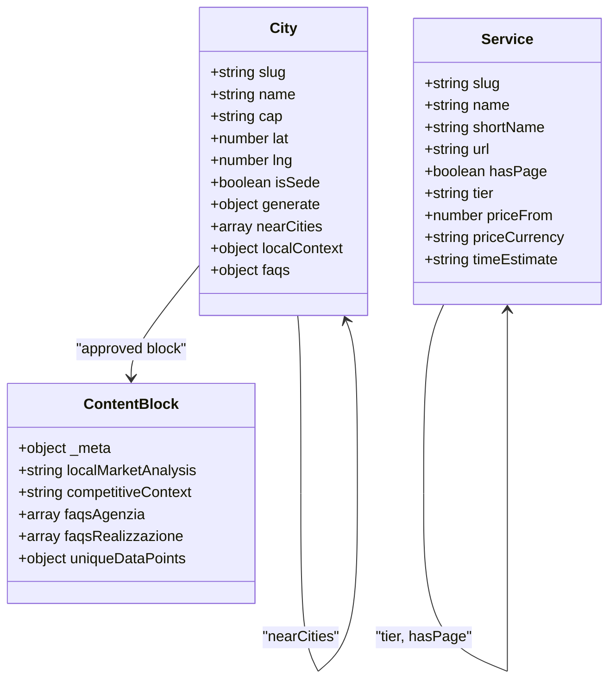
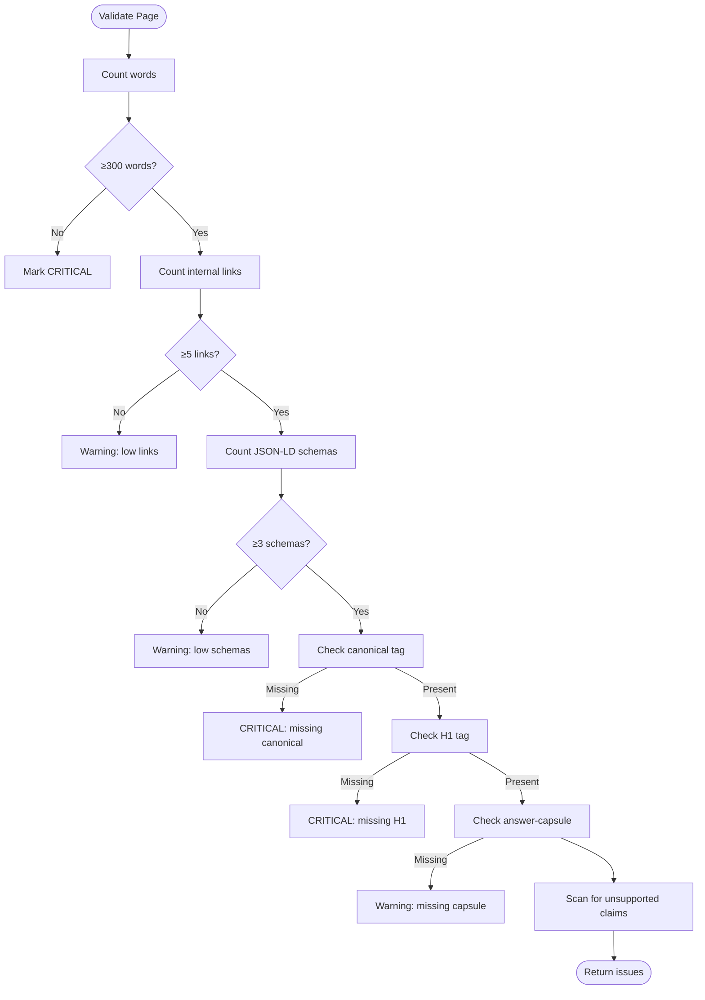
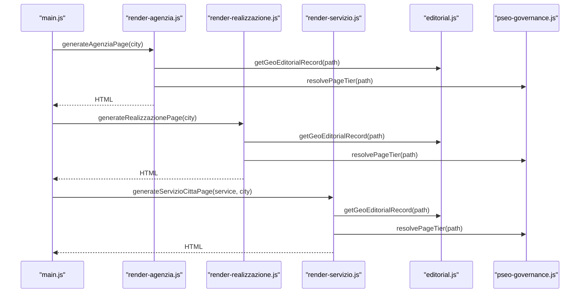
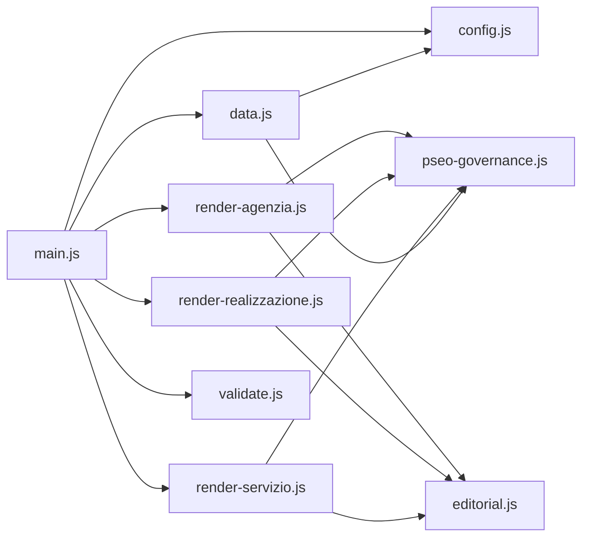

# Data Processing & Filtering System

<cite>
**Referenced Files in This Document**
- [main.js](file://scripts/geo/main.js)
- [config.js](file://scripts/geo/config.js)
- [data.js](file://scripts/geo/data.js)
- [validate.js](file://scripts/geo/validate.js)
- [render-agenzia.js](file://scripts/geo/render-agenzia.js)
- [render-realizzazione.js](file://scripts/geo/render-realizzazione.js)
- [render-servizio.js](file://scripts/geo/render-servizio.js)
- [editorial.js](file://scripts/geo/editorial.js)
- [paths-core.js](file://scripts/geo/paths-core.js)
- [pseo-governance.js](file://config/pseo-governance.js)
- [content-claim-governance.js](file://config/content-claim-governance.js)
- [cities.json](file://data/cities.json)
- [services.json](file://data/services.json)
- [manifest.json](file://data/geo-editorial/manifest.json)
</cite>

## Table of Contents
1. [Introduction](#introduction)
2. [Project Structure](#project-structure)
3. [Core Components](#core-components)
4. [Architecture Overview](#architecture-overview)
5. [Detailed Component Analysis](#detailed-component-analysis)
6. [Dependency Analysis](#dependency-analysis)
7. [Performance Considerations](#performance-considerations)
8. [Troubleshooting Guide](#troubleshooting-guide)
9. [Conclusion](#conclusion)
10. [Appendices](#appendices)

## Introduction
This document explains the data processing and filtering system that powers geo page generation for cities and services. It covers how JSON data is loaded, how city and service filters are applied, how content blocks are resolved, how validation gates published pages, and how configuration controls indexation tiers and generation rules. It also provides guidance on adding new cities, services, and content blocks, plus strategies for migration, caching, and performance optimization.

## Project Structure
The geo generator is a Node-based pipeline orchestrated by a main script. It loads structured city and service catalogs, applies CLI-driven filters, renders HTML via Nunjucks templates, validates output, and writes published files with governance-aware robots directives.

**Diagram sources**
- [main.js:38-292](file://scripts/geo/main.js#L38-L292)
- [config.js:16-114](file://scripts/geo/config.js#L16-L114)
- [data.js:15-197](file://scripts/geo/data.js#L15-L197)
- [validate.js:7-50](file://scripts/geo/validate.js#L7-L50)

**Section sources**
- [main.js:38-292](file://scripts/geo/main.js#L38-L292)
- [config.js:16-114](file://scripts/geo/config.js#L16-L114)
- [data.js:15-197](file://scripts/geo/data.js#L15-L197)

## Core Components
- Configuration and CLI flags: target cities, target services, dry-run, validate-only, publish/report directories, and page tier helpers.
- Data loader: reads cities, services, approved content blocks, blog index; builds lookup maps and utility functions for prices, URLs, avatars, and FAQ resolution.
- Renderers: generate three page families (agenzia, realizzazione, servizio×città) using Nunjucks templates and editorial overrides.
- Validation: fail-closed checks for word count, internal links, schema, canonical, H1, answer capsule, and unsupported claims.
- Governance: allowlist-based indexation control (Tier 1, Tier 2, data-validated), de-amplification logic, and robots directive building.
- Publishing: finalizes HTML, writes files, persists date metadata, and generates link graph reports.

**Section sources**
- [config.js:32-114](file://scripts/geo/config.js#L32-L114)
- [data.js:15-197](file://scripts/geo/data.js#L15-L197)
- [render-agenzia.js:34-189](file://scripts/geo/render-agenzia.js#L34-L189)
- [render-realizzazione.js:1-200](file://scripts/geo/render-realizzazione.js#L1-L200)
- [render-servizio.js:36-284](file://scripts/geo/render-servizio.js#L36-L284)
- [validate.js:7-50](file://scripts/geo/validate.js#L7-L50)
- [pseo-governance.js:18-311](file://config/pseo-governance.js#L18-L311)

## Architecture Overview
The system follows a clear separation of concerns:
- Orchestration: main entrypoint computes expected outputs, iterates over filtered cities/services, and coordinates rendering and validation.
- Data layer: centralized JSON catalogs and approved content blocks provide canonical references for pricing, SEO copy, and local context.
- Rendering layer: per-page-type renderers compose template data, apply editorial overrides, and inject schemas and head metadata.
- Governance layer: determines indexability and robots directives based on tiered allowlists and explicit de-amplification rules.
- Quality gate: validation rejects or warns on pages not meeting minimum quality thresholds.

**Diagram sources**
- [main.js:38-292](file://scripts/geo/main.js#L38-L292)
- [config.js:62-114](file://scripts/geo/config.js#L62-L114)
- [data.js:15-197](file://scripts/geo/data.js#L15-L197)
- [render-servizio.js:36-284](file://scripts/geo/render-servizio.js#L36-L284)
- [pseo-governance.js:205-287](file://config/pseo-governance.js#L205-L287)
- [validate.js:7-50](file://scripts/geo/validate.js#L7-L50)

## Detailed Component Analysis

### Data Loading and Structures
- Cities catalog: central list of cities with metadata, location, distance to headquarters, generate flags, nearCities, localContext, images, and FAQs. Used to drive per-city pages and cross-linking.
- Services catalog: canonical service definitions with slug, name, price, time estimate, tier (core vs extended), and whether a dedicated service page exists. Used to build service×city matrix and pricing display.
- Approved content blocks: AI-generated or hand-authored blocks under data/content-blocks, validated against claim policies before inclusion. Provide local market analysis, competitive context, and FAQs per city.
- Blog index: optional search index used to surface relevant articles for cross-linking within geo pages.

Key responsibilities:
- Build lookup maps for fast city/service retrieval.
- Compute core services and offer catalog entries.
- Format prices consistently and derive primary URLs for services.
- Attach avatar paths and UI metadata to cities.

**Section sources**
- [cities.json:1-800](file://data/cities.json#L1-L800)
- [services.json:1-307](file://data/services.json#L1-L307)
- [data.js:15-197](file://scripts/geo/data.js#L15-L197)
- [content-claim-governance.js:97-107](file://config/content-claim-governance.js#L97-L107)

### Filtering Logic
- CLI-driven filters:
  - Target cities: --city=slug1,slug2...
  - Target services: --service=slug1,slug2...
  - Generation type: --type=all|agenzia|realizzazione|servizio|hubs
  - Dry run and validate-only modes
- Matching functions:
  - matchesTargetCity: empty set means all cities; otherwise exact slug match.
  - matchesTargetService: same logic for services.
- Service eligibility:
  - shouldGenerateGeoForService honors skipGeoGeneration and generateGeoPages flags.
- Page tier classification:
  - resolvePageTier uses governance allowlists to determine Tier 1, Tier 2, or de-amplified status.

**Diagram sources**
- [config.js:32-74](file://scripts/geo/config.js#L32-L74)
- [data.js:47-60](file://scripts/geo/data.js#L47-L60)
- [main.js:53-64](file://scripts/geo/main.js#L53-L64)

**Section sources**
- [config.js:32-74](file://scripts/geo/config.js#L32-L74)
- [data.js:47-60](file://scripts/geo/data.js#L47-L60)
- [main.js:53-64](file://scripts/geo/main.js#L53-L64)

### Configuration System
- Environment variables:
  - PUBLISH_DIR: output directory for generated pages.
  - REPORT_DIR: report directory for link graph and diagnostics.
- CLI flags:
  - --dry-run: simulate without writing files.
  - --validate-only: validate without writing files.
  - --type: select page family to generate.
  - --out-dir, --report-dir: override defaults.
  - --city, --service: narrow generation scope.
- Governance integration:
  - Indexation directives built from path-tier mapping.
  - De-amplified paths receive noindex,follow.

**Section sources**
- [config.js:16-114](file://scripts/geo/config.js#L16-L114)
- [pseo-governance.js:205-287](file://config/pseo-governance.js#L205-L287)

### Content Block Resolution and Relationship Mapping
- Approved content blocks:
  - Loaded from data/content-blocks with strict provenance checks.
  - Only blocks with approved meta and no unsupported claims are included.
- Relationship mapping:
  - City → nearby cities via nearCities array.
  - Service × City → combinatorial pages when both are eligible.
  - Editorial records: per-path overrides for title, description, hero H1, capsules, and body sections.
  - Tier 1 content overrides: per-city and per-service handcrafted blocks when present.

**Diagram sources**
- [cities.json:1-800](file://data/cities.json#L1-L800)
- [services.json:1-307](file://data/services.json#L1-L307)
- [content-claim-governance.js:97-107](file://config/content-claim-governance.js#L97-L107)

**Section sources**
- [data.js:91-111](file://scripts/geo/data.js#L91-L111)
- [render-servizio.js:68-95](file://scripts/geo/render-servizio.js#L68-L95)
- [render-agenzia.js:69-89](file://scripts/geo/render-agenzia.js#L69-L89)
- [content-claim-governance.js:97-107](file://config/content-claim-governance.js#L97-L107)

### Validation Processes
- Fail-closed validation ensures pages meet minimum quality:
  - Word count threshold (critical below 300, warning below 500).
  - Internal links minimum.
  - JSON-LD schema presence.
  - Canonical tag required.
  - H1 tag required.
  - Answer capsule class presence.
  - Unsupported claims detection via policy patterns.
- Results recorded per page and aggregated into warnings/blocked counts.

**Diagram sources**
- [validate.js:7-50](file://scripts/geo/validate.js#L7-L50)
- [content-claim-governance.js:158-186](file://config/content-claim-governance.js#L158-L186)

**Section sources**
- [validate.js:7-50](file://scripts/geo/validate.js#L7-L50)

### Page Generation Workflows
- Agenzia pages:
  - Uses base Rho source, resolves FAQs (hand-crafted or fallback), merges AI content if available, applies editorial overrides, and injects schemas.
- Realizzazione pages:
  - Similar flow tailored for realization-focused copy and structure.
- Servizio×Città pages:
  - Combines service and city data, selects FAQ pool by cluster, enriches content with AI blocks, resolves related city/service pages, and injects service-specific schemas.

**Diagram sources**
- [render-agenzia.js:34-189](file://scripts/geo/render-agenzia.js#L34-L189)
- [render-realizzazione.js:1-200](file://scripts/geo/render-realizzazione.js#L1-L200)
- [render-servizio.js:36-284](file://scripts/geo/render-servizio.js#L36-L284)
- [editorial.js:13-25](file://scripts/geo/editorial.js#L13-L25)
- [pseo-governance.js:263-269](file://config/pseo-governance.js#L263-L269)

**Section sources**
- [render-agenzia.js:34-189](file://scripts/geo/render-agenzia.js#L34-L189)
- [render-realizzazione.js:1-200](file://scripts/geo/render-realizzazione.js#L1-L200)
- [render-servizio.js:36-284](file://scripts/geo/render-servizio.js#L36-L284)

### Indexation and Governance Rules
- Tiered allowlists:
  - Tier 1: high-priority pages with enriched content.
  - Tier 2: standard support pages for long-tail and cross-linking.
  - Data-validated: re-opened pages backed by observed signals.
- De-amplification:
  - Any GEO path not in allowlist receives noindex,follow.
  - Explicitly de-amplified and removed paths are enforced.
- Robots directives:
  - Built per path using governance helpers.

**Section sources**
- [pseo-governance.js:21-311](file://config/pseo-governance.js#L21-L311)
- [config.js:76-78](file://scripts/geo/config.js#L76-L78)

## Dependency Analysis
The system exhibits modular dependencies with clear boundaries:
- main.js depends on config, data, renderers, validation, paths, dates, and link-graph modules.
- Renderers depend on data, editorial, governance, and schema utilities.
- Governance module depends on cities and services catalogs to compute de-amplification sets.
- Data module depends on filesystem and Nunjucks environment setup.

**Diagram sources**
- [main.js:38-292](file://scripts/geo/main.js#L38-L292)
- [data.js:15-197](file://scripts/geo/data.js#L15-L197)
- [pseo-governance.js:18-311](file://config/pseo-governance.js#L18-L311)

**Section sources**
- [main.js:38-292](file://scripts/geo/main.js#L38-L292)
- [data.js:15-197](file://scripts/geo/data.js#L15-L197)
- [pseo-governance.js:18-311](file://config/pseo-governance.js#L18-L311)

## Performance Considerations
- Data loading:
  - JSON catalogs are read once at startup; use Map lookups for O(1) access to cities/services.
  - Approved content blocks are filtered early to avoid unnecessary processing.
- Rendering:
  - Nunjucks configured with trim/lstrip to reduce template overhead.
  - Base page extraction avoids full template duplication.
- Validation:
  - Regex scans are bounded; keep patterns minimal to maintain speed.
- Large datasets:
  - Consider batching file writes and deferring heavy operations until after validation.
  - Use incremental generation with --city and --service filters for faster iteration.
- Caching:
  - In-memory caches (Maps) already used for services and cities; extend to cached editorial records and approved blocks if needed.
  - Persist computed artifacts (e.g., link graph) to disk to avoid recomputation across runs.

[No sources needed since this section provides general guidance]

## Troubleshooting Guide
Common issues and resolutions:
- Missing base page:
  - Ensure agenzia-web-source.html exists; renderer will error if absent.
- Validation failures:
  - Inspect warnings and critical issues; ensure minimum word count, internal links, schemas, canonical, H1, and answer capsule.
- Unsupported claims:
  - Review content against claim patterns; remove or qualify guarantees and fixed delivery estimates.
- De-amplified pages:
  - Check pSEO governance allowlists; add desired paths to Tier 1/Tier 2 or data-validated sets if justified.
- Date persistence:
  - If page dates are not updated, confirm savePageDates runs post-write and that generation completes successfully.

**Section sources**
- [render-agenzia.js:34-39](file://scripts/geo/render-agenzia.js#L34-L39)
- [validate.js:7-50](file://scripts/geo/validate.js#L7-L50)
- [content-claim-governance.js:158-186](file://config/content-claim-governance.js#L158-L186)
- [pseo-governance.js:250-287](file://config/pseo-governance.js#L250-L287)
- [main.js:273-278](file://scripts/geo/main.js#L273-L278)

## Conclusion
The geo page generation system combines robust data loading, flexible filtering, templated rendering, strict validation, and governance-controlled indexation. By adhering to the tiered allowlists and claim policies, it maintains quality while scaling to hundreds of pages. The modular design supports easy extension for new cities, services, and content blocks, and provides clear hooks for performance optimization and troubleshooting.

[No sources needed since this section summarizes without analyzing specific files]

## Appendices

### Adding New Cities
Steps:
- Add a new city object to data/cities.json with required fields (slug, name, cap, lat, lng, province, generate flags, nearCities, localContext, images, FAQs).
- If the city should be indexable, add its paths to the appropriate tier allowlist in config/pseo-governance.js.
- Optionally add an approved content block under data/content-blocks/<city>.json with proper _meta provenance.
- Run generation with --city=<new-slug> to test.

**Section sources**
- [cities.json:1-800](file://data/cities.json#L1-L800)
- [pseo-governance.js:42-146](file://config/pseo-governance.js#L42-L146)
- [content-claim-governance.js:97-107](file://config/content-claim-governance.js#L97-L107)

### Adding New Services
Steps:
- Add a new service object to data/services.json with slug, name, price, time estimate, tier, and hasPage flag.
- If the service should participate in geo generation, ensure skipGeoGeneration is false and generateGeoPages is not false.
- Add editorial records under data/geo-editorial if needed for title/description/H1 overrides.
- Run generation with --service=<new-slug> to test.

**Section sources**
- [services.json:1-307](file://data/services.json#L1-L307)
- [data.js:47-60](file://scripts/geo/data.js#L47-L60)
- [editorial.js:13-25](file://scripts/geo/editorial.js#L13-L25)

### Adding Content Blocks
Steps:
- Create data/content-blocks/<city>.json with _meta including publicationStatus, source URLs, verifiedAt, and approvedBy.
- Avoid unsupported claims; the loader will reject blocks that violate policy.
- For Tier 1 pages, create tier1-<city>-<service>.json or tier1-<city>-agenzia-web.json as applicable.

**Section sources**
- [content-claim-governance.js:97-107](file://config/content-claim-governance.js#L97-L107)
- [render-servizio.js:149-155](file://scripts/geo/render-servizio.js#L149-L155)
- [render-agenzia.js:69-77](file://scripts/geo/render-agenzia.js#L69-L77)

### Migration Strategies
- Deprecating clusters:
  - Mark services with skipGeoGeneration or generateGeoPages=false to opt out.
  - Remove or redirect deprecated paths via governance REMOVED_PATHS and explicit de-amplification lists.
- Gradual rollout:
  - Use Tier 2 or data-validated sets to cautiously re-enable indexation based on observed signals.
- Backward compatibility:
  - Keep legacy constants like STRATEGIC_INDEXABLE_GEO_PATHS for existing tools.

**Section sources**
- [data.js:47-60](file://scripts/geo/data.js#L47-L60)
- [pseo-governance.js:171-182](file://config/pseo-governance.js#L171-L182)
- [pseo-governance.js:155-169](file://config/pseo-governance.js#L155-L169)

### Caching Mechanisms
- In-memory caches:
  - cityMap and serviceBySlug Maps for fast lookups.
- File-level caching:
  - Approved content blocks loaded once and reused across renderers.
- Output caching:
  - Persist link graph and date metadata to avoid recomputation.

**Section sources**
- [data.js:66-68](file://scripts/geo/data.js#L66-L68)
- [data.js:91-111](file://scripts/geo/data.js#L91-L111)
- [main.js:227-237](file://scripts/geo/main.js#L227-L237)

### Performance Optimization Tips
- Filter early:
  - Use --city and --service to limit generation scope during development.
- Batch writes:
  - Group file writes and defer heavy tasks until after validation.
- Reduce template overhead:
  - Keep Nunjucks configurations lean; avoid excessive filters.
- Monitor validation:
  - Address critical issues first to prevent blocked pages.

[No sources needed since this section provides general guidance]