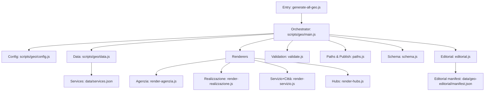
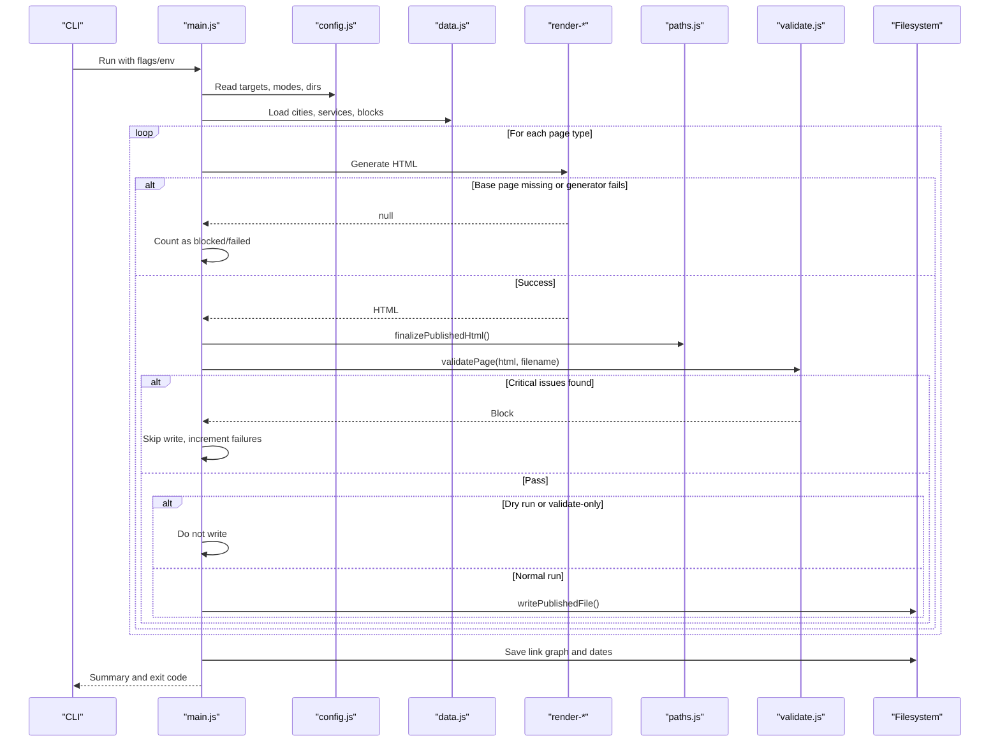
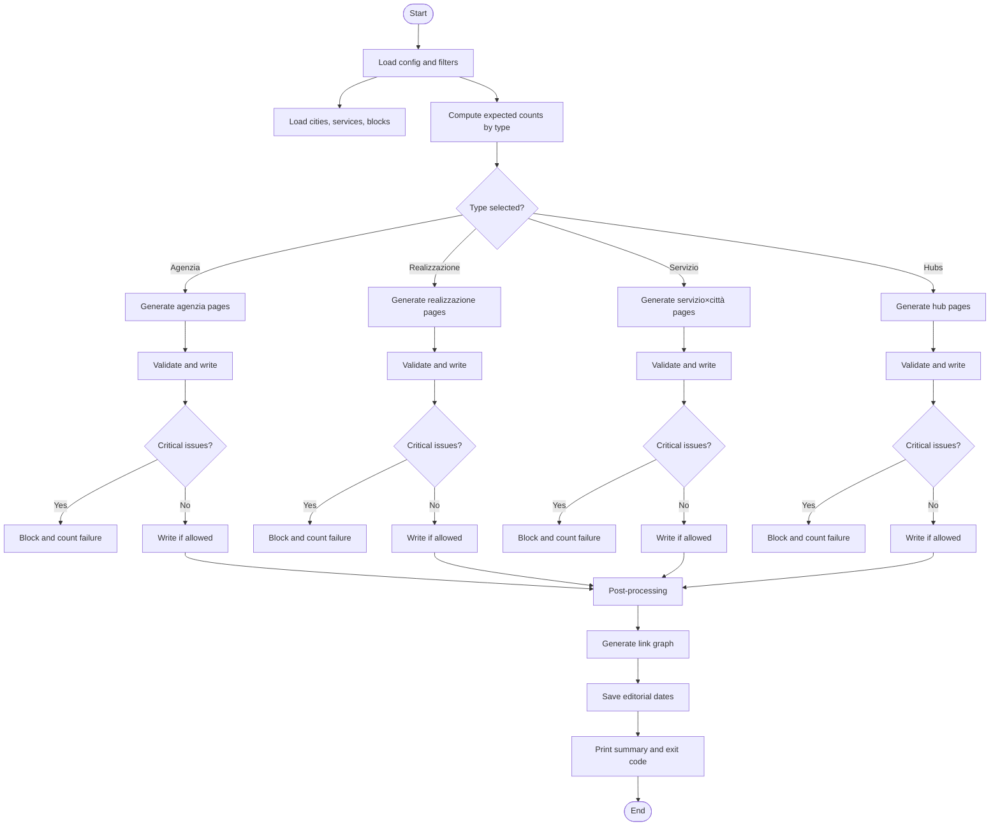
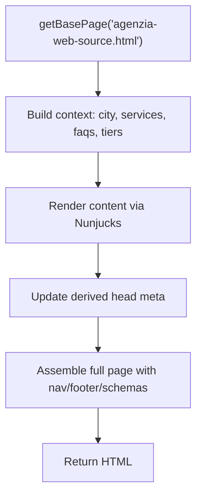
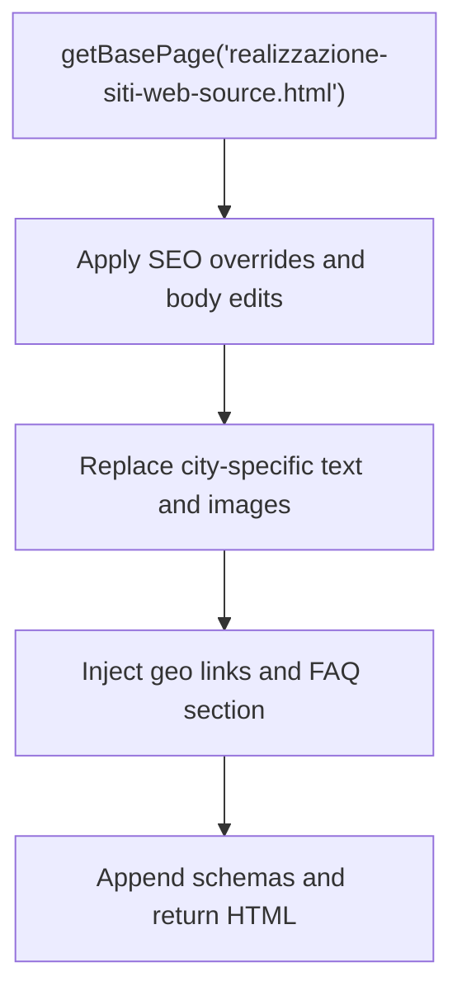
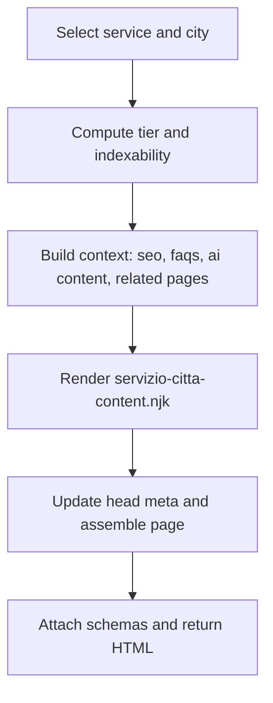
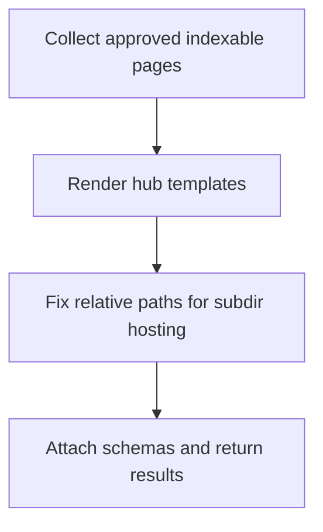
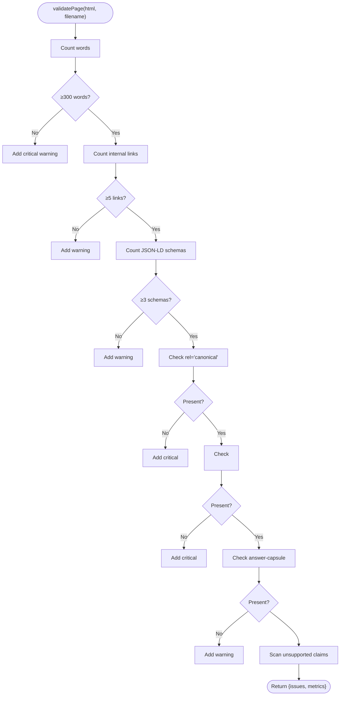
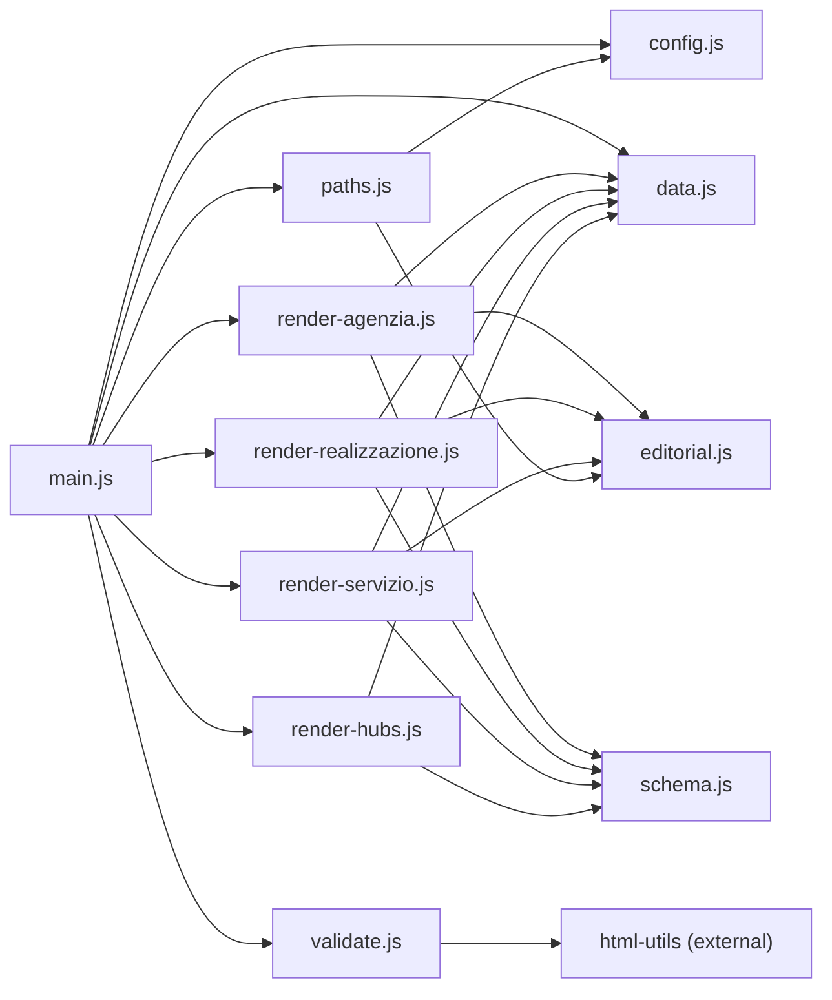

# Geo Page Generation Pipeline

<cite>
**Referenced Files in This Document**
- [scripts/generate-all-geo.js](file://scripts/generate-all-geo.js)
- [scripts/geo/main.js](file://scripts/geo/main.js)
- [scripts/geo/config.js](file://scripts/geo/config.js)
- [scripts/geo/data.js](file://scripts/geo/data.js)
- [scripts/geo/render-agenzia.js](file://scripts/geo/render-agenzia.js)
- [scripts/geo/render-realizzazione.js](file://scripts/geo/render-realizzazione.js)
- [scripts/geo/render-servizio.js](file://scripts/geo/render-servizio.js)
- [scripts/geo/render-hubs.js](file://scripts/geo/render-hubs.js)
- [scripts/geo/validate.js](file://scripts/geo/validate.js)
- [scripts/geo/editorial.js](file://scripts/geo/editorial.js)
- [scripts/geo/schema.js](file://scripts/geo/schema.js)
- [scripts/geo/paths.js](file://scripts/geo/paths.js)
- [data/services.json](file://data/services.json)
- [data/geo-editorial/manifest.json](file://data/geo-editorial/manifest.json)
</cite>

## Table of Contents
1. Introduction
2. Project Structure
3. Core Components
4. Architecture Overview
5. Detailed Component Analysis
6. Dependency Analysis
7. Performance Considerations
8. Troubleshooting Guide
9. Conclusion
10. Appendices

## Introduction
This document explains the geo page generation pipeline that automates creation of localized landing pages and hub pages for a web agency. The pipeline orchestrates data loading, filtering by city and service, rendering of multiple page types, validation, and publication. It supports:
- Agenzia pages per city
- Realizzazione pages per city
- Servizio×Città combinatorial matrix (service × city)
- Hub pages aggregating coverage across cities and services

The system is driven by configuration, editorial overrides, and governance rules to ensure quality, consistency, and indexability before files are written.

## Project Structure
At a high level, the pipeline is implemented under scripts/geo with a public entrypoint at scripts/generate-all-geo.js. Data sources live under data/, templates under templates/, and generated artifacts are written to a publish directory controlled by configuration.

**Diagram sources**
- [scripts/generate-all-geo.js:1-58](file://scripts/generate-all-geo.js#L1-L58)
- [scripts/geo/main.js:1-292](file://scripts/geo/main.js#L1-L292)
- [scripts/geo/config.js:1-114](file://scripts/geo/config.js#L1-L114)
- [scripts/geo/data.js:1-197](file://scripts/geo/data.js#L1-L197)
- [scripts/geo/render-agenzia.js:1-194](file://scripts/geo/render-agenzia.js#L1-L194)
- [scripts/geo/render-realizzazione.js:1-241](file://scripts/geo/render-realizzazione.js#L1-L241)
- [scripts/geo/render-servizio.js:1-289](file://scripts/geo/render-servizio.js#L1-L289)
- [scripts/geo/render-hubs.js:1-296](file://scripts/geo/render-hubs.js#L1-L296)
- [scripts/geo/validate.js:1-55](file://scripts/geo/validate.js#L1-L55)
- [scripts/geo/paths.js:1-120](file://scripts/geo/paths.js#L1-L120)
- [scripts/geo/schema.js:1-199](file://scripts/geo/schema.js#L1-L199)
- [scripts/geo/editorial.js:1-64](file://scripts/geo/editorial.js#L1-L64)
- [data/services.json:1-200](file://data/services.json#L1-L200)
- [data/geo-editorial/manifest.json:1-451](file://data/geo-editorial/manifest.json#L1-L451)

**Section sources**
- [scripts/generate-all-geo.js:1-58](file://scripts/generate-all-geo.js#L1-L58)
- [scripts/geo/main.js:1-292](file://scripts/geo/main.js#L1-L292)
- [scripts/geo/config.js:1-114](file://scripts/geo/config.js#L1-L114)
- [scripts/geo/data.js:1-197](file://scripts/geo/data.js#L1-L197)

## Core Components
- Orchestrator: main.js drives the end-to-end flow, including expected counts, loops over cities/services, and finalization steps.
- Configuration: config.js centralizes CLI flags, environment variables, site constants, target filters, and governance helpers.
- Data: data.js loads cities, services, content blocks, blog index, and Nunjucks environment; exposes eligibility predicates and UI metadata helpers.
- Renderers: dedicated modules produce HTML for each page type using base pages, templates, editorial overrides, and schemas.
- Validation: validate.js enforces minimum word count, internal links, schema presence, canonical/H1 requirements, answer capsule, and unsupported claims.
- Paths: paths.js handles base page caching, SEO transforms, entity normalization, de-amplification of non-indexable anchors, and file writing.
- Schema: schema.js generates JSON-LD structures for pages, services, FAQs, and hubs.
- Editorial: editorial.js applies hand-written per-city SEO/body overrides when available.

**Section sources**
- [scripts/geo/main.js:38-292](file://scripts/geo/main.js#L38-L292)
- [scripts/geo/config.js:32-114](file://scripts/geo/config.js#L32-L114)
- [scripts/geo/data.js:15-197](file://scripts/geo/data.js#L15-L197)
- [scripts/geo/render-agenzia.js:34-189](file://scripts/geo/render-agenzia.js#L34-L189)
- [scripts/geo/render-realizzazione.js:33-200](file://scripts/geo/render-realizzazione.js#L33-L200)
- [scripts/geo/render-servizio.js:36-284](file://scripts/geo/render-servizio.js#L36-L284)
- [scripts/geo/render-hubs.js:51-290](file://scripts/geo/render-hubs.js#L51-L290)
- [scripts/geo/validate.js:7-50](file://scripts/geo/validate.js#L7-L50)
- [scripts/geo/paths.js:23-120](file://scripts/geo/paths.js#L23-L120)
- [scripts/geo/schema.js:18-199](file://scripts/geo/schema.js#L18-L199)
- [scripts/geo/editorial.js:13-64](file://scripts/geo/editorial.js#L13-L64)

## Architecture Overview
The pipeline follows a fail-closed design: any critical validation issue or missing base page stops output for that artifact. Each generated page passes through finalization and validation before being written.

**Diagram sources**
- [scripts/geo/main.js:38-292](file://scripts/geo/main.js#L38-L292)
- [scripts/geo/config.js:32-114](file://scripts/geo/config.js#L32-L114)
- [scripts/geo/data.js:15-197](file://scripts/geo/data.js#L15-L197)
- [scripts/geo/render-agenzia.js:34-189](file://scripts/geo/render-agenzia.js#L34-L189)
- [scripts/geo/render-realizzazione.js:33-200](file://scripts/geo/render-realizzazione.js#L33-L200)
- [scripts/geo/render-servizio.js:36-284](file://scripts/geo/render-servizio.js#L36-L284)
- [scripts/geo/render-hubs.js:51-290](file://scripts/geo/render-hubs.js#L51-L290)
- [scripts/geo/paths.js:91-106](file://scripts/geo/paths.js#L91-L106)
- [scripts/geo/validate.js:7-50](file://scripts/geo/validate.js#L7-L50)

## Detailed Component Analysis

### Orchestration and Execution Flow
- Entry point re-exports core symbols and invokes main when executed directly.
- main.js computes expected counts per category based on GEN_TYPE and filters.
- It iterates cities and services, generating pages, validating, and writing only if checks pass.
- After generation, it builds a link graph and persists editorial dates.
- Exits with error code if any blocked/failed pages exist or expected counts mismatch.

**Diagram sources**
- [scripts/geo/main.js:38-292](file://scripts/geo/main.js#L38-L292)

**Section sources**
- [scripts/generate-all-geo.js:28-58](file://scripts/generate-all-geo.js#L28-L58)
- [scripts/geo/main.js:38-292](file://scripts/geo/main.js#L38-L292)

### Configuration System
- CLI flags: --dry-run, --validate-only, --type=agenzia|realizzazione|servizio|hubs|all, --out-dir, --report-dir, --city, --service.
- Environment variables: PUBLISH_DIR, REPORT_DIR override defaults.
- Target filters: TARGET_CITY_SLUGS and TARGET_SERVICE_SLUGS restrict iteration.
- Governance integration: tier classification, indexability, robots directives via pSEO governance helpers.
- Site constants: SITE, coordinates, first deploy date, tokens for dynamic dates.

Usage examples:
- Full run: node scripts/generate-all-geo.js
- Dry run: node scripts/generate-all-geo.js --dry-run
- Validate only: node scripts/generate-all-geo.js --validate-only
- Filtered run: node scripts/generate-all-geo.js --type=servizio --city=rho,milano --service=ecommerce,seo-locale

**Section sources**
- [scripts/geo/config.js:32-114](file://scripts/geo/config.js#L32-L114)

### Data Loading and Filtering
- Loads cities from data/cities.json and services from data/services.json.
- Builds maps and sets for fast lookups; prepares table services with price display.
- Eligibility predicate shouldGenerateGeoForService honors skipGeoGeneration and generateGeoPages flags.
- Loads approved AI content blocks and optional blog search index for cross-linking.
- Provides UI metadata helpers for city avatars and near-city lists.

**Section sources**
- [scripts/geo/data.js:15-197](file://scripts/geo/data.js#L15-L197)
- [data/services.json:1-200](file://data/services.json#L1-L200)

### Rendering Logic by Page Type

#### Agenzia Pages
- Uses a base page template and Nunjucks content template.
- Computes nearest cities, related pages, and blog links.
- Applies editorial SEO overrides and inserts Tier 1 content when present.
- Injects head meta, nav, footer, schemas, and tail assets.

**Diagram sources**
- [scripts/geo/render-agenzia.js:34-189](file://scripts/geo/render-agenzia.js#L34-L189)

**Section sources**
- [scripts/geo/render-agenzia.js:34-189](file://scripts/geo/render-agenzia.js#L34-L189)

#### Realizzazione Pages
- Uses a regex-based base template to swap city-specific strings and sections.
- Applies editorial body replacement for local context.
- Injects geo links, FAQ section, and schemas.
- Supports Tier 1 editorial block injection for high-priority pages.

**Diagram sources**
- [scripts/geo/render-realizzazione.js:33-200](file://scripts/geo/render-realizzazione.js#L33-L200)

**Section sources**
- [scripts/geo/render-realizzazione.js:33-200](file://scripts/geo/render-realizzazione.js#L33-L200)

#### Servizio×Città Pages
- Renders a service×city page using Nunjucks with tailored content angle per service cluster.
- Selects FAQ pools based on service category and merges editorial FAQs when present.
- Builds related city/service pages and includes area served entities in schemas.
- Handles de-amplified pages via tier classification.

**Diagram sources**
- [scripts/geo/render-servizio.js:36-284](file://scripts/geo/render-servizio.js#L36-L284)

**Section sources**
- [scripts/geo/render-servizio.js:36-284](file://scripts/geo/render-servizio.js#L36-L284)

#### Hub Pages
- Generates three hub pages: agenzia-web, realizzazione-siti-web, zone-servite.
- Aggregates approved indexable pages and renders collection pages with coverage scopes.
- Rewrites relative asset paths for subdirectory serving.
- Produces CollectionPage and BreadcrumbList schemas.

**Diagram sources**
- [scripts/geo/render-hubs.js:51-290](file://scripts/geo/render-hubs.js#L51-L290)

**Section sources**
- [scripts/geo/render-hubs.js:51-290](file://scripts/geo/render-hubs.js#L51-L290)

### Validation Framework
- Enforces minimum word count, internal links, JSON-LD schema count, canonical tag, H1 presence, answer capsule class.
- Scans for unsupported published claims and reports them as critical issues.
- Returns structured validation result used by the orchestrator to block writes on critical findings.

**Diagram sources**
- [scripts/geo/validate.js:7-50](file://scripts/geo/validate.js#L7-L50)

**Section sources**
- [scripts/geo/validate.js:7-50](file://scripts/geo/validate.js#L7-L50)

### Editorial Overrides and Content Blocks
- getGeoEditorialRecord provides per-city SEO/body overrides.
- applyEditorialSeoOverrides prioritizes hand-written title/description/h1/capsule.
- applyEditorialBody replaces the first shared section with localized copy and optional call-to-action.
- Tier 1 content blocks can be loaded for high-value pages when present.

**Section sources**
- [scripts/geo/editorial.js:13-64](file://scripts/geo/editorial.js#L13-L64)
- [data/geo-editorial/manifest.json:1-451](file://data/geo-editorial/manifest.json#L1-L451)

### Schema Generation
- Generates BreadcrumbList, WebPage, Service, OfferCatalog, and FAQPage where applicable.
- Area served entities include primary city, nearby cities, and administrative areas.
- Hubs use CollectionPage schemas with numberOfItems and hasPart references.

**Section sources**
- [scripts/geo/schema.js:18-199](file://scripts/geo/schema.js#L18-L199)
- [scripts/geo/render-hubs.js:141-286](file://scripts/geo/render-hubs.js#L141-L286)

### Publishing and Finalization
- Base pages are cached to avoid repeated disk reads.
- finalizePublishedHtml applies SEO transforms, normalizes entity JSON-LD, removes de-amplified anchors, and adjusts runtime scripts.
- writePublishedFile resolves target path, applies editorial date, and writes HTML.

**Section sources**
- [scripts/geo/paths.js:23-120](file://scripts/geo/paths.js#L23-L120)

## Dependency Analysis
The following diagram shows key module dependencies within the pipeline.

**Diagram sources**
- [scripts/geo/main.js:1-292](file://scripts/geo/main.js#L1-L292)
- [scripts/geo/render-agenzia.js:1-194](file://scripts/geo/render-agenzia.js#L1-L194)
- [scripts/geo/render-realizzazione.js:1-241](file://scripts/geo/render-realizzazione.js#L1-L241)
- [scripts/geo/render-servizio.js:1-289](file://scripts/geo/render-servizio.js#L1-L289)
- [scripts/geo/render-hubs.js:1-296](file://scripts/geo/render-hubs.js#L1-L296)
- [scripts/geo/config.js:1-114](file://scripts/geo/config.js#L1-L114)
- [scripts/geo/data.js:1-197](file://scripts/geo/data.js#L1-L197)
- [scripts/geo/paths.js:1-120](file://scripts/geo/paths.js#L1-L120)
- [scripts/geo/validate.js:1-55](file://scripts/geo/validate.js#L1-L55)
- [scripts/geo/editorial.js:1-64](file://scripts/geo/editorial.js#L1-L64)
- [scripts/geo/schema.js:1-199](file://scripts/geo/schema.js#L1-L199)

**Section sources**
- [scripts/geo/main.js:1-292](file://scripts/geo/main.js#L1-L292)

## Performance Considerations
- Base page caching reduces repeated filesystem reads during rendering.
- Use --type and --city/--service filters to limit scope for faster iterations.
- Prefer --dry-run or --validate-only during development to avoid unnecessary writes.
- Limit AI content block processing by ensuring only approved blocks are loaded.
- Keep base templates minimal and reuse shared logic to reduce rendering overhead.
- When scaling to many cities/services, consider batching writes and deferring heavy operations until after validation passes.

[No sources needed since this section provides general guidance]

## Troubleshooting Guide
Common issues and resolutions:
- Missing base page: Ensure base-page files exist in templates/base-pages; generators will return null and mark pages as failed.
- Validation failures: Check word count, internal links, JSON-LD schemas, canonical tag, H1, and answer capsule. Fix content or structure accordingly.
- Unsupported claims: Review content for claims flagged by governance; remove or adjust to approved language.
- Target mismatches: Verify GEN_TYPE and filters; ensure expected counts align with filtered datasets.
- De-amplified anchors: Non-indexable geo pages may have internal links stripped; confirm indexability settings for target pages.

Operational tips:
- Use --dry-run to preview outputs without writing files.
- Use --validate-only to run checks against existing outputs.
- Inspect console logs for per-service status lines and total warnings/blocked counts.
- Check reports directory for link-graph.json and editorial dates updates.

**Section sources**
- [scripts/geo/main.js:70-292](file://scripts/geo/main.js#L70-L292)
- [scripts/geo/validate.js:7-50](file://scripts/geo/validate.js#L7-L50)
- [scripts/geo/paths.js:78-106](file://scripts/geo/paths.js#L78-L106)

## Conclusion
The geo page generation pipeline provides a robust, fail-closed system for automated creation of localized pages and hubs. It integrates configuration-driven targeting, editorial overrides, content governance, and strict validation to ensure quality before publication. By leveraging filters, dry runs, and targeted debugging, teams can efficiently scale content generation while maintaining SEO and compliance standards.

[No sources needed since this section summarizes without analyzing specific files]

## Appendices

### Configuration Reference
- Flags:
  - --dry-run: Prevents file writes
  - --validate-only: Runs validation without generation
  - --type: Limits generation to agenzia, realizzazione, servizio, hubs, or all
  - --out-dir: Sets publish directory
  - --report-dir: Sets report directory
  - --city: Comma-separated list of city slugs to target
  - --service: Comma-separated list of service slugs to target
- Environment variables:
  - PUBLISH_DIR: Override default publish directory
  - REPORT_DIR: Override default report directory

**Section sources**
- [scripts/geo/config.js:32-48](file://scripts/geo/config.js#L32-L48)

### Example Executions
- Generate all pages: node scripts/generate-all-geo.js
- Generate only servizio×città for specific cities and services: node scripts/generate-all-geo.js --type=servizio --city=rho,milano --service=ecommerce,seo-locale
- Validate existing outputs without changes: node scripts/generate-all-geo.js --validate-only
- Preview without writing: node scripts/generate-all-geo.js --dry-run

**Section sources**
- [scripts/generate-all-geo.js:25-58](file://scripts/generate-all-geo.js#L25-L58)
- [scripts/geo/config.js:32-60](file://scripts/geo/config.js#L32-L60)