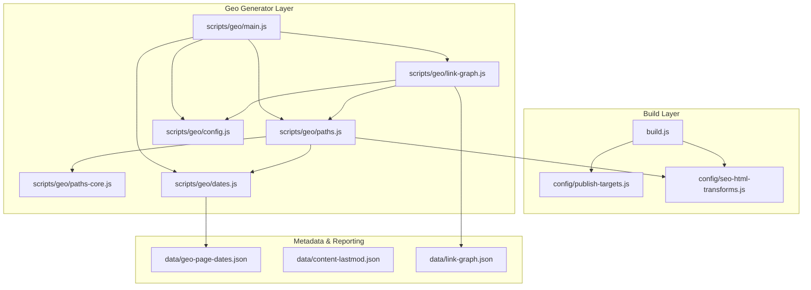
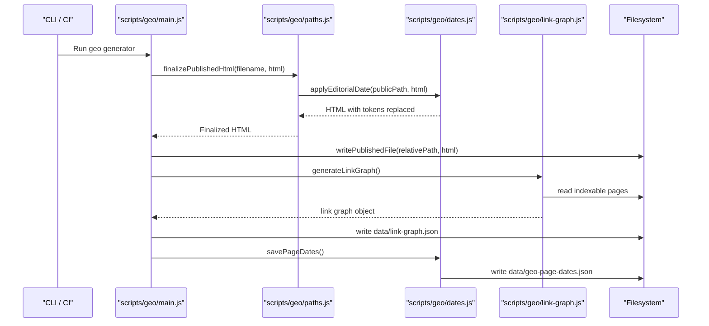
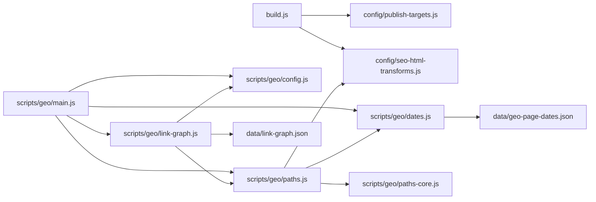

# Output Management & File Handling

<cite>
**Referenced Files in This Document**
- [build.js](file://build.js)
- [publish-targets.js](file://config/publish-targets.js)
- [seo-html-transforms.js](file://config/seo-html-transforms.js)
- [scripts/geo/main.js](file://scripts/geo/main.js)
- [scripts/geo/paths.js](file://scripts/geo/paths.js)
- [scripts/geo/paths-core.js](file://scripts/geo/paths-core.js)
- [scripts/geo/dates.js](file://scripts/geo/dates.js)
- [scripts/geo/config.js](file://scripts/geo/config.js)
- [scripts/geo/link-graph.js](file://scripts/geo/link-graph.js)
- [data/geo-page-dates.json](file://data/geo-page-dates.json)
- [data/content-lastmod.json](file://data/content-lastmod.json)
- [data/link-graph.json](file://data/link-graph.json)
- [.github/workflows/weekly-pseo.yml](file://.github/workflows/weekly-pseo.yml)
- [.github/workflows/daily-blog.yml](file://.github/workflows/daily-blog.yml)
</cite>

## Table of Contents
1. [Introduction](#introduction)
2. [Project Structure](#project-structure)
3. [Core Components](#core-components)
4. [Architecture Overview](#architecture-overview)
5. [Detailed Component Analysis](#detailed-component-analysis)
6. [Dependency Analysis](#dependency-analysis)
7. [Performance Considerations](#performance-considerations)
8. [Troubleshooting Guide](#troubleshooting-guide)
9. [Conclusion](#conclusion)
10. [Appendices](#appendices)

## Introduction
This document explains the output management system that generates, organizes, and tracks metadata for site pages. It covers file path resolution, directory structure conventions, naming rules for generated pages, editorial date tracking for SEO, internal link graph generation, reporting artifacts, cleanup and backup strategies, version control integration, and customization points for deployment pipelines.

## Project Structure
The output system spans three layers:
- Build layer: asset minification and HTML transformation pipeline
- Geo generator layer: page generation, finalization, and writing to publish root
- Metadata and reporting layer: editorial dates, last-modified tracking, and link graphs

**Diagram sources**
- [build.js:1-502](file://build.js#L1-L502)
- [publish-targets.js:1-37](file://config/publish-targets.js#L1-L37)
- [seo-html-transforms.js:1-800](file://config/seo-html-transforms.js#L1-L800)
- [scripts/geo/main.js:1-292](file://scripts/geo/main.js#L1-L292)
- [scripts/geo/paths.js:1-120](file://scripts/geo/paths.js#L1-L120)
- [scripts/geo/paths-core.js:1-26](file://scripts/geo/paths-core.js#L1-L26)
- [scripts/geo/dates.js:1-98](file://scripts/geo/dates.js#L1-L98)
- [scripts/geo/config.js:1-114](file://scripts/geo/config.js#L1-L114)
- [scripts/geo/link-graph.js:1-96](file://scripts/geo/link-graph.js#L1-L96)

**Section sources**
- [build.js:1-502](file://build.js#L1-L502)
- [publish-targets.js:1-37](file://config/publish-targets.js#L1-L37)
- [scripts/geo/main.js:1-292](file://scripts/geo/main.js#L1-L292)

## Core Components
- Build orchestration (assets and HTML): discovers inputs, minifies JS/CSS, transforms and minifies source HTML, writes to publish root.
- Geo generator: orchestrates city/service matrix generation, validates outputs, finalizes HTML, writes files, and persists editorial dates and link graphs.
- Path resolution: computes absolute publish paths, public URLs, and runtime script prefixes based on relative output location.
- Editorial date tracking: fingerprint-based persistence of last-modified dates per page; token replacement in HTML.
- Link graph: scans published indexable pages to build an internal linking map used for navigation aids and analysis.

**Section sources**
- [build.js:1-502](file://build.js#L1-L502)
- [scripts/geo/main.js:1-292](file://scripts/geo/main.js#L1-L292)
- [scripts/geo/paths.js:1-120](file://scripts/geo/paths.js#L1-L120)
- [scripts/geo/paths-core.js:1-26](file://scripts/geo/paths-core.js#L1-L26)
- [scripts/geo/dates.js:1-98](file://scripts/geo/dates.js#L1-L98)
- [scripts/geo/link-graph.js:1-96](file://scripts/geo/link-graph.js#L1-L96)

## Architecture Overview
The system composes a deterministic pipeline:
- Inputs are discovered from source HTML and explicit lists.
- Assets are transformed and written to the publish root.
- Geo-generated pages are finalized with SEO transforms, editorial dates, and runtime script normalization before being written.
- Post-generation, a link graph is built from published indexable pages.
- Dates and last-modified metadata are persisted as JSON artifacts.

**Diagram sources**
- [scripts/geo/main.js:1-292](file://scripts/geo/main.js#L1-L292)
- [scripts/geo/paths.js:1-120](file://scripts/geo/paths.js#L1-L120)
- [scripts/geo/dates.js:1-98](file://scripts/geo/dates.js#L1-L98)
- [scripts/geo/link-graph.js:1-96](file://scripts/geo/link-graph.js#L1-L96)

## Detailed Component Analysis

### Build Pipeline (Asset Minification and HTML Transform)
- Discovers HTML roots and skips configured directories.
- Extracts local JS/CSS references from HTML and resolves them to source assets.
- Minifies JS via Terser and CSS via LightningCSS with CleanCSS fallback.
- Optionally minifies source HTML from src/html, applying SEO transforms before minification.
- Outputs minified assets and transformed HTML into the publish root.

Key behaviors:
- Output path mapping preserves directory structure under publish root.
- Error handling logs failures and continues processing where possible.
- HTML minification is optional and only applies to source HTML paths.

**Section sources**
- [build.js:1-502](file://build.js#L1-L502)
- [publish-targets.js:1-37](file://config/publish-targets.js#L1-L37)
- [seo-html-transforms.js:1-800](file://config/seo-html-transforms.js#L1-L800)

### Geo Page Generation Orchestration
- Iterates cities and services according to GEN_TYPE and filters.
- Generates agenzia, realizzazione, and servizio×città pages using dedicated renderers.
- Validates each page; blocks output if validation issues are critical.
- Finalizes HTML through SEO transforms, entity normalization, and runtime script adjustments.
- Writes files unless in dry-run or validate-only modes.
- Persists editorial dates and builds the link graph artifact.

Naming conventions:
- Agenzia pages: agenzia-web-{city-slug}.html
- Realizzazione pages: realizzazione-siti-web-{city-slug}.html
- Service pages: {service-slug}-{city-slug}.html

Hub pages:
- Generated as index.html within their respective directories.

**Section sources**
- [scripts/geo/main.js:1-292](file://scripts/geo/main.js#L1-L292)
- [scripts/geo/config.js:1-114](file://scripts/geo/config.js#L1-L114)

### Path Resolution and Publishing
- Resolves absolute publish paths from relative segments.
- Computes public URL paths and normalizes index routes.
- Adjusts runtime script tags to point to correct cache-busted paths based on output depth.
- Preserves governed custom blocks from existing published files when overwriting.

Public path behavior:
- Ensures consistent leading slash and removes trailing index.html suffixes.
- Prepends relative prefix for scripts located deeper in the publish tree.

**Section sources**
- [scripts/geo/paths.js:1-120](file://scripts/geo/paths.js#L1-L120)
- [scripts/geo/paths-core.js:1-26](file://scripts/geo/paths-core.js#L1-L26)

### Editorial Date Tracking System
- Uses two tokens in templates: ISO date and human-readable Italian date.
- Computes a fingerprint from HTML content prior to date substitution to ensure stable timestamps across identical builds.
- Persists per-page fingerprints and dateModified values in a JSON store.
- Replaces tokens during finalization and writes the file.

SEO implications:
- Stable last-modified dates avoid unnecessary re-crawling when content has not changed.
- Human-readable dates improve user experience and transparency.

**Section sources**
- [scripts/geo/dates.js:1-98](file://scripts/geo/dates.js#L1-L98)
- [scripts/geo/config.js:1-114](file://scripts/geo/config.js#L1-L114)
- [data/geo-page-dates.json:1-800](file://data/geo-page-dates.json#L1-L800)

### Internal Link Graph Generation
- Scans all indexable geo pages in the publish root.
- Extracts internal hrefs, resolves to canonical paths, and filters out non-indexable targets.
- Classifies pages by type (agenzia, realizzazione, servizio) and enriches with city/service metadata.
- Writes a structured JSON artifact for downstream tools and navigation aids.

Use cases:
- Detecting orphaned pages and weak internal linking.
- Generating contextual “nearby cities” sections and hub navigation.

**Section sources**
- [scripts/geo/link-graph.js:1-96](file://scripts/geo/link-graph.js#L1-L96)
- [data/link-graph.json:1-800](file://data/link-graph.json#L1-L800)

### SEO HTML Transforms
- Applies robots directives based on path governance rules.
- Injects strategic internal links and localized content upgrades for specific pages.
- Normalizes review actions and entity JSON-LD for consistency.
- Handles homepage hero and core link block replacements.

Governance:
- Indexability decisions are driven by path classification (tiered).
- Non-public artifact patterns prevent sensitive or development-only paths from being indexed.

**Section sources**
- [seo-html-transforms.js:1-800](file://config/seo-html-transforms.js#L1-L800)

### Data Models and Artifacts
- geo-page-dates.json: stores version, and per-page fingerprint + dateModified.
- content-lastmod.json: maintains hash and lastmod for broader site content.
- link-graph.json: contains generated timestamp and array of page nodes with url, type, city, service, and linksTo arrays.

Example structures:
- Page date entry: { fingerprint: string, dateModified: string }
- Link graph node: { url: string, type: string, city?: string, service?: string, linksTo: string[] }

**Section sources**
- [data/geo-page-dates.json:1-800](file://data/geo-page-dates.json#L1-L800)
- [data/content-lastmod.json:1-800](file://data/content-lastmod.json#L1-L800)
- [data/link-graph.json:1-800](file://data/link-graph.json#L1-L800)

## Dependency Analysis
The following diagram shows key dependencies between modules:

**Diagram sources**
- [build.js:1-502](file://build.js#L1-L502)
- [publish-targets.js:1-37](file://config/publish-targets.js#L1-L37)
- [seo-html-transforms.js:1-800](file://config/seo-html-transforms.js#L1-L800)
- [scripts/geo/main.js:1-292](file://scripts/geo/main.js#L1-L292)
- [scripts/geo/config.js:1-114](file://scripts/geo/config.js#L1-L114)
- [scripts/geo/paths.js:1-120](file://scripts/geo/paths.js#L1-L120)
- [scripts/geo/paths-core.js:1-26](file://scripts/geo/paths-core.js#L1-L26)
- [scripts/geo/dates.js:1-98](file://scripts/geo/dates.js#L1-L98)
- [scripts/geo/link-graph.js:1-96](file://scripts/geo/link-graph.js#L1-L96)
- [data/geo-page-dates.json:1-800](file://data/geo-page-dates.json#L1-L800)
- [data/link-graph.json:1-800](file://data/link-graph.json#L1-L800)

**Section sources**
- [scripts/geo/main.js:1-292](file://scripts/geo/main.js#L1-L292)
- [scripts/geo/paths.js:1-120](file://scripts/geo/paths.js#L1-L120)
- [scripts/geo/dates.js:1-98](file://scripts/geo/dates.js#L1-L98)
- [scripts/geo/link-graph.js:1-96](file://scripts/geo/link-graph.js#L1-L96)

## Performance Considerations
- Asset discovery scans HTML files recursively; keep HTML roots minimal to reduce IO.
- CSS minification prefers LightningCSS with a safe CleanCSS fallback; forced fallback can be configured per file.
- HTML minification is optional and limited to src/html; geo-generated pages bypass this step to preserve dynamic content.
- Editorial date fingerprinting avoids repeated writes when content is unchanged, reducing filesystem churn.
- Link graph generation reads all indexable pages; consider filtering or batching for very large sites.

[No sources needed since this section provides general guidance]

## Troubleshooting Guide
Common issues and resolutions:
- Missing publish directory: Ensure PUBLISH_DIR is set via CLI or environment variables.
- Validation failures: Review blocked pages flagged by the geo generator; fix content or schema issues.
- Date persistence not updating: Confirm tokens exist in templates and that the build is not in dry-run or validate-only mode.
- Link graph errors: Verify that indexable pages exist in the publish root before running graph generation.
- Asset minification failures: Check for unsupported CSS features or missing input files; use overrides to force fallback engines.

Operational checks:
- Inspect data/geo-page-dates.json for stale entries or missing pages.
- Validate data/link-graph.json completeness against expected page counts.
- Review build logs for skipped or errored assets.

**Section sources**
- [scripts/geo/main.js:1-292](file://scripts/geo/main.js#L1-L292)
- [scripts/geo/dates.js:1-98](file://scripts/geo/dates.js#L1-L98)
- [scripts/geo/link-graph.js:1-96](file://scripts/geo/link-graph.js#L1-L96)
- [build.js:1-502](file://build.js#L1-L502)

## Conclusion
The output management system provides a robust, deterministic pipeline for generating localized pages, maintaining SEO-friendly metadata, and producing actionable artifacts like link graphs. Its modular design enables customization of paths, metadata, and transformations while integrating smoothly with CI/CD workflows for automated updates and quality gates.

[No sources needed since this section summarizes without analyzing specific files]

## Appendices

### Customizing Output Paths
- Configure publish root via --out-dir or PUBLISH_DIR environment variable.
- Report artifacts default to build/public-artifact unless overridden by REPORT_DIR or --report-dir.
- Base page templates reside under templates/base-pages; adjust these to change page skeletons.

**Section sources**
- [publish-targets.js:1-37](file://config/publish-targets.js#L1-L37)
- [scripts/geo/config.js:1-114](file://scripts/geo/config.js#L1-L114)

### Extending Metadata Tracking
- Add new tokens to templates and handle them in applyEditorialDate.
- Extend geo-page-dates.json schema carefully to maintain backward compatibility.
- Integrate additional metrics into content-lastmod.json for broader site-wide tracking.

**Section sources**
- [scripts/geo/dates.js:1-98](file://scripts/geo/dates.js#L1-L98)
- [data/geo-page-dates.json:1-800](file://data/geo-page-dates.json#L1-L800)
- [data/content-lastmod.json:1-800](file://data/content-lastmod.json#L1-L800)

### Integrating with Deployment Pipelines
- Weekly pSEO workflow regenerates AI content blocks, geo pages, normalizes HTML, rebuilds assets, search index, sitemap, validates pages, monitors SEO, and submits URLs to IndexNow.
- Daily blog workflow is disabled by schedule; runs manually via workflow_dispatch with controlled article counts.

Recommended steps:
- Pin Node.js version and install dependencies with npm ci.
- Run geo generation, then normalize and build assets.
- Execute validation and monitoring before committing changes.
- Use selective file patterns to commit only relevant artifacts.

**Section sources**
- [.github/workflows/weekly-pseo.yml:1-120](file://.github/workflows/weekly-pseo.yml#L1-L120)
- [.github/workflows/daily-blog.yml:1-56](file://.github/workflows/daily-blog.yml#L1-L56)

### Cleanup and Backup Strategies
- Treat data/geo-page-dates.json and data/link-graph.json as versioned artifacts; commit to repository for traceability.
- Avoid deleting publish root in CI; rely on fresh checkout and overwrite semantics.
- Back up data artifacts periodically to prevent loss of editorial history and link graph snapshots.

[No sources needed since this section provides general guidance]