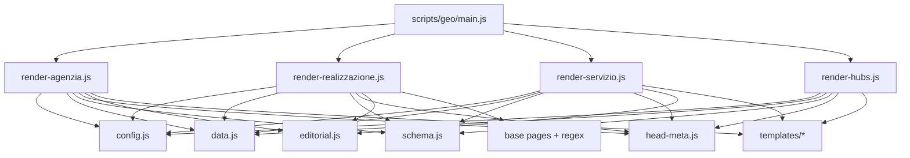
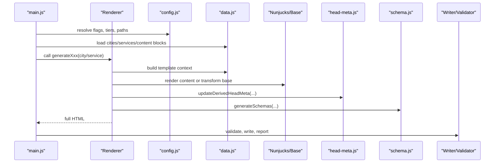
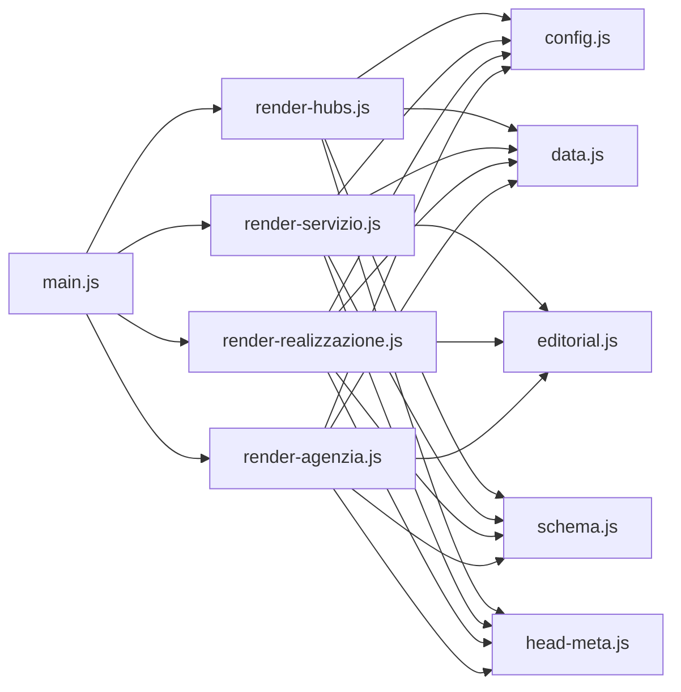
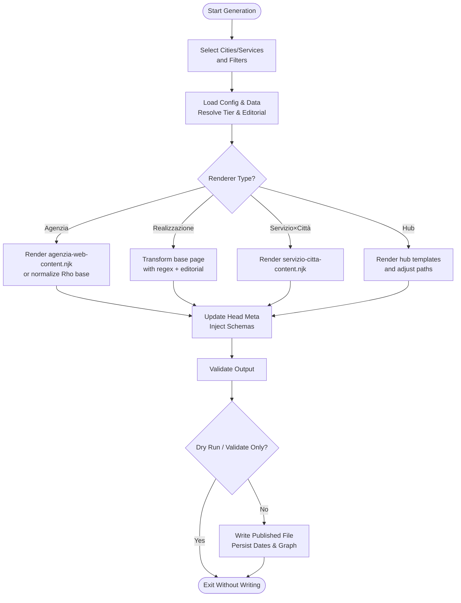

# Page Rendering Engines

<cite>
**Referenced Files in This Document**
- [scripts/geo/main.js](file://scripts/geo/main.js)
- [scripts/geo/render-agenzia.js](file://scripts/geo/render-agenzia.js)
- [scripts/geo/render-realizzazione.js](file://scripts/geo/render-realizzazione.js)
- [scripts/geo/render-servizio.js](file://scripts/geo/render-servizio.js)
- [scripts/geo/render-hubs.js](file://scripts/geo/render-hubs.js)
- [scripts/geo/config.js](file://scripts/geo/config.js)
- [scripts/geo/data.js](file://scripts/geo/data.js)
- [scripts/geo/schema.js](file://scripts/geo/schema.js)
- [scripts/geo/head-meta.js](file://scripts/geo/head-meta.js)
- [scripts/geo/editorial.js](file://scripts/geo/editorial.js)
- [templates/agenzia-web-content.njk](file://templates/agenzia-web-content.njk)
- [templates/servizio-citta-content.njk](file://templates/servizio-citta-content.njk)
- [templates/hub-agenzia-web.njk](file://templates/hub-agenzia-web.njk)
- [templates/hub-realizzazione-siti-web.njk](file://templates/hub-realizzazione-siti-web.njk)
- [templates/hub-zone-servite.njk](file://templates/hub-zone-servite.njk)
</cite>

## Table of Contents
1. Introduction
2. Project Structure
3. Core Components
4. Architecture Overview
5. Detailed Component Analysis
6. Dependency Analysis
7. Performance Considerations
8. Troubleshooting Guide
9. Conclusion
10. Appendices

## Introduction
This document explains the page rendering engines that generate geo-targeted pages for the site. It covers four renderer families:
- Agenzia (agency) city pages
- Realizzazione (website development) city pages
- Servizio×Città (service×city) pages
- Hubs (collection pages for agenzia, realizzazione, and zone-servite)

It details how raw data is transformed into final HTML, including template usage, data binding, content assembly, SEO optimization, schema markup generation, internal linking, customization options, template overrides, error handling, fallbacks, and performance considerations at scale.

## Project Structure
The geo generator is orchestrated by a CLI entry point that dispatches to specialized renderers. Each renderer loads shared configuration and data, prepares per-page context, renders templates or applies base-page transformations, injects schemas and metadata, and writes validated output.

**Diagram sources**
- [scripts/geo/main.js:33-36](file://scripts/geo/main.js#L33-L36)
- [scripts/geo/render-agenzia.js:4-31](file://scripts/geo/render-agenzia.js#L4-L31)
- [scripts/geo/render-realizzazione.js:4-31](file://scripts/geo/render-realizzazione.js#L4-L31)
- [scripts/geo/render-servizio.js:4-34](file://scripts/geo/render-servizio.js#L4-L34)
- [scripts/geo/render-hubs.js:4-20](file://scripts/geo/render-hubs.js#L4-L20)

**Section sources**
- [scripts/geo/main.js:38-225](file://scripts/geo/main.js#L38-L225)
- [scripts/geo/config.js:16-113](file://scripts/geo/config.js#L16-L113)
- [scripts/geo/data.js:15-118](file://scripts/geo/data.js#L15-L118)

## Core Components
- Orchestration: main.js selects which generators to run based on flags and filters, iterates cities/services, validates outputs, and persists results.
- Shared config: central constants, CLI flags, tier resolution, robots directives, and publish/report paths.
- Data layer: loads cities, services, approved AI content blocks, blog index, and Nunjucks environment with custom filters.
- Schema engine: generates JSON-LD (BreadcrumbList, WebPage, Service, OfferCatalog, FAQPage) and area-served entities.
- Head/meta engine: updates title, description, canonical, social tags, robots, hreflang, and normalizes hand-crafted Rho pages.
- Editorial overlay: optional per-city editorial copy and SEO overrides injected into body and head.
- Templates: Nunjucks templates for content sections; regex-based base-page substitution for realizzazione.

**Section sources**
- [scripts/geo/main.js:38-225](file://scripts/geo/main.js#L38-L225)
- [scripts/geo/config.js:16-113](file://scripts/geo/config.js#L16-L113)
- [scripts/geo/data.js:15-118](file://scripts/geo/data.js#L15-L118)
- [scripts/geo/schema.js:18-199](file://scripts/geo/schema.js#L18-L199)
- [scripts/geo/head-meta.js:18-156](file://scripts/geo/head-meta.js#L18-L156)
- [scripts/geo/editorial.js:6-63](file://scripts/geo/editorial.js#L6-L63)

## Architecture Overview
The pipeline transforms raw data into final HTML through these stages:
1. Selection and scoping (main.js)
2. Context preparation (config, data, editorial, copy)
3. Template rendering or base-page transformation
4. Metadata and schema injection
5. Validation and writing

**Diagram sources**
- [scripts/geo/main.js:38-225](file://scripts/geo/main.js#L38-L225)
- [scripts/geo/render-agenzia.js:34-188](file://scripts/geo/render-agenzia.js#L34-L188)
- [scripts/geo/render-realizzazione.js:33-199](file://scripts/geo/render-realizzazione.js#L33-L199)
- [scripts/geo/render-servizio.js:36-283](file://scripts/geo/render-servizio.js#L36-L283)
- [scripts/geo/render-hubs.js:51-289](file://scripts/geo/render-hubs.js#L51-L289)

## Detailed Component Analysis

### Agenzia Renderer (agenzia-web-<city>.html)
Responsibilities:
- Load base page for agenzia (Rho source), compute canonical and editorial overrides.
- Build template data: hero, local context, nearby cities, services grid, FAQs, blog links, tier classification, and optional Tier 1 content.
- Render Nunjucks content section, then assemble full page with head/nav/footer/tail.
- Inject JSON-LD schemas and finalize meta.

Template usage:
- Renders agenzia-web-content.njk with rich sections: hero, local context, services, area served, economic context, comparison table, process, sectors, FAQs, blog links, CTA.
- Supports Tier 1 editorial block when available.

Data binding examples:
- city.h1, city.heroCapsule, city.section1Title, city.section3Text, services, faqs, nearCitiesData, relatedPages, blogLinks, tier, isIndexable, today, site.

SEO and schema:
- Title/description/OG/Twitter via head-meta.
- Robots directive from governance.
- JSON-LD: BreadcrumbList, WebPage, Service with OfferCatalog, core service offers, FAQPage.

Internal linking:
- Nearby city links and blog links integrated in template and content.

Customization and overrides:
- Editorial record can override title, description, hero text, and inject a localized “contesto locale” section.
- Tier 1 JSON override adds a dedicated editorial section when present.

Error handling and fallbacks:
- If base page missing, returns null and marks failure.
- Validation blocks non-compliant pages; failures are counted and reported.

Performance notes:
- Single template render per city; minimal string manipulations after render.

**Section sources**
- [scripts/geo/render-agenzia.js:34-188](file://scripts/geo/render-agenzia.js#L34-L188)
- [templates/agenzia-web-content.njk:15-278](file://templates/agenzia-web-content.njk#L15-L278)
- [scripts/geo/schema.js:73-199](file://scripts/geo/schema.js#L73-L199)
- [scripts/geo/head-meta.js:123-145](file://scripts/geo/head-meta.js#L123-L145)
- [scripts/geo/editorial.js:13-56](file://scripts/geo/editorial.js#L13-L56)

### Realizzazione Renderer (realizzazione-siti-web-<city>.html)
Responsibilities:
- Load base page for realizzazione (Rho source).
- Apply extensive regex substitutions to localize copy, images, breadcrumbs, and schema placeholders.
- Inject editorial body if available, replace date tokens, and append geo links and Tier 1 content before </main>.
- Generate and inject JSON-LD schemas before </footer>.

Template usage:
- No Nunjucks content template; uses base page plus targeted replacements.
- Uses helper to render Tier 1 editorial block as HTML.

Data binding examples:
- City name, CAP, coordinates, province display, images, local market analysis, highlights, near cities.

SEO and schema:
- Updates head meta and OG/Twitter fields.
- Replaces LocalBusiness and Service-related strings with city-specific values.
- Appends JSON-LD schemas.

Internal linking:
- Builds geo links section and inserts into page.

Customization and overrides:
- Editorial body replaces first shared section with per-city copy.
- Tier 1 JSON override rendered as a structured section.

Error handling and fallbacks:
- Returns null if base page not found.
- Regex replacements are safe; missing image sets are handled by conditional logic.

Performance notes:
- Heavy string replacement but avoids template compilation overhead; suitable for large batches.

**Section sources**
- [scripts/geo/render-realizzazione.js:33-199](file://scripts/geo/render-realizzazione.js#L33-L199)
- [scripts/geo/render-realizzazione.js:202-235](file://scripts/geo/render-realizzazione.js#L202-L235)
- [scripts/geo/schema.js:73-199](file://scripts/geo/schema.js#L73-L199)
- [scripts/geo/head-meta.js:123-145](file://scripts/geo/head-meta.js#L123-L145)

### Servizio×Città Renderer ({service}-{city}.html)
Responsibilities:
- Compute page path, tier, canonical, and editorial overrides.
- Determine nearest city pages and other services in same city, restricted to indexable pages.
- Select FAQ pool based on service cluster (web build, marketing, strategy) and merge universal FAQs.
- Render servizio-citta-content.njk with service-specific sections, data-driven insights, and decision frameworks.
- Inject JSON-LD schemas (BreadcrumbList, WebPage, Service with Offer, FAQPage).

Template usage:
- Rich Nunjucks template with hero, service description, why/how we work, local market context, Tier 1 block, competitive insight, deliverables, intent queries, comparison table, FAQs, related pages, CTA.

Data binding examples:
- city, service, seo, faqs, aiContent, competitiveInsight, dataPoints, relatedCityPages, relatedServicePages, allCoreServices, agencyCityPageUrl, tier, isIndexable, today, site.

SEO and schema:
- Head meta updated with service+city keywords and canonical.
- JSON-LD includes Service with areaServed and Offer; FAQPage when FAQs exist.

Internal linking:
- Links to nearby service×city pages and other services in the same city; limited on de-amplified pages.

Customization and overrides:
- Editorial record can fully replace FAQs and inject localized “contesto locale”.
- Tier 1 JSON override adds unique editorial section for high-value pages.

Error handling and fallbacks:
- Returns null if base page missing.
- De-amplified pages omit heavy link-farm patterns to reduce doorway footprint.

Performance notes:
- Template render per combination; careful filtering reduces DOM size on de-amplified pages.

**Section sources**
- [scripts/geo/render-servizio.js:36-283](file://scripts/geo/render-servizio.js#L36-L283)
- [templates/servizio-citta-content.njk:21-374](file://templates/servizio-citta-content.njk#L21-L374)
- [scripts/geo/schema.js:18-71](file://scripts/geo/schema.js#L18-L71)
- [scripts/geo/head-meta.js:123-145](file://scripts/geo/head-meta.js#L123-L145)

### Hub Pages Generator (agenzia-web/, realizzazione-siti-web/, zone-servite/)
Responsibilities:
- Build three hub pages using shared helpers:
  - Agenzia Web hub listing cities with dedicated pages
  - Realizzazione Siti Web hub listing cities with dedicated pages
  - Zone Servite hub aggregating coverage scopes and service×city listings
- Convert relative asset paths to absolute for subdirectory serving.
- Inject JSON-LD CollectionPage schemas with hasPart references.

Template usage:
- hub-agenzia-web.njk, hub-realizzazione-siti-web.njk, hub-zone-servite.njk
- Grid layouts, city cards with avatars, compact grids, and anchorable sections.

Data binding examples:
- cities, networkCoverageCount, totalCities, coreServices, geoServices, serviceCities, serviceCityCounts, coverageScopes, featuredCities, today, site.

SEO and schema:
- Head meta set per hub; CollectionPage schemas enumerate linked pages.

Internal linking:
- Strong interlinking between hubs and city/service pages; anchors for navigation.

Customization and overrides:
- CSS embedded inline for hub styling; no external dependencies required.

Error handling and fallbacks:
- Skips hub generation if base page missing; otherwise proceeds safely.

Performance notes:
- Single pass per hub; efficient list rendering; avoids heavy computations.

**Section sources**
- [scripts/geo/render-hubs.js:51-289](file://scripts/geo/render-hubs.js#L51-L289)
- [templates/hub-agenzia-web.njk:6-145](file://templates/hub-agenzia-web.njk#L6-L145)
- [templates/hub-realizzazione-siti-web.njk:6-118](file://templates/hub-realizzazione-siti-web.njk#L6-L118)
- [templates/hub-zone-servite.njk:10-165](file://templates/hub-zone-servite.njk#L10-L165)

## Dependency Analysis
Key relationships:
- main.js depends on renderers and utilities for orchestration.
- Renderers depend on config, data, schema, head-meta, editorial, and templates/base pages.
- data.js provides Nunjucks environment and shared datasets.
- schema.js builds JSON-LD structures used across renderers.
- head-meta.js rewrites head elements and normalizes hand-crafted pages.
- editorial.js overlays per-city editorial content and SEO overrides.

**Diagram sources**
- [scripts/geo/main.js:33-36](file://scripts/geo/main.js#L33-L36)
- [scripts/geo/render-agenzia.js:4-31](file://scripts/geo/render-agenzia.js#L4-L31)
- [scripts/geo/render-realizzazione.js:4-31](file://scripts/geo/render-realizzazione.js#L4-L31)
- [scripts/geo/render-servizio.js:4-34](file://scripts/geo/render-servizio.js#L4-L34)
- [scripts/geo/render-hubs.js:4-20](file://scripts/geo/render-hubs.js#L4-L20)

**Section sources**
- [scripts/geo/main.js:38-225](file://scripts/geo/main.js#L38-L225)
- [scripts/geo/config.js:16-113](file://scripts/geo/config.js#L16-L113)
- [scripts/geo/data.js:15-118](file://scripts/geo/data.js#L15-L118)

## Performance Considerations
- Batch generation: main.js loops over cities/services with early skips for filtered targets; supports dry-run and validate-only modes to reduce IO.
- Template vs regex: agenzia and servizio×città use Nunjucks for maintainability; realizzazione uses regex for speed and simplicity. Choose approach based on complexity and volume.
- Content enrichment: AI content blocks are loaded once and reused; avoid repeated file reads inside loops.
- Schema generation: centralized in schema.js to minimize duplication and ensure consistency.
- Asset path normalization: hubs convert relative paths to absolute in one pass to prevent runtime lookups.
- Validation gating: validation runs before write; blocked pages do not consume disk or downstream processing.

[No sources needed since this section provides general guidance]

## Troubleshooting Guide
Common issues and remedies:
- Missing base page: renderers return null and log an error; ensure base pages exist in templates/base-pages.
- Validation failures: pages with critical issues are blocked; inspect validation logs and fix content or structure.
- Empty or invalid editorial records: applyEditorialSeoOverrides safely falls back to defaults; verify editorial files.
- Missing AI content blocks: content falls back to localContext or default copy; ensure approved blocks are present.
- Path resolution errors: confirm PUBLISH_DIR and REPORT_DIR settings; check relative vs absolute paths in hubs.
- Date token replacement: PAGE_DATE_ISO_TOKEN and PAGE_DATE_HUMAN_TOKEN must be replaced consistently; rely on head-meta and base page patterns.

**Section sources**
- [scripts/geo/render-agenzia.js:34-39](file://scripts/geo/render-agenzia.js#L34-L39)
- [scripts/geo/render-realizzazione.js:33-38](file://scripts/geo/render-realizzazione.js#L33-L38)
- [scripts/geo/render-servizio.js:36-38](file://scripts/geo/render-servizio.js#L36-L38)
- [scripts/geo/main.js:87-102](file://scripts/geo/main.js#L87-L102)
- [scripts/geo/main.js:122-139](file://scripts/geo/main.js#L122-L139)
- [scripts/geo/main.js:163-179](file://scripts/geo/main.js#L163-L179)
- [scripts/geo/main.js:197-224](file://scripts/geo/main.js#L197-L224)

## Conclusion
The geo rendering system combines templated content, base-page transformations, editorial overlays, and robust schema generation to produce scalable, SEO-optimized geo pages. The architecture separates concerns cleanly: orchestration, data, rendering, metadata, and validation. Customization points include editorial records, Tier 1 content blocks, and service-specific FAQ pools. Error handling ensures fail-fast behavior and consistent reporting. For large-scale rendering, prefer template-based renderers for maintainability and regex-based substitution where performance is critical.

[No sources needed since this section summarizes without analyzing specific files]

## Appendices

### Rendering Pipeline Flowchart

**Diagram sources**
- [scripts/geo/main.js:38-225](file://scripts/geo/main.js#L38-L225)
- [scripts/geo/render-agenzia.js:34-188](file://scripts/geo/render-agenzia.js#L34-L188)
- [scripts/geo/render-realizzazione.js:33-199](file://scripts/geo/render-realizzazione.js#L33-L199)
- [scripts/geo/render-servizio.js:36-283](file://scripts/geo/render-servizio.js#L36-L283)
- [scripts/geo/render-hubs.js:51-289](file://scripts/geo/render-hubs.js#L51-L289)

### Creating and Extending Renderers
Steps to create a new renderer:
1. Add a new function in a dedicated module under scripts/geo/.
2. Use config.js for constants, tier resolution, and robots directives.
3. Load data via data.js (cities, services, content blocks, Nunjucks env).
4. Prepare template context or base-page transformations.
5. Render content and assemble full HTML with head/nav/footer/tail.
6. Update derived head meta via head-meta.js.
7. Generate JSON-LD schemas via schema.js.
8. Integrate with main.js loop and validation pipeline.
9. Add tests and validation rules to ensure compliance.

Extending existing renderers:
- Add new template sections or variables in Nunjucks templates.
- Extend editorial records to inject new sections or override SEO.
- Expand FAQ pools or decision framework sections in servizio×città.
- Adjust hub templates to include new collections or filters.

[No sources needed since this section provides general guidance]