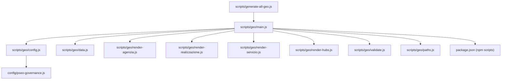
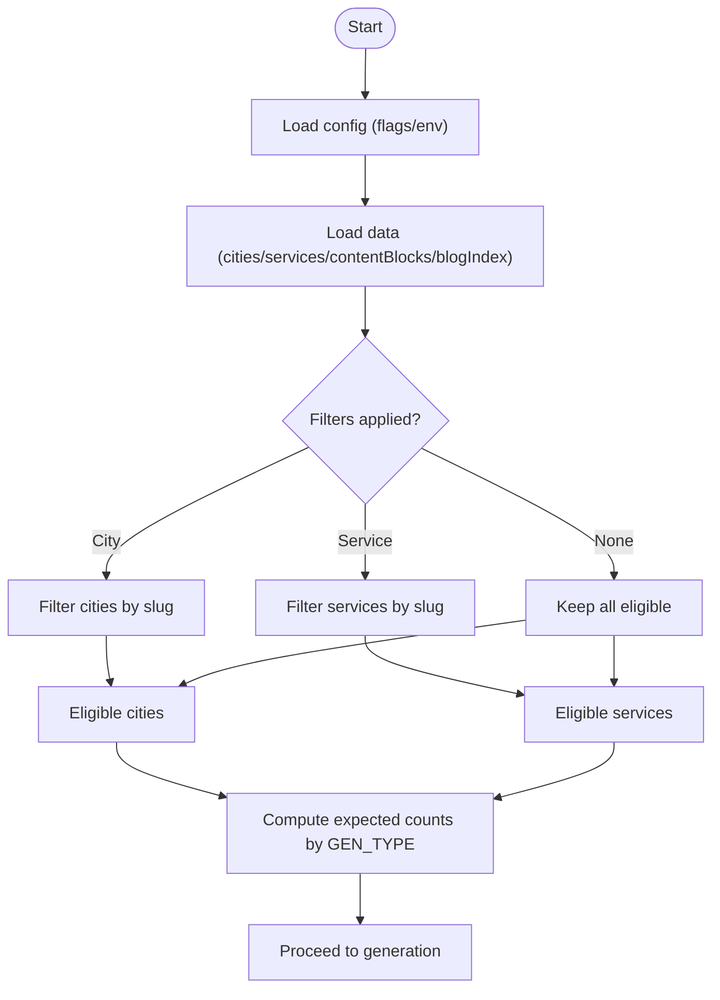
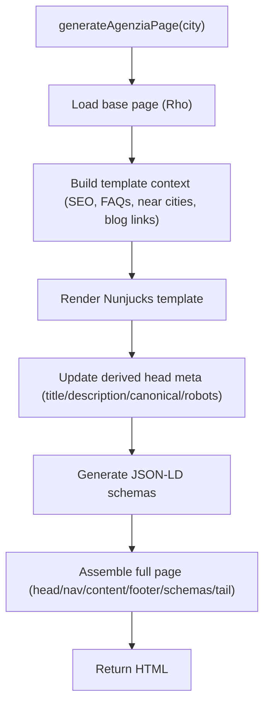
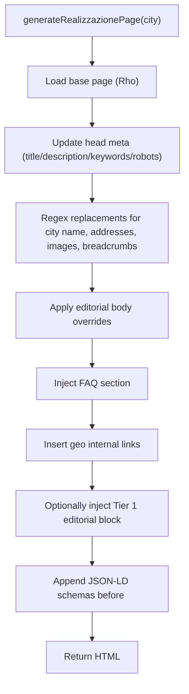
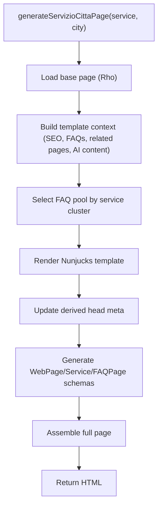
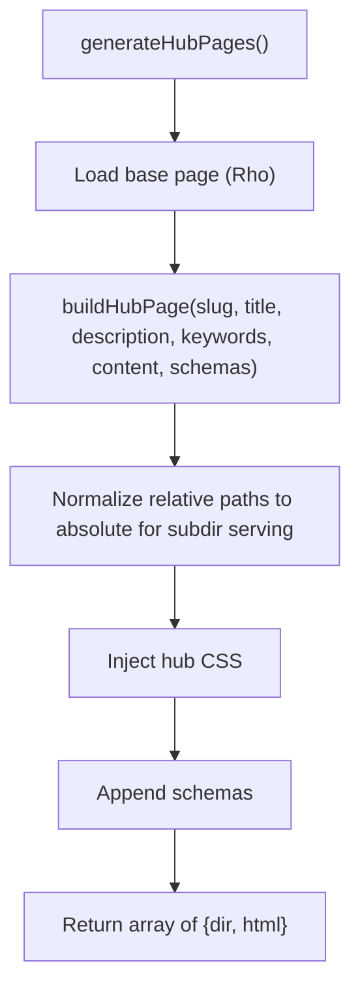
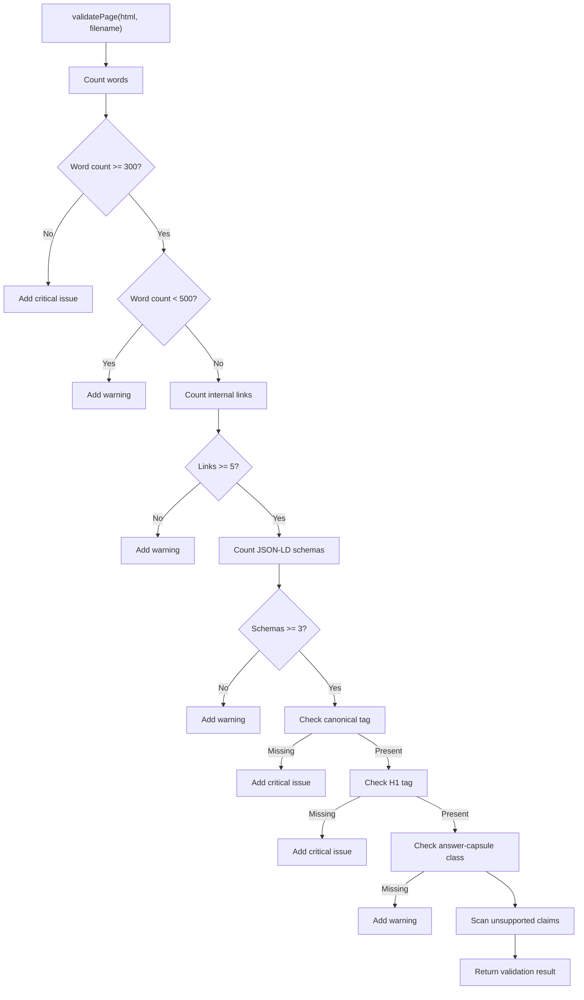
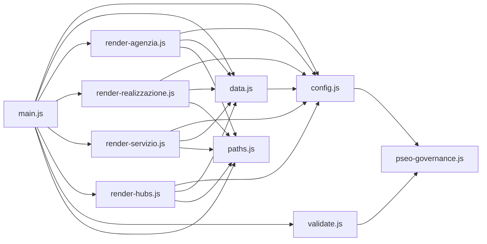

# Pipeline Orchestration & Execution Flow

<cite>
**Referenced Files in This Document**
- [scripts/generate-all-geo.js](file://scripts/generate-all-geo.js)
- [scripts/geo/main.js](file://scripts/geo/main.js)
- [scripts/geo/config.js](file://scripts/geo/config.js)
- [scripts/geo/data.js](file://scripts/geo/data.js)
- [scripts/geo/render-agenzia.js](file://scripts/geo/render-agenzia.js)
- [scripts/geo/render-realizzazione.js](file://scripts/geo/render-realizzazione.js)
- [scripts/geo/render-servizio.js](file://scripts/geo/render-servizio.js)
- [scripts/geo/render-hubs.js](file://scripts/geo/render-hubs.js)
- [scripts/geo/validate.js](file://scripts/geo/validate.js)
- [scripts/geo/paths.js](file://scripts/geo/paths.js)
- [config/pseo-governance.js](file://config/pseo-governance.js)
- [package.json](file://package.json)
</cite>

## Table of Contents
1. [Introduction](#introduction)
2. [Project Structure](#project-structure)
3. [Core Components](#core-components)
4. [Architecture Overview](#architecture-overview)
5. [Detailed Component Analysis](#detailed-component-analysis)
6. [Dependency Analysis](#dependency-analysis)
7. [Performance Considerations](#performance-considerations)
8. [Troubleshooting Guide](#troubleshooting-guide)
9. [Conclusion](#conclusion)
10. [Appendices](#appendices)

## Introduction
This document explains the pipeline orchestration system that coordinates the entire geo page generation workflow for WebNovis. It covers initialization, target filtering logic, sequential processing of different page types (agenzia, realizzazione, servizio×città, hubs), command-line interface options, environment variables, configuration parameters, error handling strategy, progress reporting, validation gates, and extension guidance. Concrete execution modes (dry run, validate only, full generation) and monitoring capabilities are included to help operators run, observe, and troubleshoot the pipeline effectively.

## Project Structure
The geo generator is implemented under scripts/geo with a clear separation of concerns:
- Entry point and orchestration: scripts/generate-all-geo.js delegates to scripts/geo/main.js
- Configuration and CLI parsing: scripts/geo/config.js
- Data loading and Nunjucks setup: scripts/geo/data.js
- Page generators: render-agenzia.js, render-realizzazione.js, render-servizio.js, render-hubs.js
- Validation and finalization: validate.js, paths.js
- Governance and indexation policy: config/pseo-governance.js
- NPM scripts for invocation: package.json



**Diagram sources**
- [scripts/generate-all-geo.js:1-58](file://scripts/generate-all-geo.js#L1-L58)
- [scripts/geo/main.js:1-292](file://scripts/geo/main.js#L1-L292)
- [scripts/geo/config.js:1-114](file://scripts/geo/config.js#L1-L114)
- [scripts/geo/data.js:1-197](file://scripts/geo/data.js#L1-L197)
- [scripts/geo/render-agenzia.js:1-194](file://scripts/geo/render-agenzia.js#L1-L194)
- [scripts/geo/render-realizzazione.js:1-241](file://scripts/geo/render-realizzazione.js#L1-L241)
- [scripts/geo/render-servizio.js:1-289](file://scripts/geo/render-servizio.js#L1-L289)
- [scripts/geo/render-hubs.js:1-296](file://scripts/geo/render-hubs.js#L1-L296)
- [scripts/geo/validate.js:1-55](file://scripts/geo/validate.js#L1-L55)
- [scripts/geo/paths.js:1-120](file://scripts/geo/paths.js#L1-L120)
- [config/pseo-governance.js:1-200](file://config/pseo-governance.js#L1-L200)
- [package.json:1-92](file://package.json#L1-L92)

**Section sources**
- [scripts/generate-all-geo.js:1-58](file://scripts/generate-all-geo.js#L1-L58)
- [scripts/geo/main.js:1-292](file://scripts/geo/main.js#L1-L292)
- [scripts/geo/config.js:1-114](file://scripts/geo/config.js#L1-L114)
- [scripts/geo/data.js:1-197](file://scripts/geo/data.js#L1-L197)
- [config/pseo-governance.js:1-200](file://config/pseo-governance.js#L1-L200)
- [package.json:1-92](file://package.json#L1-L92)

## Core Components
- Entrypoint and orchestrator: scripts/generate-all-geo.js re-exports main() and key helpers; when executed directly it calls main().
- Orchestrator: scripts/geo/main.js drives initialization, target filtering, sequential generation of each page type, validation, writing outputs, link graph generation, and summary reporting.
- Configuration: scripts/geo/config.js parses CLI flags and environment variables, defines constants, and exposes helper functions for tier classification and robots directives.
- Data layer: scripts/geo/data.js loads cities/services JSON, content blocks, blog index, and configures Nunjucks.
- Generators:
  - render-agenzia.js: generates agenzia-web pages per city using Nunjucks template and base HTML.
  - render-realizzazione.js: generates realizzazione-siti-web pages via regex-based base template substitution.
  - render-servizio.js: generates servizio×città combinatorial pages using Nunjucks template and service-city context.
  - render-hubs.js: generates hub pages aggregating indexable pages for internal linking.
- Validation: scripts/geo/validate.js enforces fail-closed checks on word count, links, schema presence, canonical/H1 tags, answer capsule, and unsupported claims.
- Finalization and publishing: scripts/geo/paths.js handles base page caching, SEO transforms, entity normalization, de-amplified anchor removal, runtime script normalization, date injection, and file writing.

**Section sources**
- [scripts/generate-all-geo.js:1-58](file://scripts/generate-all-geo.js#L1-L58)
- [scripts/geo/main.js:1-292](file://scripts/geo/main.js#L1-L292)
- [scripts/geo/config.js:1-114](file://scripts/geo/config.js#L1-L114)
- [scripts/geo/data.js:1-197](file://scripts/geo/data.js#L1-L197)
- [scripts/geo/render-agenzia.js:1-194](file://scripts/geo/render-agenzia.js#L1-L194)
- [scripts/geo/render-realizzazione.js:1-241](file://scripts/geo/render-realizzazione.js#L1-L241)
- [scripts/geo/render-servizio.js:1-289](file://scripts/geo/render-servizio.js#L1-L289)
- [scripts/geo/render-hubs.js:1-296](file://scripts/geo/render-hubs.js#L1-L296)
- [scripts/geo/validate.js:1-55](file://scripts/geo/validate.js#L1-L55)
- [scripts/geo/paths.js:1-120](file://scripts/geo/paths.js#L1-L120)

## Architecture Overview
The pipeline follows a deterministic sequence:
1. Initialization: load configuration, data, and Nunjucks environment; compute expected counts based on GEN_TYPE and filters.
2. Target filtering: apply city/service filters and generate eligibility predicates.
3. Sequential generation:
   - Agenzia pages per eligible city
   - Realizzazione pages per eligible city
   - Servizio×Città pages across eligible services × eligible cities
   - Hub pages aggregating indexable targets
4. Validation: each generated HTML is validated; critical issues block output.
5. Publishing: write files unless DRY_RUN or VALIDATE_ONLY; finalize HTML with SEO transforms and date injection.
6. Link graph: generate and persist link-graph.json after successful writes.
7. Summary: report counts, warnings, and exit code if failures or mismatches occur.

```mermaid
sequenceDiagram
participant CLI as "CLI / npm"
participant Entrypoint as "generate-all-geo.js"
participant Main as "main.js"
participant Config as "config.js"
participant Data as "data.js"
participant GenA as "render-agenzia.js"
participant GenR as "render-realizzazione.js"
participant GenS as "render-servizio.js"
participant GenH as "render-hubs.js"
participant Val as "validate.js"
participant Paths as "paths.js"
CLI->>Entrypoint : node scripts/generate-all-geo.js [flags]
Entrypoint->>Main : main()
Main->>Config : parse args/env, resolve ROOT/PUBLISH_DIR/REPORT_DIR
Main->>Data : load cities/services/contentBlocks/njk
Main->>Main : compute expected counts by GEN_TYPE + filters
loop For each page type
alt Agenzia
Main->>GenA : generateAgenziaPage(city)
GenA-->>Main : html or null
alt Realizzazione
Main->>GenR : generateRealizzazionePage(city)
GenR-->>Main : html or null
alt Servizio×Città
Main->>GenS : generateServizioCittaPage(service, city)
GenS-->>Main : html or null
alt Hubs
Main->>GenH : generateHubPages()
GenH-->>Main : array of {dir, html}
end
Main->>Paths : finalizePublishedHtml(filename, html)
Main->>Val : validatePage(html, filename)
alt Critical issues
Main->>Main : increment blockedOrFailed
else OK
Main->>Paths : writePublishedFile(filename, html) (unless dry/validate-only)
Main->>Main : record success
end
end
Main->>Paths : generateLinkGraph() (if not dry/validate-only)
Main->>Main : save dates, print summary, set exitCode if needed
```

**Diagram sources**
- [scripts/generate-all-geo.js:1-58](file://scripts/generate-all-geo.js#L1-L58)
- [scripts/geo/main.js:1-292](file://scripts/geo/main.js#L1-L292)
- [scripts/geo/config.js:1-114](file://scripts/geo/config.js#L1-L114)
- [scripts/geo/data.js:1-197](file://scripts/geo/data.js#L1-L197)
- [scripts/geo/render-agenzia.js:1-194](file://scripts/geo/render-agenzia.js#L1-L194)
- [scripts/geo/render-realizzazione.js:1-241](file://scripts/geo/render-realizzazione.js#L1-L241)
- [scripts/geo/render-servizio.js:1-289](file://scripts/geo/render-servizio.js#L1-L289)
- [scripts/geo/render-hubs.js:1-296](file://scripts/geo/render-hubs.js#L1-L296)
- [scripts/geo/validate.js:1-55](file://scripts/geo/validate.js#L1-L55)
- [scripts/geo/paths.js:1-120](file://scripts/geo/paths.js#L1-L120)

## Detailed Component Analysis

### Command-Line Interface and Environment Variables
- Flags parsed by scripts/geo/config.js:
  - --dry-run: skip file writes
  - --validate-only: validate without generating/writing
  - --type=agenzia|realizzazione|servizio|hubs|all: control which page categories to generate
  - --out-dir=<path>: override publish directory
  - --report-dir=<path>: override report directory
  - --city=<slug1,slug2,...>: filter cities by slug
  - --service=<slug1,slug2,...>: filter services by slug
- Environment variables:
  - PUBLISH_DIR: fallback for output directory
  - REPORT_DIR: fallback for report directory
- Additional behavior:
  - Indexation policy from config/pseo-governance.js determines whether a path is indexable (tiered allowlist).
  - Robots meta built via buildRobotsContent uses governance helpers.

**Section sources**
- [scripts/geo/config.js:1-114](file://scripts/geo/config.js#L1-L114)
- [config/pseo-governance.js:1-200](file://config/pseo-governance.js#L1-L200)

### Initialization and Target Filtering
- Initialization:
  - Load cities/services/content blocks/blog index and configure Nunjucks.
  - Compute expected counts per category based on GEN_TYPE and filters.
- Target filtering:
  - matchesTargetCity and matchesTargetService use TARGET_CITY_SLUGS and TARGET_SERVICE_SLUGS sets.
  - shouldGenerateGeoForService excludes services explicitly opted out or legacy disabled.
  - Tier classification influences indexability and content variation.



**Diagram sources**
- [scripts/geo/main.js:1-292](file://scripts/geo/main.js#L1-L292)
- [scripts/geo/config.js:1-114](file://scripts/geo/config.js#L1-L114)
- [scripts/geo/data.js:1-197](file://scripts/geo/data.js#L1-L197)

**Section sources**
- [scripts/geo/main.js:1-292](file://scripts/geo/main.js#L1-L292)
- [scripts/geo/config.js:1-114](file://scripts/geo/config.js#L1-L114)
- [scripts/geo/data.js:1-197](file://scripts/geo/data.js#L1-L197)

### Agenzia Pages Generation
- Uses a base Rho page and Nunjucks template to assemble content per city.
- Applies editorial overrides, AI-enriched content blocks, FAQ resolution, and schema generation.
- Handles special case for Rho with hand-crafted normalization.



**Diagram sources**
- [scripts/geo/render-agenzia.js:1-194](file://scripts/geo/render-agenzia.js#L1-L194)

**Section sources**
- [scripts/geo/render-agenzia.js:1-194](file://scripts/geo/render-agenzia.js#L1-L194)

### Realizzazione Pages Generation
- Regex-based base template substitution tailored per city.
- Replaces location-specific strings, images, breadcrumbs, and body sections.
- Injects editorial body, geo links, and FAQ section; appends schemas before footer.



**Diagram sources**
- [scripts/geo/render-realizzazione.js:1-241](file://scripts/geo/render-realizzazione.js#L1-L241)

**Section sources**
- [scripts/geo/render-realizzazione.js:1-241](file://scripts/geo/render-realizzazione.js#L1-L241)

### Servizio×Città Pages Generation
- Combinatorial matrix: eligible services × eligible cities.
- Nunjucks template renders service-city specific content with cluster-aware FAQ pools and AI content selection.
- Builds related city/service pages and includes structured data (WebPage, Service, FAQPage).



**Diagram sources**
- [scripts/geo/render-servizio.js:1-289](file://scripts/geo/render-servizio.js#L1-L289)

**Section sources**
- [scripts/geo/render-servizio.js:1-289](file://scripts/geo/render-servizio.js#L1-L289)

### Hub Pages Generation
- Generates three hub pages: agenzia-web, realizzazione-siti-web, zone-servite.
- Aggregates indexable city/service pages and builds collection schemas.
- Normalizes relative paths for subdirectory serving and injects hub-specific CSS.



**Diagram sources**
- [scripts/geo/render-hubs.js:1-296](file://scripts/geo/render-hubs.js#L1-L296)

**Section sources**
- [scripts/geo/render-hubs.js:1-296](file://scripts/geo/render-hubs.js#L1-L296)

### Validation Gates and Error Handling
- validatePage enforces:
  - Minimum word count (critical below threshold, warning otherwise)
  - Internal links minimum
  - JSON-LD schema minimum
  - Canonical and H1 presence
  - Answer capsule class presence
  - Unsupported published claims detection
- Fail-closed strategy: any critical issue blocks writing and increments blocked/failed counters.
- Progress reporting: console logs per page with size, word count, links, and warnings; summary prints totals and mismatch errors.



**Diagram sources**
- [scripts/geo/validate.js:1-55](file://scripts/geo/validate.js#L1-L55)

**Section sources**
- [scripts/geo/validate.js:1-55](file://scripts/geo/validate.js#L1-L55)
- [scripts/geo/main.js:1-292](file://scripts/geo/main.js#L1-L292)

### Finalization and Publishing
- finalizePublishedHtml applies SEO transforms, entity normalization, de-amplified anchor removal, and runtime script normalization.
- writePublishedFile resolves publish path, applies editorial date tokens, creates directories, and writes HTML.
- Date persistence: savePageDates updates geo-page-dates.json after successful writes.

**Section sources**
- [scripts/geo/paths.js:1-120](file://scripts/geo/paths.js#L1-L120)
- [scripts/geo/main.js:1-292](file://scripts/geo/main.js#L1-L292)

## Dependency Analysis
The pipeline has clear module boundaries and dependencies:
- main.js depends on config, data, renderers, validate, paths, and link-graph utilities.
- config.js depends on pseo-governance for indexation policies and robots directives.
- data.js depends on config for publish/report dirs and content claim governance for approved blocks.
- renderers depend on config, data, paths, editorial, copy, schema, head-meta, and link-graph modules.
- validate.js depends on content claim governance and html-utils.



**Diagram sources**
- [scripts/geo/main.js:1-292](file://scripts/geo/main.js#L1-L292)
- [scripts/geo/config.js:1-114](file://scripts/geo/config.js#L1-L114)
- [scripts/geo/data.js:1-197](file://scripts/geo/data.js#L1-L197)
- [scripts/geo/render-agenzia.js:1-194](file://scripts/geo/render-agenzia.js#L1-L194)
- [scripts/geo/render-realizzazione.js:1-241](file://scripts/geo/render-realizzazione.js#L1-L241)
- [scripts/geo/render-servizio.js:1-289](file://scripts/geo/render-servizio.js#L1-L289)
- [scripts/geo/render-hubs.js:1-296](file://scripts/geo/render-hubs.js#L1-L296)
- [scripts/geo/validate.js:1-55](file://scripts/geo/validate.js#L1-L55)
- [scripts/geo/paths.js:1-120](file://scripts/geo/paths.js#L1-L120)
- [config/pseo-governance.js:1-200](file://config/pseo-governance.js#L1-L200)

**Section sources**
- [scripts/geo/main.js:1-292](file://scripts/geo/main.js#L1-L292)
- [scripts/geo/config.js:1-114](file://scripts/geo/config.js#L1-L114)
- [scripts/geo/data.js:1-197](file://scripts/geo/data.js#L1-L197)
- [scripts/geo/render-agenzia.js:1-194](file://scripts/geo/render-agenzia.js#L1-L194)
- [scripts/geo/render-realizzazione.js:1-241](file://scripts/geo/render-realizzazione.js#L1-L241)
- [scripts/geo/render-servizio.js:1-289](file://scripts/geo/render-servizio.js#L1-L289)
- [scripts/geo/render-hubs.js:1-296](file://scripts/geo/render-hubs.js#L1-L296)
- [scripts/geo/validate.js:1-55](file://scripts/geo/validate.js#L1-L55)
- [scripts/geo/paths.js:1-120](file://scripts/geo/paths.js#L1-L120)
- [config/pseo-governance.js:1-200](file://config/pseo-governance.js#L1-L200)

## Performance Considerations
- Base page caching: getBasePage caches base HTML to avoid repeated reads.
- Nunjucks configured with trim/lstrip for efficient rendering.
- Content blocks loaded once and reused across generators.
- Link graph generation runs only when not in dry/validate-only mode.
- Filesystem operations minimized by batching validations and conditional writes.

[No sources needed since this section provides general guidance]

## Troubleshooting Guide
Common issues and resolutions:
- Missing base pages: renderers log explicit errors if base pages are absent; ensure templates/base-pages contain required source files.
- Validation failures: check console output for critical issues (word count, canonical/H1 missing, unsupported claims); fix content or adjust thresholds if necessary.
- Blocked/failed counts: if blockedOrFailedTotal > 0 or expected vs actual mismatches, review per-category logs and validation issues.
- Dry run vs validate only: confirm flags are set correctly; no files will be written in these modes.
- Publish directory permissions: ensure PUBLISH_DIR is writable; verify environment variable or --out-dir setting.
- Report directory: REPORT_DIR controls where link-graph.json is saved; ensure it exists or is creatable.

**Section sources**
- [scripts/geo/validate.js:1-55](file://scripts/geo/validate.js#L1-L55)
- [scripts/geo/main.js:1-292](file://scripts/geo/main.js#L1-L292)
- [scripts/geo/paths.js:1-120](file://scripts/geo/paths.js#L1-L120)
- [scripts/geo/config.js:1-114](file://scripts/geo/config.js#L1-L114)

## Conclusion
The geo page generation pipeline is a robust, modular system that orchestrates multi-type page creation with strict validation and governance. It supports flexible targeting, fail-closed quality gates, and comprehensive reporting. Operators can confidently run dry runs, validation-only passes, or full generations while maintaining indexation policies and performance best practices.

[No sources needed since this section summarizes without analyzing specific files]

## Appendices

### Execution Modes and Examples
- Full generation:
  - npm run build:geo
  - node scripts/generate-all-geo.js
- Dry run:
  - npm run build:geo:dry
  - node scripts/generate-all-geo.js --dry-run
- Validate only:
  - npm run build:geo:validate
  - node scripts/generate-all-geo.js --validate-only
- Targeted city/service:
  - node scripts/generate-all-geo.js --type=servizio --city=rho,lainate --service=ecommerce,seo-locale
- Custom output/report dirs:
  - node scripts/generate-all-geo.js --out-dir=dist --report-dir=reports/geo

**Section sources**
- [package.json:1-92](file://package.json#L1-L92)
- [scripts/generate-all-geo.js:1-58](file://scripts/generate-all-geo.js#L1-L58)
- [scripts/geo/config.js:1-114](file://scripts/geo/config.js#L1-L114)

### Extending the Pipeline
- Add a new page type:
  - Implement a generator module following existing patterns (load base page, build context, render template or apply substitutions, generate schemas).
  - Integrate into main.js orchestration loop with expected counting and validation.
  - Update GEN_TYPE handling and hub aggregation if applicable.
- Add custom processing stages:
  - Insert steps between generation and validation (e.g., post-processing transforms) using paths.js helpers or a dedicated stage module.
  - Ensure fail-closed behavior by returning early on critical errors and updating blocked/failed counters.
- Governance and indexation:
  - Extend config/pseo-governance.js allowlists to include new paths as needed.
  - Use buildRobotsContent and resolvePageTier consistently for new pages.

**Section sources**
- [scripts/geo/main.js:1-292](file://scripts/geo/main.js#L1-L292)
- [scripts/geo/render-agenzia.js:1-194](file://scripts/geo/render-agenzia.js#L1-L194)
- [scripts/geo/render-realizzazione.js:1-241](file://scripts/geo/render-realizzazione.js#L1-L241)
- [scripts/geo/render-servizio.js:1-289](file://scripts/geo/render-servizio.js#L1-L289)
- [scripts/geo/render-hubs.js:1-296](file://scripts/geo/render-hubs.js#L1-L296)
- [scripts/geo/paths.js:1-120](file://scripts/geo/paths.js#L1-L120)
- [config/pseo-governance.js:1-200](file://config/pseo-governance.js#L1-L200)