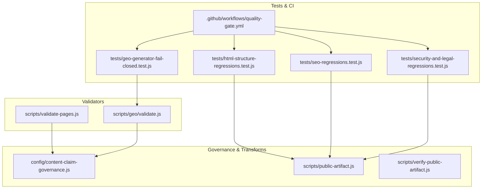
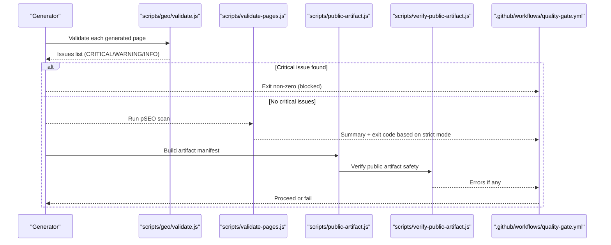
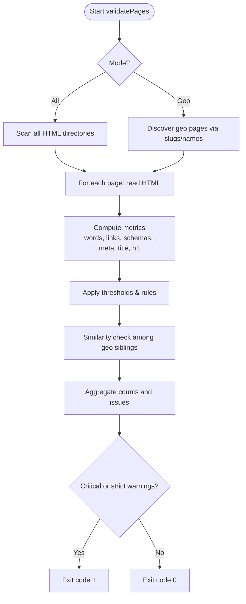
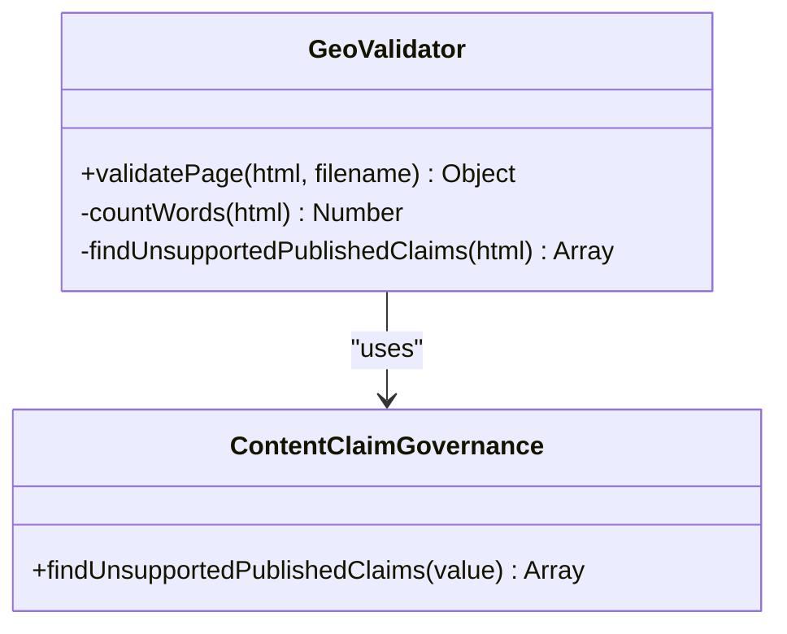
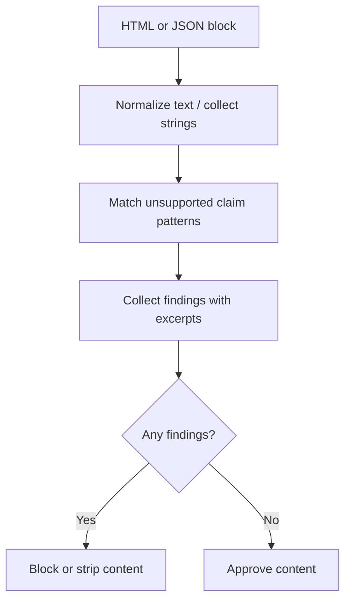
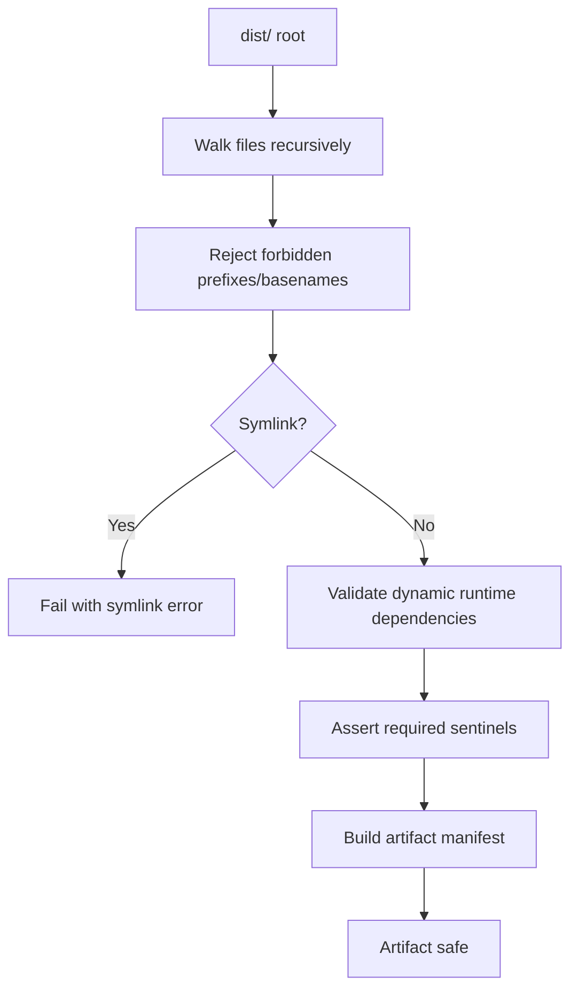
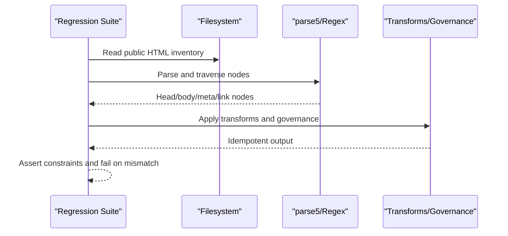
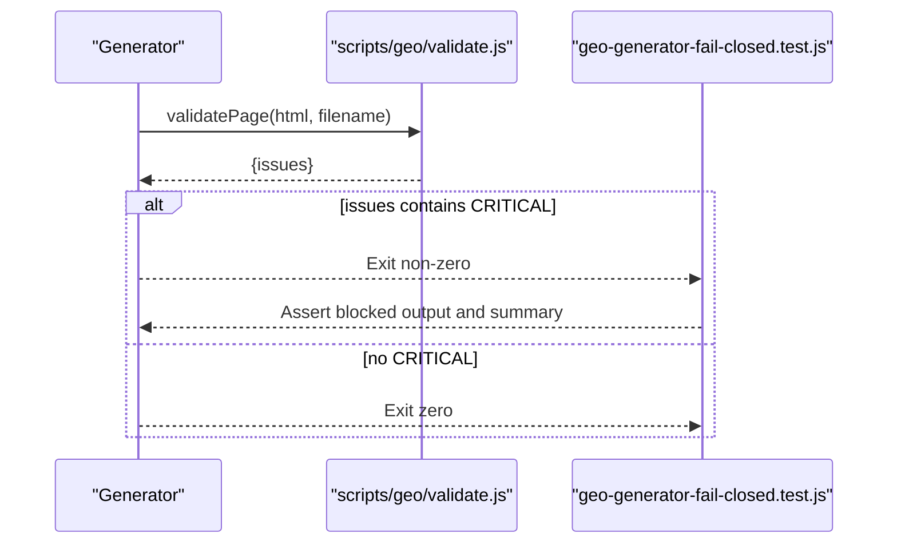
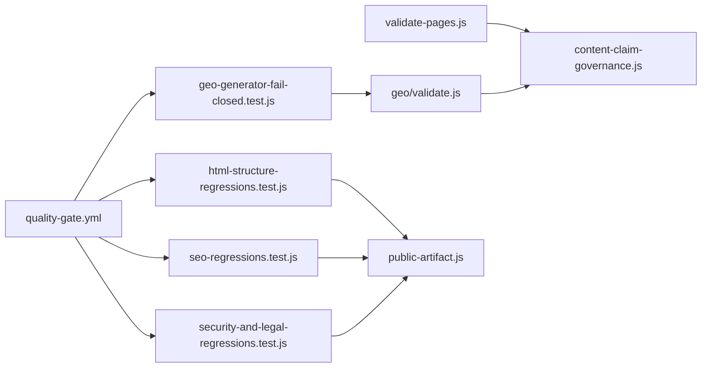

# Validation & Quality Assurance Framework

<cite>
**Referenced Files in This Document**
- [scripts/validate-pages.js](file://scripts/validate-pages.js)
- [scripts/geo/validate.js](file://scripts/geo/validate.js)
- [config/content-claim-governance.js](file://config/content-claim-governance.js)
- [tests/html-structure-regressions.test.js](file://tests/html-structure-regressions.test.js)
- [tests/seo-regressions.test.js](file://tests/seo-regressions.test.js)
- [tests/security-and-legal-regressions.test.js](file://tests/security-and-legal-regressions.test.js)
- [tests/geo-generator-fail-closed.test.js](file://tests/geo-generator-fail-closed.test.js)
- [scripts/public-artifact.js](file://scripts/public-artifact.js)
- [scripts/verify-public-artifact.js](file://scripts/verify-public-artifact.js)
- [.github/workflows/quality-gate.yml](file://.github/workflows/quality-gate.yml)
</cite>

## Table of Contents
1. Introduction
2. Project Structure
3. Core Components
4. Architecture Overview
5. Detailed Component Analysis
6. Dependency Analysis
7. Performance Considerations
8. Troubleshooting Guide
9. Conclusion
10. Appendices

## Introduction
This document describes the validation and quality assurance framework that ensures generated HTML pages meet editorial, SEO, accessibility, and structural standards before publication. It covers:
- Validation rules and thresholds for content quality
- Automated checks for meta tag normalization, SEO signals, accessibility landmarks, and structural integrity
- Fail-closed behavior integrated into the generator pipeline
- Reporting mechanisms, error classification (critical vs warning), and remediation guidance
- Extensibility points to customize or add new rules

## Project Structure
The framework spans three layers:
- Rule engines and validators (Node scripts)
- Governance and transforms (configuration modules)
- Regression tests and CI integration (test suites and GitHub Actions)

**Diagram sources**
- [scripts/validate-pages.js:1-433](file://scripts/validate-pages.js#L1-L433)
- [scripts/geo/validate.js:1-55](file://scripts/geo/validate.js#L1-L55)
- [config/content-claim-governance.js:1-240](file://config/content-claim-governance.js#L1-L240)
- [scripts/public-artifact.js:1-311](file://scripts/public-artifact.js#L1-L311)
- [scripts/verify-public-artifact.js:214-250](file://scripts/verify-public-artifact.js#L214-L250)
- [tests/html-structure-regressions.test.js:1-141](file://tests/html-structure-regressions.test.js#L1-L141)
- [tests/seo-regressions.test.js:1-493](file://tests/seo-regressions.test.js#L1-L493)
- [tests/security-and-legal-regressions.test.js:1-122](file://tests/security-and-legal-regressions.test.js#L1-L122)
- [tests/geo-generator-fail-closed.test.js:44-91](file://tests/geo-generator-fail-closed.test.js#L44-L91)
- [.github/workflows/quality-gate.yml](file://.github/workflows/quality-gate.yml)

**Section sources**
- [scripts/validate-pages.js:1-433](file://scripts/validate-pages.js#L1-L433)
- [scripts/geo/validate.js:1-55](file://scripts/geo/validate.js#L1-L55)
- [config/content-claim-governance.js:1-240](file://config/content-claim-governance.js#L1-L240)
- [scripts/public-artifact.js:1-311](file://scripts/public-artifact.js#L1-L311)
- [scripts/verify-public-artifact.js:214-250](file://scripts/verify-public-artifact.js#L214-L250)
- [tests/html-structure-regressions.test.js:1-141](file://tests/html-structure-regressions.test.js#L1-L141)
- [tests/seo-regressions.test.js:1-493](file://tests/seo-regressions.test.js#L1-L493)
- [tests/security-and-legal-regressions.test.js:1-122](file://tests/security-and-legal-regressions.test.js#L1-L122)
- [tests/geo-generator-fail-closed.test.js:44-91](file://tests/geo-generator-fail-closed.test.js#L44-L91)
- [.github/workflows/quality-gate.yml](file://.github/workflows/quality-gate.yml)

## Core Components
- Page Quality Validator (pSEO): Scans published HTML for word count, internal links, JSON-LD schemas, canonical tags, H1/title presence, meta description length, answer capsule, and Speakable markup. Provides per-page issues with severity levels and a similarity check across sibling geo pages.
- GEO Fail-Closed Validator: Enforces minimum content depth, link density, schema coverage, canonical/H1 presence, answer capsule, and unsupported claim detection; used by the generator to block outputs on critical findings.
- Content Claim Governance: Detects and blocks unapproved or risky claims in both generated and published text, preserving only approved custom blocks and stripping disallowed tier-1 editorial blocks.
- Public Artifact Safety: Validates allowed files, forbidden paths, dynamic runtime dependencies, and required sentinels; prevents unsafe publish targets and symlinks.
- Regression Tests: Assert structural correctness (doctype, head/body, required meta, hreflang/canonical alignment), SEO consistency (titles, descriptions, JSON-LD FAQ parity), security/legal compliance (headers, legal pages, no unverified ratings), and fail-closed behavior.

**Section sources**
- [scripts/validate-pages.js:34-77](file://scripts/validate-pages.js#L34-L77)
- [scripts/geo/validate.js:7-50](file://scripts/geo/validate.js#L7-L50)
- [config/content-claim-governance.js:17-60](file://config/content-claim-governance.js#L17-L60)
- [scripts/public-artifact.js:38-70](file://scripts/public-artifact.js#L38-L70)
- [tests/html-structure-regressions.test.js:58-96](file://tests/html-structure-regressions.test.js#L58-L96)
- [tests/seo-regressions.test.js:151-176](file://tests/seo-regressions.test.js#L151-L176)
- [tests/security-and-legal-regressions.test.js:41-66](file://tests/security-and-legal-regressions.test.js#L41-L66)

## Architecture Overview
The validation framework operates at build time and pre-publish stages:
- The generator produces HTML artifacts.
- The GEO validator runs against each page; critical failures cause immediate blocking (fail-closed).
- The pSEO validator scans all or selected pages and reports warnings/criticals and similarity anomalies.
- Public artifact verification enforces file safety and dependency integrity.
- Regression tests assert stable structure, SEO, and legal/security policies.
- CI quality gate executes these checks to prevent merging or publishing failing builds.

**Diagram sources**
- [scripts/geo/validate.js:7-50](file://scripts/geo/validate.js#L7-L50)
- [scripts/validate-pages.js:340-433](file://scripts/validate-pages.js#L340-L433)
- [scripts/public-artifact.js:222-282](file://scripts/public-artifact.js#L222-L282)
- [scripts/verify-public-artifact.js:214-250](file://scripts/verify-public-artifact.js#L214-L250)
- [.github/workflows/quality-gate.yml](file://.github/workflows/quality-gate.yml)

## Detailed Component Analysis

### Page Quality Validator (pSEO)
- Scans either geo pages or all HTML depending on flags.
- Computes unique/total words, internal links, JSON-LD schema count, canonical/H1/title presence, meta description length, answer capsule, and Speakable markup.
- Applies per-path threshold overrides for hubs, blog, portfolio, and specific pages.
- Performs trigram-based Jaccard similarity between sibling geo pages to detect near-duplicate content.
- Exits with code 1 when critical issues exist, or in strict mode when warnings are present.

**Diagram sources**
- [scripts/validate-pages.js:159-206](file://scripts/validate-pages.js#L159-L206)
- [scripts/validate-pages.js:210-304](file://scripts/validate-pages.js#L210-L304)
- [scripts/validate-pages.js:308-337](file://scripts/validate-pages.js#L308-L337)
- [scripts/validate-pages.js:340-433](file://scripts/validate-pages.js#L340-L433)

**Section sources**
- [scripts/validate-pages.js:34-77](file://scripts/validate-pages.js#L34-L77)
- [scripts/validate-pages.js:210-304](file://scripts/validate-pages.js#L210-L304)
- [scripts/validate-pages.js:308-337](file://scripts/validate-pages.js#L308-L337)
- [scripts/validate-pages.js:340-433](file://scripts/validate-pages.js#L340-L433)

### GEO Fail-Closed Validator
- Enforces minimum word count, internal links, schema count, canonical/H1 presence, and answer capsule.
- Integrates claim governance to reject pages containing unsupported published claims.
- Returns structured issues used by the generator to block outputs on critical findings.

**Diagram sources**
- [scripts/geo/validate.js:7-50](file://scripts/geo/validate.js#L7-L50)
- [config/content-claim-governance.js:158-186](file://config/content-claim-governance.js#L158-L186)

**Section sources**
- [scripts/geo/validate.js:7-50](file://scripts/geo/validate.js#L7-L50)
- [config/content-claim-governance.js:17-60](file://config/content-claim-governance.js#L17-L60)

### Content Claim Governance
- Normalizes HTML to text while preserving JSON-LD semantics where needed.
- Detects patterns for risky claims (e.g., guaranteed results, fixed response times, absolute performance promises).
- Preserves only approved custom blocks and strips unapproved tier-1 editorial blocks.
- Supports provenance metadata validation for approved content blocks.

**Diagram sources**
- [config/content-claim-governance.js:142-186](file://config/content-claim-governance.js#L142-L186)
- [config/content-claim-governance.js:188-226](file://config/content-claim-governance.js#L188-L226)

**Section sources**
- [config/content-claim-governance.js:17-60](file://config/content-claim-governance.js#L17-L60)
- [config/content-claim-governance.js:142-186](file://config/content-claim-governance.js#L142-L186)
- [config/content-claim-governance.js:188-226](file://config/content-claim-governance.js#L188-L226)

### Public Artifact Safety
- Defines allowed public files, forbidden prefixes/basenames, and media/font extensions.
- Walks the dist tree, rejects symlinks, and validates dynamic runtime dependencies.
- Builds an artifact manifest and asserts sentinel files exist.

**Diagram sources**
- [scripts/public-artifact.js:38-70](file://scripts/public-artifact.js#L38-L70)
- [scripts/public-artifact.js:195-216](file://scripts/public-artifact.js#L195-L216)
- [scripts/public-artifact.js:222-282](file://scripts/public-artifact.js#L222-L282)
- [scripts/verify-public-artifact.js:214-250](file://scripts/verify-public-artifact.js#L214-L250)

**Section sources**
- [scripts/public-artifact.js:38-70](file://scripts/public-artifact.js#L38-L70)
- [scripts/public-artifact.js:195-216](file://scripts/public-artifact.js#L195-L216)
- [scripts/public-artifact.js:222-282](file://scripts/public-artifact.js#L222-L282)
- [scripts/verify-public-artifact.js:214-250](file://scripts/verify-public-artifact.js#L214-L250)

### Regression Tests (Structure, SEO, Security/Legal)
- HTML structure: Ensures doctype, single html/head/body, required meta elements, robots directive, canonical/hreflang alignment, skip-link targets, and idempotent transforms.
- SEO: Validates titles/descriptions, JSON-LD FAQ parity, sitemap/noindex consistency, entity references, footer/link hygiene, and social meta alignment.
- Security/Legal: Confirms shared security headers usage, legal page landmarks, absence of unverified rating badges, and correct env documentation.

**Diagram sources**
- [tests/html-structure-regressions.test.js:37-116](file://tests/html-structure-regressions.test.js#L37-L116)
- [tests/seo-regressions.test.js:151-176](file://tests/seo-regressions.test.js#L151-L176)
- [tests/security-and-legal-regressions.test.js:41-66](file://tests/security-and-legal-regressions.test.js#L41-L66)

**Section sources**
- [tests/html-structure-regressions.test.js:58-96](file://tests/html-structure-regressions.test.js#L58-L96)
- [tests/seo-regressions.test.js:151-176](file://tests/seo-regressions.test.js#L151-L176)
- [tests/security-and-legal-regressions.test.js:41-66](file://tests/security-and-legal-regressions.test.js#L41-L66)

### Fail-Closed Integration
- The generator is expected to run the GEO validator per page; any CRITICAL finding must cause a non-zero exit and block publication.
- Tests assert that injecting an unsupported claim triggers failure and that the summary accurately reflects blocked outputs.

**Diagram sources**
- [scripts/geo/validate.js:7-50](file://scripts/geo/validate.js#L7-L50)
- [tests/geo-generator-fail-closed.test.js:44-91](file://tests/geo-generator-fail-closed.test.js#L44-L91)

**Section sources**
- [tests/geo-generator-fail-closed.test.js:44-91](file://tests/geo-generator-fail-closed.test.js#L44-L91)

## Dependency Analysis
Key relationships:
- Validators depend on governance modules for claim detection and on filesystem utilities for scanning.
- Tests depend on public artifact collectors and transform modules to assert stable outputs.
- CI orchestrates the full suite to enforce quality gates.

**Diagram sources**
- [scripts/validate-pages.js:1-433](file://scripts/validate-pages.js#L1-L433)
- [scripts/geo/validate.js:1-55](file://scripts/geo/validate.js#L1-L55)
- [config/content-claim-governance.js:1-240](file://config/content-claim-governance.js#L1-L240)
- [scripts/public-artifact.js:1-311](file://scripts/public-artifact.js#L1-L311)
- [tests/html-structure-regressions.test.js:1-141](file://tests/html-structure-regressions.test.js#L1-L141)
- [tests/seo-regressions.test.js:1-493](file://tests/seo-regressions.test.js#L1-L493)
- [tests/security-and-legal-regressions.test.js:1-122](file://tests/security-and-legal-regressions.test.js#L1-L122)
- [tests/geo-generator-fail-closed.test.js:44-91](file://tests/geo-generator-fail-closed.test.js#L44-L91)
- [.github/workflows/quality-gate.yml](file://.github/workflows/quality-gate.yml)

**Section sources**
- [scripts/validate-pages.js:1-433](file://scripts/validate-pages.js#L1-L433)
- [scripts/geo/validate.js:1-55](file://scripts/geo/validate.js#L1-L55)
- [config/content-claim-governance.js:1-240](file://config/content-claim-governance.js#L1-L240)
- [scripts/public-artifact.js:1-311](file://scripts/public-artifact.js#L1-L311)
- [tests/html-structure-regressions.test.js:1-141](file://tests/html-structure-regressions.test.js#L1-L141)
- [tests/seo-regressions.test.js:1-493](file://tests/seo-regressions.test.js#L1-L493)
- [tests/security-and-legal-regressions.test.js:1-122](file://tests/security-and-legal-regressions.test.js#L1-L122)
- [tests/geo-generator-fail-closed.test.js:44-91](file://tests/geo-generator-fail-closed.test.js#L44-L91)
- [.github/workflows/quality-gate.yml](file://.github/workflows/quality-gate.yml)

## Performance Considerations
- Word counting and similarity checks operate over stripped body text; keep HTML minimal and avoid heavy inline scripts/styles to reduce parsing overhead.
- Trigram similarity scales quadratically within groups; limit group sizes or cache results for large corpora.
- Public artifact walking should be confined to dist/ to avoid scanning source trees.
- Prefer regex-based checks for fast path validations; defer heavier DOM parsing to targeted tests.

[No sources needed since this section provides general guidance]

## Troubleshooting Guide
Common issues and remedies:
- Missing <title>, <h1>, or canonical: Add required tags and ensure canonical URL matches hreflang target.
- Short or missing meta description: Provide a concise, descriptive snippet within recommended length.
- Low internal links: Improve interlinking to hub pages and related services.
- Insufficient JSON-LD schemas: Include relevant structured data (e.g., WebPage, FAQPage) and ensure FAQ visibility matches schema.
- Unsupported claims: Remove or qualify risky statements; use approved custom blocks with proper provenance metadata.
- Non-idempotent transforms: Ensure global HTML transforms produce identical output on repeated application.
- Forbidden paths or missing sentinels: Review public artifact allowlist and ensure required files exist.

**Section sources**
- [scripts/validate-pages.js:222-285](file://scripts/validate-pages.js#L222-L285)
- [tests/html-structure-regressions.test.js:58-96](file://tests/html-structure-regressions.test.js#L58-L96)
- [tests/seo-regressions.test.js:151-176](file://tests/seo-regressions.test.js#L151-L176)
- [config/content-claim-governance.js:158-186](file://config/content-claim-governance.js#L158-L186)
- [scripts/public-artifact.js:38-70](file://scripts/public-artifact.js#L38-L70)

## Conclusion
The validation framework combines rule-based checks, governance-driven claim control, and robust regression testing to maintain high-quality, accessible, and SEO-compliant pages. Its fail-closed design ensures that critical issues block publication, while CI integrates these checks to enforce consistent quality across environments.

[No sources needed since this section summarizes without analyzing specific files]

## Appendices

### Validation Rules Summary
- Content depth: Minimum unique words per page type; stricter thresholds for hubs and specialized sections.
- Internal linking: Minimum number of internal links per page.
- Structured data: Minimum JSON-LD schemas; FAQPage must match visible FAQs.
- Meta and headings: Required <title>, <meta name="description">, <h1>, canonical, robots, viewport.
- GEO optimization: Presence of answer-capsule and optional SpeakableSpecification.
- Similarity: Detect near-duplicate content across sibling geo pages.
- Claims: Disallow unsupported or unqualified commercial/performance claims.

**Section sources**
- [scripts/validate-pages.js:34-77](file://scripts/validate-pages.js#L34-L77)
- [scripts/geo/validate.js:7-50](file://scripts/geo/validate.js#L7-L50)
- [config/content-claim-governance.js:17-60](file://config/content-claim-governance.js#L17-L60)

### Best Practices for Maintaining Page Quality
- Keep content original and sufficiently detailed; avoid template-only pages.
- Maintain strong internal linking to hubs and service pages.
- Ensure structured data aligns with visible content and avoids self-serving ratings.
- Use approved claim blocks with documented provenance; avoid absolute guarantees.
- Regularly run regression tests locally and in CI to catch drift early.

**Section sources**
- [tests/seo-regressions.test.js:151-176](file://tests/seo-regressions.test.js#L151-L176)
- [config/content-claim-governance.js:69-95](file://config/content-claim-governance.js#L69-L95)

### Customizing and Extending the Framework
- Add new thresholds or overrides in the page validator configuration.
- Extend claim governance patterns to cover emerging risks.
- Introduce additional structural or SEO assertions in regression tests.
- Update public artifact allowlists and sentinel requirements as needed.

**Section sources**
- [scripts/validate-pages.js:34-77](file://scripts/validate-pages.js#L34-L77)
- [config/content-claim-governance.js:17-60](file://config/content-claim-governance.js#L17-L60)
- [scripts/public-artifact.js:38-70](file://scripts/public-artifact.js#L38-L70)