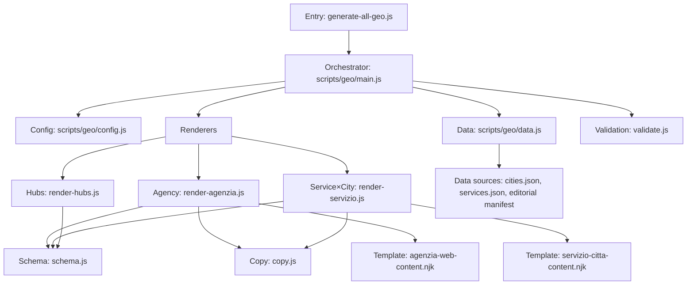
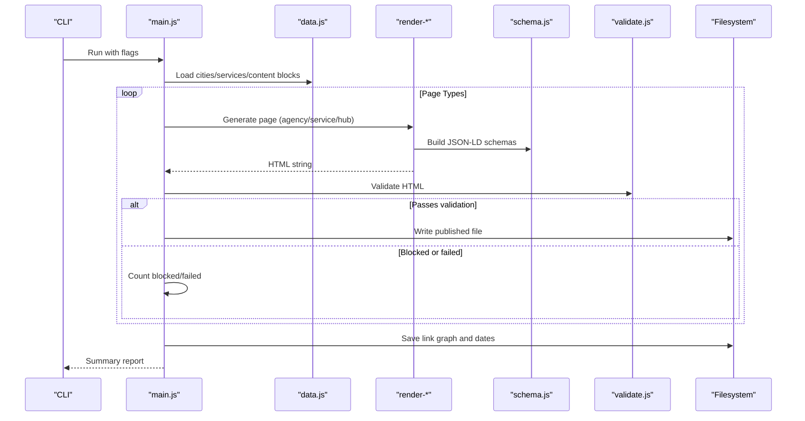
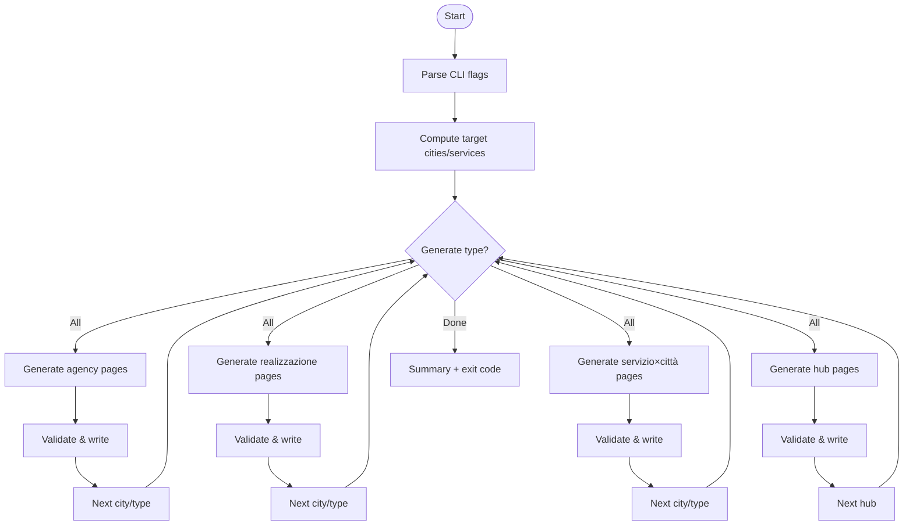
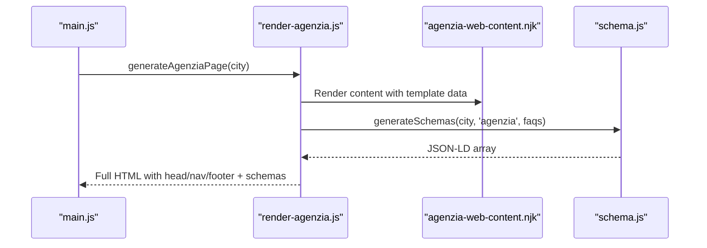
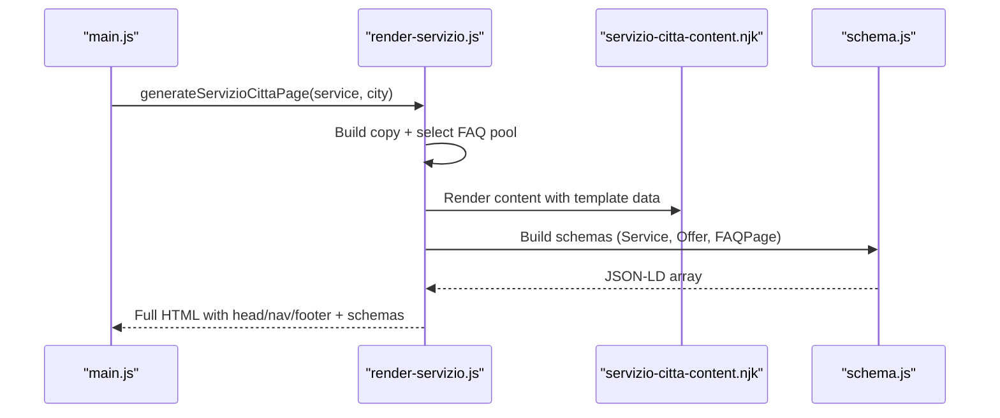
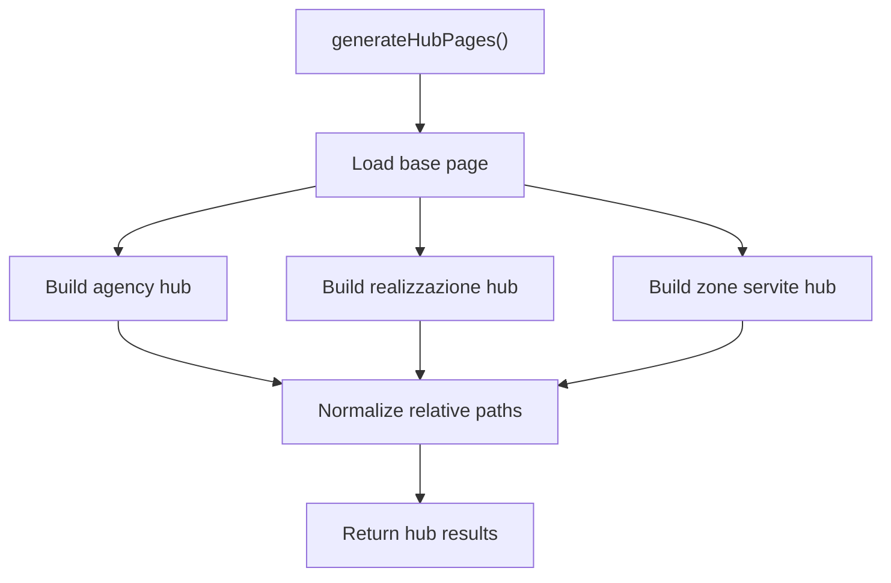
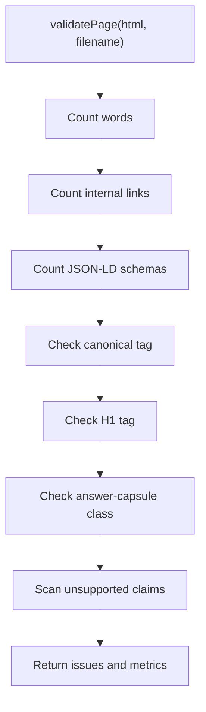
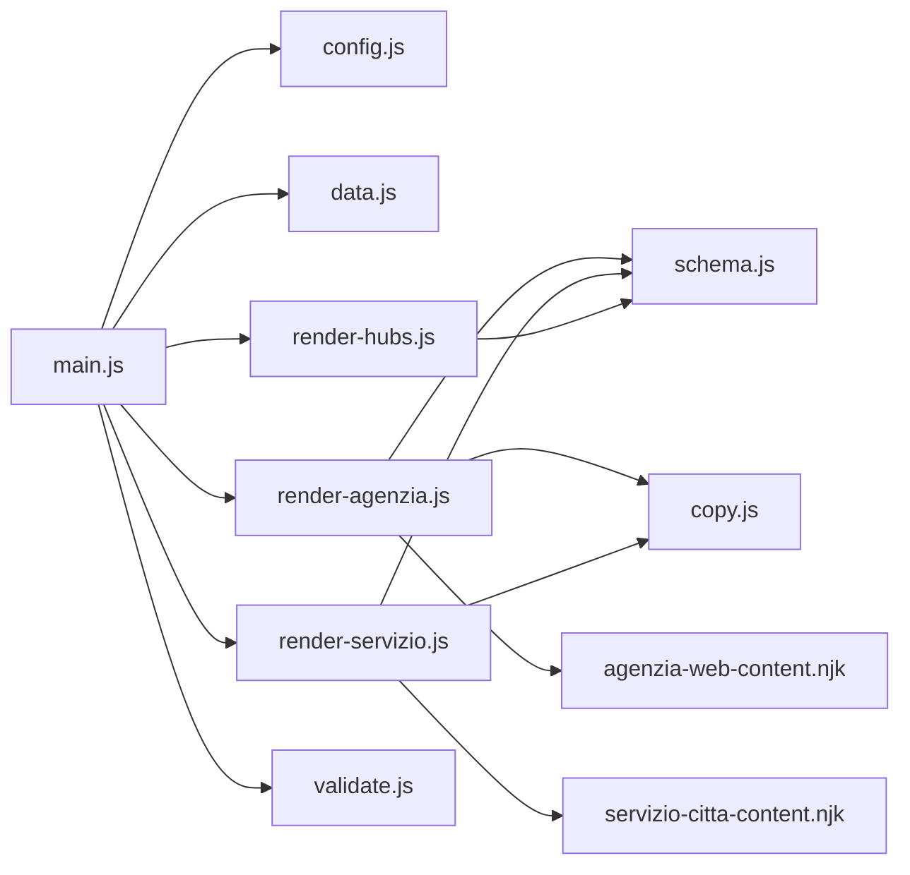

# Geo-Targeted Content Generation

<cite>
**Referenced Files in This Document**
- [scripts/generate-all-geo.js](file://scripts/generate-all-geo.js)
- [scripts/geo/main.js](file://scripts/geo/main.js)
- [scripts/geo/config.js](file://scripts/geo/config.js)
- [scripts/geo/data.js](file://scripts/geo/data.js)
- [scripts/geo/render-agenzia.js](file://scripts/geo/render-agenzia.js)
- [scripts/geo/render-servizio.js](file://scripts/geo/render-servizio.js)
- [scripts/geo/render-hubs.js](file://scripts/geo/render-hubs.js)
- [scripts/geo/schema.js](file://scripts/geo/schema.js)
- [scripts/geo/copy.js](file://scripts/geo/copy.js)
- [scripts/geo/validate.js](file://scripts/geo/validate.js)
- [templates/agenzia-web-content.njk](file://templates/agenzia-web-content.njk)
- [templates/servizio-citta-content.njk](file://templates/servizio-citta-content.njk)
- [data/cities.json](file://data/cities.json)
- [data/services.json](file://data/services.json)
- [data/geo-editorial/manifest.json](file://data/geo-editorial/manifest.json)
</cite>

## Table of Contents
1. Introduction
2. Project Structure
3. Core Components
4. Architecture Overview
5. Detailed Component Analysis
6. Dependency Analysis
7. Performance Considerations
8. Troubleshooting Guide
9. Conclusion
10. Appendices

## Introduction
This document explains the automated geo-targeted content generation system that builds localized landing pages for a web agency across multiple cities and services. It covers the end-to-end pipeline from data processing to HTML output, including service-city combination logic, content personalization, rendering engines for different page types (agency pages, service×city pages, hub pages), SEO optimization features (meta tags, structured data, local business schema), configuration guidance, performance strategies, and bulk generation workflows.

## Project Structure
The generator is orchestrated by a single entrypoint that delegates to modular components:
- Orchestration: main driver, CLI flags, filtering, and summary reporting
- Configuration: site constants, publish/report directories, tiering helpers, robots directives
- Data layer: city/service catalogs, approved content blocks, Nunjucks environment, blog index
- Renderers: per-page-type generators (agency, service×city, hubs)
- SEO and schemas: JSON-LD generation, area served entities, coverage scopes
- Copy builders: localized copy templates per service and city
- Validation: fail-closed checks on word count, links, schema presence, canonical/H1, answer capsule, unsupported claims
- Templates: Nunjucks templates for content sections and structure

**Diagram sources**
- [scripts/generate-all-geo.js:1-58](file://scripts/generate-all-geo.js#L1-L58)
- [scripts/geo/main.js:1-292](file://scripts/geo/main.js#L1-L292)
- [scripts/geo/config.js:1-114](file://scripts/geo/config.js#L1-L114)
- [scripts/geo/data.js:1-197](file://scripts/geo/data.js#L1-L197)
- [scripts/geo/render-agenzia.js:1-194](file://scripts/geo/render-agenzia.js#L1-L194)
- [scripts/geo/render-servizio.js:1-289](file://scripts/geo/render-servizio.js#L1-L289)
- [scripts/geo/render-hubs.js:1-296](file://scripts/geo/render-hubs.js#L1-L296)
- [scripts/geo/schema.js:1-199](file://scripts/geo/schema.js#L1-L199)
- [scripts/geo/copy.js:1-963](file://scripts/geo/copy.js#L1-L963)
- [scripts/geo/validate.js:1-55](file://scripts/geo/validate.js#L1-L55)
- [templates/agenzia-web-content.njk:1-278](file://templates/agenzia-web-content.njk#L1-L278)
- [templates/servizio-citta-content.njk:1-374](file://templates/servizio-citta-content.njk#L1-L374)
- [data/cities.json:1-800](file://data/cities.json#L1-L800)
- [data/services.json:1-307](file://data/services.json#L1-L307)
- [data/geo-editorial/manifest.json:1-451](file://data/geo-editorial/manifest.json#L1-L451)

**Section sources**
- [scripts/generate-all-geo.js:1-58](file://scripts/generate-all-geo.js#L1-L58)
- [scripts/geo/main.js:1-292](file://scripts/geo/main.js#L1-L292)
- [scripts/geo/config.js:1-114](file://scripts/geo/config.js#L1-L114)
- [scripts/geo/data.js:1-197](file://scripts/geo/data.js#L1-L197)

## Core Components
- Entry and orchestration: The public entrypoint re-exports key symbols and runs the orchestrator. It centralizes CLI usage and exposes functions for programmatic use.
- Configuration: Centralizes site identity, coordinates, dates, directory paths, CLI flags, target filters, and governance helpers for indexing and tier classification.
- Data layer: Loads cities and services, prepares tables, resolves content blocks, configures Nunjucks, and provides utilities for prices, avatars, and blog cross-links.
- Renderers:
  - Agency pages: Builds “Agenzia Web” pages per city with hero, local context, services grid, nearby cities, FAQs, and schemas.
  - Service×City pages: Generates service-specific pages per city with cluster-aware FAQ pools, AI-enriched content, related pages, and robust schemas.
  - Hub pages: Aggregates indexable geo pages into hub collections (agency, realization, zone-servite) with collection schemas and internal linking.
- Schema: Produces JSON-LD for breadcrumbs, WebPage, Service, OfferCatalog, FAQPage, and area served entities; also computes coverage scopes for hubs.
- Copy: Localized copy builders per service and city, including hero, descriptions, process steps, decision frameworks, deliverables, and intent queries.
- Validation: Fail-closed checks ensure minimum quality thresholds and required SEO elements before writing files.

**Section sources**
- [scripts/generate-all-geo.js:1-58](file://scripts/generate-all-geo.js#L1-L58)
- [scripts/geo/config.js:1-114](file://scripts/geo/config.js#L1-L114)
- [scripts/geo/data.js:1-197](file://scripts/geo/data.js#L1-L197)
- [scripts/geo/render-agenzia.js:1-194](file://scripts/geo/render-agenzia.js#L1-L194)
- [scripts/geo/render-servizio.js:1-289](file://scripts/geo/render-servizio.js#L1-L289)
- [scripts/geo/render-hubs.js:1-296](file://scripts/geo/render-hubs.js#L1-L296)
- [scripts/geo/schema.js:1-199](file://scripts/geo/schema.js#L1-L199)
- [scripts/geo/copy.js:1-963](file://scripts/geo/copy.js#L1-L963)
- [scripts/geo/validate.js:1-55](file://scripts/geo/validate.js#L1-L55)

## Architecture Overview
The pipeline follows a deterministic flow:
1. Parse CLI flags and compute targets (cities/services).
2. Load data (cities, services, approved content blocks, blog index).
3. For each page type:
   - Build template data using copy builders and editorial overrides.
   - Render Nunjucks templates.
   - Inject head/nav/footer/tail from base page.
   - Generate JSON-LD schemas.
   - Validate output.
   - Write published file if validation passes.
4. Generate hub pages aggregating indexable geo pages.
5. Persist link graph and date metadata.

**Diagram sources**
- [scripts/geo/main.js:1-292](file://scripts/geo/main.js#L1-L292)
- [scripts/geo/data.js:1-197](file://scripts/geo/data.js#L1-L197)
- [scripts/geo/render-agenzia.js:1-194](file://scripts/geo/render-agenzia.js#L1-L194)
- [scripts/geo/render-servizio.js:1-289](file://scripts/geo/render-servizio.js#L1-L289)
- [scripts/geo/render-hubs.js:1-296](file://scripts/geo/render-hubs.js#L1-L296)
- [scripts/geo/schema.js:1-199](file://scripts/geo/schema.js#L1-L199)
- [scripts/geo/validate.js:1-55](file://scripts/geo/validate.js#L1-L55)

## Detailed Component Analysis

### Orchestration and CLI
- Parses flags: dry run, validate only, type filter, out-dir, report-dir, city/service filters.
- Computes expected counts per category and tracks successes, skips, and failures.
- Iterates through cities and services to generate pages, validates, writes outputs, and persists link graph and dates.
- Exits with error code if any blocked/failed or mismatched expectations.

**Diagram sources**
- [scripts/geo/main.js:1-292](file://scripts/geo/main.js#L1-L292)

**Section sources**
- [scripts/geo/main.js:1-292](file://scripts/geo/main.js#L1-L292)

### Data Layer and Personalization
- Loads cities and services, builds lookup maps, and prepares pricing and display helpers.
- Filters services eligible for geo generation based on explicit opt-out flags.
- Loads approved content blocks and optional blog search index for cross-linking.
- Provides utilities for province display names, geo search modifiers, city avatar paths, and UI meta enrichment.

Key behaviors:
- City-level local context drives unique market analysis and sector highlights.
- Service eligibility controls which service×city combinations are generated.
- Blog index enables relevant article cross-links per city.

**Section sources**
- [scripts/geo/data.js:1-197](file://scripts/geo/data.js#L1-L197)
- [data/cities.json:1-800](file://data/cities.json#L1-L800)
- [data/services.json:1-307](file://data/services.json#L1-L307)

### Agency Page Renderer
- Uses a base page to extract head, nav, footer, and tail.
- Builds template data with city info, services, FAQs, nearby cities, blog links, and tier classification.
- Applies editorial overrides and AI-enriched content when available.
- Renders Nunjucks template and injects JSON-LD schemas (breadcrumbs, WebPage, Service, OfferCatalog, core services, FAQPage).

**Diagram sources**
- [scripts/geo/render-agenzia.js:1-194](file://scripts/geo/render-agenzia.js#L1-L194)
- [templates/agenzia-web-content.njk:1-278](file://templates/agenzia-web-content.njk#L1-L278)
- [scripts/geo/schema.js:1-199](file://scripts/geo/schema.js#L1-L199)

**Section sources**
- [scripts/geo/render-agenzia.js:1-194](file://scripts/geo/render-agenzia.js#L1-L194)
- [templates/agenzia-web-content.njk:1-278](file://templates/agenzia-web-content.njk#L1-L278)
- [scripts/geo/schema.js:1-199](file://scripts/geo/schema.js#L1-L199)

### Service×City Page Renderer
- Builds localized copy via copy builder and applies editorial overrides.
- Selects FAQ pool based on service cluster (web build, marketing, strategy).
- Enriches content with AI blocks where available and avoids intra-municipal duplication by varying angles per cluster.
- Renders Nunjucks template and injects JSON-LD schemas (BreadcrumbList, WebPage, Service, Offer, FAQPage).

**Diagram sources**
- [scripts/geo/render-servizio.js:1-289](file://scripts/geo/render-servizio.js#L1-L289)
- [templates/servizio-citta-content.njk:1-374](file://templates/servizio-citta-content.njk#L1-L374)
- [scripts/geo/schema.js:1-199](file://scripts/geo/schema.js#L1-L199)

**Section sources**
- [scripts/geo/render-servizio.js:1-289](file://scripts/geo/render-servizio.js#L1-L289)
- [templates/servizio-citta-content.njk:1-374](file://templates/servizio-citta-content.njk#L1-L374)
- [scripts/geo/copy.js:1-963](file://scripts/geo/copy.js#L1-L963)

### Hub Pages Renderer
- Aggregates indexable geo pages into three hubs:
  - Agenzia Web hub listing cities with dedicated agency pages.
  - Realizzazione Siti Web hub listing cities with dedicated realization pages.
  - Zone Servite hub summarizing coverage across services and cities.
- Normalizes relative asset paths for subdirectory serving.
- Adds collection schemas and breadcrumb structures.

**Diagram sources**
- [scripts/geo/render-hubs.js:1-296](file://scripts/geo/render-hubs.js#L1-L296)

**Section sources**
- [scripts/geo/render-hubs.js:1-296](file://scripts/geo/render-hubs.js#L1-L296)

### SEO and Structured Data
- Meta tags: Title, description, keywords, canonical, robots directives derived from governance rules.
- Open Graph: ogTitle and ogDescription injected during head update.
- JSON-LD:
  - BreadcrumbList for navigation hierarchy.
  - WebPage with language, publication/modification dates, and website association.
  - Service with area served, offers, and offer catalogs.
  - FAQPage when FAQs exist.
  - Coverage scopes for hub pages.

**Section sources**
- [scripts/geo/config.js:1-114](file://scripts/geo/config.js#L1-L114)
- [scripts/geo/render-agenzia.js:1-194](file://scripts/geo/render-agenzia.js#L1-L194)
- [scripts/geo/render-servizio.js:1-289](file://scripts/geo/render-servizio.js#L1-L289)
- [scripts/geo/render-hubs.js:1-296](file://scripts/geo/render-hubs.js#L1-L296)
- [scripts/geo/schema.js:1-199](file://scripts/geo/schema.js#L1-L199)

### Content Customization System
- Geographic adaptation:
  - City-level local context (highlights, economic fabric, key sectors, digital opportunities).
  - Province display names and geo search modifiers.
  - Nearby cities and distance signals.
- Editorial overrides:
  - Tier 1 hand-crafted content blocks loaded per city or city×service.
  - Editorial records provide intro, sections, and CTAs.
- Service personalization:
  - Cluster-based FAQ pools and tailored copy (web build, marketing, strategy).
  - Intent queries and deliverables mapped per service.
- AI enrichment:
  - Optional local market analysis and competitive context merged into content.

**Section sources**
- [scripts/geo/data.js:1-197](file://scripts/geo/data.js#L1-L197)
- [scripts/geo/render-agenzia.js:1-194](file://scripts/geo/render-agenzia.js#L1-L194)
- [scripts/geo/render-servizio.js:1-289](file://scripts/geo/render-servizio.js#L1-L289)
- [data/geo-editorial/manifest.json:1-451](file://data/geo-editorial/manifest.json#L1-L451)

### Output Validation
- Word count threshold with critical/warning levels.
- Internal link count target.
- Minimum JSON-LD schema count.
- Presence of canonical tag and H1.
- Answer capsule class presence for GEO optimization.
- Unsupported claim detection against governance rules.

**Diagram sources**
- [scripts/geo/validate.js:1-55](file://scripts/geo/validate.js#L1-L55)

**Section sources**
- [scripts/geo/validate.js:1-55](file://scripts/geo/validate.js#L1-L55)

## Dependency Analysis
- Orchestrator depends on:
  - Config for constants, CLI flags, and governance helpers.
  - Data for catalogs, content blocks, and Nunjucks environment.
  - Renderers for page assembly and templating.
  - Schema for structured data.
  - Validation for quality gates.
- Renderers depend on:
  - Base page extraction and path utilities.
  - Copy builders for localized text.
  - Editorial records and approved content blocks.
- Templates depend on:
  - Variables provided by renderers (city, service, seo, faqs, tier, etc.).
  - CSS classes and structural markers for SEO and UX.

**Diagram sources**
- [scripts/geo/main.js:1-292](file://scripts/geo/main.js#L1-L292)
- [scripts/geo/config.js:1-114](file://scripts/geo/config.js#L1-L114)
- [scripts/geo/data.js:1-197](file://scripts/geo/data.js#L1-L197)
- [scripts/geo/render-agenzia.js:1-194](file://scripts/geo/render-agenzia.js#L1-L194)
- [scripts/geo/render-servizio.js:1-289](file://scripts/geo/render-servizio.js#L1-L289)
- [scripts/geo/render-hubs.js:1-296](file://scripts/geo/render-hubs.js#L1-L296)
- [scripts/geo/schema.js:1-199](file://scripts/geo/schema.js#L1-L199)
- [scripts/geo/copy.js:1-963](file://scripts/geo/copy.js#L1-L963)
- [scripts/geo/validate.js:1-55](file://scripts/geo/validate.js#L1-L55)
- [templates/agenzia-web-content.njk:1-278](file://templates/agenzia-web-content.njk#L1-L278)
- [templates/servizio-citta-content.njk:1-374](file://templates/servizio-citta-content.njk#L1-L374)

**Section sources**
- [scripts/geo/main.js:1-292](file://scripts/geo/main.js#L1-L292)
- [scripts/geo/config.js:1-114](file://scripts/geo/config.js#L1-L114)
- [scripts/geo/data.js:1-197](file://scripts/geo/data.js#L1-L197)

## Performance Considerations
- Batch generation: Use type filters to limit scope (e.g., --type=agenzia or --type=servizio) and city/service filters to reduce workload.
- Dry-run mode: Validate pipelines without writing files to speed iteration.
- Validate-only mode: Check outputs without generating new pages.
- Tier classification: De-amplified pages reduce footprint by omitting heavy comparison tables and extensive linking on non-indexable pages.
- Asset path normalization: Hub pages normalize relative paths to avoid runtime overhead and broken assets in subdirectories.
- Approved content blocks: Only verified blocks are loaded, reducing noise and ensuring consistent rendering.

[No sources needed since this section provides general guidance]

## Troubleshooting Guide
Common issues and resolutions:
- Missing base page: Ensure the base page exists; hub and renderer modules rely on it to extract head/nav/footer/tail.
- Validation failures:
  - Word count below threshold: Add more unique content or leverage AI/editorial blocks.
  - Missing canonical or H1: Verify head injection and template rendering.
  - Insufficient JSON-LD schemas: Confirm schema generation for Breadcrumbs, WebPage, Service, and FAQPage.
  - Unsupported claims: Review content against governance rules and remove unapproved statements.
- Target mismatches: Check CLI flags and city/service filters; verify expected counts vs actual outputs.
- Path resolution errors: Confirm PUBLISH_DIR and REPORT_DIR settings; ensure assets are accessible at resolved paths.

**Section sources**
- [scripts/geo/validate.js:1-55](file://scripts/geo/validate.js#L1-L55)
- [scripts/geo/render-hubs.js:1-296](file://scripts/geo/render-hubs.js#L1-L296)
- [scripts/geo/config.js:1-114](file://scripts/geo/config.js#L1-L114)

## Conclusion
The system provides a robust, configurable, and validated pipeline for generating geo-targeted pages at scale. It combines centralized data, modular renderers, rich personalization, and strong SEO foundations to produce high-quality, indexable pages across agencies, services, and hubs. With clear configuration, editorial overrides, and validation safeguards, teams can confidently expand coverage to new locations and services while maintaining consistency and performance.

[No sources needed since this section summarizes without analyzing specific files]

## Appendices

### Configuration Guidance
- CLI flags:
  - --dry-run: Validate without writing files.
  - --validate-only: Validate existing outputs without generation.
  - --type=<agenzia|realizzazione|servizio|hubs|all>: Limit generation scope.
  - --out-dir=<path>: Set publish directory.
  - --report-dir=<path>: Set report directory.
  - --city=<slug1,slug2,...>: Filter cities.
  - --service=<slug1,slug2,...>: Filter services.
- Governance integration:
  - Indexability and tier classification are enforced via governance helpers.
  - Robots directives are built per path to control crawling behavior.

**Section sources**
- [scripts/geo/config.js:1-114](file://scripts/geo/config.js#L1-L114)
- [scripts/geo/main.js:1-292](file://scripts/geo/main.js#L1-L292)

### Adding New Locations
Steps:
- Add city record to cities.json with slug, name, cap, coordinates, province, generate flags, nearCities, localContext, images, and FAQs.
- Optionally add approved content blocks under data/content-blocks for Tier 1 override.
- Update editorial manifest if adding Tier 1 editorial records.
- Re-run generator with appropriate filters to include the new location.

**Section sources**
- [data/cities.json:1-800](file://data/cities.json#L1-L800)
- [data/geo-editorial/manifest.json:1-451](file://data/geo-editorial/manifest.json#L1-L451)

### Adding New Services
Steps:
- Add service record to services.json with slug, name, shortName, url, hasPage, tier, priceFrom, timeEstimate, description, idealFor, and targetKeyword.
- If not eligible for geo generation, set skipGeoGeneration or generateGeoPages accordingly.
- Extend copy builders if needed for new service clusters or intent queries.
- Re-run generator to produce service×city pages.

**Section sources**
- [data/services.json:1-307](file://data/services.json#L1-L307)
- [scripts/geo/data.js:1-197](file://scripts/geo/data.js#L1-L197)
- [scripts/geo/copy.js:1-963](file://scripts/geo/copy.js#L1-L963)

### Bulk Generation Workflows
- Use --type=all to regenerate all page types.
- Use --type=servizio to regenerate the combinatorial matrix efficiently.
- Combine --city and --service filters to target subsets.
- Leverage --dry-run and --validate-only for rapid iteration and quality assurance.

**Section sources**
- [scripts/geo/main.js:1-292](file://scripts/geo/main.js#L1-L292)
- [scripts/generate-all-geo.js:1-58](file://scripts/generate-all-geo.js#L1-L58)