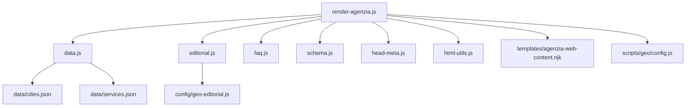
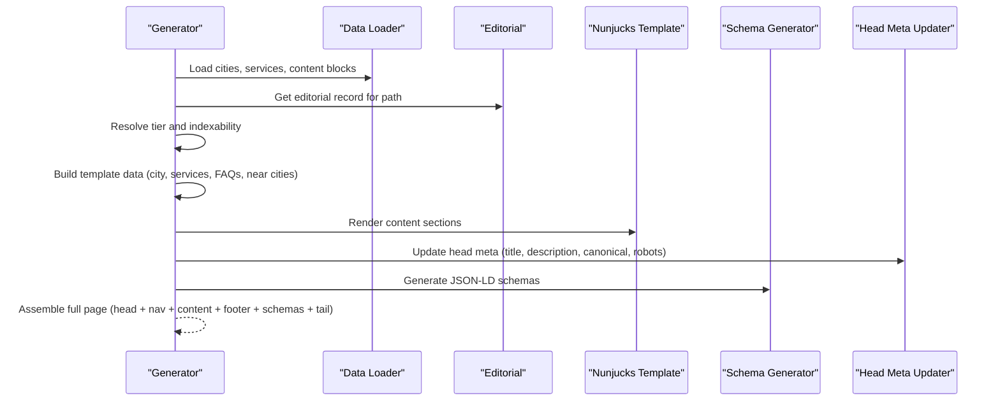
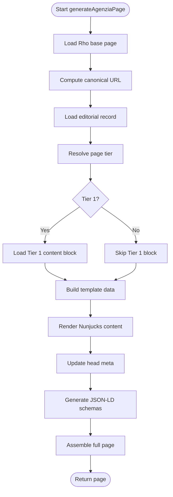
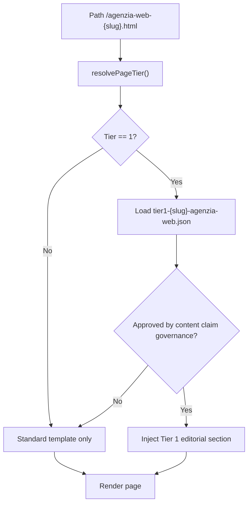
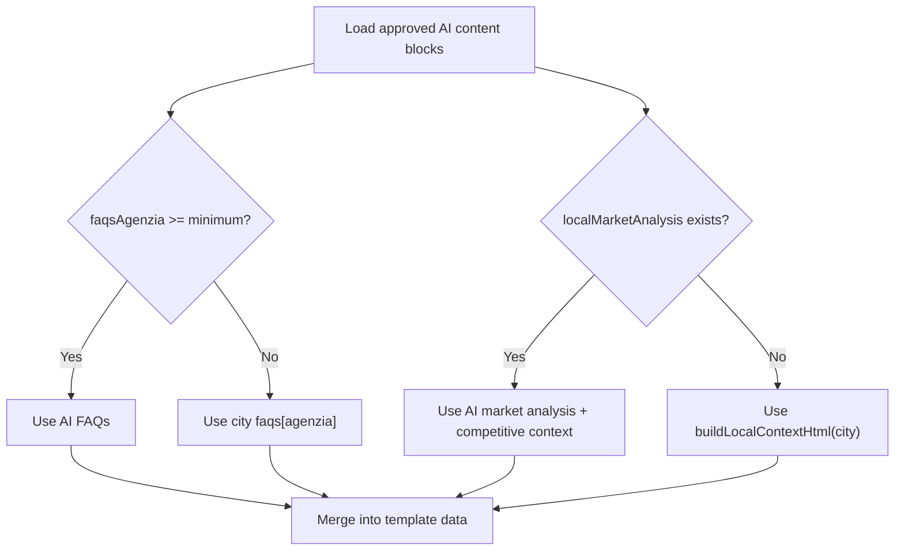
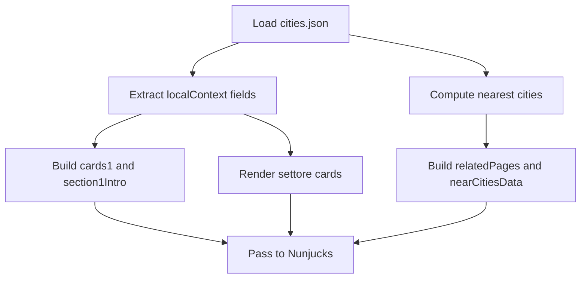
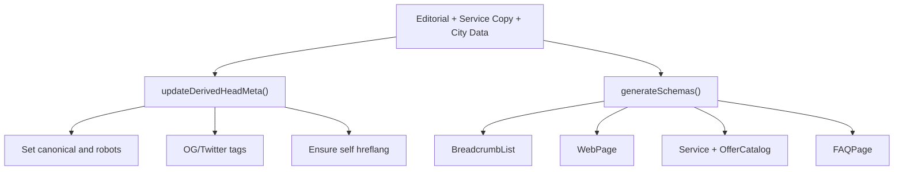
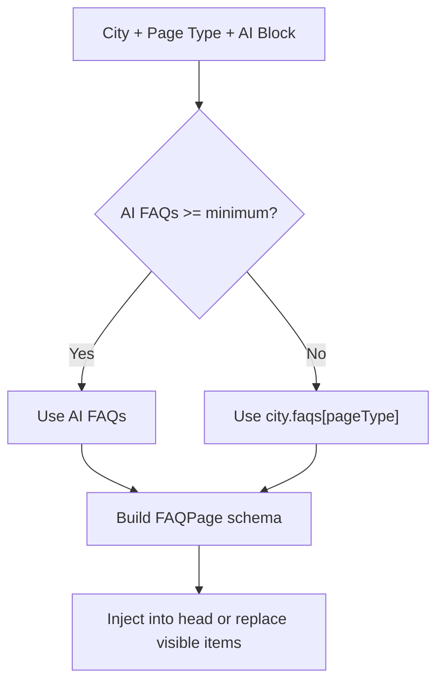
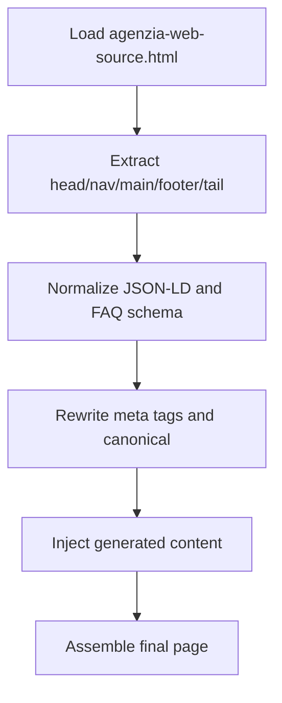
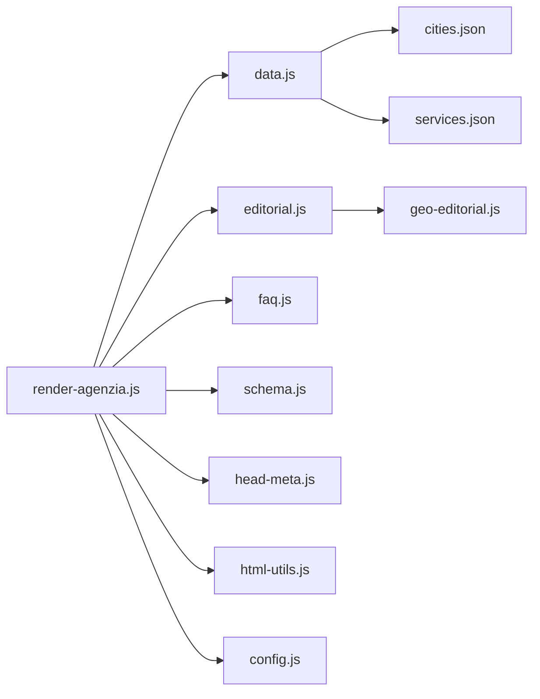

# Agency Page Renderer

<cite>
**Referenced Files in This Document**
- [render-agenzia.js](file://scripts/geo/render-agenzia.js)
- [agenzia-web-content.njk](file://templates/agenzia-web-content.njk)
- [schema.js](file://scripts/geo/schema.js)
- [data.js](file://scripts/geo/data.js)
- [editorial.js](file://scripts/geo/editorial.js)
- [faq.js](file://scripts/geo/faq.js)
- [config.js](file://scripts/geo/config.js)
- [html-utils.js](file://scripts/geo/html-utils.js)
- [head-meta.js](file://scripts/geo/head-meta.js)
- [cities.json](file://data/cities.json)
- [services.json](file://data/services.json)
- [tier1-rho-agenzia-web.json](file://data/content-blocks/tier1-rho-agenzia-web.json)
</cite>

## Table of Contents
1. [Introduction](#introduction)
2. [Project Structure](#project-structure)
3. [Core Components](#core-components)
4. [Architecture Overview](#architecture-overview)
5. [Detailed Component Analysis](#detailed-component-analysis)
6. [Dependency Analysis](#dependency-analysis)
7. [Performance Considerations](#performance-considerations)
8. [Troubleshooting Guide](#troubleshooting-guide)
9. [Conclusion](#conclusion)

## Introduction
This document explains the agency page renderer that generates geo-targeted “Agenzia Web” pages for cities around Rho, Italy. It covers how the system supports both hand-crafted Rho base pages and template-generated content for other cities, the tier system (Tier 1 vs automated), AI content integration, local context generation, SEO optimization, FAQ resolution, and schema markup generation. It also documents the template data structure, personalization logic, and how city-specific data is processed from multiple sources including AI-generated blocks and editorial overrides.

## Project Structure
The renderer is implemented as a Node.js build-time generator that:
- Loads city and service data from JSON files.
- Resolves editorial records and approved Tier 1 content.
- Renders per-city HTML via Nunjucks templates.
- Injects head metadata, canonical URLs, robots directives, and JSON-LD schemas.
- Assembles the final page by combining a hand-crafted base page (for Rho) with generated content sections.

**Diagram sources**
- [render-agenzia.js:34-188](file://scripts/geo/render-agenzia.js#L34-L188)
- [data.js:15-118](file://scripts/geo/data.js#L15-L118)
- [editorial.js:13-56](file://scripts/geo/editorial.js#L13-L56)
- [faq.js:6-17](file://scripts/geo/faq.js#L6-L17)
- [schema.js:73-191](file://scripts/geo/schema.js#L73-L191)
- [head-meta.js:31-75](file://scripts/geo/head-meta.js#L31-L75)
- [html-utils.js:15-24](file://scripts/geo/html-utils.js#L15-L24)
- [config.js:62-78](file://scripts/geo/config.js#L62-L78)

**Section sources**
- [render-agenzia.js:34-188](file://scripts/geo/render-agenzia.js#L34-L188)
- [data.js:15-118](file://scripts/geo/data.js#L15-L118)
- [config.js:62-78](file://scripts/geo/config.js#L62-L78)

## Core Components
- Page generator: orchestrates data loading, tier classification, content assembly, and output.
- Template engine: renders per-city content sections using Nunjucks.
- Editorial system: loads per-path editorial records to override SEO and body copy.
- FAQ resolver: selects FAQs from AI blocks or city data and builds FAQPage schema.
- Schema generator: produces structured data for WebPage, Service, OfferCatalog, and FAQPage.
- Head meta updater: rewrites title, description, canonical, robots, and social tags; normalizes hand-crafted Rho page.
- Utilities: nearest city calculation, HTML helpers, and governance-based indexability checks.

Key responsibilities:
- Tier classification determines whether a page is indexable and whether Tier 1 editorial content is injected.
- AI enrichment merges AI-generated market analysis and FAQs into the page when available.
- Local context uses city data (highlights, sectors, economic fabric) to personalize content.
- SEO features include canonical URLs, robots directives, Open Graph/Twitter tags, and comprehensive JSON-LD.

**Section sources**
- [render-agenzia.js:34-188](file://scripts/geo/render-agenzia.js#L34-L188)
- [agenzia-web-content.njk:15-277](file://templates/agenzia-web-content.njk#L15-L277)
- [schema.js:73-191](file://scripts/geo/schema.js#L73-L191)
- [head-meta.js:31-75](file://scripts/geo/head-meta.js#L31-L75)
- [faq.js:6-17](file://scripts/geo/faq.js#L6-L17)
- [editorial.js:13-56](file://scripts/geo/editorial.js#L13-L56)

## Architecture Overview
The renderer composes a full HTML page by merging:
- A hand-crafted base page for Rho (used as a shell).
- Generated content sections from the Nunjucks template.
- Head metadata and JSON-LD schemas.
- Footer and tail assets from the base page.

**Diagram sources**
- [render-agenzia.js:34-188](file://scripts/geo/render-agenzia.js#L34-L188)
- [data.js:15-118](file://scripts/geo/data.js#L15-L118)
- [editorial.js:13-56](file://scripts/geo/editorial.js#L13-L56)
- [schema.js:73-191](file://scripts/geo/schema.js#L73-L191)
- [head-meta.js:31-75](file://scripts/geo/head-meta.js#L31-L75)

## Detailed Component Analysis

### Page Generation Flow
The generator performs these steps for each city:
- Load the Rho base page and compute canonical URL.
- Fetch editorial record and apply SEO overrides.
- Compute nearest cities and related links.
- Determine tier and load Tier 1 content if applicable.
- Build template data with city context, services, FAQs, and blog links.
- Render content via Nunjucks.
- Update head meta and inject JSON-LD schemas.
- Assemble and return the full page.

**Diagram sources**
- [render-agenzia.js:34-188](file://scripts/geo/render-agenzia.js#L34-L188)
- [config.js:62-78](file://scripts/geo/config.js#L62-L78)

**Section sources**
- [render-agenzia.js:34-188](file://scripts/geo/render-agenzia.js#L34-L188)
- [config.js:62-78](file://scripts/geo/config.js#L62-L78)

### Template Data Structure
The Nunjucks template receives a rich context object:
- City: name, slug, province display, breadcrumb label, H1, hero capsule, section titles/intro, cards, local context highlights and sectors.
- Services: core and eligible services with prices and time estimates.
- FAQs: resolved questions and answers.
- Near cities and related pages: computed from city coordinates and indexability.
- Blog links: filtered from search index for internal linking.
- Tier flags: tier level and indexability.
- Tier 1 content: optional hand-crafted block with headline, body paragraphs, bullets, and callout.
- Metadata tokens: today date placeholders and site URL.

Template rendering includes:
- Hero section with answer capsule and location info.
- Optional editorial section for local context.
- Tier 1 editorial block between local context and services grid.
- Services grid with pricing and links.
- Area served section with nearby city links.
- Local economic context section.
- Comparison table sourced from services catalog.
- Work process section.
- Sector-specific cards based on city local context.
- FAQ section with details/summary elements.
- Blog links section.
- Final CTA section.

**Section sources**
- [agenzia-web-content.njk:15-277](file://templates/agenzia-web-content.njk#L15-L277)
- [render-agenzia.js:79-144](file://scripts/geo/render-agenzia.js#L79-L144)

### Tier System (Tier 1 vs Automated)
- Tier classification is derived from governance lists:
  - Tier 1: unique editorial pages, indexable, may include hand-crafted content blocks.
  - Tier 2: standard indexable pages without Tier 1 overrides.
  - De-amplified: not indexable but still rendered.
- For Tier 1 pages, the generator attempts to load an approved Tier 1 content block named after the city and service. If present and approved, it injects a dedicated editorial section into the page.
- Indexability is enforced via governance rules and robots directives.

**Diagram sources**
- [render-agenzia.js:64-77](file://scripts/geo/render-agenzia.js#L64-L77)
- [config.js:62-78](file://scripts/geo/config.js#L62-L78)

**Section sources**
- [render-agenzia.js:64-77](file://scripts/geo/render-agenzia.js#L64-L77)
- [config.js:62-78](file://scripts/geo/config.js#L62-L78)

### AI Content Integration
- AI-generated content blocks are loaded from approved directories and merged into the page context.
- For the agency page, AI blocks can provide:
  - Local market analysis text.
  - Competitive context used to enrich Section 1 intro and Section 3 market context.
  - FAQs specific to the agency service.
- If AI blocks are missing or insufficient, the renderer falls back to city-localized defaults and algorithmic local context.

**Diagram sources**
- [render-agenzia.js:80-92](file://scripts/geo/render-agenzia.js#L80-L92)
- [data.js:91-98](file://scripts/geo/data.js#L91-L98)
- [faq.js:6-17](file://scripts/geo/faq.js#L6-L17)

**Section sources**
- [render-agenzia.js:80-92](file://scripts/geo/render-agenzia.js#L80-L92)
- [data.js:91-98](file://scripts/geo/data.js#L91-L98)
- [faq.js:6-17](file://scripts/geo/faq.js#L6-L17)

### Local Context Generation
- City data includes highlights, economic fabric, key sectors, and digital opportunities.
- The renderer uses this data to:
  - Personalize Section 1 intro and cards.
  - Populate sector-specific cards in the template.
  - Generate area served listings and nearby city links.
- Nearest cities are computed using haversine distance and limited to a configurable number.

**Diagram sources**
- [render-agenzia.js:45-62](file://scripts/geo/render-agenzia.js#L45-L62)
- [html-utils.js:15-24](file://scripts/geo/html-utils.js#L15-L24)
- [agenzia-web-content.njk:218-237](file://templates/agenzia-web-content.njk#L218-L237)

**Section sources**
- [render-agenzia.js:45-62](file://scripts/geo/render-agenzia.js#L45-L62)
- [html-utils.js:15-24](file://scripts/geo/html-utils.js#L15-L24)
- [agenzia-web-content.njk:218-237](file://templates/agenzia-web-content.njk#L218-L237)

### SEO Optimization Features
- Canonical URL set per city page.
- Robots directive built from governance indexability rules.
- Title, description, Open Graph, and Twitter tags updated from editorial overrides and service copy.
- Self hreflang tag added for Italian locale.
- JSON-LD schemas include:
  - BreadcrumbList.
  - WebPage with language and business association.
  - Service with area served and offer catalog.
  - Core services with offers and pricing.
  - FAQPage when FAQs exist.

**Diagram sources**
- [head-meta.js:123-145](file://scripts/geo/head-meta.js#L123-L145)
- [schema.js:73-191](file://scripts/geo/schema.js#L73-L191)
- [render-agenzia.js:149-183](file://scripts/geo/render-agenzia.js#L149-L183)

**Section sources**
- [head-meta.js:123-145](file://scripts/geo/head-meta.js#L123-L145)
- [schema.js:73-191](file://scripts/geo/schema.js#L73-L191)
- [render-agenzia.js:149-183](file://scripts/geo/render-agenzia.js#L149-L183)

### FAQ Resolution
- Priority order:
  - If AI block provides sufficient FAQs for the service type, use them.
  - Otherwise, fall back to city-level FAQs keyed by service type.
- Visible FAQs are extracted from rendered HTML for validation and rebuild.
- FAQPage schema is generated from resolved FAQs.

**Diagram sources**
- [faq.js:6-17](file://scripts/geo/faq.js#L6-L17)
- [faq.js:19-36](file://scripts/geo/faq.js#L19-L36)
- [faq.js:62-75](file://scripts/geo/faq.js#L62-L75)

**Section sources**
- [faq.js:6-17](file://scripts/geo/faq.js#L6-L17)
- [faq.js:19-36](file://scripts/geo/faq.js#L19-L36)
- [faq.js:62-75](file://scripts/geo/faq.js#L62-L75)

### Hand-Crafted Rho Base Page Handling
- The generator loads the Rho base page and extracts head, nav, main, footer, and tail segments.
- Head meta is rewritten with city-specific values.
- JSON-LD in the base page is normalized:
  - Remove unsupported types like LocalBusiness or Review.
  - Replace FAQPage with generated schema.
  - Ensure provider and about references point to the singleton local business ID.
- Tier 1 editorial blocks embedded in the Rho page are stripped unless approved.

**Diagram sources**
- [render-agenzia.js:34-43](file://scripts/geo/render-agenzia.js#L34-L43)
- [render-agenzia.js:149-186](file://scripts/geo/render-agenzia.js#L149-L186)
- [head-meta.js:31-75](file://scripts/geo/head-meta.js#L31-L75)

**Section sources**
- [render-agenzia.js:34-43](file://scripts/geo/render-agenzia.js#L34-L43)
- [render-agenzia.js:149-186](file://scripts/geo/render-agenzia.js#L149-L186)
- [head-meta.js:31-75](file://scripts/geo/head-meta.js#L31-L75)

### Template Data Processing Examples
- City-specific data processing:
  - Province display names are mapped for readability.
  - Nearby cities are computed and linked with distances and populations.
  - Local sectors and highlights are rendered as cards.
- Content personalization logic:
  - Hero capsule adapts messaging based on whether the city is the headquarters.
  - Section 1 intro combines city economic fabric with AI competitive context when available.
  - Services grid displays pricing and time estimates from the services catalog.
- Different content sources:
  - AI-generated blocks enrich market analysis and FAQs.
  - Editorial records override SEO and body copy for certain paths.
  - Tier 1 content provides verified, hand-crafted sections for high-priority cities.

**Section sources**
- [data.js:70-89](file://scripts/geo/data.js#L70-L89)
- [render-agenzia.js:45-92](file://scripts/geo/render-agenzia.js#L45-L92)
- [agenzia-web-content.njk:24-122](file://templates/agenzia-web-content.njk#L24-L122)
- [tier1-rho-agenzia-web.json:1-33](file://data/content-blocks/tier1-rho-agenzia-web.json#L1-L33)

## Dependency Analysis
The renderer depends on several modules and data sources:
- Data loader: centralizes cities, services, content blocks, and Nunjucks environment.
- Editorial module: loads and validates per-path editorial records.
- FAQ module: resolves and renders FAQs and builds FAQPage schema.
- Schema module: constructs JSON-LD structures for SEO.
- Head meta module: updates meta tags and normalizes base page JSON-LD.
- Utilities: distance calculations and HTML helpers.
- Governance configuration: determines tiers and indexability.

**Diagram sources**
- [render-agenzia.js:4-32](file://scripts/geo/render-agenzia.js#L4-L32)
- [data.js:15-118](file://scripts/geo/data.js#L15-L118)
- [editorial.js:1-64](file://scripts/geo/editorial.js#L1-L64)
- [faq.js:1-86](file://scripts/geo/faq.js#L1-L86)
- [schema.js:1-199](file://scripts/geo/schema.js#L1-L199)
- [head-meta.js:1-156](file://scripts/geo/head-meta.js#L1-L156)
- [html-utils.js:1-75](file://scripts/geo/html-utils.js#L1-L75)
- [config.js:1-114](file://scripts/geo/config.js#L1-L114)

**Section sources**
- [render-agenzia.js:4-32](file://scripts/geo/render-agenzia.js#L4-L32)
- [data.js:15-118](file://scripts/geo/data.js#L15-L118)
- [editorial.js:1-64](file://scripts/geo/editorial.js#L1-L64)
- [faq.js:1-86](file://scripts/geo/faq.js#L1-L86)
- [schema.js:1-199](file://scripts/geo/schema.js#L1-L199)
- [head-meta.js:1-156](file://scripts/geo/head-meta.js#L1-L156)
- [html-utils.js:1-75](file://scripts/geo/html-utils.js#L1-L75)
- [config.js:1-114](file://scripts/geo/config.js#L1-L114)

## Performance Considerations
- Data loading is centralized and cached where appropriate (e.g., editorial corpus caching).
- Nearest city computation uses efficient filtering and sorting with a fixed limit.
- Template rendering is lightweight and relies on precomputed context objects.
- JSON-LD generation avoids redundant structures and limits area served entries.
- Head meta rewriting uses regex patterns optimized for common tag positions.

[No sources needed since this section provides general guidance]

## Troubleshooting Guide
Common issues and resolutions:
- Missing base page: ensure the Rho base page file exists and is readable.
- Tier 1 content not rendering: verify the Tier 1 JSON file exists and passes approval gates.
- FAQs not appearing: check AI block presence and minimum count; fallback to city FAQs.
- Schema errors: validate JSON-LD types and ensure provider references are correct.
- Indexability problems: confirm governance tier assignment and robots directives.

**Section sources**
- [render-agenzia.js:34-43](file://scripts/geo/render-agenzia.js#L34-L43)
- [render-agenzia.js:64-77](file://scripts/geo/render-agenzia.js#L64-L77)
- [faq.js:6-17](file://scripts/geo/faq.js#L6-L17)
- [schema.js:73-191](file://scripts/geo/schema.js#L73-L191)
- [head-meta.js:31-75](file://scripts/geo/head-meta.js#L31-L75)

## Conclusion
The agency page renderer delivers highly localized, SEO-optimized “Agenzia Web” pages by combining hand-crafted Rho base pages with templated content for other cities. It supports a tiered approach that prioritizes verified editorial content for high-value locations while automating personalization through city data and AI blocks. Robust FAQ resolution, schema markup generation, and governance-driven indexability ensure consistent quality and compliance across all generated pages.

[No sources needed since this section summarizes without analyzing specific files]