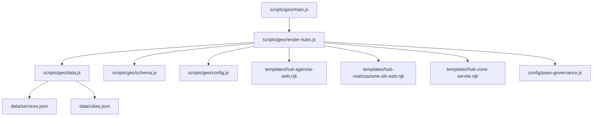
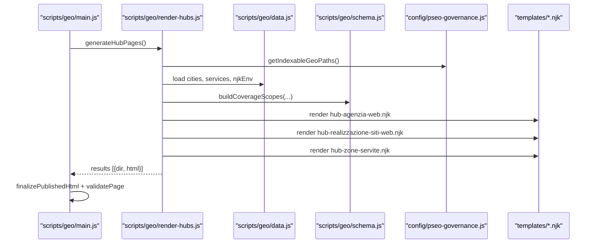
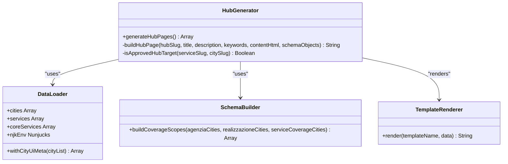
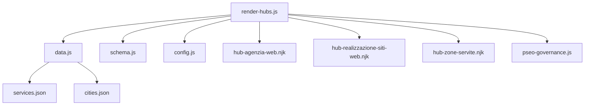

# Hub Page Renderer

<cite>
**Referenced Files in This Document**
- [render-hubs.js](file://scripts/geo/render-hubs.js)
- [main.js](file://scripts/geo/main.js)
- [data.js](file://scripts/geo/data.js)
- [schema.js](file://scripts/geo/schema.js)
- [config.js](file://scripts/geo/config.js)
- [hub-agenzia-web.njk](file://templates/hub-agenzia-web.njk)
- [hub-realizzazione-siti-web.njk](file://templates/hub-realizzazione-siti-web.njk)
- [hub-zone-servite.njk](file://templates/hub-zone-servite.njk)
- [services.json](file://data/services.json)
- [cities.json](file://data/cities.json)
- [pseo-governance.js](file://config/pseo-governance.js)
</cite>

## Table of Contents
1. [Introduction](#introduction)
2. [Project Structure](#project-structure)
3. [Core Components](#core-components)
4. [Architecture Overview](#architecture-overview)
5. [Detailed Component Analysis](#detailed-component-analysis)
6. [Dependency Analysis](#dependency-analysis)
7. [Performance Considerations](#performance-considerations)
8. [Troubleshooting Guide](#troubleshooting-guide)
9. [Conclusion](#conclusion)
10. [Appendices](#appendices)

## Introduction
This document explains the hub page renderer that generates internal linking bridge pages for three content categories:
- Agenzia Web (web agency)
- Realizzazione Siti Web (website realization)
- Zone Servite (served zones, cross-service overview)

The renderer assembles hub pages from Nunjucks templates, aggregates city and service data, injects SEO metadata and JSON-LD schemas, and produces indexable hub pages that organize related content and optimize internal linking patterns for search engine crawling. It also supports navigation enhancements such as structured grids, avatars, and anchor-based sections.

## Project Structure
The hub rendering system is part of a larger geo-page generator pipeline. The key files involved are:
- Orchestration: scripts/geo/main.js
- Hub generation: scripts/geo/render-hubs.js
- Data loading and Nunjucks environment: scripts/geo/data.js
- Schema and coverage scopes: scripts/geo/schema.js
- Configuration and CLI flags: scripts/geo/config.js
- Templates: templates/hub-*.njk
- Data sources: data/services.json, data/cities.json
- Governance and indexability: config/pseo-governance.js

**Diagram sources**
- [main.js](file://scripts/geo/main.js)
- [render-hubs.js](file://scripts/geo/render-hubs.js)
- [data.js](file://scripts/geo/data.js)
- [schema.js](file://scripts/geo/schema.js)
- [config.js](file://scripts/geo/config.js)
- [hub-agenzia-web.njk](file://templates/hub-agenzia-web.njk)
- [hub-realizzazione-siti-web.njk](file://templates/hub-realizzazione-siti-web.njk)
- [hub-zone-servite.njk](file://templates/hub-zone-servite.njk)
- [services.json](file://data/services.json)
- [cities.json](file://data/cities.json)
- [pseo-governance.js](file://config/pseo-governance.js)

**Section sources**
- [main.js](file://scripts/geo/main.js)
- [render-hubs.js](file://scripts/geo/render-hubs.js)
- [data.js](file://scripts/geo/data.js)
- [schema.js](file://scripts/geo/schema.js)
- [config.js](file://scripts/geo/config.js)
- [hub-agenzia-web.njk](file://templates/hub-agenzia-web.njk)
- [hub-realizzazione-siti-web.njk](file://templates/hub-realizzazione-siti-web.njk)
- [hub-zone-servite.njk](file://templates/hub-zone-servite.njk)
- [services.json](file://data/services.json)
- [cities.json](file://data/cities.json)
- [pseo-governance.js](file://config/pseo-governance.js)

## Core Components
- Hub generator: scripts/geo/render-hubs.js
  - Builds three hub pages by assembling base HTML, injecting head meta, CSS, nav/footer, and schema blocks.
  - Filters cities based on indexable targets via governance allowlist.
  - Renders Nunjucks templates with prepared data objects.
- Data loader: scripts/geo/data.js
  - Loads cities and services JSON, prepares core services, formats prices, and provides Nunjucks helpers.
  - Provides withCityUiMeta to attach avatar paths and alt text.
- Schema builder: scripts/geo/schema.js
  - Generates coverage scopes and JSON-LD structures for hubs and city pages.
- Configuration: scripts/geo/config.js
  - Defines site constants, tokens for dates, CLI flags, and re-exports governance helpers.
- Templates:
  - hub-agenzia-web.njk: City grid for “Agenzia Web” with hero, featured cities, and service table.
  - hub-realizzazione-siti-web.njk: City grid for “Realizzazione Siti Web” with hero and benefits.
  - hub-zone-servite.njk: Cross-service overview with coverage scopes, featured cities, and per-service sections.

**Section sources**
- [render-hubs.js](file://scripts/geo/render-hubs.js)
- [data.js](file://scripts/geo/data.js)
- [schema.js](file://scripts/geo/schema.js)
- [config.js](file://scripts/geo/config.js)
- [hub-agenzia-web.njk](file://templates/hub-agenzia-web.njk)
- [hub-realizzazione-siti-web.njk](file://templates/hub-realizzazione-siti-web.njk)
- [hub-zone-servite.njk](file://templates/hub-zone-servite.njk)

## Architecture Overview
The hub renderer integrates into the geo generator pipeline orchestrated by main.js. When GEN_TYPE includes hubs, it calls generateHubPages(), which:
- Reads a base page template to reuse layout elements.
- Computes approved hub targets using getIndexableGeoPaths() from pseo-governance.js.
- Prepares data for each hub type (city lists, counts, core services).
- Renders Nunjucks templates to produce content HTML.
- Injects SEO metadata and JSON-LD schemas.
- Normalizes relative asset paths to absolute for subdirectory serving.
- Returns results for finalization and validation within the pipeline.

**Diagram sources**
- [main.js](file://scripts/geo/main.js)
- [render-hubs.js](file://scripts/geo/render-hubs.js)
- [data.js](file://scripts/geo/data.js)
- [schema.js](file://scripts/geo/schema.js)
- [pseo-governance.js](file://config/pseo-governance.js)
- [hub-agenzia-web.njk](file://templates/hub-agenzia-web.njk)
- [hub-realizzazione-siti-web.njk](file://templates/hub-realizzazione-siti-web.njk)
- [hub-zone-servite.njk](file://templates/hub-zone-servite.njk)

## Detailed Component Analysis

### Hub Generator (scripts/geo/render-hubs.js)
Responsibilities:
- Base page assembly: extracts head, nav, footer, and tail from a base page to ensure consistent layout across hubs.
- Head meta injection: updates title, description, canonical, and Open Graph tags via updateDerivedHeadMeta.
- CSS injection: embeds hub-specific styles inline before </head>.
- Path normalization: converts relative references to absolute for assets and links when served under subdirectories.
- Hub types:
  - Agenzia Web hub: filters cities where generate.agenzia is true and target path is indexable; renders hub-agenzia-web.njk; builds breadcrumb and CollectionPage schema.
  - Realizzazione Siti Web hub: filters cities where generate.realizzazione is true and target path is indexable; renders hub-realizzazione-siti-web.njk; builds breadcrumb and CollectionPage schema.
  - Zone Servite hub: aggregates all eligible services and cities; computes coverage scopes; renders hub-zone-servite.njk; builds comprehensive schema including multiple CollectionPage entries.

Key functions and logic:
- generateHubPages(): orchestrates hub creation and returns results for pipeline integration.
- buildHubPage(): shared assembler for head, body, footer, schemas, and path fixes.
- isApprovedHubTarget(serviceSlug, citySlug): checks if the generated city page is indexable.

Output structure:
- Each hub result contains dir (e.g., agenzia-web, realizzazione-siti-web, zone-servite) and html (finalized HTML string).

SEO and schema:
- BreadcrumbList for each hub.
- CollectionPage with numberOfItems and hasPart enumerating linked city/service pages.
- Date tokens for last-modified timestamps.

Navigation enhancement features:
- Grid layouts for city cards with avatars and fallback initials.
- Compact grids for service×city listings.
- Anchor sections for quick navigation (e.g., come-scegliere, agenzia-web, realizzazione-siti-web).

**Section sources**
- [render-hubs.js](file://scripts/geo/render-hubs.js)

#### Class Diagram (Conceptual Mapping)

**Diagram sources**
- [render-hubs.js](file://scripts/geo/render-hubs.js)
- [data.js](file://scripts/geo/data.js)
- [schema.js](file://scripts/geo/schema.js)

### Templates System
- hub-agenzia-web.njk:
  - Hero section with network coverage count and CTA.
  - Featured cities list with contextual descriptions.
  - City grid with avatars, province, distance, and population.
  - Service table listing core services with price and time estimates.
  - CTA section for non-listed cities.
- hub-realizzazione-siti-web.njk:
  - Hero section emphasizing custom code and SEO integration.
  - Featured cities with tailored descriptions.
  - City grid similar to Agenzia Web hub.
  - Benefits section highlighting zero WordPress, integrated SEO, and custom design.
  - CTA section encouraging contact.
- hub-zone-servite.njk:
  - Coverage scopes summary with labels, counts, and helper text.
  - Featured cities grid with links to specific service hubs.
  - Orientation section guiding users to choose the right service.
  - Per-service sections iterating over geoServices with compact city grids.
  - Anchor IDs for deep-linking to sections.

Template variables:
- cities: filtered and enriched city arrays.
- coreServices: core-tier services catalog.
- networkCoverageCount: total number of serviced municipalities.
- today/todayFormatted: date tokens injected during build.
- site: base site URL.
- coverageScopes: computed scope summaries for Zone Servite.

**Section sources**
- [hub-agenzia-web.njk](file://templates/hub-agenzia-web.njk)
- [hub-realizzazione-siti-web.njk](file://templates/hub-realizzazione-siti-web.njk)
- [hub-zone-servite.njk](file://templates/hub-zone-servite.njk)

### Content Aggregation Logic
- City filtering:
  - Agenzia Web: cities.filter(c => c.generate.agenzia) and isApprovedHubTarget('agenzia-web', c.slug).
  - Realizzazione Siti Web: cities.filter(c => c.generate.realizzazione && isApprovedHubTarget('realizzazione-siti-web', c.slug)).
  - Zone Servite: services.filter(shouldGenerateGeoForService) and approved cities per service.
- UI enrichment:
  - withCityUiMeta adds avatarSrc and avatarAlt fields for each city.
- Counts and totals:
  - networkCoverageCount reflects total serviced municipalities.
  - totalIndexablePages sums counts across hubs and services.
- Coverage scopes:
  - buildCoverageScopes creates labeled summaries for each hub category.

**Section sources**
- [render-hubs.js](file://scripts/geo/render-hubs.js)
- [data.js](file://scripts/geo/data.js)
- [schema.js](file://scripts/geo/schema.js)

### Navigation Enhancement Features
- Structured grids with responsive breakpoints.
- Avatar images with fallback initials for missing assets.
- Anchor-based sections for quick navigation (Zone Servite hub).
- Compact grids for dense listings of service×city combinations.
- Consistent CTA buttons and breadcrumbs for user guidance.

**Section sources**
- [hub-agenzia-web.njk](file://templates/hub-agenzia-web.njk)
- [hub-realizzazione-siti-web.njk](file://templates/hub-realizzazione-siti-web.njk)
- [hub-zone-servite.njk](file://templates/hub-zone-servite.njk)

## Dependency Analysis
The hub renderer depends on several modules:
- scripts/geo/data.js: loads cities.json and services.json, configures Nunjucks, and exposes helpers.
- scripts/geo/schema.js: builds coverage scopes and JSON-LD structures.
- scripts/geo/config.js: provides SITE, date tokens, and governance helpers.
- config/pseo-governance.js: defines indexable paths and tier classifications used to filter hub targets.
- templates/*.njk: Nunjucks templates for rendering hub content.

**Diagram sources**
- [render-hubs.js](file://scripts/geo/render-hubs.js)
- [data.js](file://scripts/geo/data.js)
- [schema.js](file://scripts/geo/schema.js)
- [config.js](file://scripts/geo/config.js)
- [services.json](file://data/services.json)
- [cities.json](file://data/cities.json)
- [pseo-governance.js](file://config/pseo-governance.js)

**Section sources**
- [render-hubs.js](file://scripts/geo/render-hubs.js)
- [data.js](file://scripts/geo/data.js)
- [schema.js](file://scripts/geo/schema.js)
- [config.js](file://scripts/geo/config.js)
- [services.json](file://data/services.json)
- [cities.json](file://data/cities.json)
- [pseo-governance.js](file://config/pseo-governance.js)

## Performance Considerations
- Inline CSS injection for hub styles avoids additional HTTP requests.
- Lazy loading attributes on city avatars improve initial page load performance.
- Relative-to-absolute path normalization ensures correct asset resolution without broken links.
- Nunjucks rendering is configured with trimBlocks and lstripBlocks to reduce whitespace.
- Indexable filtering reduces unnecessary hub content and keeps pages focused on approved targets.

[No sources needed since this section provides general guidance]

## Troubleshooting Guide
Common issues and resolutions:
- Missing base page: If the base page template is not found, hub generation is skipped. Ensure the base page exists and is accessible.
- No indexable targets: If no approved hub targets exist, hubs will be empty. Verify getIndexableGeoPaths() returns expected paths and that city/service flags are set correctly.
- Asset path errors: Relative paths may break in subdirectories. Confirm path normalization rules convert references to absolute URLs.
- Validation failures: The pipeline validates generated HTML; review warnings or blocked issues reported by validatePage.

**Section sources**
- [render-hubs.js](file://scripts/geo/render-hubs.js)
- [main.js](file://scripts/geo/main.js)

## Conclusion
The hub page renderer provides a robust system for generating internal linking bridge pages across three content categories. It leverages Nunjucks templates, centralized data sources, and governance-driven filtering to produce SEO-optimized hubs that organize related content and enhance navigation. By integrating with the geo generator pipeline, it ensures consistency, performance, and crawlability while supporting flexible configuration and expansion for new hub types.

[No sources needed since this section summarizes without analyzing specific files]

## Appendices

### Hub Configuration Examples
- Configuring hub targets:
  - Set city.generate.agenzia or city.generate.realizzazione to true for cities included in respective hubs.
  - Ensure service.shouldGenerateGeoForService returns true for services participating in Zone Servite.
- Managing cross-linking strategies:
  - Use isApprovedHubTarget to restrict links to indexable city pages only.
  - Leverage coverageScopes to summarize hub categories and guide user navigation.
- Optimizing for search engine crawling:
  - Include BreadcrumbList and CollectionPage schemas for structured data.
  - Normalize paths to absolute URLs to avoid broken links in subdirectory deployments.

**Section sources**
- [render-hubs.js](file://scripts/geo/render-hubs.js)
- [data.js](file://scripts/geo/data.js)
- [schema.js](file://scripts/geo/schema.js)
- [pseo-governance.js](file://config/pseo-governance.js)