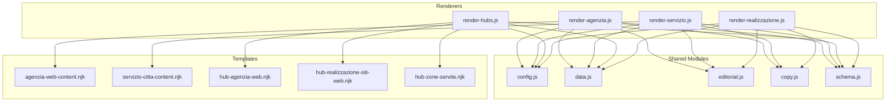
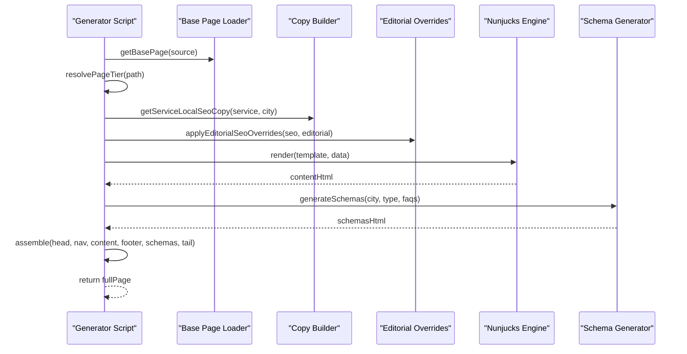
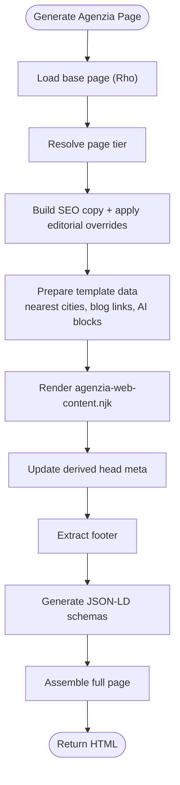
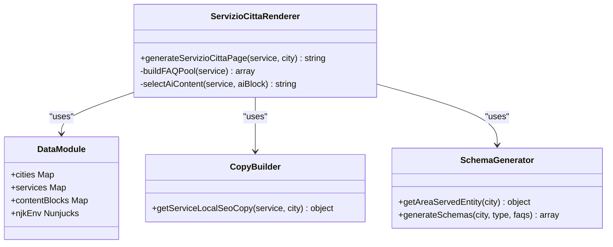
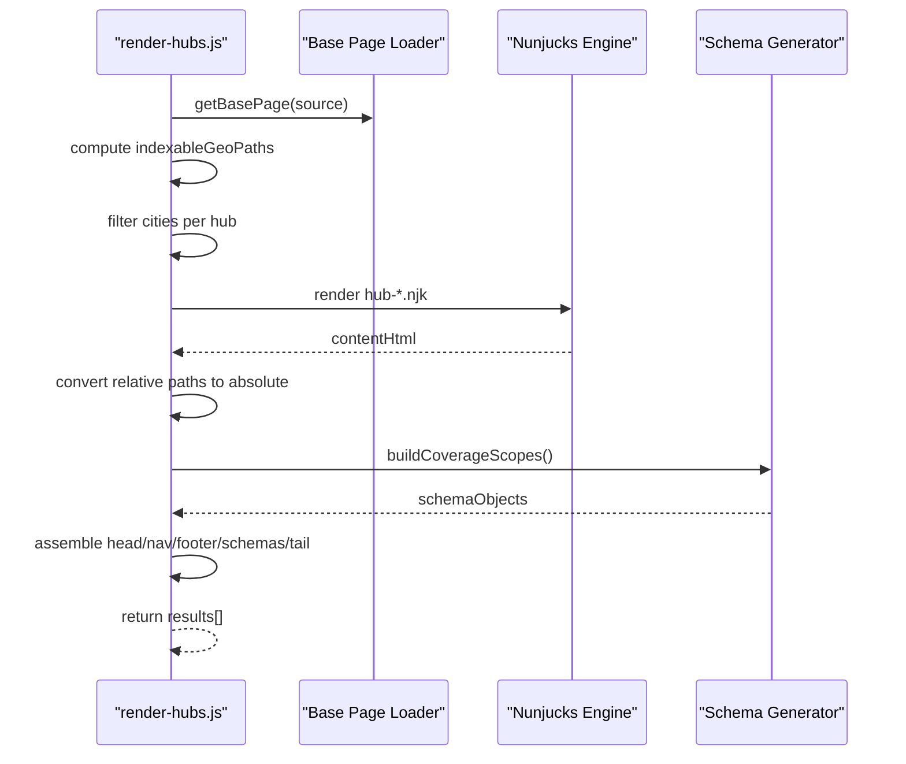
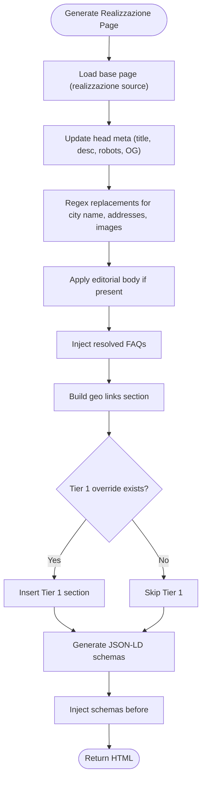
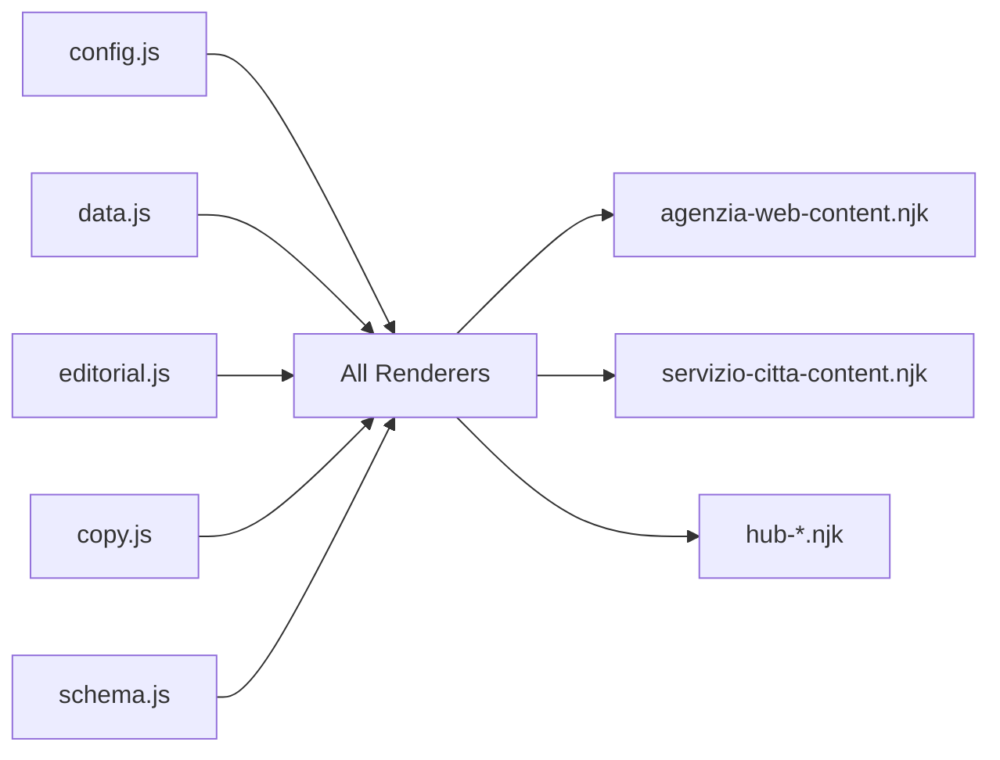

# Page Type Renderers

<cite>
**Referenced Files in This Document**
- [render-agenzia.js](file://scripts/geo/render-agenzia.js)
- [render-servizio.js](file://scripts/geo/render-servizio.js)
- [render-hubs.js](file://scripts/geo/render-hubs.js)
- [render-realizzazione.js](file://scripts/geo/render-realizzazione.js)
- [config.js](file://scripts/geo/config.js)
- [data.js](file://scripts/geo/data.js)
- [editorial.js](file://scripts/geo/editorial.js)
- [copy.js](file://scripts/geo/copy.js)
- [schema.js](file://scripts/geo/schema.js)
- [agenzia-web-content.njk](file://templates/agenzia-web-content.njk)
- [servizio-citta-content.njk](file://templates/servizio-citta-content.njk)
- [hub-agenzia-web.njk](file://templates/hub-agenzia-web.njk)
- [hub-realizzazione-siti-web.njk](file://templates/hub-realizzazione-siti-web.njk)
- [hub-zone-servite.njk](file://templates/hub-zone-servite.njk)
</cite>

## Table of Contents
1. [Introduction](#introduction)
2. [Project Structure](#project-structure)
3. [Core Components](#core-components)
4. [Architecture Overview](#architecture-overview)
5. [Detailed Component Analysis](#detailed-component-analysis)
6. [Dependency Analysis](#dependency-analysis)
7. [Performance Considerations](#performance-considerations)
8. [Troubleshooting Guide](#troubleshooting-guide)
9. [Conclusion](#conclusion)
10. [Appendices](#appendices)

## Introduction
This document explains the specialized page renderers that generate geo-targeted content for four page types:
- Agency pages (agenzia-web)
- Service×City pages (servizio-città combinations)
- Hub pages (internal linking bridges)
- Realization pages (realizzazione-siti-web)

It covers the renderer architecture, template system, content personalization logic, and SEO optimization features specific to each page type. It also clarifies differences between hand-crafted pages (e.g., Rho) and template-generated pages, and provides guidance on extending the renderer system for new page types.

## Project Structure
The geo rendering pipeline is implemented as a set of Node.js scripts under scripts/geo, with Nunjucks templates under templates. Shared configuration and data are centralized in config.js and data.js. Editorial overrides and copy generation live in editorial.js and copy.js. JSON-LD schemas are generated by schema.js.

**Diagram sources**
- [render-agenzia.js](file://scripts/geo/render-agenzia.js)
- [render-servizio.js](file://scripts/geo/render-servizio.js)
- [render-hubs.js](file://scripts/geo/render-hubs.js)
- [render-realizzazione.js](file://scripts/geo/render-realizzazione.js)
- [config.js](file://scripts/geo/config.js)
- [data.js](file://scripts/geo/data.js)
- [editorial.js](file://scripts/geo/editorial.js)
- [copy.js](file://scripts/geo/copy.js)
- [schema.js](file://scripts/geo/schema.js)
- [agenzia-web-content.njk](file://templates/agenzia-web-content.njk)
- [servizio-citta-content.njk](file://templates/servizio-citta-content.njk)
- [hub-agenzia-web.njk](file://templates/hub-agenzia-web.njk)
- [hub-realizzazione-siti-web.njk](file://templates/hub-realizzazione-siti-web.njk)
- [hub-zone-servite.njk](file://templates/hub-zone-servite.njk)

**Section sources**
- [config.js](file://scripts/geo/config.js)
- [data.js](file://scripts/geo/data.js)

## Core Components
- Renderer modules:
  - render-agenzia.js: Generates agency pages per city using a Nunjucks template and base page assembly.
  - render-servizio.js: Generates service×city pages with cluster-aware content variation and FAQ pools.
  - render-hubs.js: Generates hub pages (agenzia-web, realizzazione-siti-web, zone-servite) with internal linking and coverage scopes.
  - render-realizzazione.js: Generates realization pages via regex-based base template substitution and optional Tier 1 blocks.
- Shared modules:
  - config.js: Site constants, CLI flags, tier resolution, robots directives.
  - data.js: City/service catalogs, Nunjucks environment, blog index, avatar helpers.
  - editorial.js: Hand-written per-city SEO/body overrides.
  - copy.js: Localized SEO copy builders per service and city.
  - schema.js: JSON-LD schema generation (WebPage, Service, FAQPage, BreadcrumbList).

Key responsibilities:
- Template selection and rendering (Nunjucks)
- Base page extraction and assembly (head, nav, footer, tail)
- Content personalization (AI blocks, editorial overrides, local context)
- SEO metadata injection (title, description, canonical, robots, OG/Twitter)
- Schema markup generation and injection
- Internal linking strategy (near cities, related services, hubs)

**Section sources**
- [render-agenzia.js](file://scripts/geo/render-agenzia.js)
- [render-servizio.js](file://scripts/geo/render-servizio.js)
- [render-hubs.js](file://scripts/geo/render-hubs.js)
- [render-realizzazione.js](file://scripts/geo/render-realizzazione.js)
- [config.js](file://scripts/geo/config.js)
- [data.js](file://scripts/geo/data.js)
- [editorial.js](file://scripts/geo/editorial.js)
- [copy.js](file://scripts/geo/copy.js)
- [schema.js](file://scripts/geo/schema.js)

## Architecture Overview
Each renderer follows a consistent flow:
1. Load base page(s) from templates/base-pages or source HTML files.
2. Compute page tier and indexability based on governance rules.
3. Build localized SEO copy and apply editorial overrides.
4. Prepare template data (city, service, AI blocks, FAQs, links).
5. Render content via Nunjucks (for template-driven pages) or perform targeted substitutions (regex-based).
6. Inject head meta, body sections, footer, and JSON-LD schemas.
7. Return full HTML ready for output.

**Diagram sources**
- [render-agenzia.js](file://scripts/geo/render-agenzia.js)
- [render-servizio.js](file://scripts/geo/render-servizio.js)
- [render-hubs.js](file://scripts/geo/render-hubs.js)
- [render-realizzazione.js](file://scripts/geo/render-realizzazione.js)
- [config.js](file://scripts/geo/config.js)
- [data.js](file://scripts/geo/data.js)
- [editorial.js](file://scripts/geo/editorial.js)
- [copy.js](file://scripts/geo/copy.js)
- [schema.js](file://scripts/geo/schema.js)

## Detailed Component Analysis

### Agency Pages (agenzia-web)
- Purpose: Geo-targeted landing for “Agenzia Web” per city.
- Rendering approach:
  - Uses a base page (Rho source) and injects city-specific content via Nunjucks template agenzia-web-content.njk.
  - Computes nearest cities, related pages, and blog links.
  - Supports Tier 1 hand-crafted content override via JSON block.
- Personalization:
  - AI-enriched market analysis and competitive context merged into section text.
  - Editorial overrides can replace SEO and hero copy.
- SEO:
  - Dynamic title/description/canonical/robots; OG tags injected.
  - JSON-LD includes BreadcrumbList, WebPage, Service, OfferCatalog, and FAQPage when applicable.
- Internal linking:
  - Links to nearby agency pages and related blog articles.

**Diagram sources**
- [render-agenzia.js](file://scripts/geo/render-agenzia.js)
- [agenzia-web-content.njk](file://templates/agenzia-web-content.njk)
- [schema.js](file://scripts/geo/schema.js)

**Section sources**
- [render-agenzia.js](file://scripts/geo/render-agenzia.js)
- [agenzia-web-content.njk](file://templates/agenzia-web-content.njk)
- [schema.js](file://scripts/geo/schema.js)

### Service×City Pages (servizio-città)
- Purpose: Geo-targeted landing for a specific service in a specific city.
- Rendering approach:
  - Uses Nunjucks template servizio-citta-content.njk.
  - Cluster-aware content variation (web build, marketing, strategy) to avoid intra-municipal duplication.
  - Dedicated FAQ pools per cluster; editorial overrides supported.
- Personalization:
  - AI content selected by cluster; competitive insight and unique data points included.
  - Related city pages and other services in same city linked.
- SEO:
  - Title/description/canonical/robots; OG tags; structured data for Service, WebPage, BreadcrumbList, FAQPage.
- Internal linking:
  - Nearby cities’ same-service pages; other services in same city; link to agency page for city.

**Diagram sources**
- [render-servizio.js](file://scripts/geo/render-servizio.js)
- [servizio-citta-content.njk](file://templates/servizio-citta-content.njk)
- [data.js](file://scripts/geo/data.js)
- [copy.js](file://scripts/geo/copy.js)
- [schema.js](file://scripts/geo/schema.js)

**Section sources**
- [render-servizio.js](file://scripts/geo/render-servizio.js)
- [servizio-citta-content.njk](file://templates/servizio-citta-content.njk)
- [data.js](file://scripts/geo/data.js)
- [copy.js](file://scripts/geo/copy.js)
- [schema.js](file://scripts/geo/schema.js)

### Hub Pages (internal linking bridges)
- Purpose: Aggregate hubs for agenzia-web, realizzazione-siti-web, and zone-servite.
- Rendering approach:
  - Single generator builds three hub pages using dedicated Nunjucks templates.
  - Converts relative paths to absolute for subdirectory serving.
  - Injects shared CSS and schemas.
- Personalization:
  - Coverage scopes computed from approved indexable pages.
  - Featured cities and counts per scope.
- SEO:
  - CollectionPage schemas with numberOfItems and hasPart references.
  - BreadcrumbList per hub.
- Internal linking:
  - City grids with avatars; links to all service×city pages where approved.

**Diagram sources**
- [render-hubs.js](file://scripts/geo/render-hubs.js)
- [hub-agenzia-web.njk](file://templates/hub-agenzia-web.njk)
- [hub-realizzazione-siti-web.njk](file://templates/hub-realizzazione-siti-web.njk)
- [hub-zone-servite.njk](file://templates/hub-zone-servite.njk)
- [schema.js](file://scripts/geo/schema.js)

**Section sources**
- [render-hubs.js](file://scripts/geo/render-hubs.js)
- [hub-agenzia-web.njk](file://templates/hub-agenzia-web.njk)
- [hub-realizzazione-siti-web.njk](file://templates/hub-realizzazione-siti-web.njk)
- [hub-zone-servite.njk](file://templates/hub-zone-servite.njk)
- [schema.js](file://scripts/geo/schema.js)

### Realization Pages (realizzazione-siti-web)
- Purpose: Geo-targeted landing for “Realizzazione Siti Web” per city.
- Rendering approach:
  - Regex-based base template substitution targeting specific placeholders.
  - Optional Tier 1 editorial block rendered via helper function.
  - Injects geo links and FAQs before closing main.
- Personalization:
  - Replaces city name, address, images, and landmarks across the page.
  - Market intro enriched by AI blocks when available.
- SEO:
  - Head meta updated; robots directive built per path.
  - JSON-LD schemas include LocalBusiness-like entities and FAQPage.
- Internal linking:
  - Nearest cities listed; geo links section appended.

**Diagram sources**
- [render-realizzazione.js](file://scripts/geo/render-realizzazione.js)
- [editorial.js](file://scripts/geo/editorial.js)
- [schema.js](file://scripts/geo/schema.js)

**Section sources**
- [render-realizzazione.js](file://scripts/geo/render-realizzazione.js)
- [editorial.js](file://scripts/geo/editorial.js)
- [schema.js](file://scripts/geo/schema.js)

## Dependency Analysis
- Common dependencies:
  - config.js: Provides site constants, tier resolution, robots builder.
  - data.js: Supplies cities/services catalogs, Nunjucks env, blog index, avatar helpers.
  - editorial.js: Applies hand-written SEO/body overrides.
  - copy.js: Builds localized SEO copy per service/city.
  - schema.js: Generates JSON-LD structures.
- Template dependencies:
  - agenzia-web-content.njk: Used by agency renderer.
  - servizio-citta-content.njk: Used by service×city renderer.
  - hub-*.njk: Used by hub renderer for aggregation pages.

**Diagram sources**
- [config.js](file://scripts/geo/config.js)
- [data.js](file://scripts/geo/data.js)
- [editorial.js](file://scripts/geo/editorial.js)
- [copy.js](file://scripts/geo/copy.js)
- [schema.js](file://scripts/geo/schema.js)
- [agenzia-web-content.njk](file://templates/agenzia-web-content.njk)
- [servizio-citta-content.njk](file://templates/servizio-citta-content.njk)
- [hub-agenzia-web.njk](file://templates/hub-agenzia-web.njk)
- [hub-realizzazione-siti-web.njk](file://templates/hub-realizzazione-siti-web.njk)
- [hub-zone-servite.njk](file://templates/hub-zone-servite.njk)

**Section sources**
- [config.js](file://scripts/geo/config.js)
- [data.js](file://scripts/geo/data.js)
- [editorial.js](file://scripts/geo/editorial.js)
- [copy.js](file://scripts/geo/copy.js)
- [schema.js](file://scripts/geo/schema.js)

## Performance Considerations
- Template rendering:
  - Nunjucks configured with trim/lstrip for efficient parsing.
  - Avoid heavy computations inside templates; precompute data in renderers.
- Base page assembly:
  - Extracting head/nav/footer via substring operations is fast but brittle; ensure stable markers.
- Indexability gating:
  - Tier resolution prevents generating low-value pages; reduces footprint and crawl waste.
- Asset path handling:
  - Hub pages convert relative paths to absolute to avoid broken assets in subdirectories.

[No sources needed since this section provides general guidance]

## Troubleshooting Guide
Common issues and resolutions:
- Missing base page:
  - Ensure the expected base file exists (e.g., agenzia-web-source.html or realizzazione-siti-web-source.html).
- No content blocks loaded:
  - Verify approved content blocks directory and permissions; draft/unverified blocks are suppressed.
- Incorrect robots directive:
  - Confirm governance rules for the target path; use buildRobotsContent consistently.
- Broken asset paths in hubs:
  - Confirm path conversion logic runs; check for missing replacements.
- Schema errors:
  - Validate JSON-LD structure; ensure required fields like @context and @type are present.

**Section sources**
- [render-agenzia.js](file://scripts/geo/render-agenzia.js)
- [render-servizio.js](file://scripts/geo/render-servizio.js)
- [render-hubs.js](file://scripts/geo/render-hubs.js)
- [render-realizzazione.js](file://scripts/geo/render-realizzazione.js)
- [data.js](file://scripts/geo/data.js)
- [config.js](file://scripts/geo/config.js)

## Conclusion
The geo renderer system combines modular JavaScript generators with Nunjucks templates and robust SEO tooling. Each page type follows a consistent pattern: load base, compute tier, build localized copy, render content, inject metadata and schemas, and assemble final HTML. The system supports both template-driven and regex-based approaches, enabling flexibility for hand-crafted and automated pages. Extending the system involves adding new renderers, templates, and copy/schema modules while reusing shared utilities.

[No sources needed since this section summarizes without analyzing specific files]

## Appendices

### Differences Between Hand-Crafted and Template-Generated Pages
- Hand-crafted pages (e.g., Rho):
  - Use base page with targeted regex substitutions and optional Tier 1 editorial blocks.
  - Allow precise control over content and imagery per city.
- Template-generated pages:
  - Use Nunjucks templates to compose sections from structured data.
  - Support dynamic insertion of AI blocks, FAQs, and related links.

[No sources needed since this section doesn't analyze specific files]

### Extending the Renderer System for New Page Types
Steps:
1. Create a new renderer module following existing patterns:
   - Load base page(s), resolve tier, build SEO copy, prepare template data.
   - Render via Nunjucks or regex substitutions.
   - Inject head meta, footer, and JSON-LD schemas.
2. Add a new Nunjucks template under templates if needed.
3. Extend copy.js with localized SEO copy for the new page type.
4. Update schema.js to include relevant JSON-LD structures.
5. Integrate with hub generation if the new page type should be aggregated.

**Section sources**
- [render-agenzia.js](file://scripts/geo/render-agenzia.js)
- [render-servizio.js](file://scripts/geo/render-servizio.js)
- [render-hubs.js](file://scripts/geo/render-hubs.js)
- [render-realizzazione.js](file://scripts/geo/render-realizzazione.js)
- [copy.js](file://scripts/geo/copy.js)
- [schema.js](file://scripts/geo/schema.js)