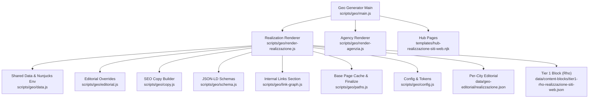
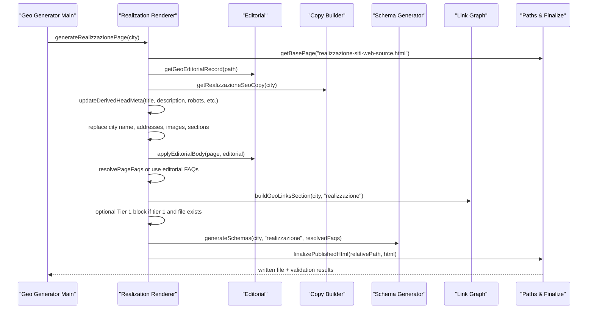
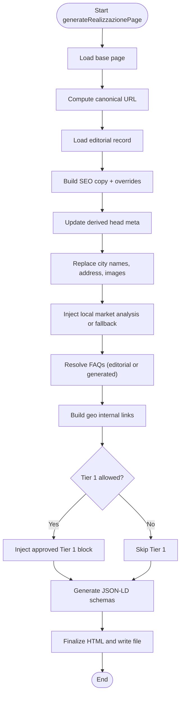

# Realization Page Renderer

<cite>
**Referenced Files in This Document**
- [render-realizzazione.js](file://scripts/geo/render-realizzazione.js)
- [render-agenzia.js](file://scripts/geo/render-agenzia.js)
- [main.js](file://scripts/geo/main.js)
- [data.js](file://scripts/geo/data.js)
- [editorial.js](file://scripts/geo/editorial.js)
- [copy.js](file://scripts/geo/copy.js)
- [schema.js](file://scripts/geo/schema.js)
- [link-graph.js](file://scripts/geo/link-graph.js)
- [paths.js](file://scripts/geo/paths.js)
- [config.js](file://scripts/geo/config.js)
- [realizzazione.json](file://data/geo-editorial/realizzazione.json)
- [hub-realizzazione-siti-web.njk](file://templates/hub-realizzazione-siti-web.njk)
- [tier1-rho-realizzazione-siti-web.json](file://data/content-blocks/tier1-rho-realizzazione-siti-web.json)
</cite>

## Table of Contents
1. Introduction
2. Project Structure
3. Core Components
4. Architecture Overview
5. Detailed Component Analysis
6. Dependency Analysis
7. Performance Considerations
8. Troubleshooting Guide
9. Conclusion

## Introduction
This document explains the realization page renderer that generates geo-targeted “Realizzazione Siti Web” pages for cities and areas around Rho. It covers how the renderer differs from the agency renderer, how city-specific data is processed, how local market analysis and SEO are integrated, and how realization pages fit into the broader geo-page generation system including hubs, service×city pages, and editorial tiers.

## Project Structure
The realization renderer is part of a unified geo-page generator pipeline:
- The orchestrator selects which pages to generate and routes each city to the correct renderer.
- The realization renderer loads a base template, merges editorial copy, injects city data, builds FAQs, adds internal links, and attaches JSON-LD schemas.
- Shared utilities provide data loading, path resolution, head/meta updates, schema generation, link graph building, and final HTML normalization before writing published files.



**Diagram sources**
- [main.js:33-36](file://scripts/geo/main.js#L33-L36)
- [render-realizzazione.js:33-35](file://scripts/geo/render-realizzazione.js#L33-L35)
- [render-agenzia.js:34-36](file://scripts/geo/render-agenzia.js#L34-L36)
- [data.js:113-119](file://scripts/geo/data.js#L113-L119)
- [editorial.js:13-25](file://scripts/geo/editorial.js#L13-L25)
- [schema.js:73-97](file://scripts/geo/schema.js#L73-L97)
- [link-graph.js:14-34](file://scripts/geo/link-graph.js#L14-L34)
- [paths.js:23-32](file://scripts/geo/paths.js#L23-L32)
- [config.js:16-30](file://scripts/geo/config.js#L16-L30)

**Section sources**
- [main.js:38-66](file://scripts/geo/main.js#L38-L66)
- [render-realizzazione.js:33-35](file://scripts/geo/render-realizzazione.js#L33-L35)
- [render-agenzia.js:34-36](file://scripts/geo/render-agenzia.js#L34-L36)
- [data.js:15-23](file://scripts/geo/data.js#L15-L23)
- [paths.js:23-32](file://scripts/geo/paths.js#L23-L32)
- [config.js:16-30](file://scripts/geo/config.js#L16-L30)

## Core Components
- Realization renderer: Builds city-specific realization pages by templating a base page with regex-based replacements, applying editorial overrides, injecting FAQs, adding internal links, and attaching schemas.
- Agency renderer: Uses a Nunjucks template to render agency pages per city; it composes content via a structured template rather than regex swaps.
- Orchestrator: Iterates cities and services, calls the appropriate renderer, validates output, writes files, and produces a link graph.
- Shared modules: Provide city/service data, editorial records, SEO copy, schema generation, internal linking, path helpers, and configuration tokens.

Key differences between realization and agency renderers:
- Realization uses a base HTML page and targeted string replacements plus an editorial body injection.
- Agency uses a dedicated Nunjucks template with rich template data and computed sections.
- Both share common utilities for SEO, schemas, links, and finalization.

**Section sources**
- [render-realizzazione.js:33-199](file://scripts/geo/render-realizzazione.js#L33-L199)
- [render-agenzia.js:34-188](file://scripts/geo/render-agenzia.js#L34-L188)
- [main.js:70-150](file://scripts/geo/main.js#L70-L150)
- [editorial.js:13-56](file://scripts/geo/editorial.js#L13-L56)
- [schema.js:73-191](file://scripts/geo/schema.js#L73-L191)

## Architecture Overview
The realization page rendering flow integrates multiple stages:
- Load base page and compute canonical URL.
- Resolve editorial record and apply SEO overrides.
- Build localized hero, breadcrumb, address, and images.
- Inject AI-enriched or fallback local market context.
- Replace service-related strings with city-specific values.
- Render FAQs and insert geo internal links.
- Optionally inject Tier 1 hand-crafted block when allowed.
- Generate and attach JSON-LD schemas.
- Finalize HTML and write to publish directory.



**Diagram sources**
- [main.js:115-150](file://scripts/geo/main.js#L115-L150)
- [render-realizzazione.js:33-199](file://scripts/geo/render-realizzazione.js#L33-L199)
- [editorial.js:13-56](file://scripts/geo/editorial.js#L13-L56)
- [schema.js:73-191](file://scripts/geo/schema.js#L73-L191)
- [link-graph.js:14-34](file://scripts/geo/link-graph.js#L14-L34)
- [paths.js:91-106](file://scripts/geo/paths.js#L91-L106)

## Detailed Component Analysis

### Realization Page Renderer
Responsibilities:
- Load base page and compute canonical URL.
- Merge editorial SEO overrides and body.
- Localize hero, breadcrumb, address, images, and section text.
- Integrate AI-enriched local market analysis or fallback local context.
- Build FAQs from editorial or generated sources.
- Insert geo internal links and optional Tier 1 block.
- Attach JSON-LD schemas and finalize HTML.

City-specific processing highlights:
- Hero tag, H1, and capsule come from SEO copy merged with editorial overrides.
- Address and coordinates are replaced using city data.
- Images are swapped to city-specific assets when available.
- Market intro uses AI blocks when present, otherwise falls back to localContext fields.
- Nearby cities are mapped and linked.

SEO features tailored for realization services:
- Title, description, OG/Twitter metadata updated per city.
- Robots directive built from governance rules.
- FAQPage schema attached when FAQs exist.
- Service and Offer catalogs included in schemas.

Integration points:
- Uses shared data loader for cities/services and Nunjucks environment.
- Uses editorial module for per-city overrides and body replacement.
- Uses copy builder for default realization SEO copy.
- Uses schema generator for structured data.
- Uses link-graph helper for nearby city links.
- Uses paths helper for base page caching and finalization.



**Diagram sources**
- [render-realizzazione.js:33-199](file://scripts/geo/render-realizzazione.js#L33-L199)
- [editorial.js:13-56](file://scripts/geo/editorial.js#L13-L56)
- [schema.js:73-191](file://scripts/geo/schema.js#L73-L191)
- [link-graph.js:14-34](file://scripts/geo/link-graph.js#L14-L34)
- [paths.js:91-106](file://scripts/geo/paths.js#L91-L106)

**Section sources**
- [render-realizzazione.js:33-199](file://scripts/geo/render-realizzazione.js#L33-L199)
- [editorial.js:13-56](file://scripts/geo/editorial.js#L13-L56)
- [schema.js:73-191](file://scripts/geo/schema.js#L73-L191)
- [link-graph.js:14-34](file://scripts/geo/link-graph.js#L14-L34)
- [paths.js:23-32](file://scripts/geo/paths.js#L23-L32)

### Agency Renderer Comparison
- Rendering approach: Agency pages are rendered via a Nunjucks template with structured template data, while realization pages rely on a base HTML page with targeted replacements and editorial body injection.
- Content composition: Agency renderer computes nearest cities, related pages, blog links, and renders full content through the template. Realization renderer focuses on precise string swaps and modular injections.
- Shared utilities: Both use the same editorial, copy, schema, link-graph, and path modules for consistency across page types.

**Section sources**
- [render-agenzia.js:34-188](file://scripts/geo/render-agenzia.js#L34-L188)
- [render-realizzazione.js:33-199](file://scripts/geo/render-realizzazione.js#L33-L199)

### Hub Integration
- The hub page lists cities served for realization services and provides navigation to individual city pages.
- It displays coverage counts, distance metadata, and avatars where available.
- Realization pages link back to the hub via breadcrumbs and schema item references.

**Section sources**
- [hub-realizzazione-siti-web.njk:1-118](file://templates/hub-realizzazione-siti-web.njk#L1-L118)
- [schema.js:114-136](file://scripts/geo/schema.js#L114-L136)

### Tier 1 Editorial Blocks
- When a page is classified as Tier 1 and a corresponding JSON override exists, the renderer injects a hand-crafted section into the page.
- For Rho realization pages, a specific Tier 1 block defines headline, body paragraphs, bullets, and callout content.
- This mechanism ensures high-priority pages have verified, approved content without diverging from the shared layout.

**Section sources**
- [render-realizzazione.js:180-192](file://scripts/geo/render-realizzazione.js#L180-L192)
- [tier1-rho-realizzazione-siti-web.json:1-34](file://data/content-blocks/tier1-rho-realizzazione-siti-web.json#L1-L34)

### Local Market Analysis Integration
- If an AI-generated content block exists for the city, its localMarketAnalysis and competitiveContext are used to enrich the market introduction.
- Otherwise, the renderer falls back to city.localContext fields such as tessutoEconomico and opportunitaDigitale.
- Highlights from localContext can be rendered as landmark references to strengthen locality signals.

**Section sources**
- [render-realizzazione.js:135-153](file://scripts/geo/render-realizzazione.js#L135-L153)
- [data.js:91-98](file://scripts/geo/data.js#L91-L98)

### SEO Optimization Features
- Head metadata: title, description, keywords, canonical, robots, and social tags are updated per city.
- JSON-LD: BreadcrumbList, WebPage, Service, OfferCatalog, Offers, and FAQPage schemas are generated and attached.
- Internal linking: Nearby cities are linked to reinforce geographic relevance.
- Governance: Robots directives and indexability rules are applied via configuration.

**Section sources**
- [render-realizzazione.js:50-65](file://scripts/geo/render-realizzazione.js#L50-L65)
- [schema.js:73-191](file://scripts/geo/schema.js#L73-L191)
- [link-graph.js:14-34](file://scripts/geo/link-graph.js#L14-L34)
- [config.js:62-78](file://scripts/geo/config.js#L62-L78)

### City-Specific Data Processing Examples
- Address and coordinates: Replaced with city.cap, city.lat, city.lng, and formatted address strings.
- Images: Swapped to city-specific image files and alt texts when available.
- Nearby cities: Mapped via cityMap and linked with distances.
- FAQs: Resolved from editorial FAQs when present, otherwise generated from city and service context.

**Section sources**
- [render-realizzazione.js:83-101](file://scripts/geo/render-realizzazione.js#L83-L101)
- [render-realizzazione.js:121-133](file://scripts/geo/render-realizzazione.js#L121-L133)
- [render-realizzazione.js:159-169](file://scripts/geo/render-realizzazione.js#L159-L169)
- [render-realizzazione.js:171-175](file://scripts/geo/render-realizzazione.js#L171-L175)

### Relationship to Other Page Types
- Agenzia pages: Separate renderer using Nunjucks templates; shares editorial, copy, schema, and link-graph modules.
- Servizio×Città pages: Generated combinatorially for eligible services and cities; validated and written similarly.
- Hubs: Centralized entry points listing cities and services; realization hub links to city pages.
- All page types participate in the same link graph and governance rules for indexability and robots directives.

**Section sources**
- [main.js:70-195](file://scripts/geo/main.js#L70-L195)
- [render-agenzia.js:34-188](file://scripts/geo/render-agenzia.js#L34-L188)
- [link-graph.js:53-89](file://scripts/geo/link-graph.js#L53-L89)

## Dependency Analysis
The realization renderer depends on several shared modules:
- Data: Cities, services, content blocks, and Nunjucks environment.
- Editorial: Per-city SEO overrides and body injection.
- Copy: Default realization SEO copy and price formatting.
- Schema: Structured data generation for SEO.
- Link-graph: Nearby city links and link graph generation.
- Paths: Base page caching, finalization, and publishing.
- Config: Site constants, tokens, CLI flags, and governance helpers.

```mermaid
graph LR
RZ["Realization Renderer"] --> DT["Data Loader"]
RZ --> ED["Editorial"]
RZ --> CP["Copy Builder"]
RZ --> SC["Schema Generator"]
RZ --> LG["Link Graph"]
RZ --> PT["Paths & Finalize"]
RZ --> CF["Config"]
DT --> |cities, services| RZ
ED|overrides, body| RZ
CP|seo copy| RZ
SC|json-ld| RZ
LG|nearby links| RZ
PT|base page, finalize| RZ
CF|tokens, governance| RZ
```

**Diagram sources**
- [render-realizzazione.js:6-31](file://scripts/geo/render-realizzazione.js#L6-L31)
- [data.js:15-23](file://scripts/geo/data.js#L15-L23)
- [editorial.js:13-56](file://scripts/geo/editorial.js#L13-L56)
- [copy.js:1-12](file://scripts/geo/copy.js#L1-L12)
- [schema.js:4-16](file://scripts/geo/schema.js#L4-L16)
- [link-graph.js:4-13](file://scripts/geo/link-graph.js#L4-L13)
- [paths.js:23-32](file://scripts/geo/paths.js#L23-L32)
- [config.js:16-30](file://scripts/geo/config.js#L16-L30)

**Section sources**
- [render-realizzazione.js:6-31](file://scripts/geo/render-realizzazione.js#L6-L31)
- [data.js:15-23](file://scripts/geo/data.js#L15-L23)
- [editorial.js:13-56](file://scripts/geo/editorial.js#L13-L56)
- [copy.js:1-12](file://scripts/geo/copy.js#L1-L12)
- [schema.js:4-16](file://scripts/geo/schema.js#L4-L16)
- [link-graph.js:4-13](file://scripts/geo/link-graph.js#L4-L13)
- [paths.js:23-32](file://scripts/geo/paths.js#L23-L32)
- [config.js:16-30](file://scripts/geo/config.js#L16-L30)

## Performance Considerations
- Base page caching reduces repeated file reads during generation.
- Regex-based replacements are efficient but should remain targeted to avoid unintended matches.
- AI-enriched content blocks are loaded only when approved, preventing unnecessary overhead.
- Finalization applies minimal transformations and preserves governed custom blocks to maintain stability.
- Link graph generation scans published files after writing, so it does not impact generation performance directly.

[No sources needed since this section provides general guidance]

## Troubleshooting Guide
Common issues and remedies:
- Missing base page: Ensure the base page file exists in the base pages directory; the renderer logs an error if not found.
- Validation failures: Check validation warnings and blocked issues reported by the orchestrator; fix content or structure accordingly.
- Empty FAQs: Verify editorial FAQs exist for the city; otherwise, ensure generated FAQs resolve correctly.
- Missing Tier 1 block: Confirm the page is Tier 1 and the corresponding JSON override exists; otherwise, the block will be skipped.
- Image substitution failures: Ensure city.images entries exist and match expected patterns; verify file paths and alt texts.

**Section sources**
- [render-realizzazione.js:33-38](file://scripts/geo/render-realizzazione.js#L33-L38)
- [main.js:122-149](file://scripts/geo/main.js#L122-L149)
- [render-realizzazione.js:180-192](file://scripts/geo/render-realizzazione.js#L180-L192)
- [render-realizzazione.js:121-133](file://scripts/geo/render-realizzazione.js#L121-L133)

## Conclusion
The realization page renderer delivers highly localized “Realizzazione Siti Web” pages by combining a base template, editorial overrides, AI-enriched local context, structured FAQs, internal links, and comprehensive JSON-LD schemas. It differs from the agency renderer in its templating strategy and content composition approach while sharing core utilities for consistency. The renderer integrates tightly with the geo-page generation system, supporting hubs, Tier 1 editorial blocks, and governance-driven indexability and robots directives. This design enables scalable, city-specific pages optimized for local SEO and conversion.

[No sources needed since this section summarizes without analyzing specific files]