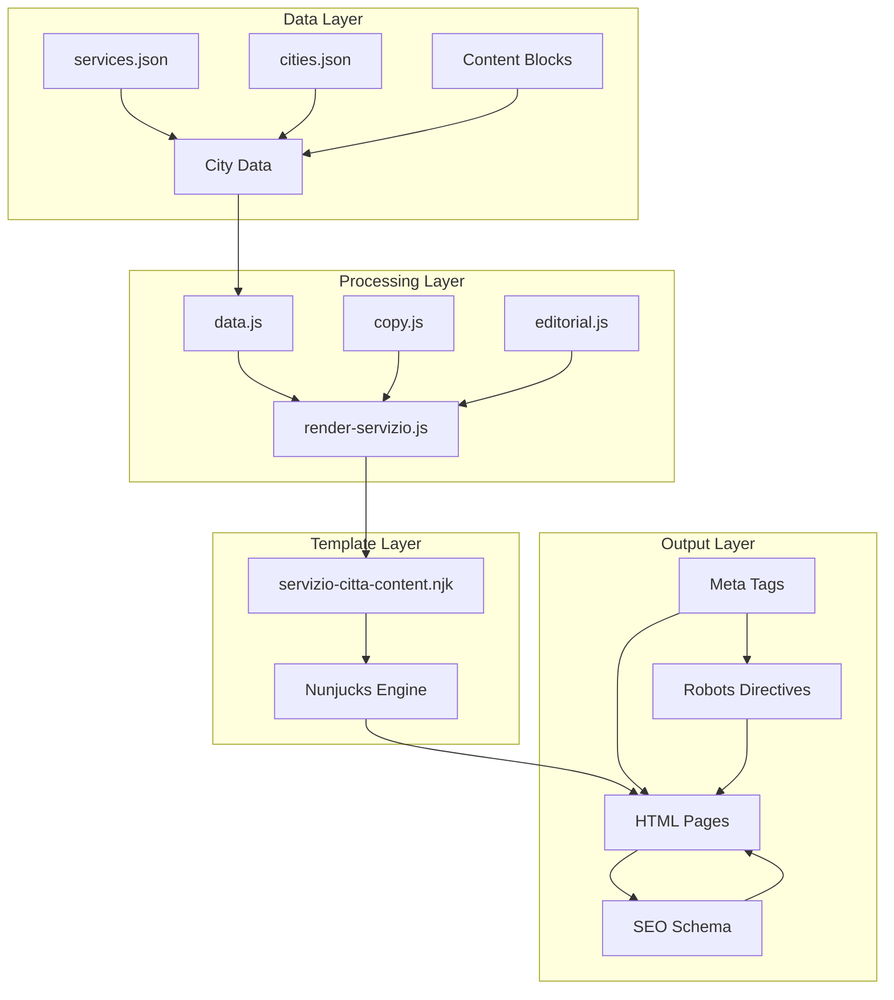
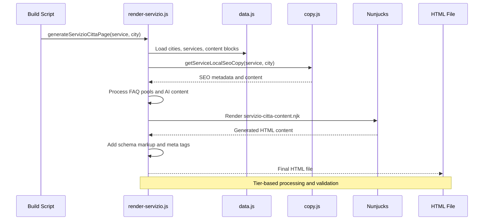
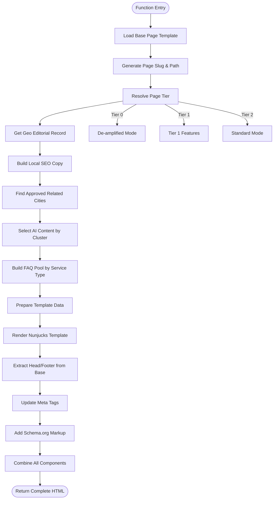
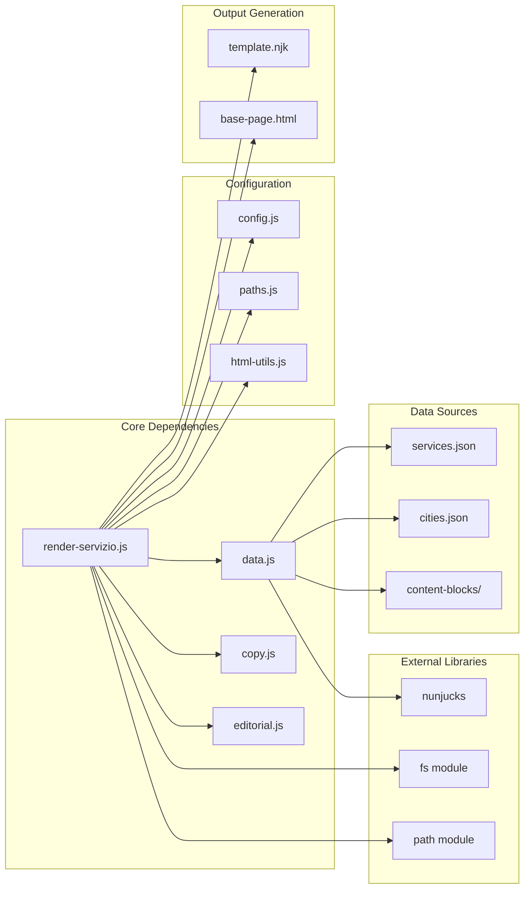

# Service Page Renderer

<cite>
**Referenced Files in This Document**
- [render-servizio.js](file://scripts/geo/render-servizio.js)
- [services.json](file://data/services.json)
- [cities.json](file://data/cities.json)
- [servizio-citta-content.njk](file://templates/servizio-citta-content.njk)
- [data.js](file://scripts/geo/data.js)
- [copy.js](file://scripts/geo/copy.js)
- [editorial.js](file://scripts/geo/editorial.js)
- [main.js](file://scripts/geo/main.js)
- [milano.json](file://data/content-blocks/milano.json)
</cite>

## Table of Contents
1. [Introduction](#introduction)
2. [Project Structure](#project-structure)
3. [Core Components](#core-components)
4. [Architecture Overview](#architecture-overview)
5. [Detailed Component Analysis](#detailed-component-analysis)
6. [Dependency Analysis](#dependency-analysis)
7. [Performance Considerations](#performance-considerations)
8. [Troubleshooting Guide](#troubleshooting-guide)
9. [Conclusion](#conclusion)

## Introduction

The Service Page Renderer is a sophisticated static site generation system that creates localized service-city pages by combining service definitions with city data. This system generates thousands of unique, SEO-optimized landing pages for each service × city combination, enabling hyper-local marketing and search engine optimization for WebNovis's digital services across the Milan metropolitan area.

The renderer transforms structured JSON data into fully functional HTML pages with dynamic content, local SEO optimization, and intelligent content variation based on service types and geographic locations. It serves as the core engine for WebNovis's geo-targeted SEO strategy, creating pages like `/seo-locale-lainate.html`, `/ecommerce-arese.html`, and similar combinations.

## Project Structure

The service page rendering system follows a modular architecture with clear separation of concerns:



**Diagram sources**
- [render-servizio.js:1-50](file://scripts/geo/render-servizio.js#L1-L50)
- [data.js:1-50](file://scripts/geo/data.js#L1-L50)
- [servizio-citta-content.njk:1-30](file://templates/servizio-citta-content.njk#L1-L30)

**Section sources**
- [render-servizio.js:1-100](file://scripts/geo/render-servizio.js#L1-L100)
- [data.js:1-100](file://scripts/geo/data.js#L1-L100)

## Core Components

### Service Definition System

The service catalog is defined in `services.json` and contains comprehensive metadata for each service offering:

| Field | Type | Description | Example |
|-------|------|-------------|---------|
| `slug` | string | URL-friendly identifier | `seo-locale` |
| `name` | string | Full service name | `SEO Locale e Posizionamento` |
| `shortName` | string | Display name | `SEO Locale` |
| `tier` | string | Service tier classification | `core` or `extended` |
| `priceFrom` | number | Starting price | `400` |
| `priceUnit` | string | Price unit (optional) | `/mese` |
| `timeEstimate` | string | Delivery timeframe | `3-6 mesi per risultati` |
| `hasPage` | boolean | Whether canonical page exists | `false` |
| `targetKeyword` | string | Primary SEO keyword | `SEO locale` |

### City Data Structure

City information provides geographic and contextual data for localization:

| Field | Type | Description | Example |
|-------|------|-------------|---------|
| `slug` | string | City identifier | `lainate` |
| `name` | string | City name | `Lainate` |
| `cap` | string | Postal code | `20045` |
| `population` | number | Population count | `26000` |
| `province` | string | Province code | `MI` |
| `distanzaSede` | string | Distance from headquarters | `8 min` |
| `nearCities` | array | Neighboring cities | `["origgio", "caronno-pertusella"]` |
| `localContext` | object | Economic and market data | See below |

The `localContext` object contains:
- `highlights`: Key landmarks and features
- `tessutoEconomico`: Economic fabric description
- `settoriChiave`: Key business sectors
- `opportunitaDigitale`: Digital opportunity analysis

**Section sources**
- [services.json:1-100](file://data/services.json#L1-L100)
- [cities.json:1-150](file://data/cities.json#L1-L150)

## Architecture Overview

The service page renderer implements a multi-stage processing pipeline:



**Diagram sources**
- [render-servizio.js:36-192](file://scripts/geo/render-servizio.js#L36-L192)
- [main.js:152-195](file://scripts/geo/main.js#L152-L195)

### Content Processing Pipeline

The renderer processes content through several transformation stages:

1. **Service-City Combination**: Creates unique identifiers and URLs
2. **SEO Metadata Generation**: Builds title, description, and Open Graph tags
3. **Content Variation**: Applies service-cluster-specific content strategies
4. **Local Context Integration**: Injects city-specific economic and market data
5. **Schema Markup**: Generates structured data for search engines
6. **Tier Classification**: Determines page importance and feature set

**Section sources**
- [render-servizio.js:36-192](file://scripts/geo/render-servizio.js#L36-L192)

## Detailed Component Analysis

### Service-City Page Generator

The core `generateServizioCittaPage` function orchestrates the entire page creation process:



**Diagram sources**
- [render-servizio.js:36-284](file://scripts/geo/render-servizio.js#L36-L284)

### Template System Architecture

The Nunjucks template system provides flexible content rendering with conditional logic:

#### Template Variables

| Variable | Type | Purpose | Example Usage |
|----------|------|---------|---------------|
| `city` | object | City data and context | `{{ city.name }}` |
| `service` | object | Service definition | `{{ service.priceFrom }}` |
| `seo` | object | Generated SEO metadata | `{{ seo.heroH1 }}` |
| `faqs` | array | FAQ questions and answers | `` |
| `aiContent` | string | AI-generated content | `{{ aiContent | safe }}` |
| `tier` | number | Page importance level | `` |

#### Conditional Rendering Logic

The template uses sophisticated conditional logic to adapt content based on:

- **Service Type**: Different layouts for web development vs. marketing services
- **City Characteristics**: Special handling for large cities vs. small towns
- **Tier Level**: Feature availability based on page importance
- **Content Availability**: Dynamic sections based on available data

**Section sources**
- [servizio-citta-content.njk:1-200](file://templates/servizio-citta-content.njk#L1-L200)

### Content Transformation Processes

#### Service Cluster Categorization

The system categorizes services into three main clusters for content variation:

1. **Web Development Services**: `sito-vetrina`, `ecommerce`, `landing-page`, `web-app`
2. **Marketing Services**: `social-media`, `email-marketing`, `google-ads`, `seo-locale`
3. **Strategy Services**: `consulenze`, `consulenza-digitale`, `automazione-business`

Each cluster receives different FAQ pools, content angles, and emphasis points to avoid intra-municipal duplication.

#### AI Content Integration

AI-generated content blocks are selectively integrated based on service type:

- **Web Development**: Uses `localMarketAnalysis` for market context
- **Marketing Services**: Uses `competitiveContext` for competitive positioning
- **Strategy Services**: Combines both `competitiveContext` and `localMarketAnalysis`

#### FAQ Pool Selection

The system maintains separate FAQ pools for each service cluster:

- **Web Dev FAQs**: Focus on technical implementation, timelines, and custom development
- **Marketing FAQs**: Emphasize ROI, measurement, and campaign management
- **Strategy FAQs**: Highlight consulting methodology and deliverables

**Section sources**
- [render-servizio.js:72-132](file://scripts/geo/render-servizio.js#L72-L132)
- [copy.js:1-150](file://scripts/geo/copy.js#L1-L150)

### SEO Features and Schema Markup

#### Structured Data Implementation

The renderer generates comprehensive Schema.org markup:

```json
{
  "@context": "https://schema.org",
  "@type": "Service",
  "@id": "canonical-url#service",
  "serviceType": "Service Name",
  "name": "Service Name at City",
  "description": "Localized service description",
  "provider": {"@id": "business-id"},
  "areaServed": {"@type": "City", "name": "City Name"},
  "offers": {
    "@type": "Offer",
    "price": "400",
    "priceCurrency": "EUR"
  }
}
```

#### Meta Tag Optimization

Dynamic meta tag generation includes:

- **Title Tags**: Service + City + Price + Brand
- **Descriptions**: Service description + Location + Call-to-action
- **Keywords**: Target keywords + location variations
- **Open Graph**: Social media optimization
- **Canonical URLs**: Proper URL structure for SEO

#### Robots Directive Handling

The system applies appropriate robots directives based on page tier:

- **Tier 1**: Full indexation with follow links
- **Tier 2**: Standard indexation with controlled linking
- **Tier 0**: De-amplified pages with noindex,follow

**Section sources**
- [render-servizio.js:218-283](file://scripts/geo/render-servizio.js#L218-L283)

## Dependency Analysis

The service page renderer has well-defined dependencies between components:



**Diagram sources**
- [render-servizio.js:4-34](file://scripts/geo/render-servizio.js#L4-L34)
- [data.js:1-20](file://scripts/geo/data.js#L1-L20)

### Module Relationships

| Module | Purpose | Dependencies | Exported Functions |
|--------|---------|--------------|-------------------|
| `data.js` | Data loading and processing | fs, nunjucks, config | `cities`, `services`, `njkEnv` |
| `copy.js` | SEO copy generation | data.js, html-utils | `getServiceLocalSeoCopy` |
| `editorial.js` | Editorial content handling | geo-editorial config | `applyEditorialSeoOverrides` |
| `render-servizio.js` | Main page generator | All above modules | `generateServizioCittaPage` |

### Circular Dependency Prevention

The system avoids circular dependencies through careful module design:

- Data loading is centralized in `data.js`
- Configuration is separated into dedicated modules
- Template rendering is isolated from data processing
- Output generation is handled separately from content assembly

**Section sources**
- [data.js:166-196](file://scripts/geo/data.js#L166-L196)
- [render-servizio.js:17-34](file://scripts/geo/render-servizio.js#L17-L34)

## Performance Considerations

### Build Optimization Strategies

The renderer implements several performance optimizations:

1. **Incremental Building**: Only rebuilds changed pages using hash comparison
2. **Lazy Loading**: Content blocks are loaded only when needed
3. **Memory Management**: Large datasets are processed in chunks
4. **Parallel Processing**: Independent operations run concurrently where possible

### Template Rendering Efficiency

Nunjucks configuration optimizes rendering performance:

- **Autoescape Disabled**: For security-controlled content
- **Block Trimming**: Removes unnecessary whitespace
- **Filter Registration**: Custom filters for Italian formatting

### Memory Usage Patterns

The system manages memory efficiently by:

- Reusing service and city objects across iterations
- Clearing intermediate results after use
- Implementing proper error handling to prevent memory leaks

## Troubleshooting Guide

### Common Issues and Solutions

#### Missing Service Data

**Problem**: Service not appearing in generated pages
**Solution**: Verify service exists in `services.json` and has `shouldGenerateGeoForService()` returning true

#### Template Rendering Errors

**Problem**: Nunjucks template compilation failures
**Solution**: Check template syntax and ensure all required variables are provided

#### SEO Metadata Issues

**Problem**: Incorrect meta tags or missing schema markup
**Solution**: Validate service configuration and editorial overrides

#### Performance Problems

**Problem**: Slow build times or high memory usage
**Solution**: Enable incremental building and monitor memory allocation

### Debugging Utilities

The system includes comprehensive logging and validation:

- **Build Validation**: Checks for missing data and invalid configurations
- **Content Validation**: Ensures minimum word counts and link structures
- **SEO Validation**: Verifies meta tags and schema markup completeness

**Section sources**
- [main.js:170-195](file://scripts/geo/main.js#L170-L195)

## Conclusion

The Service Page Renderer represents a sophisticated approach to generating localized service pages at scale. By combining structured data with intelligent content variation and comprehensive SEO optimization, it enables WebNovis to maintain thousands of unique, relevant landing pages for each service-city combination.

The system's modular architecture ensures maintainability and extensibility, while its performance optimizations make it suitable for large-scale deployment. The integration of AI-generated content, editorial oversight, and automated SEO best practices creates a robust foundation for geo-targeted marketing campaigns.

Key strengths include:

- **Scalable Architecture**: Handles hundreds of service-city combinations efficiently
- **Intelligent Content Variation**: Prevents duplication while maintaining relevance
- **Comprehensive SEO**: Implements modern SEO best practices automatically
- **Flexible Templating**: Supports complex conditional logic and dynamic content
- **Quality Assurance**: Built-in validation and error handling

This system serves as a model for enterprise-level static site generation with localized content, demonstrating how structured data, templating systems, and automation can work together to create scalable, maintainable, and SEO-optimized web content.