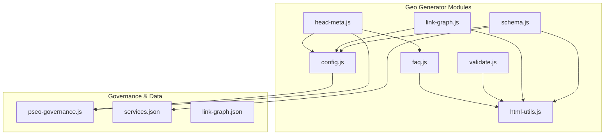
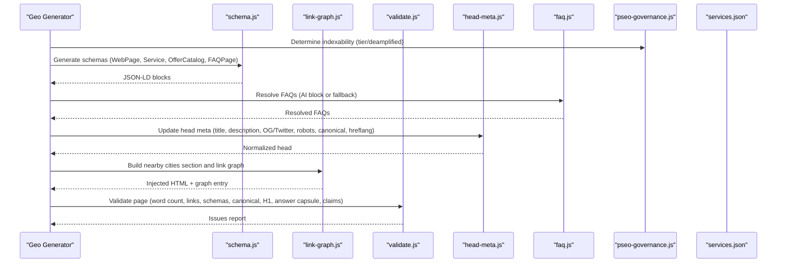
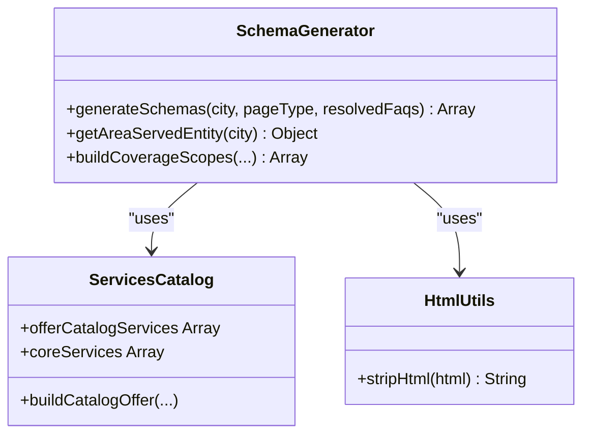
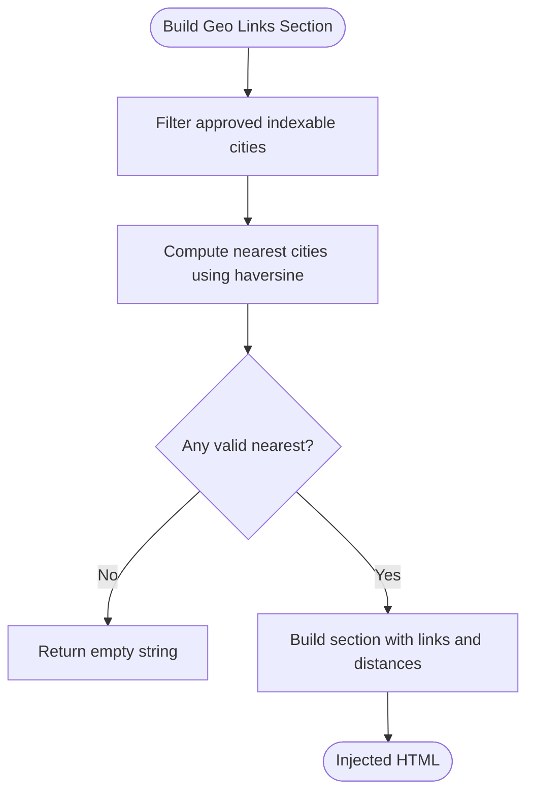
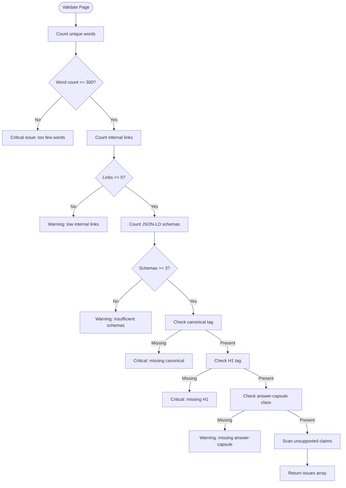
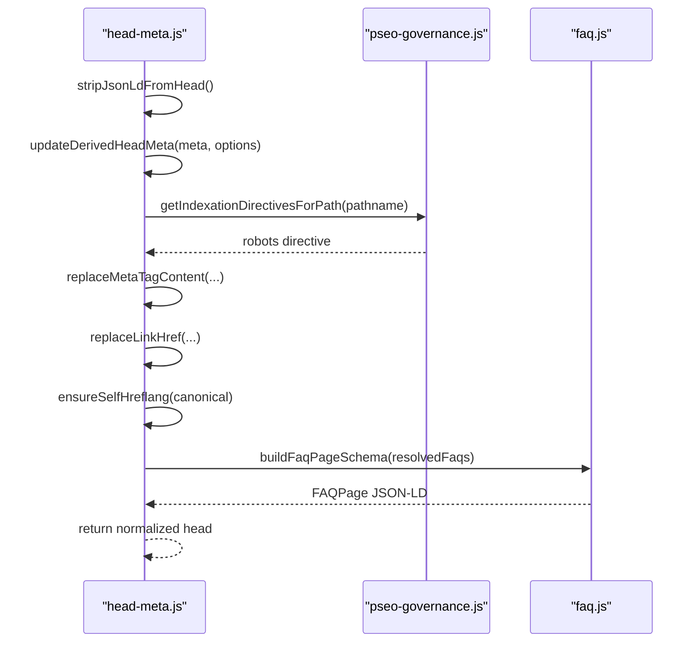
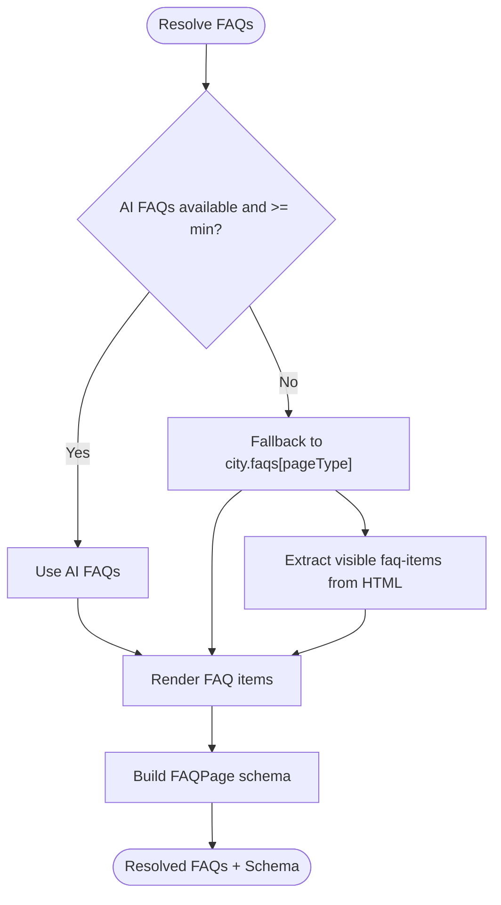
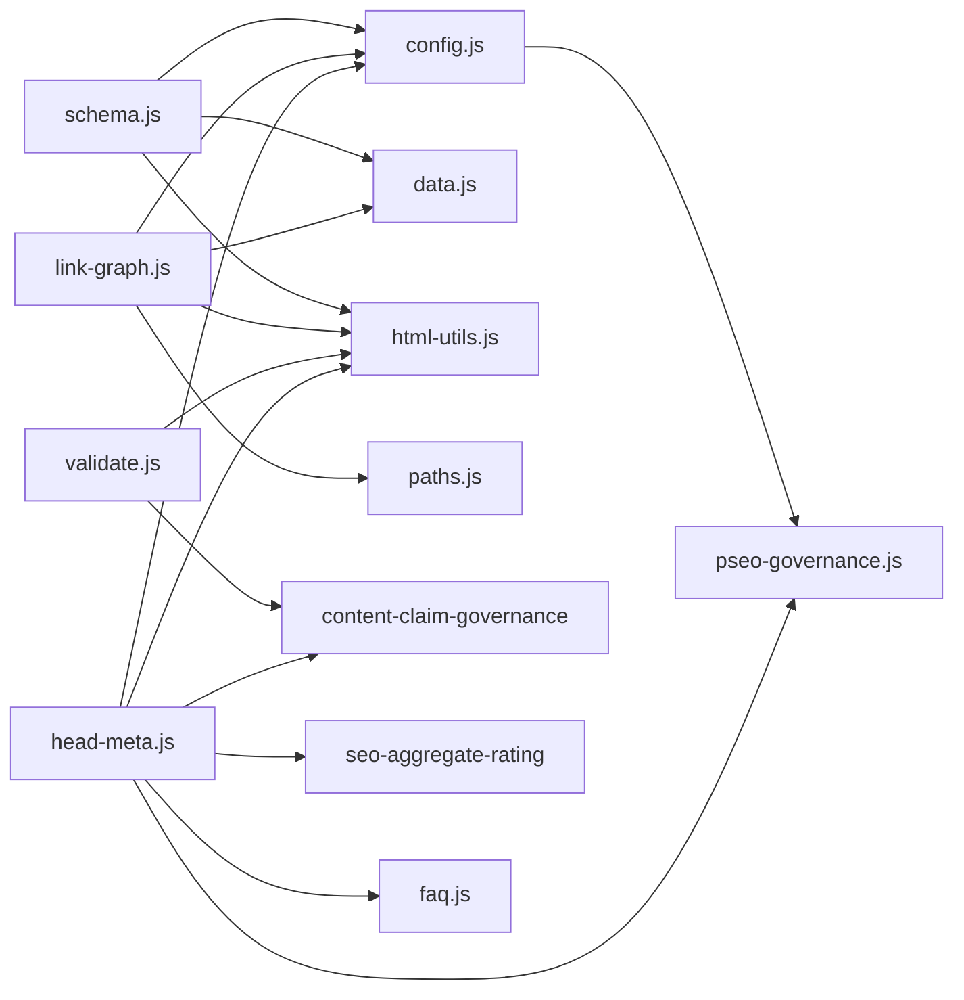

# SEO & Structured Data

<cite>
**Referenced Files in This Document**
- [schema.js](file://scripts/geo/schema.js)
- [link-graph.js](file://scripts/geo/link-graph.js)
- [validate.js](file://scripts/geo/validate.js)
- [head-meta.js](file://scripts/geo/head-meta.js)
- [faq.js](file://scripts/geo/faq.js)
- [config.js](file://scripts/geo/config.js)
- [html-utils.js](file://scripts/geo/html-utils.js)
- [pseo-governance.js](file://config/pseo-governance.js)
- [services.json](file://data/services.json)
- [link-graph.json](file://data/link-graph.json)
</cite>

## Table of Contents
1. [Introduction](#introduction)
2. [Project Structure](#project-structure)
3. [Core Components](#core-components)
4. [Architecture Overview](#architecture-overview)
5. [Detailed Component Analysis](#detailed-component-analysis)
6. [Dependency Analysis](#dependency-analysis)
7. [Performance Considerations](#performance-considerations)
8. [Troubleshooting Guide](#troubleshooting-guide)
9. [Conclusion](#conclusion)
10. [Appendices](#appendices)

## Introduction
This document explains the SEO optimization features built into the geo page generation system. It covers structured data generation (LocalBusiness, Service, and FAQ schemas), internal linking strategy via link graph generation and cross-page relationship mapping, and the validation framework that enforces SEO compliance, meta tag optimization, and content quality standards. It also provides practical guidance on configuring SEO rules, monitoring search performance, and troubleshooting SEO issues in generated content.

## Project Structure
The SEO engine for geo pages is implemented as a set of focused modules under scripts/geo, with governance and configuration centralized in config and data directories:
- scripts/geo/schema.js: JSON-LD schema generation for WebPage, Service, OfferCatalog, and FAQPage.
- scripts/geo/link-graph.js: Internal link graph builder and local context HTML section generator.
- scripts/geo/validate.js: Fail-closed validation for word count, internal links, schema presence, canonical/H1, answer capsule, and claim governance.
- scripts/geo/head-meta.js: Head meta rewriting, robots policy, canonical/hreflang injection, and hand-crafted page normalization.
- scripts/geo/faq.js: FAQ resolution, rendering, and FAQPage schema construction.
- scripts/geo/config.js: Site constants, date tokens, CLI flags, and re-exports of pSEO governance helpers.
- scripts/geo/html-utils.js: Pure helpers for distance calculation, text processing, and escaping.
- config/pseo-governance.js: Allowlist-based indexation control (Tier 1/2/Data-validated), de-amplification logic, and sitemap inclusion rules.
- data/services.json: Service catalog used to build OfferCatalog entries and per-service schemas.
- data/link-graph.json: Generated link graph snapshot of published geo pages and their internal links.

**Diagram sources**
- [schema.js:1-199](file://scripts/geo/schema.js#L1-L199)
- [link-graph.js:1-96](file://scripts/geo/link-graph.js#L1-L96)
- [validate.js:1-55](file://scripts/geo/validate.js#L1-L55)
- [head-meta.js:1-156](file://scripts/geo/head-meta.js#L1-L156)
- [faq.js:1-86](file://scripts/geo/faq.js#L1-L86)
- [config.js:1-114](file://scripts/geo/config.js#L1-L114)
- [html-utils.js:1-75](file://scripts/geo/html-utils.js#L1-L75)
- [pseo-governance.js:1-311](file://config/pseo-governance.js#L1-L311)
- [services.json:1-200](file://data/services.json#L1-L200)
- [link-graph.json:1-800](file://data/link-graph.json#L1-L800)

**Section sources**
- [schema.js:1-199](file://scripts/geo/schema.js#L1-L199)
- [link-graph.js:1-96](file://scripts/geo/link-graph.js#L1-L96)
- [validate.js:1-55](file://scripts/geo/validate.js#L1-L55)
- [head-meta.js:1-156](file://scripts/geo/head-meta.js#L1-L156)
- [faq.js:1-86](file://scripts/geo/faq.js#L1-L86)
- [config.js:1-114](file://scripts/geo/config.js#L1-L114)
- [html-utils.js:1-75](file://scripts/geo/html-utils.js#L1-L75)
- [pseo-governance.js:1-311](file://config/pseo-governance.js#L1-L311)
- [services.json:1-200](file://data/services.json#L1-L200)
- [link-graph.json:1-800](file://data/link-graph.json#L1-L800)

## Core Components
- Structured Data Generation: Produces BreadcrumbList, WebPage, Service (with OfferCatalog and offers), core service schemas, and optional FAQPage.
- Link Graph Generation: Builds an internal link map across all indexable geo pages and injects “nearby cities” sections to strengthen cross-linking.
- Validation Framework: Enforces minimum word count, internal link density, schema presence, canonical/H1 requirements, answer capsule class, and unsupported claims detection.
- Meta Tag Optimization: Rewrites title, description, Open Graph/Twitter tags, robots directives, canonical, and hreflang; normalizes hand-crafted pages and ensures FAQPage consistency.
- FAQ Resolution & Schema: Extracts visible FAQs from HTML or falls back to AI/content blocks; builds FAQPage schema and replaces visible items consistently.

**Section sources**
- [schema.js:73-192](file://scripts/geo/schema.js#L73-L192)
- [link-graph.js:14-89](file://scripts/geo/link-graph.js#L14-L89)
- [validate.js:7-50](file://scripts/geo/validate.js#L7-L50)
- [head-meta.js:123-145](file://scripts/geo/head-meta.js#L123-L145)
- [faq.js:6-85](file://scripts/geo/faq.js#L6-L85)

## Architecture Overview
The geo SEO pipeline integrates governance, data, and rendering utilities to produce optimized pages with robust structured data and internal linking.

**Diagram sources**
- [schema.js:73-192](file://scripts/geo/schema.js#L73-L192)
- [link-graph.js:53-89](file://scripts/geo/link-graph.js#L53-L89)
- [validate.js:7-50](file://scripts/geo/validate.js#L7-L50)
- [head-meta.js:123-145](file://scripts/geo/head-meta.js#L123-L145)
- [faq.js:6-85](file://scripts/geo/faq.js#L6-L85)
- [pseo-governance.js:279-287](file://config/pseo-governance.js#L279-L287)
- [services.json:1-200](file://data/services.json#L1-L200)

## Detailed Component Analysis

### Structured Data Generation (LocalBusiness, Service, FAQ)
- LocalBusiness reference: The WebPage schema includes an about field pointing to a singleton LocalBusiness ID, ensuring consistent entity association across pages.
- Service schema: Each city page emits a primary Service with areaServed (primary city + nearCities + administrative areas), hasOfferCatalog listing sub-services, and offers for landing-page, sito-vetrina, ecommerce.
- Core services: Additional Service schemas are emitted per core service with provider, areaServed, url, and price offer.
- FAQPage: When FAQs exist, a FAQPage schema is appended with Question/Answer entities.

**Diagram sources**
- [schema.js:18-192](file://scripts/geo/schema.js#L18-L192)
- [html-utils.js:26-32](file://scripts/geo/html-utils.js#L26-L32)
- [services.json:1-200](file://data/services.json#L1-L200)

**Section sources**
- [schema.js:73-192](file://scripts/geo/schema.js#L73-L192)
- [services.json:1-200](file://data/services.json#L1-L200)

### Internal Linking Strategy (Link Graph & Cross-Page Mapping)
- Nearby cities section: For each city page, the generator finds approved indexable neighbors and injects a section with links to those pages, including distance metadata.
- Link graph generation: Reads all published geo pages, extracts href attributes, resolves internal paths, filters to indexable targets, and records relationships by type (agenzia, realizzazione, servizio).

**Diagram sources**
- [link-graph.js:14-34](file://scripts/geo/link-graph.js#L14-L34)
- [html-utils.js:5-24](file://scripts/geo/html-utils.js#L5-L24)

**Section sources**
- [link-graph.js:14-89](file://scripts/geo/link-graph.js#L14-L89)
- [html-utils.js:5-24](file://scripts/geo/html-utils.js#L5-L24)

### Validation Framework (SEO Compliance & Content Quality)
- Word count: Critical if below 300 words; warning if below 500 words.
- Internal links: Warning if fewer than 5 internal .html links.
- Schema presence: Warning if fewer than 3 JSON-LD blocks.
- Canonical and H1: Critical if missing.
- Answer capsule: Warning if missing .answer-capsule class.
- Unsupported claims: Scans for claims not allowed by governance and reports excerpts.

**Diagram sources**
- [validate.js:7-50](file://scripts/geo/validate.js#L7-L50)

**Section sources**
- [validate.js:7-50](file://scripts/geo/validate.js#L7-L50)

### Meta Tag Optimization & Head Normalization
- Title/description: Replaces existing meta tags for name="description", property="og:*", twitter:* with computed values.
- Robots directive: Uses pSEO governance to set index/noindex based on path tier and allowlist.
- Canonical and hreflang: Ensures self-referencing canonical and adds hreflang it-IT.
- Hand-crafted page normalization: Strips disallowed JSON-LD, preserves approved Tier 1 overrides, rebuilds FAQPage when needed, and ensures consistent structure.

**Diagram sources**
- [head-meta.js:18-75](file://scripts/geo/head-meta.js#L18-L75)
- [head-meta.js:123-145](file://scripts/geo/head-meta.js#L123-L145)
- [pseo-governance.js:279-287](file://config/pseo-governance.js#L279-L287)
- [faq.js:62-75](file://scripts/geo/faq.js#L62-L75)

**Section sources**
- [head-meta.js:18-75](file://scripts/geo/head-meta.js#L18-L75)
- [head-meta.js:123-145](file://scripts/geo/head-meta.js#L123-L145)
- [pseo-governance.js:279-287](file://config/pseo-governance.js#L279-L287)
- [faq.js:62-75](file://scripts/geo/faq.js#L62-L75)

### FAQ Resolution & Schema Implementation
- Resolution priority: AI-provided FAQs (faqsAgenzia/faqsRealizzazione) with minimum thresholds; otherwise fallback to city-specific FAQs.
- Visible extraction: Parses <details.faq-item> elements to extract Q/A pairs.
- Rendering: Generates standardized FAQ items and replaces visible sections.
- Schema: Constructs FAQPage with Question/Answer entities, stripping HTML from text fields.

**Diagram sources**
- [faq.js:6-85](file://scripts/geo/faq.js#L6-L85)

**Section sources**
- [faq.js:6-85](file://scripts/geo/faq.js#L6-L85)

## Dependency Analysis
- schema.js depends on config.js (site constants, dates), data.js (cityMap, offerCatalogServices, coreServices), and html-utils.js (stripHtml).
- link-graph.js depends on config.js (paths, indexability), data.js (cities), html-utils.js (nearest cities), and paths.js (path resolution).
- validate.js depends on content-claim-governance (unsupported claims) and html-utils.js (word count).
- head-meta.js depends on seo-aggregate-rating (review properties removal), content-claim-governance (approved blocks), config.js (robots), html-utils.js (escaping), and faq.js (FAQPage schema).
- pseo-governance.js centralizes indexation policy and is reused by config.js and head-meta.js.

**Diagram sources**
- [schema.js:1-16](file://scripts/geo/schema.js#L1-L16)
- [link-graph.js:1-12](file://scripts/geo/link-graph.js#L1-L12)
- [validate.js:1-5](file://scripts/geo/validate.js#L1-L5)
- [head-meta.js:1-16](file://scripts/geo/head-meta.js#L1-L16)
- [config.js:1-14](file://scripts/geo/config.js#L1-L14)

**Section sources**
- [schema.js:1-16](file://scripts/geo/schema.js#L1-L16)
- [link-graph.js:1-12](file://scripts/geo/link-graph.js#L1-L12)
- [validate.js:1-5](file://scripts/geo/validate.js#L1-L5)
- [head-meta.js:1-16](file://scripts/geo/head-meta.js#L1-L16)
- [config.js:1-14](file://scripts/geo/config.js#L1-L14)

## Performance Considerations
- Avoid excessive JSON-LD duplication: Ensure only necessary schemas are emitted per page to keep payload small.
- Limit nearby cities links: Cap injected links to avoid bloating DOM and maintain crawl efficiency.
- Efficient regex usage: Prefer compiled patterns for repeated replacements in head-meta.js.
- Governance checks: Keep allowlists minimal and precise to reduce decision overhead during generation.

[No sources needed since this section provides general guidance]

## Troubleshooting Guide
Common issues and resolutions:
- Missing canonical or H1: Add canonical and H1 tags; ensure they appear before body start.
- Low internal links: Increase contextual links to related service/city pages; use nearby cities section.
- Insufficient schemas: Verify at least three JSON-LD blocks (BreadcrumbList, WebPage, Service); add FAQPage if applicable.
- Unsupported claims: Review content against governance allowlist; remove or revise non-compliant statements.
- Robots noindex unexpectedly: Confirm path is in Tier 1/2 or data-validated allowlist; adjust pseo-governance.js accordingly.
- FAQPage mismatch: Ensure visible FAQ items match schema; rebuild visible items and regenerate FAQPage schema.

**Section sources**
- [validate.js:7-50](file://scripts/geo/validate.js#L7-L50)
- [head-meta.js:123-145](file://scripts/geo/head-meta.js#L123-L145)
- [pseo-governance.js:279-287](file://config/pseo-governance.js#L279-L287)
- [faq.js:6-85](file://scripts/geo/faq.js#L6-L85)

## Conclusion
The geo page generation system implements a comprehensive SEO strategy through structured data, internal linking, and strict validation. By leveraging pSEO governance, service catalogs, and robust head/meta normalization, it produces indexable, high-quality pages aligned with search engine best practices. Continuous monitoring and iterative tuning of allowlists and link graphs will further improve visibility and performance.

[No sources needed since this section summarizes without analyzing specific files]

## Appendices

### Configuring SEO Rules
- Adjust Tier 1/2/Data-validated allowlists in pseo-governance.js to control which geo pages are indexable.
- Modify services.json to update OfferCatalog entries and pricing signals.
- Tune validation thresholds in validate.js to enforce stricter content quality.

**Section sources**
- [pseo-governance.js:42-146](file://config/pseo-governance.js#L42-L146)
- [services.json:1-200](file://data/services.json#L1-L200)
- [validate.js:7-50](file://scripts/geo/validate.js#L7-L50)

### Monitoring Search Performance
- Use link-graph.json to audit internal linking patterns and identify orphaned pages.
- Track schema presence and correctness via validation outputs.
- Monitor robots directives and canonical tags through head-meta.js transformations.

**Section sources**
- [link-graph.json:1-800](file://data/link-graph.json#L1-L800)
- [validate.js:7-50](file://scripts/geo/validate.js#L7-L50)
- [head-meta.js:123-145](file://scripts/geo/head-meta.js#L123-L145)