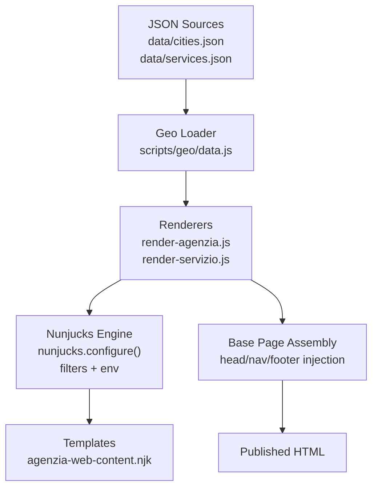
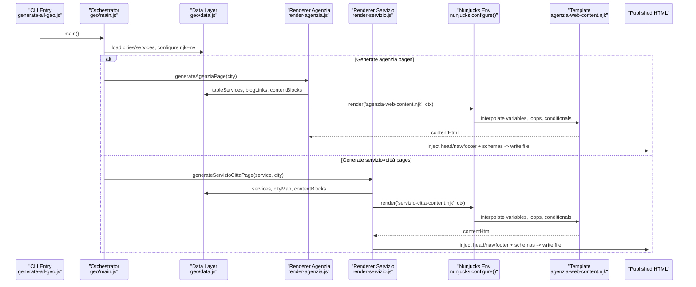
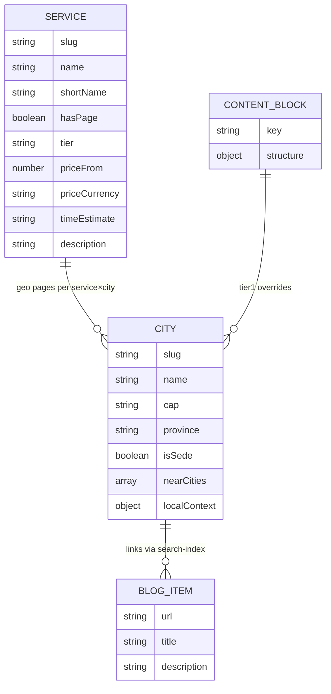
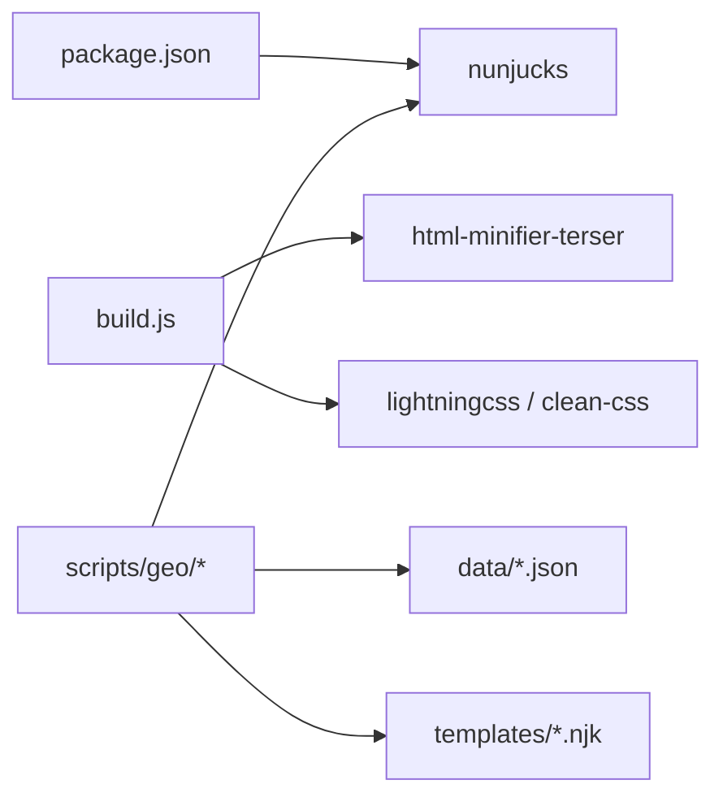

# Data Binding & Context Management

<cite>
**Referenced Files in This Document**
- [package.json](file://package.json)
- [build.js](file://build.js)
- [scripts/generate-all-geo.js](file://scripts/generate-all-geo.js)
- [scripts/geo/main.js](file://scripts/geo/main.js)
- [scripts/geo/data.js](file://scripts/geo/data.js)
- [scripts/geo/render-agenzia.js](file://scripts/geo/render-agenzia.js)
- [scripts/geo/render-servizio.js](file://scripts/geo/render-servizio.js)
- [templates/agenzia-web-content.njk](file://templates/agenzia-web-content.njk)
- [data/cities.json](file://data/cities.json)
- [data/services.json](file://data/services.json)
- [config/content-claim-governance.js](file://config/content-claim-governance.js)
</cite>

## Table of Contents
1. Introduction
2. Project Structure
3. Core Components
4. Architecture Overview
5. Detailed Component Analysis
6. Dependency Analysis
7. Performance Considerations
8. Troubleshooting Guide
9. Conclusion

## Introduction
This document explains how WebNovis binds JSON data to Nunjucks templates and manages context during the build process to produce geo-targeted pages. It covers:
- How city, service, and editorial content flow from JSON into rendered HTML
- Variable interpolation, conditionals, and loops used in Nunjucks templates
- The data transformation pipeline that prepares template context
- Complex binding scenarios, error handling for missing data, and performance techniques for large datasets
- Debugging guidance and how to implement custom data processors

## Project Structure
The system is a Node-based static site generator with a clear separation between data sources, rendering logic, and templates:
- Data sources live under data/ (cities.json, services.json) and optional approved content blocks under data/content-blocks/
- Rendering orchestration lives under scripts/geo/* and entrypoint scripts
- Templates live under templates/ and are rendered via Nunjucks
- Build-time asset processing is handled by build.js

**Diagram sources**
- [scripts/geo/data.js:113-118](file://scripts/geo/data.js#L113-L118)
- [scripts/geo/render-agenzia.js:146-186](file://scripts/geo/render-agenzia.js#L146-L186)
- [scripts/geo/render-servizio.js:192-283](file://scripts/geo/render-servizio.js#L192-L283)
- [templates/agenzia-web-content.njk:1-278](file://templates/agenzia-web-content.njk#L1-L278)

**Section sources**
- [package.json:69-77](file://package.json#L69-L77)
- [scripts/generate-all-geo.js:1-58](file://scripts/generate-all-geo.js#L1-L58)
- [scripts/geo/main.js:1-292](file://scripts/geo/main.js#L1-L292)
- [scripts/geo/data.js:1-197](file://scripts/geo/data.js#L1-L197)
- [build.js:1-502](file://build.js#L1-L502)

## Core Components
- Geo loader and Nunjucks environment: loads cities/services, builds lookup maps, configures Nunjucks, registers filters, and exposes helpers to renderers.
- Renderers: assemble per-page context (city, services, FAQs, blog links, tier flags), render Nunjucks content, inject head/nav/footer, and append JSON-LD schemas.
- Templates: define variable interpolation, conditional sections, loops over services and local sectors, and safe rendering of rich text.
- Governance and approvals: load hand-crafted Tier 1 content blocks when present; otherwise fall back to algorithmic content.

Key responsibilities:
- Centralize data loading and Nunjucks configuration
- Transform raw JSON into template-friendly structures
- Provide consistent SEO metadata and schema across page types
- Enforce indexability rules via tiers and robots content

**Section sources**
- [scripts/geo/data.js:15-22](file://scripts/geo/data.js#L15-L22)
- [scripts/geo/data.js:113-118](file://scripts/geo/data.js#L113-L118)
- [scripts/geo/render-agenzia.js:34-188](file://scripts/geo/render-agenzia.js#L34-L188)
- [scripts/geo/render-servizio.js:36-283](file://scripts/geo/render-servizio.js#L36-L283)
- [templates/agenzia-web-content.njk:1-278](file://templates/agenzia-web-content.njk#L1-L278)
- [config/content-claim-governance.js:85-106](file://config/content-claim-governance.js#L85-L106)

## Architecture Overview
End-to-end flow from JSON to published HTML:

**Diagram sources**
- [scripts/generate-all-geo.js:28-58](file://scripts/generate-all-geo.js#L28-L58)
- [scripts/geo/main.js:38-292](file://scripts/geo/main.js#L38-L292)
- [scripts/geo/data.js:15-22](file://scripts/geo/data.js#L15-L22)
- [scripts/geo/data.js:113-118](file://scripts/geo/data.js#L113-L118)
- [scripts/geo/render-agenzia.js:146-186](file://scripts/geo/render-agenzia.js#L146-L186)
- [scripts/geo/render-servizio.js:192-283](file://scripts/geo/render-servizio.js#L192-L283)
- [templates/agenzia-web-content.njk:1-278](file://templates/agenzia-web-content.njk#L1-L278)

## Detailed Component Analysis

### Data Loading and Nunjucks Environment
- Loads cities.json and services.json once at startup.
- Builds lookup maps (serviceBySlug, cityMap) for fast access.
- Configures Nunjucks with autoescape disabled for controlled safe rendering, block trimming enabled.
- Registers a localeNumber filter for Italian number formatting.
- Exposes helper functions for blog link selection, price formatting, and avatar path resolution.

Complexity considerations:
- Map lookups are O(1) average time.
- Filtering services for tables and eligibility runs once per build.

Error handling:
- Throws on missing canonical service price sources to fail fast and make issues visible early.

**Section sources**
- [scripts/geo/data.js:15-22](file://scripts/geo/data.js#L15-L22)
- [scripts/geo/data.js:23-45](file://scripts/geo/data.js#L23-L45)
- [scripts/geo/data.js:47-60](file://scripts/geo/data.js#L47-L60)
- [scripts/geo/data.js:113-118](file://scripts/geo/data.js#L113-L118)
- [scripts/geo/data.js:121-134](file://scripts/geo/data.js#L121-L134)
- [scripts/geo/data.js:136-156](file://scripts/geo/data.js#L136-L156)

### Agenzia Page Renderer
Context assembly:
- Computes nearest cities and related internal links.
- Resolves editorial record and applies SEO overrides.
- Merges AI-generated content blocks where available; otherwise falls back to algorithmic local context.
- Builds FAQ list from editorial or resolved defaults.
- Sets tier and indexability flags.
- Renders content via Nunjucks, then injects head/nav/footer and appends JSON-LD schemas.

Performance notes:
- Reuses shared tableServices and blog links.
- Avoids redundant computations by precomputing derived fields (e.g., provinceDisplay).

Error handling:
- Returns null if base page is missing, preventing silent failures.

**Section sources**
- [scripts/geo/render-agenzia.js:34-188](file://scripts/geo/render-agenzia.js#L34-L188)

### Servizio×Città Page Renderer
Context assembly:
- Determines tier and indexability per page path.
- Selects content angle based on service cluster to avoid duplication.
- Builds FAQ pools tailored to web development, marketing, or strategy clusters.
- Prepares related city/service pages for internal linking.
- Renders content via Nunjucks, injects head/nav/footer, and appends comprehensive JSON-LD (BreadcrumbList, WebPage, Service, FAQPage).

Error handling:
- Returns null if base page is missing.
- Uses explicit checks for indexable paths to control output.

**Section sources**
- [scripts/geo/render-servizio.js:36-283](file://scripts/geo/render-servizio.js#L36-L283)

### Nunjucks Template: Variables, Interpolation, Conditionals, Loops
Variable interpolation examples:
- City identity: breadcrumbLabel, h1, heroCapsule, section titles
- Services grid: shortName, description, priceDisplay, url
- Local sectors: settore names and highlights
- Dates: today, todayFormatted
- Editorial and Tier 1 content: headline, body paragraphs, bullets, callout

Conditional rendering:
- Only renders editorial section when present
- Only renders Tier 1 editorial block when tier equals 1 and content exists
- Only shows blog links when available
- Only includes certain near-city references when applicable

Loop constructs:
- Iterates services for grids and comparison tables
- Iterates nearCitiesData for area served lists
- Iterates local sectors for sector cards
- Iterates faqs for FAQ sections
- Iterates blogLinks for limited previews

Safe rendering:
- Uses | safe filter for known-safe HTML fragments (e.g., heroCapsule, section texts)

**Section sources**
- [templates/agenzia-web-content.njk:15-278](file://templates/agenzia-web-content.njk#L15-L278)

### Content Blocks and Editorial Overrides
- Approved content blocks are loaded from data/content-blocks/ and merged into template context when present.
- Hand-crafted Tier 1 blocks can override default sections for high-value pages.
- Validation ensures only approved content is accepted.

**Section sources**
- [scripts/geo/data.js:91-98](file://scripts/geo/data.js#L91-L98)
- [scripts/geo/render-agenzia.js:69-77](file://scripts/geo/render-agenzia.js#L69-L77)
- [scripts/geo/render-servizio.js:143-155](file://scripts/geo/render-servizio.js#L143-L155)
- [config/content-claim-governance.js:85-106](file://config/content-claim-governance.js#L85-L106)

### Data Models and Relationships

**Diagram sources**
- [data/cities.json:1-200](file://data/cities.json#L1-L200)
- [data/services.json:1-200](file://data/services.json#L1-L200)
- [scripts/geo/data.js:100-111](file://scripts/geo/data.js#L100-L111)
- [config/content-claim-governance.js:85-106](file://config/content-claim-governance.js#L85-L106)

## Dependency Analysis
High-level dependencies:
- package.json declares nunjucks as a runtime dependency
- build.js handles JS/CSS minification and HTML minification for src/html files
- Geo generation pipeline depends on data loaders, renderers, and Nunjucks environment

**Diagram sources**
- [package.json:69-77](file://package.json#L69-L77)
- [build.js:13-27](file://build.js#L13-L27)
- [scripts/geo/data.js:113-118](file://scripts/geo/data.js#L113-L118)

**Section sources**
- [package.json:69-77](file://package.json#L69-L77)
- [build.js:13-27](file://build.js#L13-L27)
- [scripts/geo/data.js:113-118](file://scripts/geo/data.js#L113-L118)

## Performance Considerations
- Precompute derived values: province display names, service price formatting, and blog link filtering are done once and reused.
- Use Maps for O(1) lookups of cities and services.
- Limit loop sizes in templates (e.g., show top 3–6 related items) to keep DOM size manageable.
- Conditional rendering avoids unnecessary markup for missing data.
- Safe use of | safe reduces repeated sanitization overhead while keeping control over trusted content.
- For very large datasets, consider pagination or virtualization strategies in templates and limit arrays passed to templates.

[No sources needed since this section provides general guidance]

## Troubleshooting Guide
Common issues and resolutions:
- Missing base page: renderer returns null; ensure the Rho base page exists before generating pages.
- Missing service price source: throws an error; verify services.json contains required price fields.
- Empty or invalid content blocks: approved content blocks are filtered; check governance validation and ensure proper structure.
- Template errors due to undefined variables: add guards in templates using conditionals; ensure context always provides expected keys.
- Indexability problems: verify tier and robots content; adjust resolvePageTier and buildRobotsContent usage.

Debugging steps:
- Run geo generation in dry-run mode to inspect outputs without writing files.
- Validate generated pages using the built-in validator to catch critical issues early.
- Inspect console logs for skipped/blocked pages and warnings.
- Check data integrity in cities.json and services.json for required fields.

**Section sources**
- [scripts/geo/render-agenzia.js:34-39](file://scripts/geo/render-agenzia.js#L34-L39)
- [scripts/geo/data.js:23-45](file://scripts/geo/data.js#L23-L45)
- [config/content-claim-governance.js:85-106](file://config/content-claim-governance.js#L85-L106)
- [scripts/geo/main.js:70-225](file://scripts/geo/main.js#L70-L225)

## Conclusion
WebNovis uses a robust, data-driven pipeline to bind JSON sources to Nunjucks templates and produce geo-targeted pages. The architecture centralizes data loading, transforms it into template-friendly contexts, and renders structured HTML with strong SEO signals. By leveraging conditionals, loops, and safe interpolation, the system scales to many cities and services while maintaining clarity and performance. Governance controls ensure only approved content appears in high-value pages, and validators help maintain quality throughout the build process.

[No sources needed since this section summarizes without analyzing specific files]