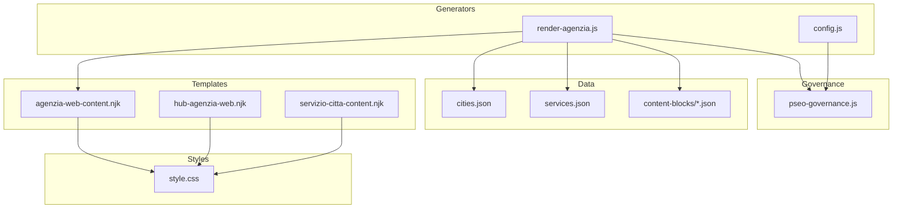
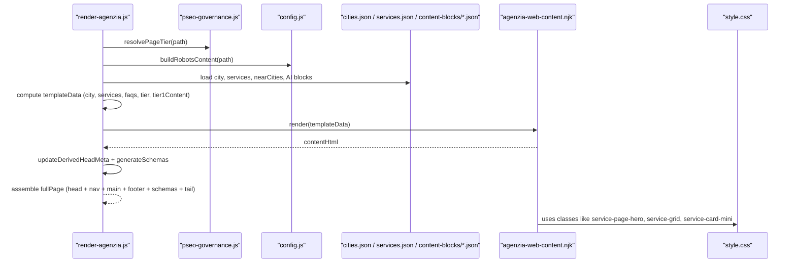
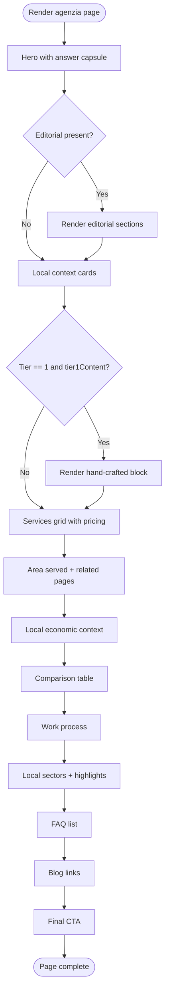
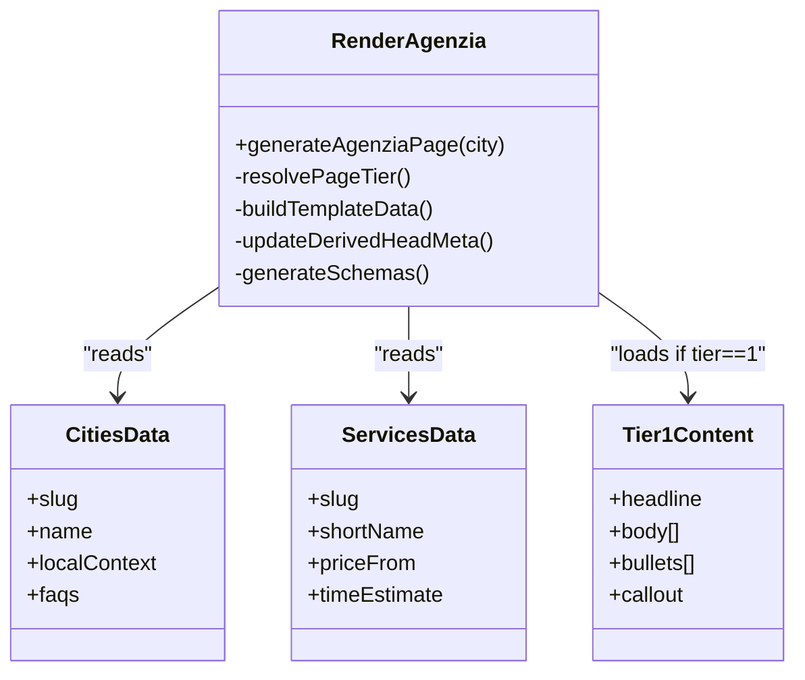
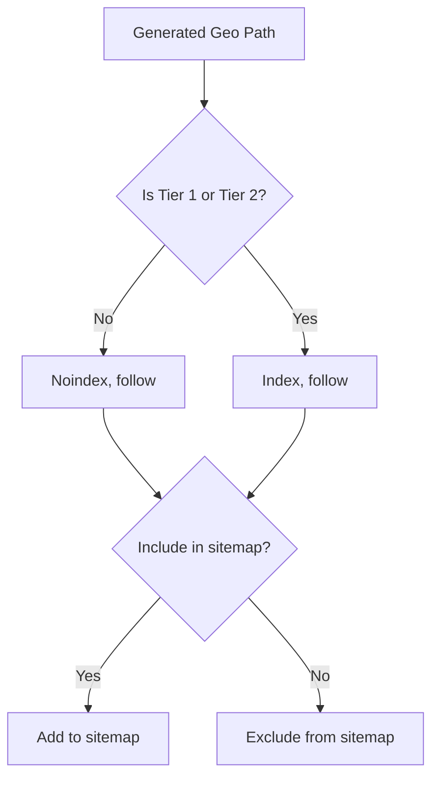
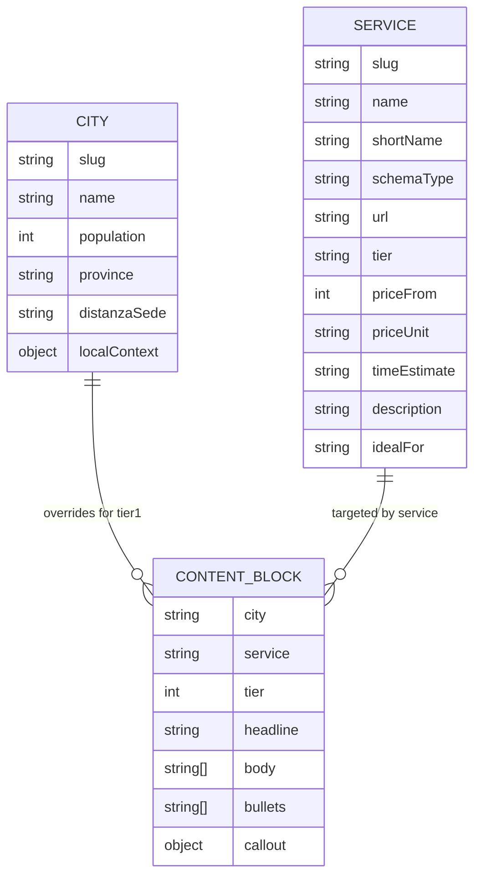
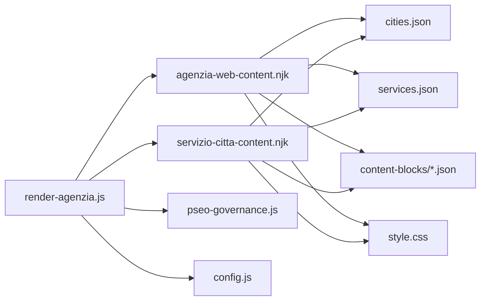

# Agency Web Templates

<cite>
**Referenced Files in This Document**
- [agenzia-web-content.njk](file://templates/agenzia-web-content.njk)
- [hub-agenzia-web.njk](file://templates/hub-agenzia-web.njk)
- [servizio-citta-content.njk](file://templates/servizio-citta-content.njk)
- [render-agenzia.js](file://scripts/geo/render-agenzia.js)
- [config.js](file://scripts/geo/config.js)
- [pseo-governance.js](file://config/pseo-governance.js)
- [cities.json](file://data/cities.json)
- [services.json](file://data/services.json)
- [tier1-rho-agenzia-web.json](file://data/content-blocks/tier1-rho-agenzia-web.json)
- [milano.json](file://data/content-blocks/milano.json)
- [style.css](file://css/style.css)
</cite>

## Table of Contents
1. [Introduction](#introduction)
2. [Project Structure](#project-structure)
3. [Core Components](#core-components)
4. [Architecture Overview](#architecture-overview)
5. [Detailed Component Analysis](#detailed-component-analysis)
6. [Dependency Analysis](#dependency-analysis)
7. [Performance Considerations](#performance-considerations)
8. [Troubleshooting Guide](#troubleshooting-guide)
9. [Conclusion](#conclusion)
10. [Appendices](#appendices)

## Introduction
This document explains the agency web templates that generate location-specific service pages for WebNovis’s web agency services. It covers the template architecture, the tier system (Tier 1, Tier 2, Tier 0), editorial blocks, SEO optimization features, data binding patterns with city and service data, and dynamic content injection. It also documents hero sections using an answer capsule pattern, service grids with pricing tables, local economic context sections, FAQ components, and provides guidance on creating custom agency templates, responsive design patterns, and search engine visibility optimization.

## Project Structure
The project uses a static site generation approach:
- Nunjucks templates define page structure and rendering logic.
- JavaScript generators assemble per-city and per-service pages by combining templates with JSON data sources.
- A governance layer controls which generated pages are indexable or de-amplified.
- CSS defines the visual system and responsive behavior.

**Diagram sources**
- [agenzia-web-content.njk:1-278](file://templates/agenzia-web-content.njk#L1-L278)
- [hub-agenzia-web.njk:1-145](file://templates/hub-agenzia-web.njk#L1-L145)
- [servizio-citta-content.njk:1-374](file://templates/servizio-citta-content.njk#L1-L374)
- [render-agenzia.js:1-194](file://scripts/geo/render-agenzia.js#L1-L194)
- [config.js:1-114](file://scripts/geo/config.js#L1-L114)
- [pseo-governance.js:1-311](file://config/pseo-governance.js#L1-L311)
- [cities.json:1-800](file://data/cities.json#L1-L800)
- [services.json:1-307](file://data/services.json#L1-L307)
- [style.css:1-200](file://css/style.css#L1-L200)

**Section sources**
- [agenzia-web-content.njk:1-278](file://templates/agenzia-web-content.njk#L1-L278)
- [hub-agenzia-web.njk:1-145](file://templates/hub-agenzia-web.njk#L1-L145)
- [servizio-citta-content.njk:1-374](file://templates/servizio-citta-content.njk#L1-L374)
- [render-agenzia.js:1-194](file://scripts/geo/render-agenzia.js#L1-L194)
- [config.js:1-114](file://scripts/geo/config.js#L1-L114)
- [pseo-governance.js:1-311](file://config/pseo-governance.js#L1-L311)
- [cities.json:1-800](file://data/cities.json#L1-L800)
- [services.json:1-307](file://data/services.json#L1-L307)
- [style.css:1-200](file://css/style.css#L1-L200)

## Core Components
- Agenzia city page template: renders a structured sectioned layout with hero, local context, services grid, comparison table, work process, local sectors, FAQs, blog links, and CTA.
- Hub page template: aggregates cities and highlights key territories, includes a service comparison table and CTAs.
- Service×city page template: renders service-specific content tailored to a city, including editorial blocks, competitive insights, decision frameworks, deliverables, intent queries, comparison table, FAQs, and related pages.
- Generator: assembles data from cities, services, and content blocks; resolves tiers; injects head meta and schemas; renders Nunjucks content into full pages.
- Governance: classifies each generated path into Tier 1, Tier 2, or de-amplified (Tier 0) and sets robots directives accordingly.
- Data: centralized city profiles with local context, FAQs, and images; service catalog with pricing and time estimates; hand-crafted Tier 1 content blocks.
- Styles: design tokens, layout utilities, and responsive rules used across templates.

**Section sources**
- [agenzia-web-content.njk:24-277](file://templates/agenzia-web-content.njk#L24-L277)
- [hub-agenzia-web.njk:15-143](file://templates/hub-agenzia-web.njk#L15-L143)
- [servizio-citta-content.njk:30-373](file://templates/servizio-citta-content.njk#L30-L373)
- [render-agenzia.js:34-188](file://scripts/geo/render-agenzia.js#L34-L188)
- [pseo-governance.js:18-311](file://config/pseo-governance.js#L18-L311)
- [cities.json:1-800](file://data/cities.json#L1-L800)
- [services.json:1-307](file://data/services.json#L1-L307)
- [style.css:168-200](file://css/style.css#L168-L200)

## Architecture Overview
The generator reads city and service data, applies governance rules to determine indexability and tier, loads optional hand-crafted Tier 1 content, builds template context, renders HTML via Nunjucks, injects head metadata and schema markup, and outputs complete pages.

**Diagram sources**
- [render-agenzia.js:34-188](file://scripts/geo/render-agenzia.js#L34-L188)
- [pseo-governance.js:62-78](file://config/pseo-governance.js#L62-L78)
- [config.js:62-78](file://scripts/geo/config.js#L62-L78)
- [agenzia-web-content.njk:24-277](file://templates/agenzia-web-content.njk#L24-L277)
- [style.css:168-200](file://css/style.css#L168-L200)

## Detailed Component Analysis

### Agenzia City Page Template
- Hero section: displays a localized tag, H1, answer capsule, CTA button, and office details.
- Local context section: renders editorial intro and sections when available.
- Section 1: local positioning with cards sourced from city data.
- Tier 1 editorial block: conditionally rendered when tier equals 1 and a matching content block exists.
- Services grid: lists core services with short name, description, price display, and link for top entries.
- Area served: lists nearby cities and related pages with distance labels.
- Local economic context: injects AI-enriched or default market analysis text.
- Comparison table: enumerates services with price and time estimate.
- Work process: outlines a five-phase workflow with contextual references to the city.
- Local sectors: renders key sectors and highlights from city.localContext.
- FAQ: iterates over faqs array with accessible details/summary elements.
- Blog links: shows up to two relevant blog articles.
- Final CTA: conversion section with title and contact link.

**Diagram sources**
- [agenzia-web-content.njk:24-277](file://templates/agenzia-web-content.njk#L24-L277)

**Section sources**
- [agenzia-web-content.njk:24-277](file://templates/agenzia-web-content.njk#L24-L277)

### Hub Page Template
- Aggregates coverage count and hero copy.
- Highlights priority territories with short descriptions and links.
- Provides a city selection grid with avatars, names, province, distance, and population.
- Explains benefits of choosing a local agency.
- Displays a service comparison table using core services.
- Ends with a CTA for non-listed cities.

**Section sources**
- [hub-agenzia-web.njk:15-143](file://templates/hub-agenzia-web.njk#L15-L143)

### Service×City Page Template
- Hero with service-specific tag, H1, answer capsule, optional highlights, and CTA.
- Localized service description with proximity note and primary page reference.
- Why choose WebNovis section with cards.
- How we work section with steps.
- Local market context with AI enrichment fallback to city data.
- Tier 1 editorial block for unique-by-city/service content.
- Competitive insight section with data points and top queries.
- Optional decision framework, deliverables, and intent queries sections.
- Comparison table listing all services with current service highlighted.
- FAQ section.
- Related pages: same service in nearby cities and other services in the same city.
- Final CTA.

**Section sources**
- [servizio-citta-content.njk:30-373](file://templates/servizio-citta-content.njk#L30-L373)

### Generator and Data Binding
- The generator computes nearest cities, related pages, blog links, and FAQs.
- It resolves page tier and indexability based on governance rules.
- It loads Tier 1 content blocks when available and merges AI-generated content with defaults.
- It constructs template data including city, services, faqs, tier, and date tokens.
- It renders Nunjucks content, updates head metadata, generates schema markup, and assembles the final page.

**Diagram sources**
- [render-agenzia.js:34-188](file://scripts/geo/render-agenzia.js#L34-L188)
- [cities.json:1-800](file://data/cities.json#L1-L800)
- [services.json:1-307](file://data/services.json#L1-L307)
- [tier1-rho-agenzia-web.json:1-33](file://data/content-blocks/tier1-rho-agenzia-web.json#L1-L33)

**Section sources**
- [render-agenzia.js:34-188](file://scripts/geo/render-agenzia.js#L34-L188)
- [cities.json:1-800](file://data/cities.json#L1-L800)
- [services.json:1-307](file://data/services.json#L1-L307)
- [tier1-rho-agenzia-web.json:1-33](file://data/content-blocks/tier1-rho-agenzia-web.json#L1-L33)

### Tier System and Governance
- Tier 1: strategic pages with unique hand-crafted content; allowed to index; may include editorial blocks.
- Tier 2: indexable support pages without boosted content; used for long-tail and cross-linking.
- Tier 0 (de-amplified): generated but marked noindex, follow; excluded from sitemap; reduces doorway footprint.
- Governance module maintains allowlists and derives auto-deamplified paths for non-indexable geo pages.

**Diagram sources**
- [pseo-governance.js:18-311](file://config/pseo-governance.js#L18-L311)
- [config.js:62-78](file://scripts/geo/config.js#L62-L78)

**Section sources**
- [pseo-governance.js:18-311](file://config/pseo-governance.js#L18-L311)
- [config.js:62-78](file://scripts/geo/config.js#L62-L78)

### Data Models and Binding Patterns
- City data includes slug, name, coordinates, population, province, distance to headquarters, local context (highlights, economic fabric, key sectors, digital opportunities), images, and FAQs per service cluster.
- Service data includes slug, name, short name, schema type, URL, tier (core/extended), pricing, currency, time estimate, description, ideal use case, and target keyword.
- Content blocks provide hand-crafted Tier 1 overrides with headline, body paragraphs, bullets, callouts, and editorial todos.
- AI-enriched content can augment local market analysis and competitive context when available.

**Diagram sources**
- [cities.json:1-800](file://data/cities.json#L1-L800)
- [services.json:1-307](file://data/services.json#L1-L307)
- [tier1-rho-agenzia-web.json:1-33](file://data/content-blocks/tier1-rho-agenzia-web.json#L1-L33)
- [milano.json:1-64](file://data/content-blocks/milano.json#L1-L64)

**Section sources**
- [cities.json:1-800](file://data/cities.json#L1-L800)
- [services.json:1-307](file://data/services.json#L1-L307)
- [tier1-rho-agenzia-web.json:1-33](file://data/content-blocks/tier1-rho-agenzia-web.json#L1-L33)
- [milano.json:1-64](file://data/content-blocks/milano.json#L1-L64)

### Responsive Design Patterns
- CSS variables define brand colors, dark mode tokens, and accents used consistently across templates.
- Layout utilities and component classes such as service-page-hero, service-grid, service-card-mini, hub-city-grid, and hub-city-card ensure consistent spacing and alignment.
- Media queries adjust navigation and search UI for mobile devices.
- Accessibility-friendly structures (details/summary for FAQs) improve usability and SEO.

**Section sources**
- [style.css:168-200](file://css/style.css#L168-L200)
- [agenzia-web-content.njk:24-277](file://templates/agenzia-web-content.njk#L24-L277)
- [hub-agenzia-web.njk:15-143](file://templates/hub-agenzia-web.njk#L15-L143)
- [servizio-citta-content.njk:30-373](file://templates/servizio-citta-content.njk#L30-L373)

## Dependency Analysis
- Templates depend on data files for city profiles, services catalog, and optional Tier 1 content blocks.
- The generator depends on governance rules to classify pages and set robots directives.
- Head metadata and schema generation rely on computed values from city and service data.
- Styles provide reusable classes consumed by templates to maintain visual consistency.

**Diagram sources**
- [agenzia-web-content.njk:1-278](file://templates/agenzia-web-content.njk#L1-L278)
- [servizio-citta-content.njk:1-374](file://templates/servizio-citta-content.njk#L1-L374)
- [render-agenzia.js:1-194](file://scripts/geo/render-agenzia.js#L1-L194)
- [pseo-governance.js:1-311](file://config/pseo-governance.js#L1-L311)
- [config.js:1-114](file://scripts/geo/config.js#L1-L114)
- [cities.json:1-800](file://data/cities.json#L1-L800)
- [services.json:1-307](file://data/services.json#L1-L307)
- [style.css:1-200](file://css/style.css#L1-L200)

**Section sources**
- [render-agenzia.js:1-194](file://scripts/geo/render-agenzia.js#L1-L194)
- [pseo-governance.js:1-311](file://config/pseo-governance.js#L1-L311)
- [config.js:1-114](file://scripts/geo/config.js#L1-L114)
- [agenzia-web-content.njk:1-278](file://templates/agenzia-web-content.njk#L1-L278)
- [servizio-citta-content.njk:1-374](file://templates/servizio-citta-content.njk#L1-L374)
- [cities.json:1-800](file://data/cities.json#L1-L800)
- [services.json:1-307](file://data/services.json#L1-L307)
- [style.css:1-200](file://css/style.css#L1-L200)

## Performance Considerations
- Prefer minimal DOM and avoid heavy inline styles; leverage CSS classes defined in the design system.
- Use lazy loading for images and defer non-critical scripts to improve LCP and CLS.
- Keep hero content concise to optimize first meaningful paint and answer capsule clarity.
- Limit number of related links per section to reduce doorway footprint while maintaining UX.
- Ensure schema markup is lightweight and accurate to aid search understanding without bloating HTML.

[No sources needed since this section provides general guidance]

## Troubleshooting Guide
- Missing Tier 1 content: If a Tier 1 page does not render the editorial block, verify that a matching content block file exists and is approved via the governance read function.
- Incorrect robots directive: Confirm the page path classification in governance; de-amplified paths receive noindex, follow and should be excluded from sitemaps.
- Empty FAQ or local context: Ensure city data contains FAQs and localContext fields; generator falls back to defaults when AI content is absent.
- Broken links in related pages: Validate nearCities arrays and relatedPages computation in the generator to ensure correct URLs and distances.
- Styling issues: Check that templates use existing CSS classes; avoid custom inline styles unless necessary.

**Section sources**
- [render-agenzia.js:69-89](file://scripts/geo/render-agenzia.js#L69-L89)
- [pseo-governance.js:250-287](file://config/pseo-governance.js#L250-L287)
- [agenzia-web-content.njk:239-264](file://templates/agenzia-web-content.njk#L239-L264)
- [cities.json:1-800](file://data/cities.json#L1-L800)

## Conclusion
The agency web templates implement a robust, data-driven architecture for generating location-specific service pages. The tier system ensures strategic pages receive unique content and indexing priority, while de-amplified pages reduce doorway footprint. Templates standardize hero sections, service grids, comparison tables, local context, FAQs, and CTAs, with strong SEO signals through structured data and controlled linking. The generator orchestrates data binding, governance, and rendering to produce scalable, maintainable pages aligned with performance and accessibility best practices.

[No sources needed since this section summarizes without analyzing specific files]

## Appendices

### Template Syntax Examples
- Rendering service cards: iterate over services array and output short name, description, price display, and link for top entries.
- Comparison tables: loop through services to populate rows with name, price, and time estimate.
- Work process sections: define fixed phases with contextual references to the city and project specifics.
- Local sector highlights: render key sectors and highlights from city.localContext to emphasize local relevance.

**Section sources**
- [agenzia-web-content.njk:114-122](file://templates/agenzia-web-content.njk#L114-L122)
- [agenzia-web-content.njk:157-182](file://templates/agenzia-web-content.njk#L157-L182)
- [agenzia-web-content.njk:184-216](file://templates/agenzia-web-content.njk#L184-L216)
- [agenzia-web-content.njk:218-237](file://templates/agenzia-web-content.njk#L218-L237)

### Creating Custom Agency Templates
- Define a new Nunjucks template following the established section order: hero, local context, services grid, comparison table, work process, local sectors, FAQs, blog links, CTA.
- Bind data using city, services, faqs, tier, and optional tier1Content variables.
- Ensure governance allows the new page path to be indexable if desired; otherwise it will be de-amplified by default.
- Reuse CSS classes from the design system to maintain visual consistency and responsiveness.

**Section sources**
- [agenzia-web-content.njk:1-278](file://templates/agenzia-web-content.njk#L1-L278)
- [pseo-governance.js:18-311](file://config/pseo-governance.js#L18-L311)
- [style.css:168-200](file://css/style.css#L168-L200)

### Optimizing Templates for Search Engine Visibility
- Use answer capsule in hero to provide direct answers within the first lines of content.
- Include structured data (FAQPage and service schemas) generated by the generator.
- Control internal linking density to avoid doorway patterns; limit related links per section.
- Maintain unique-by-city content for Tier 1 pages via hand-crafted content blocks.
- Ensure robots directives align with governance classification to prevent de-amplification of strategic pages.

**Section sources**
- [servizio-citta-content.njk:30-55](file://templates/servizio-citta-content.njk#L30-L55)
- [render-agenzia.js:179-186](file://scripts/geo/render-agenzia.js#L179-L186)
- [pseo-governance.js:279-287](file://config/pseo-governance.js#L279-L287)
- [tier1-rho-agenzia-web.json:1-33](file://data/content-blocks/tier1-rho-agenzia-web.json#L1-L33)