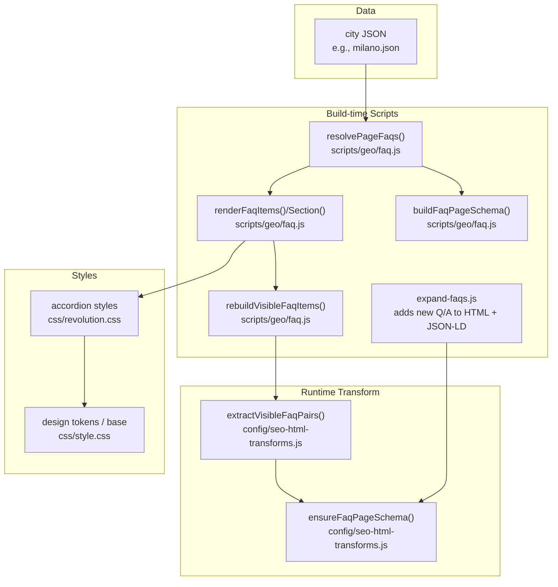
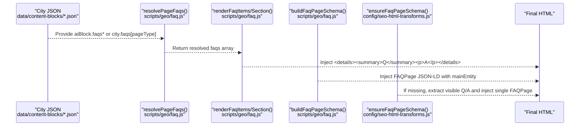
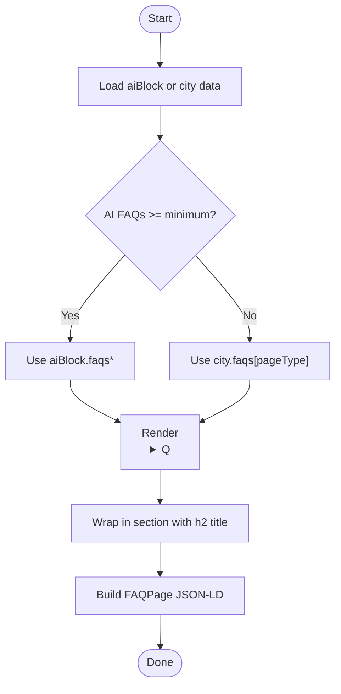
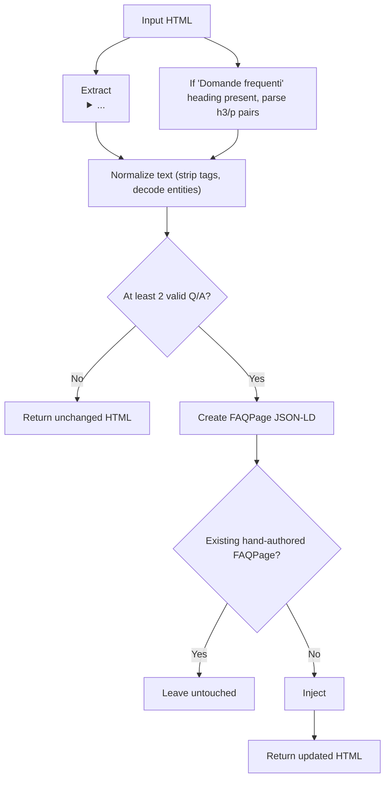
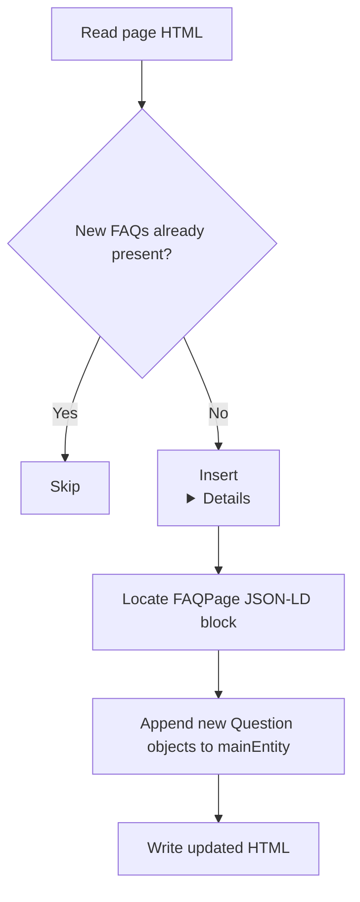
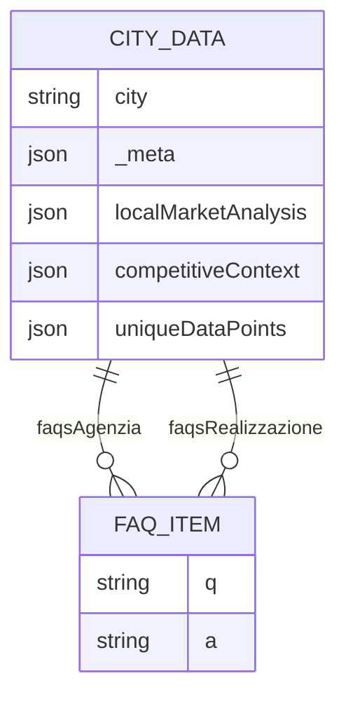
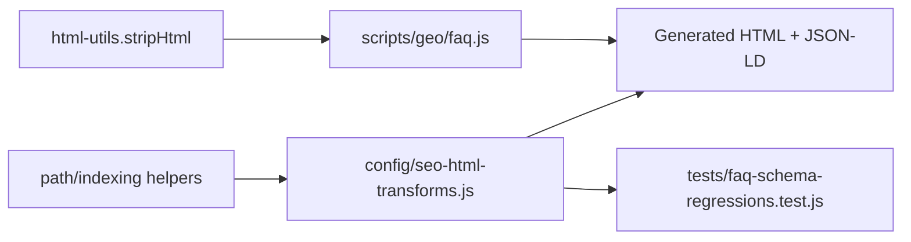

# FAQ Component & Schema Markup

<cite>
**Referenced Files in This Document**
- [faq.js](file://scripts/geo/faq.js)
- [seo-html-transforms.js](file://config/seo-html-transforms.js)
- [expand-faqs.js](file://scripts/expand-faqs.js)
- [milano.json](file://data/content-blocks/milano.json)
- [style.css](file://css/style.css)
- [revolution.css](file://css/revolution.css)
- [faq-schema-regressions.test.js](file://tests/faq-schema-regressions.test.js)
</cite>

## Table of Contents
1. [Introduction](#introduction)
2. [Project Structure](#project-structure)
3. [Core Components](#core-components)
4. [Architecture Overview](#architecture-overview)
5. [Detailed Component Analysis](#detailed-component-analysis)
6. [Dependency Analysis](#dependency-analysis)
7. [Performance Considerations](#performance-considerations)
8. [Troubleshooting Guide](#troubleshooting-guide)
9. [Conclusion](#conclusion)
10. [Appendices](#appendices)

## Introduction
This document explains the FAQ component used across the site to deliver accessible, mobile-friendly accordions and machine-readable structured data. It covers:
- The faqs array structure with q (question) and a (answer) fields
- HTML5 details/summary elements for accessibility and SEO
- Automatic FAQPage schema generation from visible content
- Geo-specific FAQ data resolution and rendering
- Question-based heading optimization for SEO
- Mobile-friendly accordion behavior via CSS
- Best practices for creating effective FAQ content, semantic markup, featured snippet optimization, and accessibility standards

## Project Structure
The FAQ system spans data, build-time scripts, runtime transforms, and styles:
- Data: geo-specific FAQs live in JSON files under data/content-blocks
- Build-time: scripts resolve and render FAQs, and can expand existing pages
- Runtime transform: ensureFaqPageSchema injects FAQPage JSON-LD from visible content
- Styles: CSS provides responsive, accessible accordion behavior



**Diagram sources**
- [faq.js:6-85](file://scripts/geo/faq.js#L6-L85)
- [seo-html-transforms.js:920-996](file://config/seo-html-transforms.js#L920-L996)
- [expand-faqs.js:29-108](file://scripts/expand-faqs.js#L29-L108)
- [milano.json:10-53](file://data/content-blocks/milano.json#L10-L53)
- [revolution.css:968-1036](file://css/revolution.css#L968-L1036)
- [style.css:1-200](file://css/style.css#L1-L200)

**Section sources**
- [faq.js:1-86](file://scripts/geo/faq.js#L1-L86)
- [seo-html-transforms.js:890-996](file://config/seo-html-transforms.js#L890-L996)
- [expand-faqs.js:1-117](file://scripts/expand-faqs.js#L1-L117)
- [milano.json:1-64](file://data/content-blocks/milano.json#L1-L64)
- [revolution.css:968-1036](file://css/revolution.css#L968-L1036)
- [style.css:1-200](file://css/style.css#L1-L200)

## Core Components
- Geo FAQ resolver: selects AI-generated or city fallback FAQs per page type
- Visible FAQ extractor: reads <details>/<summary> pairs from rendered HTML
- Renderers: produce accessible accordion markup and sections
- Schema builder: generates FAQPage JSON-LD matching visible content
- Expand script: augments existing pages with additional Q/A and updates JSON-LD
- Runtime transformer: ensures every page with visible FAQs publishes exactly one FAQPage block

Key responsibilities:
- Single source of truth: resolved faqs array drives both visible markup and schema
- Accessibility: native <details>/<summary> semantics
- SEO: question-based headings and FAQPage structured data
- Idempotency: regeneration replaces rather than stacks blocks

**Section sources**
- [faq.js:6-85](file://scripts/geo/faq.js#L6-L85)
- [seo-html-transforms.js:920-996](file://config/seo-html-transforms.js#L920-L996)
- [expand-faqs.js:29-108](file://scripts/expand-faqs.js#L29-L108)

## Architecture Overview
The FAQ pipeline ensures that what users see is exactly what search engines understand.



**Diagram sources**
- [faq.js:6-85](file://scripts/geo/faq.js#L6-L85)
- [seo-html-transforms.js:920-996](file://config/seo-html-transforms.js#L920-L996)

## Detailed Component Analysis

### Geo FAQ Resolution and Rendering
- Resolves the correct FAQ set based on page type (agency vs realization)
- Falls back to city-level FAQs when AI data is insufficient
- Renders accessible accordion items and wraps them in a section
- Rebuilds visible FAQ items in-place to keep HTML consistent
- Builds FAQPage schema with sanitized text



**Diagram sources**
- [faq.js:6-48](file://scripts/geo/faq.js#L6-L48)
- [faq.js:62-75](file://scripts/geo/faq.js#L62-L75)

**Section sources**
- [faq.js:6-85](file://scripts/geo/faq.js#L6-L85)

### Visible FAQ Extraction and Auto Schema Injection
- Extracts Q/A from both <details>/<summary> and h3/p sequences under a “Domande frequenti” heading
- Normalizes text for safe JSON-LD embedding
- Ensures only pages with at least two valid Q/A pairs get a FAQPage
- Skips noindex pages and preserves hand-authored FAQPage blocks
- Marks generated blocks so regeneration replaces instead of stacking



**Diagram sources**
- [seo-html-transforms.js:920-996](file://config/seo-html-transforms.js#L920-L996)

**Section sources**
- [seo-html-transforms.js:890-996](file://config/seo-html-transforms.js#L890-L996)

### FAQ Expansion Script
- Adds new Q/A pairs to existing geo pages’ visible HTML
- Appends corresponding entries to the FAQPage JSON-LD mainEntity array
- Guards against duplicate insertion and missing markers



**Diagram sources**
- [expand-faqs.js:29-108](file://scripts/expand-faqs.js#L29-L108)

**Section sources**
- [expand-faqs.js:1-117](file://scripts/expand-faqs.js#L1-L117)

### Geo-Specific FAQ Data Model
- Each city JSON contains arrays for different page types (e.g., faqsAgenzia, faqsRealizzazione)
- Each entry has q (question) and a (answer) fields
- Used by the resolver to populate visible FAQs and schema



**Diagram sources**
- [milano.json:10-53](file://data/content-blocks/milano.json#L10-L53)

**Section sources**
- [milano.json:1-64](file://data/content-blocks/milano.json#L1-L64)

### Mobile-Friendly Accordion Behavior
- Uses native <details>/<summary> for zero-JS interactivity and accessibility
- CSS customizes appearance, focus states, and open/close indicators
- Responsive rules ensure comfortable tap targets and readable answers on small screens

```mermaid
classDiagram
class DetailsSummary {
"+HTML5 <details>/<summary>"
"+Native toggle behavior"
"+Keyboard accessible"
}
class AccordionCSS {
"+Custom summary marker"
"+Open state styling"
"+Hover/focus states"
"+Responsive typography"
}
DetailsSummary --> AccordionCSS : "styled by"
```

**Diagram sources**
- [revolution.css:968-1036](file://css/revolution.css#L968-L1036)
- [style.css:1-200](file://css/style.css#L1-L200)

**Section sources**
- [revolution.css:968-1036](file://css/revolution.css#L968-L1036)
- [style.css:1-200](file://css/style.css#L1-L200)

## Dependency Analysis
- Geo FAQ module depends on html-utils for sanitization
- SEO transforms depend on path utilities and indexation directives
- Tests assert idempotency, coverage, and truthfulness of FAQPage vs visible content



**Diagram sources**
- [faq.js:4-4](file://scripts/geo/faq.js#L4-L4)
- [seo-html-transforms.js:963-996](file://config/seo-html-transforms.js#L963-L996)
- [faq-schema-regressions.test.js:1-108](file://tests/faq-schema-regressions.test.js#L1-L108)

**Section sources**
- [faq.js:1-86](file://scripts/geo/faq.js#L1-L86)
- [seo-html-transforms.js:890-996](file://config/seo-html-transforms.js#L890-L996)
- [faq-schema-regressions.test.js:1-108](file://tests/faq-schema-regressions.test.js#L1-L108)

## Performance Considerations
- Prefer server-side rendering of FAQs to avoid FOUC and extra JS
- Keep FAQ lists concise; long lists degrade readability and performance
- Avoid duplicating FAQPage blocks; ensure idempotent injection
- Minify and defer non-critical assets; keep CSS for accordors minimal and critical

## Troubleshooting Guide
Common issues and resolutions:
- Missing FAQPage when visible FAQs exist: verify extraction patterns and minimum thresholds
- Mismatch between visible Q/A and schema: ensure single source of truth (resolved faqs array)
- Duplicate FAQPage blocks: confirm generator marker and replacement logic
- Noindex pages still getting FAQPage: check indexation directive checks
- Not idempotent: ensure regeneration replaces rather than appends

Validation tooling:
- Regression tests enforce:
  - At most one FAQPage per page
  - All schema questions must be visible on the page
  - Pages with visible FAQs must publish FAQPage
  - Full transform chain remains idempotent

**Section sources**
- [faq-schema-regressions.test.js:1-108](file://tests/faq-schema-regressions.test.js#L1-L108)
- [seo-html-transforms.js:963-996](file://config/seo-html-transforms.js#L963-L996)

## Conclusion
The FAQ component delivers an accessible, SEO-friendly accordion experience backed by accurate FAQPage structured data. By centralizing FAQ content in a single array and ensuring strict alignment between visible content and schema, the system supports high-quality rich results while maintaining strong accessibility and performance.

## Appendices

### Creating Effective FAQ Content
- Use clear, specific questions mirroring user intent and search queries
- Provide concise, complete answers that directly address the question
- Include localized context where relevant (city, service, pricing ranges)
- Maintain consistent tone and terminology across FAQs

### Implementing Proper Semantic Markup
- Use <details>/<summary> for each Q/A pair
- Wrap the FAQ section in a <section> with a descriptive <h2>
- Ensure keyboard navigation and screen reader compatibility
- Avoid hiding content behind heavy JS; rely on native behavior

### Optimizing for Featured Snippets
- Place the most important answer near the top of the response
- Use plain language and avoid unnecessary markup in answers
- Align FAQ headings with common search phrasing
- Keep schema mainEntity order identical to visible order

### Maintaining Accessibility Standards
- Ensure sufficient color contrast for summary and answer text
- Provide visible focus indicators
- Avoid relying solely on color to convey state
- Test with keyboard-only navigation and screen readers

### Common FAQ Patterns by Audience
- Web agency services: scope, timelines, tech stack, post-launch support
- Local business questions: pricing, delivery area, compliance (GDPR/EAA), maintenance plans
- Technical service inquiries: SEO integration, e-commerce features, analytics, security