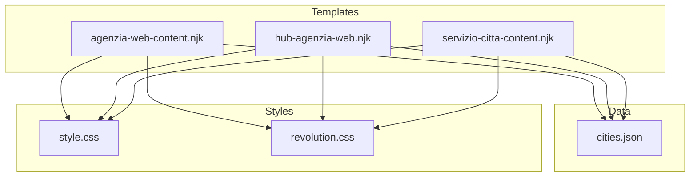
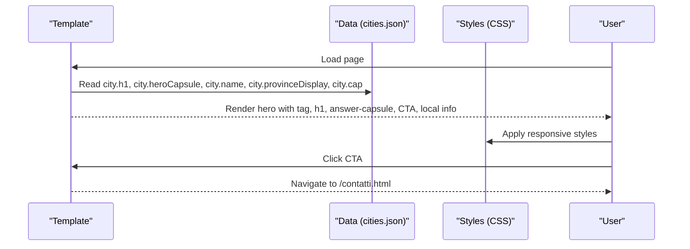
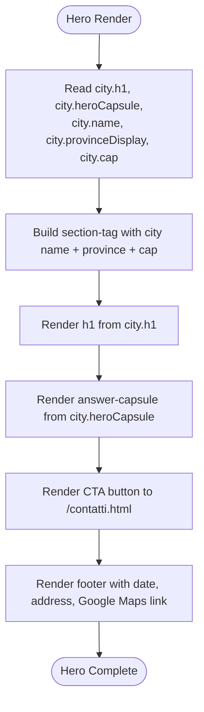
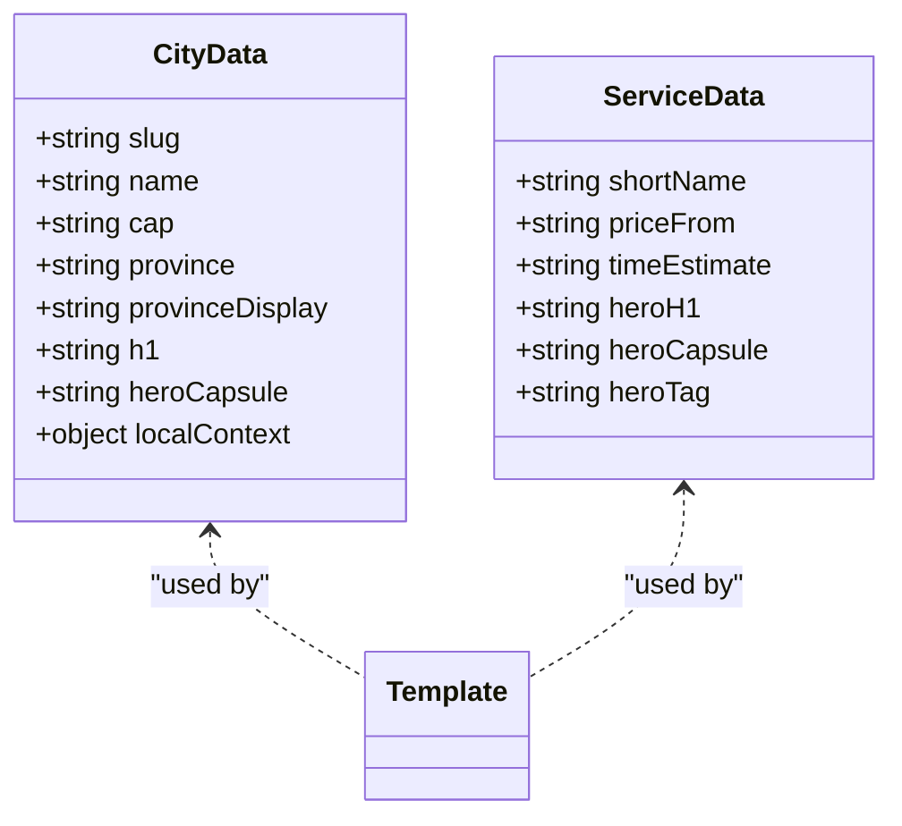
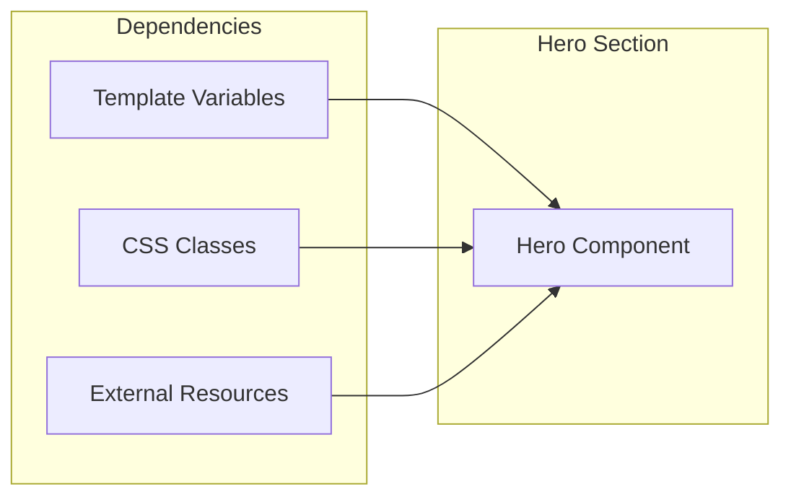

# Hero Section & Answer Capsule

<cite>
**Referenced Files in This Document**
- [agenzia-web-content.njk](file://templates/agenzia-web-content.njk)
- [hub-agenzia-web.njk](file://templates/hub-agenzia-web.njk)
- [servizio-citta-content.njk](file://templates/servizio-citta-content.njk)
- [cities.json](file://data/cities.json)
- [style.css](file://css/style.css)
- [revolution.css](file://css/revolution.css)
</cite>

## Table of Contents
1. [Introduction](#introduction)
2. [Project Structure](#project-structure)
3. [Core Components](#core-components)
4. [Architecture Overview](#architecture-overview)
5. [Detailed Component Analysis](#detailed-component-analysis)
6. [Dependency Analysis](#dependency-analysis)
7. [Performance Considerations](#performance-considerations)
8. [Troubleshooting Guide](#troubleshooting-guide)
9. [Conclusion](#conclusion)
10. [Appendices](#appendices)

## Introduction
This document explains the hero section implementation across agency web templates, focusing on the “answer capsule” pattern that delivers a direct answer within the first 60 words for SEO optimization. It details dynamic data binding with city.h1, city.heroCapsule, and location variables (city.name, city.provinceDisplay, city.cap), breadcrumb navigation structure, CTA button behavior with contact form integration, and local business context display including address and Google Maps link. It also covers responsive design patterns, accessibility considerations, and performance optimizations for hero sections across devices.

## Project Structure
The hero section is implemented consistently across three Nunjucks templates:
- City-specific agency page template
- Hub page listing all cities
- Service×City pSEO page template

Each template renders a semantic hero section with a tag, H1, answer capsule paragraph, CTA button, and local context footer line. The content is driven by data objects passed into the templates, primarily from cities.json and service metadata.

**Diagram sources**
- [agenzia-web-content.njk:15-40](file://templates/agenzia-web-content.njk#L15-L40)
- [hub-agenzia-web.njk:15-29](file://templates/hub-agenzia-web.njk#L15-L29)
- [servizio-citta-content.njk:31-55](file://templates/servizio-citta-content.njk#L31-L55)
- [cities.json:1-120](file://data/cities.json#L1-L120)
- [style.css:940-1139](file://css/style.css#L940-L1139)
- [revolution.css:284-362](file://css/revolution.css#L284-L362)

**Section sources**
- [agenzia-web-content.njk:15-40](file://templates/agenzia-web-content.njk#L15-L40)
- [hub-agenzia-web.njk:15-29](file://templates/hub-agenzia-web.njk#L15-L29)
- [servizio-citta-content.njk:31-55](file://templates/servizio-citta-content.njk#L31-L55)
- [cities.json:1-120](file://data/cities.json#L1-L120)
- [style.css:940-1139](file://css/style.css#L940-L1139)
- [revolution.css:284-362](file://css/revolution.css#L284-L362)

## Core Components
- Answer capsule pattern: A concise paragraph immediately following the H1 that provides a direct answer to the user’s intent within the first 60 words. This improves SEO by aligning with search snippets and featured answers.
- Dynamic data binding:
  - city.h1: Primary headline per city
  - city.heroCapsule: Pre-written capsule text for the hero
  - city.name, city.provinceDisplay or city.province, city.cap: Location identifiers used in tags and footers
- Breadcrumb navigation: Semantic links indicating Home > Agency Web > Current City
- CTA button: Prominent primary button linking to the contact page (/contatti.html)
- Local business context: Footer line includes date, physical address, and Google Maps link

**Section sources**
- [agenzia-web-content.njk:16-39](file://templates/agenzia-web-content.njk#L16-L39)
- [hub-agenzia-web.njk:7-28](file://templates/hub-agenzia-web.njk#L7-L28)
- [servizio-citta-content.njk:22-54](file://templates/servizio-citta-content.njk#L22-L54)

## Architecture Overview
The hero section architecture follows a consistent flow:
- Template renders semantic HTML structure
- Data object supplies localized content and metadata
- CSS styles ensure responsive presentation and visual hierarchy
- CTA anchors navigate to the contact form page

**Diagram sources**
- [agenzia-web-content.njk:24-39](file://templates/agenzia-web-content.njk#L24-L39)
- [hub-agenzia-web.njk:15-28](file://templates/hub-agenzia-web.njk#L15-L28)
- [servizio-citta-content.njk:31-54](file://templates/servizio-citta-content.njk#L31-L54)
- [style.css:940-1139](file://css/style.css#L940-L1139)

## Detailed Component Analysis

### Hero Section Template Patterns
- City-specific agency page:
  - Tag displays city name, province, and postal code
  - H1 uses city.h1
  - Answer capsule uses city.heroCapsule
  - CTA links to contatti.html
  - Footer line shows date, address, and Google Maps link
- Hub page:
  - Tag indicates network coverage count
  - H1 describes agency presence across Milan province
  - Answer capsule summarizes coverage and approach
  - CTA links to contatti.html
  - Footer line shows date and address
- Service×City page:
  - Tag uses seo.heroTag
  - H1 uses seo.heroH1
  - Answer capsule uses seo.heroCapsule
  - Optional highlights block
  - CTA links to contatti.html
  - Footer line shows date and address

**Diagram sources**
- [agenzia-web-content.njk:24-39](file://templates/agenzia-web-content.njk#L24-L39)
- [hub-agenzia-web.njk:15-28](file://templates/hub-agenzia-web.njk#L15-L28)
- [servizio-citta-content.njk:31-54](file://templates/servizio-citta-content.njk#L31-L54)

**Section sources**
- [agenzia-web-content.njk:24-39](file://templates/agenzia-web-content.njk#L24-L39)
- [hub-agenzia-web.njk:15-28](file://templates/hub-agenzia-web.njk#L15-L28)
- [servizio-citta-content.njk:31-54](file://templates/servizio-citta-content.njk#L31-L54)

### Dynamic Data Binding
- city.h1: Provides localized headline for each city
- city.heroCapsule: Contains pre-approved capsule text optimized for SEO
- city.name, city.provinceDisplay or city.province, city.cap: Used to build contextual tag and footer
- seo.heroH1, seo.heroCapsule, seo.heroTag: Used on service×city pages for service-specific localization

**Diagram sources**
- [cities.json:1-120](file://data/cities.json#L1-L120)
- [servizio-citta-content.njk:31-54](file://templates/servizio-citta-content.njk#L31-L54)

**Section sources**
- [cities.json:1-120](file://data/cities.json#L1-L120)
- [servizio-citta-content.njk:31-54](file://templates/servizio-citta-content.njk#L31-L54)

### Breadcrumb Navigation Structure
- Consistent pattern: Home > Agency Web > Current City
- Uses semantic anchor elements with clear labels
- Current page indicated with non-link span
- Improves site structure understanding for users and search engines

**Section sources**
- [agenzia-web-content.njk:16-22](file://templates/agenzia-web-content.njk#L16-L22)
- [hub-agenzia-web.njk:7-13](file://templates/hub-agenzia-web.njk#L7-L13)
- [servizio-citta-content.njk:22-28](file://templates/servizio-citta-content.njk#L22-L28)

### CTA Button Implementation
- Primary button style with gradient background and hover effects
- Links to /contatti.html for contact form integration
- Includes SVG arrow icon for visual enhancement
- Responsive sizing with min-width constraints
- High contrast colors for accessibility

**Section sources**
- [agenzia-web-content.njk:30-33](file://templates/agenzia-web-content.njk#L30-L33)
- [hub-agenzia-web.njk:20-23](file://templates/hub-agenzia-web.njk#L20-L23)
- [servizio-citta-content.njk:46-49](file://templates/servizio-citta-content.njk#L46-L49)
- [style.css:947-963](file://css/style.css#L947-L963)
- [revolution.css:284-362](file://css/revolution.css#L284-L362)

### Local Business Context Display
- Address: Via S. Giorgio 2, 20017 Rho MI
- Google Maps link: Direct link to Google Maps with full address query
- Date display: Shows current date for freshness signals
- Positioned below CTA button in smaller, semi-transparent text

**Section sources**
- [agenzia-web-content.njk:34-38](file://templates/agenzia-web-content.njk#L34-L38)
- [hub-agenzia-web.njk:24-27](file://templates/hub-agenzia-web.njk#L24-L27)
- [servizio-citta-content.njk:50-53](file://templates/servizio-citta-content.njk#L50-L53)

## Dependency Analysis
The hero section depends on:
- Template variables from data sources (cities.json, service metadata)
- CSS classes for styling (.service-page-hero, .btn-primary, .answer-capsule)
- External resources (Google Fonts, potentially images)

**Diagram sources**
- [agenzia-web-content.njk:24-39](file://templates/agenzia-web-content.njk#L24-L39)
- [style.css:6721-6771](file://css/style.css#L6721-L6771)

**Section sources**
- [agenzia-web-content.njk:24-39](file://templates/agenzia-web-content.njk#L24-L39)
- [style.css:6721-6771](file://css/style.css#L6721-L6771)

## Performance Considerations
- Minimal DOM structure reduces rendering overhead
- No heavy JavaScript dependencies in hero section
- CSS uses efficient selectors and avoids expensive animations
- Images are not part of hero section (loaded elsewhere)
- Text-only content ensures fast LCP (Largest Contentful Paint)
- Semantic HTML improves accessibility and SEO without performance cost

[No sources needed since this section provides general guidance]

## Troubleshooting Guide
Common issues and solutions:
- Missing city data: Ensure cities.json contains required fields (h1, heroCapsule, name, provinceDisplay/province, cap)
- Broken CTA links: Verify /contatti.html exists and is accessible
- Styling issues: Check CSS file paths and class names match template usage
- Accessibility problems: Ensure proper heading hierarchy and link text
- Mobile responsiveness: Test across different screen sizes using browser dev tools

**Section sources**
- [cities.json:1-120](file://data/cities.json#L1-L120)
- [style.css:6721-6771](file://css/style.css#L6721-L6771)

## Conclusion
The hero section implementation demonstrates a robust, scalable approach to creating SEO-optimized landing pages. The answer capsule pattern effectively communicates value propositions while maintaining clean, semantic markup. Dynamic data binding enables easy customization across multiple cities and services. The consistent structure, responsive design, and accessibility considerations ensure optimal user experience across all devices.

[No sources needed since this section summarizes without analyzing specific files]

## Appendices

### Responsive Design Patterns
- Mobile-first approach with media queries
- Flexible typography using clamp() functions
- Touch-friendly button sizing
- Optimized spacing for small screens
- Backdrop blur effects for modern browsers

**Section sources**
- [style.css:6721-6771](file://css/style.css#L6721-L6771)
- [style.css:947-963](file://css/style.css#L947-L963)

### Accessibility Considerations
- Semantic HTML structure (section, h1, nav, a)
- Proper heading hierarchy
- Keyboard navigation support
- Color contrast compliance
- Screen reader friendly content

**Section sources**
- [agenzia-web-content.njk:16-39](file://templates/agenzia-web-content.njk#L16-L39)
- [style.css:947-963](file://css/style.css#L947-L963)