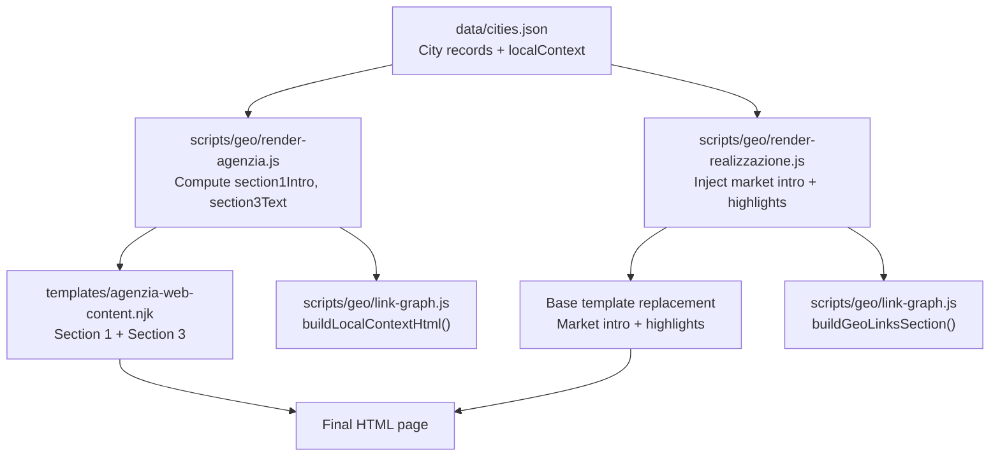
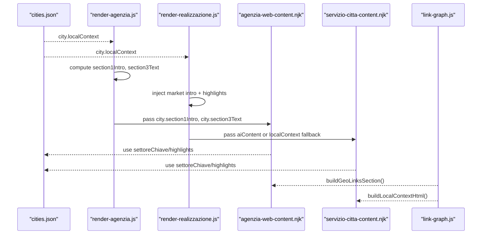
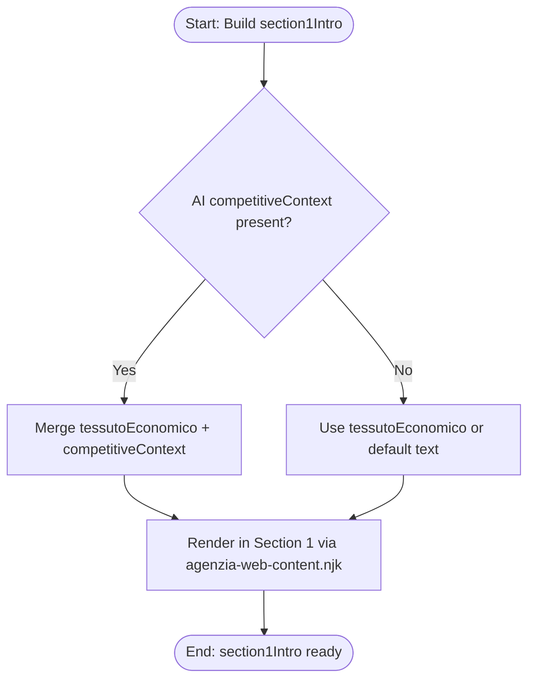
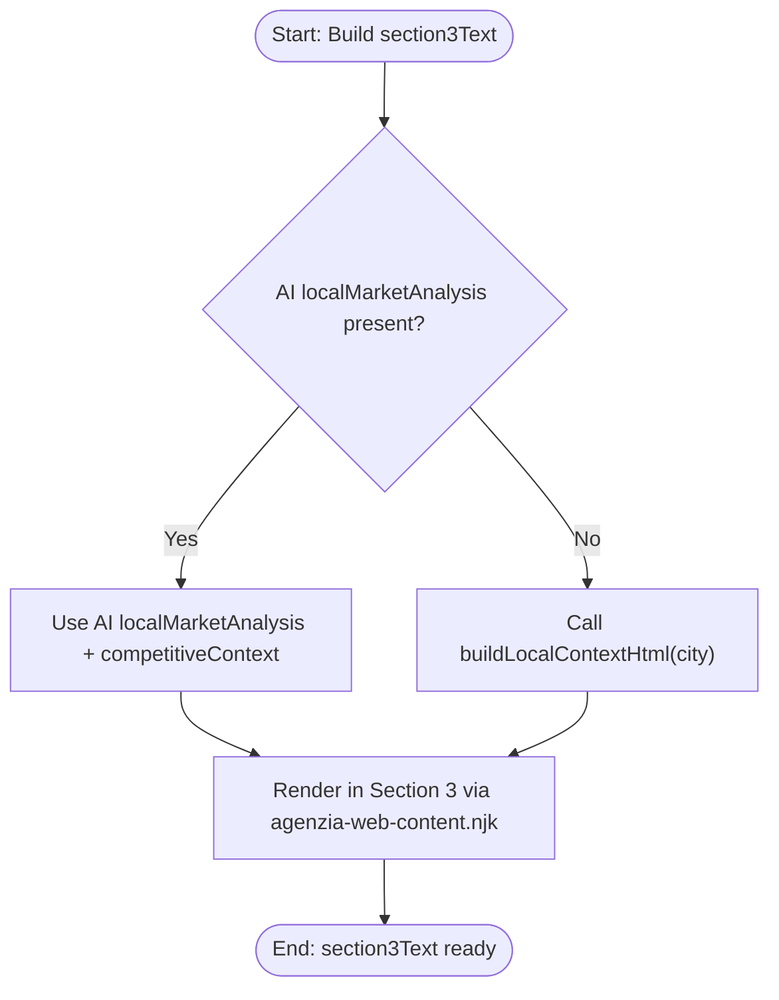
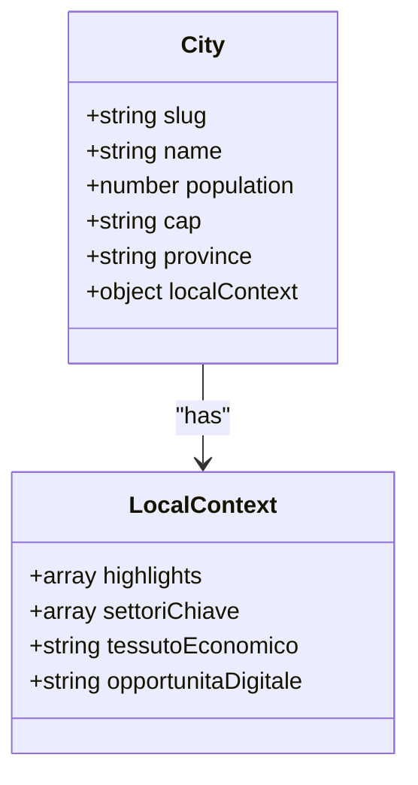
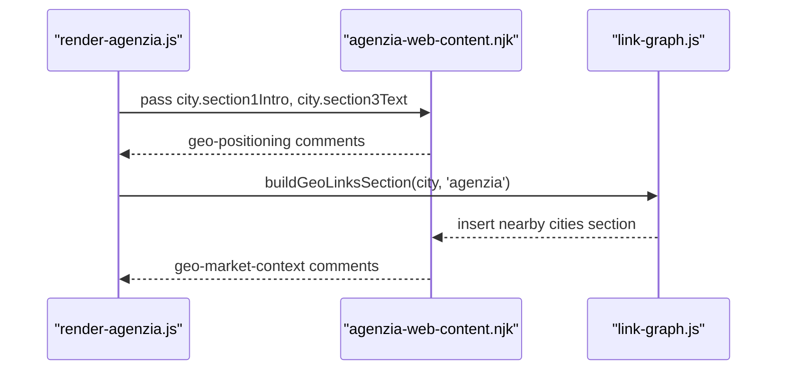
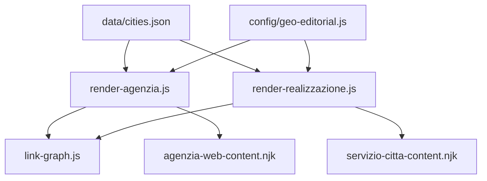

# Local Context & Economic Sections

<cite>
**Referenced Files in This Document**
- [cities.json](file://data/cities.json)
- [agenzia-web-content.njk](file://templates/agenzia-web-content.njk)
- [servizio-citta-content.njk](file://templates/servizio-citta-content.njk)
- [render-agenzia.js](file://scripts/geo/render-agenzia.js)
- [render-realizzazione.js](file://scripts/geo/render-realizzazione.js)
- [link-graph.js](file://scripts/geo/link-graph.js)
- [geo-editorial.js](file://config/geo-editorial.js)
- [html-utils.js](file://scripts/geo/html-utils.js)
</cite>

## Table of Contents
1. [Introduction](#introduction)
2. [Project Structure](#project-structure)
3. [Core Components](#core-components)
4. [Architecture Overview](#architecture-overview)
5. [Detailed Component Analysis](#detailed-component-analysis)
6. [Dependency Analysis](#dependency-analysis)
7. [Performance Considerations](#performance-considerations)
8. [Troubleshooting Guide](#troubleshooting-guide)
9. [Conclusion](#conclusion)
10. [Appendices](#appendices)

## Introduction
This document explains how local context sections generate unique, city-specific economic and market content across the site’s geo pages. It focuses on:
- How section1Intro, section3Text, and localContext variables are computed and rendered to create compelling local narratives per city.
- The structure of localContext.settoriChiave for industry sectors and localContext.highlights for regional landmarks.
- Integration points for geo-positioning markers and market context injection.
- SEO benefits of localized content, personalization strategies, and maintaining consistency while ensuring uniqueness across multiple city pages.

## Project Structure
The local context system is built from three layers:
- Data layer: City data with localContext fields (e.g., highlights, settoriChiave, tessutoEconomico, opportunitaDigitale).
- Rendering layer: Page generators that compute section1Intro and section3Text using city data and optional AI-enriched blocks.
- Template layer: Nunjucks templates that render Section 1 and Section 3 with injected local context and landmarks.

**Diagram sources**
- [cities.json:15-54](file://data/cities.json#L15-L54)
- [render-agenzia.js:79-131](file://scripts/geo/render-agenzia.js#L79-L131)
- [render-realizzazione.js:135-157](file://scripts/geo/render-realizzazione.js#L135-L157)
- [agenzia-web-content.njk:42-72](file://templates/agenzia-web-content.njk#L42-L72)
- [servizio-citta-content.njk:131-151](file://templates/servizio-citta-content.njk#L131-L151)
- [link-graph.js:14-51](file://scripts/geo/link-graph.js#L14-L51)

**Section sources**
- [cities.json:15-54](file://data/cities.json#L15-L54)
- [render-agenzia.js:79-131](file://scripts/geo/render-agenzia.js#L79-L131)
- [render-realizzazione.js:135-157](file://scripts/geo/render-realizzazione.js#L135-L157)
- [agenzia-web-content.njk:42-72](file://templates/agenzia-web-content.njk#L42-L72)
- [servizio-citta-content.njk:131-151](file://templates/servizio-citta-content.njk#L131-L151)
- [link-graph.js:14-51](file://scripts/geo/link-graph.js#L14-L51)

## Core Components
- City data model: Each city record includes a localContext object with:
  - highlights: array of landmark strings used to build “Punti di riferimento del territorio”.
  - settoriChiave: array of key industry sectors used to tailor sector-specific content.
  - tessutoEconomico: narrative describing the local economy and business fabric.
  - opportunitaDigitale: narrative about digital opportunities and competitive gaps.
- Generators:
  - render-agenzia.js computes section1Intro and section3Text, optionally merging AI-generated competitive context and local market analysis.
  - render-realizzazione.js injects market intro and highlights into the base template via regex replacements.
- Templates:
  - agenzia-web-content.njk renders Section 1 (local context) and Section 3 (economic context), including sector cards and highlights.
  - servizio-citta-content.njk renders Section 3 with local market context and highlights, plus sector references.

**Section sources**
- [cities.json:15-54](file://data/cities.json#L15-L54)
- [render-agenzia.js:79-131](file://scripts/geo/render-agenzia.js#L79-L131)
- [render-realizzazione.js:135-157](file://scripts/geo/render-realizzazione.js#L135-L157)
- [agenzia-web-content.njk:42-72](file://templates/agenzia-web-content.njk#L42-L72)
- [servizio-citta-content.njk:131-151](file://templates/servizio-citta-content.njk#L131-L151)

## Architecture Overview
The flow from data to rendered page ensures each city page has unique local context:
- Data loading: cities.json provides localContext per city.
- Computation: render-agenzia.js and render-realizzazione.js compute section1Intro and section3Text, integrating AI blocks when available.
- Rendering: Nunjucks templates and regex-based base template replacements inject local context and highlights into Section 1 and Section 3.
- Link graph: link-graph.js builds local context HTML and nearby city links for internal linking.

**Diagram sources**
- [cities.json:15-54](file://data/cities.json#L15-L54)
- [render-agenzia.js:79-131](file://scripts/geo/render-agenzia.js#L79-L131)
- [render-realizzazione.js:135-157](file://scripts/geo/render-realizzazione.js#L135-L157)
- [agenzia-web-content.njk:42-72](file://templates/agenzia-web-content.njk#L42-L72)
- [servizio-citta-content.njk:131-151](file://templates/servizio-citta-content.njk#L131-L151)
- [link-graph.js:14-51](file://scripts/geo/link-graph.js#L14-L51)

## Detailed Component Analysis

### section1Intro Implementation
- Purpose: Provide a concise, city-specific introduction in Section 1 that blends local economic narrative with competitive context when available.
- Logic:
  - If AI competitive context exists, merge it with city.localContext.tessutoEconomico.
  - Otherwise, fall back to city.localContext.tessuttoEconomico or a default statement about the city’s entrepreneurial fabric.
- Rendering:
  - agenzia-web-content.njk outputs city.section1Intro inside Section 1, marked by geo-positioning comments for integration points.

**Diagram sources**
- [render-agenzia.js:83-92](file://scripts/geo/render-agenzia.js#L83-L92)
- [agenzia-web-content.njk:57-72](file://templates/agenzia-web-content.njk#L57-L72)

**Section sources**
- [render-agenzia.js:83-92](file://scripts/geo/render-agenzia.js#L83-L92)
- [agenzia-web-content.njk:57-72](file://templates/agenzia-web-content.njk#L57-L72)

### section3Text Implementation
- Purpose: Deliver a rich, city-specific economic and market context in Section 3, enriched by AI when available.
- Logic:
  - Prefer AI localMarketAnalysis and competitiveContext if present.
  - Otherwise, build HTML from city.localContext (tessutoEconomico, opportunitaDigitale, settoriChiave) via buildLocalContextHtml().
- Rendering:
  - agenzia-web-content.njk renders city.section3Text within Section 3, with geo-market-context comments marking injection points.

**Diagram sources**
- [render-agenzia.js:83-86](file://scripts/geo/render-agenzia.js#L83-L86)
- [link-graph.js:36-51](file://scripts/geo/link-graph.js#L36-L51)
- [agenzia-web-content.njk:144-152](file://templates/agenzia-web-content.njk#L144-L152)

**Section sources**
- [render-agenzia.js:83-86](file://scripts/geo/render-agenzia.js#L83-L86)
- [link-graph.js:36-51](file://scripts/geo/link-graph.js#L36-L51)
- [agenzia-web-content.njk:144-152](file://templates/agenzia-web-content.njk#L144-L152)

### localContext Structure: settoriChiave and highlights
- settoriChiave: Array of key industry sectors for the city; used to generate sector-specific cards and contextual paragraphs.
- highlights: Array of landmark names; used to produce “Punti di riferimento del territorio” sentences across templates.
- Usage:
  - agenzia-web-content.njk renders sector cards and highlights in dedicated sections.
  - servizio-citta-content.njk uses highlights in Section 3 and references settoriChiave in service descriptions.

**Diagram sources**
- [cities.json:15-54](file://data/cities.json#L15-L54)
- [agenzia-web-content.njk:218-237](file://templates/agenzia-web-content.njk#L218-L237)
- [servizio-citta-content.njk:131-151](file://templates/servizio-citta-content.njk#L131-L151)

**Section sources**
- [cities.json:15-54](file://data/cities.json#L15-L54)
- [agenzia-web-content.njk:218-237](file://templates/agenzia-web-content.njk#L218-L237)
- [servizio-citta-content.njk:131-151](file://templates/servizio-citta-content.njk#L131-L151)

### Geo-positioning Markers and Market Context Injection Points
- Geo-positioning markers:
  - agenzia-web-content.njk includes <!-- CUSTOM:geo-positioning:START --> and <!-- CUSTOM:geo-positioning:END --> around Section 1 content to mark where geo positioning can be integrated.
- Market context injection points:
  - agenzia-web-content.njk includes <!-- CUSTOM:geo-market-context:START --> and <!-- CUSTOM:geo-market-context:END --> around Section 3 content to mark where market context can be injected.
- Nearby city links:
  - link-graph.js builds a “Serviamo anche i comuni vicini” section with algorithmic internal links based on approved indexable paths and nearest cities.

**Diagram sources**
- [agenzia-web-content.njk:57-72](file://templates/agenzia-web-content.njk#L57-L72)
- [agenzia-web-content.njk:144-152](file://templates/agenzia-web-content.njk#L144-L152)
- [link-graph.js:14-34](file://scripts/geo/link-graph.js#L14-L34)

**Section sources**
- [agenzia-web-content.njk:57-72](file://templates/agenzia-web-content.njk#L57-L72)
- [agenzia-web-content.njk:144-152](file://templates/agenzia-web-content.njk#L144-L152)
- [link-graph.js:14-34](file://scripts/geo/link-graph.js#L14-L34)

### Creating Compelling Local Narratives
- Combine city.localContext.tessutoEconomico with AI competitiveContext for stronger opening narratives in Section 1.
- Use city.localContext.opportunitaDigitale to highlight digital gaps and opportunities in Section 3.
- Integrate city.localContext.settoriChiave to tailor sector-specific messaging and cards.
- Include city.localContext.highlights to ground the narrative in recognizable local landmarks.

**Section sources**
- [render-agenzia.js:83-92](file://scripts/geo/render-agenzia.js#L83-L92)
- [link-graph.js:36-51](file://scripts/geo/link-graph.js#L36-L51)
- [servizio-citta-content.njk:131-151](file://templates/servizio-citta-content.njk#L131-L151)

### Incorporating Economic Statistics
- Population figures from city.population are included in local context HTML to add statistical density and credibility.
- Sector lists and highlights provide entity-rich signals for search engines.

**Section sources**
- [link-graph.js:36-51](file://scripts/geo/link-graph.js#L36-L51)
- [cities.json:15-54](file://data/cities.json#L15-L54)

### Structuring Sector-Specific Content
- For each settore in city.localContext.settoriChiave, render a card with a heading and short description tailored to the city and service.
- Reuse highlights to reinforce locality in sector sections.

**Section sources**
- [agenzia-web-content.njk:218-237](file://templates/agenzia-web-content.njk#L218-L237)
- [servizio-citta-content.njk:131-151](file://templates/servizio-citta-content.njk#L131-L151)

## Dependency Analysis
- Data dependency: All local context originates from data/cities.json.
- Generator dependencies:
  - render-agenzia.js depends on link-graph.js for buildLocalContextHtml().
  - render-realizzazione.js depends on link-graph.js for buildGeoLinksSection().
- Template dependencies:
  - agenzia-web-content.njk consumes city.section1Intro and city.section3Text.
  - servizio-citta-content.njk consumes city.localContext directly when AI content is absent.
- Editorial governance:
  - config/geo-editorial.js validates editorial corpus and ensures compliance with governance rules, indirectly influencing content availability and quality.

**Diagram sources**
- [cities.json:15-54](file://data/cities.json#L15-L54)
- [render-agenzia.js:79-131](file://scripts/geo/render-agenzia.js#L79-L131)
- [render-realizzazione.js:135-157](file://scripts/geo/render-realizzazione.js#L135-L157)
- [link-graph.js:14-51](file://scripts/geo/link-graph.js#L14-L51)
- [agenzia-web-content.njk:42-72](file://templates/agenzia-web-content.njk#L42-L72)
- [servizio-citta-content.njk:131-151](file://templates/servizio-citta-content.njk#L131-L151)
- [geo-editorial.js:407-459](file://config/geo-editorial.js#L407-L459)

**Section sources**
- [render-agenzia.js:79-131](file://scripts/geo/render-agenzia.js#L79-L131)
- [render-realizzazione.js:135-157](file://scripts/geo/render-realizzazione.js#L135-L157)
- [link-graph.js:14-51](file://scripts/geo/link-graph.js#L14-L51)
- [agenzia-web-content.njk:42-72](file://templates/agenzia-web-content.njk#L42-L72)
- [servizio-citta-content.njk:131-151](file://templates/servizio-citta-content.njk#L131-L151)
- [geo-editorial.js:407-459](file://config/geo-editorial.js#L407-L459)

## Performance Considerations
- Avoid heavy DOM manipulations in templates; rely on server-side rendering for local context.
- Cache city data and editorial corpus to reduce I/O overhead during generation.
- Limit the number of nearby city links to maintain page load performance and avoid excessive internal linking.

[No sources needed since this section provides general guidance]

## Troubleshooting Guide
- Missing localContext fields:
  - Ensure city.localContext includes highlights, settoriChiave, tessutoEconomico, and opportunitaDigitale to prevent empty sections.
- AI content absence:
  - When AI blocks are missing, templates fall back to city.localContext; verify data integrity in cities.json.
- Governance validation errors:
  - config/geo-editorial.js enforces strict schema and claim rules; fix any mismatches in editorial records to avoid build failures.

**Section sources**
- [cities.json:15-54](file://data/cities.json#L15-L54)
- [geo-editorial.js:407-459](file://config/geo-editorial.js#L407-L459)

## Conclusion
The local context system delivers unique, city-specific economic and market narratives through a robust data-to-template pipeline. By leveraging city.localContext fields and optional AI enrichment, the system ensures consistent yet differentiated content across geo pages, enhancing SEO, personalization, and user relevance.

[No sources needed since this section summarizes without analyzing specific files]

## Appendices

### SEO Benefits of Localized Content
- Entity-rich content (landmarks, sectors) improves topical authority and local search visibility.
- Internal linking to nearby cities strengthens site architecture and distributes ranking signals.
- Statistical density (population, sectors) enhances credibility and snippet potential.

[No sources needed since this section provides general guidance]

### Content Personalization Strategies
- Blend AI competitive insights with local economic narratives for stronger openings.
- Tailor sector cards to city-specific industries using settoriChiave.
- Ground narratives in local landmarks via highlights to increase relatability.

[No sources needed since this section provides general guidance]

### Maintaining Consistency While Ensuring Uniqueness
- Use shared templates and generators to enforce structural consistency.
- Customize content via city.localContext and optional AI blocks to ensure uniqueness per city.
- Validate editorial content against governance rules to maintain quality and compliance.

[No sources needed since this section provides general guidance]