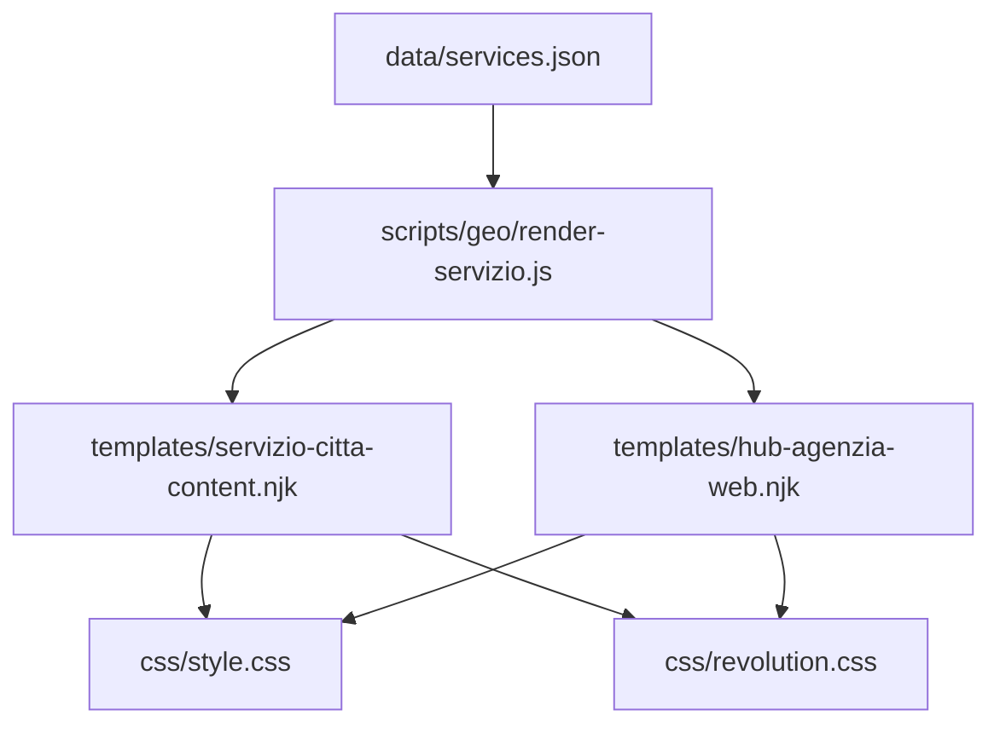
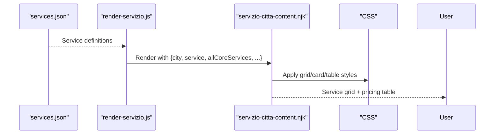
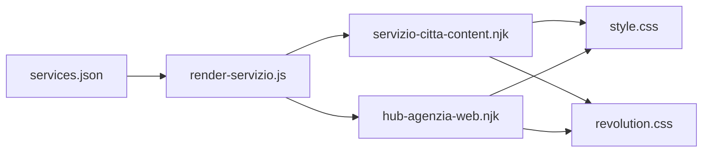

# Service Grid & Pricing Tables

<cite>
**Referenced Files in This Document**
- [services.json](file://data/services.json)
- [servizio-citta-content.njk](file://templates/servizio-citta-content.njk)
- [hub-agenzia-web.njk](file://templates/hub-agenzia-web.njk)
- [render-servizio.js](file://scripts/geo/render-servizio.js)
- [style.css](file://css/style.css)
- [revolution.css](file://css/revolution.css)
</cite>

## Table of Contents
1. [Introduction](#introduction)
2. [Project Structure](#project-structure)
3. [Core Components](#core-components)
4. [Architecture Overview](#architecture-overview)
5. [Detailed Component Analysis](#detailed-component-analysis)
6. [Dependency Analysis](#dependency-analysis)
7. [Performance Considerations](#performance-considerations)
8. [Troubleshooting Guide](#troubleshooting-guide)
9. [Conclusion](#conclusion)
10. [Appendices](#appendices)

## Introduction
This document explains the service grid component that displays WebNovis’s web agency services with pricing information across city-specific pages and hub pages. It covers data binding from the services catalog, responsive grid layout, card styling, comparison table generation, local context integration for city-specific offerings and pricing adjustments, and guidance for extending services, customizing cards, implementing pricing tiers, optimizing tables on mobile, and ensuring accessibility and SEO.

## Project Structure
The service grid is rendered by Nunjucks templates using a centralized services catalog and geo-aware build scripts:
- Services catalog: JSON file defining all services and their attributes (pricing, time estimates, metadata).
- Templates: City×service pages and hub pages render grids and comparison tables bound to services data.
- Build script: Prepares template variables, including enriched service lists and links for comparison tables.
- Styles: Global CSS provides responsive grids, card styles, and mobile optimizations.

**Diagram sources**
- [services.json:1-307](file://data/services.json#L1-L307)
- [render-servizio.js:157-190](file://scripts/geo/render-servizio.js#L157-L190)
- [servizio-citta-content.njk:1-374](file://templates/servizio-citta-content.njk#L1-L374)
- [hub-agenzia-web.njk:1-145](file://templates/hub-agenzia-web.njk#L1-L145)
- [style.css:1-200](file://css/style.css#L1-L200)
- [revolution.css:494-552](file://css/revolution.css#L494-L552)

**Section sources**
- [services.json:1-307](file://data/services.json#L1-L307)
- [render-servizio.js:157-190](file://scripts/geo/render-servizio.js#L157-L190)
- [servizio-citta-content.njk:1-374](file://templates/servizio-citta-content.njk#L1-L374)
- [hub-agenzia-web.njk:1-145](file://templates/hub-agenzia-web.njk#L1-L145)
- [style.css:1-200](file://css/style.css#L1-L200)
- [revolution.css:494-552](file://css/revolution.css#L494-L552)

## Core Components
- Services catalog (services.json): Central source of truth for services, including shortName, description, priceFrom, priceUnit, priceCurrency, timeEstimate, and other metadata used across pages.
- City×service page template (servizio-citta-content.njk): Renders localized service details, mini cards (price, time, idealFor), and a “Tutti i servizi” comparison table bound to all core services.
- Hub page template (hub-agenzia-web.njk): Displays a compact services table for the broader “Agenzia Web per Comuni” hub.
- Build script (render-servizio.js): Injects template variables such as allCoreServices with geo URLs, enriches context (city, service, SEO, FAQs, AI content), and attaches structured data.
- Styles (style.css, revolution.css): Provide responsive grid layouts, card hover effects, and mobile-friendly behavior.

Key data bindings:
- Price display: Uses priceFrom and optional priceUnit (e.g., “/mese”) to show “€{priceFrom}{priceUnit}”.
- Time estimate: Bound to timeEstimate for delivery timelines.
- Short name and description: Used in cards and links; shortName drives concise labels.
- Local context: City-specific copy and sector highlights are injected via template variables.

**Section sources**
- [services.json:1-307](file://data/services.json#L1-L307)
- [servizio-citta-content.njk:72-95](file://templates/servizio-citta-content.njk#L72-L95)
- [servizio-citta-content.njk:280-311](file://templates/servizio-citta-content.njk#L280-L311)
- [hub-agenzia-web.njk:107-132](file://templates/hub-agenzia-web.njk#L107-L132)
- [render-servizio.js:157-190](file://scripts/geo/render-servizio.js#L157-L190)

## Architecture Overview
The rendering pipeline binds services.json into templates through the build script, which prepares enriched arrays and context for each city×service page. The templates then generate:
- Service mini cards showing price, time, and ideal-for segments.
- A comparison table listing all core services with prices and time estimates.
- Optional editorial blocks and FAQ sections tailored to the city.

**Diagram sources**
- [services.json:1-307](file://data/services.json#L1-L307)
- [render-servizio.js:157-190](file://scripts/geo/render-servizio.js#L157-L190)
- [servizio-citta-content.njk:280-311](file://templates/servizio-citta-content.njk#L280-L311)
- [style.css:1-200](file://css/style.css#L1-L200)
- [revolution.css:494-552](file://css/revolution.css#L494-L552)

## Detailed Component Analysis

### Data Binding: services.json to Templates
- Fields used:
  - shortName: Displayed in cards and table rows.
  - description: Shown in mini cards or contextual paragraphs.
  - priceFrom + priceUnit: Combined to form “€{priceFrom}{priceUnit}”.
  - timeEstimate: Rendered under “Tempi” and in comparison tables.
  - tier: Determines visibility (core vs extended) in generated pages.
  - hasPage: Indicates whether a dedicated service page exists.
- Template usage:
  - City×service page renders mini cards for price, time, idealFor and loops over allCoreServices for the comparison table.
  - Hub page renders a simpler table over coreServices.

Examples of binding paths:
- Mini card price: “Da €{{ service.priceFrom }}{{ service.priceUnit if service.priceUnit }}”
- Comparison table row: “€{{ svc.priceFrom }}{{ svc.priceUnit if svc.priceUnit }}” and “{{ svc.timeEstimate }}”

**Section sources**
- [services.json:1-307](file://data/services.json#L1-L307)
- [servizio-citta-content.njk:72-95](file://templates/servizio-citta-content.njk#L72-L95)
- [servizio-citta-content.njk:280-311](file://templates/servizio-citta-content.njk#L280-L311)
- [hub-agenzia-web.njk:107-132](file://templates/hub-agenzia-web.njk#L107-L132)

### Responsive Grid Layout Implementation
- Grid containers use responsive CSS classes like .service-grid and .services-hub-grid.
- Breakpoints adjust columns:
  - Desktop: multi-column grids (e.g., 3 columns).
  - Tablet/mobile: single column or two columns depending on section.
- Cards adapt with padding, font sizes, and spacing for readability on small screens.

Practical references:
- Hub page uses inline styles for overflow-x:auto on tables to ensure horizontal scrolling on narrow devices.
- Style rules include media queries adjusting grid-template-columns and typography for smaller viewports.

**Section sources**
- [hub-agenzia-web.njk:107-132](file://templates/hub-agenzia-web.njk#L107-L132)
- [style.css:3000-3200](file://css/style.css#L3000-L3200)
- [style.css:6819-6862](file://css/style.css#L6819-L6862)

### Service Card Styling
- Cards feature subtle borders, background gradients, and hover effects (lift, glow).
- Icon containers and titles follow consistent design tokens.
- Hover states enhance interactivity without compromising performance.

References:
- Card hover transitions, border colors, and shadows defined in the theme stylesheet.
- Typography and spacing align with brand tokens.

**Section sources**
- [revolution.css:494-552](file://css/revolution.css#L494-L552)

### Comparison Table Generation
- Built from allCoreServices array prepared by the build script.
- Each row includes:
  - Service name (shortName), optionally linked to its geo page.
  - Price string combining priceFrom and priceUnit.
  - Time estimate string.
- Highlighting: Current service row is visually emphasized.
- Mobile optimization: Tables wrapped in horizontally scrollable containers.

Build-time enrichment:
- allCoreServices entries include geoUrl when indexable, enabling direct navigation to city×service pages.

**Section sources**
- [render-servizio.js:157-190](file://scripts/geo/render-servizio.js#L157-L190)
- [servizio-citta-content.njk:280-311](file://templates/servizio-citta-content.njk#L280-L311)
- [hub-agenzia-web.njk:107-132](file://templates/hub-agenzia-web.njk#L107-L132)

### Local Context Integration
- City-specific copy and sectors are injected via template variables (e.g., city.localContext.settoriChiave).
- Pages can include editorial blocks and competitive insights unique to each city.
- Tier system controls amplification:
  - Tier 1 pages include extra editorial blocks and full comparison tables.
  - De-amplified pages omit certain link-heavy sections to avoid doorway patterns.

Integration points:
- Template conditionally renders sections based on tier and available data.
- Structured data (JSON-LD) is appended for offers and FAQs where applicable.

**Section sources**
- [servizio-citta-content.njk:57-95](file://templates/servizio-citta-content.njk#L57-L95)
- [servizio-citta-content.njk:153-184](file://templates/servizio-citta-content.njk#L153-L184)
- [servizio-citta-content.njk:280-311](file://templates/servizio-citta-content.njk#L280-L311)
- [render-servizio.js:246-283](file://scripts/geo/render-servizio.js#L246-L283)

### Adding New Services
Steps:
1. Add a new entry in services.json with required fields:
   - slug, name, shortName, description, priceFrom, priceCurrency, timeEstimate, tier, hasPage, url.
   - Optional: priceUnit (e.g., “/mese”), targetKeyword, idealFor.
2. Ensure the service appears in core or extended tiers as appropriate.
3. Rebuild pages so allCoreServices includes the new service and geoUrl is computed.
4. Verify rendering in city×service pages and hub pages.

Validation checklist:
- Price formatting: “€{priceFrom}{priceUnit}” renders correctly.
- Links: geoUrl resolves to existing city×service page when indexable.
- Accessibility: All text is meaningful and semantic.

**Section sources**
- [services.json:1-307](file://data/services.json#L1-L307)
- [render-servizio.js:157-190](file://scripts/geo/render-servizio.js#L157-L190)
- [servizio-citta-content.njk:280-311](file://templates/servizio-citta-content.njk#L280-L311)

### Customizing Service Cards
- Modify CSS classes for .service-card-mini or related components to adjust layout, spacing, and visuals.
- Use brand tokens (colors, fonts) to maintain consistency.
- For hover effects and transitions, reference the card styling rules.

Guidance:
- Keep changes scoped to card components to avoid unintended side effects.
- Test responsiveness across breakpoints.

**Section sources**
- [revolution.css:494-552](file://css/revolution.css#L494-L552)
- [style.css:3000-3200](file://css/style.css#L3000-L3200)

### Implementing Pricing Tiers
Approach:
- Use tier field in services.json to control visibility (core vs extended).
- On city×service pages, allCoreServices typically includes core services for comparison; extended services can be added selectively if needed.
- For recurring pricing, set priceUnit (e.g., “/mese”) to clarify billing cadence.

Considerations:
- Ensure priceDisplay logic handles both one-off and recurring models consistently.
- Update templates to reflect tier-based filtering if you introduce additional tiers.

**Section sources**
- [services.json:1-307](file://data/services.json#L1-L307)
- [servizio-citta-content.njk:280-311](file://templates/servizio-citta-content.njk#L280-L311)

### Optimizing Tables for Mobile Devices
- Wrap tables in containers with overflow-x:auto to enable horizontal scrolling on narrow screens.
- Use responsive typography and adequate cell padding for touch targets.
- Avoid excessive columns; prioritize essential info (Service, Price, Time).

References:
- Hub page demonstrates inline style wrapping for overflow handling.
- Media queries adjust grid and table behaviors for smaller viewports.

**Section sources**
- [hub-agenzia-web.njk:107-132](file://templates/hub-agenzia-web.njk#L107-L132)
- [style.css:3000-3200](file://css/style.css#L3000-L3200)

### Accessibility Features
- Semantic HTML structure: headings, lists, and tables provide clear hierarchy.
- Skip-to-content link improves keyboard navigation.
- ARIA attributes used for search modal and interactive elements.
- Contrast and focus states should be verified against brand tokens.

Recommendations:
- Ensure all images have descriptive alt text.
- Validate color contrast for text and interactive elements.
- Test keyboard navigation across all interactive components.

**Section sources**
- [servizio-citta-content.njk:21-55](file://templates/servizio-citta-content.njk#L21-L55)
- [hub-agenzia-web.njk:1-145](file://templates/hub-agenzia-web.njk#L1-L145)

### SEO Optimization for Service Listings
- Structured data: Offer and FAQPage schemas are appended during build for rich results.
- Canonical URLs and meta tags are set per page.
- Geo-targeted content enhances local relevance and citation visibility.

Implementation notes:
- JSON-LD includes offer details (price, currency) and FAQ items where present.
- Page-level metadata (title, description, canonical) should remain accurate and localized.

**Section sources**
- [render-servizio.js:246-283](file://scripts/geo/render-servizio.js#L246-L283)
- [servizio-citta-content.njk:280-311](file://templates/servizio-citta-content.njk#L280-L311)

## Dependency Analysis
The service grid depends on:
- services.json for master service definitions.
- render-servizio.js to compute template variables and inject geo-aware links.
- Templates to bind data into grids and tables.
- CSS files for responsive layout and visual styling.

**Diagram sources**
- [services.json:1-307](file://data/services.json#L1-L307)
- [render-servizio.js:157-190](file://scripts/geo/render-servizio.js#L157-L190)
- [servizio-citta-content.njk:1-374](file://templates/servizio-citta-content.njk#L1-L374)
- [hub-agenzia-web.njk:1-145](file://templates/hub-agenzia-web.njk#L1-L145)
- [style.css:1-200](file://css/style.css#L1-L200)
- [revolution.css:494-552](file://css/revolution.css#L494-L552)

**Section sources**
- [services.json:1-307](file://data/services.json#L1-L307)
- [render-servizio.js:157-190](file://scripts/geo/render-servizio.js#L157-L190)
- [servizio-citta-content.njk:1-374](file://templates/servizio-citta-content.njk#L1-L374)
- [hub-agenzia-web.njk:1-145](file://templates/hub-agenzia-web.njk#L1-L145)
- [style.css:1-200](file://css/style.css#L1-L200)
- [revolution.css:494-552](file://css/revolution.css#L494-L552)

## Performance Considerations
- Prefer static rendering via Nunjucks templates to minimize client-side overhead.
- Use responsive images and lazy loading where applicable.
- Keep CSS minimal and scoped to avoid unnecessary repaints.
- Ensure tables are lightweight and avoid heavy DOM manipulations.

[No sources needed since this section provides general guidance]

## Troubleshooting Guide
Common issues and resolutions:
- Missing price unit: If priceUnit is not set, ensure templates handle absence gracefully (conditional rendering).
- Broken geo links: Verify geoUrl computation in the build script and existence of corresponding city×service pages.
- Mobile overflow: Confirm tables are wrapped in scrollable containers and media queries apply correctly.
- Inconsistent tiers: Check tier values in services.json and confirm filtering logic in templates/build.

Verification steps:
- Inspect rendered HTML for correct bindings and semantic structure.
- Validate JSON-LD output for structured data accuracy.
- Run accessibility checks (keyboard navigation, contrast, ARIA).

**Section sources**
- [servizio-citta-content.njk:280-311](file://templates/servizio-citta-content.njk#L280-L311)
- [render-servizio.js:157-190](file://scripts/geo/render-servizio.js#L157-L190)
- [hub-agenzia-web.njk:107-132](file://templates/hub-agenzia-web.njk#L107-L132)

## Conclusion
The service grid component integrates a centralized services catalog with city-specific templates to deliver responsive, accessible, and SEO-optimized service listings with transparent pricing and time estimates. By leveraging structured data, tiered visibility, and robust CSS, the system scales across locales while maintaining clarity and usability. Extending services, customizing cards, and optimizing tables can be achieved through targeted updates to services.json, templates, and styles.

[No sources needed since this section summarizes without analyzing specific files]

## Appendices

### Example: Adding a New Service
- Add entry in services.json with fields: slug, name, shortName, description, priceFrom, priceCurrency, timeEstimate, tier, hasPage, url.
- Optionally add priceUnit for recurring pricing.
- Rebuild to populate allCoreServices and verify rendering.

**Section sources**
- [services.json:1-307](file://data/services.json#L1-L307)
- [render-servizio.js:157-190](file://scripts/geo/render-servizio.js#L157-L190)

### Example: Customizing Service Cards
- Adjust CSS for .service-card-mini and related components in style.css or theme files.
- Maintain brand tokens and test responsiveness.

**Section sources**
- [revolution.css:494-552](file://css/revolution.css#L494-L552)
- [style.css:3000-3200](file://css/style.css#L3000-L3200)

### Example: Implementing Pricing Tiers
- Set tier in services.json to control visibility (core vs extended).
- Update templates/build to filter or include extended services as needed.

**Section sources**
- [services.json:1-307](file://data/services.json#L1-L307)
- [servizio-citta-content.njk:280-311](file://templates/servizio-citta-content.njk#L280-L311)

### Example: Optimizing Tables for Mobile
- Wrap tables in containers with overflow-x:auto.
- Use media queries to adjust typography and spacing.

**Section sources**
- [hub-agenzia-web.njk:107-132](file://templates/hub-agenzia-web.njk#L107-L132)
- [style.css:3000-3200](file://css/style.css#L3000-L3200)