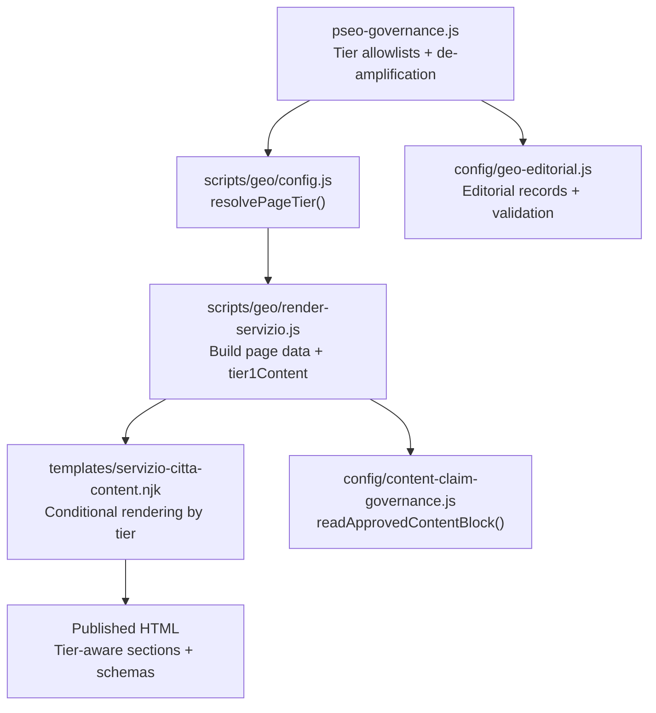
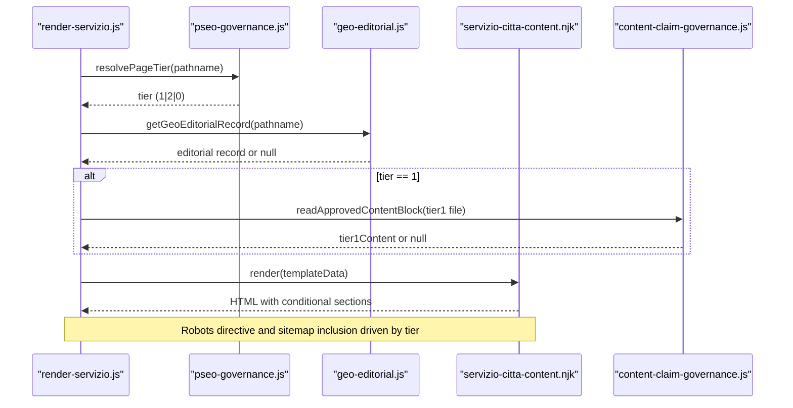
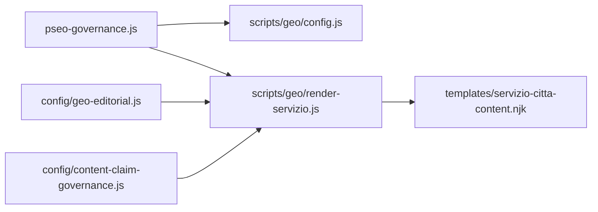
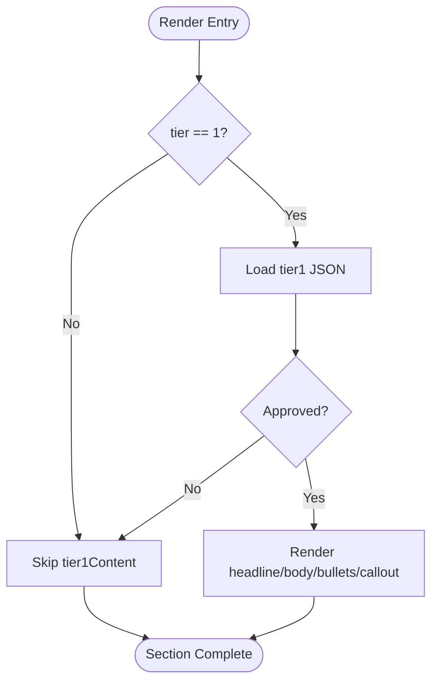

# Tier System & Content Differentiation

<cite>
**Referenced Files in This Document**
- [pseo-governance.js](file://config/pseo-governance.js)
- [geo-editorial.js](file://config/geo-editorial.js)
- [content-claim-governance.js](file://config/content-claim-governance.js)
- [render-servizio.js](file://scripts/geo/render-servizio.js)
- [servizio-citta-content.njk](file://templates/servizio-citta-content.njk)
- [render-realizzazione.js](file://scripts/geo/render-realizzazione.js)
- [tier1-arese-agenzia-web.json](file://data/content-blocks/tier1-arese-agenzia-web.json)
- [config.js](file://scripts/geo/config.js)
</cite>

## Table of Contents
1. [Introduction](#introduction)
2. [Project Structure](#project-structure)
3. [Core Components](#core-components)
4. [Architecture Overview](#architecture-overview)
5. [Detailed Component Analysis](#detailed-component-analysis)
6. [Dependency Analysis](#dependency-analysis)
7. [Performance Considerations](#performance-considerations)
8. [Troubleshooting Guide](#troubleshooting-guide)
9. [Conclusion](#conclusion)
10. [Appendices](#appendices)

## Introduction
This document explains the tier system that controls content differentiation across geo-targeted pages. The system classifies generated service×city pages into three tiers:
- Tier 1: Indexable pages with unique, hand-crafted editorial content and full feature set.
- Tier 2: Indexable pages using standard template content for long-tail and cross-linking support.
- Tier 0: De-amplified pages marked noindex,follow to reduce doorway footprint; slim structure and fewer links.

The tier determines indexing behavior, structural rendering, and whether premium editorial blocks are injected. Governance rules ensure only approved content is published, preventing unsupported claims and maintaining SEO quality.

## Project Structure
The tier system spans configuration, data, generation scripts, and templates:
- Governance and allowlists define which paths are indexable and their tier.
- Editorial corpus defines structured content for approved pages.
- Page generators compute tier, load tier-specific overrides, and assemble page data.
- Templates conditionally render sections based on tier and available content.
- Claim governance validates and sanitizes any custom or editorial content before publishing.

**Diagram sources**
- [pseo-governance.js:42-153](file://config/pseo-governance.js#L42-L153)
- [config.js:62-66](file://scripts/geo/config.js#L62-L66)
- [render-servizio.js:143-155](file://scripts/geo/render-servizio.js#L143-L155)
- [servizio-citta-content.njk:153-184](file://templates/servizio-citta-content.njk#L153-L184)
- [content-claim-governance.js:85-95](file://config/content-claim-governance.js#L85-L95)
- [geo-editorial.js:183-188](file://config/geo-editorial.js#L183-L188)

**Section sources**
- [pseo-governance.js:1-311](file://config/pseo-governance.js#L1-L311)
- [config.js:1-114](file://scripts/geo/config.js#L1-L114)
- [render-servizio.js:1-289](file://scripts/geo/render-servizio.js#L1-L289)
- [servizio-citta-content.njk:1-374](file://templates/servizio-citta-content.njk#L1-L374)
- [content-claim-governance.js:1-240](file://config/content-claim-governance.js#L1-L240)
- [geo-editorial.js:1-527](file://config/geo-editorial.js#L1-L527)

## Core Components
- Tier classification and indexing policy:
  - Tier 1 and Tier 2 allowlist sets determine indexability.
  - Non-listed GEO paths are de-amplified (noindex,follow).
  - Removed paths are always noindex,follow and excluded from sitemap.
- Editorial corpus:
  - Structured records per path with title, description, h1, answer capsule, intro, sections, FAQs, and CTA.
  - Validation enforces schema, uniqueness, and claim compliance.
- Tier 1 content blocks:
  - Hand-crafted JSON files override content for strategic city×service pages.
  - Must include approved provenance metadata and pass claim checks.
- Rendering logic:
  - Template renders extra editorial section for Tier 1 when present.
  - Comparison table and related-city links are shown only on indexable tiers.
  - Related-service link count is reduced on de-amplified pages.

**Section sources**
- [pseo-governance.js:42-153](file://config/pseo-governance.js#L42-L153)
- [pseo-governance.js:250-287](file://config/pseo-governance.js#L250-L287)
- [geo-editorial.js:183-188](file://config/geo-editorial.js#L183-L188)
- [geo-editorial.js:339-399](file://config/geo-editorial.js#L339-L399)
- [content-claim-governance.js:85-95](file://config/content-claim-governance.js#L85-L95)
- [servizio-citta-content.njk:153-184](file://templates/servizio-citta-content.njk#L153-L184)
- [servizio-citta-content.njk:280-360](file://templates/servizio-citta-content.njk#L280-L360)

## Architecture Overview
The tier system flows through these stages:
1. Path resolution: Determine if a URL is a GEO path and its tier.
2. Governance check: Allowlist vs de-amplification decides robots directives and sitemap inclusion.
3. Data assembly: Load editorial record and optional Tier 1 content block.
4. Template rendering: Conditionally inject editorial sections, comparison tables, and related links.
5. Output validation: Strip unapproved legacy blocks and enforce claim policies.

**Diagram sources**
- [config.js:62-66](file://scripts/geo/config.js#L62-L66)
- [render-servizio.js:143-155](file://scripts/geo/render-servizio.js#L143-L155)
- [geo-editorial.js:497-505](file://config/geo-editorial.js#L497-L505)
- [content-claim-governance.js:85-95](file://config/content-claim-governance.js#L85-L95)
- [servizio-citta-content.njk:153-184](file://templates/servizio-citta-content.njk#L153-L184)

## Detailed Component Analysis

### Tier Classification and SEO Policy
- Tier 1 allowlist contains high-priority city×service pages intended to rank top results with unique content.
- Tier 2 allowlist includes supporting commercial pages for long-tail queries and internal linking.
- Any GEO path not in allowlists is auto-deamplified; removed paths are explicitly blocked.
- Robots directives and sitemap inclusion are derived from tier status.

Key behaviors:
- isDeAmplifiedPath returns true for non-allowlisted GEO paths and removed paths.
- getIndexationDirectivesForPath returns noindex,follow for de-amplified pages.
- shouldIncludeInSitemapPath excludes de-amplified and removed paths.

**Section sources**
- [pseo-governance.js:42-153](file://config/pseo-governance.js#L42-L153)
- [pseo-governance.js:217-228](file://config/pseo-governance.js#L217-L228)
- [pseo-governance.js:250-287](file://config/pseo-governance.js#L250-L287)

### Editorial Corpus and Governance
- Each approved GEO path has an editorial record with strict fields: title, description, h1, answer_capsule, intro, sections, faqs, cta.
- Records are validated against manifest and governance allowlists; mismatches fail build.
- Prices quoted in copy must exist in the service catalogue; unsupported performance/rating claims are rejected.
- Location status ensures Rho is treated as headquarters and other cities are framed as area served.

Validation highlights:
- deriveTier maps path to Tier 1, Tier 2, or Data-validated.
- validateRecord enforces field counts, lengths, and claim patterns.
- loadGeoEditorialCorpus caches and freezes enriched records for safe consumption.

**Section sources**
- [geo-editorial.js:183-188](file://config/geo-editorial.js#L183-L188)
- [geo-editorial.js:339-399](file://config/geo-editorial.js#L339-L399)
- [geo-editorial.js:407-459](file://config/geo-editorial.js#L407-L459)
- [geo-editorial.js:461-491](file://config/geo-editorial.js#L461-L491)

### Tier 1 Content Blocks: Structure and Rendering
Tier 1 content blocks are hand-crafted JSON files located under data/content-blocks with naming convention tier1-<city>-<service>.json. They provide:
- headline: H2 heading for the editorial section.
- body: Array of paragraphs with optional inline markup.
- bullets: Array of bullet items with optional inline markup.
- callout: Optional highlighted box with title and text.
- _meta: Provenance metadata required for approval.

Rendering rules:
- Only rendered when tier == 1 and the file exists and passes approval.
- Template wraps content in a dedicated section with data-tier="1".
- Bullets and callouts are styled consistently across pages.

Approval pipeline:
- readApprovedContentBlock loads JSON and validates provenance and claims.
- Unsupported claims cause the block to be rejected (null), preventing publication.

Example reference:
- See the Arese Agenzia Web Tier 1 block for structure and editorial notes.

**Section sources**
- [tier1-arese-agenzia-web.json:1-34](file://data/content-blocks/tier1-arese-agenzia-web.json#L1-L34)
- [render-servizio.js:143-155](file://scripts/geo/render-servizio.js#L143-L155)
- [servizio-citta-content.njk:153-184](file://templates/servizio-citta-content.njk#L153-L184)
- [content-claim-governance.js:85-95](file://config/content-claim-governance.js#L85-L95)

### Conditional Rendering Logic
Template conditions control what appears on each tier:
- Tier 1: Extra editorial section (tier1Content) is rendered before comparison table.
- Tier 2: Standard template sections without tier1Content.
- Tier 0: Comparison table and nearby-city links are omitted; related-service links are limited to 3.

Additional logic:
- Editorial sections from geo-editorial records are inserted early in the page when present.
- FAQ pools vary by service cluster; editorial FAQs override defaults when provided.
- Schemas (BreadcrumbList, WebPage, Service, FAQPage) are appended to all generated pages.

**Section sources**
- [servizio-citta-content.njk:58-70](file://templates/servizio-citta-content.njk#L58-L70)
- [servizio-citta-content.njk:153-184](file://templates/servizio-citta-content.njk#L153-L184)
- [servizio-citta-content.njk:280-360](file://templates/servizio-citta-content.njk#L280-L360)
- [render-servizio.js:96-132](file://scripts/geo/render-servizio.js#L96-L132)
- [render-servizio.js:218-283](file://scripts/geo/render-servizio.js#L218-L283)

### pSEO Governance Rules
Governance enforces:
- Explicit de-amplified paths remain blocked regardless of tier membership.
- Auto-deamplification applies to all GEO paths not in allowlists.
- Removed paths are always noindex,follow and excluded from sitemap.
- Manifest-based editorial corpus must match governance allowlists exactly.

Operational impact:
- Build-time validation fails if records mismatch governance tiers or paths.
- Published output cannot contain unapproved legacy Tier 1 blocks unless explicitly whitelisted.

**Section sources**
- [pseo-governance.js:25-35](file://config/pseo-governance.js#L25-L35)
- [pseo-governance.js:177-182](file://config/pseo-governance.js#L177-L182)
- [pseo-governance.js:217-228](file://config/pseo-governance.js#L217-L228)
- [geo-editorial.js:274-311](file://config/geo-editorial.js#L274-L311)
- [content-claim-governance.js:217-226](file://config/content-claim-governance.js#L217-L226)

### Data Model for Tier-Specific Content Blocks
Tier 1 content blocks follow a consistent schema:
- headline: string used as H2.
- body: array of strings (paragraphs), may include inline HTML.
- bullets: array of strings (list items), may include inline HTML.
- callout: object with title and text.
- _meta: object with publicationStatus, source, verifiedAt, approvedBy.

Complexity considerations:
- Rendering loops iterate over arrays; large bodies increase DOM size but remain manageable for typical marketing pages.
- Approval gating prevents risky content from entering production.

**Section sources**
- [tier1-arese-agenzia-web.json:1-34](file://data/content-blocks/tier1-arese-agenzia-web.json#L1-L34)
- [servizio-citta-content.njk:153-184](file://templates/servizio-citta-content.njk#L153-L184)
- [content-claim-governance.js:85-95](file://config/content-claim-governance.js#L85-L95)

### Examples: Creating Custom Tier Configurations
To create a new Tier 1 configuration:
1. Add the path to TIER1_INDEXABLE_GEO_PATHS in pseo-governance.js.
2. Create a corresponding tier1-<city>-<service>.json file with approved _meta and content.
3. Ensure editorial record exists in geo-editorial corpus and matches governance tier.
4. Verify claim governance passes; rebuild and inspect output.

Implementing editorial overrides:
- Use geo-editorial records to inject localized context, sections, FAQs, and CTA.
- Override default FAQ pools via editorial.faqs when needed.

Managing content quality:
- Avoid unsupported guarantees, rankings, and fixed delivery promises.
- Keep prices aligned with data/services.json.
- Mark areas served clearly for non-headquarters cities.

**Section sources**
- [pseo-governance.js:42-67](file://config/pseo-governance.js#L42-L67)
- [geo-editorial.js:339-399](file://config/geo-editorial.js#L339-L399)
- [content-claim-governance.js:17-60](file://config/content-claim-governance.js#L17-L60)

### SEO Implications and Indexing Strategies
- Tier 1 pages receive full content richness and are prioritized for ranking on primary local queries.
- Tier 2 pages support long-tail queries and internal linking without diluting authority.
- Tier 0 pages are de-amplified to reduce doorway footprint; they remain crawlable but are not indexed.
- Robots directives and sitemap inclusion are automated based on tier status.

Indexing strategy:
- Focus editorial investment on Tier 1 paths.
- Use Tier 2 for expansion into adjacent services/cities where demand exists.
- Monitor Tier 0 pages for accidental indexing; governance prevents this by default.

**Section sources**
- [pseo-governance.js:250-287](file://config/pseo-governance.js#L250-L287)
- [servizio-citta-content.njk:280-360](file://templates/servizio-citta-content.njk#L280-L360)

## Dependency Analysis
The tier system depends on coordinated modules:
- pseo-governance.js provides tier classification and SEO directives.
- geo-editorial.js supplies validated editorial records and manifests.
- content-claim-governance.js enforces claim policies and approves content blocks.
- render-servizio.js orchestrates data assembly and template rendering.
- servizio-citta-content.njk renders tier-aware HTML structure.

**Diagram sources**
- [pseo-governance.js:42-153](file://config/pseo-governance.js#L42-L153)
- [config.js:62-66](file://scripts/geo/config.js#L62-L66)
- [render-servizio.js:143-155](file://scripts/geo/render-servizio.js#L143-L155)
- [geo-editorial.js:497-505](file://config/geo-editorial.js#L497-L505)
- [content-claim-governance.js:85-95](file://config/content-claim-governance.js#L85-L95)
- [servizio-citta-content.njk:153-184](file://templates/servizio-citta-content.njk#L153-L184)

**Section sources**
- [pseo-governance.js:1-311](file://config/pseo-governance.js#L1-L311)
- [geo-editorial.js:1-527](file://config/geo-editorial.js#L1-L527)
- [content-claim-governance.js:1-240](file://config/content-claim-governance.js#L1-L240)
- [render-servizio.js:1-289](file://scripts/geo/render-servizio.js#L1-L289)
- [servizio-citta-content.njk:1-374](file://templates/servizio-citta-content.njk#L1-L374)

## Performance Considerations
- Tier 1 content blocks add minimal overhead; paragraphs and bullets are lightweight.
- Editorial records are cached to avoid repeated file reads during builds.
- Template conditionals prevent unnecessary DOM nodes on de-amplified pages.
- Claim validation runs at build time; runtime cost is negligible.

[No sources needed since this section provides general guidance]

## Troubleshooting Guide
Common issues and resolutions:
- Tier 1 block not rendering:
  - Ensure _meta has publicationStatus "approved", valid source URLs, verifiedAt date, and approvedBy author.
  - Confirm no unsupported claims exist in the block.
- Page unexpectedly de-amplified:
  - Check if path is missing from allowlists; add to TIER1 or TIER2 sets as appropriate.
  - Verify path is not in REMOVED_PATHS or EXPLICIT_DEAMPLIFIED_PATHS.
- Editorial record mismatch:
  - Validate that record path, city, service, and tier align with governance.
  - Ensure manifest record index matches governance allowlists exactly.
- Legacy Tier 1 blocks stripped:
  - Unapproved legacy blocks are removed; migrate to approved JSON format with proper _meta.

**Section sources**
- [content-claim-governance.js:85-95](file://config/content-claim-governance.js#L85-L95)
- [content-claim-governance.js:217-226](file://config/content-claim-governance.js#L217-L226)
- [pseo-governance.js:25-35](file://config/pseo-governance.js#L25-L35)
- [pseo-governance.js:177-182](file://config/pseo-governance.js#L177-L182)
- [geo-editorial.js:274-311](file://config/geo-editorial.js#L274-L311)

## Conclusion
The tier system provides a robust framework for differentiating content quality and SEO treatment across geo-targeted pages. Tier 1 pages receive unique editorial content and full features; Tier 2 pages offer standard support for long-tail queries; Tier 0 pages are de-amplified to minimize doorway footprint. Governance ensures only approved, claim-compliant content is published, protecting brand integrity and search performance. By following the documented processes for creating configurations, implementing editorial overrides, and managing content quality, teams can scale local SEO efforts responsibly and effectively.

[No sources needed since this section summarizes without analyzing specific files]

## Appendices

### Tier 1 Content Block Schema Reference
- headline: string (H2)
- body: array of strings (paragraphs)
- bullets: array of strings (list items)
- callout: object with title and text
- _meta: object with publicationStatus, source, verifiedAt, approvedBy

**Section sources**
- [tier1-arese-agenzia-web.json:1-34](file://data/content-blocks/tier1-arese-agenzia-web.json#L1-L34)

### Rendering Flow for Tier 1 Editorial Section

**Diagram sources**
- [render-servizio.js:143-155](file://scripts/geo/render-servizio.js#L143-L155)
- [servizio-citta-content.njk:153-184](file://templates/servizio-citta-content.njk#L153-L184)
- [content-claim-governance.js:85-95](file://config/content-claim-governance.js#L85-L95)