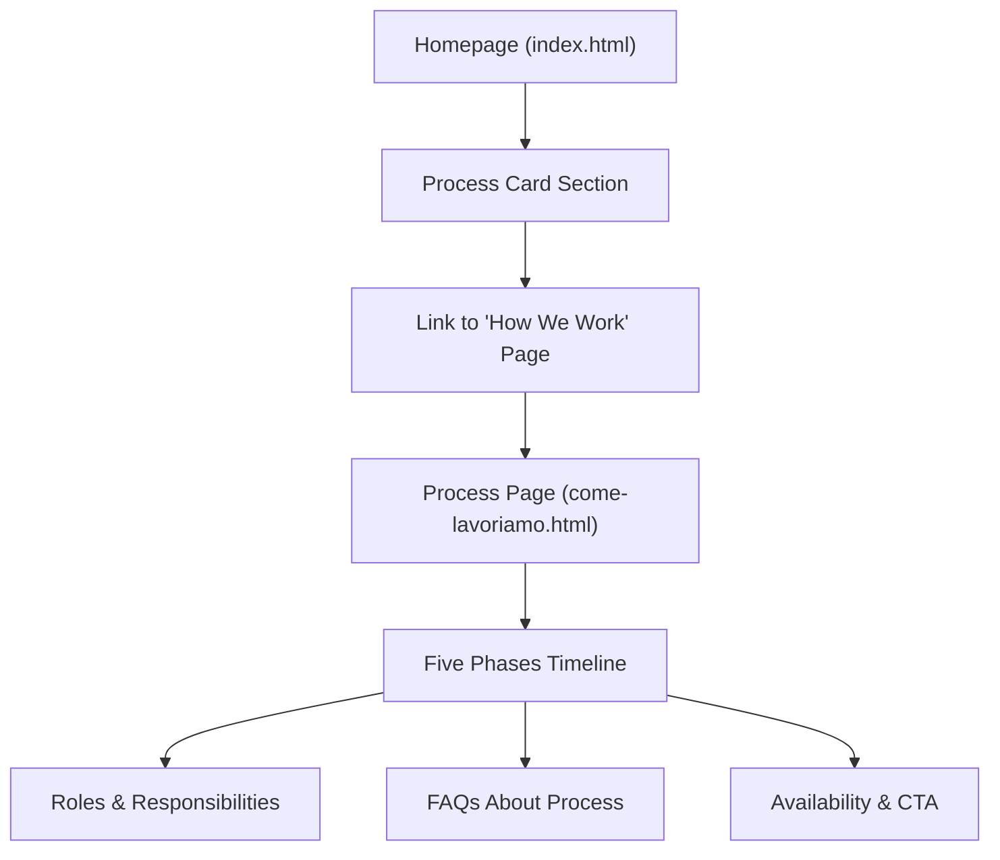
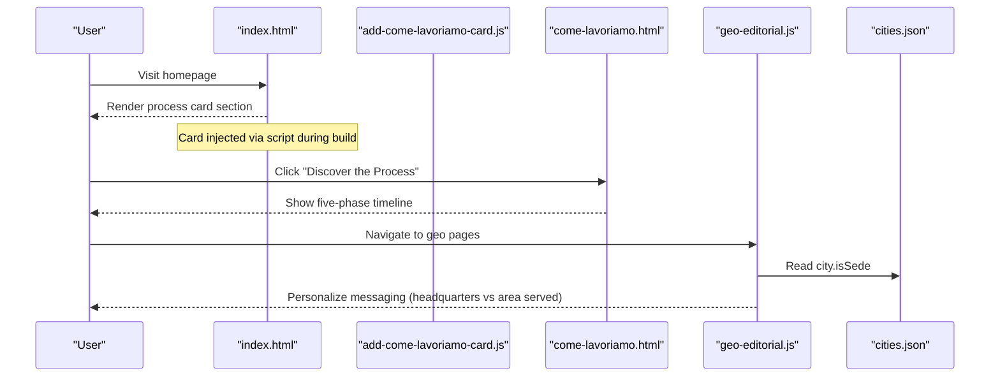
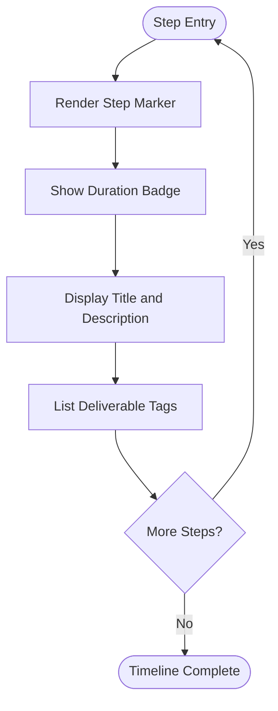
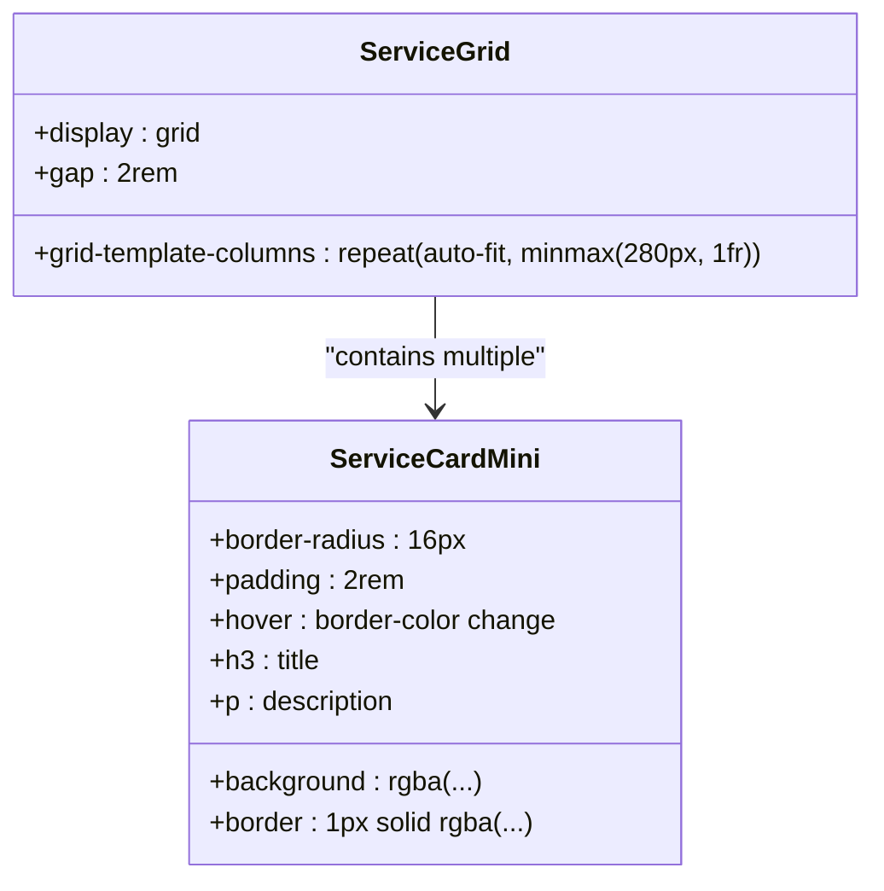
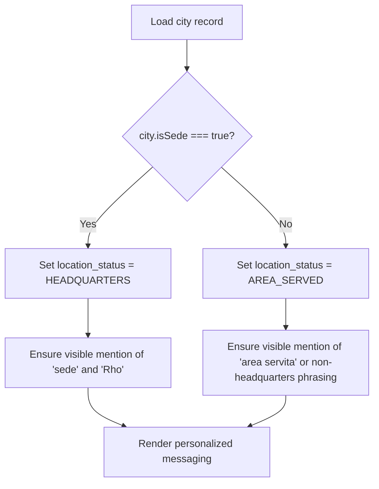
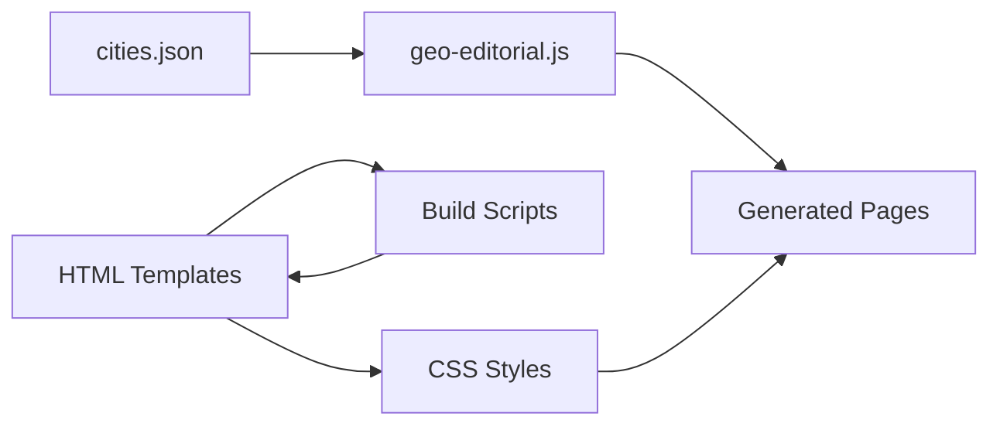

# Work Process & Methodology Display

<cite>
**Referenced Files in This Document**
- [come-lavoriamo.html](file://src/html/come-lavoriamo.html)
- [index.html](file://src/html/index.html)
- [add-come-lavoriamo-card.js](file://scripts/add-come-lavoriamo-card.js)
- [geo-editorial.js](file://config/geo-editorial.js)
- [cities.json](file://data/cities.json)
- [servizio-citta-content.njk](file://templates/servizio-citta-content.njk)
- [style.css](file://css/style.css)
</cite>

## Table of Contents
1. [Introduction](#introduction)
2. [Project Structure](#project-structure)
3. [Core Components](#core-components)
4. [Architecture Overview](#architecture-overview)
5. [Detailed Component Analysis](#detailed-component-analysis)
6. [Dependency Analysis](#dependency-analysis)
7. [Performance Considerations](#performance-considerations)
8. [Troubleshooting Guide](#troubleshooting-guide)
9. [Conclusion](#conclusion)
10. [Appendices](#appendices)

## Introduction
This document explains WebNovis’s structured work process display and methodology across five phases: Brief & Analysis, Wireframe & Architecture, Design & Branding, Development & SEO, and Launch & Support. It details how the section communicates transparency, timelines, responsibilities, and quality standards to build trust with potential clients. It also documents dynamic content generation for personalized messaging using the city.isSede variable, the service-card-mini component implementation, responsive grid layout, and consistent styling across process steps. Finally, it provides guidance on customizing descriptions, adding new phases, integrating project-specific details, and optimizing visualization for different screen sizes.

## Project Structure
The work process is presented through two primary entry points:
- A dedicated “How We Work” page that showcases the full five-phase methodology with detailed descriptions and deliverables.
- An integrated “Come Lavoriamo” card on the homepage that summarizes the process and links to the detailed page.

**Diagram sources**
- [index.html:330-358](file://src/html/index.html#L330-L358)
- [come-lavoriamo.html:48-131](file://src/html/come-lavoriamo.html#L48-L131)

**Section sources**
- [index.html:330-358](file://src/html/index.html#L330-L358)
- [come-lavoriamo.html:48-131](file://src/html/come-lavoriamo.html#L48-L131)

## Core Components
- Five-phase methodology timeline with step markers, durations, descriptions, and deliverable tags.
- Roles section clarifying client vs. agency responsibilities.
- Availability section emphasizing limited monthly slots and a clear call-to-action.
- FAQ section addressing common questions about timelines, revisions, technology, communication, and post-launch support.
- Integrated homepage card summarizing the process and linking to the detailed page.

Key elements include:
- Step cards with duration badges, titles, descriptions, and deliverable tags.
- Alternating layout for desktop and stacked layout for mobile.
- Consistent typography and color system aligned with the design system.

**Section sources**
- [come-lavoriamo.html:61-131](file://src/html/come-lavoriamo.html#L61-L131)
- [index.html:330-358](file://src/html/index.html#L330-L358)

## Architecture Overview
The process display combines static HTML structure with CSS-driven responsive behavior and optional script injection for the homepage card. The data layer includes city metadata used elsewhere in the site to personalize messaging based on whether a location is a headquarters or an area served.

**Diagram sources**
- [index.html:330-358](file://src/html/index.html#L330-L358)
- [add-come-lavoriamo-card.js:1-72](file://scripts/add-come-lavoriamo-card.js#L1-L72)
- [come-lavoriamo.html:61-131](file://src/html/come-lavoriamo.html#L61-L131)
- [geo-editorial.js:200-213](file://config/geo-editorial.js#L200-L213)
- [cities.json:1-200](file://data/cities.json#L1-L200)

## Detailed Component Analysis

### Five-Phase Methodology Timeline
The timeline presents each phase with:
- A numbered marker indicating sequence.
- A duration badge with indicative estimates.
- A title and description explaining activities and outcomes.
- Deliverable tags highlighting concrete outputs.

Responsive behavior:
- Desktop: alternating left/right layout for visual rhythm.
- Mobile: single-column stacking with a vertical timeline line.

**Diagram sources**
- [come-lavoriamo.html:61-84](file://src/html/come-lavoriamo.html#L61-L84)

**Section sources**
- [come-lavoriamo.html:61-84](file://src/html/come-lavoriamo.html#L61-L84)

### Service-Card-Mini Component
The service-card-mini component is a reusable card used across service and geo pages to present concise information blocks. It follows a consistent grid layout and hover effects.

Implementation highlights:
- Grid container uses auto-fit columns for responsiveness.
- Cards have subtle borders, rounded corners, and hover states.
- Content typically includes a heading and descriptive text.

Usage examples:
- Geo pages generate multiple service-card-mini entries dynamically.
- Templates render time estimates and ideal-for sections within these cards.

**Diagram sources**
- [partner.html:22](file://src/html/partner.html#L22)
- [servizio-citta-content.njk:84-95](file://templates/servizio-citta-content.njk#L84-L95)

**Section sources**
- [servizio-citta-content.njk:84-95](file://templates/servizio-citta-content.njk#L84-L95)
- [partner.html:22](file://src/html/partner.html#L22)

### Dynamic Messaging with city.isSede
Personalized messaging distinguishes between headquarters and areas served:
- If city.isSede is true, messaging explicitly identifies the location as the headquarters.
- Otherwise, messaging qualifies the location as an area served without implying a local office.

Governance logic:
- Derives location_status from city.isSede.
- Validates that only Rho is designated as headquarters.
- Enforces visible qualification of headquarters or area served in generated content.

**Diagram sources**
- [geo-editorial.js:200-213](file://config/geo-editorial.js#L200-L213)
- [geo-editorial.js:384-396](file://config/geo-editorial.js#L384-L396)
- [cities.json:1-200](file://data/cities.json#L1-L200)

**Section sources**
- [geo-editorial.js:200-213](file://config/geo-editorial.js#L200-L213)
- [geo-editorial.js:384-396](file://config/geo-editorial.js#L384-L396)
- [cities.json:1-200](file://data/cities.json#L1-L200)

### Responsive Grid Layout and Styling
Consistent styling ensures readability and visual hierarchy across devices:
- Container widths adapt to viewport size.
- Typography scales using clamp() for fluid sizing.
- Grid layouts collapse to single-column on smaller screens.
- Hover states and transitions enhance interactivity.

Key styles:
- .service-grid defines responsive grid columns.
- .service-card-mini standardizes card appearance.
- Process timeline uses a vertical line and alternating steps on desktop.

**Section sources**
- [style.css:7950-7994](file://css/style.css#L7950-L7994)
- [style.css:6819-6911](file://css/style.css#L6819-L6911)

## Dependency Analysis
The work process display depends on:
- Static HTML templates for structure and content.
- CSS files for layout, typography, and responsive behavior.
- Build-time scripts to inject the homepage process card and styles.
- Data governance for personalized messaging based on city metadata.

**Diagram sources**
- [build.js:75-113](file://build.js#L75-L113)
- [add-come-lavoriamo-card.js:1-72](file://scripts/add-come-lavoriamo-card.js#L1-L72)
- [geo-editorial.js:200-213](file://config/geo-editorial.js#L200-L213)
- [cities.json:1-200](file://data/cities.json#L1-L200)

**Section sources**
- [build.js:75-113](file://build.js#L75-L113)
- [add-come-lavoriamo-card.js:1-72](file://scripts/add-come-lavoriamo-card.js#L1-L72)
- [geo-editorial.js:200-213](file://config/geo-editorial.js#L200-L213)
- [cities.json:1-200](file://data/cities.json#L1-L200)

## Performance Considerations
- Inline styles in process pages are scoped and minimal to avoid external CSS overhead.
- Responsive grids use native CSS features for efficient rendering.
- Build-time CSS minification reduces payload size.
- Avoid heavy animations; focus on subtle transitions for better performance.

[No sources needed since this section provides general guidance]

## Troubleshooting Guide
Common issues and resolutions:
- Missing process card on homepage: Ensure the build script runs successfully and finds the anchor point in index.html.
- Incorrect city messaging: Verify city.isSede values and governance rules in geo-editorial.js.
- Responsive layout breaks: Check media queries and container widths in style.css.

**Section sources**
- [add-come-lavoriamo-card.js:52-72](file://scripts/add-come-lavoriamo-card.js#L52-L72)
- [geo-editorial.js:215-220](file://config/geo-editorial.js#L215-L220)
- [style.css:7934-7948](file://css/style.css#L7934-L7948)

## Conclusion
WebNovis’s work process display effectively communicates a structured, transparent methodology that builds trust and demonstrates expertise. The five-phase timeline, combined with clear roles, availability signals, and FAQs, provides prospective clients with confidence in the agency’s approach. Dynamic personalization based on city.isSede enhances relevance, while consistent styling and responsive design ensure accessibility across devices.

[No sources needed since this section summarizes without analyzing specific files]

## Appendices

### Customizing Process Descriptions
- Edit step descriptions and deliverables in come-lavoriamo.html.
- Update duration badges to reflect realistic estimates.
- Maintain consistent terminology across phases.

**Section sources**
- [come-lavoriamo.html:61-84](file://src/html/come-lavoriamo.html#L61-L84)

### Adding New Phases
- Insert additional step-card elements in the process-steps container.
- Assign sequential numbers and update timeline visuals if needed.
- Ensure CSS supports new elements without breaking layout.

**Section sources**
- [come-lavoriamo.html:61-84](file://src/html/come-lavoriamo.html#L61-L84)

### Integrating Project-Specific Details
- Use templates like servizio-citta-content.njk to inject localized content.
- Leverage city metadata for personalized messaging.
- Validate governance rules to maintain consistency.

**Section sources**
- [servizio-citta-content.njk:84-95](file://templates/servizio-citta-content.njk#L84-L95)
- [geo-editorial.js:384-396](file://config/geo-editorial.js#L384-L396)

### Optimizing Workflow Visualization for Different Screen Sizes
- Test responsive breakpoints in style.css.
- Ensure timeline lines and step alignments work on mobile.
- Use clamp() for fluid typography scaling.

**Section sources**
- [style.css:7950-7994](file://css/style.css#L7950-L7994)
- [style.css:6819-6911](file://css/style.css#L6819-L6911)