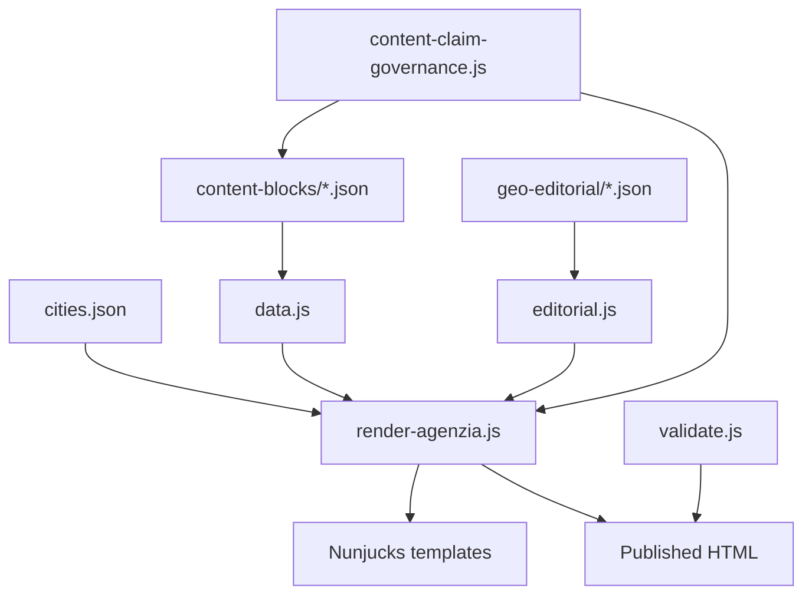
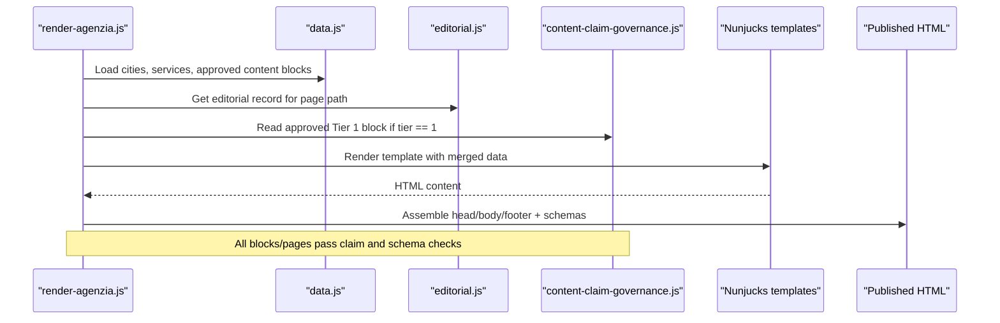
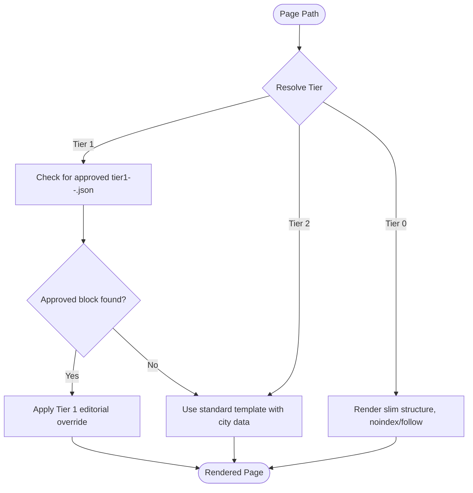
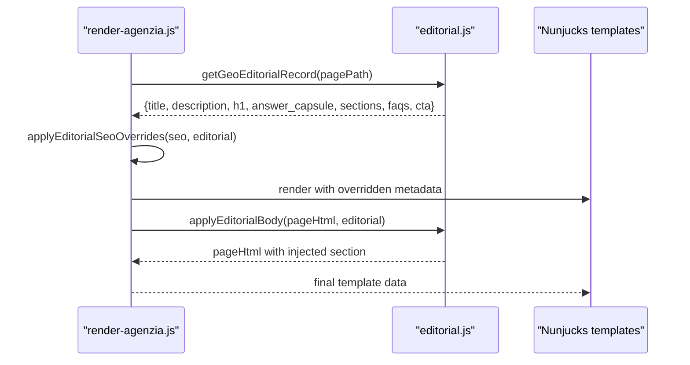
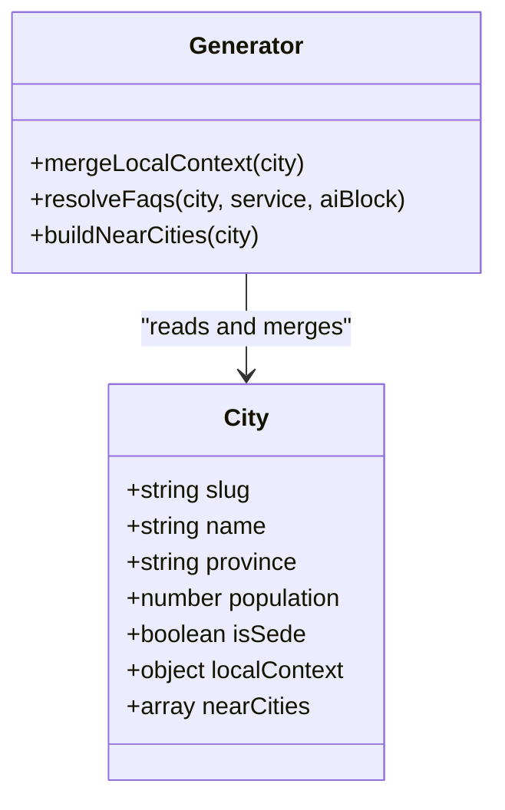
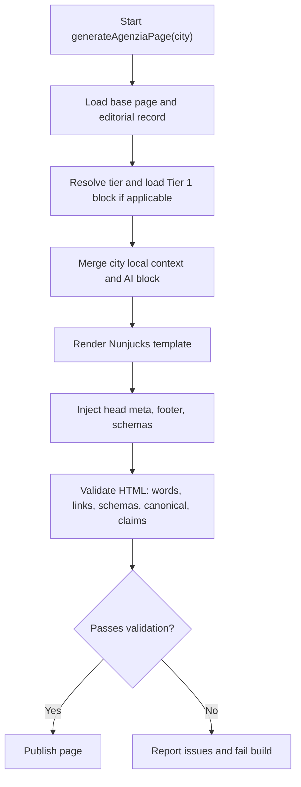
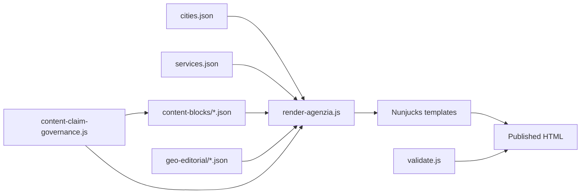

# Content Block System

<cite>
**Referenced Files in This Document**
- [data/content-blocks/tier1-legnano-agenzia-web.json](file://data/content-blocks/tier1-legnano-agenzia-web.json)
- [data/content-blocks/arese.json](file://data/content-blocks/arese.json)
- [data/cities.json](file://data/cities.json)
- [scripts/geo/render-agenzia.js](file://scripts/geo/render-agenzia.js)
- [scripts/geo/data.js](file://scripts/geo/data.js)
- [config/geo-editorial.js](file://config/geo-editorial.js)
- [scripts/geo/editorial.js](file://scripts/geo/editorial.js)
- [config/content-claim-governance.js](file://config/content-claim-governance.js)
- [scripts/geo/render-servizio.js](file://scripts/geo/render-servizio.js)
- [scripts/geo/validate.js](file://scripts/geo/validate.js)
</cite>

## Table of Contents
1. Introduction
2. Project Structure
3. Core Components
4. Architecture Overview
5. Detailed Component Analysis
6. Dependency Analysis
7. Performance Considerations
8. Troubleshooting Guide
9. Conclusion

## Introduction
This document explains the content block system that powers dynamic, geo-targeted page generation. It covers:
- The JSON-based content block architecture for AI-generated and hand-crafted editorial content
- Tier-based differentiation across pages (Tier 1, Tier 2, de-amplified)
- The editorial override system that injects city-specific copy and SEO metadata
- The structure of content blocks including headlines, body text, bullets, callouts, and media references
- Integration with city data, local context injection, and automated generation workflows
- Validation rules, governance, and best practices for creating high-quality localized content at scale

## Project Structure
The system is composed of:
- City and service data sources
- Approved content blocks (AI drafts and hand-crafted Tier 1 overrides)
- Geo page generators that assemble HTML from templates and data
- Editorial override loader and sanitizer
- Governance and validation layers that enforce quality and compliance

**Diagram sources**
- [data/cities.json:1-200](file://data/cities.json#L1-L200)
- [data/content-blocks/tier1-legnano-agenzia-web.json:1-33](file://data/content-blocks/tier1-legnano-agenzia-web.json#L1-L33)
- [scripts/geo/render-agenzia.js:1-194](file://scripts/geo/render-agenzia.js#L1-L194)
- [scripts/geo/data.js:1-197](file://scripts/geo/data.js#L1-L197)
- [config/geo-editorial.js:1-527](file://config/geo-editorial.js#L1-L527)
- [scripts/geo/editorial.js:1-64](file://scripts/geo/editorial.js#L1-L64)
- [config/content-claim-governance.js:1-240](file://config/content-claim-governance.js#L1-L240)
- [scripts/geo/validate.js:1-55](file://scripts/geo/validate.js#L1-L55)

**Section sources**
- [data/cities.json:1-200](file://data/cities.json#L1-L200)
- [scripts/geo/render-agenzia.js:1-194](file://scripts/geo/render-agenzia.js#L1-L194)
- [scripts/geo/data.js:1-197](file://scripts/geo/data.js#L1-L197)
- [config/geo-editorial.js:1-527](file://config/geo-editorial.js#L1-L527)
- [scripts/geo/editorial.js:1-64](file://scripts/geo/editorial.js#L1-L64)
- [config/content-claim-governance.js:1-240](file://config/content-claim-governance.js#L1-L240)
- [scripts/geo/validate.js:1-55](file://scripts/geo/validate.js#L1-L55)

## Core Components
- City and service dataset: central source of location metadata, local context, FAQs, and coverage flags used by generators.
- Approved content blocks: JSON files under data/content-blocks that are gated by provenance and claim rules before use.
- Tier 1 editorial overrides: hand-crafted per-city/service blocks that replace or enrich template sections when a page qualifies as Tier 1.
- Editorial loader and sanitizer: loads per-page editorial records and safely injects them into SEO metadata and body sections.
- Page generator: composes Nunjucks templates with city data, approved content blocks, and editorial overrides to produce final HTML.
- Governance and validation: enforces schema, uniqueness, claim policy, and output quality checks on both inputs and outputs.

**Section sources**
- [data/cities.json:1-200](file://data/cities.json#L1-L200)
- [config/content-claim-governance.js:1-240](file://config/content-claim-governance.js#L1-L240)
- [config/geo-editorial.js:1-527](file://config/geo-editorial.js#L1-L527)
- [scripts/geo/render-agenzia.js:1-194](file://scripts/geo/render-agenzia.js#L1-L194)
- [scripts/geo/validate.js:1-55](file://scripts/geo/validate.js#L1-L55)

## Architecture Overview
The generation pipeline integrates multiple data sources and governance gates to produce localized pages.

**Diagram sources**
- [scripts/geo/render-agenzia.js:1-194](file://scripts/geo/render-agenzia.js#L1-L194)
- [scripts/geo/data.js:1-197](file://scripts/geo/data.js#L1-L197)
- [scripts/geo/editorial.js:1-64](file://scripts/geo/editorial.js#L1-L64)
- [config/content-claim-governance.js:1-240](file://config/content-claim-governance.js#L1-L240)

## Detailed Component Analysis

### JSON-Based Content Block Architecture
There are two complementary content block families:

- AI-generated blocks (non-Tier 1):
  - Stored as city-named JSON files under data/content-blocks
  - Must include an approved _meta with publication status, sources, verification date, and approver
  - Are loaded via an approved-content loader and filtered by claim rules before use
  - Provide fields such as local market analysis, competitive context, and FAQs tailored per city

- Hand-crafted Tier 1 editorial overrides:
  - Stored as tier1-<city>-<service>.json files under data/content-blocks
  - Include structured fields like headline, body paragraphs, bullets, callout, and editorial todos
  - Are only applied when the target page resolves to Tier 1 indexable paths
  - Are read through an approval gate that validates provenance and rejects unsupported claims

Validation and governance ensure:
- Only blocks with approved provenance are published
- Unsupported claims (guarantees, rankings, fixed delivery times, performance scores) are blocked
- Prices and offers must align with the canonical service catalogue

**Section sources**
- [data/content-blocks/arese.json:1-66](file://data/content-blocks/arese.json#L1-L66)
- [data/content-blocks/tier1-legnano-agenzia-web.json:1-33](file://data/content-blocks/tier1-legnano-agenzia-web.json#L1-L33)
- [config/content-claim-governance.js:1-240](file://config/content-claim-governance.js#L1-L240)
- [scripts/geo/data.js:1-197](file://scripts/geo/data.js#L1-L197)

### Tier-Based Content Differentiation
Pages are classified into tiers that determine how much unique content and features they receive:
- Tier 1: Unique, hand-crafted editorial overrides are applied; full feature set and emphasis on uniqueness
- Tier 2: Standard template with full internal linking and baseline personalization
- De-amplified (tier 0): Reduced footprint to minimize doorway-like duplication

The generator determines the tier from the page path and applies Tier 1 overrides only when present and approved.

**Diagram sources**
- [scripts/geo/render-agenzia.js:64-77](file://scripts/geo/render-agenzia.js#L64-L77)
- [scripts/geo/render-servizio.js:143-155](file://scripts/geo/render-servizio.js#L143-L155)
- [config/content-claim-governance.js:85-107](file://config/content-claim-governance.js#L85-L107)

**Section sources**
- [scripts/geo/render-agenzia.js:64-77](file://scripts/geo/render-agenzia.js#L64-L77)
- [scripts/geo/render-servizio.js:143-155](file://scripts/geo/render-servizio.js#L143-L155)
- [config/content-claim-governance.js:85-107](file://config/content-claim-governance.js#L85-L107)

### Editorial Override System
Editorial overrides provide per-page control over SEO metadata and body sections:
- Per-page editorial records are loaded by path and can override title, description, hero H1, and capsule text
- Body replacement injects a hand-written section with heading, intro, subsections, and optional CTA
- HTML is sanitized before insertion to prevent markup injection

**Diagram sources**
- [scripts/geo/render-agenzia.js:42-44](file://scripts/geo/render-agenzia.js#L42-L44)
- [scripts/geo/editorial.js:14-56](file://scripts/geo/editorial.js#L14-L56)

**Section sources**
- [scripts/geo/editorial.js:1-64](file://scripts/geo/editorial.js#L1-L64)
- [config/geo-editorial.js:18-30](file://config/geo-editorial.js#L18-L30)
- [config/geo-editorial.js:314-399](file://config/geo-editorial.js#L314-L399)
- [config/geo-editorial.js:461-505](file://config/geo-editorial.js#L461-L505)

### Local Context Injection and City Data Integration
City data drives personalization:
- Each city includes metadata such as name, slug, province, coordinates, distance to headquarters, and whether it is the headquarters
- Local context fields provide highlights, economic fabric, key sectors, and digital opportunity summaries
- Generators merge this context into template variables for headings, intros, cards, and FAQ resolution
- Nearby cities and blog links are computed to strengthen internal linking and relevance

**Diagram sources**
- [data/cities.json:1-200](file://data/cities.json#L1-L200)
- [scripts/geo/render-agenzia.js:94-144](file://scripts/geo/render-agenzia.js#L94-L144)
- [scripts/geo/data.js:66-89](file://scripts/geo/data.js#L66-L89)

**Section sources**
- [data/cities.json:1-200](file://data/cities.json#L1-L200)
- [scripts/geo/render-agenzia.js:94-144](file://scripts/geo/render-agenzia.js#L94-L144)
- [scripts/geo/data.js:66-89](file://scripts/geo/data.js#L66-L89)

### Automated Content Generation Workflow
End-to-end flow for generating a geo page:
1. Resolve page path and tier
2. Load city data and approved content blocks
3. Load editorial overrides for SEO and body
4. Merge AI-generated insights with local context where available
5. Render Nunjucks template with enriched data
6. Inject JSON-LD schemas and finalize HTML
7. Validate output against word count, links, schema presence, canonical tags, and claim rules

**Diagram sources**
- [scripts/geo/render-agenzia.js:34-188](file://scripts/geo/render-agenzia.js#L34-L188)
- [scripts/geo/validate.js:7-49](file://scripts/geo/validate.js#L7-L49)
- [config/content-claim-governance.js:158-186](file://config/content-claim-governance.js#L158-L186)

**Section sources**
- [scripts/geo/render-agenzia.js:34-188](file://scripts/geo/render-agenzia.js#L34-L188)
- [scripts/geo/validate.js:7-49](file://scripts/geo/validate.js#L7-L49)
- [config/content-claim-governance.js:158-186](file://config/content-claim-governance.js#L158-L186)

### Content Block Schemas and Validation Rules
- AI-generated blocks:
  - Require an approved _meta with publication status, HTTPS sources, verifiedAt date, and approvedBy author
  - Are scanned for unsupported generated claims and rejected if any are found
  - Are loaded via an approved loader that excludes unapproved drafts

- Tier 1 editorial overrides:
  - Structured fields include headline, body paragraphs, bullets, callout, and editorial todos
  - Are read through an approval gate that enforces provenance and claim rules
  - Are only applied when the page resolves to Tier 1

- Editorial corpus:
  - Enforces strict field sets, length constraints, and uniqueness across critical fields
  - Validates paths, tiers, and location statements to avoid misleading office claims
  - Cross-checks prices against the service catalogue and disallows unsupported ratings or performance claims

- Published HTML validation:
  - Checks minimum word counts, internal link targets, JSON-LD schema presence, canonical tag, and H1 presence
  - Scans for unsupported published claims and reports violations

**Section sources**
- [config/content-claim-governance.js:74-107](file://config/content-claim-governance.js#L74-L107)
- [config/content-claim-governance.js:127-186](file://config/content-claim-governance.js#L127-L186)
- [config/geo-editorial.js:18-30](file://config/geo-editorial.js#L18-L30)
- [config/geo-editorial.js:314-399](file://config/geo-editorial.js#L314-L399)
- [scripts/geo/validate.js:7-49](file://scripts/geo/validate.js#L7-L49)

### Best Practices for High-Quality Localized Content
- Always provide approved provenance for content blocks: include publicationStatus, HTTPS sources, verifiedAt, and approvedBy
- Keep Tier 1 blocks concise, factual, and locally relevant; avoid guarantees, rankings, and fixed delivery promises
- Align all prices and offers with the canonical service catalogue; do not invent pricing outside approved values
- Use city local context to ground copy in real economic and cultural details; reference nearby cities and sector strengths
- Ensure every page has strong internal links, canonical tags, H1, and sufficient word count to meet quality thresholds
- Prefer hand-crafted Tier 1 overrides for priority pages to maximize uniqueness and editorial control

[No sources needed since this section provides general guidance]

### Managing Content Blocks at Scale and Editorial Standards
- Centralize governance: rely on manifest-driven editorial corpus and tier lists to keep pages indexable and compliant
- Enforce provenance gates: require human verification and approval before any content block becomes publishable
- Automate validation: run claim detection, schema checks, and output audits during builds to fail fast on issues
- Maintain clear separation: AI drafts remain non-publishable until approved; Tier 1 overrides are curated and versioned
- Track changes: use manifest hashes and record IDs to audit edits and ensure reproducibility across deployments

**Section sources**
- [config/geo-editorial.js:215-312](file://config/geo-editorial.js#L215-L312)
- [config/content-claim-governance.js:74-107](file://config/content-claim-governance.js#L74-L107)
- [scripts/geo/validate.js:7-49](file://scripts/geo/validate.js#L7-L49)

## Dependency Analysis
The system’s dependencies form a layered pipeline:
- Data layer: cities.json, services.json, approved content blocks, editorial corpus
- Processing layer: generators, editorial loader, claim governance, validation
- Rendering layer: Nunjucks templates producing final HTML
- Output layer: validated HTML with schemas and metadata

**Diagram sources**
- [data/cities.json:1-200](file://data/cities.json#L1-L200)
- [scripts/geo/render-agenzia.js:1-194](file://scripts/geo/render-agenzia.js#L1-L194)
- [config/content-claim-governance.js:1-240](file://config/content-claim-governance.js#L1-L240)
- [scripts/geo/validate.js:1-55](file://scripts/geo/validate.js#L1-L55)

**Section sources**
- [scripts/geo/render-agenzia.js:1-194](file://scripts/geo/render-agenzia.js#L1-L194)
- [config/content-claim-governance.js:1-240](file://config/content-claim-governance.js#L1-L240)
- [scripts/geo/validate.js:1-55](file://scripts/geo/validate.js#L1-L55)

## Performance Considerations
- Reuse cached editorial corpus and manifests to avoid repeated file reads
- Limit Tier 1 block loading to pages that qualify as Tier 1
- Keep content blocks concise to reduce template rendering overhead
- Avoid heavy DOM manipulation in templates; prefer server-side composition
- Run validations early in the build to catch issues before deployment

[No sources needed since this section provides general guidance]

## Troubleshooting Guide
Common issues and resolutions:
- Unapproved content blocks are suppressed: ensure _meta includes publicationStatus, HTTPS sources, verifiedAt, and approvedBy
- Unsupported claims detected: remove guarantees, ranking promises, fixed delivery timelines, and performance scores
- Missing canonical or H1: add canonical tag and ensure exactly one H1 per page
- Low word count or insufficient internal links: expand content and add relevant internal links to reach targets
- Schema count too low: include required JSON-LD schemas for organization, service, and FAQs
- Editorial overrides not applied: verify the page path matches an indexed path and that the editorial record exists

**Section sources**
- [config/content-claim-governance.js:74-107](file://config/content-claim-governance.js#L74-L107)
- [config/content-claim-governance.js:158-186](file://config/content-claim-governance.js#L158-L186)
- [scripts/geo/validate.js:7-49](file://scripts/geo/validate.js#L7-L49)
- [scripts/geo/editorial.js:14-56](file://scripts/geo/editorial.js#L14-L56)

## Conclusion
The content block system combines robust data sources, strict governance, and flexible editorial overrides to generate high-quality, localized pages at scale. By enforcing provenance, claim policies, and validation rules, the system ensures consistency, compliance, and relevance across hundreds of geo-targeted pages while allowing targeted, hand-crafted enhancements for priority locations and services.

[No sources needed since this section summarizes without analyzing specific files]