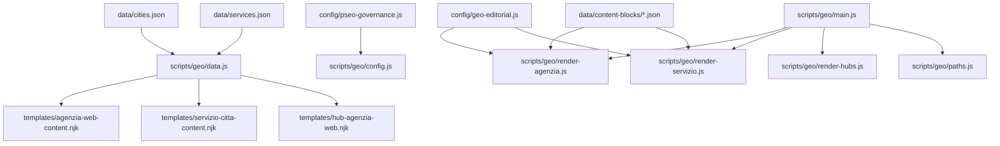
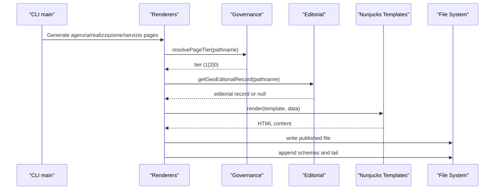
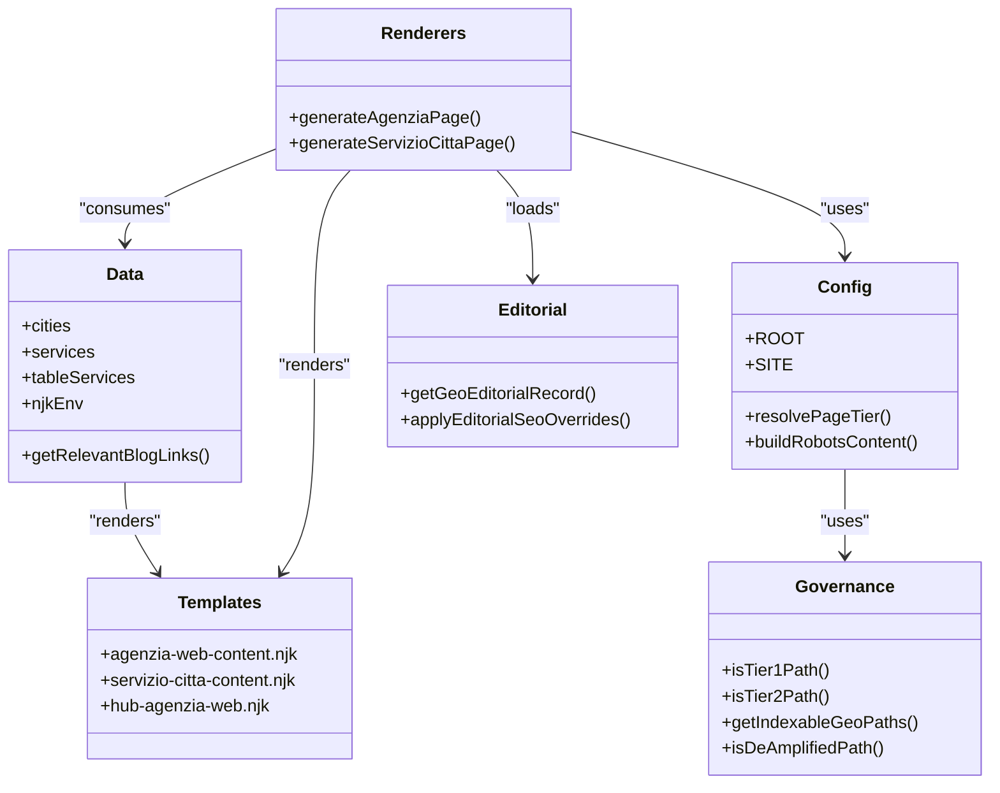

# Geo-Targeted Page Templates

<cite>
**Referenced Files in This Document**
- [cities.json](file://data/cities.json)
- [services.json](file://data/services.json)
- [geo-editorial.js](file://config/geo-editorial.js)
- [pseo-governance.js](file://config/pseo-governance.js)
- [main.js](file://scripts/geo/main.js)
- [render-agenzia.js](file://scripts/geo/render-agenzia.js)
- [render-servizio.js](file://scripts/geo/render-servizio.js)
- [config.js](file://scripts/geo/config.js)
- [data.js](file://scripts/geo/data.js)
- [hub-agenzia-web.njk](file://templates/hub-agenzia-web.njk)
- [servizio-citta-content.njk](file://templates/servizio-citta-content.njk)
- [agenzia-web-content.njk](file://templates/agenzia-web-content.njk)
- [tier1-rho-agenzia-web.json](file://data/content-blocks/tier1-rho-agenzia-web.json)
</cite>

## Table of Contents
1. [Introduction](#introduction)
2. [Project Structure](#project-structure)
3. [Core Components](#core-components)
4. [Architecture Overview](#architecture-overview)
5. [Detailed Component Analysis](#detailed-component-analysis)
6. [Dependency Analysis](#dependency-analysis)
7. [Performance Considerations](#performance-considerations)
8. [Troubleshooting Guide](#troubleshooting-guide)
9. [Conclusion](#conclusion)
10. [Appendices](#appendices)

## Introduction
This document explains the geo-targeted page template system used to generate location-specific pages for WebNovis services. It covers how localized agency pages, service pages, and city-specific content are created with dynamic data binding, the tier system (Tier 1, Tier 2, Data-validated), editorial blocks, SEO optimization features, and integration with city.json data and local context variables. It also provides guidance on creating custom geo-templates, implementing responsive design patterns, and optimizing templates for search engine visibility.

## Project Structure
The geo-targeting pipeline is composed of:
- Centralized city and service catalogs
- Governance and tier classification
- Editorial corpus validation
- Template rendering engines for different page types
- CLI orchestration and output management

**Diagram sources**
- [cities.json](file://data/cities.json)
- [services.json](file://data/services.json)
- [pseo-governance.js](file://config/pseo-governance.js)
- [geo-editorial.js](file://config/geo-editorial.js)
- [data.js](file://scripts/geo/data.js)
- [config.js](file://scripts/geo/config.js)
- [main.js](file://scripts/geo/main.js)
- [render-agenzia.js](file://scripts/geo/render-agenzia.js)
- [render-servizio.js](file://scripts/geo/render-servizio.js)
- [agenzia-web-content.njk](file://templates/agenzia-web-content.njk)
- [servizio-citta-content.njk](file://templates/servizio-citta-content.njk)
- [hub-agenzia-web.njk](file://templates/hub-agenzia-web.njk)

**Section sources**
- [main.js](file://scripts/geo/main.js)
- [data.js](file://scripts/geo/data.js)
- [config.js](file://scripts/geo/config.js)
- [pseo-governance.js](file://config/pseo-governance.js)
- [geo-editorial.js](file://config/geo-editorial.js)

## Core Components
- City catalog: centralizes geographic metadata, local context, images, and FAQs per city.
- Service catalog: defines service slugs, pricing, time estimates, target keywords, and whether a canonical page exists.
- Governance: allowlist-based indexation control defining Tier 1, Tier 2, and Data-validated paths; de-amplification rules.
- Editorial corpus: validated JSON records for each path with strict schema, price checks, and claim governance.
- Renderers: Nunjucks-based generators for agency pages, service×city pages, and hub pages.
- CLI orchestrator: drives generation, validation, linking graph creation, and date persistence.

Key responsibilities:
- Dynamic data binding from cities.json and services.json into Nunjucks templates.
- Tier-driven structural differentiation (content sections, link density, comparison tables).
- SEO metadata injection, robots directives, canonical URLs, and structured data schemas.
- Local economic context and FAQ injection tailored per city and service cluster.

**Section sources**
- [cities.json](file://data/cities.json)
- [services.json](file://data/services.json)
- [pseo-governance.js](file://config/pseo-governance.js)
- [geo-editorial.js](file://config/geo-editorial.js)
- [render-agenzia.js](file://scripts/geo/render-agenzia.js)
- [render-servizio.js](file://scripts/geo/render-servizio.js)
- [main.js](file://scripts/geo/main.js)

## Architecture Overview
The system follows a generator-template-render pattern:
- The CLI main orchestrates page generation by type (agenzia, realizzazione, servizio×città, hubs).
- Each renderer loads base HTML, computes template data (city, service, editorial, AI content, tiers), renders Nunjucks templates, injects head/meta, appends footer and schemas, then writes final HTML.
- Governance determines indexability and robots directives; editorial validates content integrity and enforces constraints.

**Diagram sources**
- [main.js](file://scripts/geo/main.js)
- [render-agenzia.js](file://scripts/geo/render-agenzia.js)
- [render-servizio.js](file://scripts/geo/render-servizio.js)
- [pseo-governance.js](file://config/pseo-governance.js)
- [geo-editorial.js](file://config/geo-editorial.js)

## Detailed Component Analysis

### City and Service Data Model
- cities.json contains per-city metadata: slug, name, coordinates, population, province, distance to headquarters, nearCities, localContext (highlights, tessutoEconomico, settoriChiave, opportunitaDigitale), images, and FAQs grouped by service cluster.
- services.json defines service slugs, names, shortNames, schemaType, URL, hasPage flag, tier (core/extended), pricing, timeEstimate, description, idealFor, and flags controlling geo generation.

Data usage:
- Templates bind city fields (e.g., h1, heroCapsule, section1Intro, cards1, section3Text) and service fields (priceFrom, timeEstimate, idealFor, shortName).
- Local context enriches market analysis and sector targeting.
- FAQs are injected per service cluster and city.

Complexity considerations:
- City map and service lookup maps enable O(1) retrieval during rendering.
- Filtering core vs extended services controls table rendering and internal links.

**Section sources**
- [cities.json](file://data/cities.json)
- [services.json](file://data/services.json)
- [data.js](file://scripts/geo/data.js)

### Tier System and Indexation Control
- pseo-governance.js defines explicit allowlists for Tier 1, Tier 2, and Data-validated paths. Non-indexable GEO paths receive noindex,follow and are excluded from sitemap.
- resolvePageTier returns 1, 2, or 0 based on path membership.
- De-amplification reduces doorway footprint while preserving useful long-tail pages.

Implications:
- Tier 1 pages include extra editorial block (hand-crafted content) and full feature set.
- Tier 2 pages use standard template with full internal linking.
- Tier 0 pages are de-amplified: omit comparison tables and reduce link density to avoid doorway patterns.

**Section sources**
- [pseo-governance.js](file://config/pseo-governance.js)
- [config.js](file://scripts/geo/config.js)

### Editorial Corpus Validation
- geo-editorial.js loads manifest.json and per-cluster JSON files, validates structure, ensures SHA-256 integrity, and enforces field constraints.
- Price claims must match catalogue prices; unsupported performance ratings are blocked.
- Location status enforcement ensures Rho is declared as headquarters where applicable and other cities are marked as area served.

Validation outcomes:
- Enriched records include record_id, tier, and location_status.
- Duplicate values and mismatched paths are rejected.

**Section sources**
- [geo-editorial.js](file://config/geo-editorial.js)

### Agenzia Page Generator
- Generates /agenzia-web-{city}.html using a base source and Nunjucks template.
- Computes nearest cities, related pages, blog links, and resolves editorial overrides.
- Injects head meta, canonical, robots directives, and generates JSON-LD schemas.
- Supports Tier 1 hand-crafted content via tier1-<city>-agenzia-web.json.

Template variables:
- city (with computed fields like breadcrumbLabel, h1, heroCapsule, section1Intro, cards1, section3Title, section3Text, ctaTitle)
- services (tableServices)
- faqs (resolved from editorial or fallback pools)
- nearCitiesData, relatedPages, blogLinks
- tier, isIndexable, tier1Content, editorial, today, todayFormatted, site

**Section sources**
- [render-agenzia.js](file://scripts/geo/render-agenzia.js)
- [agenzia-web-content.njk](file://templates/agenzia-web-content.njk)

### Servizio×Città Page Generator
- Generates /{service.slug}-{city.slug}.html combining service and city contexts.
- Determines tier, builds related city/service pages, selects FAQ pool by service cluster, and optionally injects AI-enriched content.
- Renders Nunjucks template with rich sections: hero, service description, why WebNovis, process, local market context, Tier 1 editorial block, competitive insight, decision framework, deliverables, intent queries, comparison table, FAQ, related pages, CTA.

Template variables:
- city, service, seo, faqs, aiContent, competitiveInsight, dataPoints
- relatedCityPages, relatedServicePages, allCoreServices
- tier, isIndexable, tier1Content, editorial, today, todayFormatted, site

Structural differentiation:
- Tier 0 omits comparison table and reduces nearby city links.
- Tier 1 includes optional hand-crafted editorial block before comparison table.

**Section sources**
- [render-servizio.js](file://scripts/geo/render-servizio.js)
- [servizio-citta-content.njk](file://templates/servizio-citta-content.njk)

### Hub Page Template
- Provides an overview of agency web services across multiple municipalities.
- Displays a grid of cities with avatars, distances, and population metadata.
- Includes a services table sourced from core services and a CTA section.

Template variables:
- cities (with avatarSrc and UI metadata)
- site, today, todayFormatted, totalCities, networkCoverageCount
- coreServices

**Section sources**
- [hub-agenzia-web.njk](file://templates/hub-agenzia-web.njk)
- [data.js](file://scripts/geo/data.js)

### CLI Orchestration
- main.js drives generation for agenzia, realizzazione, servizio×città, and hubs.
- Applies filters for targeted cities and services, validates outputs, writes files, and persists page dates.
- Produces a link graph report and summarizes results including warnings and failures.

**Section sources**
- [main.js](file://scripts/geo/main.js)

## Dependency Analysis
The geo-generation pipeline depends on:
- data/cities.json and data/services.json for content and metadata
- config/pseo-governance.js for indexation rules and tier resolution
- config/geo-editorial.js for editorial validation and enrichment
- scripts/geo/* modules for rendering and configuration
- Nunjucks templates for HTML structure and dynamic binding
- Optional AI content blocks in data/content-blocks for enriched sections

**Diagram sources**
- [config.js](file://scripts/geo/config.js)
- [data.js](file://scripts/geo/data.js)
- [pseo-governance.js](file://config/pseo-governance.js)
- [geo-editorial.js](file://config/geo-editorial.js)
- [render-agenzia.js](file://scripts/geo/render-agenzia.js)
- [render-servizio.js](file://scripts/geo/render-servizio.js)
- [agenzia-web-content.njk](file://templates/agenzia-web-content.njk)
- [servizio-citta-content.njk](file://templates/servizio-citta-content.njk)
- [hub-agenzia-web.njk](file://templates/hub-agenzia-web.njk)

**Section sources**
- [config.js](file://scripts/geo/config.js)
- [data.js](file://scripts/geo/data.js)
- [pseo-governance.js](file://config/pseo-governance.js)
- [geo-editorial.js](file://config/geo-editorial.js)
- [render-agenzia.js](file://scripts/geo/render-agenzia.js)
- [render-servizio.js](file://scripts/geo/render-servizio.js)

## Performance Considerations
- Avoid heavy DOM manipulation in templates; rely on static HTML and minimal JS.
- Use lazy loading for images and async decoding to improve LCP and CLS.
- Keep template logic simple; offload complex computations to Node renderers.
- Ensure CSS is modular and scoped to avoid reflow issues on mobile devices.
- Validate that generated pages pass Core Web Vitals thresholds for representative layouts and devices.

[No sources needed since this section provides general guidance]

## Troubleshooting Guide
Common issues and resolutions:
- Missing base page: ensure the base source HTML exists and is readable by renderers.
- Tier misclassification: verify path membership in governance allowlists and correct slug formatting.
- Editorial validation failures: check JSON schema, price consistency with catalogue, and claim restrictions.
- Template variable errors: confirm required variables are passed from renderers and exist in data models.
- Robots directives: ensure noindex,follow is applied to de-amplified paths and index,follow to allowed ones.

**Section sources**
- [geo-editorial.js](file://config/geo-editorial.js)
- [pseo-governance.js](file://config/pseo-governance.js)
- [render-agenzia.js](file://scripts/geo/render-agenzia.js)
- [render-servizio.js](file://scripts/geo/render-servizio.js)

## Conclusion
The geo-targeted page template system enables scalable, data-driven generation of localized agency and service pages across multiple cities. With robust governance, editorial validation, and tier-based differentiation, it balances SEO effectiveness with content quality and compliance. By leveraging city and service catalogs, editorial blocks, and Nunjucks templates, the system produces optimized, indexable pages that reflect local context and service offerings.

[No sources needed since this section summarizes without analyzing specific files]

## Appendices

### Template Syntax Examples
- Service grids: iterate over services array to render cards with shortName, description, and priceDisplay.
- Pricing tables: loop through allCoreServices to display service name, priceFrom, and timeEstimate.
- FAQ sections: render faqs array with question and answer fields, supporting safe HTML in answers.
- Local economic context: inject city.localContext.tessutoEconomico and opportunitaDigitale for unique-by-city insights.

Example references:
- Service grid iteration in agency template: [agenzia-web-content.njk](file://templates/agenzia-web-content.njk)
- Comparison table in service×city template: [servizio-citta-content.njk](file://templates/servizio-citta-content.njk)
- FAQ rendering in both templates: [agenzia-web-content.njk](file://templates/agenzia-web-content.njk), [servizio-citta-content.njk](file://templates/servizio-citta-content.njk)

**Section sources**
- [agenzia-web-content.njk](file://templates/agenzia-web-content.njk)
- [servizio-citta-content.njk](file://templates/servizio-citta-content.njk)

### Creating Custom Geo-Templates
Steps:
- Define new template under templates/ directory with Nunjucks syntax.
- Extend existing template structure for consistency (hero, sections, comparison table, FAQ, CTA).
- Pass required variables from renderers (city, service, seo, faqs, tier, etc.).
- Integrate with governance and editorial systems for validation and enrichment.

Guidelines:
- Maintain responsive design patterns (mobile-first CSS, flexible grids).
- Optimize for SEO: semantic headings, meta tags, canonical URLs, structured data.
- Avoid doorway patterns: limit excessive internal links on de-amplified pages.

[No sources needed since this section provides general guidance]

### Optimizing Templates for Search Engine Visibility
Best practices:
- Use descriptive titles and descriptions aligned with target keywords.
- Include location-specific content and entity mentions (city name, province, landmarks).
- Implement FAQPage schema for question-based headings and rich snippets.
- Ensure canonical URLs and robots directives are correctly set per tier.
- Validate against performance metrics and accessibility standards.

**Section sources**
- [pseo-governance.js](file://config/pseo-governance.js)
- [render-servizio.js](file://scripts/geo/render-servizio.js)

### Tier 1 Editorial Block Example
- Hand-crafted content for high-value pages enhances uniqueness and authority signals.
- Structure includes headline, body paragraphs, bullet points, and callout sections.
- Loaded conditionally when tier equals 1 and file exists.

Reference:
- [tier1-rho-agenzia-web.json](file://data/content-blocks/tier1-rho-agenzia-web.json)

**Section sources**
- [tier1-rho-agenzia-web.json](file://data/content-blocks/tier1-rho-agenzia-web.json)