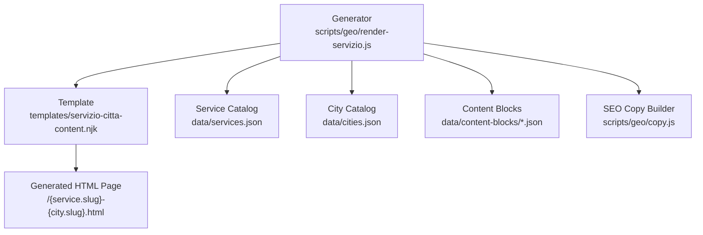
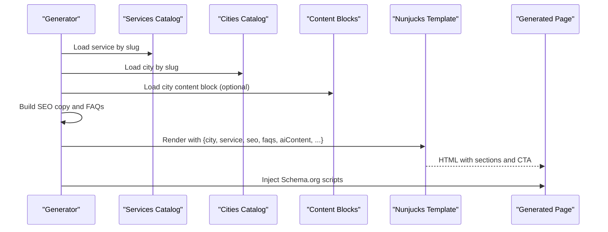
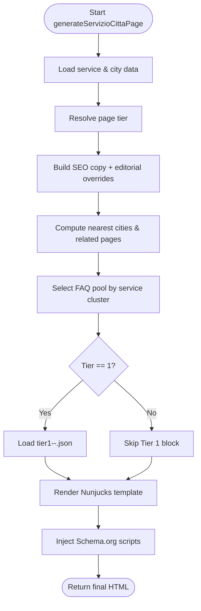
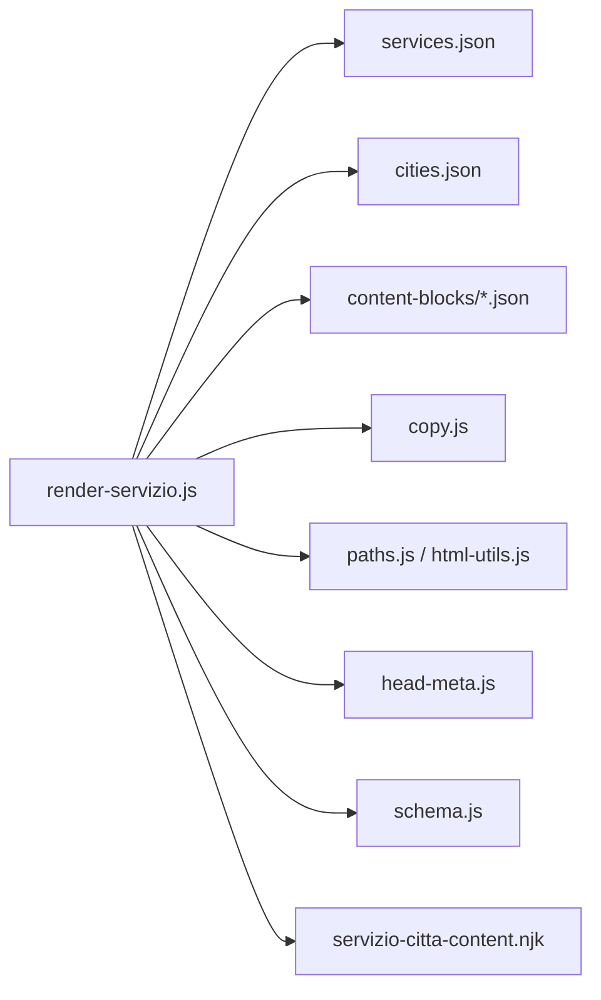

# Service City Content Templates

<cite>
**Referenced Files in This Document**
- [servizio-citta-content.njk](file://templates/servizio-citta-content.njk)
- [render-servizio.js](file://scripts/geo/render-servizio.js)
- [services.json](file://data/services.json)
- [cities.json](file://data/cities.json)
- [tier1-rho-seo-locale.json](file://data/content-blocks/tier1-rho-seo-locale.json)
- [copy.js](file://scripts/geo/copy.js)
</cite>

## Table of Contents
1. [Introduction](#introduction)
2. [Project Structure](#project-structure)
3. [Core Components](#core-components)
4. [Architecture Overview](#architecture-overview)
5. [Detailed Component Analysis](#detailed-component-analysis)
6. [Dependency Analysis](#dependency-analysis)
7. [Performance Considerations](#performance-considerations)
8. [Troubleshooting Guide](#troubleshooting-guide)
9. [Conclusion](#conclusion)
10. [Appendices](#appendices)

## Introduction
This document explains how service city content templates generate specialized, SEO-optimized pages for individual services across different cities. It covers template structure, dynamic data binding from the service catalog and city data, local market context injection, conditional rendering by page tier, and conversion-focused call-to-action sections. It also provides guidance on extending templates for new services, customizing city-specific content, and maintaining consistency across generated pages.

## Project Structure
The system generates one page per service×city combination using a Nunjucks template and a Node-based generator. The key pieces are:
- Template: renders the page layout and binds variables for service, city, SEO metadata, FAQs, AI-enriched content, and related links.
- Generator: builds page data, resolves tiers, selects FAQs, loads optional Tier 1 editorial blocks, and injects structured data.
- Data sources: centralized catalogs for services and cities, plus per-city content blocks and optional hand-crafted Tier 1 overrides.

**Diagram sources**
- [render-servizio.js:36-192](file://scripts/geo/render-servizio.js#L36-L192)
- [servizio-citta-content.njk:1-374](file://templates/servizio-citta-content.njk#L1-L374)
- [services.json:1-307](file://data/services.json#L1-L307)
- [cities.json:1-800](file://data/cities.json#L1-L800)
- [copy.js:1-27](file://scripts/geo/copy.js#L1-L27)

**Section sources**
- [render-servizio.js:36-192](file://scripts/geo/render-servizio.js#L36-L192)
- [servizio-citta-content.njk:1-374](file://templates/servizio-citta-content.njk#L1-L374)
- [services.json:1-307](file://data/services.json#L1-L307)
- [cities.json:1-800](file://data/cities.json#L1-L800)
- [copy.js:1-27](file://scripts/geo/copy.js#L1-L27)

## Core Components
- Template (Nunjucks): Defines the page skeleton with hero, service description, why WebNovis section, process steps, local market context, optional Tier 1 editorial block, competitive insights, decision framework, deliverables, intent queries, comparison table, FAQ, related pages, and final CTA.
- Generator (Node): Assembles page data, computes nearest cities, selects FAQs based on service cluster, loads Tier 1 content when applicable, and injects Schema.org markup.
- Service Catalog: Provides service metadata including slug, name, shortName, pricing, time estimates, target keyword, ideal audience, and whether a primary service page exists.
- City Catalog: Provides city metadata including name, CAP, province, population, distance to headquarters, nearCities, localContext (highlights, economic fabric, digital opportunities), and FAQs.
- Content Blocks: Per-city JSON files that can provide AI-enriched content; optional Tier 1 JSON files add hand-crafted editorial sections for high-value pages.
- SEO Copy Builder: Produces localized SEO copy used in the template’s meta and headings.

**Section sources**
- [servizio-citta-content.njk:21-374](file://templates/servizio-citta-content.njk#L21-L374)
- [render-servizio.js:36-192](file://scripts/geo/render-servizio.js#L36-L192)
- [services.json:1-307](file://data/services.json#L1-L307)
- [cities.json:1-800](file://data/cities.json#L1-L800)
- [copy.js:1-27](file://scripts/geo/copy.js#L1-L27)

## Architecture Overview
The generator reads service and city data, applies editorial and SEO overrides, computes related pages, and prepares template variables. The template then renders the page with conditional sections based on tier and available data. Structured data is appended to the final HTML.

**Diagram sources**
- [render-servizio.js:36-192](file://scripts/geo/render-servizio.js#L36-L192)
- [servizio-citta-content.njk:21-374](file://templates/servizio-citta-content.njk#L21-L374)

## Detailed Component Analysis

### Template Structure and Sections
The template defines a consistent, conversion-focused layout:
- Hero with answer capsule, highlights, and primary CTA.
- Localized service description with price, timeline, and ideal audience cards.
- Why WebNovis section with reusable cards.
- Process steps tailored to the service.
- Local market context with optional AI-enriched content and city-specific highlights.
- Optional Tier 1 editorial block for high-value pages.
- Competitive insight and data points for unique content.
- Decision framework, deliverables, and intent queries sections.
- Comparison table of all core services for the city.
- FAQ section with question-based headings.
- Related pages: nearby cities and other services in the same city.
- Final CTA section.

Conditional rendering logic:
- Tier-based visibility: comparison table and “nearby cities” block appear only on indexable tiers.
- Nearby city link count adapts to tier (more links on indexable pages).
- Editorial block appears only if present and tier equals 1.
- Local context paragraphs render conditionally when city.localContext fields exist.

Responsive design patterns:
- Grid layouts for cards and tables use flexbox and overflow handling for mobile readability.
- Buttons and CTAs are styled consistently and include accessible labels.

**Section sources**
- [servizio-citta-content.njk:21-374](file://templates/servizio-citta-content.njk#L21-L374)

### Generator Data Binding and Processing Logic
Key responsibilities:
- Resolve page tier and indexability.
- Build canonical URL and robots directives.
- Load editorial record and apply SEO overrides.
- Compute nearest cities and filter approved indexable landings.
- Select FAQs based on service cluster (web build, marketing, strategy).
- Load optional Tier 1 content block for high-tier pages.
- Prepare template data including city, service, seo, faqs, aiContent, competitiveInsight, dataPoints, relatedCityPages, relatedServicePages, allCoreServices, agencyCityPageUrl, today tokens, and site info.
- Inject Schema.org markup for BreadcrumbList, WebPage, Service, and FAQPage.

**Diagram sources**
- [render-servizio.js:36-192](file://scripts/geo/render-servizio.js#L36-L192)
- [render-servizio.js:218-283](file://scripts/geo/render-servizio.js#L218-L283)

**Section sources**
- [render-servizio.js:36-192](file://scripts/geo/render-servizio.js#L36-L192)
- [render-servizio.js:218-283](file://scripts/geo/render-servizio.js#L218-L283)

### Service Catalog Integration
The service catalog drives dynamic binding:
- Price and unit: displayed in hero and cards; supports monthly units where applicable.
- Time estimate: shown in service detail cards and FAQs.
- Target keyword: used in meta keywords and SEO copy.
- Ideal audience: rendered in “Ideal for” card.
- Primary page URL and label: linked in service detail paragraph.
- Schema offer: includes price and currency for search engines.

Examples of variables bound from services.json:
- service.name, service.shortName, service.priceFrom, service.priceUnit, service.timeEstimate, service.targetKeyword, service.idealFor, service.url, service.hasPage.

**Section sources**
- [services.json:1-307](file://data/services.json#L1-L307)
- [servizio-citta-content.njk:72-95](file://templates/servizio-citta-content.njk#L72-L95)
- [render-servizio.js:218-283](file://scripts/geo/render-servizio.js#L218-L283)

### City-Specific Modifications and Local Context
City data enables localization:
- Distance to headquarters: influences messaging about proximity and in-person meetings.
- Population and province: included in contextual paragraphs.
- NearCities: used to generate related city links with distances.
- localContext.highlights: rendered as reference points in the local market section.
- localContext.tessutoEconomico and opportunitaDigitale: injected into local market context when AI content is absent.
- FAQs per city: available in city data for other page types; service×city pages use generator-built FAQs but can be overridden via editorial records.

Example variables bound from cities.json:
- city.name, city.cap, city.province, city.population, city.distanzaSede, city.distanzaSedeKm, city.nearCities, city.localContext.

**Section sources**
- [cities.json:1-800](file://data/cities.json#L1-L800)
- [servizio-citta-content.njk:57-151](file://templates/servizio-citta-content.njk#L57-L151)
- [render-servizio.js:48-66](file://scripts/geo/render-servizio.js#L48-L66)

### Content Block System and Tier 1 Overrides
Per-city content blocks provide AI-enriched content:
- localMarketAnalysis or competitiveContext selected based on service cluster.
- Unique data points rendered as metric cards when present.
- Competitive insight text inserted into the local market section.

Tier 1 editorial overrides:
- Hand-crafted JSON files under data/content-blocks named tier1-<city>-<service>.json.
- Include headline, body paragraphs, bullets, and callout.
- Only rendered when tier equals 1 and file exists.

Example override structure:
- headline, body[], bullets[], callout{title, text}, _meta fields.

**Section sources**
- [render-servizio.js:68-94](file://scripts/geo/render-servizio.js#L68-L94)
- [render-servizio.js:149-155](file://scripts/geo/render-servizio.js#L149-L155)
- [servizio-citta-content.njk:153-184](file://templates/servizio-citta-content.njk#L153-L184)
- [tier1-rho-seo-locale.json:1-33](file://data/content-blocks/tier1-rho-seo-locale.json#L1-L33)

### SEO-Optimized Layouts and Structured Data
SEO elements:
- Title, description, and OG metadata derived from SEO copy builder and applied to head.
- Canonical URL set per page.
- Robots directive built from page path and tier.
- Keywords include service target keyword and city name variants.

Structured data:
- BreadcrumbList with Home, service landing, and current page.
- WebPage with name, description, language, and dates.
- Service with areaServed, provider, offers, and optional hasOfferCatalog.
- FAQPage with questions and answers when FAQs exist.

**Section sources**
- [render-servizio.js:194-205](file://scripts/geo/render-servizio.js#L194-L205)
- [render-servizio.js:218-283](file://scripts/geo/render-servizio.js#L218-L283)

### Conversion-Focused Call-to-Action Sections
CTAs are placed strategically:
- Hero CTA: primary action to request a quote.
- Mid-page CTA: reinforces value proposition after local context.
- Final CTA: closes the page with a clear next step.

All CTAs link to the contact page and include accessible labels and icons.

**Section sources**
- [servizio-citta-content.njk:30-55](file://templates/servizio-citta-content.njk#L30-L55)
- [servizio-citta-content.njk:362-373](file://templates/servizio-citta-content.njk#L362-L373)

### Examples of Template Variables and Conditional Rendering
Variables commonly used:
- city.name, city.cap, city.province, city.population, city.distanzaSede, city.distanzaSedeKm
- service.name, service.shortName, service.priceFrom, service.priceUnit, service.timeEstimate, service.targetKeyword, service.idealFor, service.url, service.hasPage
- seo.heroH1, seo.heroCapsule, seo.sectionTitle, seo.whyTitle, seo.processTitle, seo.ctaTitle, seo.ctaCopy
- faqs array with q and a
- aiContent, competitiveInsight, dataPoints
- relatedCityPages, relatedServicePages, allCoreServices
- tier, isIndexable, tier1Content, editorial

Conditional logic examples:
- Show comparison table only when tier >= 1.
- Limit related service links to 3 on de-amplified pages vs 6 on indexable pages.
- Render Tier 1 editorial block only when tier == 1 and file exists.
- Insert local context paragraphs only when city.localContext fields are present.

**Section sources**
- [servizio-citta-content.njk:280-360](file://templates/servizio-citta-content.njk#L280-L360)
- [render-servizio.js:125-141](file://scripts/geo/render-servizio.js#L125-L141)
- [render-servizio.js:149-155](file://scripts/geo/render-servizio.js#L149-L155)

### Responsive Design Patterns
- Flexbox grids for cards and metrics ensure adaptability across screen sizes.
- Overflow handling for tables prevents horizontal scroll issues on small devices.
- Buttons and CTAs scale appropriately with spacing and typography.
- Media queries in CSS handle layout shifts for mobile and desktop contexts.

[No sources needed since this section provides general guidance]

## Dependency Analysis
The generator depends on multiple modules and data sources:
- Services and cities catalogs drive dynamic content.
- Content blocks provide AI-enriched and hand-crafted sections.
- SEO copy builder produces localized copy and metadata.
- Paths and utilities resolve base pages and URLs.
- Head meta updater injects derived metadata into the head block.
- Schema module constructs area served entities.

**Diagram sources**
- [render-servizio.js:1-35](file://scripts/geo/render-servizio.js#L1-L35)
- [render-servizio.js:36-192](file://scripts/geo/render-servizio.js#L36-L192)

**Section sources**
- [render-servizio.js:1-35](file://scripts/geo/render-servizio.js#L1-L35)
- [render-servizio.js:36-192](file://scripts/geo/render-servizio.js#L36-L192)

## Performance Considerations
- Avoid heavy inline styles; rely on CSS classes for responsive behavior.
- Use lazy loading for non-critical images and assets.
- Keep template logic minimal; prefer data preparation in the generator.
- Ensure schema scripts are lightweight and only include necessary fields.
- Limit number of related links on de-amplified pages to reduce doorway footprint.

[No sources needed since this section provides general guidance]

## Troubleshooting Guide
Common issues and resolutions:
- Missing Tier 1 content: verify file naming and existence under data/content-blocks; ensure tier equals 1.
- Empty FAQs: check generator FAQ pool selection and editorial overrides; confirm service cluster mapping.
- Incorrect city context: validate city slug and presence of localContext fields; ensure nearCities list contains valid slugs.
- SEO metadata not applied: confirm head meta update function receives correct title, description, and canonical.
- Schema errors: ensure required fields like areaServed and provider are present; validate FAQPage structure.

**Section sources**
- [render-servizio.js:149-155](file://scripts/geo/render-servizio.js#L149-L155)
- [render-servizio.js:125-141](file://scripts/geo/render-servizio.js#L125-L141)
- [render-servizio.js:194-205](file://scripts/geo/render-servizio.js#L194-L205)
- [render-servizio.js:218-283](file://scripts/geo/render-servizio.js#L218-L283)

## Conclusion
Service city content templates provide a scalable, data-driven approach to generating localized service pages. By combining a robust template with a flexible generator and rich data sources, the system delivers SEO-optimized, conversion-focused pages that adapt to city-specific contexts and service characteristics. Extending the system involves adding new services to the catalog, updating city data, creating content blocks, and optionally defining Tier 1 editorial overrides.

[No sources needed since this section summarizes without analyzing specific files]

## Appendices

### Extending Templates for New Services
Steps:
- Add service entry to services.json with slug, name, pricing, time estimate, target keyword, ideal audience, and primary page URL.
- Update service cluster sets in the generator if needed to select appropriate FAQ pools and AI content angles.
- Optionally create Tier 1 content block for high-value service×city combinations.
- Verify generated pages render correctly with updated variables and sections.

**Section sources**
- [services.json:1-307](file://data/services.json#L1-L307)
- [render-servizio.js:71-88](file://scripts/geo/render-servizio.js#L71-L88)
- [render-servizio.js:149-155](file://scripts/geo/render-servizio.js#L149-L155)

### Customizing City-Specific Content
Approach:
- Edit city entries in cities.json to update localContext, FAQs, and nearCities.
- Create or update per-city content blocks for AI-enriched sections.
- Use Tier 1 overrides for hand-crafted editorial content on priority pages.
- Validate that template sections render expected content based on available fields.

**Section sources**
- [cities.json:1-800](file://data/cities.json#L1-L800)
- [render-servizio.js:68-94](file://scripts/geo/render-servizio.js#L68-L94)
- [tier1-rho-seo-locale.json:1-33](file://data/content-blocks/tier1-rho-seo-locale.json#L1-L33)

### Maintaining Consistency Across Generated Pages
Guidelines:
- Keep service and city data structures consistent to avoid template errors.
- Use standardized variable names in templates and generator.
- Apply consistent CTA patterns and section ordering.
- Ensure SEO metadata follows the same format across pages.
- Regularly validate generated pages for structural integrity and accessibility.

[No sources needed since this section provides general guidance]