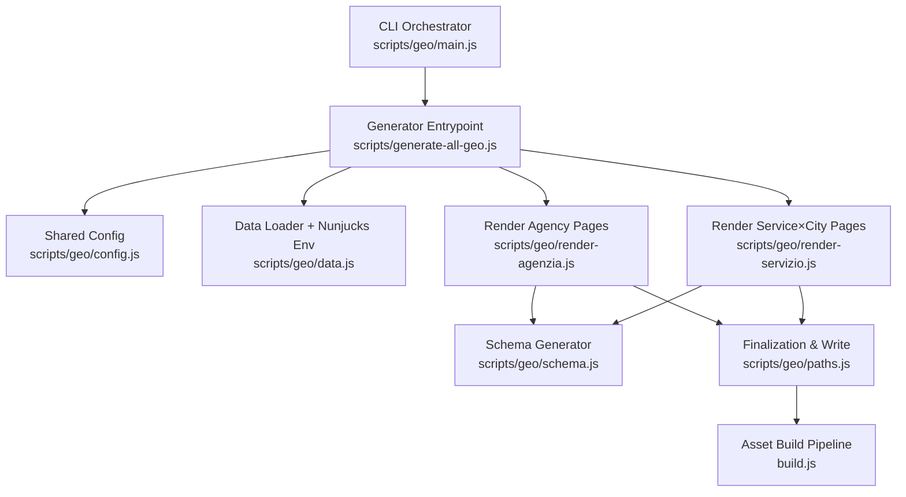
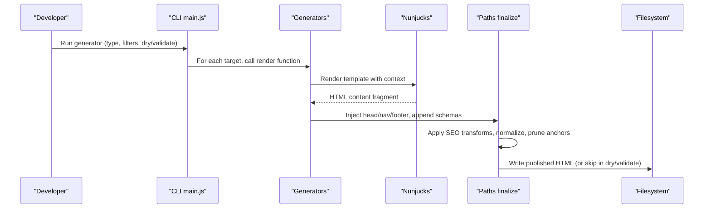
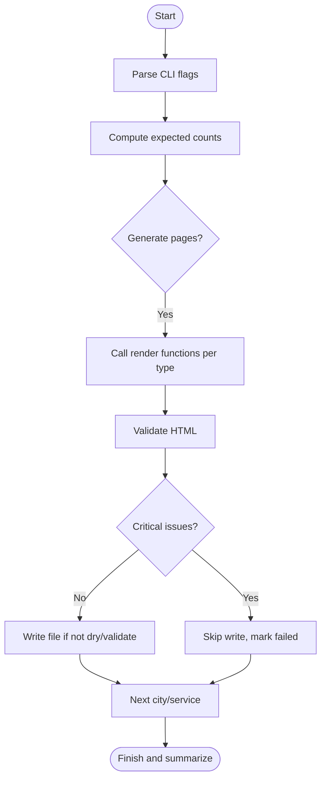
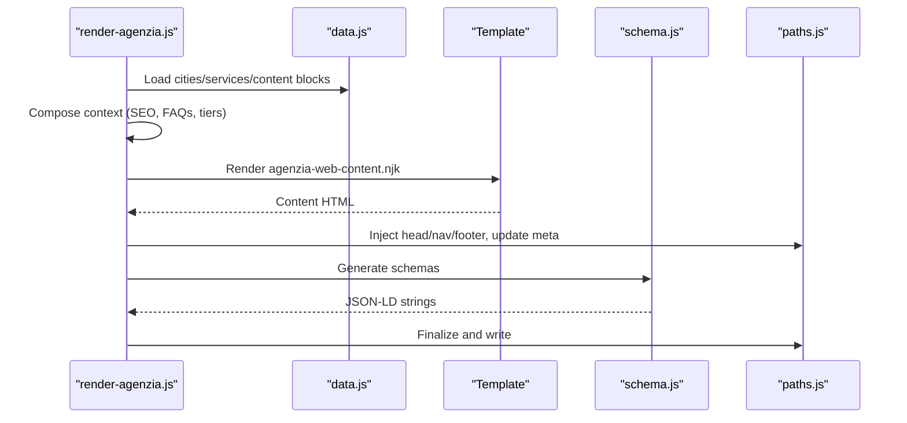
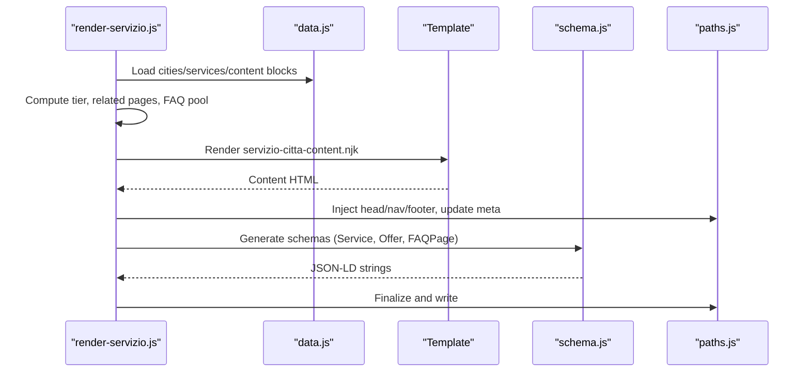
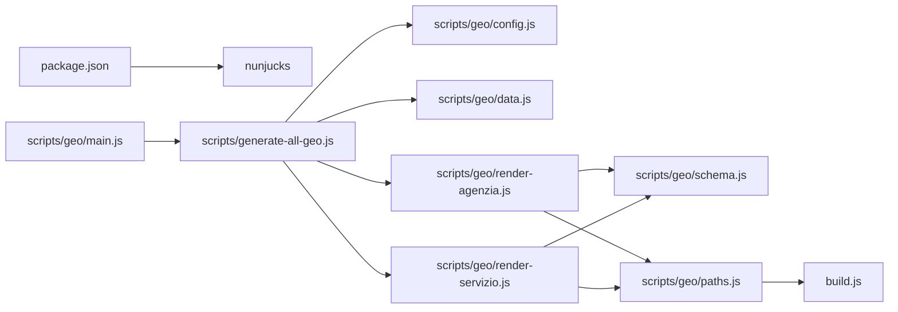

# Template Rendering Engine

<cite>
**Referenced Files in This Document**
- [package.json](file://package.json)
- [build.js](file://build.js)
- [scripts/generate-all-geo.js](file://scripts/generate-all-geo.js)
- [scripts/geo/main.js](file://scripts/geo/main.js)
- [scripts/geo/config.js](file://scripts/geo/config.js)
- [scripts/geo/data.js](file://scripts/geo/data.js)
- [scripts/geo/render-agenzia.js](file://scripts/geo/render-agenzia.js)
- [scripts/geo/render-servizio.js](file://scripts/geo/render-servizio.js)
- [scripts/geo/schema.js](file://scripts/geo/schema.js)
- [scripts/geo/paths.js](file://scripts/geo/paths.js)
- [templates/agenzia-web-content.njk](file://templates/agenzia-web-content.njk)
- [templates/servizio-citta-content.njk](file://templates/servizio-citta-content.njk)
</cite>

## Table of Contents
1. Introduction
2. Project Structure
3. Core Components
4. Architecture Overview
5. Detailed Component Analysis
6. Dependency Analysis
7. Performance Considerations
8. Troubleshooting Guide
9. Conclusion
10. Appendices

## Introduction
This document explains the template rendering engine that processes Nunjucks templates to generate optimized, geo-targeted HTML pages. It covers the full pipeline: data preparation, template compilation, asset optimization, and schema markup generation. It also documents integration with build scripts, caching strategies, conditional rendering, partial includes, dynamic content assembly, configuration examples, error handling patterns, debugging techniques, and guidance for extending the engine and optimizing performance at scale.

## Project Structure
The rendering system is composed of:
- A CLI orchestrator that drives page generation across multiple page types (agency, service×city, hubs).
- Data loaders that centralize cities, services, approved content blocks, and a configured Nunjucks environment.
- Page generators that assemble context, render Nunjucks templates, inject head/nav/footer from base pages, and append JSON-LD schemas.
- A post-processing layer that finalizes published HTML, applies SEO transforms, normalizes runtime scripts, and writes output files.
- A separate static asset build pipeline that minifies JS/CSS and optionally minifies hand-authored HTML.

**Diagram sources**
- [scripts/geo/main.js:1-292](file://scripts/geo/main.js#L1-L292)
- [scripts/generate-all-geo.js:1-58](file://scripts/generate-all-geo.js#L1-L58)
- [scripts/geo/config.js:1-114](file://scripts/geo/config.js#L1-L114)
- [scripts/geo/data.js:1-197](file://scripts/geo/data.js#L1-L197)
- [scripts/geo/render-agenzia.js:1-194](file://scripts/geo/render-agenzia.js#L1-L194)
- [scripts/geo/render-servizio.js:1-289](file://scripts/geo/render-servizio.js#L1-L289)
- [scripts/geo/schema.js:1-199](file://scripts/geo/schema.js#L1-L199)
- [scripts/geo/paths.js:1-120](file://scripts/geo/paths.js#L1-L120)
- [build.js:1-502](file://build.js#L1-L502)

**Section sources**
- [scripts/generate-all-geo.js:1-58](file://scripts/generate-all-geo.js#L1-L58)
- [scripts/geo/main.js:1-292](file://scripts/geo/main.js#L1-L292)
- [build.js:1-502](file://build.js#L1-L502)

## Core Components
- CLI orchestrator: coordinates generation by type (all, agenzia, realizzazione, servizio, hubs), filters by city/service, supports dry-run and validate-only modes, and persists link graphs and date metadata.
- Data loader: loads cities/services JSON, approved AI content blocks, blog index, configures Nunjucks with autoescape disabled and block trimming, and exposes helpers like locale formatting and blog link selection.
- Page generators:
  - Agency pages: assemble SEO copy, FAQs, nearest cities, related links, tier classification, optional Tier 1 editorial override, render Nunjucks template, inject head/nav/footer, append schemas.
  - Service×city pages: compute related pages, cluster-based FAQ pools, AI-enriched local context, tier-driven structural differentiation, render Nunjucks template, inject head/nav/footer, append schemas.
- Schema generator: builds BreadcrumbList, WebPage, Service, OfferCatalog, and FAQPage JSON-LD structures with area served entities and canonical URLs.
- Finalization pipeline: preserves governed custom blocks, applies SEO HTML transforms, normalizes entity JSON-LD and review actions, removes de-amplified anchors on non-indexable pages, rewrites runtime script paths, and writes files.

**Section sources**
- [scripts/geo/main.js:1-292](file://scripts/geo/main.js#L1-L292)
- [scripts/geo/data.js:1-197](file://scripts/geo/data.js#L1-L197)
- [scripts/geo/render-agenzia.js:1-194](file://scripts/geo/render-agenzia.js#L1-L194)
- [scripts/geo/render-servizio.js:1-289](file://scripts/geo/render-servizio.js#L1-L289)
- [scripts/geo/schema.js:1-199](file://scripts/geo/schema.js#L1-L199)
- [scripts/geo/paths.js:1-120](file://scripts/geo/paths.js#L1-L120)

## Architecture Overview
The rendering architecture separates concerns into clear layers:
- Orchestration: CLI flags control scope and mode; expected counts are computed and validated.
- Data: Centralized JSON sources plus approved content blocks feed templating; Nunjucks environment is configured once.
- Rendering: Generators compose context per page type, render Nunjucks templates, and merge with base page fragments.
- Post-processing: SEO transforms, entity normalization, anchor pruning for de-amplified pages, runtime script path rewriting, and file writing.
- Asset build: Separate pipeline minifies JS/CSS and optionally minifies hand-authored HTML.

**Diagram sources**
- [scripts/geo/main.js:1-292](file://scripts/geo/main.js#L1-L292)
- [scripts/geo/render-agenzia.js:1-194](file://scripts/geo/render-agenzia.js#L1-L194)
- [scripts/geo/render-servizio.js:1-289](file://scripts/geo/render-servizio.js#L1-L289)
- [scripts/geo/paths.js:1-120](file://scripts/geo/paths.js#L1-L120)

## Detailed Component Analysis

### CLI Orchestrator
- Parses CLI flags for type, dry-run, validate-only, output directory, report directory, and targeted city/service slugs.
- Computes expected page counts per category and tracks successes, skips, and blocked/failed outputs.
- Iterates through cities and services to generate agency, realization, and service×city pages, plus hub pages.
- Validates each generated page and blocks output on critical issues.
- Persists link graph and updates editorial dates after successful writes.

**Diagram sources**
- [scripts/geo/main.js:1-292](file://scripts/geo/main.js#L1-L292)

**Section sources**
- [scripts/geo/main.js:1-292](file://scripts/geo/main.js#L1-L292)

### Data Loader and Nunjucks Environment
- Loads cities and services JSON, computes core services and coverage sets, and builds lookup maps.
- Loads approved content blocks (AI-generated or editorial) with governance controls.
- Loads blog search index for cross-linking when available.
- Configures Nunjucks with autoescape disabled, block trimming, and a locale number filter.
- Exposes helper functions for price formatting, primary service URL/label, and avatar path resolution.

**Section sources**
- [scripts/geo/data.js:1-197](file://scripts/geo/data.js#L1-L197)

### Agency Page Generator
- Retrieves base page source and constructs canonical URL.
- Builds SEO copy and applies editorial overrides.
- Computes nearest cities, related pages, blog links, and resolves page tier.
- Optionally loads Tier 1 editorial override from approved content blocks.
- Renders Nunjucks template with rich context including city, services, FAQs, and editorial sections.
- Extracts head/nav/footer from base page, updates derived meta tags, and appends JSON-LD schemas.

**Diagram sources**
- [scripts/geo/render-agenzia.js:1-194](file://scripts/geo/render-agenzia.js#L1-L194)
- [scripts/geo/data.js:1-197](file://scripts/geo/data.js#L1-L197)
- [scripts/geo/schema.js:1-199](file://scripts/geo/schema.js#L1-L199)
- [scripts/geo/paths.js:1-120](file://scripts/geo/paths.js#L1-L120)

**Section sources**
- [scripts/geo/render-agenzia.js:1-194](file://scripts/geo/render-agenzia.js#L1-L194)

### Service×City Page Generator
- Determines page tier and canonical URL; computes related city and service pages based on indexability rules.
- Selects FAQ pool by service cluster (web build, marketing, strategy) and merges universal FAQs.
- Enriches local context using approved AI content blocks, varying angle by cluster to avoid duplication.
- Renders Nunjucks template with tier-aware structure (e.g., comparison table visibility).
- Injects head/nav/footer, updates meta, and appends comprehensive JSON-LD schemas including Service, Offer, and FAQPage.

**Diagram sources**
- [scripts/geo/render-servizio.js:1-289](file://scripts/geo/render-servizio.js#L1-L289)
- [scripts/geo/data.js:1-197](file://scripts/geo/data.js#L1-L197)
- [scripts/geo/schema.js:1-199](file://scripts/geo/schema.js#L1-L199)
- [scripts/geo/paths.js:1-120](file://scripts/geo/paths.js#L1-L120)

**Section sources**
- [scripts/geo/render-servizio.js:1-289](file://scripts/geo/render-servizio.js#L1-L289)

### Schema Markup Generation
- Builds BreadcrumbList, WebPage, Service, OfferCatalog, and FAQPage schemas.
- Uses area served entities with city or administrative area types, Wikipedia sameAs where available, and postal addresses for real municipalities.
- Ensures canonical IDs and language metadata; includes first deploy date and updated date tokens.

**Section sources**
- [scripts/geo/schema.js:1-199](file://scripts/geo/schema.js#L1-L199)

### Finalization and Publishing
- Preserves governed custom blocks from existing files.
- Applies SEO HTML transforms and normalizes entity JSON-LD and review action markup.
- Removes internal anchors to de-amplified geo pages on non-indexable pages.
- Rewrites runtime script references to use generated root prefixes and ensures noncritical loader inclusion.
- Writes finalized HTML to publish directory.

**Section sources**
- [scripts/geo/paths.js:1-120](file://scripts/geo/paths.js#L1-L120)

### Templates
- Agency content template renders hero, local context, tier 1 editorial slot, services grid, area served, market context, process steps, sectors, FAQs, blog links, and CTA.
- Service×city content template renders hero, service description, why choose, process, local market context, tier 1 editorial slot, competitive insight, decision framework, deliverables, intent queries, comparison table, FAQs, nearby cities, other services, and CTA.
- Both templates support safe HTML injection for dynamic content and leverage Nunjucks loops and conditionals.

**Section sources**
- [templates/agenzia-web-content.njk:1-278](file://templates/agenzia-web-content.njk#L1-L278)
- [templates/servizio-citta-content.njk:1-374](file://templates/servizio-citta-content.njk#L1-L374)

## Dependency Analysis
Key dependencies and relationships:
- package.json declares nunjucks as a runtime dependency and dev tools for asset building.
- The generator entrypoint re-exports core modules for external tooling compatibility.
- Shared config centralizes site constants, CLI flags, and governance helpers for indexation directives and tier checks.
- Data module depends on config for roots and publish directories and integrates with content claim governance.
- Generators depend on data, config, schema, paths, and utilities for HTML processing.
- Finalization depends on SEO transforms, entity facts, site footer normalization, and content claim governance.

**Diagram sources**
- [package.json:1-92](file://package.json#L1-L92)
- [scripts/generate-all-geo.js:1-58](file://scripts/generate-all-geo.js#L1-L58)
- [scripts/geo/config.js:1-114](file://scripts/geo/config.js#L1-L114)
- [scripts/geo/data.js:1-197](file://scripts/geo/data.js#L1-L197)
- [scripts/geo/render-agenzia.js:1-194](file://scripts/geo/render-agenzia.js#L1-L194)
- [scripts/geo/render-servizio.js:1-289](file://scripts/geo/render-servizio.js#L1-L289)
- [scripts/geo/schema.js:1-199](file://scripts/geo/schema.js#L1-L199)
- [scripts/geo/paths.js:1-120](file://scripts/geo/paths.js#L1-L120)
- [build.js:1-502](file://build.js#L1-L502)

**Section sources**
- [package.json:1-92](file://package.json#L1-L92)
- [scripts/generate-all-geo.js:1-58](file://scripts/generate-all-geo.js#L1-L58)

## Performance Considerations
- Base page caching: Base HTML pages are read once and cached to avoid repeated filesystem reads during generation.
- Conditional rendering: Tier-based logic reduces output size on de-amplified pages by omitting heavy sections like comparison tables and extensive linking.
- Approved content blocks: Only verified AI/editorial content is loaded, reducing unnecessary processing and ensuring consistent output.
- Asset minification: The build pipeline uses efficient CSS minification with Lightning CSS and a CleanCSS fallback, and JS minification via Terser with dead code elimination and console stripping.
- HTML minification: Optional HTML minifier processes only hand-authored HTML under src/html, leaving geo-generated pages untouched to preserve schema and structure.
- Script path rewriting: Runtime scripts are rewritten to use generated root prefixes and ensure noncritical loading without duplication.

[No sources needed since this section provides general guidance]

## Troubleshooting Guide
Common issues and diagnostics:
- Missing base page: If the base page source is not found, generation returns null; verify the base page exists in the base pages directory.
- Validation failures: Critical validation issues block output; inspect warnings and errors logged during generation and adjust content or configuration accordingly.
- Dry-run and validate-only modes: Use these modes to preview generation without writing files and to catch issues early.
- CLI filtering: Filter by city or service slug to narrow generation scope for faster iteration.
- Output inspection: Check the generated HTML for correct meta tags, canonical URLs, robots directives, and embedded JSON-LD schemas.
- Asset build errors: Review minification logs for JS/CSS failures; Lightning CSS fallbacks are logged with reasons.

**Section sources**
- [scripts/geo/render-agenzia.js:1-194](file://scripts/geo/render-agenzia.js#L1-L194)
- [scripts/geo/render-servizio.js:1-289](file://scripts/geo/render-servizio.js#L1-L289)
- [scripts/geo/main.js:1-292](file://scripts/geo/main.js#L1-L292)
- [build.js:1-502](file://build.js#L1-L502)

## Conclusion
The rendering engine combines centralized data, configurable Nunjucks templates, robust schema generation, and a disciplined finalization pipeline to produce high-quality, geo-targeted HTML at scale. Tier-based differentiation, approved content governance, and careful asset optimization ensure both performance and SEO integrity. The modular design makes it straightforward to extend with new page types, additional templates, and enhanced data enrichment while maintaining reliable builds and validations.

[No sources needed since this section summarizes without analyzing specific files]

## Appendices

### Rendering Configuration Examples
- CLI usage:
  - Generate all pages: node scripts/generate-all-geo.js
  - Dry run: node scripts/generate-all-geo.js --dry-run
  - Validate only: node scripts/generate-all-geo.js --validate-only
  - Type filter: node scripts/generate-all-geo.js --type=agenzia
  - City filter: node scripts/generate-all-geo.js --city=rho,milano
  - Service filter: node scripts/generate-all-geo.js --service=seo-locale
  - Output directory: node scripts/generate-all-geo.js --out-dir=dist
- Nunjucks environment:
  - Autoescape disabled for controlled HTML injection.
  - Block trimming enabled for clean output.
  - Locale number filter available for formatted numbers.

**Section sources**
- [scripts/geo/config.js:1-114](file://scripts/geo/config.js#L1-L114)
- [scripts/geo/data.js:1-197](file://scripts/geo/data.js#L1-L197)

### Extending the Rendering Engine
- Add a new template:
  - Create a new Nunjucks template under templates/.
  - Define required variables and conditional sections.
  - Update a generator to render the new template with appropriate context.
- Add a new page type:
  - Implement a generator function similar to agency or service×city.
  - Integrate with the CLI orchestrator to include the new type in generation loops.
  - Extend schema generation to include relevant structured data.
- Optimize for large-scale production:
  - Leverage tier-based rendering to reduce output size.
  - Use approved content blocks to control content volume and quality.
  - Employ CLI filters to limit scope during development and testing.
  - Monitor asset build performance and adjust minification options as needed.

**Section sources**
- [scripts/geo/render-agenzia.js:1-194](file://scripts/geo/render-agenzia.js#L1-L194)
- [scripts/geo/render-servizio.js:1-289](file://scripts/geo/render-servizio.js#L1-L289)
- [scripts/geo/main.js:1-292](file://scripts/geo/main.js#L1-L292)
- [scripts/geo/schema.js:1-199](file://scripts/geo/schema.js#L1-L199)
- [build.js:1-502](file://build.js#L1-L502)